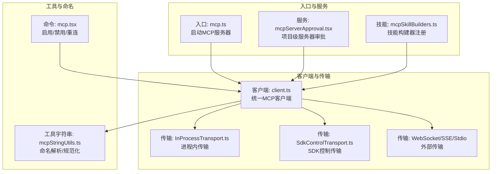
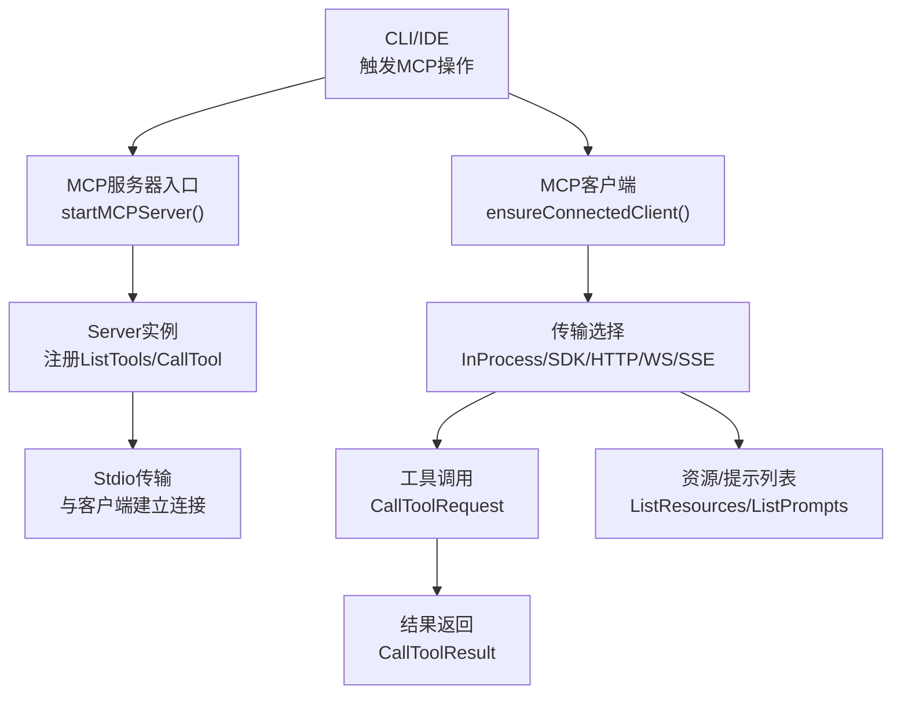
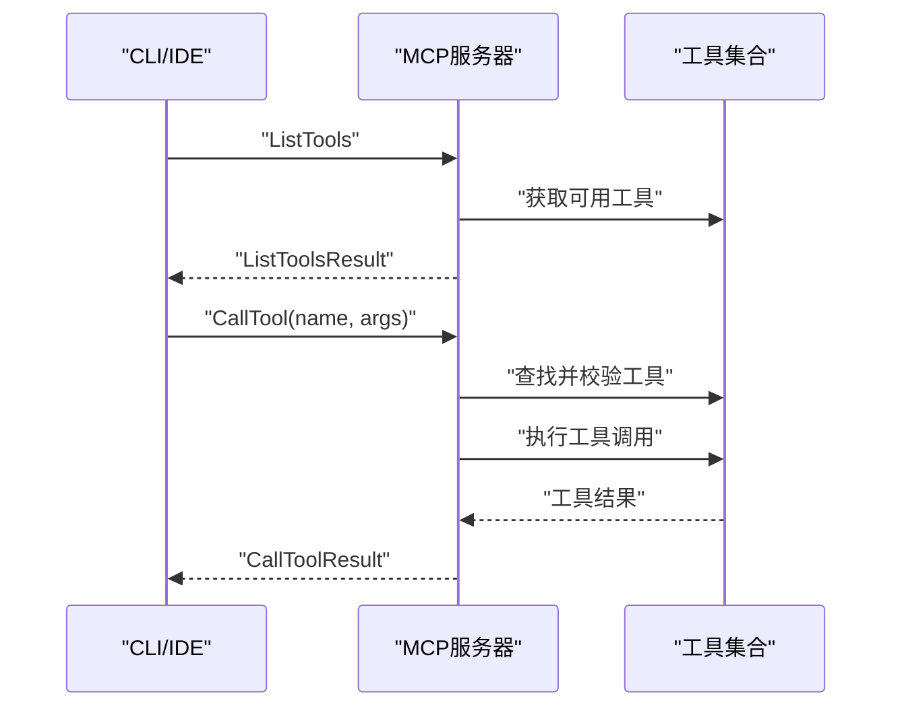
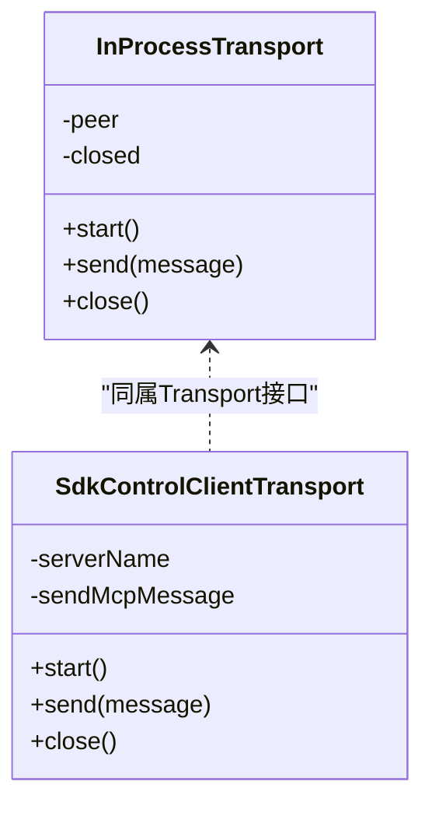
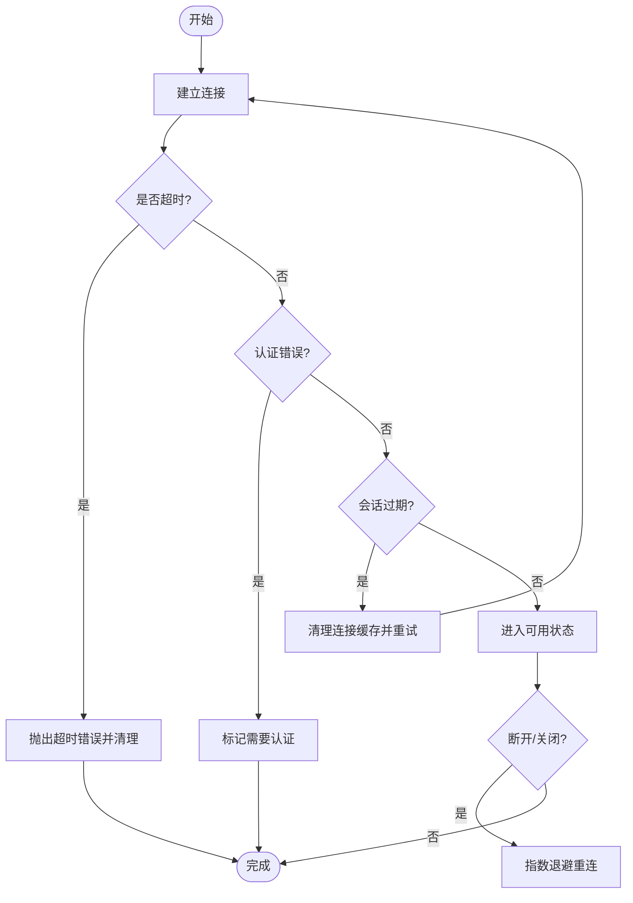
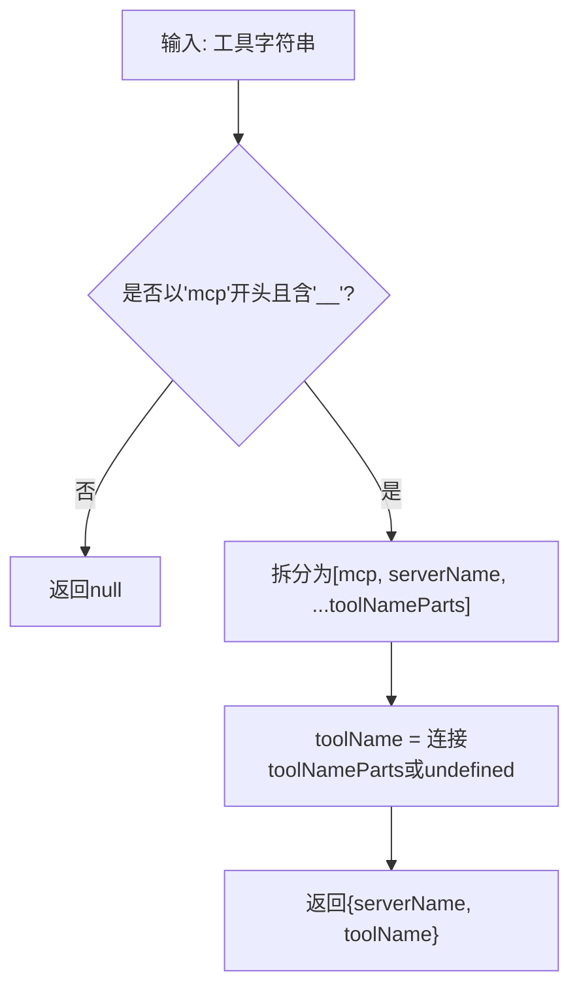
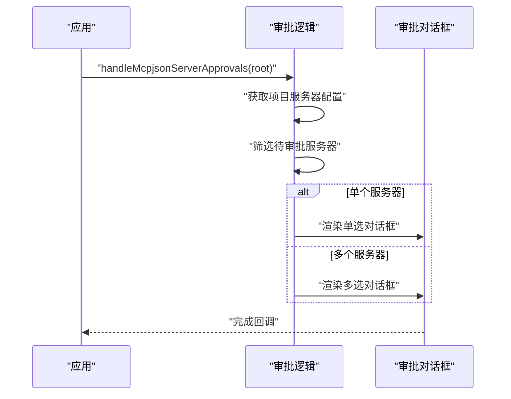
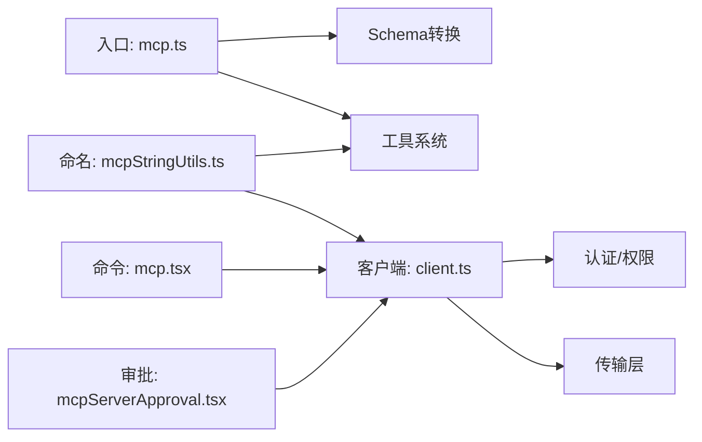

# MCP协议概述

<cite>
**本文档引用的文件**
- [src/entrypoints/mcp.ts](file://src/entrypoints/mcp.ts)
- [src/services/mcp/InProcessTransport.ts](file://src/services/mcp/InProcessTransport.ts)
- [src/services/mcp/SdkControlTransport.ts](file://src/services/mcp/SdkControlTransport.ts)
- [src/services/mcp/mcpStringUtils.ts](file://src/services/mcp/mcpStringUtils.ts)
- [src/services/mcpServerApproval.tsx](file://src/services/mcpServerApproval.tsx)
- [src/skills/mcpSkillBuilders.ts](file://src/skills/mcpSkillBuilders.ts)
- [src/commands/mcp/mcp.tsx](file://src/commands/mcp/mcp.tsx)
- [src/services/mcp/client.ts](file://src/services/mcp/client.ts)
- [src/cli/print.ts](file://src/cli/print.ts)
</cite>

## 目录
1. [引言](#引言)
2. [项目结构](#项目结构)
3. [核心组件](#核心组件)
4. [架构总览](#架构总览)
5. [详细组件分析](#详细组件分析)
6. [依赖关系分析](#依赖关系分析)
7. [性能考量](#性能考量)
8. [故障排查指南](#故障排查指南)
9. [结论](#结论)
10. [附录](#附录)

## 引言
本文件系统性阐述MCP（模型上下文协议）在Claude Code中的设计与实现，包括协议核心理念、数据格式、消息结构、通信模式、与传统API的差异与优势，以及标准规范与实现要点。文档同时给出使用场景与最佳实践建议，帮助开发者与使用者高效理解并正确应用MCP能力。

## 项目结构
MCP在Claude Code中以“入口可执行程序 + 多种传输适配 + 客户端管理 + 工具/资源暴露 + 权限与命名约定”的方式组织，覆盖本地进程、SDK内联、HTTP/WS、SSE等多种运行形态，并通过统一的MCP客户端抽象屏蔽底层差异。

**图表来源**
- [src/entrypoints/mcp.ts:35-196](file://src/entrypoints/mcp.ts#L35-L196)
- [src/services/mcpServerApproval.tsx:15-40](file://src/services/mcpServerApproval.tsx#L15-L40)
- [src/skills/mcpSkillBuilders.ts:31-44](file://src/skills/mcpSkillBuilders.ts#L31-L44)
- [src/services/mcp/client.ts:1-200](file://src/services/mcp/client.ts#L1-L200)
- [src/services/mcp/InProcessTransport.ts:11-63](file://src/services/mcp/InProcessTransport.ts#L11-L63)
- [src/services/mcp/SdkControlTransport.ts:60-86](file://src/services/mcp/SdkControlTransport.ts#L60-L86)
- [src/services/mcp/mcpStringUtils.ts:19-106](file://src/services/mcp/mcpStringUtils.ts#L19-L106)
- [src/commands/mcp/mcp.tsx:63-84](file://src/commands/mcp/mcp.tsx#L63-L84)

**章节来源**
- [src/entrypoints/mcp.ts:35-196](file://src/entrypoints/mcp.ts#L35-L196)
- [src/services/mcpServerApproval.tsx:15-40](file://src/services/mcpServerApproval.tsx#L15-L40)
- [src/skills/mcpSkillBuilders.ts:31-44](file://src/skills/mcpSkillBuilders.ts#L31-L44)
- [src/services/mcp/client.ts:1-200](file://src/services/mcp/client.ts#L1-L200)
- [src/services/mcp/InProcessTransport.ts:11-63](file://src/services/mcp/InProcessTransport.ts#L11-L63)
- [src/services/mcp/SdkControlTransport.ts:60-86](file://src/services/mcp/SdkControlTransport.ts#L60-L86)
- [src/services/mcp/mcpStringUtils.ts:19-106](file://src/services/mcp/mcpStringUtils.ts#L19-L106)
- [src/commands/mcp/mcp.tsx:63-84](file://src/commands/mcp/mcp.tsx#L63-L84)

## 核心组件
- MCP服务器入口：负责初始化Server、注册ListTools/CallTool处理器、建立Stdio传输并对外提供工具能力。
- 传输层适配：支持进程内InProcessTransport、SDK控制传输SdkControlClientTransport，以及HTTP/WS/SSE等外部传输。
- 客户端管理：统一的MCP客户端封装，负责连接、超时、重连、认证错误处理、会话过期检测与恢复。
- 命名与权限：提供MCP工具/服务器名称解析、前缀生成、显示名提取与权限匹配规则。
- 项目级审批：对项目范围内的MCP服务器进行待审批状态管理与交互式确认。
- 技能构建器：为MCP技能发现提供只依赖类型的注册点，避免循环依赖。

**章节来源**
- [src/entrypoints/mcp.ts:35-196](file://src/entrypoints/mcp.ts#L35-L196)
- [src/services/mcp/InProcessTransport.ts:11-63](file://src/services/mcp/InProcessTransport.ts#L11-L63)
- [src/services/mcp/SdkControlTransport.ts:60-86](file://src/services/mcp/SdkControlTransport.ts#L60-L86)
- [src/services/mcp/client.ts:1-200](file://src/services/mcp/client.ts#L1-L200)
- [src/services/mcp/mcpStringUtils.ts:19-106](file://src/services/mcp/mcpStringUtils.ts#L19-L106)
- [src/services/mcpServerApproval.tsx:15-40](file://src/services/mcpServerApproval.tsx#L15-L40)
- [src/skills/mcpSkillBuilders.ts:31-44](file://src/skills/mcpSkillBuilders.ts#L31-L44)

## 架构总览
MCP在Claude Code中采用“服务器入口 + 统一客户端 + 多传输适配”的分层架构。服务器入口通过Stdio与CLI或IDE集成；客户端抽象屏蔽不同传输类型，提供统一的工具调用与资源访问接口；命名与权限模块确保工具可见性与安全策略一致；项目级审批保障用户对新服务器的知情与同意。

**图表来源**
- [src/entrypoints/mcp.ts:35-196](file://src/entrypoints/mcp.ts#L35-L196)
- [src/services/mcp/client.ts:1688-1704](file://src/services/mcp/client.ts#L1688-L1704)
- [src/services/mcp/InProcessTransport.ts:11-63](file://src/services/mcp/InProcessTransport.ts#L11-L63)
- [src/services/mcp/SdkControlTransport.ts:60-86](file://src/services/mcp/SdkControlTransport.ts#L60-L86)

## 详细组件分析

### 服务器入口与工具暴露
- 初始化Server并声明capabilities（如tools），注册ListTools处理器用于列举可用工具；注册CallTool处理器用于执行工具调用。
- 将工具的输入/输出Schema转换为MCP兼容格式，过滤不支持的根级联合类型，保证SDK兼容性。
- 在CallTool路径中构造工具调用上下文，注入命令集合、主循环模型、调试参数等，最终将结果包装为文本内容返回。

**图表来源**
- [src/entrypoints/mcp.ts:59-96](file://src/entrypoints/mcp.ts#L59-L96)
- [src/entrypoints/mcp.ts:99-187](file://src/entrypoints/mcp.ts#L99-L187)

**章节来源**
- [src/entrypoints/mcp.ts:35-196](file://src/entrypoints/mcp.ts#L35-L196)

### 传输层适配
- 进程内传输InProcessTransport：在同一进程中模拟客户端与服务器的双向通信，避免子进程开销，适合SDK内联场景。
- SDK控制传输SdkControlClientTransport：在CLI侧桥接SDK进程间的消息，将MCP协议消息转化为控制请求并通过stdout/stdin传递。
- 其他传输：Stdio、WebSocket、SSE、可流式HTTP等，满足不同部署形态与网络环境需求。

**图表来源**
- [src/services/mcp/InProcessTransport.ts:11-63](file://src/services/mcp/InProcessTransport.ts#L11-L63)
- [src/services/mcp/SdkControlTransport.ts:60-86](file://src/services/mcp/SdkControlTransport.ts#L60-L86)

**章节来源**
- [src/services/mcp/InProcessTransport.ts:11-63](file://src/services/mcp/InProcessTransport.ts#L11-L63)
- [src/services/mcp/SdkControlTransport.ts:60-86](file://src/services/mcp/SdkControlTransport.ts#L60-L86)

### 客户端管理与连接生命周期
- 统一客户端封装：负责连接建立、超时控制、自动重连（指数退避）、认证错误捕获、会话过期检测与恢复。
- 连接缓存与失效：对非SDK服务器使用连接缓存，若连接断开则尝试重新连接；SDK服务器走内联流程，不参与外部分离的重连。
- 动态服务器协调：根据期望配置与当前状态对比，处理新增、移除、替换与错误聚合。

**图表来源**
- [src/services/mcp/client.ts:1048-1077](file://src/services/mcp/client.ts#L1048-L1077)
- [src/services/mcp/client.ts:1688-1704](file://src/services/mcp/client.ts#L1688-L1704)
- [src/services/mcp/client.ts:354-415](file://src/services/mcp/client.ts#L354-L415)

**章节来源**
- [src/services/mcp/client.ts:1048-1077](file://src/services/mcp/client.ts#L1048-L1077)
- [src/services/mcp/client.ts:1688-1704](file://src/services/mcp/client.ts#L1688-L1704)
- [src/services/mcp/client.ts:354-415](file://src/services/mcp/client.ts#L354-L415)

### 命名与权限规则
- 名称解析：从工具字符串解析出服务器与工具名，支持双下划线分隔的命名约定。
- 前缀生成：为服务器生成mcp__serverName__前缀，便于工具全名拼接与显示名剥离。
- 显示名提取：去除“(MCP)”后缀与服务器前缀，得到用户可见的工具显示名。
- 权限匹配：对MCP工具使用全限定名进行权限规则匹配，避免与内置工具冲突。

**图表来源**
- [src/services/mcp/mcpStringUtils.ts:19-32](file://src/services/mcp/mcpStringUtils.ts#L19-L32)

**章节来源**
- [src/services/mcp/mcpStringUtils.ts:19-106](file://src/services/mcp/mcpStringUtils.ts#L19-L106)

### 项目级服务器审批
- 扫描项目范围内的待审批服务器，按单个或批量弹窗确认，渲染在现有Ink根实例上，避免重复创建UI实例。
- 支持单一服务器审批对话框与多选对话框两种交互形式。

**图表来源**
- [src/services/mcpServerApproval.tsx:15-40](file://src/services/mcpServerApproval.tsx#L15-L40)

**章节来源**
- [src/services/mcpServerApproval.tsx:15-40](file://src/services/mcpServerApproval.tsx#L15-L40)

### 技能构建器注册
- 提供只依赖类型的注册点，避免动态导入在特定打包环境下形成循环依赖。
- 在模块初始化时注册构建器，供MCP技能发现使用。

**章节来源**
- [src/skills/mcpSkillBuilders.ts:31-44](file://src/skills/mcpSkillBuilders.ts#L31-L44)

### 命令行与设置界面
- /mcp命令支持启用/禁用指定服务器、重连、跳转到插件设置页等操作。
- 通过React组件与全局状态配合，实现一键切换与批量管理。

**章节来源**
- [src/commands/mcp/mcp.tsx:63-84](file://src/commands/mcp/mcp.tsx#L63-L84)

## 依赖关系分析
- 服务器入口依赖工具系统与Schema转换，向客户端暴露工具能力。
- 客户端依赖多种传输实现，统一抽象于Transport接口之上。
- 命名与权限模块被工具系统与客户端共同依赖，确保一致性。
- 项目级审批与命令行组件分别面向用户交互与批量运维。

**图表来源**
- [src/entrypoints/mcp.ts:35-196](file://src/entrypoints/mcp.ts#L35-L196)
- [src/services/mcp/client.ts:1-200](file://src/services/mcp/client.ts#L1-L200)
- [src/services/mcp/mcpStringUtils.ts:19-106](file://src/services/mcp/mcpStringUtils.ts#L19-L106)
- [src/services/mcpServerApproval.tsx:15-40](file://src/services/mcpServerApproval.tsx#L15-L40)
- [src/commands/mcp/mcp.tsx:63-84](file://src/commands/mcp/mcp.tsx#L63-L84)

**章节来源**
- [src/entrypoints/mcp.ts:35-196](file://src/entrypoints/mcp.ts#L35-L196)
- [src/services/mcp/client.ts:1-200](file://src/services/mcp/client.ts#L1-L200)
- [src/services/mcp/mcpStringUtils.ts:19-106](file://src/services/mcp/mcpStringUtils.ts#L19-L106)
- [src/services/mcpServerApproval.tsx:15-40](file://src/services/mcpServerApproval.tsx#L15-L40)
- [src/commands/mcp/mcp.tsx:63-84](file://src/commands/mcp/mcp.tsx#L63-L84)

## 性能考量
- 进程内传输避免子进程开销，适合SDK内联场景；但需注意同步调用可能带来的栈深度问题，已通过微任务异步投递缓解。
- 工具Schema转换仅在列举工具时进行，减少不必要的计算。
- 客户端连接缓存与指数退避重连降低频繁重建连接的代价。
- 对大输出内容进行尺寸估算与截断，避免超出限制导致失败或性能抖动。

[本节为通用指导，无需列出具体文件来源]

## 故障排查指南
- 连接超时：检查服务器可达性、传输类型与代理配置，关注日志中的超时时间与清理动作。
- 认证错误：当服务器返回401时，客户端会抛出自定义认证错误，需更新凭据或触发重新授权。
- 会话过期：服务器返回“Session not found”时，客户端会清理缓存并要求重新获取有效客户端后重试。
- 输出过大：工具返回内容超过限制时会被截断，可通过调整工具或优化输出策略解决。
- 重连失败：确认服务器未被禁用、网络稳定、指数退避策略生效，必要时手动重连或检查配置变更。

**章节来源**
- [src/services/mcp/client.ts:1048-1077](file://src/services/mcp/client.ts#L1048-L1077)
- [src/services/mcp/client.ts:193-200](file://src/services/mcp/client.ts#L193-L200)
- [src/services/mcp/client.ts:354-415](file://src/services/mcp/client.ts#L354-L415)

## 结论
MCP在Claude Code中提供了统一、可扩展、安全可控的工具与资源访问框架。通过标准化的服务器入口、多传输适配、完善的客户端生命周期管理与命名/权限规则，MCP既兼容传统API的灵活性，又具备更强的一致性、可观测性与可维护性。结合项目级审批与命令行管理，MCP能够安全地融入开发工作流，提升自动化与智能化水平。

[本节为总结性内容，无需列出具体文件来源]

## 附录

### 数据格式与消息结构
- 请求与响应遵循MCP JSON-RPC规范，服务器入口提供ListTools与CallTool两类核心请求。
- CallTool返回内容以文本块形式承载，错误结果可携带元信息以便诊断。

**章节来源**
- [src/entrypoints/mcp.ts:59-96](file://src/entrypoints/mcp.ts#L59-L96)
- [src/entrypoints/mcp.ts:99-187](file://src/entrypoints/mcp.ts#L99-L187)

### 通信模式
- 服务器-客户端：通过Stdio建立连接，客户端发起工具调用，服务器返回结果。
- 进程内：使用InProcessTransport实现零开销通信，适合SDK内联场景。
- 控制桥接：SdkControlClientTransport将消息转发至SDK进程，实现CLI与SDK之间的解耦。

**章节来源**
- [src/entrypoints/mcp.ts:190-196](file://src/entrypoints/mcp.ts#L190-L196)
- [src/services/mcp/InProcessTransport.ts:11-63](file://src/services/mcp/InProcessTransport.ts#L11-L63)
- [src/services/mcp/SdkControlTransport.ts:60-86](file://src/services/mcp/SdkControlTransport.ts#L60-L86)

### 与传统API的区别与优势
- 标准化：基于MCP规范，统一工具与资源的描述、调用与发现机制。
- 可移植：多传输适配使MCP可在不同运行环境中复用同一套能力。
- 安全可控：严格的命名与权限规则、项目级审批、认证错误处理与会话过期检测，提升安全性与可审计性。
- 可观测：统一的日志与错误类型，便于定位问题与优化性能。

**章节来源**
- [src/services/mcp/mcpStringUtils.ts:19-106](file://src/services/mcp/mcpStringUtils.ts#L19-L106)
- [src/services/mcpServerApproval.tsx:15-40](file://src/services/mcpServerApproval.tsx#L15-L40)
- [src/services/mcp/client.ts:152-186](file://src/services/mcp/client.ts#L152-L186)

### 使用场景与最佳实践
- 自动化工具集成：通过CallTool统一调用各类工具，避免分散的API适配。
- 资源与提示管理：利用ListResources与ListPrompts发现与读取资源，提升上下文质量。
- 安全发布：在项目范围内先审批再启用，确保用户对新服务器有明确感知。
- 稳定性保障：合理配置重连策略与超时时间，关注输出大小与错误元信息，及时优化工具实现。

**章节来源**
- [src/commands/mcp/mcp.tsx:63-84](file://src/commands/mcp/mcp.tsx#L63-L84)
- [src/cli/print.ts:5450-5479](file://src/cli/print.ts#L5450-L5479)