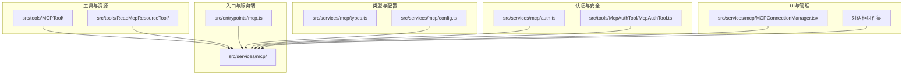
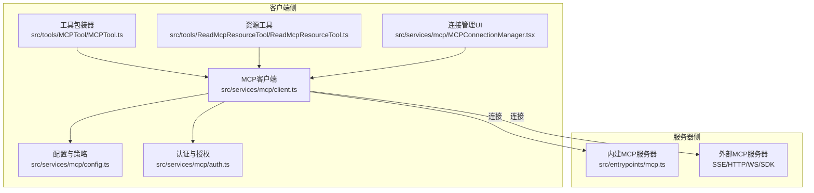
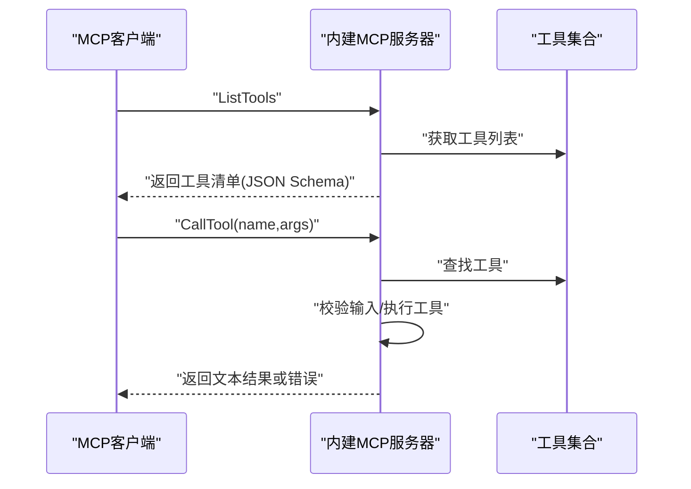
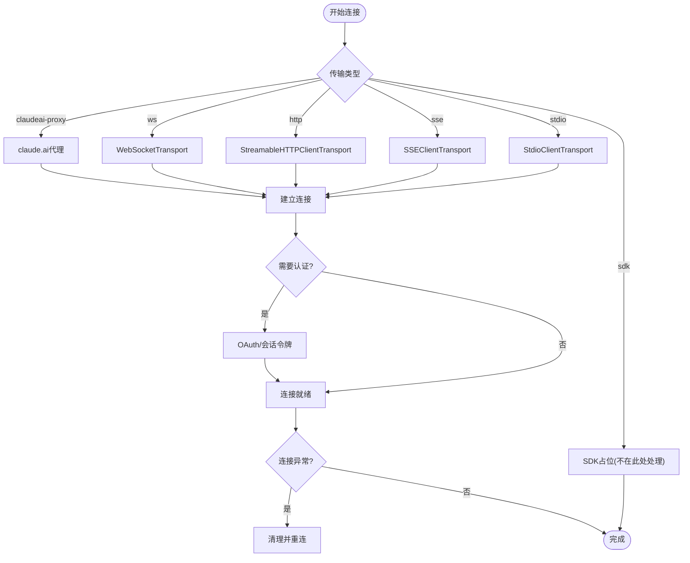
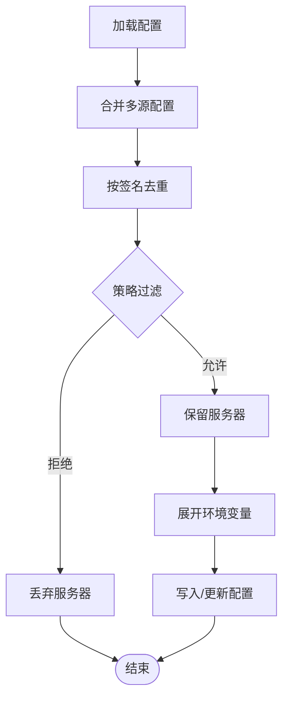
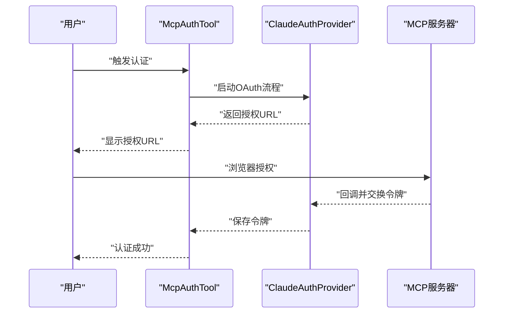
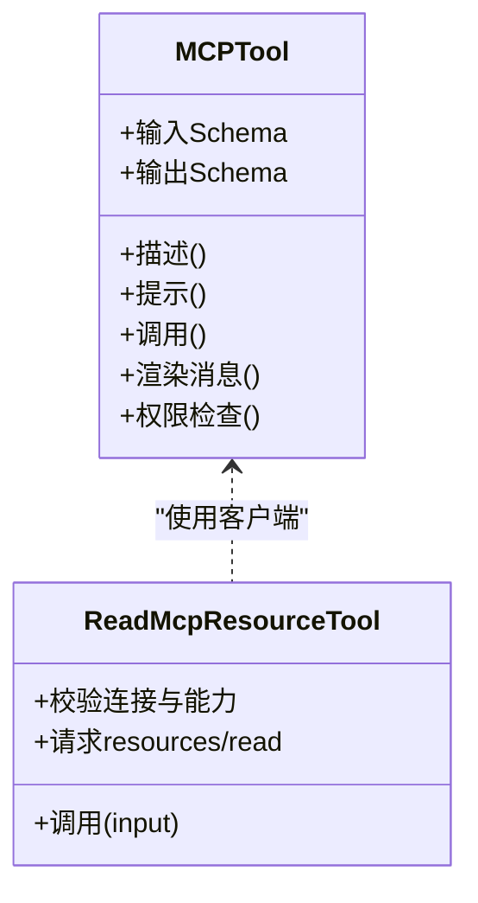
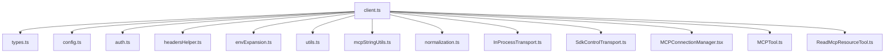

# MCP协议集成

<cite>
**本文档引用的文件**
- [src/entrypoints/mcp.ts](file://src/entrypoints/mcp.ts)
- [src/services/mcp/client.ts](file://src/services/mcp/client.ts)
- [src/services/mcp/config.ts](file://src/services/mcp/config.ts)
- [src/services/mcp/types.ts](file://src/services/mcp/types.ts)
- [src/tools/MCPTool/MCPTool.ts](file://src/tools/MCPTool/MCPTool.ts)
- [src/tools/ReadMcpResourceTool/ReadMcpResourceTool.ts](file://src/tools/ReadMcpResourceTool/ReadMcpResourceTool.ts)
- [src/services/mcp/auth.ts](file://src/services/mcp/auth.ts)
- [src/tools/McpAuthTool/McpAuthTool.ts](file://src/tools/McpAuthTool/McpAuthTool.ts)
- [src/services/mcp/mcpStringUtils.ts](file://src/services/mcp/mcpStringUtils.ts)
- [src/services/mcp/normalization.ts](file://src/services/mcp/normalization.ts)
- [src/services/mcp/utils.ts](file://src/services/mcp/utils.ts)
- [src/services/mcp/headersHelper.ts](file://src/services/mcp/headersHelper.ts)
- [src/services/mcp/envExpansion.ts](file://src/services/mcp/envExpansion.ts)
- [src/services/mcp/officialRegistry.ts](file://src/services/mcp/officialRegistry.ts)
- [src/services/mcp/xaa.ts](file://src/services/mcp/xaa.ts)
- [src/services/mcp/xaaIdpLogin.ts](file://src/services/mcp/xaaIdpLogin.ts)
- [src/services/mcp/claudeai.ts](file://src/services/mcp/claudeai.ts)
- [src/services/mcp/useManageMCPConnections.ts](file://src/services/mcp/useManageMCPConnections.ts)
- [src/services/mcp/MCPConnectionManager.tsx](file://src/services/mcp/MCPConnectionManager.tsx)
- [src/services/mcp/SdkControlTransport.ts](file://src/services/mcp/SdkControlTransport.ts)
- [src/services/mcp/InProcessTransport.ts](file://src/services/mcp/InProcessTransport.ts)
- [src/services/mcp/mcpServerApproval.tsx](file://src/services/mcp/mcpServerApproval.tsx)
- [src/services/mcp/mcpServerDialog.tsx](file://src/services/mcp/mcpServerDialog.tsx)
- [src/services/mcp/mcpServerMultiselectDialog.tsx](file://src/services/mcp/mcpServerMultiselectDialog.tsx)
- [src/services/mcp/mcpServerDesktopImportDialog.tsx](file://src/services/mcp/mcpServerDesktopImportDialog.tsx)
- [src/services/mcp/mcpServerDialogCopy.tsx](file://src/services/mcp/mcpServerDialogCopy.tsx)
- [src/services/mcp/channelPermissions.ts](file://src/services/mcp/channelPermissions.ts)
- [src/services/mcp/channelAllowlist.ts](file://src/services/mcp/channelAllowlist.ts)
- [src/services/mcp/channelNotification.ts](file://src/services/mcp/channelNotification.ts)
- [src/services/mcp/elicitationHandler.ts](file://src/services/mcp/elicitationHandler.ts)
- [src/services/mcp/skillBuilders.ts](file://src/services/mcp/skillBuilders.ts)
- [src/skills/mcpSkillBuilders.ts](file://src/skills/mcpSkillBuilders.ts)
- [tasks/MonitorMcpTask/MonitorMcpTask.js](file://tasks/MonitorMcpTask/MonitorMcpTask.js)
</cite>

## 目录
1. [简介](#简介)
2. [项目结构](#项目结构)
3. [核心组件](#核心组件)
4. [架构总览](#架构总览)
5. [详细组件分析](#详细组件分析)
6. [依赖关系分析](#依赖关系分析)
7. [性能考虑](#性能考虑)
8. [故障排除指南](#故障排除指南)
9. [结论](#结论)
10. [附录](#附录)

## 简介
本文件面向Claude Code MCP（模型上下文协议）集成的技术文档，系统阐述MCP协议在Claude Code中的实现与使用方式。内容涵盖MCP协议基础概念、架构设计、连接管理（服务器发现、客户端生命周期、认证机制）、工具包装器设计、资源与工具注册机制、传输层支持（stdio、sse、http、ws），以及服务器配置与管理、最佳实践与权限控制集成。

## 项目结构
Claude Code中MCP相关代码主要分布在以下模块：
- 入口与服务端：`src/entrypoints/mcp.ts` 提供内建MCP服务器；`src/services/mcp/` 提供客户端连接、配置、认证、传输等核心能力
- 工具与资源：`src/tools/MCPTool/` 提供通用MCP工具包装；`src/tools/ReadMcpResourceTool/` 提供资源读取工具
- 类型与配置：`src/services/mcp/types.ts` 定义MCP配置类型；`src/services/mcp/config.ts` 管理服务器配置与策略
- 认证与安全：`src/services/mcp/auth.ts` 实现OAuth与跨应用访问；`src/tools/McpAuthTool/McpAuthTool.ts` 提供认证工具
- UI与管理：`src/services/mcp/MCPConnectionManager.tsx` 等提供连接管理界面与对话框
- 技能与发现：`src/services/mcp/skillBuilders.ts` 与`src/skills/mcpSkillBuilders.ts` 支持MCP技能发现

图表来源
- [src/entrypoints/mcp.ts:1-197](file://src/entrypoints/mcp.ts#L1-L197)
- [src/services/mcp/client.ts:1-800](file://src/services/mcp/client.ts#L1-L800)
- [src/services/mcp/config.ts:1-800](file://src/services/mcp/config.ts#L1-L800)

章节来源
- [src/entrypoints/mcp.ts:1-197](file://src/entrypoints/mcp.ts#L1-L197)
- [src/services/mcp/client.ts:1-800](file://src/services/mcp/client.ts#L1-L800)
- [src/services/mcp/config.ts:1-800](file://src/services/mcp/config.ts#L1-L800)

## 核心组件
- 内建MCP服务器：通过`startMCPServer`启动，基于MCP SDK Server，提供工具列表与调用处理，支持stdio传输
- MCP客户端：统一的客户端连接器，支持多种传输（stdio、sse、http、ws、sdk、claudeai-proxy），具备连接超时、错误检测与重连、清理流程
- 配置与策略：集中管理服务器配置、企业策略、允许/拒绝清单、环境变量展开、签名去重
- 认证与授权：OAuth流程、跨应用访问（XAA）、会话令牌、代理与TLS支持
- 工具包装器：通用MCP工具封装，支持权限检查、结果渲染、输出截断
- 资源与命令：动态拉取工具、命令与资源，支持批量处理与缓存
- UI与管理：连接状态展示、服务器添加/编辑/删除、权限与通知

章节来源
- [src/entrypoints/mcp.ts:35-196](file://src/entrypoints/mcp.ts#L35-L196)
- [src/services/mcp/client.ts:595-1599](file://src/services/mcp/client.ts#L595-L1599)
- [src/services/mcp/config.ts:1071-1251](file://src/services/mcp/config.ts#L1071-L1251)
- [src/tools/MCPTool/MCPTool.ts:27-78](file://src/tools/MCPTool/MCPTool.ts#L27-L78)

## 架构总览
MCP在Claude Code中的整体架构由“内建服务器 + 外部客户端”组成，通过标准化传输协议与MCP SDK交互。客户端负责连接、认证、工具与资源发现、请求分发与结果处理；服务器负责工具定义与执行；配置与策略模块贯穿全链路以确保合规与安全。

图表来源
- [src/services/mcp/client.ts:865-961](file://src/services/mcp/client.ts#L865-L961)
- [src/entrypoints/mcp.ts:35-196](file://src/entrypoints/mcp.ts#L35-L196)
- [src/services/mcp/config.ts:1071-1251](file://src/services/mcp/config.ts#L1071-L1251)

## 详细组件分析

### 内建MCP服务器（stdio）
内建服务器基于MCP SDK Server，提供工具列表与调用处理。其核心要点：
- 初始化Server与capabilities（声明支持tools）
- 注册ListTools处理器：将内部工具转换为MCP工具，生成输入/输出JSON Schema
- 注册CallTool处理器：校验输入、执行工具、返回文本内容
- 使用StdioServerTransport进行stdio通信
- 缓存文件状态以避免内存增长

图表来源
- [src/entrypoints/mcp.ts:59-188](file://src/entrypoints/mcp.ts#L59-L188)

章节来源
- [src/entrypoints/mcp.ts:35-196](file://src/entrypoints/mcp.ts#L35-L196)

### MCP客户端与连接管理
客户端负责连接不同类型的MCP服务器，支持多种传输与认证方式：
- 传输类型：stdio、sse、http、ws、sdk、claudeai-proxy、IDE专用（sse-ide、ws-ide）
- 连接流程：根据配置选择传输，初始化认证提供者与头部，建立连接，设置超时与错误处理
- 错误处理：区分终端错误与会话过期，触发清理与重连
- 清理流程：关闭客户端与传输，终止子进程（stdio），移除事件监听

图表来源
- [src/services/mcp/client.ts:595-1599](file://src/services/mcp/client.ts#L595-L1599)

章节来源
- [src/services/mcp/client.ts:595-1599](file://src/services/mcp/client.ts#L595-L1599)

### 配置与策略（MCP服务器管理）
配置模块负责服务器的发现、合并、去重与策略过滤：
- 配置来源：企业配置、用户配置、项目配置、本地配置、插件配置
- 去重策略：按签名（命令/URL）去重，优先级为插件 < 用户 < 项目 < 本地
- 策略过滤：允许/拒绝清单，名称/命令/URL匹配，通配符支持
- 环境变量展开：命令、URL、头信息中的变量替换
- 动态启用/禁用：内置服务器默认禁用，需显式启用

图表来源
- [src/services/mcp/config.ts:1071-1251](file://src/services/mcp/config.ts#L1071-L1251)
- [src/services/mcp/config.ts:1297-1468](file://src/services/mcp/config.ts#L1297-L1468)

章节来源
- [src/services/mcp/config.ts:1071-1251](file://src/services/mcp/config.ts#L1071-L1251)
- [src/services/mcp/config.ts:1297-1468](file://src/services/mcp/config.ts#L1297-L1468)

### 认证机制与权限控制
- OAuth流程：支持标准OAuth授权码流程，回调端口自动分配，令牌持久化与刷新
- 跨应用访问（XAA）：支持通过身份提供商进行单点登录与令牌交换
- 会话令牌：支持claude.ai代理场景下的会话令牌传递
- 权限与通知：通道权限、允许/拒绝清单、连接状态通知
- 工具级权限：MCP工具包装器提供权限检查钩子

图表来源
- [src/tools/McpAuthTool/McpAuthTool.ts:98-132](file://src/tools/McpAuthTool/McpAuthTool.ts#L98-L132)
- [src/services/mcp/auth.ts:1009-1824](file://src/services/mcp/auth.ts#L1009-L1824)

章节来源
- [src/services/mcp/auth.ts:1009-1824](file://src/services/mcp/auth.ts#L1009-L1824)
- [src/tools/McpAuthTool/McpAuthTool.ts:98-132](file://src/tools/McpAuthTool/McpAuthTool.ts#L98-L132)

### 工具包装器与资源管理
- 通用MCP工具：提供输入/输出Schema、描述与提示、渲染消息、权限检查、结果映射
- 资源读取工具：通过已连接的MCP客户端读取指定URI的资源，支持权限与连接状态检查
- 工具与资源发现：批量获取工具、命令与资源，支持缓存与统计上报

图表来源
- [src/tools/MCPTool/MCPTool.ts:27-78](file://src/tools/MCPTool/MCPTool.ts#L27-L78)
- [src/tools/ReadMcpResourceTool/ReadMcpResourceTool.ts:75-101](file://src/tools/ReadMcpResourceTool/ReadMcpResourceTool.ts#L75-L101)

章节来源
- [src/tools/MCPTool/MCPTool.ts:27-78](file://src/tools/MCPTool/MCPTool.ts#L27-L78)
- [src/tools/ReadMcpResourceTool/ReadMcpResourceTool.ts:75-101](file://src/tools/ReadMcpResourceTool/ReadMcpResourceTool.ts#L75-L101)

### 传输方式与适配
- stdio：本地子进程，支持环境变量注入与stderr捕获
- SSE：长连接流，支持事件源初始化与代理
- HTTP：可流式HTTP，强制Accept头，带超时包装
- WS：WebSocket，支持代理与TLS
- SDK：SDK占位类型，由上层路由处理
- claude.ai代理：通过claude.ai网关转发，携带会话标识

章节来源
- [src/services/mcp/client.ts:865-961](file://src/services/mcp/client.ts#L865-L961)
- [src/services/mcp/client.ts:905-961](file://src/services/mcp/client.ts#L905-L961)

### 服务器配置与管理
- 添加/删除服务器：支持多作用域（用户/项目/本地/企业），校验策略与重复
- 签名去重：基于命令数组或URL签名，避免重复连接
- 策略过滤：允许/拒绝清单，支持名称、命令、URL匹配与通配符
- 环境变量展开：对命令、URL、头信息进行变量替换

章节来源
- [src/services/mcp/config.ts:625-761](file://src/services/mcp/config.ts#L625-L761)
- [src/services/mcp/config.ts:1071-1251](file://src/services/mcp/config.ts#L1071-L1251)

### MCP技能发现与构建器
- 技能构建器注册：通过注册表在模块初始化时注册构建器，避免循环依赖
- MCP技能发现：在加载技能目录时使用注册的构建器进行技能解析与命令创建

章节来源
- [src/services/mcp/skillBuilders.ts:33-44](file://src/services/mcp/skillBuilders.ts#L33-L44)
- [src/skills/mcpSkillBuilders.ts:33-44](file://src/skills/mcpSkillBuilders.ts#L33-L44)

### UI与管理组件
- 连接管理器：展示连接状态、工具与资源，支持批量操作
- 对话框组件：服务器添加/编辑/导入/复制等交互
- 通道权限与通知：基于策略的权限控制与状态通知

章节来源
- [src/services/mcp/MCPConnectionManager.tsx](file://src/services/mcp/MCPConnectionManager.tsx)
- [src/services/mcp/mcpServerDialog.tsx](file://src/services/mcp/mcpServerDialog.tsx)
- [src/services/mcp/mcpServerMultiselectDialog.tsx](file://src/services/mcp/mcpServerMultiselectDialog.tsx)
- [src/services/mcp/mcpServerDesktopImportDialog.tsx](file://src/services/mcp/mcpServerDesktopImportDialog.tsx)
- [src/services/mcp/mcpServerDialogCopy.tsx](file://src/services/mcp/mcpServerDialogCopy.tsx)
- [src/services/mcp/channelPermissions.ts](file://src/services/mcp/channelPermissions.ts)
- [src/services/mcp/channelAllowlist.ts](file://src/services/mcp/channelAllowlist.ts)
- [src/services/mcp/channelNotification.ts](file://src/services/mcp/channelNotification.ts)

## 依赖关系分析
MCP客户端与各模块之间的依赖关系如下：

图表来源
- [src/services/mcp/client.ts:1-145](file://src/services/mcp/client.ts#L1-L145)
- [src/services/mcp/types.ts:1-259](file://src/services/mcp/types.ts#L1-L259)
- [src/services/mcp/config.ts:1-800](file://src/services/mcp/config.ts#L1-L800)

章节来源
- [src/services/mcp/client.ts:1-145](file://src/services/mcp/client.ts#L1-L145)

## 性能考虑
- 连接批处理：使用并发映射（pMap）优化批量连接，避免固定批次阻塞
- 缓存与去重：工具、资源、命令与技能结果缓存，减少重复请求
- 请求超时：HTTP请求采用独立超时信号，避免单次超时信号失效问题
- 进程清理：stdio服务器终止采用分级信号（SIGINT→SIGTERM→SIGKILL），提升响应性
- 输出截断：对MCP工具输出进行长度截断，防止大输出影响性能

章节来源
- [src/services/mcp/client.ts:2218-2224](file://src/services/mcp/client.ts#L2218-L2224)
- [src/services/mcp/client.ts:492-550](file://src/services/mcp/client.ts#L492-L550)
- [src/services/mcp/client.ts:1429-1557](file://src/services/mcp/client.ts#L1429-L1557)

## 故障排除指南
- 连接超时：检查MCP_TIMEOUT环境变量与服务器可达性
- 认证失败：确认OAuth令牌是否有效，必要时使用McpAuthTool重新认证
- 会话过期：HTTP/代理场景下出现404+特定错误码时，触发清理与重连
- 终端错误：网络中断、主机不可达、进程退出等，触发清理与重连
- SSE连接失败：检查EventSource初始化与代理设置
- stdio进程异常：查看stderr输出，确认命令与权限

章节来源
- [src/services/mcp/client.ts:1048-1155](file://src/services/mcp/client.ts#L1048-L1155)
- [src/services/mcp/client.ts:1265-1371](file://src/services/mcp/client.ts#L1265-L1371)
- [src/services/mcp/client.ts:1373-1402](file://src/services/mcp/client.ts#L1373-L1402)

## 结论
Claude Code对MCP协议的集成实现了从内建服务器到多类型客户端的完整链路，覆盖配置、认证、传输、工具与资源管理、UI与权限控制等关键环节。通过严格的策略过滤、缓存与批处理优化、完善的错误处理与清理流程，系统在保证安全性的同时提供了良好的可扩展性与用户体验。

## 附录

### MCP协议基本概念与架构设计
- 协议目标：为模型提供安全、可扩展的工具与资源访问能力
- 核心能力：tools、prompts、resources、roots、elicitation
- 传输抽象：通过SDK定义统一的传输接口，屏蔽底层差异

章节来源
- [src/services/mcp/types.ts:180-227](file://src/services/mcp/types.ts#L180-L227)

### MCP工具开发与集成最佳实践
- 输入/输出Schema：使用Zod定义严格Schema，确保类型安全
- 权限检查：在工具包装器中实现权限检查与降级策略
- 错误处理：捕获并格式化错误，返回可读信息
- 输出截断：对长输出进行截断，避免影响模型性能
- 工具命名：使用规范化工具名，避免冲突

章节来源
- [src/tools/MCPTool/MCPTool.ts:27-78](file://src/tools/MCPTool/MCPTool.ts#L27-L78)
- [src/services/mcp/normalization.ts](file://src/services/mcp/normalization.ts)

### MCP系统与权限控制集成
- 企业策略：允许/拒绝清单、仅受管服务器、内置服务器启用控制
- 通道权限：基于策略的权限控制与通知
- 认证集成：OAuth与XAA，令牌持久化与刷新

章节来源
- [src/services/mcp/config.ts:417-508](file://src/services/mcp/config.ts#L417-L508)
- [src/services/mcp/channelPermissions.ts](file://src/services/mcp/channelPermissions.ts)
- [src/services/mcp/auth.ts:1487-1511](file://src/services/mcp/auth.ts#L1487-L1511)