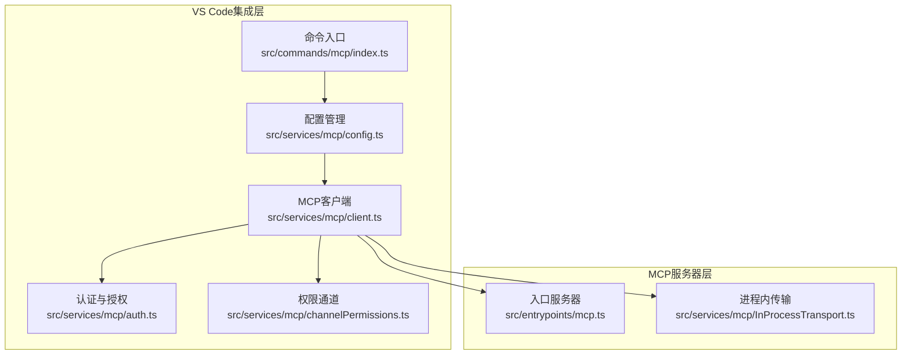
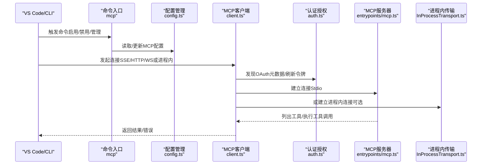
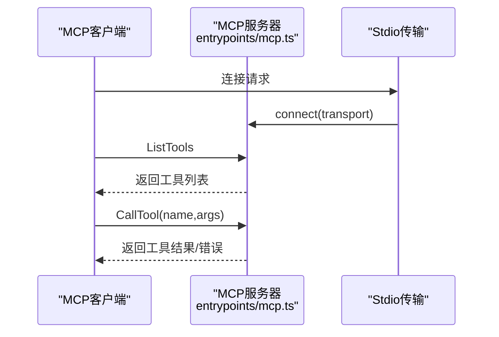
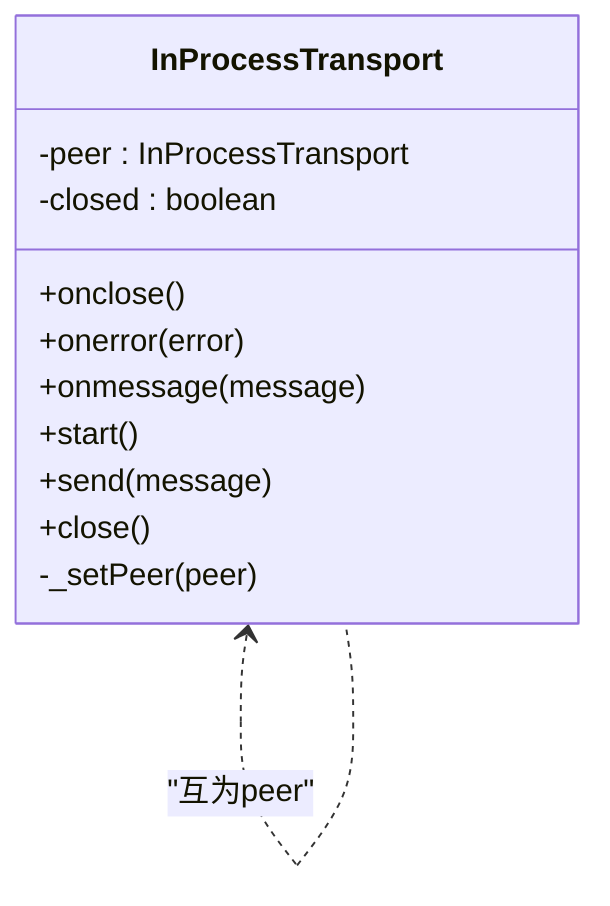
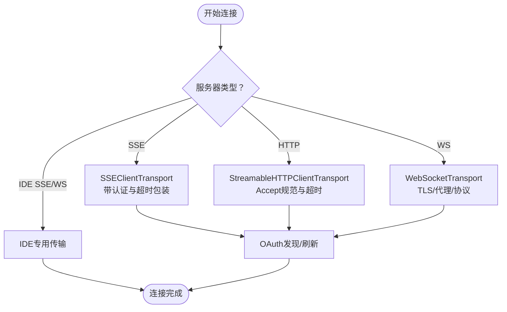
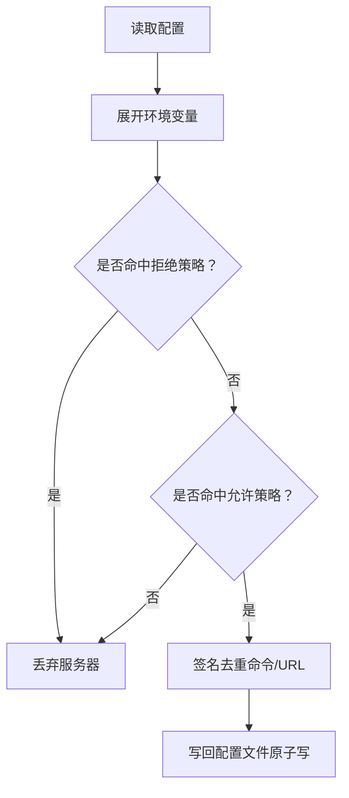
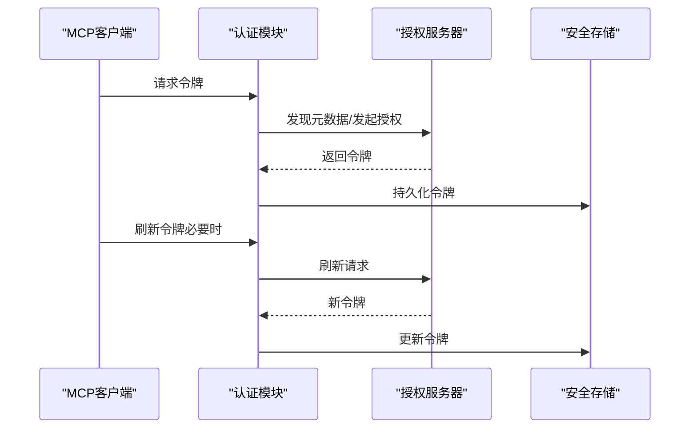
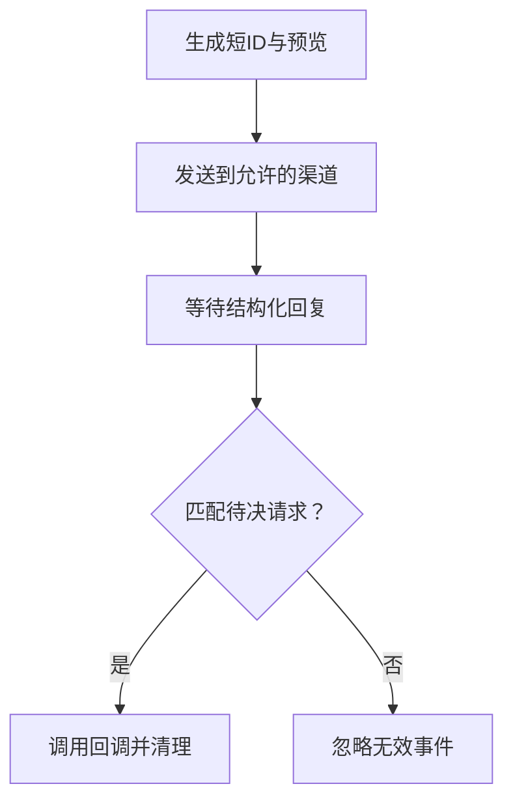
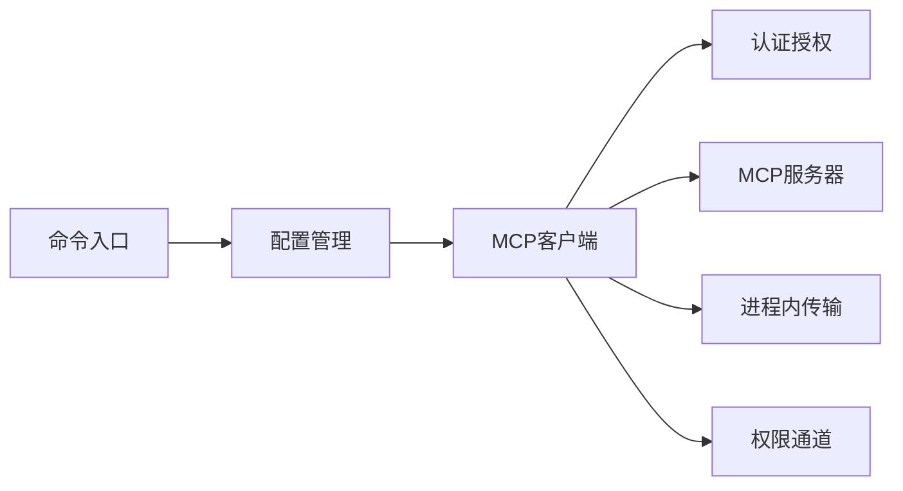

# VS Code集成

<cite>
**本文引用的文件**
- [src/entrypoints/mcp.ts](file://src/entrypoints/mcp.ts)
- [src/services/mcp/InProcessTransport.ts](file://src/services/mcp/InProcessTransport.ts)
- [src/services/mcp/config.ts](file://src/services/mcp/config.ts)
- [src/services/mcp/client.ts](file://src/services/mcp/client.ts)
- [src/services/mcp/auth.ts](file://src/services/mcp/auth.ts)
- [src/services/mcp/channelPermissions.ts](file://src/services/mcp/channelPermissions.ts)
- [src/commands/mcp/index.ts](file://src/commands/mcp/index.ts)
- [src/bridge/replBridgeTransport.ts](file://src/bridge/replBridgeTransport.ts)
</cite>

## 目录
1. [简介](#简介)
2. [项目结构](#项目结构)
3. [核心组件](#核心组件)
4. [架构总览](#架构总览)
5. [详细组件分析](#详细组件分析)
6. [依赖关系分析](#依赖关系分析)
7. [性能考量](#性能考量)
8. [故障排查指南](#故障排查指南)
9. [结论](#结论)
10. [附录](#附录)

## 简介
本文件面向VS Code集成MCP（Model Context Protocol）的开发者，系统化阐述在该代码库中的MCP与VS Code相关的集成架构、实现原理与最佳实践。重点覆盖以下方面：
- VS Code SDK MCP的集成入口与工作流
- 进程内传输（InProcessTransport）的机制与适用场景
- VS Code扩展与MCP服务器的通信方式与安全策略
- VS Code环境下的MCP配置与管理方法
- 安全考虑与权限控制
- 开发与调试工具及方法
- 最佳实践与常见问题解决

## 项目结构
围绕MCP在VS Code环境中的集成，核心目录与文件如下：
- 入口与服务器：src/entrypoints/mcp.ts 提供MCP服务器启动逻辑，基于标准输入输出（Stdio）传输
- 进程内传输：src/services/mcp/InProcessTransport.ts 提供进程内客户端-服务器双向传输
- 配置与管理：src/services/mcp/config.ts 提供MCP服务器配置解析、策略过滤、去重与写入
- 客户端连接：src/services/mcp/client.ts 提供MCP客户端连接、认证、请求超时与批量连接等能力
- 认证与授权：src/services/mcp/auth.ts 提供OAuth发现、令牌刷新、撤销与跨应用访问（XAA）
- 权限通道：src/services/mcp/channelPermissions.ts 提供通过外部渠道（如Telegram/iMessage/Discord）进行权限决策的机制
- VS Code命令入口：src/commands/mcp/index.ts 定义本地命令“mcp”，用于管理MCP服务器
- REPL桥接传输：src/bridge/replBridgeTransport.ts 提供REPL/守护进程与后端的传输抽象（与MCP客户端侧相关）

**图表来源**
- [src/commands/mcp/index.ts:1-13](file://src/commands/mcp/index.ts#L1-L13)
- [src/services/mcp/config.ts:1-800](file://src/services/mcp/config.ts#L1-L800)
- [src/services/mcp/client.ts:1-800](file://src/services/mcp/client.ts#L1-L800)
- [src/services/mcp/auth.ts:1-800](file://src/services/mcp/auth.ts#L1-L800)
- [src/services/mcp/channelPermissions.ts:1-241](file://src/services/mcp/channelPermissions.ts#L1-L241)
- [src/entrypoints/mcp.ts:1-197](file://src/entrypoints/mcp.ts#L1-L197)
- [src/services/mcp/InProcessTransport.ts:1-64](file://src/services/mcp/InProcessTransport.ts#L1-L64)

**章节来源**
- [src/entrypoints/mcp.ts:1-197](file://src/entrypoints/mcp.ts#L1-L197)
- [src/services/mcp/InProcessTransport.ts:1-64](file://src/services/mcp/InProcessTransport.ts#L1-L64)
- [src/services/mcp/config.ts:1-800](file://src/services/mcp/config.ts#L1-L800)
- [src/services/mcp/client.ts:1-800](file://src/services/mcp/client.ts#L1-L800)
- [src/services/mcp/auth.ts:1-800](file://src/services/mcp/auth.ts#L1-L800)
- [src/services/mcp/channelPermissions.ts:1-241](file://src/services/mcp/channelPermissions.ts#L1-L241)
- [src/commands/mcp/index.ts:1-13](file://src/commands/mcp/index.ts#L1-L13)

## 核心组件
- MCP入口服务器（Stdio）：负责注册工具列表与工具调用处理，通过标准输入输出与VS Code或CLI交互
- 进程内传输（InProcessTransport）：在同一进程中模拟客户端与服务器之间的JSON-RPC消息传递，避免子进程开销
- MCP客户端：支持多种传输类型（SSE/HTTP/WebSocket），具备超时、代理、认证、批量连接与错误处理
- 配置管理：解析与合并用户/项目/企业级配置，执行允许/拒绝策略，写入与去重
- 认证与授权：OAuth元数据发现、令牌刷新与撤销、跨应用访问（XAA）
- 权限通道：通过外部渠道进行权限决策的结构化流程
- VS Code命令入口：提供本地命令“mcp”，用于管理MCP服务器

**章节来源**
- [src/entrypoints/mcp.ts:35-196](file://src/entrypoints/mcp.ts#L35-L196)
- [src/services/mcp/InProcessTransport.ts:11-63](file://src/services/mcp/InProcessTransport.ts#L11-L63)
- [src/services/mcp/client.ts:595-800](file://src/services/mcp/client.ts#L595-L800)
- [src/services/mcp/config.ts:625-761](file://src/services/mcp/config.ts#L625-L761)
- [src/services/mcp/auth.ts:256-316](file://src/services/mcp/auth.ts#L256-L316)
- [src/services/mcp/channelPermissions.ts:177-241](file://src/services/mcp/channelPermissions.ts#L177-L241)
- [src/commands/mcp/index.ts:3-12](file://src/commands/mcp/index.ts#L3-L12)

## 架构总览
下图展示VS Code环境下MCP集成的关键路径：从命令入口到配置解析、客户端连接、认证与权限、再到MCP服务器（Stdio或进程内）。

**图表来源**
- [src/commands/mcp/index.ts:3-12](file://src/commands/mcp/index.ts#L3-L12)
- [src/services/mcp/config.ts:625-761](file://src/services/mcp/config.ts#L625-L761)
- [src/services/mcp/client.ts:595-800](file://src/services/mcp/client.ts#L595-L800)
- [src/services/mcp/auth.ts:256-316](file://src/services/mcp/auth.ts#L256-L316)
- [src/entrypoints/mcp.ts:35-196](file://src/entrypoints/mcp.ts#L35-L196)
- [src/services/mcp/InProcessTransport.ts:11-63](file://src/services/mcp/InProcessTransport.ts#L11-L63)

## 详细组件分析

### 组件A：VS Code SDK MCP入口与Stdio服务器
- 职责：启动MCP服务器，注册工具列表与工具调用处理器，通过Stdio传输与客户端交互
- 关键点：
  - 使用Server与StdioServerTransport建立连接
  - 工具列表：动态生成工具描述，转换输入/输出Schema为MCP兼容格式
  - 工具调用：校验输入、执行工具、返回文本内容；异常统一记录与错误响应
  - 缓存：对文件状态读取使用LRU缓存，限制内存增长
- 适用场景：作为VS Code扩展或CLI的MCP服务器，提供工具能力给上层调用方

**图表来源**
- [src/entrypoints/mcp.ts:47-196](file://src/entrypoints/mcp.ts#L47-L196)

**章节来源**
- [src/entrypoints/mcp.ts:35-196](file://src/entrypoints/mcp.ts#L35-L196)

### 组件B：进程内传输（InProcessTransport）
- 职责：在同一进程内模拟客户端与服务器的消息传递，避免子进程开销
- 机制：
  - 双向绑定：两个InProcessTransport互为peer，消息通过异步微任务投递，避免同步循环栈过深
  - 关闭一致性：任一侧关闭会触发双方onclose回调
- 适用场景：
  - 单进程内联测试与开发
  - VS Code扩展内部集成，无需外部子进程
  - 低延迟、高内聚的本地MCP服务器/客户端组合

**图表来源**
- [src/services/mcp/InProcessTransport.ts:11-63](file://src/services/mcp/InProcessTransport.ts#L11-L63)

**章节来源**
- [src/services/mcp/InProcessTransport.ts:11-63](file://src/services/mcp/InProcessTransport.ts#L11-L63)

### 组件C：MCP客户端与多传输支持
- 职责：根据服务器类型选择合适传输（SSE/HTTP/WebSocket），并处理认证、超时、代理与批量连接
- 关键点：
  - 传输选择：按服务器类型初始化对应传输（SSEClientTransport/StreamableHTTP/WebSocket）
  - 超时与Accept头：为POST请求设置独立超时信号，保证长连接SSE不被误杀
  - 批量连接：支持批量连接远程服务器，提升启动效率
  - 认证包装：结合OAuth发现与令牌刷新，处理401重试与跨应用访问
- 适用场景：VS Code扩展通过不同传输与远端/本地MCP服务器通信

**图表来源**
- [src/services/mcp/client.ts:619-800](file://src/services/mcp/client.ts#L619-L800)

**章节来源**
- [src/services/mcp/client.ts:595-800](file://src/services/mcp/client.ts#L595-L800)

### 组件D：MCP配置与管理
- 职责：解析与合并多源配置，执行企业策略（允许/拒绝）、去重与写入
- 关键点：
  - 写入原子性：临时文件+rename，保留原文件权限
  - 签名去重：基于命令数组或URL（含代理URL解包）计算签名，避免重复
  - 策略过滤：名称/命令/URL三类规则，支持通配符与精确匹配
  - 作用域：支持项目/用户/本地/动态/企业等作用域写入
- 适用场景：VS Code中通过命令“mcp”添加/删除/管理MCP服务器配置

**图表来源**
- [src/services/mcp/config.ts:88-131](file://src/services/mcp/config.ts#L88-L131)
- [src/services/mcp/config.ts:202-266](file://src/services/mcp/config.ts#L202-L266)
- [src/services/mcp/config.ts:417-508](file://src/services/mcp/config.ts#L417-L508)

**章节来源**
- [src/services/mcp/config.ts:88-131](file://src/services/mcp/config.ts#L88-L131)
- [src/services/mcp/config.ts:202-266](file://src/services/mcp/config.ts#L202-L266)
- [src/services/mcp/config.ts:417-508](file://src/services/mcp/config.ts#L417-L508)

### 组件E：认证与授权（OAuth/XAA）
- 职责：OAuth元数据发现、令牌刷新/撤销、跨应用访问（XAA）
- 关键点：
  - 元数据发现：优先使用用户配置的元数据URL，否则按RFC链路自动探测
  - 令牌刷新：为每次请求创建独立超时信号，避免单次超时信号失效问题
  - 令牌撤销：先撤销刷新令牌，再撤销访问令牌；支持两种客户端认证方式回退
  - XAA：一次IdP登录复用至所有XAA服务器，减少浏览器弹窗
- 适用场景：VS Code扩展在需要OAuth或跨应用访问的MCP服务器上进行认证

**图表来源**
- [src/services/mcp/auth.ts:256-316](file://src/services/mcp/auth.ts#L256-L316)
- [src/services/mcp/auth.ts:467-574](file://src/services/mcp/auth.ts#L467-L574)
- [src/services/mcp/auth.ts:664-800](file://src/services/mcp/auth.ts#L664-L800)

**章节来源**
- [src/services/mcp/auth.ts:256-316](file://src/services/mcp/auth.ts#L256-L316)
- [src/services/mcp/auth.ts:467-574](file://src/services/mcp/auth.ts#L467-L574)
- [src/services/mcp/auth.ts:664-800](file://src/services/mcp/auth.ts#L664-L800)

### 组件F：权限通道（Channel Permissions）
- 职责：通过外部渠道（如Telegram/iMessage/Discord）进行权限决策
- 关键点：
  - 结构化回复格式与短ID生成，避免歧义与误触
  - 仅当服务器声明相应实验能力时才参与权限中继
  - 回调工厂函数管理待决请求映射，确保幂等与防重放
- 适用场景：VS Code扩展在需要跨渠道确认权限时使用

**图表来源**
- [src/services/mcp/channelPermissions.ts:140-194](file://src/services/mcp/channelPermissions.ts#L140-L194)
- [src/services/mcp/channelPermissions.ts:209-241](file://src/services/mcp/channelPermissions.ts#L209-L241)

**章节来源**
- [src/services/mcp/channelPermissions.ts:140-194](file://src/services/mcp/channelPermissions.ts#L140-L194)
- [src/services/mcp/channelPermissions.ts:209-241](file://src/services/mcp/channelPermissions.ts#L209-L241)

### 组件G：VS Code命令入口（mcp）
- 职责：定义本地命令“mcp”，用于管理MCP服务器（启用/禁用/添加/删除等）
- 适用场景：VS Code终端或命令面板中直接操作MCP服务器配置

**章节来源**
- [src/commands/mcp/index.ts:3-12](file://src/commands/mcp/index.ts#L3-L12)

## 依赖关系分析
- 命令入口依赖配置管理，配置管理依赖设置与策略模块
- 客户端依赖认证模块与传输层（SSE/HTTP/WS），并通过配置管理解析服务器参数
- 进程内传输与入口服务器可配合用于本地联调
- 权限通道与客户端协作，用于跨渠道权限决策

**图表来源**
- [src/commands/mcp/index.ts:3-12](file://src/commands/mcp/index.ts#L3-L12)
- [src/services/mcp/config.ts:625-761](file://src/services/mcp/config.ts#L625-L761)
- [src/services/mcp/client.ts:595-800](file://src/services/mcp/client.ts#L595-L800)
- [src/services/mcp/auth.ts:256-316](file://src/services/mcp/auth.ts#L256-L316)
- [src/services/mcp/InProcessTransport.ts:11-63](file://src/services/mcp/InProcessTransport.ts#L11-L63)
- [src/services/mcp/channelPermissions.ts:177-241](file://src/services/mcp/channelPermissions.ts#L177-L241)

**章节来源**
- [src/commands/mcp/index.ts:3-12](file://src/commands/mcp/index.ts#L3-L12)
- [src/services/mcp/config.ts:625-761](file://src/services/mcp/config.ts#L625-L761)
- [src/services/mcp/client.ts:595-800](file://src/services/mcp/client.ts#L595-L800)
- [src/services/mcp/auth.ts:256-316](file://src/services/mcp/auth.ts#L256-L316)
- [src/services/mcp/InProcessTransport.ts:11-63](file://src/services/mcp/InProcessTransport.ts#L11-L63)
- [src/services/mcp/channelPermissions.ts:177-241](file://src/services/mcp/channelPermissions.ts#L177-L241)

## 性能考量
- 进程内传输：避免子进程开销，适合本地联调与低延迟场景
- 连接批量化：远程服务器连接支持批量，降低握手成本
- 超时与Accept头规范化：防止单次超时信号失效导致后续请求失败
- 文件状态缓存：限制LRU大小，避免内存无界增长
- 原子写配置：临时文件+rename，减少磁盘抖动与竞态

[本节为通用指导，无需列出具体文件来源]

## 故障排查指南
- 连接失败
  - 检查服务器类型与传输选项是否匹配
  - 确认代理/证书/TLS设置是否正确
  - 查看超时与Accept头是否按要求设置
- 认证问题
  - 确认OAuth元数据发现与令牌刷新流程
  - 若出现401，检查令牌是否过期或被撤销
  - 对于XAA，确认IdP登录与交换流程
- 权限通道
  - 确认服务器声明了相应实验能力
  - 检查短ID生成与回复格式是否符合规范
- 配置冲突
  - 使用签名去重逻辑定位重复服务器
  - 检查允许/拒绝策略是否命中
- 进程内联调
  - 确保两端传输已互设peer，消息通过异步投递
  - 关闭一致性：任一端关闭应触发双方回调

**章节来源**
- [src/services/mcp/client.ts:492-550](file://src/services/mcp/client.ts#L492-L550)
- [src/services/mcp/auth.ts:157-191](file://src/services/mcp/auth.ts#L157-L191)
- [src/services/mcp/auth.ts:467-574](file://src/services/mcp/auth.ts#L467-L574)
- [src/services/mcp/channelPermissions.ts:140-194](file://src/services/mcp/channelPermissions.ts#L140-L194)
- [src/services/mcp/config.ts:202-266](file://src/services/mcp/config.ts#L202-L266)
- [src/services/mcp/InProcessTransport.ts:26-48](file://src/services/mcp/InProcessTransport.ts#L26-L48)

## 结论
该代码库提供了完整的VS Code集成MCP方案：从命令入口、配置管理、客户端连接、认证授权到权限通道与进程内传输，形成一套可扩展、可维护且安全可控的MCP生态。通过标准化的传输与严格的策略过滤，能够在VS Code环境中稳定地管理与使用MCP服务器，同时兼顾开发效率与安全性。

[本节为总结性内容，无需列出具体文件来源]

## 附录
- 开发与调试建议
  - 使用进程内传输进行本地联调，快速验证工具列表与调用
  - 通过命令“mcp”管理服务器配置，结合策略过滤验证允许/拒绝逻辑
  - 在客户端侧开启超时与Accept头规范化，避免常见网络问题
  - 对于认证问题，优先检查OAuth元数据发现与令牌刷新流程
- 最佳实践
  - 优先使用签名去重避免重复服务器
  - 合理设置批量连接大小，平衡启动速度与资源占用
  - 对于远端服务器，启用代理与TLS配置，确保连接安全
  - 权限通道仅在服务器明确声明能力时启用，避免误用

[本节为通用指导，无需列出具体文件来源]