# MCP工具UI组件

<cite>
**本文档引用的文件**
- [src/tools/MCPTool/UI.tsx](file://src/tools/MCPTool/UI.tsx)
- [src/tools/MCPTool/MCPTool.ts](file://src/tools/MCPTool/MCPTool.ts)
- [src/tools/MCPTool/prompt.ts](file://src/tools/MCPTool/prompt.ts)
- [src/components/mcp/MCPListPanel.tsx](file://src/components/mcp/MCPListPanel.tsx)
- [src/components/mcp/MCPToolListView.tsx](file://src/components/mcp/MCPToolListView.tsx)
- [src/components/mcp/MCPToolDetailView.tsx](file://src/components/mcp/MCPToolDetailView.tsx)
- [src/components/mcp/index.ts](file://src/components/mcp/index.ts)
- [src/services/mcp/types.ts](file://src/services/mcp/types.ts)
- [src/services/mcp/utils.ts](file://src/services/mcp/utils.ts)
</cite>

## 目录
1. [简介](#简介)
2. [项目结构](#项目结构)
3. [核心组件](#核心组件)
4. [架构概览](#架构概览)
5. [详细组件分析](#详细组件分析)
6. [依赖关系分析](#依赖关系分析)
7. [性能考虑](#性能考虑)
8. [故障排除指南](#故障排除指南)
9. [结论](#结论)

## 简介

MCP（Model Context Protocol）工具UI组件是Claude代码编辑器中用于管理和执行MCP工具的核心界面系统。该系统提供了完整的MCP服务器管理、工具选择、执行进度跟踪和结果展示功能。

MCP工具UI组件采用React构建，结合了丰富的终端友好的显示组件和现代化的交互设计。系统支持多种MCP服务器类型（本地、远程、代理等），提供直观的工具发现和选择界面，并实现了智能的结果渲染和格式化。

## 项目结构

MCP工具UI组件分布在多个目录中，形成了清晰的模块化架构：

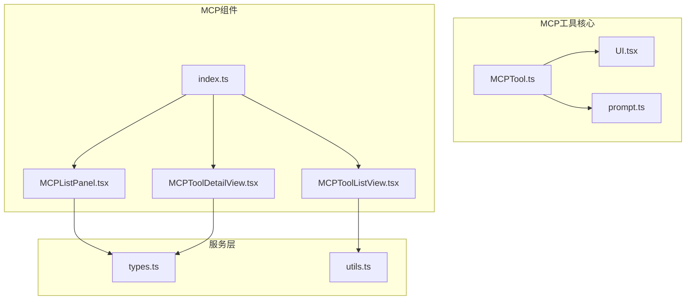

**图表来源**
- [src/tools/MCPTool/MCPTool.ts:1-78](file://src/tools/MCPTool/MCPTool.ts#L1-L78)
- [src/tools/MCPTool/UI.tsx:1-403](file://src/tools/MCPTool/UI.tsx#L1-L403)
- [src/components/mcp/MCPListPanel.tsx:1-504](file://src/components/mcp/MCPListPanel.tsx#L1-L504)

**章节来源**
- [src/tools/MCPTool/MCPTool.ts:1-78](file://src/tools/MCPTool/MCPTool.ts#L1-L78)
- [src/components/mcp/index.ts:1-10](file://src/components/mcp/index.ts#L1-L10)

## 核心组件

### MCP工具渲染系统

MCP工具渲染系统是UI组件的核心，负责将MCP工具的输入、进度和输出以用户友好的方式呈现：

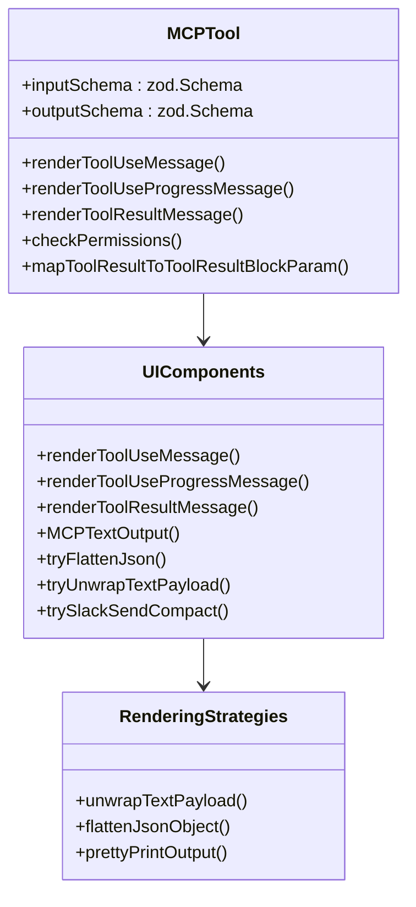

**图表来源**
- [src/tools/MCPTool/MCPTool.ts:27-77](file://src/tools/MCPTool/MCPTool.ts#L27-L77)
- [src/tools/MCPTool/UI.tsx:41-150](file://src/tools/MCPTool/UI.tsx#L41-L150)

### MCP服务器管理面板

MCP服务器管理面板提供了统一的服务器配置和管理界面：

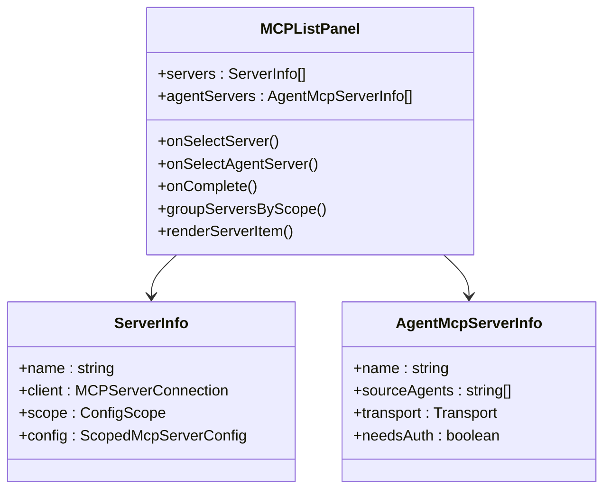

**图表来源**
- [src/components/mcp/MCPListPanel.tsx:17-33](file://src/components/mcp/MCPListPanel.tsx#L17-L33)
- [src/services/mcp/types.ts:180-227](file://src/services/mcp/types.ts#L180-L227)

**章节来源**
- [src/tools/MCPTool/UI.tsx:1-403](file://src/tools/MCPTool/UI.tsx#L1-L403)
- [src/components/mcp/MCPListPanel.tsx:1-504](file://src/components/mcp/MCPListPanel.tsx#L1-L504)

## 架构概览

MCP工具UI组件采用了分层架构设计，确保了良好的可维护性和扩展性：

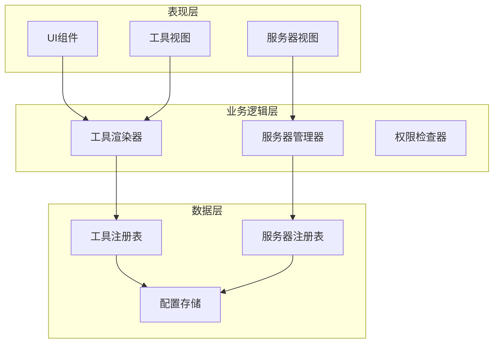

**图表来源**
- [src/tools/MCPTool/MCPTool.ts:27-66](file://src/tools/MCPTool/MCPTool.ts#L27-L66)
- [src/services/mcp/utils.ts:39-42](file://src/services/mcp/utils.ts#L39-L42)

系统的核心特点包括：

1. **模块化设计**：每个组件都有明确的职责和边界
2. **类型安全**：使用TypeScript确保编译时类型检查
3. **可扩展性**：支持新的MCP服务器类型和工具类型
4. **用户体验**：提供直观的交互和反馈机制

## 详细组件分析

### 工具使用消息渲染器

工具使用消息渲染器负责将MCP工具的调用参数转换为用户友好的显示格式：

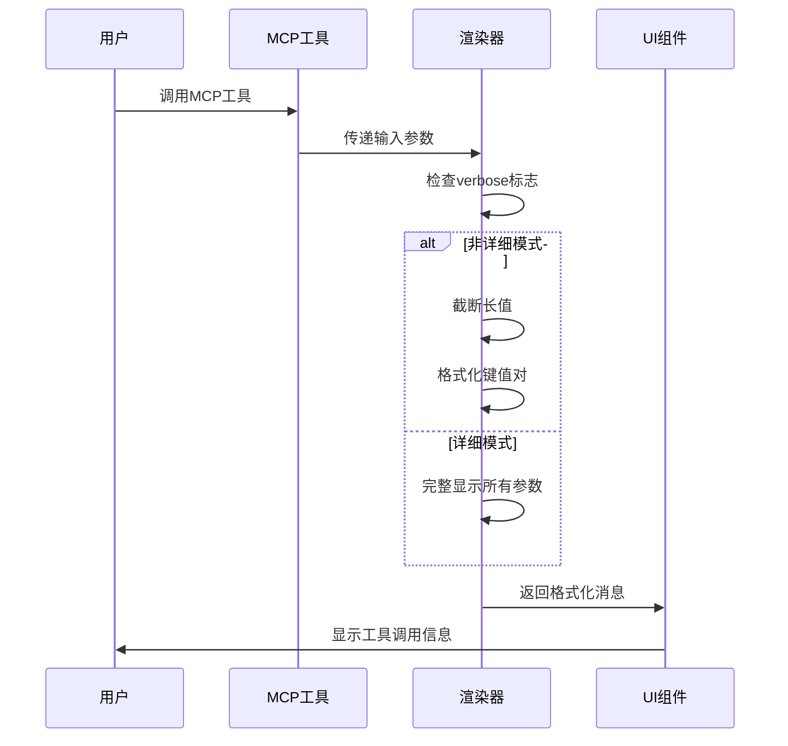

**图表来源**
- [src/tools/MCPTool/UI.tsx:41-56](file://src/tools/MCPTool/UI.tsx#L41-L56)

渲染策略包括：

1. **智能截断**：当参数过大时自动截断显示
2. **格式化输出**：将复杂的JSON对象转换为易读的键值对
3. **条件渲染**：根据verbose标志决定显示详细程度

**章节来源**
- [src/tools/MCPTool/UI.tsx:41-56](file://src/tools/MCPTool/UI.tsx#L41-L56)

### 工具执行进度消息处理器

工具执行进度消息处理器提供了实时的进度反馈：

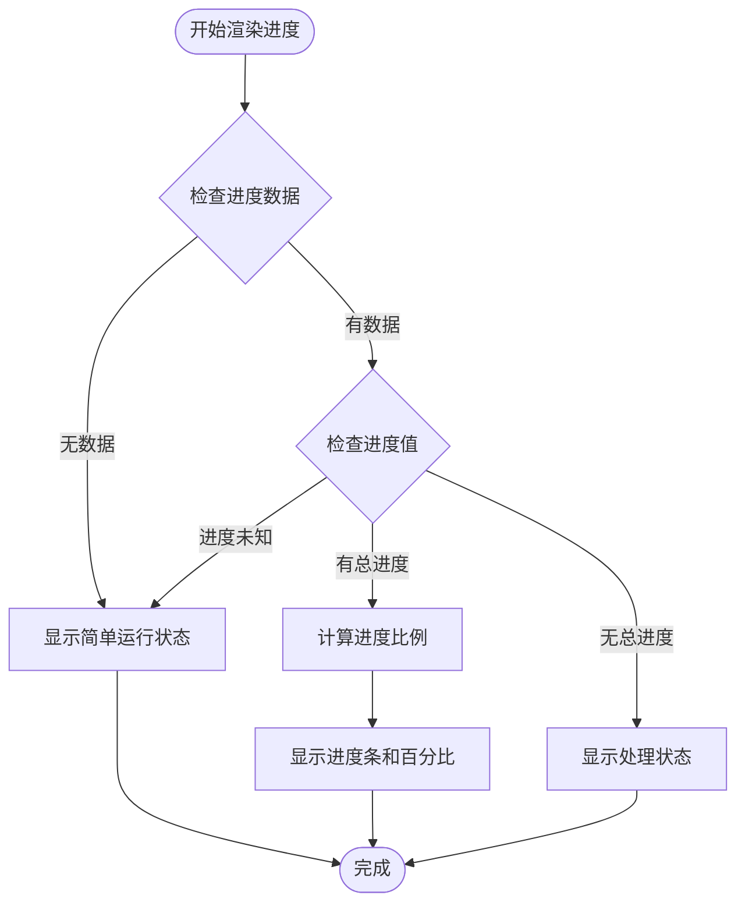

**图表来源**
- [src/tools/MCPTool/UI.tsx:57-90](file://src/tools/MCPTool/UI.tsx#L57-L90)

进度处理特性：

1. **动态进度条**：根据完成百分比显示进度条
2. **状态文本**：提供详细的进度描述
3. **自适应显示**：根据可用信息调整显示内容

**章节来源**
- [src/tools/MCPTool/UI.tsx:57-90](file://src/tools/MCPTool/UI.tsx#L57-L90)

### 工具结果消息渲染器

工具结果消息渲染器是最复杂的组件，需要处理多种输出格式：

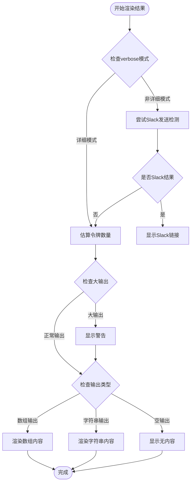

**图表来源**
- [src/tools/MCPTool/UI.tsx:91-150](file://src/tools/MCPTool/UI.tsx#L91-L150)

高级渲染策略：

1. **智能检测**：自动识别Slack等特殊输出格式
2. **令牌估算**：监控输出大小防止上下文溢出
3. **多格式支持**：处理文本、图像等多种输出类型
4. **性能优化**：对大型输出进行智能截断

**章节来源**
- [src/tools/MCPTool/UI.tsx:91-150](file://src/tools/MCPTool/UI.tsx#L91-L150)

### 文本输出渲染器

文本输出渲染器实现了三种不同的渲染策略：

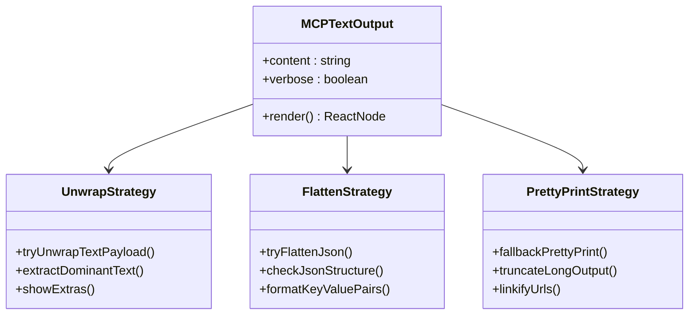

**图表来源**
- [src/tools/MCPTool/UI.tsx:159-252](file://src/tools/MCPTool/UI.tsx#L159-L252)

渲染策略详解：

1. **文本解包策略**：识别并解包包含主导文本的JSON对象
2. **扁平化策略**：将简单的JSON对象转换为键值对列表
3. **美化打印策略**：作为最后的后备方案，提供标准的文本格式化

**章节来源**
- [src/tools/MCPTool/UI.tsx:159-252](file://src/tools/MCPTool/UI.tsx#L159-L252)

### MCP服务器列表面板

MCP服务器列表面板提供了统一的服务器管理界面：

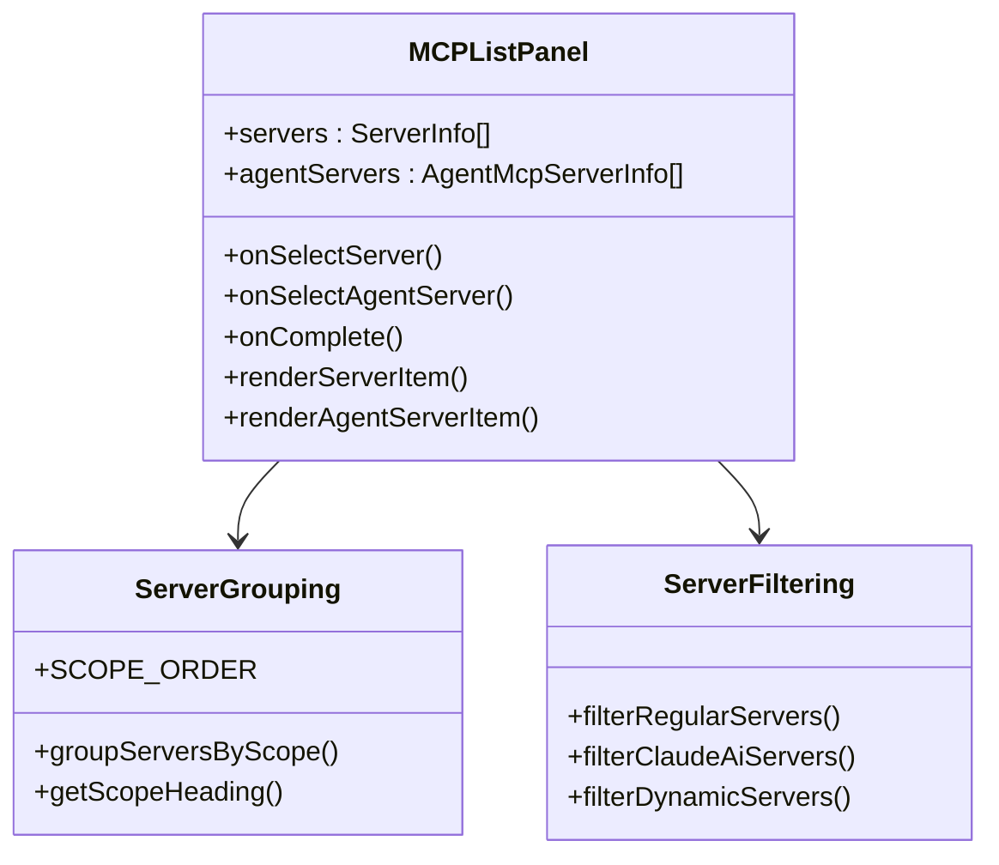

**图表来源**
- [src/components/mcp/MCPListPanel.tsx:77-91](file://src/components/mcp/MCPListPanel.tsx#L77-L91)

面板特性：

1. **多级分组**：按作用域和类型组织服务器
2. **状态指示**：清晰显示服务器连接状态
3. **快速导航**：支持键盘快捷键导航
4. **智能排序**：按名称字母顺序排列

**章节来源**
- [src/components/mcp/MCPListPanel.tsx:1-504](file://src/components/mcp/MCPListPanel.tsx#L1-L504)

### 工具选择列表视图

工具选择列表视图提供了直观的工具浏览和选择体验：

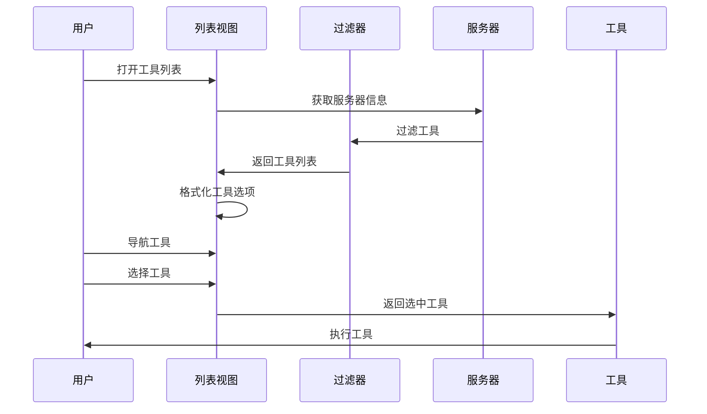

**图表来源**
- [src/components/mcp/MCPToolListView.tsx:27-52](file://src/components/mcp/MCPToolListView.tsx#L27-L52)

视图功能：

1. **智能过滤**：仅显示当前服务器的可用工具
2. **状态标注**：显示工具的只读、破坏性等属性
3. **快速预览**：提供工具的基本信息和描述
4. **无障碍访问**：支持键盘导航和屏幕阅读器

**章节来源**
- [src/components/mcp/MCPToolListView.tsx:1-141](file://src/components/mcp/MCPToolListView.tsx#L1-L141)

### 工具详情视图

工具详情视图为用户提供工具的完整信息：

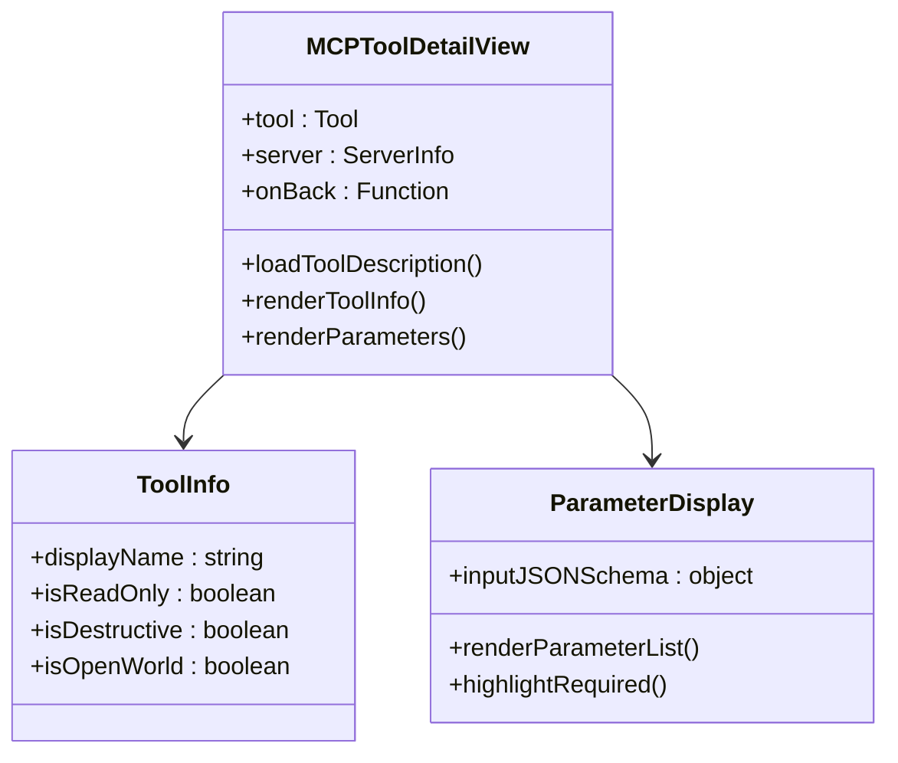

**图表来源**
- [src/components/mcp/MCPToolDetailView.tsx:9-64](file://src/components/mcp/MCPToolDetailView.tsx#L9-L64)

详情视图特性：

1. **动态加载**：异步获取工具描述信息
2. **属性标注**：清晰标识工具的安全属性
3. **参数可视化**：以表格形式展示工具参数
4. **响应式设计**：适配不同屏幕尺寸

**章节来源**
- [src/components/mcp/MCPToolDetailView.tsx:1-212](file://src/components/mcp/MCPToolDetailView.tsx#L1-L212)

## 依赖关系分析

MCP工具UI组件之间的依赖关系体现了清晰的分层架构：

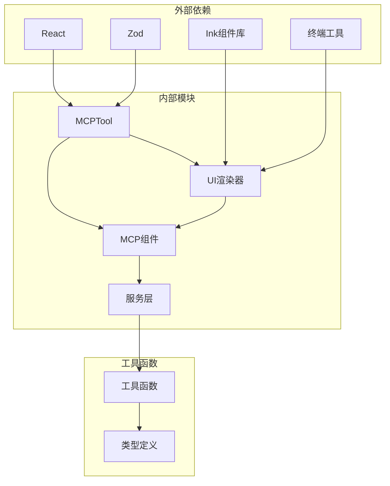

**图表来源**
- [src/tools/MCPTool/MCPTool.ts:1-15](file://src/tools/MCPTool/MCPTool.ts#L1-L15)
- [src/tools/MCPTool/UI.tsx:1-18](file://src/tools/MCPTool/UI.tsx#L1-L18)

主要依赖特点：

1. **最小化外部依赖**：仅依赖必要的核心库
2. **类型安全**：通过Zod确保数据验证
3. **组件复用**：Ink组件库提供一致的UI体验
4. **模块化导入**：避免循环依赖

**章节来源**
- [src/tools/MCPTool/MCPTool.ts:1-15](file://src/tools/MCPTool/MCPTool.ts#L1-L15)
- [src/tools/MCPTool/UI.tsx:1-18](file://src/tools/MCPTool/UI.tsx#L1-L18)

## 性能考虑

MCP工具UI组件在设计时充分考虑了性能优化：

### 渲染优化策略

1. **记忆化缓存**：使用React的memo和useMemo避免不必要的重渲染
2. **条件渲染**：根据数据可用性选择最优的渲染路径
3. **懒加载**：延迟加载工具描述等非关键信息
4. **虚拟滚动**：对于大量工具列表使用虚拟化技术

### 内存管理

1. **及时清理**：组件卸载时清理定时器和事件监听器
2. **引用稳定**：使用useCallback保持函数引用稳定
3. **状态最小化**：避免存储不必要的中间状态

### 网络优化

1. **批量请求**：合并多个服务器状态查询
2. **缓存策略**：缓存服务器配置和工具元数据
3. **错误恢复**：网络失败时提供降级显示

## 故障排除指南

### 常见问题及解决方案

#### 服务器连接问题

**症状**：服务器显示为"failed"状态
**原因**：网络连接失败或认证错误
**解决方法**：
1. 检查服务器URL和端口配置
2. 验证认证凭据
3. 查看详细错误日志

#### 工具执行超时

**症状**：工具长时间无响应
**原因**：服务器处理时间过长或网络延迟
**解决方法**：
1. 增加超时设置
2. 检查服务器性能
3. 优化工具参数

#### 输出显示异常

**症状**：工具输出格式不正确
**原因**：输出格式不符合预期
**解决方法**：
1. 检查verbose标志设置
2. 验证输出数据结构
3. 使用默认渲染器

**章节来源**
- [src/components/mcp/MCPListPanel.tsx:320-335](file://src/components/mcp/MCPListPanel.tsx#L320-L335)
- [src/tools/MCPTool/UI.tsx:110-112](file://src/tools/MCPTool/UI.tsx#L110-L112)

## 结论

MCP工具UI组件展现了现代前端开发的最佳实践，通过精心设计的架构和实现，为用户提供了强大而易用的MCP工具管理体验。

系统的主要优势包括：

1. **模块化设计**：清晰的组件分离和职责划分
2. **类型安全**：完整的TypeScript支持确保代码质量
3. **用户体验**：直观的界面设计和流畅的交互体验
4. **性能优化**：高效的渲染策略和内存管理
5. **可扩展性**：灵活的架构支持新功能的添加

未来可以考虑的改进方向：

1. **国际化支持**：添加多语言界面支持
2. **主题系统**：提供可定制的主题选项
3. **插件系统**：允许第三方扩展UI功能
4. **离线支持**：增强离线环境下的功能

通过持续的优化和改进，MCP工具UI组件将继续为用户提供优秀的开发体验。