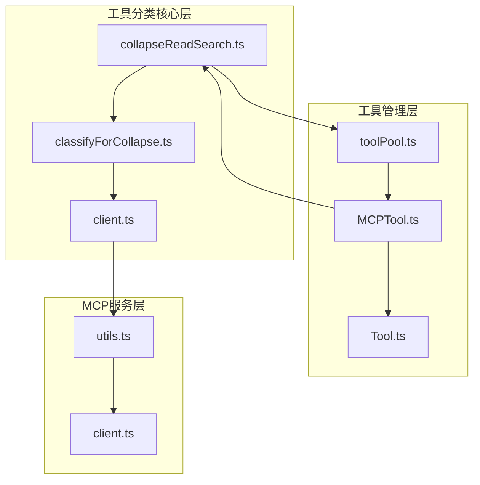
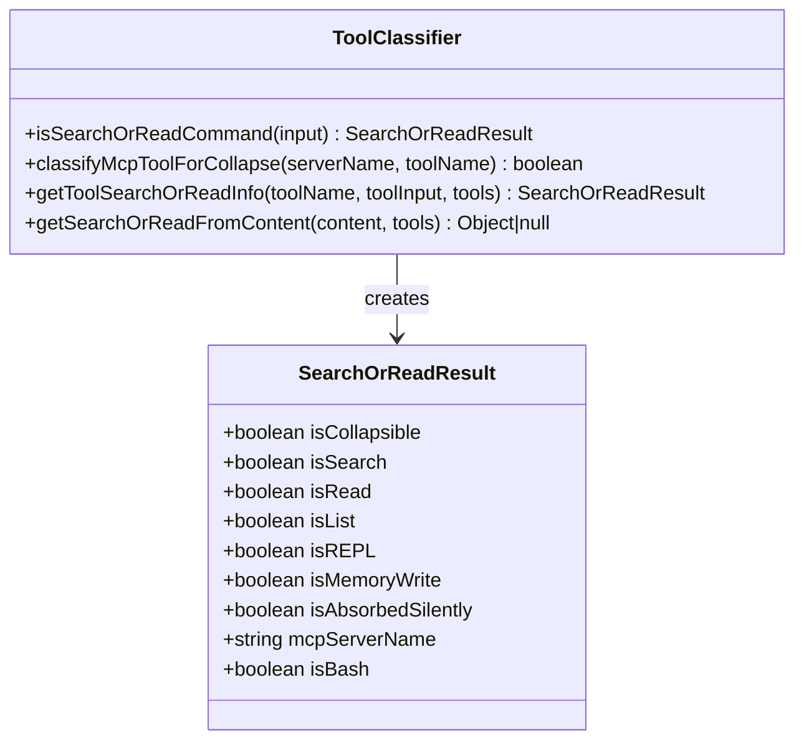
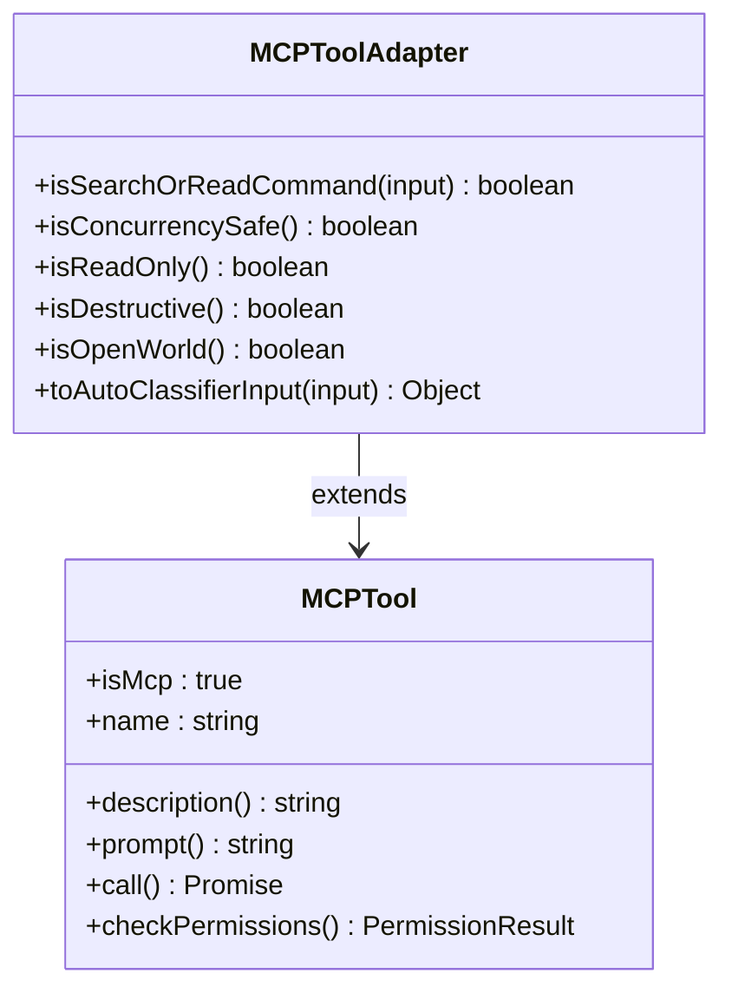
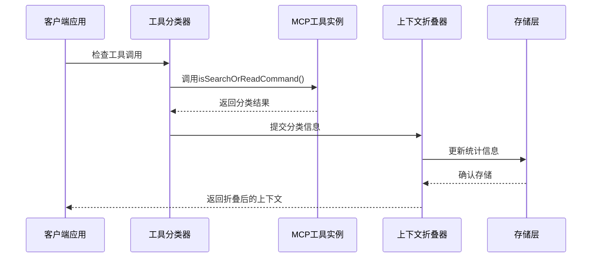
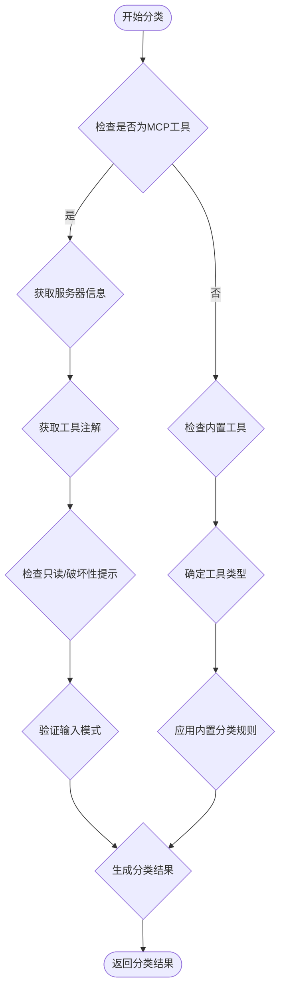
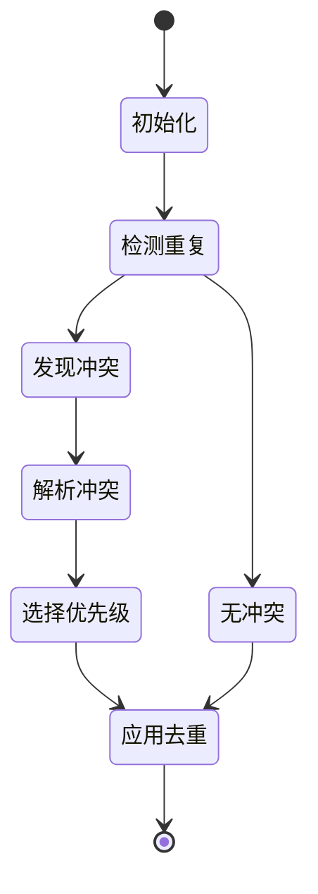
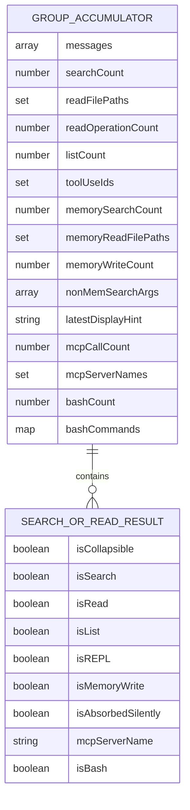
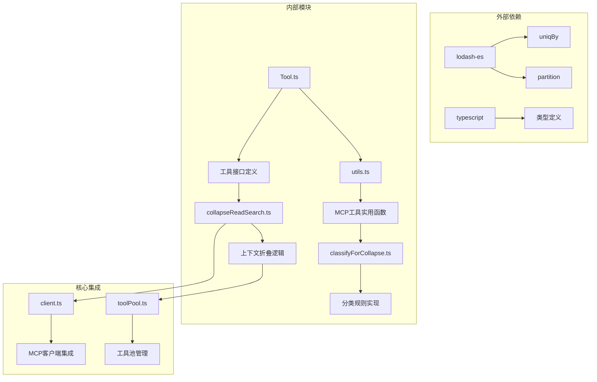
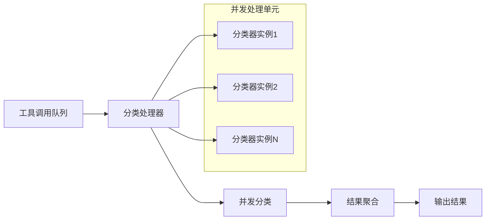

# MCP工具分类机制

<cite>
**本文档引用的文件**
- [collapseReadSearch.ts](file://src/utils/collapseReadSearch.ts)
- [classifyForCollapse.ts](file://src/tools/MCPTool/classifyForCollapse.ts)
- [client.ts](file://src/services/mcp/client.ts)
- [utils.ts](file://src/services/mcp/utils.ts)
- [toolPool.ts](file://src/utils/toolPool.ts)
- [MCPTool.ts](file://src/tools/MCPTool/MCPTool.ts)
- [Tool.ts](file://src/Tool.ts)
</cite>

## 目录
1. [简介](#简介)
2. [项目结构](#项目结构)
3. [核心组件](#核心组件)
4. [架构概览](#架构概览)
5. [详细组件分析](#详细组件分析)
6. [依赖关系分析](#依赖关系分析)
7. [性能考虑](#性能考虑)
8. [故障排除指南](#故障排除指南)
9. [结论](#结论)
10. [附录](#附录)

## 简介

MCP（Model Context Protocol）工具分类机制是Claude代码源码中用于上下文压缩和消息折叠的核心功能。该机制通过智能识别和分类MCP工具的调用行为，实现了高效的上下文压缩、性能优化和用户体验提升。

该系统主要解决以下关键问题：
- 区分MCP工具的搜索、读取、列表等不同操作类型
- 实现工具调用的自动分类和合并逻辑
- 提供去重机制和冲突处理策略
- 优化性能并减少上下文膨胀
- 支持动态配置和自定义规则

## 项目结构

MCP工具分类机制涉及多个关键模块，形成了完整的工具分类生态系统：

**图表来源**
- [collapseReadSearch.ts:1-800](file://src/utils/collapseReadSearch.ts#L1-L800)
- [classifyForCollapse.ts:594](file://src/tools/MCPTool/classifyForCollapse.ts#L594)
- [client.ts:1728](file://src/services/mcp/client.ts#L1728)

**章节来源**
- [collapseReadSearch.ts:1-40](file://src/utils/collapseReadSearch.ts#L1-L40)
- [utils.ts:1-50](file://src/services/mcp/utils.ts#L1-L50)

## 核心组件

### 工具分类器 (Tool Classifier)

工具分类器是整个系统的核心，负责判断MCP工具是否属于搜索或读取操作：

**图表来源**
- [collapseReadSearch.ts:44-65](file://src/utils/collapseReadSearch.ts#L44-L65)
- [collapseReadSearch.ts:143-238](file://src/utils/collapseReadSearch.ts#L143-L238)

### MCP工具适配器 (MCP Tool Adapter)

MCP工具适配器为每个具体的MCP工具提供分类能力：

**图表来源**
- [client.ts:1791-1826](file://src/services/mcp/client.ts#L1791-L1826)
- [MCPTool.ts:27-78](file://src/tools/MCPTool/MCPTool.ts#L27-L78)

**章节来源**
- [collapseReadSearch.ts:44-65](file://src/utils/collapseReadSearch.ts#L44-L65)
- [client.ts:1791-1826](file://src/services/mcp/client.ts#L1791-L1826)

## 架构概览

MCP工具分类机制采用分层架构设计，确保了系统的可扩展性和维护性：

**图表来源**
- [collapseReadSearch.ts:143-238](file://src/utils/collapseReadSearch.ts#L143-L238)
- [client.ts:1809-1812](file://src/services/mcp/client.ts#L1809-L1812)

## 详细组件分析

### 工具分类算法

工具分类算法基于多种特征进行综合判断：

**图表来源**
- [collapseReadSearch.ts:138-238](file://src/utils/collapseReadSearch.ts#L138-L238)
- [client.ts:1791-1812](file://src/services/mcp/client.ts#L1791-L1812)

#### 分类规则详解

系统实现了多层次的分类规则：

1. **MCP工具专用规则**：基于工具名称前缀和注解信息
2. **内置工具兼容规则**：支持传统工具的分类逻辑
3. **环境感知规则**：根据运行环境调整分类策略
4. **内存文件特殊规则**：自动识别和处理内存文件操作

**章节来源**
- [collapseReadSearch.ts:143-284](file://src/utils/collapseReadSearch.ts#L143-L284)
- [utils.ts:39-42](file://src/services/mcp/utils.ts#L39-L42)

### 去重机制和冲突处理

系统提供了完善的去重和冲突处理机制：

**图表来源**
- [toolPool.ts:55-80](file://src/utils/toolPool.ts#L55-L80)
- [toolPool.ts:65-70](file://src/utils/toolPool.ts#L65-L70)

#### 冲突处理策略

系统采用以下冲突处理策略：

1. **优先级排序**：内置工具优先于MCP工具
2. **时间戳比较**：新版本工具覆盖旧版本
3. **功能完整性**：完整功能工具优先于简化版本
4. **用户配置**：用户明确配置具有最高优先级

**章节来源**
- [toolPool.ts:55-80](file://src/utils/toolPool.ts#L55-L80)

### 数据结构和存储方式

系统使用多种数据结构来高效存储和管理分类信息：

**图表来源**
- [collapseReadSearch.ts:581-623](file://src/utils/collapseReadSearch.ts#L581-L623)
- [collapseReadSearch.ts:47-65](file://src/utils/collapseReadSearch.ts#L47-L65)

#### 存储优化策略

1. **集合去重**：使用Set数据结构避免重复存储
2. **延迟计算**：按需计算复杂统计数据
3. **增量更新**：只更新发生变化的部分
4. **内存池管理**：复用对象减少垃圾回收

**章节来源**
- [collapseReadSearch.ts:581-752](file://src/utils/collapseReadSearch.ts#L581-L752)

### 配置选项和自定义规则

系统提供了丰富的配置选项来支持自定义分类规则：

| 配置项 | 类型 | 默认值 | 描述 |
|--------|------|--------|------|
| `MAX_MCP_DESCRIPTION_LENGTH` | number | 100 | MCP描述的最大长度限制 |
| `PR_ACTIVITY_TOOL_SUFFIXES` | string[] | ['subscribe_pr_activity','unsubscribe_pr_activity'] | PR活动工具后缀列表 |
| `MAX_HINT_CHARS` | number | 300 | 命令提示的最大字符数 |
| `COORDINATOR_MODE_ALLOWED_TOOLS` | Set | 动态加载 | 协调者模式允许的工具集合 |

**章节来源**
- [collapseReadSearch.ts:118-136](file://src/utils/collapseReadSearch.ts#L118-L136)
- [toolPool.ts:8-18](file://src/utils/toolPool.ts#L8-L18)

## 依赖关系分析

MCP工具分类机制的依赖关系呈现树状结构，确保了模块间的清晰边界：

**图表来源**
- [toolPool.ts:1-7](file://src/utils/toolPool.ts#L1-L7)
- [utils.ts:1-31](file://src/services/mcp/utils.ts#L1-L31)

**章节来源**
- [toolPool.ts:1-7](file://src/utils/toolPool.ts#L1-L7)
- [utils.ts:1-31](file://src/services/mcp/utils.ts#L1-L31)

## 性能考虑

MCP工具分类机制在设计时充分考虑了性能优化：

### 时间复杂度优化

1. **O(n)线性扫描**：工具分类采用单次遍历算法
2. **哈希表查找**：使用Map/Set实现O(1)查找性能
3. **惰性求值**：仅在需要时计算复杂统计数据
4. **缓存策略**：复用已计算的结果避免重复计算

### 空间复杂度优化

1. **流式处理**：支持大数据集的流式处理
2. **增量更新**：只存储必要的状态信息
3. **对象复用**：重用对象减少内存分配
4. **延迟初始化**：按需创建昂贵的对象

### 并发处理

系统支持并发处理多个工具调用：

**图表来源**
- [client.ts:1795-1797](file://src/services/mcp/client.ts#L1795-L1797)
- [collapseReadSearch.ts:762-950](file://src/utils/collapseReadSearch.ts#L762-L950)

## 故障排除指南

### 常见问题诊断

#### 工具分类不准确

**症状**：MCP工具被错误分类为非搜索/读取操作

**解决方案**：
1. 检查工具注解是否正确设置
2. 验证输入模式是否符合预期
3. 确认服务器配置是否正确
4. 查看日志中的分类决策过程

#### 性能问题

**症状**：工具分类响应缓慢

**解决方案**：
1. 检查是否有过多的工具同时处理
2. 优化工具的输入模式验证
3. 考虑启用缓存机制
4. 分析内存使用情况

#### 内存泄漏

**症状**：长时间运行后内存使用持续增长

**解决方案**：
1. 确保及时清理分类器实例
2. 检查事件监听器是否正确移除
3. 验证循环引用问题
4. 使用内存分析工具定位问题

**章节来源**
- [client.ts:1814-1826](file://src/services/mcp/client.ts#L1814-L1826)
- [collapseReadSearch.ts:762-950](file://src/utils/collapseReadSearch.ts#L762-L950)

## 结论

MCP工具分类机制通过精心设计的算法和数据结构，成功实现了高效的工具调用分类和上下文压缩。该系统的主要优势包括：

1. **准确性高**：基于多特征的综合分类算法
2. **性能优异**：优化的时间和空间复杂度
3. **可扩展性强**：支持自定义规则和配置
4. **稳定性好**：完善的错误处理和故障恢复机制

该机制为Claude代码源码的上下文管理和性能优化奠定了坚实基础，是现代AI工具集成的重要基础设施。

## 附录

### 扩展开发指南

#### 添加新的分类规则

1. 在`classifyForCollapse.ts`中添加新的分类逻辑
2. 更新`Tool.ts`中的工具接口定义
3. 编写相应的测试用例
4. 集成到主分类流程中

#### 自定义工具适配器

1. 继承基础的MCP工具类
2. 实现特定的分类方法
3. 配置工具的权限和安全设置
4. 测试工具的完整功能

#### 性能监控

1. 监控分类算法的执行时间
2. 跟踪内存使用情况
3. 分析工具调用频率
4. 优化热点路径