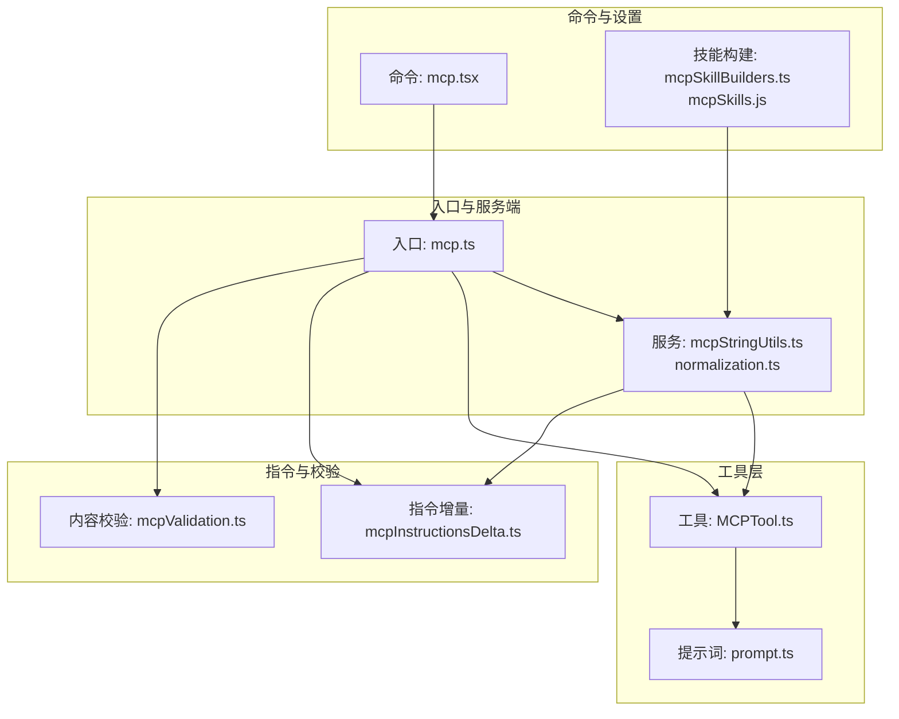
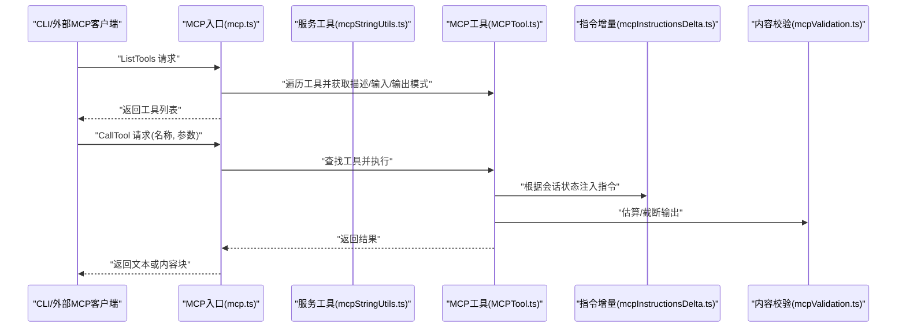
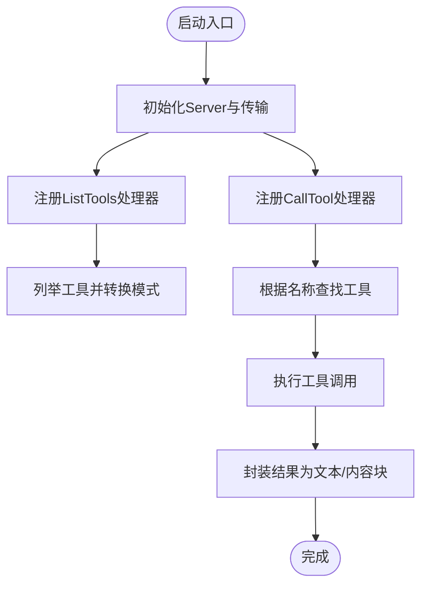
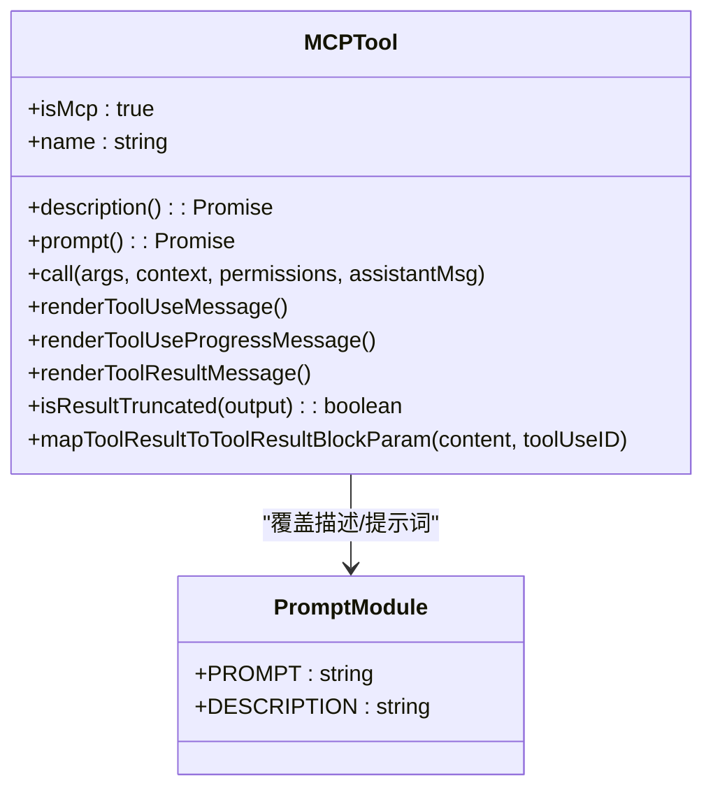
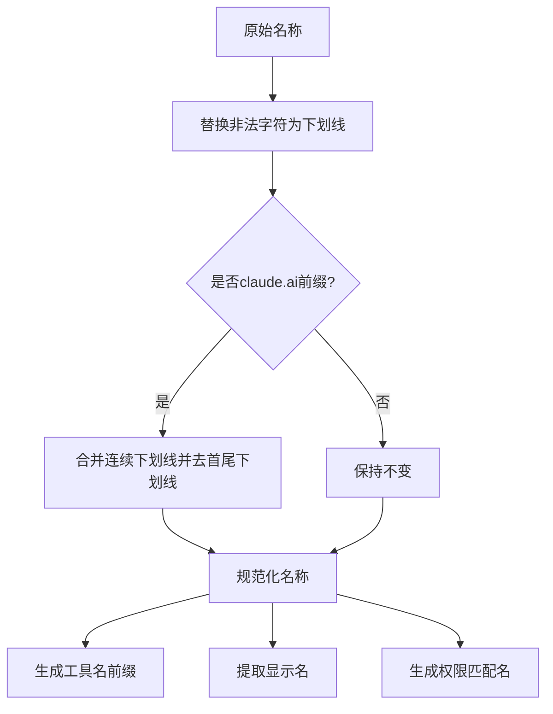
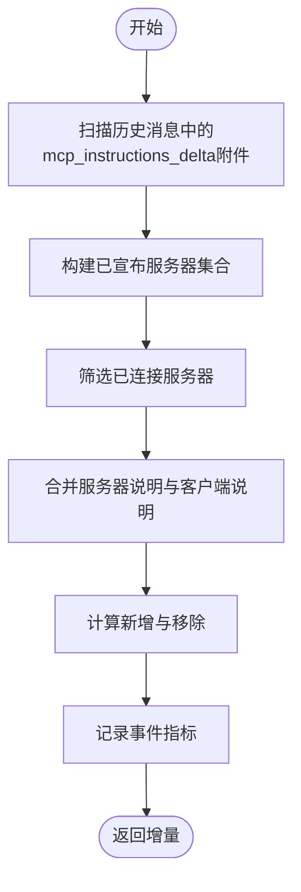
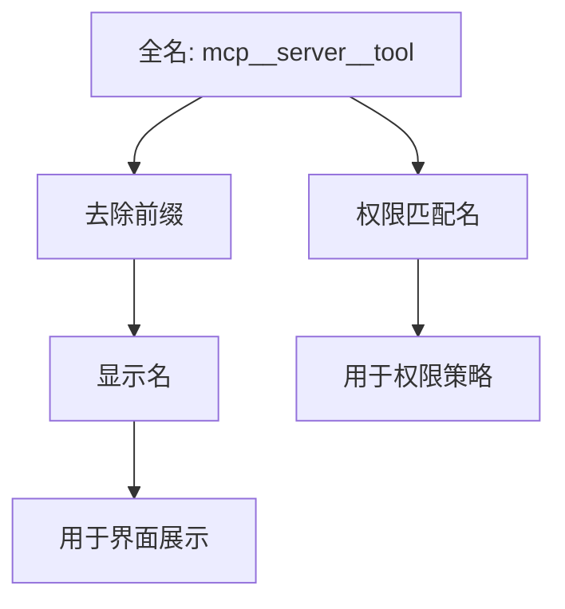
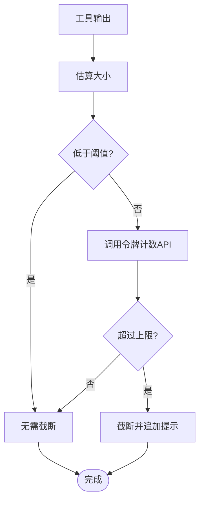
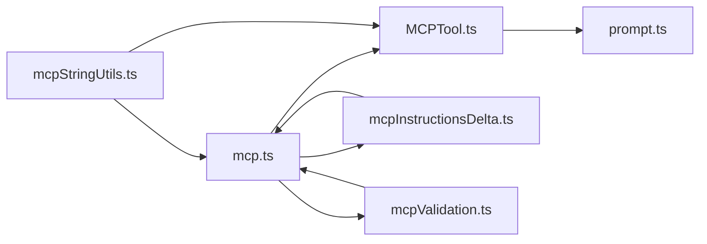

# MCP工具提示词工程

<cite>
**本文档引用的文件**
- [src/entrypoints/mcp.ts](file://src/entrypoints/mcp.ts)
- [src/tools/MCPTool/MCPTool.ts](file://src/tools/MCPTool/MCPTool.ts)
- [src/tools/MCPTool/prompt.ts](file://src/tools/MCPTool/prompt.ts)
- [src/services/mcp/mcpStringUtils.ts](file://src/services/mcp/mcpStringUtils.ts)
- [src/services/mcp/normalization.ts](file://src/services/mcp/normalization.ts)
- [src/utils/mcpInstructionsDelta.ts](file://src/utils/mcpInstructionsDelta.ts)
- [src/utils/mcpValidation.ts](file://src/utils/mcpValidation.ts)
- [src/commands/mcp/mcp.tsx](file://src/commands/mcp/mcp.tsx)
- [src/skills/mcpSkillBuilders.ts](file://src/skills/mcpSkillBuilders.ts)
- [skills/mcpSkills.js](file://skills/mcpSkills.js)
</cite>

## 目录
1. [引言](#引言)
2. [项目结构](#项目结构)
3. [核心组件](#核心组件)
4. [架构总览](#架构总览)
5. [详细组件分析](#详细组件分析)
6. [依赖关系分析](#依赖关系分析)
7. [性能考虑](#性能考虑)
8. [故障排除指南](#故障排除指南)
9. [结论](#结论)
10. [附录](#附录)

## 引言
本文件系统性阐述MCP（Model Context Protocol）工具提示词工程的设计原理与实现方法，聚焦以下主题：
- 提示词模板的构建与参数化机制
- 上下文注入与动态内容生成
- 提示词的标准化处理与格式化规则
- 多语言支持与本地化策略
- 性能优化与缓存机制
- 最佳实践与调试技巧

通过代码级分析与可视化图示，帮助读者从全局到细节全面理解MCP工具在提示词工程中的角色与实现。

## 项目结构
围绕MCP提示词工程的相关模块主要分布在以下路径：
- 入口与服务端：src/entrypoints/mcp.ts、src/services/mcp/*
- 工具定义与UI：src/tools/MCPTool/*
- 指令注入与校验：src/utils/mcpInstructionsDelta.ts、src/utils/mcpValidation.ts
- 命令入口与设置：src/commands/mcp/mcp.tsx
- 名称规范化与技能构建：src/services/mcp/normalization.ts、src/skills/mcpSkillBuilders.ts、skills/mcpSkills.js

**图表来源**
- [src/entrypoints/mcp.ts:35-196](file://src/entrypoints/mcp.ts#L35-L196)
- [src/tools/MCPTool/MCPTool.ts:27-77](file://src/tools/MCPTool/MCPTool.ts#L27-L77)
- [src/tools/MCPTool/prompt.ts:1-4](file://src/tools/MCPTool/prompt.ts#L1-L4)
- [src/services/mcp/mcpStringUtils.ts:19-106](file://src/services/mcp/mcpStringUtils.ts#L19-L106)
- [src/services/mcp/normalization.ts:17-23](file://src/services/mcp/normalization.ts#L17-L23)
- [src/utils/mcpInstructionsDelta.ts:55-130](file://src/utils/mcpInstructionsDelta.ts#L55-L130)
- [src/utils/mcpValidation.ts:26-47](file://src/utils/mcpValidation.ts#L26-L47)
- [src/commands/mcp/mcp.tsx:63-84](file://src/commands/mcp/mcp.tsx#L63-L84)
- [src/skills/mcpSkillBuilders.ts:31-44](file://src/skills/mcpSkillBuilders.ts#L31-L44)
- [skills/mcpSkills.js:1-4](file://skills/mcpSkills.js#L1-L4)

**章节来源**
- [src/entrypoints/mcp.ts:35-196](file://src/entrypoints/mcp.ts#L35-L196)
- [src/tools/MCPTool/MCPTool.ts:27-77](file://src/tools/MCPTool/MCPTool.ts#L27-L77)
- [src/tools/MCPTool/prompt.ts:1-4](file://src/tools/MCPTool/prompt.ts#L1-L4)
- [src/services/mcp/mcpStringUtils.ts:19-106](file://src/services/mcp/mcpStringUtils.ts#L19-L106)
- [src/services/mcp/normalization.ts:17-23](file://src/services/mcp/normalization.ts#L17-L23)
- [src/utils/mcpInstructionsDelta.ts:55-130](file://src/utils/mcpInstructionsDelta.ts#L55-L130)
- [src/utils/mcpValidation.ts:26-47](file://src/utils/mcpValidation.ts#L26-L47)
- [src/commands/mcp/mcp.tsx:63-84](file://src/commands/mcp/mcp.tsx#L63-L84)
- [src/skills/mcpSkillBuilders.ts:31-44](file://src/skills/mcpSkillBuilders.ts#L31-L44)
- [skills/mcpSkills.js:1-4](file://skills/mcpSkills.js#L1-L4)

## 核心组件
- MCP服务端入口：负责启动STDIO传输、注册ListTools与CallTool请求处理器，并将工具能力暴露给外部MCP客户端。
- MCP工具定义：统一的工具骨架，支持动态覆盖名称、描述、提示词与调用逻辑，便于不同MCP服务器按需定制。
- 名称规范化与解析：提供MCP工具名前缀生成、显示名提取、权限匹配名生成等字符串处理函数。
- 指令增量注入：基于会话历史与连接状态，计算并注入MCP服务器的说明块，避免重复与冗余。
- 内容校验与截断：估算输出大小，结合阈值与令牌计数API进行必要截断，保障会话稳定性。
- 命令入口与设置：提供启用/禁用、重连、跳转设置等交互式命令，支撑用户侧MCP管理。

**章节来源**
- [src/entrypoints/mcp.ts:35-196](file://src/entrypoints/mcp.ts#L35-L196)
- [src/tools/MCPTool/MCPTool.ts:27-77](file://src/tools/MCPTool/MCPTool.ts#L27-L77)
- [src/services/mcp/mcpStringUtils.ts:19-106](file://src/services/mcp/mcpStringUtils.ts#L19-L106)
- [src/utils/mcpInstructionsDelta.ts:55-130](file://src/utils/mcpInstructionsDelta.ts#L55-L130)
- [src/utils/mcpValidation.ts:26-47](file://src/utils/mcpValidation.ts#L26-L47)
- [src/commands/mcp/mcp.tsx:63-84](file://src/commands/mcp/mcp.tsx#L63-L84)

## 架构总览
MCP提示词工程以“服务端入口 + 工具定义 + 字符串处理 + 指令注入 + 内容校验”为核心链路，形成从连接建立到工具调用再到结果呈现的完整闭环。

**图表来源**
- [src/entrypoints/mcp.ts:59-188](file://src/entrypoints/mcp.ts#L59-L188)
- [src/tools/MCPTool/MCPTool.ts:27-77](file://src/tools/MCPTool/MCPTool.ts#L27-L77)
- [src/utils/mcpInstructionsDelta.ts:55-130](file://src/utils/mcpInstructionsDelta.ts#L55-L130)
- [src/utils/mcpValidation.ts:151-208](file://src/utils/mcpValidation.ts#L151-L208)

## 详细组件分析

### 组件A：MCP服务端入口与工具暴露
- 职责：初始化Server与STDIO传输；注册ListTools与CallTool处理器；将工具的描述、输入/输出模式转换为MCP兼容格式。
- 关键点：
  - 使用LRU缓存限制文件状态读取，防止内存增长。
  - 将工具输出模式转换为对象根类型，过滤不兼容的联合类型。
  - 在CallTool中构造工具使用上下文，调用工具并封装返回结果。

**图表来源**
- [src/entrypoints/mcp.ts:35-196](file://src/entrypoints/mcp.ts#L35-L196)

**章节来源**
- [src/entrypoints/mcp.ts:35-196](file://src/entrypoints/mcp.ts#L35-L196)

### 组件B：MCP工具定义与提示词模板
- 职责：提供统一的工具骨架，支持动态覆盖名称、描述、提示词与调用逻辑；渲染工具使用消息与进度。
- 关键点：
  - 输入/输出模式采用惰性Schema，允许运行时动态定义。
  - 描述与提示词由prompt模块导出，实际值在客户端覆盖。
  - 支持结果截断检测，适配终端行宽。

**图表来源**
- [src/tools/MCPTool/MCPTool.ts:27-77](file://src/tools/MCPTool/MCPTool.ts#L27-L77)
- [src/tools/MCPTool/prompt.ts:1-4](file://src/tools/MCPTool/prompt.ts#L1-L4)

**章节来源**
- [src/tools/MCPTool/MCPTool.ts:27-77](file://src/tools/MCPTool/MCPTool.ts#L27-L77)
- [src/tools/MCPTool/prompt.ts:1-4](file://src/tools/MCPTool/prompt.ts#L1-L4)

### 组件C：名称规范化与解析
- 职责：将服务器与工具名称规范化为MCP兼容格式；生成工具名前缀；提取显示名；生成权限匹配名。
- 关键点：
  - 规范化函数替换非法字符，对claude.ai服务器名进行额外处理，避免与分隔符冲突。
  - 解析函数支持双下划线保留，但存在已知限制（服务器名含双下划线时解析可能错误）。

**图表来源**
- [src/services/mcp/normalization.ts:17-23](file://src/services/mcp/normalization.ts#L17-L23)
- [src/services/mcp/mcpStringUtils.ts:19-106](file://src/services/mcp/mcpStringUtils.ts#L19-L106)

**章节来源**
- [src/services/mcp/normalization.ts:17-23](file://src/services/mcp/normalization.ts#L17-L23)
- [src/services/mcp/mcpStringUtils.ts:19-106](file://src/services/mcp/mcpStringUtils.ts#L19-L106)

### 组件D：上下文注入与动态内容生成
- 职责：根据当前会话与连接状态，计算新增/移除的MCP服务器说明块，避免重复注入。
- 关键点：
  - 仅扫描已宣布的服务器名集合，基于连接状态差分得到新增与移除。
  - 支持服务器自述说明与客户端侧合成说明的拼接。

**图表来源**
- [src/utils/mcpInstructionsDelta.ts:55-130](file://src/utils/mcpInstructionsDelta.ts#L55-L130)

**章节来源**
- [src/utils/mcpInstructionsDelta.ts:55-130](file://src/utils/mcpInstructionsDelta.ts#L55-L130)

### 组件E：提示词的标准化处理与格式化规则
- 职责：提供名称规范化、工具名构建、显示名提取与权限匹配名生成的统一接口。
- 关键点：
  - 显示名提取支持去除“(MCP)”后缀与服务器前缀，确保展示一致性。
  - 权限匹配名优先使用完全限定的mcp__server__tool形式，避免内置工具名冲突。

**图表来源**
- [src/services/mcp/mcpStringUtils.ts:60-106](file://src/services/mcp/mcpStringUtils.ts#L60-L106)

**章节来源**
- [src/services/mcp/mcpStringUtils.ts:60-106](file://src/services/mcp/mcpStringUtils.ts#L60-L106)

### 组件F：多语言支持与本地化策略
- 现状：仓库包含多语言文档目录（如docs/zh、docs/ja、docs/ko），但未发现直接针对MCP工具提示词的本地化实现文件。
- 建议：
  - 在工具描述与提示词层面引入本地化键值映射，结合运行时语言环境选择对应文案。
  - 对于动态生成的指令块，建议在注入阶段根据会话语言进行本地化处理。

**章节来源**
- [src/commands/mcp/mcp.tsx:63-84](file://src/commands/mcp/mcp.tsx#L63-L84)

### 组件G：性能优化与缓存机制
- 文件状态缓存：在服务端入口使用LRU缓存限制文件状态读取数量与体积，防止内存无界增长。
- 输出截断：通过估算与令牌计数API双重校验，必要时对字符串与内容块进行截断，并追加提示信息。
- 环境与特性门控：输出上限可通过环境变量或特性开关覆盖，兼顾灵活性与稳定性。

**图表来源**
- [src/entrypoints/mcp.ts:40-45](file://src/entrypoints/mcp.ts#L40-L45)
- [src/utils/mcpValidation.ts:151-208](file://src/utils/mcpValidation.ts#L151-L208)

**章节来源**
- [src/entrypoints/mcp.ts:40-45](file://src/entrypoints/mcp.ts#L40-L45)
- [src/utils/mcpValidation.ts:26-47](file://src/utils/mcpValidation.ts#L26-L47)
- [src/utils/mcpValidation.ts:151-208](file://src/utils/mcpValidation.ts#L151-L208)

### 组件H：命令入口与交互式管理
- 职责：提供启用/禁用、重连、跳转设置等命令，支持批量与单个服务器操作。
- 关键点：
  - 支持no-redirect测试参数绕过重定向。
  - 通过状态钩子与全局状态联动，实现服务器切换与反馈。

**章节来源**
- [src/commands/mcp/mcp.tsx:63-84](file://src/commands/mcp/mcp.tsx#L63-L84)

### 组件I：技能构建与MCP集成
- 职责：注册与获取MCP技能构建器，避免依赖环，确保在MCP服务器连接前完成初始化。
- 关键点：
  - 注册发生在加载技能目录模块初始化时，保证运行时可用。

**章节来源**
- [src/skills/mcpSkillBuilders.ts:31-44](file://src/skills/mcpSkillBuilders.ts#L31-L44)
- [skills/mcpSkills.js:1-4](file://skills/mcpSkills.js#L1-L4)

## 依赖关系分析
- MCP入口依赖工具与服务模块，负责统一调度与结果封装。
- 工具定义依赖提示词模块，实际描述与提示词在客户端覆盖。
- 字符串处理模块被入口与工具共同依赖，提供名称规范化与解析能力。
- 指令增量模块依赖会话消息与连接状态，用于动态注入说明。
- 内容校验模块独立于入口，提供估算与截断能力。

**图表来源**
- [src/entrypoints/mcp.ts:35-196](file://src/entrypoints/mcp.ts#L35-L196)
- [src/tools/MCPTool/MCPTool.ts:27-77](file://src/tools/MCPTool/MCPTool.ts#L27-L77)
- [src/tools/MCPTool/prompt.ts:1-4](file://src/tools/MCPTool/prompt.ts#L1-L4)
- [src/services/mcp/mcpStringUtils.ts:19-106](file://src/services/mcp/mcpStringUtils.ts#L19-L106)
- [src/utils/mcpInstructionsDelta.ts:55-130](file://src/utils/mcpInstructionsDelta.ts#L55-L130)
- [src/utils/mcpValidation.ts:151-208](file://src/utils/mcpValidation.ts#L151-L208)

**章节来源**
- [src/entrypoints/mcp.ts:35-196](file://src/entrypoints/mcp.ts#L35-L196)
- [src/tools/MCPTool/MCPTool.ts:27-77](file://src/tools/MCPTool/MCPTool.ts#L27-L77)
- [src/tools/MCPTool/prompt.ts:1-4](file://src/tools/MCPTool/prompt.ts#L1-L4)
- [src/services/mcp/mcpStringUtils.ts:19-106](file://src/services/mcp/mcpStringUtils.ts#L19-L106)
- [src/utils/mcpInstructionsDelta.ts:55-130](file://src/utils/mcpInstructionsDelta.ts#L55-L130)
- [src/utils/mcpValidation.ts:151-208](file://src/utils/mcpValidation.ts#L151-L208)

## 性能考虑
- 缓存策略：服务端入口使用LRU缓存限制文件状态读取，避免内存膨胀。
- 截断策略：先进行启发式估算，再通过令牌计数API精确判断，减少不必要的API调用。
- 环境与特性门控：允许通过环境变量或特性开关调整输出上限，兼顾性能与稳定性。
- 名称规范化：避免非法字符与多余分隔符，降低后续解析成本。

**章节来源**
- [src/entrypoints/mcp.ts:40-45](file://src/entrypoints/mcp.ts#L40-L45)
- [src/utils/mcpValidation.ts:151-208](file://src/utils/mcpValidation.ts#L151-L208)
- [src/services/mcp/normalization.ts:17-23](file://src/services/mcp/normalization.ts#L17-L23)

## 故障排除指南
- 工具未找到：检查工具名称是否与规范化的mcp__server__tool一致，确认权限上下文与工具注册。
- 输入无效：验证输入模式与工具提供的Schema，确保在CallTool前进行校验。
- 输出过大：启用或调整MAX_MCP_OUTPUT_TOKENS，观察截断提示；必要时使用分页/过滤工具。
- 指令未注入：确认会话中是否存在mcp_instructions_delta附件，检查服务器连接状态与说明块生成逻辑。
- 命令异常：通过命令入口的日志与错误封装定位问题，关注权限与工具启用状态。

**章节来源**
- [src/entrypoints/mcp.ts:105-187](file://src/entrypoints/mcp.ts#L105-L187)
- [src/utils/mcpValidation.ts:180-208](file://src/utils/mcpValidation.ts#L180-L208)
- [src/utils/mcpInstructionsDelta.ts:55-130](file://src/utils/mcpInstructionsDelta.ts#L55-L130)

## 结论
MCP工具提示词工程通过“服务端入口 + 工具定义 + 字符串处理 + 指令注入 + 内容校验”的协同，实现了可扩展、可配置且高性能的提示词体系。名称规范化与解析确保跨服务器的一致性；指令增量注入避免冗余；内容校验与缓存保障稳定性与效率。未来可在多语言本地化与更细粒度的提示词模板参数化方面进一步完善。

## 附录
- 最佳实践
  - 在工具描述与提示词中明确参数与约束，使用规范化名称作为唯一标识。
  - 利用指令增量机制按需注入上下文，避免一次性注入过多信息。
  - 配置合理的输出上限并通过特性门控灵活调整。
  - 对动态内容进行预估与截断，确保会话流畅。
- 调试技巧
  - 使用命令入口的no-redirect参数进行测试，快速验证流程。
  - 关注日志与错误封装，定位工具启用、权限与调用失败问题。
  - 通过环境变量与特性开关临时调整行为，隔离问题范围。