# MCP工具核心实现

<cite>
**本文档引用的文件**
- [MCPTool.ts](file://src/tools/MCPTool/MCPTool.ts)
- [UI.tsx](file://src/tools/MCPTool/UI.tsx)
- [prompt.ts](file://src/tools/MCPTool/prompt.ts)
- [classifyForCollapse.ts](file://src/tools/MCPTool/classifyForCollapse.ts)
- [Tool.ts](file://src/Tool.ts)
- [tools.ts](file://src/tools.ts)
- [tools.ts（常量）](file://src/constants/tools.ts)
- [client.ts](file://src/services/mcp/client.ts)
- [useManageMCPConnections.ts](file://src/services/mcp/useManageMCPConnections.ts)
- [print.ts](file://src/cli/print.ts)
</cite>

## 目录
1. [简介](#简介)
2. [项目结构](#项目结构)
3. [核心组件](#核心组件)
4. [架构概览](#架构概览)
5. [详细组件分析](#详细组件分析)
6. [依赖关系分析](#依赖关系分析)
7. [性能考虑](#性能考虑)
8. [故障排除指南](#故障排除指南)
9. [结论](#结论)
10. [附录](#附录)

## 简介

本文档深入分析了Claude代码编辑器中MCP（Model Context Protocol）工具的核心实现。MCP工具作为连接大语言模型与外部工具和服务的关键桥梁，在现代AI辅助开发环境中发挥着重要作用。

本文档重点关注MCPTool类的架构设计、实现细节以及相关的工具定义接口。我们将详细解释：

- MCP工具的类型系统和架构设计
- 输入输出模式和数据流处理机制
- 权限检查机制和安全策略
- UI渲染函数和消息格式化
- 错误处理和结果截断检测
- 核心API参考和使用示例

## 项目结构

MCP工具在项目中的组织结构如下：

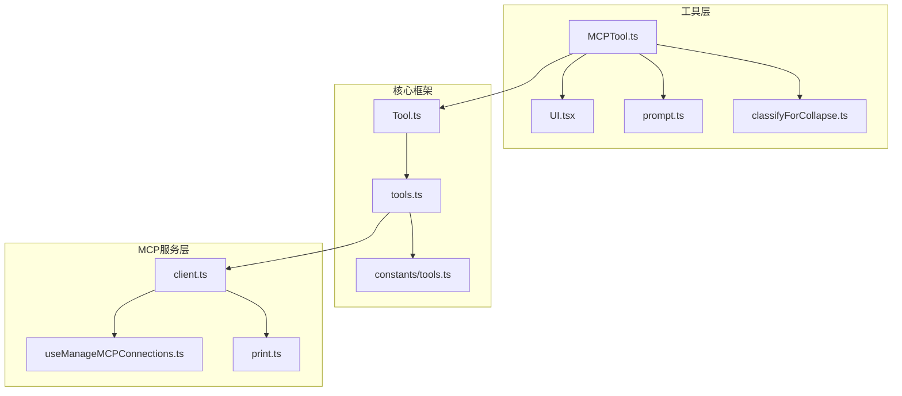

**图表来源**
- [MCPTool.ts:1-78](file://src/tools/MCPTool/MCPTool.ts#L1-L78)
- [UI.tsx:1-403](file://src/tools/MCPTool/UI.tsx#L1-L403)
- [Tool.ts:362-793](file://src/Tool.ts#L362-L793)

**章节来源**
- [MCPTool.ts:1-78](file://src/tools/MCPTool/MCPTool.ts#L1-L78)
- [UI.tsx:1-403](file://src/tools/MCPTool/UI.tsx#L1-L403)
- [Tool.ts:1-793](file://src/Tool.ts#L1-L793)

## 核心组件

### MCPTool类架构设计

MCPTool类是所有MCP工具的基础实现，采用统一的工具定义接口模式：

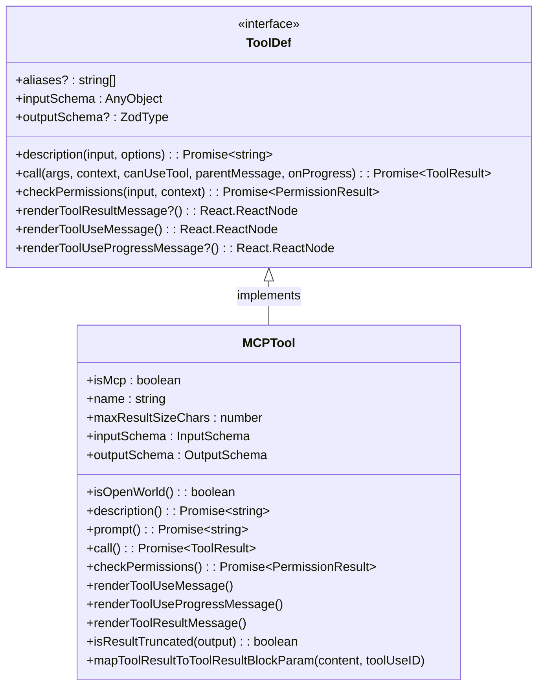

**图表来源**
- [Tool.ts:362-793](file://src/Tool.ts#L362-L793)
- [MCPTool.ts:27-77](file://src/tools/MCPTool/MCPTool.ts#L27-L77)

MCPTool的核心特性包括：

1. **统一的工具接口**：实现完整的ToolDef接口，确保与其他工具的一致性
2. **灵活的输入验证**：使用lazySchema实现延迟模式验证
3. **强大的输出处理**：支持字符串和MCPToolResult两种输出格式
4. **权限管理集成**：内置权限检查机制
5. **UI渲染支持**：提供完整的工具使用和结果渲染功能

**章节来源**
- [MCPTool.ts:27-77](file://src/tools/MCPTool/MCPTool.ts#L27-L77)
- [Tool.ts:362-793](file://src/Tool.ts#L362-L793)

## 架构概览

MCP工具的运行时架构如下：

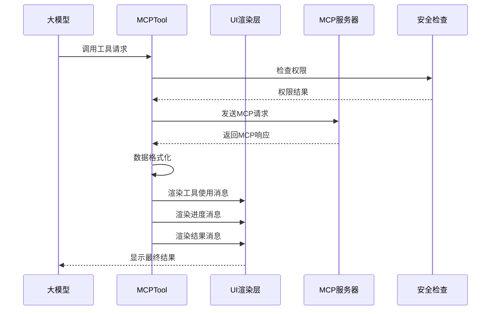

**图表来源**
- [MCPTool.ts:50-69](file://src/tools/MCPTool/MCPTool.ts#L50-L69)
- [UI.tsx:38-90](file://src/tools/MCPTool/UI.tsx#L38-L90)

## 详细组件分析

### 输入输出模式和数据流处理

#### 输入模式

MCPTool采用灵活的输入模式设计：

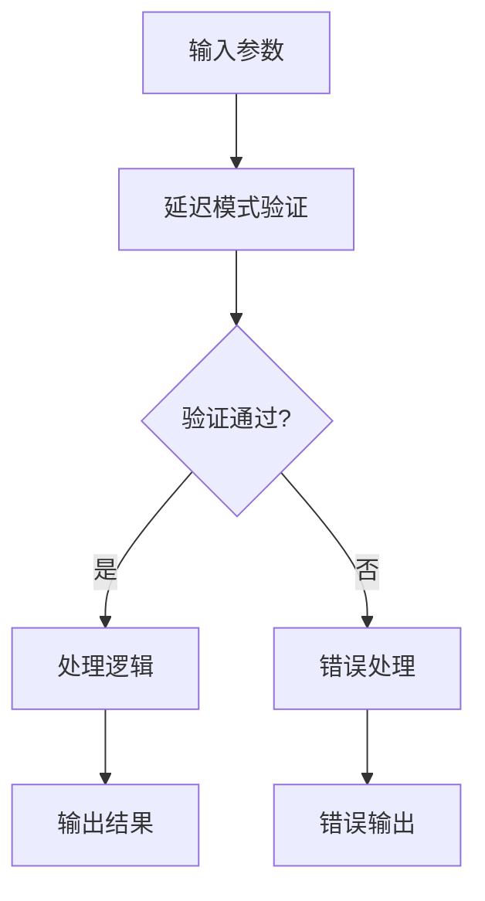

**图表来源**
- [MCPTool.ts:13-19](file://src/tools/MCPTool/MCPTool.ts#L13-L19)

#### 输出模式

MCPTool支持多种输出格式：

1. **字符串输出**：标准文本响应
2. **MCPToolResult数组**：包含多种内容块的复杂响应
3. **图像内容**：专门处理图片类型的响应

**章节来源**
- [MCPTool.ts:17-22](file://src/tools/MCPTool/MCPTool.ts#L17-L22)
- [UI.tsx:114-140](file://src/tools/MCPTool/UI.tsx#L114-L140)

### 类型系统设计

MCPTool的类型系统基于Zod模式验证：

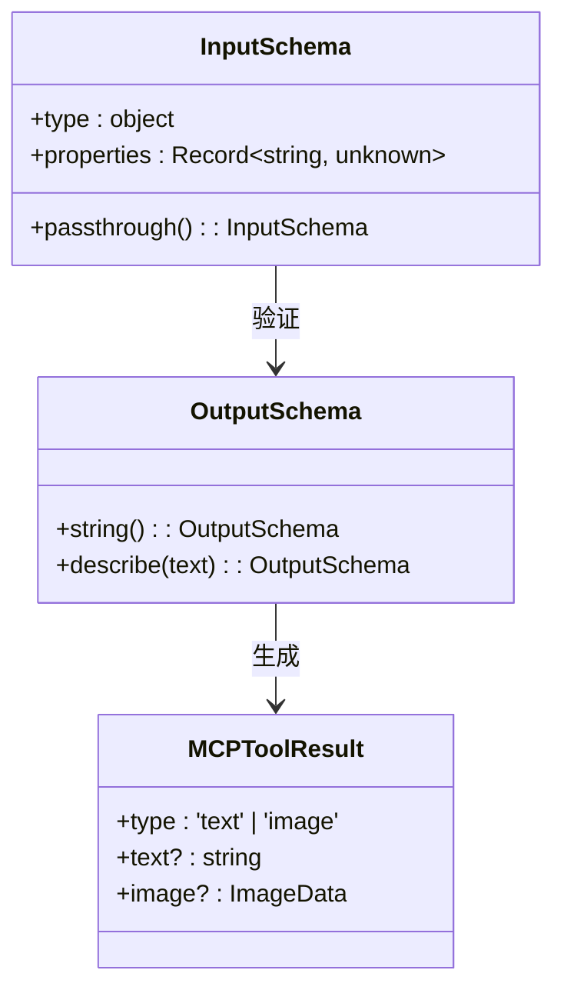

**图表来源**
- [MCPTool.ts:13-19](file://src/tools/MCPTool/MCPTool.ts#L13-L19)
- [UI.tsx:98-140](file://src/tools/MCPTool/UI.tsx#L98-L140)

**章节来源**
- [MCPTool.ts:13-22](file://src/tools/MCPTool/MCPTool.ts#L13-L22)

### 权限检查机制和安全策略

MCPTool实现了多层次的安全检查：

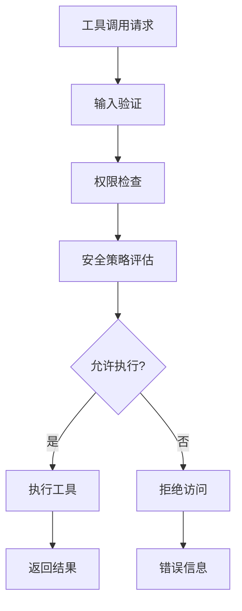

**图表来源**
- [MCPTool.ts:56-61](file://src/tools/MCPTool/MCPTool.ts#L56-L61)
- [Tool.ts:500-503](file://src/Tool.ts#L500-L503)

MCPTool的安全特性包括：

1. **权限结果结构**：标准化的权限检查返回格式
2. **行为控制**：支持允许、拒绝、更新输入等不同行为
3. **消息传递**：提供详细的权限检查反馈信息

**章节来源**
- [MCPTool.ts:56-61](file://src/tools/MCPTool/MCPTool.ts#L56-L61)
- [Tool.ts:500-503](file://src/Tool.ts#L500-L503)

### UI渲染函数和消息格式化

MCPTool提供了完整的UI渲染解决方案：

#### 工具使用消息渲染

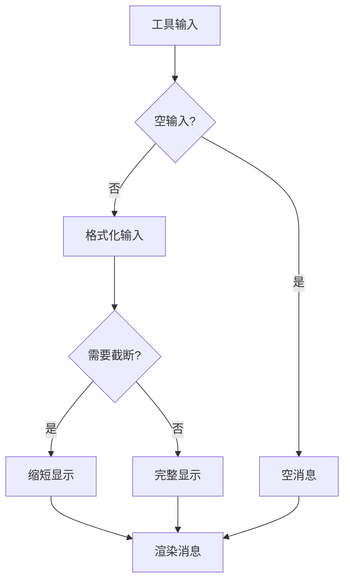

**图表来源**
- [UI.tsx:38-56](file://src/tools/MCPTool/UI.tsx#L38-L56)

#### 进度消息渲染

MCPTool支持详细的进度跟踪：

1. **进度条显示**：可视化进度指示
2. **百分比计算**：精确的完成度显示
3. **状态消息**：实时的状态更新

**章节来源**
- [UI.tsx:57-90](file://src/tools/MCPTool/UI.tsx#L57-L90)

#### 结果消息渲染

MCPTool的结果渲染具有智能内容识别能力：

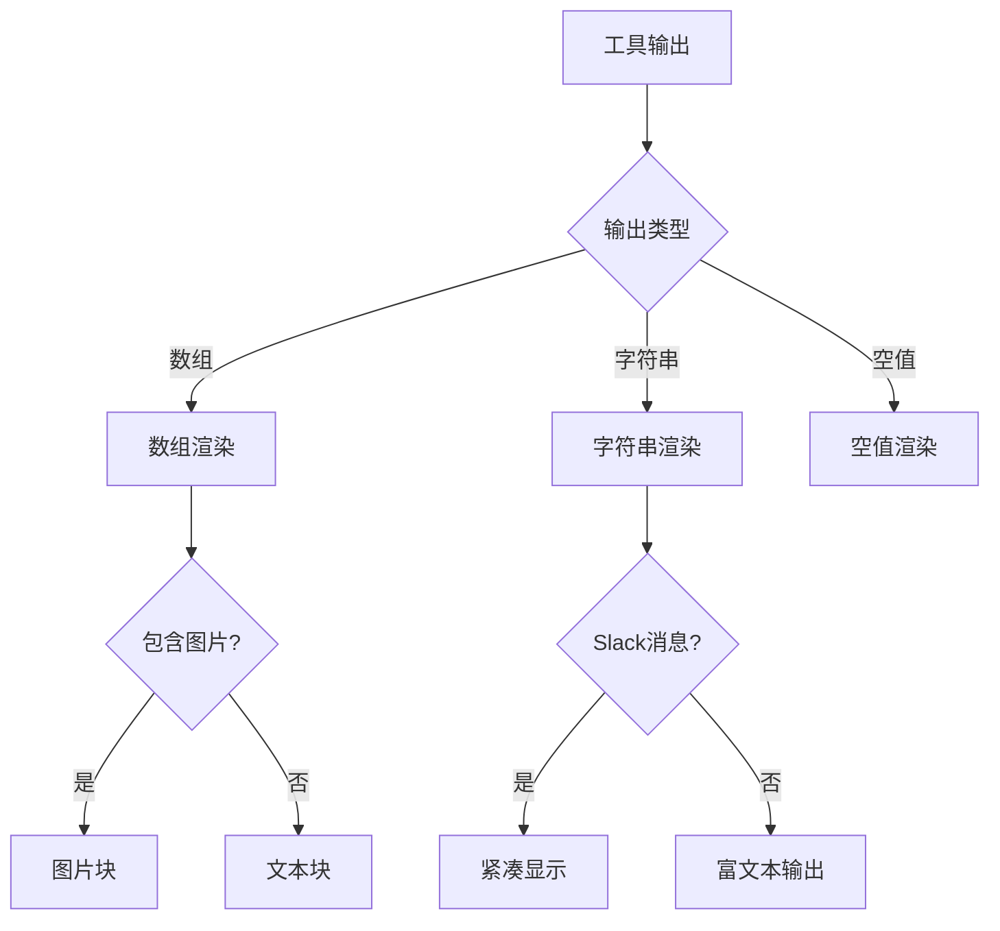

**图表来源**
- [UI.tsx:91-150](file://src/tools/MCPTool/UI.tsx#L91-L150)

**章节来源**
- [UI.tsx:91-150](file://src/tools/MCPTool/UI.tsx#L91-L150)

### 错误处理和结果截断检测

#### 错误处理机制

MCPTool实现了全面的错误处理策略：

1. **截断检测**：自动检测长输出结果
2. **警告提示**：对大型响应提供上下文填充警告
3. **降级渲染**：在错误情况下提供基本的回退显示

#### 结果截断检测

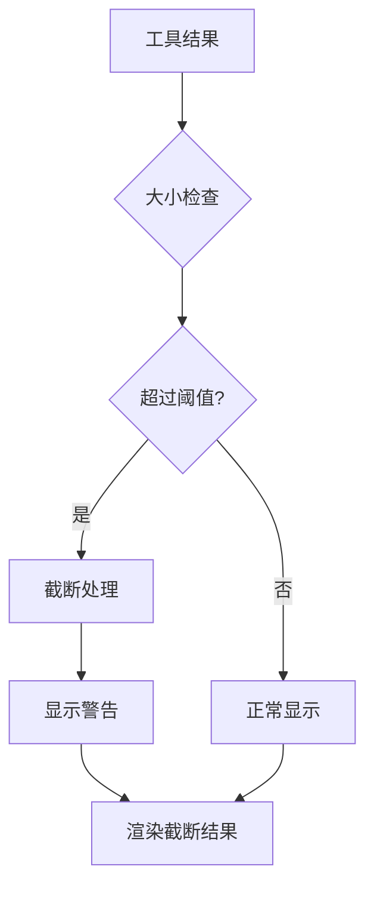

**图表来源**
- [MCPTool.ts:67-69](file://src/tools/MCPTool/MCPTool.ts#L67-L69)
- [UI.tsx:110-113](file://src/tools/MCPTool/UI.tsx#L110-L113)

**章节来源**
- [MCPTool.ts:67-69](file://src/tools/MCPTool/MCPTool.ts#L67-L69)
- [UI.tsx:110-113](file://src/tools/MCPTool/UI.tsx#L110-L113)

### 工具分类和折叠机制

MCPTool提供了智能的工具分类功能，用于UI折叠优化：

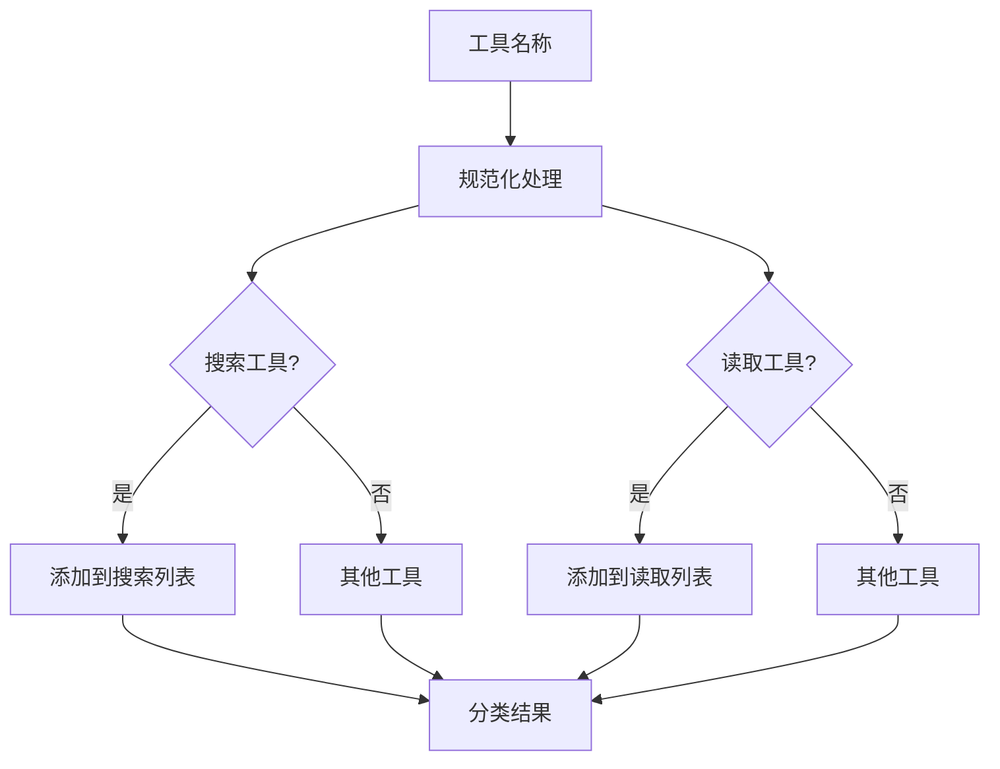

**图表来源**
- [classifyForCollapse.ts:595-604](file://src/tools/MCPTool/classifyForCollapse.ts#L595-L604)

该分类系统支持多种MCP服务器的标准工具集，包括Slack、GitHub、Linear、Datadog等。

**章节来源**
- [classifyForCollapse.ts:1-605](file://src/tools/MCPTool/classifyForCollapse.ts#L1-L605)

## 依赖关系分析

MCP工具的依赖关系网络：

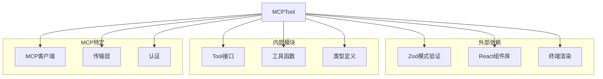

**图表来源**
- [MCPTool.ts:1-11](file://src/tools/MCPTool/MCPTool.ts#L1-L11)
- [UI.tsx:1-18](file://src/tools/MCPTool/UI.tsx#L1-L18)

**章节来源**
- [MCPTool.ts:1-11](file://src/tools/MCPTool/MCPTool.ts#L1-L11)
- [UI.tsx:1-18](file://src/tools/MCPTool/UI.tsx#L1-L18)

## 性能考虑

### 内存管理

MCPTool实现了高效的内存管理策略：

1. **延迟模式加载**：使用lazySchema避免不必要的模式验证
2. **结果大小限制**：maxResultSizeChars防止内存溢出
3. **智能截断**：isResultTruncated检测长输出并进行截断

### 渲染优化

1. **条件渲染**：根据verbose标志选择渲染级别
2. **内容估计**：getContentSizeEstimate预估输出大小
3. **特征检测**：MCP_RICH_OUTPUT开关控制高级渲染

### 并发处理

MCPTool支持并发安全的工具调用，通过isConcurrencySafe方法标识。

## 故障排除指南

### 常见问题诊断

1. **权限被拒绝**
   - 检查checkPermissions返回的行为
   - 验证用户权限配置
   - 查看权限规则匹配

2. **MCP连接失败**
   - 检查MCP服务器状态
   - 验证认证凭据
   - 确认网络连接

3. **UI渲染异常**
   - 检查输出格式是否符合预期
   - 验证渲染函数参数
   - 查看特征开关设置

**章节来源**
- [MCPTool.ts:56-61](file://src/tools/MCPTool/MCPTool.ts#L56-L61)
- [UI.tsx:91-150](file://src/tools/MCPTool/UI.tsx#L91-L150)

## 结论

MCPTool作为Claude代码编辑器中的核心工具组件，展现了优秀的架构设计和实现质量。其主要优势包括：

1. **统一的接口设计**：完全实现ToolDef接口，确保与其他工具的一致性
2. **灵活的数据处理**：支持多种输入输出格式和智能内容识别
3. **完善的安全机制**：多层次的权限检查和安全策略
4. **丰富的UI支持**：完整的工具使用、进度和结果渲染
5. **高效的性能表现**：内存管理和渲染优化策略

MCPTool的设计为AI辅助开发环境提供了可靠的工具抽象层，为开发者提供了强大而灵活的扩展能力。

## 附录

### 核心API参考

#### MCPTool类方法

| 方法名 | 参数 | 返回值 | 描述 |
|--------|------|--------|------|
| `checkPermissions` | input, context | Promise~PermissionResult~ | 执行权限检查 |
| `renderToolUseMessage` | input, options | React.ReactNode | 渲染工具使用消息 |
| `renderToolUseProgressMessage` | progressMessages | React.ReactNode | 渲染进度消息 |
| `renderToolResultMessage` | output, progress, options | React.ReactNode | 渲染结果消息 |
| `isResultTruncated` | output | boolean | 检测结果是否截断 |

#### 关键属性

| 属性名 | 类型 | 默认值 | 描述 |
|--------|------|--------|------|
| `isMcp` | boolean | true | 标识MCP工具类型 |
| `maxResultSizeChars` | number | 100,000 | 最大结果字符数 |
| `inputSchema` | InputSchema | lazySchema | 输入模式定义 |
| `outputSchema` | OutputSchema | lazySchema | 输出模式定义 |

### 使用示例

#### 基本工具实现

```typescript
// 继承MCPTool基础类
const MyMCPTool = buildTool({
  name: 'my_mcp_tool',
  async call(args, context, canUseTool, parentMessage, onProgress) {
    // 实现工具逻辑
    return {
      data: '工具结果',
    }
  },
  // 其他可选方法...
})
```

#### 自定义渲染

```typescript
const MyMCPTool = buildTool({
  name: 'custom_render_tool',
  renderToolResultMessage(content, progressMessages, options) {
    // 自定义结果渲染逻辑
    return <div>自定义渲染</div>
  },
  renderToolUseMessage(input, options) {
    // 自定义使用消息渲染
    return <div>自定义使用消息</div>
  },
})
```

**章节来源**
- [MCPTool.ts:27-77](file://src/tools/MCPTool/MCPTool.ts#L27-L77)
- [Tool.ts:783-792](file://src/Tool.ts#L783-L792)