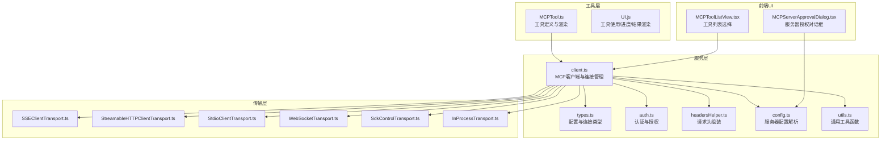
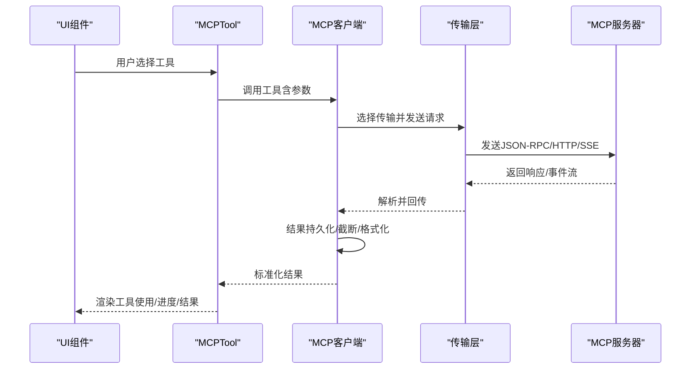
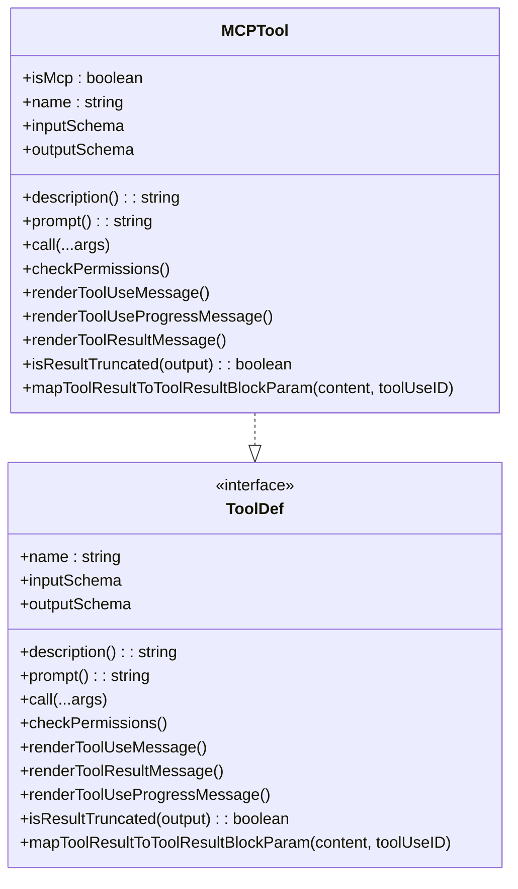
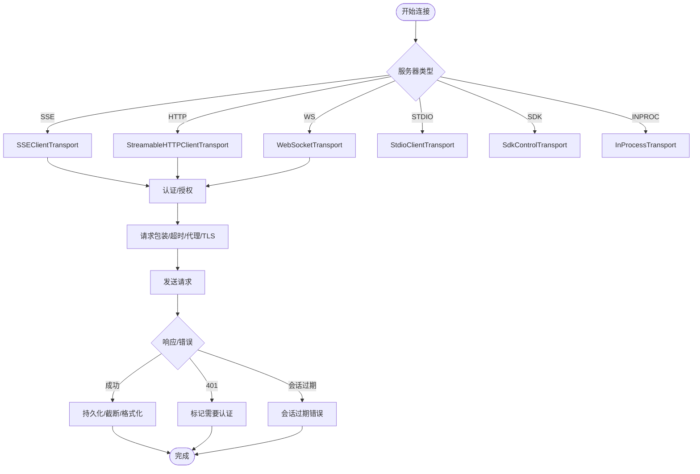
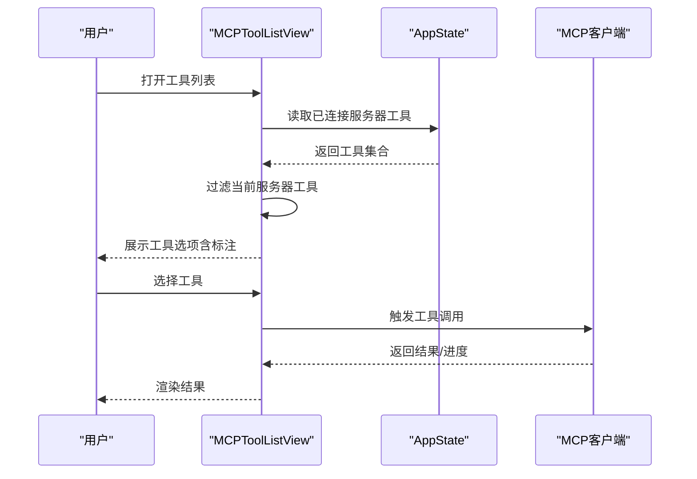
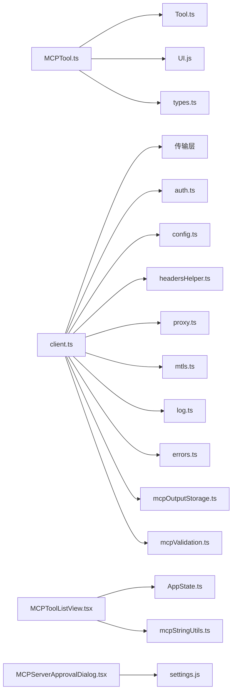

# 工具包装器

<cite>
**本文引用的文件**
- [src/tools/MCPTool/MCPTool.ts](file://src/tools/MCPTool/MCPTool.ts)
- [src/tools/MCPTool/prompt.ts](file://src/tools/MCPTool/prompt.ts)
- [src/services/mcp/client.ts](file://src/services/mcp/client.ts)
- [src/services/mcp/types.ts](file://src/services/mcp/types.ts)
- [src/components/mcp/MCPToolListView.tsx](file://src/components/mcp/MCPToolListView.tsx)
- [src/components/MCPServerApprovalDialog.tsx](file://src/components/MCPServerApprovalDialog.tsx)
- [src/components/mcp/index.ts](file://src/components/mcp/index.ts)
- [src/services/mcp/config.ts](file://src/services/mcp/config.ts)
- [src/services/mcp/auth.ts](file://src/services/mcp/auth.ts)
- [src/services/mcp/utils.ts](file://src/services/mcp/utils.ts)
- [src/services/mcp/headersHelper.ts](file://src/services/mcp/headersHelper.ts)
- [src/services/mcp/normalization.ts](file://src/services/mcp/normalization.ts)
- [src/services/mcp/mcpStringUtils.ts](file://src/services/mcp/mcpStringUtils.ts)
- [src/utils/mcpValidation.ts](file://src/utils/mcpValidation.ts)
- [src/utils/mcpOutputStorage.ts](file://src/utils/mcpOutputStorage.ts)
- [src/utils/errors.ts](file://src/utils/errors.ts)
- [src/utils/log.ts](file://src/utils/log.ts)
- [src/utils/http.ts](file://src/utils/http.ts)
- [src/utils/proxy.ts](file://src/utils/proxy.ts)
- [src/utils/mtls.ts](file://src/utils/mtls.ts)
- [src/utils/abortController.ts](file://src/utils/abortController.ts)
- [src/utils/sanitization.ts](file://src/utils/sanitization.ts)
- [src/utils/sleep.ts](file://src/utils/sleep.ts)
- [src/utils/cleanupRegistry.ts](file://src/utils/cleanupRegistry.ts)
- [src/utils/toolResultStorage.ts](file://src/utils/toolResultStorage.ts)
- [src/utils/sessionIngressAuth.ts](file://src/utils/sessionIngressAuth.ts)
- [src/bootstrap/state.ts](file://src/bootstrap/state.ts)
- [src/constants/oauth.ts](file://src/constants/oauth.ts)
- [src/constants/product.ts](file://src/constants/product.ts)
- [src/Tool.ts](file://src/Tool.ts)
- [src/tools/ListMcpResourcesTool/ListMcpResourcesTool.ts](file://src/tools/ListMcpResourcesTool/ListMcpResourcesTool.ts)
- [src/tools/ReadMcpResourceTool/ReadMcpResourceTool.ts](file://src/tools/ReadMcpResourceTool/ReadMcpResourceTool.ts)
- [src/tools/MCPTool/UI.js](file://src/tools/MCPTool/UI.js)
- [src/tools/MCPTool/classifyForCollapse.ts](file://src/tools/MCPTool/classifyForCollapse.ts)
- [src/services/mcp/elicitationHandler.ts](file://src/services/mcp/elicitationHandler.ts)
- [src/services/mcp/useManageMCPConnections.ts](file://src/services/mcp/useManageMCPConnections.ts)
- [src/services/mcp/SdkControlTransport.ts](file://src/services/mcp/SdkControlTransport.ts)
- [src/services/mcp/InProcessTransport.ts](file://src/services/mcp/InProcessTransport.ts)
- [src/services/mcp/StreamableHTTPClientTransport.ts](file://src/services/mcp/StreamableHTTPClientTransport.ts)
- [src/services/mcp/SSEClientTransport.ts](file://src/services/mcp/SSEClientTransport.ts)
- [src/services/mcp/StdioClientTransport.ts](file://src/services/mcp/StdioClientTransport.ts)
- [src/services/mcp/WebSocketTransport.ts](file://src/services/mcp/WebSocketTransport.ts)
</cite>

## 目录
1. [引言](#引言)
2. [项目结构](#项目结构)
3. [核心组件](#核心组件)
4. [架构总览](#架构总览)
5. [详细组件分析](#详细组件分析)
6. [依赖关系分析](#依赖关系分析)
7. [性能考量](#性能考量)
8. [故障排查指南](#故障排查指南)
9. [结论](#结论)
10. [附录](#附录)

## 引言
本文件系统性阐述MCP（Model Context Protocol）工具包装器的设计理念、架构模式与实现细节，覆盖以下主题：
- 封装机制与接口适配：如何将MCP服务器能力以统一工具接口暴露给上层调用。
- UI组件与用户交互：工具列表、服务器授权对话框等前端交互设计。
- 提示词工程与参数处理：描述与提示的动态生成、参数校验与截断策略。
- 错误处理与结果格式化：认证失败、会话过期、工具调用错误与输出持久化。
- 开发流程与集成方法：从配置到连接、从工具发现到调用执行。
- 自定义MCP工具开发指南与最佳实践。

## 项目结构
围绕MCP工具包装器的关键目录与文件：
- 工具定义与UI渲染：src/tools/MCPTool/*
- MCP客户端与传输层：src/services/mcp/*
- 前端MCP UI组件：src/components/mcp/*
- 工具与资源工具：src/tools/*（如ListMcpResourcesTool、ReadMcpResourceTool）
- 工具基类与类型：src/Tool.ts、src/types/tools.js
- 工具调用与结果存储：src/utils/mcpValidation.ts、src/utils/mcpOutputStorage.ts、src/utils/toolResultStorage.ts
- 配置与权限：src/services/mcp/config.ts、src/services/mcp/auth.ts、src/services/mcp/headersHelper.ts

图表来源
- [src/tools/MCPTool/MCPTool.ts:1-78](file://src/tools/MCPTool/MCPTool.ts#L1-L78)
- [src/services/mcp/client.ts:1-800](file://src/services/mcp/client.ts#L1-L800)
- [src/services/mcp/types.ts:1-259](file://src/services/mcp/types.ts#L1-L259)
- [src/components/mcp/MCPToolListView.tsx:1-141](file://src/components/mcp/MCPToolListView.tsx#L1-L141)
- [src/components/MCPServerApprovalDialog.tsx:1-115](file://src/components/MCPServerApprovalDialog.tsx#L1-L115)

章节来源
- [src/tools/MCPTool/MCPTool.ts:1-78](file://src/tools/MCPTool/MCPTool.ts#L1-L78)
- [src/services/mcp/client.ts:1-800](file://src/services/mcp/client.ts#L1-L800)
- [src/services/mcp/types.ts:1-259](file://src/services/mcp/types.ts#L1-L259)
- [src/components/mcp/MCPToolListView.tsx:1-141](file://src/components/mcp/MCPToolListView.tsx#L1-L141)
- [src/components/MCPServerApprovalDialog.tsx:1-115](file://src/components/MCPServerApprovalDialog.tsx#L1-L115)

## 核心组件
- MCPTool工具定义：提供统一的工具接口，包括名称、描述、输入/输出模式、权限检查、渲染钩子以及结果截断判定。
- MCP客户端：负责服务器连接、传输层抽象、认证、超时与重试、错误分类与缓存、结果持久化与格式化。
- 传输层：支持SSE、HTTP（可流式）、WebSocket、STDIO、SDK与进程内传输，按服务器类型自动选择。
- UI组件：工具列表选择、服务器授权对话框等，提供用户交互入口。
- 类型与配置：严格的Zod Schema定义服务器配置、连接状态与资源类型，确保运行时安全。

章节来源
- [src/tools/MCPTool/MCPTool.ts:27-78](file://src/tools/MCPTool/MCPTool.ts#L27-L78)
- [src/services/mcp/client.ts:595-800](file://src/services/mcp/client.ts#L595-L800)
- [src/services/mcp/types.ts:108-227](file://src/services/mcp/types.ts#L108-L227)
- [src/components/mcp/MCPToolListView.tsx:20-134](file://src/components/mcp/MCPToolListView.tsx#L20-L134)
- [src/components/MCPServerApprovalDialog.tsx:12-114](file://src/components/MCPServerApprovalDialog.tsx#L12-L114)

## 架构总览
MCP工具包装器采用“工具定义 + 客户端 + 传输层 + UI”的分层架构：
- 工具层：通过buildTool构建统一工具接口，MCPTool.ts中定义默认行为，具体名称、描述、调用逻辑在客户端侧动态覆写。
- 客户端层：client.ts集中处理连接、认证、请求包装、错误分类、缓存与重试、结果持久化与格式化。
- 传输层：根据服务器类型选择SSE、HTTP、WebSocket、STDIO或SDK传输，统一封装消息收发。
- UI层：前端组件负责工具选择、服务器授权、展示与交互。

图表来源
- [src/tools/MCPTool/MCPTool.ts:27-78](file://src/tools/MCPTool/MCPTool.ts#L27-L78)
- [src/services/mcp/client.ts:595-800](file://src/services/mcp/client.ts#L595-L800)
- [src/services/mcp/SSEClientTransport.ts](file://src/services/mcp/SSEClientTransport.ts)
- [src/services/mcp/StreamableHTTPClientTransport.ts](file://src/services/mcp/StreamableHTTPClientTransport.ts)
- [src/services/mcp/WebSocketTransport.ts](file://src/services/mcp/WebSocketTransport.ts)
- [src/services/mcp/StdioClientTransport.ts](file://src/services/mcp/StdioClientTransport.ts)
- [src/services/mcp/SdkControlTransport.ts](file://src/services/mcp/SdkControlTransport.ts)
- [src/services/mcp/InProcessTransport.ts](file://src/services/mcp/InProcessTransport.ts)

## 详细组件分析

### 工具定义与封装机制
- 统一接口：MCPTool.ts通过buildTool定义工具骨架，包括名称、描述、输入/输出Schema、权限检查、渲染钩子与截断判定。
- 动态覆写：实际工具名、描述与调用逻辑在客户端侧动态设置，保证同一工具实例可适配不同MCP服务器与工具。
- 参数与结果：输入Schema允许任意对象，输出Schema为字符串；通过lazySchema延迟求值避免循环依赖。
- 权限与UI：checkPermissions返回透传策略与提示；UI.js提供工具使用、进度与结果的消息渲染。

图表来源
- [src/tools/MCPTool/MCPTool.ts:27-78](file://src/tools/MCPTool/MCPTool.ts#L27-L78)
- [src/Tool.ts](file://src/Tool.ts)

章节来源
- [src/tools/MCPTool/MCPTool.ts:1-78](file://src/tools/MCPTool/MCPTool.ts#L1-L78)
- [src/tools/MCPTool/prompt.ts:1-4](file://src/tools/MCPTool/prompt.ts#L1-L4)

### MCP客户端与连接管理
- 连接策略：按服务器类型选择传输层，支持SSE、HTTP、WebSocket、STDIO、SDK与进程内连接；对IDE服务器进行工具白名单过滤。
- 认证与授权：支持OAuth与Claude.ai代理；统一处理401与“会话未找到”错误；需要认证时缓存标记并在UI中提示。
- 请求包装：统一超时策略、Accept头规范化、代理与TLS选项、会话入口令牌注入。
- 错误分类：区分认证错误、会话过期、工具调用错误；提供可携带_meta的错误类型用于保留元数据。
- 结果处理：内容大小估算、截断与持久化、二进制内容保存、调试日志与遥测。

图表来源
- [src/services/mcp/client.ts:595-800](file://src/services/mcp/client.ts#L595-L800)
- [src/services/mcp/SSEClientTransport.ts](file://src/services/mcp/SSEClientTransport.ts)
- [src/services/mcp/StreamableHTTPClientTransport.ts](file://src/services/mcp/StreamableHTTPClientTransport.ts)
- [src/services/mcp/WebSocketTransport.ts](file://src/services/mcp/WebSocketTransport.ts)
- [src/services/mcp/StdioClientTransport.ts](file://src/services/mcp/StdioClientTransport.ts)
- [src/services/mcp/SdkControlTransport.ts](file://src/services/mcp/SdkControlTransport.ts)
- [src/services/mcp/InProcessTransport.ts](file://src/services/mcp/InProcessTransport.ts)

章节来源
- [src/services/mcp/client.ts:146-229](file://src/services/mcp/client.ts#L146-L229)
- [src/services/mcp/client.ts:340-422](file://src/services/mcp/client.ts#L340-L422)
- [src/services/mcp/client.ts:492-550](file://src/services/mcp/client.ts#L492-L550)
- [src/services/mcp/client.ts:595-800](file://src/services/mcp/client.ts#L595-L800)

### UI组件与用户交互
- 工具列表视图：根据当前服务器过滤可用工具，展示只读、破坏性、开放世界等标注，并支持键盘导航与确认。
- 服务器授权对话框：提供“本次使用/全部项目使用/不使用”三种选择，更新本地设置并记录分析事件。

图表来源
- [src/components/mcp/MCPToolListView.tsx:20-134](file://src/components/mcp/MCPToolListView.tsx#L20-L134)
- [src/services/mcp/utils.ts](file://src/services/mcp/utils.ts)
- [src/services/mcp/mcpStringUtils.ts](file://src/services/mcp/mcpStringUtils.ts)

章节来源
- [src/components/mcp/MCPToolListView.tsx:1-141](file://src/components/mcp/MCPToolListView.tsx#L1-L141)
- [src/components/MCPServerApprovalDialog.tsx:1-115](file://src/components/MCPServerApprovalDialog.tsx#L1-L115)

### 提示词工程与参数处理
- 描述与提示：MCPTool.ts中占位符由客户端动态覆写，确保每个工具的描述与提示与服务器能力一致。
- 参数Schema：输入Schema允许任意对象，便于MCP服务器自定义参数；输出Schema统一为字符串，便于后续截断与持久化。
- 截断与格式化：基于字符数限制与内容大小估算，必要时截断并生成大输出指引与二进制内容保存消息。

章节来源
- [src/tools/MCPTool/MCPTool.ts:13-25](file://src/tools/MCPTool/MCPTool.ts#L13-L25)
- [src/tools/MCPTool/prompt.ts:1-4](file://src/tools/MCPTool/prompt.ts#L1-L4)
- [src/utils/mcpValidation.ts](file://src/utils/mcpValidation.ts)
- [src/utils/mcpOutputStorage.ts](file://src/utils/mcpOutputStorage.ts)

### 错误处理与结果格式化
- 认证错误：捕获401与“会话未找到”，记录分析事件并缓存标记，引导用户授权或重新连接。
- 工具调用错误：封装带_meta的错误类型，保留服务器返回的元信息以便诊断。
- 结果持久化：二进制内容与大文本结果持久化，生成可复用的消息与指令。
- 日志与遥测：统一的日志与事件记录，便于问题定位与性能监控。

章节来源
- [src/services/mcp/client.ts:152-186](file://src/services/mcp/client.ts#L152-L186)
- [src/services/mcp/client.ts:193-206](file://src/services/mcp/client.ts#L193-L206)
- [src/utils/mcpOutputStorage.ts](file://src/utils/mcpOutputStorage.ts)
- [src/utils/log.ts](file://src/utils/log.ts)
- [src/utils/errors.ts](file://src/utils/errors.ts)

### 开发流程与集成方法
- 配置与发现：通过配置解析与服务器发现，识别本地/远程/IDE服务器，按作用域与插件来源组织。
- 连接与认证：按类型初始化传输层，注入头部、代理、TLS与会话令牌；处理OAuth与代理授权。
- 工具注册：列举工具与资源，规范化显示名称，过滤IDE工具白名单。
- 调用与渲染：触发工具调用，渲染使用、进度与结果消息，处理截断与持久化。

章节来源
- [src/services/mcp/config.ts](file://src/services/mcp/config.ts)
- [src/services/mcp/auth.ts](file://src/services/mcp/auth.ts)
- [src/services/mcp/headersHelper.ts](file://src/services/mcp/headersHelper.ts)
- [src/services/mcp/utils.ts](file://src/services/mcp/utils.ts)
- [src/services/mcp/mcpStringUtils.ts](file://src/services/mcp/mcpStringUtils.ts)
- [src/services/mcp/normalization.ts](file://src/services/mcp/normalization.ts)

### 自定义MCP工具开发指南与最佳实践
- 工具命名与描述：使用规范化名称，确保描述与提示与服务器能力一致；避免过长描述，必要时截断。
- 输入参数：遵循MCP服务器Schema，保持参数最小化与明确性；对敏感参数进行脱敏。
- 输出处理：统一字符串输出，必要时进行截断与二进制内容持久化；提供大输出指引。
- 权限与安全：启用权限检查与认证缓存；对401与会话过期进行优雅降级。
- UI体验：提供清晰的工具标注（只读/破坏性/开放世界），优化键盘导航与确认流程。
- 可观测性：记录分析事件与调试日志，便于问题追踪与性能优化。

章节来源
- [src/tools/MCPTool/MCPTool.ts:27-78](file://src/tools/MCPTool/MCPTool.ts#L27-L78)
- [src/services/mcp/client.ts:340-422](file://src/services/mcp/client.ts#L340-L422)
- [src/services/mcp/client.ts:492-550](file://src/services/mcp/client.ts#L492-L550)
- [src/utils/mcpValidation.ts](file://src/utils/mcpValidation.ts)
- [src/utils/mcpOutputStorage.ts](file://src/utils/mcpOutputStorage.ts)

## 依赖关系分析
- 工具层依赖：MCPTool依赖工具基类与渲染模块，同时依赖类型系统与终端工具用于截断判断。
- 客户端依赖：client.ts依赖传输层、认证、配置、头部助手、代理与TLS、日志与错误处理、结果存储等。
- UI依赖：列表视图依赖状态与工具字符串工具，授权对话框依赖设置与分析事件。

图表来源
- [src/tools/MCPTool/MCPTool.ts:1-78](file://src/tools/MCPTool/MCPTool.ts#L1-L78)
- [src/Tool.ts](file://src/Tool.ts)
- [src/services/mcp/client.ts:1-800](file://src/services/mcp/client.ts#L1-L800)
- [src/services/mcp/types.ts:1-259](file://src/services/mcp/types.ts#L1-L259)
- [src/components/mcp/MCPToolListView.tsx:1-141](file://src/components/mcp/MCPToolListView.tsx#L1-L141)
- [src/components/MCPServerApprovalDialog.tsx:1-115](file://src/components/MCPServerApprovalDialog.tsx#L1-L115)

章节来源
- [src/tools/MCPTool/MCPTool.ts:1-78](file://src/tools/MCPTool/MCPTool.ts#L1-L78)
- [src/services/mcp/client.ts:1-800](file://src/services/mcp/client.ts#L1-L800)
- [src/components/mcp/MCPToolListView.tsx:1-141](file://src/components/mcp/MCPToolListView.tsx#L1-L141)
- [src/components/MCPServerApprovalDialog.tsx:1-115](file://src/components/MCPServerApprovalDialog.tsx#L1-L115)

## 性能考量
- 连接批处理：批量连接服务器时限制并发度，避免资源争用。
- 缓存与去重：认证缓存与读取缓存，减少重复请求与磁盘IO。
- 超时与重试：针对单请求设置超时，避免信号过期导致的阻塞；对OAuth 401进行一次性重试。
- 内容截断：对大输出与长描述进行截断，降低上下文占用与渲染压力。
- 传输优化：SSE/HTTP流式传输要求Accept头规范化，避免406错误导致的重试。

章节来源
- [src/services/mcp/client.ts:552-561](file://src/services/mcp/client.ts#L552-L561)
- [src/services/mcp/client.ts:280-316](file://src/services/mcp/client.ts#L280-L316)
- [src/services/mcp/client.ts:492-550](file://src/services/mcp/client.ts#L492-L550)
- [src/utils/mcpValidation.ts](file://src/utils/mcpValidation.ts)

## 故障排查指南
- 认证失败（401）：检查OAuth令牌是否有效与刷新；查看分析事件与缓存标记；确认代理与TLS配置。
- 会话过期（404 + JSON-RPC -32001）：清理连接缓存并重新建立客户端；确认会话入口令牌有效性。
- 工具调用错误：捕获带_meta的错误类型，保留元信息用于诊断；检查服务器返回的描述与参数。
- 大输出与二进制内容：确认持久化路径与权限；查看大输出指引与二进制保存消息。
- 网络与代理：验证代理设置与TLS选项；检查SSE/WS连接是否被防火墙拦截。

章节来源
- [src/services/mcp/client.ts:152-186](file://src/services/mcp/client.ts#L152-L186)
- [src/services/mcp/client.ts:193-206](file://src/services/mcp/client.ts#L193-L206)
- [src/utils/mcpOutputStorage.ts](file://src/utils/mcpOutputStorage.ts)
- [src/utils/proxy.ts](file://src/utils/proxy.ts)
- [src/utils/mtls.ts](file://src/utils/mtls.ts)

## 结论
MCP工具包装器通过统一的工具接口、灵活的客户端与传输层抽象、完善的UI交互与错误处理机制，实现了对多源MCP服务器能力的安全、高效与一致化封装。开发者可基于此框架快速集成新工具与服务器，同时遵循最佳实践确保安全性、可观测性与用户体验。

## 附录
- 关键文件索引
  - 工具定义与渲染：[src/tools/MCPTool/MCPTool.ts:1-78](file://src/tools/MCPTool/MCPTool.ts#L1-L78)、[src/tools/MCPTool/UI.js](file://src/tools/MCPTool/UI.js)
  - 客户端与传输：[src/services/mcp/client.ts:1-800](file://src/services/mcp/client.ts#L1-L800)、[src/services/mcp/SSEClientTransport.ts](file://src/services/mcp/SSEClientTransport.ts)、[src/services/mcp/StreamableHTTPClientTransport.ts](file://src/services/mcp/StreamableHTTPClientTransport.ts)、[src/services/mcp/WebSocketTransport.ts](file://src/services/mcp/WebSocketTransport.ts)、[src/services/mcp/StdioClientTransport.ts](file://src/services/mcp/StdioClientTransport.ts)、[src/services/mcp/SdkControlTransport.ts](file://src/services/mcp/SdkControlTransport.ts)、[src/services/mcp/InProcessTransport.ts](file://src/services/mcp/InProcessTransport.ts)
  - UI组件：[src/components/mcp/MCPToolListView.tsx:1-141](file://src/components/mcp/MCPToolListView.tsx#L1-L141)、[src/components/MCPServerApprovalDialog.tsx:1-115](file://src/components/MCPServerApprovalDialog.tsx#L1-L115)
  - 类型与配置：[src/services/mcp/types.ts:1-259](file://src/services/mcp/types.ts#L1-L259)、[src/services/mcp/config.ts](file://src/services/mcp/config.ts)
  - 认证与工具：[src/services/mcp/auth.ts](file://src/services/mcp/auth.ts)、[src/services/mcp/utils.ts](file://src/services/mcp/utils.ts)、[src/services/mcp/headersHelper.ts](file://src/services/mcp/headersHelper.ts)、[src/services/mcp/normalization.ts](file://src/services/mcp/normalization.ts)、[src/services/mcp/mcpStringUtils.ts](file://src/services/mcp/mcpStringUtils.ts)
  - 结果与错误：[src/utils/mcpValidation.ts](file://src/utils/mcpValidation.ts)、[src/utils/mcpOutputStorage.ts](file://src/utils/mcpOutputStorage.ts)、[src/utils/errors.ts](file://src/utils/errors.ts)、[src/utils/log.ts](file://src/utils/log.ts)
  - 环境与网络：[src/utils/http.ts](file://src/utils/http.ts)、[src/utils/proxy.ts](file://src/utils/proxy.ts)、[src/utils/mtls.ts](file://src/utils/mtls.ts)、[src/utils/abortController.ts](file://src/utils/abortController.ts)、[src/utils/sanitization.ts](file://src/utils/sanitization.ts)、[src/utils/sleep.ts](file://src/utils/sleep.ts)、[src/utils/cleanupRegistry.ts](file://src/utils/cleanupRegistry.ts)、[src/utils/toolResultStorage.ts](file://src/utils/toolResultStorage.ts)、[src/utils/sessionIngressAuth.ts](file://src/utils/sessionIngressAuth.ts)、[src/bootstrap/state.ts](file://src/bootstrap/state.ts)
  - 常量与工具：[src/constants/oauth.ts](file://src/constants/oauth.ts)、[src/constants/product.ts](file://src/constants/product.ts)、[src/Tool.ts](file://src/Tool.ts)、[src/tools/ListMcpResourcesTool/ListMcpResourcesTool.ts](file://src/tools/ListMcpResourcesTool/ListMcpResourcesTool.ts)、[src/tools/ReadMcpResourceTool/ReadMcpResourceTool.ts](file://src/tools/ReadMcpResourceTool/ReadMcpResourceTool.ts)、[src/tools/MCPTool/classifyForCollapse.ts](file://src/tools/MCPTool/classifyForCollapse.ts)、[src/services/mcp/elicitationHandler.ts](file://src/services/mcp/elicitationHandler.ts)、[src/services/mcp/useManageMCPConnections.ts](file://src/services/mcp/useManageMCPConnections.ts)