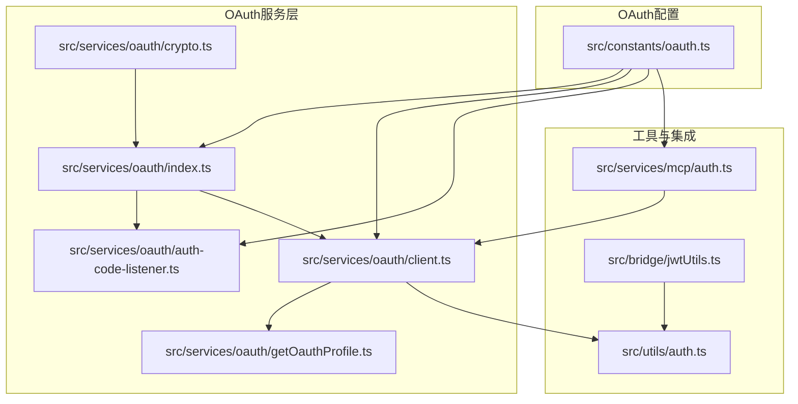
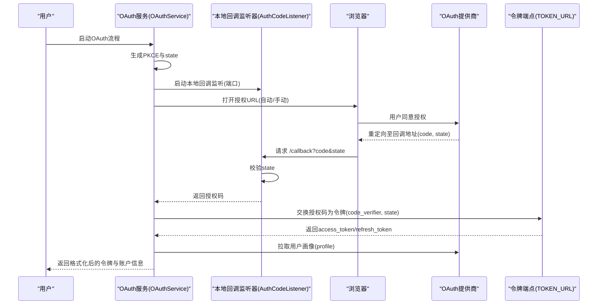
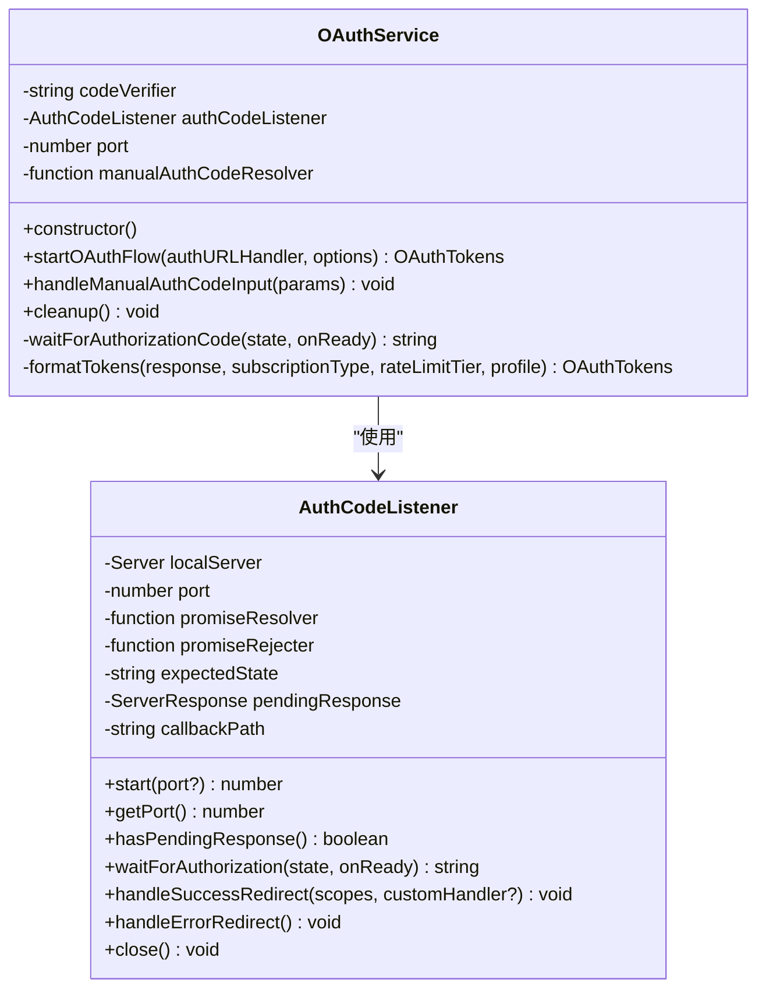
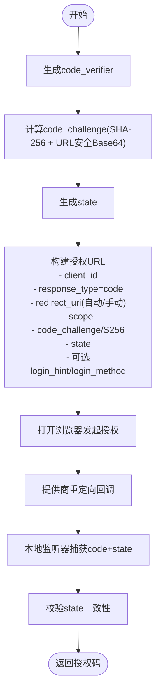
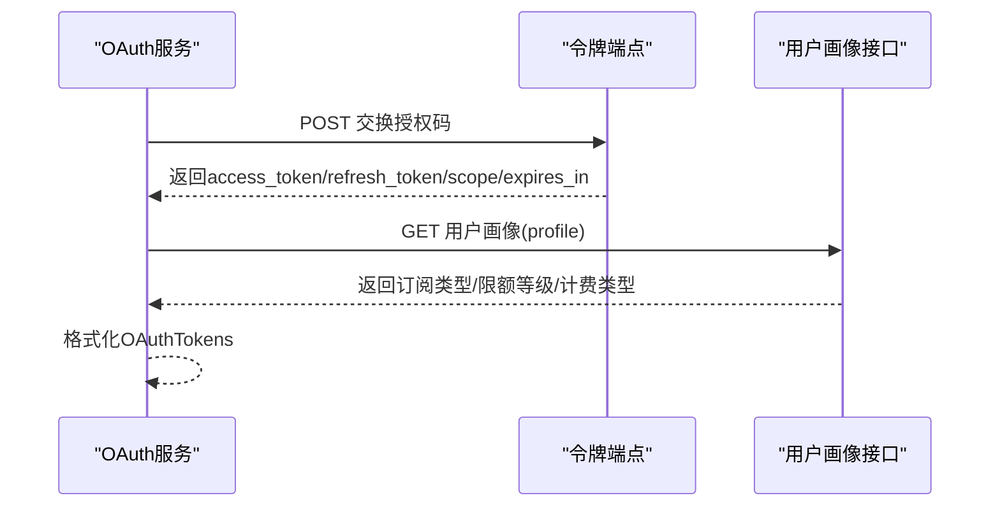
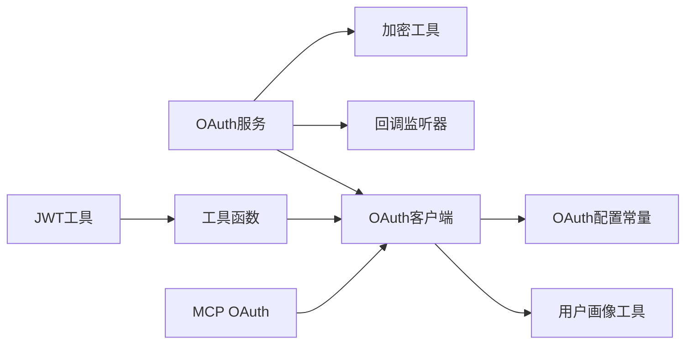

# OAuth认证流程

<cite>
**本文引用的文件**
- [src/constants/oauth.ts](file://src/constants/oauth.ts)
- [src/services/oauth/index.ts](file://src/services/oauth/index.ts)
- [src/services/oauth/client.ts](file://src/services/oauth/client.ts)
- [src/services/oauth/crypto.ts](file://src/services/oauth/crypto.ts)
- [src/services/oauth/auth-code-listener.ts](file://src/services/oauth/auth-code-listener.ts)
- [src/services/oauth/getOauthProfile.ts](file://src/services/oauth/getOauthProfile.ts)
- [src/utils/auth.ts](file://src/utils/auth.ts)
- [src/services/mcp/auth.ts](file://src/services/mcp/auth.ts)
- [src/bridge/jwtUtils.ts](file://src/bridge/jwtUtils.ts)
</cite>

## 目录
1. [简介](#简介)
2. [项目结构](#项目结构)
3. [核心组件](#核心组件)
4. [架构总览](#架构总览)
5. [详细组件分析](#详细组件分析)
6. [依赖关系分析](#依赖关系分析)
7. [性能考量](#性能考量)
8. [故障排除指南](#故障排除指南)
9. [结论](#结论)
10. [附录](#附录)

## 简介
本文件系统性阐述该代码库中OAuth 2.0授权码流程（含PKCE）的完整实现，覆盖授权服务器元数据发现、客户端注册、授权请求构建、令牌交换、令牌刷新策略、错误处理与故障排除，并给出配置示例与最佳实践。读者无需深入源码即可理解各模块职责与交互。

## 项目结构
OAuth相关能力主要分布在以下模块：
- 配置常量：集中管理授权端点、令牌端点、客户端ID、作用域集合与环境切换逻辑
- OAuth服务层：封装授权码+PKCE流程、自动/手动两种授权路径、令牌格式化与清理
- 客户端工具：构建授权URL、交换授权码为令牌、刷新令牌、获取用户角色与API Key、解析作用域、拉取用户画像
- 加密工具：生成PKCE的verifier/challenge与state参数
- 回调监听器：本地HTTP服务器捕获浏览器回调，校验state并返回授权码
- 用户画像：通过访问令牌或API Key获取账户与组织信息
- 工具函数：统一的令牌刷新与过期判断、MCP场景下的OAuth错误归一化与失败原因归类
- JWT工具：会话级令牌刷新调度与缓冲策略

**图表来源**
- [src/constants/oauth.ts:186-235](file://src/constants/oauth.ts#L186-L235)
- [src/services/oauth/index.ts:21-132](file://src/services/oauth/index.ts#L21-L132)
- [src/services/oauth/client.ts:1-567](file://src/services/oauth/client.ts#L1-L567)
- [src/services/oauth/crypto.ts:1-24](file://src/services/oauth/crypto.ts#L1-L24)
- [src/services/oauth/auth-code-listener.ts:1-212](file://src/services/oauth/auth-code-listener.ts#L1-L212)
- [src/services/oauth/getOauthProfile.ts:1-54](file://src/services/oauth/getOauthProfile.ts#L1-L54)
- [src/utils/auth.ts:23-26](file://src/utils/auth.ts#L23-L26)
- [src/services/mcp/auth.ts:157-190](file://src/services/mcp/auth.ts#L157-L190)
- [src/bridge/jwtUtils.ts:34-256](file://src/bridge/jwtUtils.ts#L34-L256)

**章节来源**
- [src/constants/oauth.ts:186-235](file://src/constants/oauth.ts#L186-L235)
- [src/services/oauth/index.ts:1-199](file://src/services/oauth/index.ts#L1-L199)
- [src/services/oauth/client.ts:1-567](file://src/services/oauth/client.ts#L1-L567)
- [src/services/oauth/crypto.ts:1-24](file://src/services/oauth/crypto.ts#L1-L24)
- [src/services/oauth/auth-code-listener.ts:1-212](file://src/services/oauth/auth-code-listener.ts#L1-L212)
- [src/services/oauth/getOauthProfile.ts:1-54](file://src/services/oauth/getOauthProfile.ts#L1-L54)
- [src/utils/auth.ts:23-26](file://src/utils/auth.ts#L23-L26)
- [src/services/mcp/auth.ts:157-190](file://src/services/mcp/auth.ts#L157-L190)
- [src/bridge/jwtUtils.ts:34-256](file://src/bridge/jwtUtils.ts#L34-L256)

## 核心组件
- OAuth配置常量：按环境选择授权/令牌端点、客户端ID、成功跳转页、作用域集合与MCP代理配置；支持自定义OAuth基础URL与客户端ID覆盖
- OAuth服务：负责启动本地回调监听、生成PKCE与state、构建授权URL、等待授权码、交换令牌、拉取用户画像、格式化返回值与清理资源
- OAuth客户端：构建授权URL、交换授权码、刷新令牌、获取用户角色与API Key、解析作用域、拉取用户画像、过期判断与账户信息缓存
- 加密工具：PKCE verifier/challenge与state生成
- 回调监听器：本地HTTP服务器，捕获回调并校验state，支持自动/手动两种授权路径
- 用户画像工具：通过访问令牌或API Key获取账户与组织信息
- 工具函数：统一的令牌刷新与过期判断、MCP场景下的OAuth错误归一化与失败原因归类
- JWT工具：会话级令牌刷新调度与缓冲策略

**章节来源**
- [src/constants/oauth.ts:186-235](file://src/constants/oauth.ts#L186-L235)
- [src/services/oauth/index.ts:21-132](file://src/services/oauth/index.ts#L21-L132)
- [src/services/oauth/client.ts:42-420](file://src/services/oauth/client.ts#L42-L420)
- [src/services/oauth/crypto.ts:11-23](file://src/services/oauth/crypto.ts#L11-L23)
- [src/services/oauth/auth-code-listener.ts:18-123](file://src/services/oauth/auth-code-listener.ts#L18-L123)
- [src/services/oauth/getOauthProfile.ts:37-53](file://src/services/oauth/getOauthProfile.ts#L37-L53)
- [src/utils/auth.ts:23-26](file://src/utils/auth.ts#L23-L26)
- [src/bridge/jwtUtils.ts:34-256](file://src/bridge/jwtUtils.ts#L34-L256)

## 架构总览
下图展示从用户登录到令牌获取与后续刷新的整体流程，涵盖授权服务器元数据发现、客户端注册、授权请求构建、回调捕获、令牌交换与刷新策略。

**图表来源**
- [src/services/oauth/index.ts:32-132](file://src/services/oauth/index.ts#L32-L132)
- [src/services/oauth/auth-code-listener.ts:62-175](file://src/services/oauth/auth-code-listener.ts#L62-L175)
- [src/services/oauth/client.ts:107-144](file://src/services/oauth/client.ts#L107-L144)
- [src/constants/oauth.ts:186-235](file://src/constants/oauth.ts#L186-L235)

## 详细组件分析

### OAuth配置常量与环境切换
- 支持prod/staging/local三种配置类型，以及自定义OAuth基础URL与客户端ID覆盖
- 统一导出授权端点、令牌端点、客户端ID、作用域集合、成功跳转页与MCP代理配置
- 允许通过环境变量覆盖所有OAuth端点，仅允许白名单域名，防止凭据泄露

**章节来源**
- [src/constants/oauth.ts:6-31](file://src/constants/oauth.ts#L6-L31)
- [src/constants/oauth.ts:186-235](file://src/constants/oauth.ts#L186-L235)

### OAuth服务：授权码+PKCE流程
- 负责启动本地回调监听、生成PKCE与state、构建授权URL、等待授权码、交换令牌、拉取用户画像、格式化返回值与清理资源
- 自动/手动两种授权路径：自动路径在本地启动HTTP服务器捕获回调；手动路径提示用户复制授权码
- 成功后根据授予的作用域选择合适的成功跳转页；异常时发送错误跳转以完成浏览器流程

**图表来源**
- [src/services/oauth/index.ts:21-132](file://src/services/oauth/index.ts#L21-L132)
- [src/services/oauth/auth-code-listener.ts:18-123](file://src/services/oauth/auth-code-listener.ts#L18-L123)

**章节来源**
- [src/services/oauth/index.ts:21-132](file://src/services/oauth/index.ts#L21-L132)
- [src/services/oauth/auth-code-listener.ts:18-123](file://src/services/oauth/auth-code-listener.ts#L18-L123)

### 授权请求构建与PKCE实现
- 构建授权URL时注入：client_id、response_type=code、redirect_uri（自动为localhost回调，手动为固定回调）、scope（可选仅推理作用域）、code_challenge、code_challenge_method=S256、state
- PKCE参数由加密工具生成：verifier长度≥43字符，challenge为verifier的SHA-256哈希并进行URL安全Base64编码
- 支持login_hint与login_method参数预填登录方式

**图表来源**
- [src/services/oauth/crypto.ts:11-23](file://src/services/oauth/crypto.ts#L11-L23)
- [src/services/oauth/client.ts:46-105](file://src/services/oauth/client.ts#L46-L105)
- [src/services/oauth/auth-code-listener.ts:134-175](file://src/services/oauth/auth-code-listener.ts#L134-L175)

**章节来源**
- [src/services/oauth/crypto.ts:11-23](file://src/services/oauth/crypto.ts#L11-L23)
- [src/services/oauth/client.ts:46-105](file://src/services/oauth/client.ts#L46-L105)
- [src/services/oauth/auth-code-listener.ts:134-175](file://src/services/oauth/auth-code-listener.ts#L134-L175)

### 令牌交换与用户画像
- 交换授权码为令牌：向TOKEN_URL提交grant_type=authorization_code、code、redirect_uri、client_id、code_verifier、state
- 刷新令牌：向TOKEN_URL提交grant_type=refresh_token、refresh_token、client_id与scope（默认使用CLAUDE_AI_OAUTH_SCOPES）
- 获取用户画像：通过访问令牌调用/oauth/profile接口，解析订阅类型、限额等级、计费类型等
- 过期判断：基于expires_in与缓冲时间（5分钟）判断是否需要刷新

**图表来源**
- [src/services/oauth/client.ts:107-144](file://src/services/oauth/client.ts#L107-L144)
- [src/services/oauth/client.ts:146-274](file://src/services/oauth/client.ts#L146-L274)
- [src/services/oauth/client.ts:355-420](file://src/services/oauth/client.ts#L355-L420)

**章节来源**
- [src/services/oauth/client.ts:107-144](file://src/services/oauth/client.ts#L107-L144)
- [src/services/oauth/client.ts:146-274](file://src/services/oauth/client.ts#L146-L274)
- [src/services/oauth/client.ts:355-420](file://src/services/oauth/client.ts#L355-L420)

### 重定向URI与端口分配机制
- 自动授权路径：redirect_uri为http://localhost:{动态端口}/callback，本地HTTP服务器监听该端口并捕获回调
- 手动授权路径：redirect_uri为固定的手动回调URL，用户复制授权码后由OAuth服务接收
- 端口冲突处理：当端口被占用时，错误消息包含平台命令用于定位占用进程，便于快速排查

**章节来源**
- [src/services/oauth/client.ts:73-80](file://src/services/oauth/client.ts#L73-L80)
- [src/services/oauth/auth-code-listener.ts:37-52](file://src/services/oauth/auth-code-listener.ts#L37-L52)
- [src/services/oauth/auth-code-listener.ts:134-175](file://src/services/oauth/auth-code-listener.ts#L134-L175)
- [src/services/mcp/auth.ts:1153-1169](file://src/services/mcp/auth.ts#L1153-L1169)

### 令牌刷新策略
- 基于expires_in与缓冲时间（5分钟）触发刷新
- 刷新时可指定scope，默认扩展为CLAUDE_AI_OAUTH_SCOPES，允许scope扩展
- 刷新成功后更新存储的订阅类型、限额等级等信息，避免重复网络请求
- 会话级刷新：通过定时器在到期前刷新，确保长连接稳定性

**章节来源**
- [src/services/oauth/client.ts:344-353](file://src/services/oauth/client.ts#L344-L353)
- [src/services/oauth/client.ts:146-274](file://src/services/oauth/client.ts#L146-L274)
- [src/bridge/jwtUtils.ts:51-256](file://src/bridge/jwtUtils.ts#L51-L256)

### 错误处理与OAuth错误码映射
- 归一化非标准错误：对OAuth错误响应进行标准化，将某些非标准错误码映射为标准invalid_grant
- 失败原因归类：根据错误消息特征映射到已知失败原因（超时、state不匹配、提供商拒绝、端口不可用、SDK认证失败等）
- MCP场景：对invalid_client错误尝试清除存储中的客户端凭据并建议重试
- 浏览器回调错误：校验state防止CSRF攻击，错误时返回HTML页面并抛出对应错误

**章节来源**
- [src/services/mcp/auth.ts:157-190](file://src/services/mcp/auth.ts#L157-L190)
- [src/services/mcp/auth.ts:1262-1291](file://src/services/mcp/auth.ts#L1262-L1291)
- [src/services/mcp/auth.ts:1109-1118](file://src/services/mcp/auth.ts#L1109-L1118)
- [src/services/oauth/auth-code-listener.ts:164-169](file://src/services/oauth/auth-code-listener.ts#L164-L169)

## 依赖关系分析
- OAuth服务依赖加密工具生成PKCE参数，依赖回调监听器捕获授权码
- OAuth客户端依赖配置常量获取端点与客户端ID，依赖用户画像工具获取账户信息
- 工具函数与JWT工具为令牌刷新与过期判断提供支撑
- MCP场景下的OAuth错误归一化与失败原因归类由专用模块处理

**图表来源**
- [src/services/oauth/index.ts:21-132](file://src/services/oauth/index.ts#L21-L132)
- [src/services/oauth/crypto.ts:11-23](file://src/services/oauth/crypto.ts#L11-L23)
- [src/services/oauth/auth-code-listener.ts:18-123](file://src/services/oauth/auth-code-listener.ts#L18-L123)
- [src/services/oauth/client.ts:1-567](file://src/services/oauth/client.ts#L1-L567)
- [src/constants/oauth.ts:186-235](file://src/constants/oauth.ts#L186-L235)
- [src/services/oauth/getOauthProfile.ts:1-54](file://src/services/oauth/getOauthProfile.ts#L1-L54)
- [src/utils/auth.ts:23-26](file://src/utils/auth.ts#L23-L26)
- [src/bridge/jwtUtils.ts:34-256](file://src/bridge/jwtUtils.ts#L34-L256)
- [src/services/mcp/auth.ts:157-190](file://src/services/mcp/auth.ts#L157-L190)

**章节来源**
- [src/services/oauth/index.ts:21-132](file://src/services/oauth/index.ts#L21-L132)
- [src/services/oauth/client.ts:1-567](file://src/services/oauth/client.ts#L1-L567)
- [src/services/oauth/crypto.ts:11-23](file://src/services/oauth/crypto.ts#L11-L23)
- [src/services/oauth/auth-code-listener.ts:18-123](file://src/services/oauth/auth-code-listener.ts#L18-L123)
- [src/services/oauth/getOauthProfile.ts:1-54](file://src/services/oauth/getOauthProfile.ts#L1-L54)
- [src/utils/auth.ts:23-26](file://src/utils/auth.ts#L23-L26)
- [src/bridge/jwtUtils.ts:34-256](file://src/bridge/jwtUtils.ts#L34-L256)
- [src/services/mcp/auth.ts:157-190](file://src/services/mcp/auth.ts#L157-L190)

## 性能考量
- 减少额外网络往返：在刷新令牌时若已有全局配置与安全存储中的账户信息，则跳过/profile轮询
- 会话级刷新：通过定时器在到期前刷新，避免长时间无活动导致的过期
- 缓冲时间：统一的5分钟缓冲时间降低边界情况下的刷新失败概率

**章节来源**
- [src/services/oauth/client.ts:190-239](file://src/services/oauth/client.ts#L190-L239)
- [src/bridge/jwtUtils.ts:51-256](file://src/bridge/jwtUtils.ts#L51-L256)

## 故障排除指南
- 端口占用：当本地回调端口被占用时，错误消息包含平台命令用于定位占用进程，建议先结束占用进程再重试
- state不匹配：浏览器回调时若state不一致，将拒绝并提示可能的CSRF攻击
- 提供商拒绝：当提供商返回OAuth错误时，错误会被归类并记录，必要时可重新发起授权
- SDK认证失败：针对invalid_client错误，系统会尝试清除存储中的客户端凭据并建议重试
- 刷新失败：invalid_grant表示刷新令牌失效或已被撤销，系统会清除存储并引导重新登录

**章节来源**
- [src/services/oauth/auth-code-listener.ts:164-169](file://src/services/oauth/auth-code-listener.ts#L164-L169)
- [src/services/mcp/auth.ts:1153-1169](file://src/services/mcp/auth.ts#L1153-L1169)
- [src/services/mcp/auth.ts:1262-1291](file://src/services/mcp/auth.ts#L1262-L1291)
- [src/services/mcp/auth.ts:1293-1319](file://src/services/mcp/auth.ts#L1293-L1319)

## 结论
该实现完整覆盖了OAuth 2.0授权码流程与PKCE增强安全机制，提供了自动/手动两种授权路径、完善的错误处理与失败原因归类、灵活的配置与环境切换、以及稳健的令牌刷新策略。通过本地回调监听器与标准化的错误归一化，系统在用户体验与安全性之间取得了良好平衡。

## 附录

### OAuth配置示例与最佳实践
- 环境切换
  - 生产：默认使用生产端点与客户端ID
  - 预发布：通过环境变量启用staging配置
  - 本地开发：通过环境变量启用local配置，或自定义OAuth基础URL与客户端ID
- 作用域
  - 默认请求全部作用域以兼容Console与Claude.ai跳转
  - 可选仅推理作用域以换取长期有效的推理令牌
- 重定向URI
  - 自动路径：http://localhost:{动态端口}/callback
  - 手动路径：固定的手动回调URL
- 最佳实践
  - 在受信环境中使用自定义OAuth基础URL，并确保仅使用白名单域名
  - 使用PKCE与state参数提升安全性
  - 合理设置expires_in以平衡安全与体验
  - 对刷新失败进行幂等处理，避免重复刷新造成负担

**章节来源**
- [src/constants/oauth.ts:6-31](file://src/constants/oauth.ts#L6-L31)
- [src/constants/oauth.ts:186-235](file://src/constants/oauth.ts#L186-L235)
- [src/services/oauth/client.ts:73-80](file://src/services/oauth/client.ts#L73-L80)
- [src/services/oauth/client.ts:81-102](file://src/services/oauth/client.ts#L81-L102)