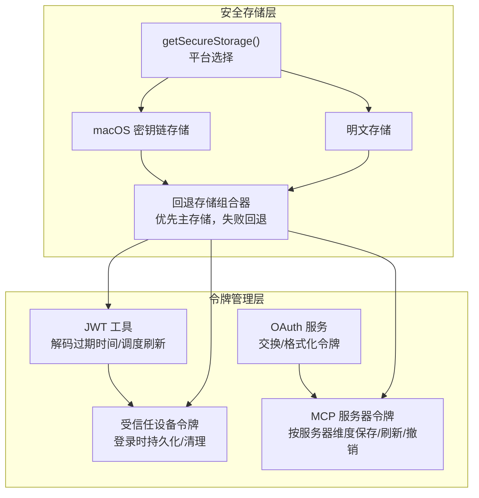
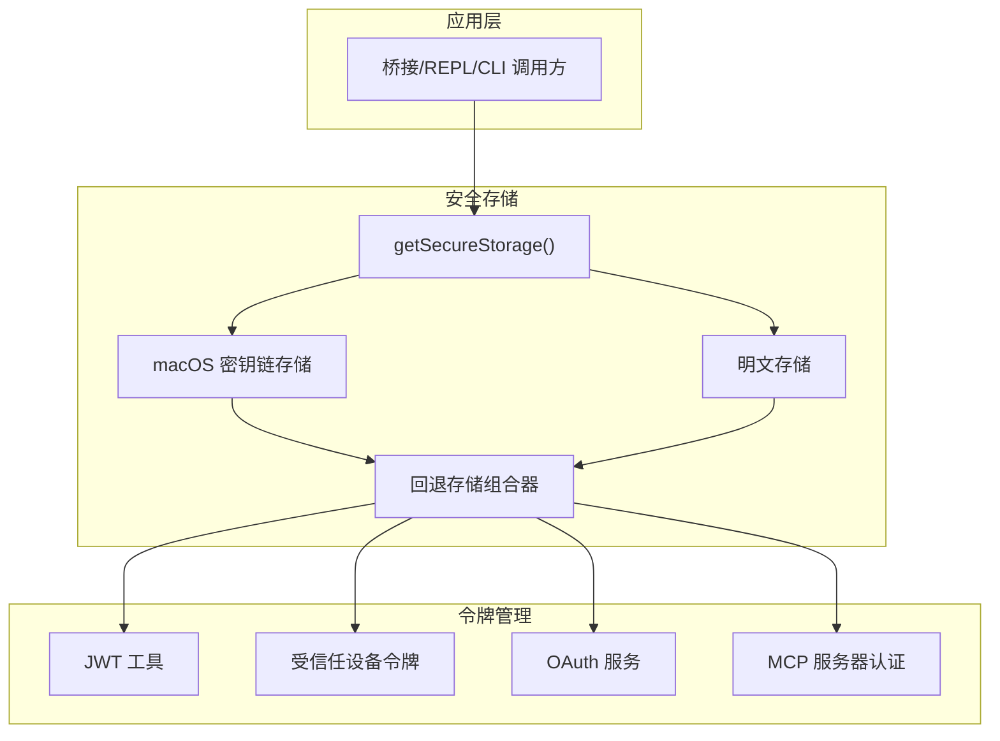
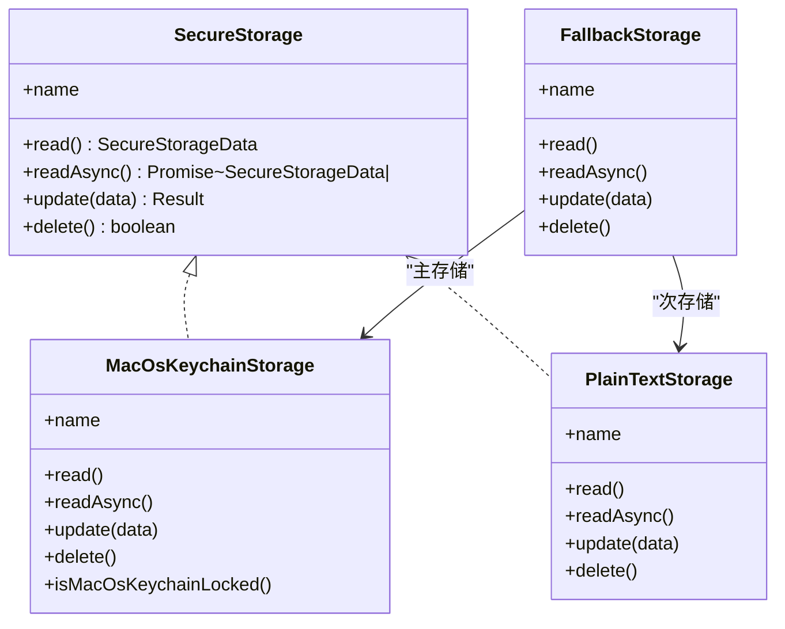
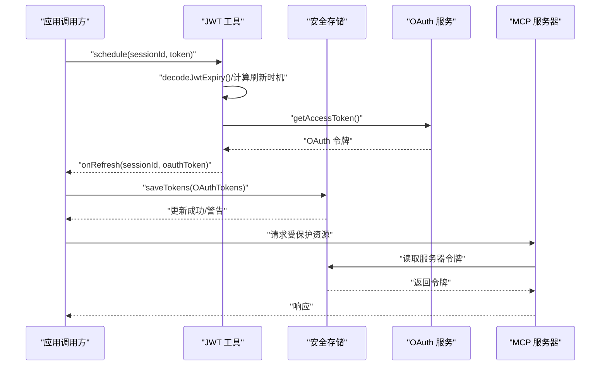
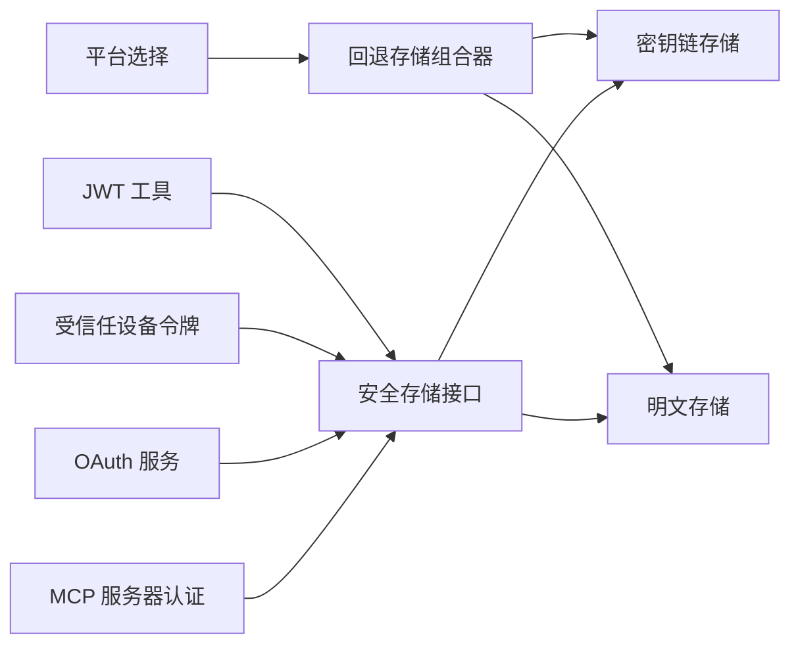
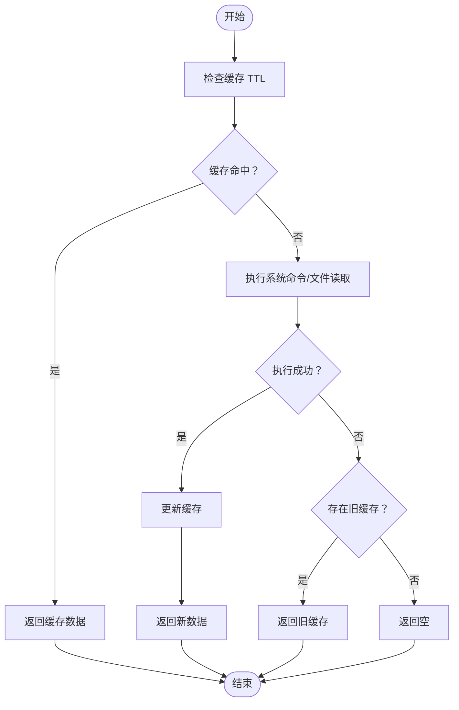

# 安全存储与令牌管理

<cite>
**本文引用的文件**
- [src/utils/secureStorage/index.ts](file://src/utils/secureStorage/index.ts)
- [src/utils/secureStorage/fallbackStorage.ts](file://src/utils/secureStorage/fallbackStorage.ts)
- [src/utils/secureStorage/macOsKeychainStorage.ts](file://src/utils/secureStorage/macOsKeychainStorage.ts)
- [src/utils/secureStorage/macOsKeychainHelpers.ts](file://src/utils/secureStorage/macOsKeychainHelpers.ts)
- [src/utils/secureStorage/plainTextStorage.ts](file://src/utils/secureStorage/plainTextStorage.ts)
- [src/bridge/jwtUtils.ts](file://src/bridge/jwtUtils.ts)
- [src/bridge/trustedDevice.ts](file://src/bridge/trustedDevice.ts)
- [src/services/oauth/index.ts](file://src/services/oauth/index.ts)
- [src/services/mcp/auth.ts](file://src/services/mcp/auth.ts)
</cite>

## 目录
1. [简介](#简介)
2. [项目结构](#项目结构)
3. [核心组件](#核心组件)
4. [架构总览](#架构总览)
5. [详细组件分析](#详细组件分析)
6. [依赖关系分析](#依赖关系分析)
7. [性能考量](#性能考量)
8. [故障排查指南](#故障排查指南)
9. [结论](#结论)
10. [附录](#附录)

## 简介
本文件系统性阐述安全存储与令牌管理子系统的架构设计与实现细节，覆盖以下主题：
- 安全存储架构：密钥链集成（macOS）、加密存储与明文回退机制
- 平台差异与适配策略：Darwin 使用密钥链 + 明文回退；其他平台使用明文存储
- 令牌生命周期管理：获取、存储、刷新、撤销与失效处理
- 数据结构与访问控制：安全存储数据模型、缓存与并发控制
- 配置选项、迁移策略与备份恢复建议
- 诊断方法与性能优化实践

## 项目结构
围绕“安全存储与令牌管理”的关键模块分布如下：
- 安全存储抽象与平台选择：统一入口负责根据运行平台返回合适的存储实现
- 存储实现：
  - macOS 密钥链存储：通过系统命令调用进行读写，带缓存与并发去重
  - 明文存储：在非 macOS 平台或密钥链不可用时作为回退
  - 回退存储组合器：优先主存储，失败则回退到次存储，并做迁移与一致性处理
- 令牌管理：
  - JWT 工具：解析过期时间、调度刷新、失败重试与取消
  - 受信任设备令牌：登录流程中持久化与清理
  - OAuth 令牌：交换、格式化、保存与撤销
  - MCP 服务器令牌：按服务器维度保存与刷新

**图表来源**
- [src/utils/secureStorage/index.ts:1-18](file://src/utils/secureStorage/index.ts#L1-L18)
- [src/utils/secureStorage/fallbackStorage.ts:1-71](file://src/utils/secureStorage/fallbackStorage.ts#L1-L71)
- [src/utils/secureStorage/macOsKeychainStorage.ts:1-232](file://src/utils/secureStorage/macOsKeychainStorage.ts#L1-L232)
- [src/utils/secureStorage/plainTextStorage.ts:1-85](file://src/utils/secureStorage/plainTextStorage.ts#L1-L85)
- [src/bridge/jwtUtils.ts:1-257](file://src/bridge/jwtUtils.ts#L1-L257)
- [src/bridge/trustedDevice.ts:1-211](file://src/bridge/trustedDevice.ts#L1-L211)
- [src/services/oauth/index.ts:169-198](file://src/services/oauth/index.ts#L169-L198)
- [src/services/mcp/auth.ts:320-2325](file://src/services/mcp/auth.ts#L320-L2325)

**章节来源**
- [src/utils/secureStorage/index.ts:1-18](file://src/utils/secureStorage/index.ts#L1-L18)
- [src/utils/secureStorage/fallbackStorage.ts:1-71](file://src/utils/secureStorage/fallbackStorage.ts#L1-L71)
- [src/utils/secureStorage/macOsKeychainStorage.ts:1-232](file://src/utils/secureStorage/macOsKeychainStorage.ts#L1-L232)
- [src/utils/secureStorage/plainTextStorage.ts:1-85](file://src/utils/secureStorage/plainTextStorage.ts#L1-L85)
- [src/bridge/jwtUtils.ts:1-257](file://src/bridge/jwtUtils.ts#L1-L257)
- [src/bridge/trustedDevice.ts:1-211](file://src/bridge/trustedDevice.ts#L1-L211)
- [src/services/oauth/index.ts:169-198](file://src/services/oauth/index.ts#L169-L198)
- [src/services/mcp/auth.ts:320-2325](file://src/services/mcp/auth.ts#L320-L2325)

## 核心组件
- 安全存储接口与平台选择
  - 统一入口根据运行平台返回对应存储实现；Darwin 平台采用“密钥链 + 明文”回退策略
- 存储实现
  - macOS 密钥链存储：通过系统命令读写 JSON 数据，内置缓存与并发去重，支持锁状态检测
  - 明文存储：将凭据以 JSON 写入用户配置目录，设置严格权限，失败时回退到密钥链
  - 回退存储组合器：优先主存储，若主存储首次成功写入则删除次存储；若主存储写入失败但已有旧值，则尽力删除旧值，避免读到陈旧数据
- 令牌管理
  - JWT 工具：解码过期时间、基于过期时间与缓冲区调度刷新、失败重试与取消
  - 受信任设备令牌：登录后持久化，清理旧令牌避免跨账户污染
  - OAuth 令牌：交换响应格式化为统一结构，包含访问令牌、刷新令牌、过期时间、作用域等
  - MCP 服务器令牌：按服务器键保存，支持发现元数据、客户端信息、刷新与撤销

**章节来源**
- [src/utils/secureStorage/index.ts:1-18](file://src/utils/secureStorage/index.ts#L1-L18)
- [src/utils/secureStorage/fallbackStorage.ts:1-71](file://src/utils/secureStorage/fallbackStorage.ts#L1-L71)
- [src/utils/secureStorage/macOsKeychainStorage.ts:1-232](file://src/utils/secureStorage/macOsKeychainStorage.ts#L1-L232)
- [src/utils/secureStorage/plainTextStorage.ts:1-85](file://src/utils/secureStorage/plainTextStorage.ts#L1-L85)
- [src/bridge/jwtUtils.ts:1-257](file://src/bridge/jwtUtils.ts#L1-L257)
- [src/bridge/trustedDevice.ts:1-211](file://src/bridge/trustedDevice.ts#L1-L211)
- [src/services/oauth/index.ts:169-198](file://src/services/oauth/index.ts#L169-L198)
- [src/services/mcp/auth.ts:320-2325](file://src/services/mcp/auth.ts#L320-L2325)

## 架构总览
下图展示安全存储与令牌管理的整体交互关系：

**图表来源**
- [src/utils/secureStorage/index.ts:1-18](file://src/utils/secureStorage/index.ts#L1-L18)
- [src/utils/secureStorage/fallbackStorage.ts:1-71](file://src/utils/secureStorage/fallbackStorage.ts#L1-L71)
- [src/utils/secureStorage/macOsKeychainStorage.ts:1-232](file://src/utils/secureStorage/macOsKeychainStorage.ts#L1-L232)
- [src/utils/secureStorage/plainTextStorage.ts:1-85](file://src/utils/secureStorage/plainTextStorage.ts#L1-L85)
- [src/bridge/jwtUtils.ts:1-257](file://src/bridge/jwtUtils.ts#L1-L257)
- [src/bridge/trustedDevice.ts:1-211](file://src/bridge/trustedDevice.ts#L1-L211)
- [src/services/oauth/index.ts:169-198](file://src/services/oauth/index.ts#L169-L198)
- [src/services/mcp/auth.ts:320-2325](file://src/services/mcp/auth.ts#L320-L2325)

## 详细组件分析

### 安全存储架构与平台适配
- 平台选择逻辑
  - Darwin 平台：返回“密钥链 + 明文”回退存储
  - 其他平台：直接返回明文存储
- 密钥链存储特性
  - 缓存：30 秒 TTL，避免频繁 spawn 同步调用；并发读取去重
  - 锁定检测：缓存 macOS 密钥链锁定状态，减少重复命令开销
  - 命令行参数保护：优先使用标准输入传递敏感载荷，必要时使用命令行参数，避免被进程监控工具捕获明文
  - 过期回退：读取失败时返回“过期而用”缓存，避免瞬时失败导致“未登录”
- 明文存储特性
  - 将凭据写入用户配置目录下的 JSON 文件，设置严格权限
  - 失败时返回警告提示，保证可诊断性
- 回退存储组合器
  - 读：主存储为空时回退到次存储
  - 写：主存储成功写入且此前为空，则删除次存储；若主存储写入失败但已有旧值，则尽力删除旧值，避免陈旧数据被读取
  - 删：任一存储删除成功即视为成功

**图表来源**
- [src/utils/secureStorage/macOsKeychainStorage.ts:1-232](file://src/utils/secureStorage/macOsKeychainStorage.ts#L1-L232)
- [src/utils/secureStorage/plainTextStorage.ts:1-85](file://src/utils/secureStorage/plainTextStorage.ts#L1-L85)
- [src/utils/secureStorage/fallbackStorage.ts:1-71](file://src/utils/secureStorage/fallbackStorage.ts#L1-L71)

**章节来源**
- [src/utils/secureStorage/index.ts:1-18](file://src/utils/secureStorage/index.ts#L1-L18)
- [src/utils/secureStorage/fallbackStorage.ts:1-71](file://src/utils/secureStorage/fallbackStorage.ts#L1-L71)
- [src/utils/secureStorage/macOsKeychainStorage.ts:1-232](file://src/utils/secureStorage/macOsKeychainStorage.ts#L1-L232)
- [src/utils/secureStorage/macOsKeychainHelpers.ts:1-112](file://src/utils/secureStorage/macOsKeychainHelpers.ts#L1-L112)
- [src/utils/secureStorage/plainTextStorage.ts:1-85](file://src/utils/secureStorage/plainTextStorage.ts#L1-L85)

### 令牌生命周期管理（JWT、OAuth、MCP）
- JWT 解析与刷新调度
  - 解码过期时间，计算剩余时间并在缓冲窗口内触发刷新
  - 支持显式 TTL 调度（适用于不透明 JWT）
  - 失败重试与最大失败次数限制，避免无限循环
  - 会话级生成器防止过期定时器被后续调度覆盖
- 受信任设备令牌
  - 登录后持久化，避免跨账户旧令牌污染
  - 提供缓存清理与环境变量覆盖能力
- OAuth 令牌
  - 交换响应格式化为统一结构，包含访问令牌、刷新令牌、过期时间、作用域、账户信息等
- MCP 服务器令牌
  - 按服务器键保存，支持发现元数据、客户端信息、刷新与撤销
  - 撤销顺序：先撤销刷新令牌，再撤销访问令牌；对非 RFC 服务器提供 Bearer 认证重试

**图表来源**
- [src/bridge/jwtUtils.ts:72-256](file://src/bridge/jwtUtils.ts#L72-L256)
- [src/services/oauth/index.ts:169-198](file://src/services/oauth/index.ts#L169-L198)
- [src/services/mcp/auth.ts:1669-1702](file://src/services/mcp/auth.ts#L1669-L1702)

**章节来源**
- [src/bridge/jwtUtils.ts:1-257](file://src/bridge/jwtUtils.ts#L1-L257)
- [src/bridge/trustedDevice.ts:1-211](file://src/bridge/trustedDevice.ts#L1-L211)
- [src/services/oauth/index.ts:169-198](file://src/services/oauth/index.ts#L169-L198)
- [src/services/mcp/auth.ts:320-2325](file://src/services/mcp/auth.ts#L320-L2325)

### 数据结构与访问控制
- 安全存储数据结构
  - 通用字段：受信任设备令牌、MCP OAuth 令牌集合等
  - 结构化存储：JSON 序列化，便于跨进程共享与迁移
- 访问控制与安全
  - macOS：密钥链存储，系统级安全；命令行参数保护，避免明文泄露
  - 非 macOS：明文存储，设置严格文件权限；失败时回退到密钥链
  - 缓存与并发：读取缓存与并发去重，避免重复 spawn；写入前清空缓存，确保读取一致性
  - 环境变量覆盖：受信任设备令牌支持通过环境变量强制覆盖，便于测试与企业定制

**章节来源**
- [src/utils/secureStorage/macOsKeychainStorage.ts:1-232](file://src/utils/secureStorage/macOsKeychainStorage.ts#L1-L232)
- [src/utils/secureStorage/plainTextStorage.ts:1-85](file://src/utils/secureStorage/plainTextStorage.ts#L1-L85)
- [src/bridge/trustedDevice.ts:1-211](file://src/bridge/trustedDevice.ts#L1-L211)

### 存储配置选项、迁移策略与备份恢复
- 配置选项
  - macOS 服务名后缀：区分凭据条目，避免与旧版 API Key 条目冲突
  - 配置目录哈希：当配置目录非默认时，使用哈希作为服务名后缀，保持稳定性
  - 用户名回退：无法获取系统用户名时使用默认值，保证可用性
- 迁移策略
  - 首次主存储写入成功：删除次存储，避免重复凭据
  - 主存储写入失败但已有旧值：尽力删除旧值，避免陈旧令牌被读取
- 备份与恢复
  - macOS：可通过系统钥匙串备份与恢复
  - 非 macOS：凭据位于用户配置目录 JSON 文件，可手动备份该文件；恢复时需确保文件权限正确

**章节来源**
- [src/utils/secureStorage/macOsKeychainHelpers.ts:1-112](file://src/utils/secureStorage/macOsKeychainHelpers.ts#L1-L112)
- [src/utils/secureStorage/fallbackStorage.ts:1-71](file://src/utils/secureStorage/fallbackStorage.ts#L1-L71)
- [src/utils/secureStorage/plainTextStorage.ts:1-85](file://src/utils/secureStorage/plainTextStorage.ts#L1-L85)

## 依赖关系分析
- 组件耦合
  - 安全存储接口与平台选择模块低耦合，便于扩展新平台实现
  - 回退存储组合器对主/次存储无感知，仅依赖接口契约
  - 令牌管理模块通过安全存储接口读写，不关心具体实现
- 外部依赖
  - macOS 密钥链存储依赖系统命令行工具与缓存辅助模块
  - OAuth 与 MCP 服务依赖网络请求与服务器元数据发现

**图表来源**
- [src/utils/secureStorage/index.ts:1-18](file://src/utils/secureStorage/index.ts#L1-L18)
- [src/utils/secureStorage/fallbackStorage.ts:1-71](file://src/utils/secureStorage/fallbackStorage.ts#L1-L71)
- [src/utils/secureStorage/macOsKeychainStorage.ts:1-232](file://src/utils/secureStorage/macOsKeychainStorage.ts#L1-L232)
- [src/utils/secureStorage/plainTextStorage.ts:1-85](file://src/utils/secureStorage/plainTextStorage.ts#L1-L85)
- [src/bridge/jwtUtils.ts:1-257](file://src/bridge/jwtUtils.ts#L1-L257)
- [src/bridge/trustedDevice.ts:1-211](file://src/bridge/trustedDevice.ts#L1-L211)
- [src/services/oauth/index.ts:169-198](file://src/services/oauth/index.ts#L169-L198)
- [src/services/mcp/auth.ts:320-2325](file://src/services/mcp/auth.ts#L320-L2325)

**章节来源**
- [src/utils/secureStorage/index.ts:1-18](file://src/utils/secureStorage/index.ts#L1-L18)
- [src/utils/secureStorage/fallbackStorage.ts:1-71](file://src/utils/secureStorage/fallbackStorage.ts#L1-L71)
- [src/utils/secureStorage/macOsKeychainStorage.ts:1-232](file://src/utils/secureStorage/macOsKeychainStorage.ts#L1-L232)
- [src/utils/secureStorage/plainTextStorage.ts:1-85](file://src/utils/secureStorage/plainTextStorage.ts#L1-L85)
- [src/bridge/jwtUtils.ts:1-257](file://src/bridge/jwtUtils.ts#L1-L257)
- [src/bridge/trustedDevice.ts:1-211](file://src/bridge/trustedDevice.ts#L1-L211)
- [src/services/oauth/index.ts:169-198](file://src/services/oauth/index.ts#L169-L198)
- [src/services/mcp/auth.ts:320-2325](file://src/services/mcp/auth.ts#L320-L2325)

## 性能考量
- macOS 密钥链缓存
  - 30 秒 TTL，平衡跨进程一致性与同步调用开销
  - 并发读取去重，避免风暴场景下重复 spawn
  - 锁定状态缓存，减少重复命令调用
- 命令行参数保护
  - 优先使用标准输入传递敏感载荷，避免被进程监控工具捕获明文
  - 当载荷过大时回退到命令行参数，仍优于静默损坏
- 刷新调度
  - 基于过期时间与缓冲区调度，避免频繁刷新
  - 失败重试与最大失败次数限制，防止抖动
- 文件权限与 I/O
  - 明文存储写入后设置严格权限，降低泄露风险
  - 同步 I/O 在安全存储接口约束下使用，避免阻塞主线程

**章节来源**
- [src/utils/secureStorage/macOsKeychainStorage.ts:1-232](file://src/utils/secureStorage/macOsKeychainStorage.ts#L1-L232)
- [src/utils/secureStorage/macOsKeychainHelpers.ts:1-112](file://src/utils/secureStorage/macOsKeychainHelpers.ts#L1-L112)
- [src/bridge/jwtUtils.ts:1-257](file://src/bridge/jwtUtils.ts#L1-L257)
- [src/utils/secureStorage/plainTextStorage.ts:1-85](file://src/utils/secureStorage/plainTextStorage.ts#L1-L85)

## 故障排查指南
- macOS 密钥链不可用
  - 现象：读取失败、返回“过期而用”缓存
  - 排查：检查密钥链是否锁定；查看日志中的警告信息
  - 处理：解锁密钥链或切换到明文存储（回退生效）
- 刷新失败与重试
  - 现象：刷新链中断、定时器未设置
  - 排查：确认 OAuth 令牌可用性、失败计数与重试间隔
  - 处理：等待重试或手动取消并重新调度
- 撤销失败
  - 现象：服务器不支持标准撤销端点或需要 Bearer 认证
  - 排查：检查元数据发现结果与认证方式
  - 处理：启用 Bearer 认证重试或忽略错误继续清理本地令牌
- 跨账户令牌污染
  - 现象：登录新账户后仍携带旧账户令牌
  - 排查：确认登录前是否清理了受信任设备令牌缓存
  - 处理：调用清理函数并清除缓存

**章节来源**
- [src/utils/secureStorage/macOsKeychainStorage.ts:1-232](file://src/utils/secureStorage/macOsKeychainStorage.ts#L1-L232)
- [src/bridge/jwtUtils.ts:1-257](file://src/bridge/jwtUtils.ts#L1-L257)
- [src/bridge/trustedDevice.ts:1-211](file://src/bridge/trustedDevice.ts#L1-L211)
- [src/services/mcp/auth.ts:461-574](file://src/services/mcp/auth.ts#L461-L574)

## 结论
本系统通过“平台选择 + 回退存储 + 明确数据结构 + 严格的访问控制与缓存策略”，实现了在多平台环境下安全、可靠、可诊断的令牌与凭据管理。macOS 上的密钥链存储提供了系统级安全保障，而非 macOS 平台的明文存储作为安全回退，配合严格的文件权限与失败告警，确保在任何环境下都能稳健运行。令牌管理方面，从 JWT 解析、刷新调度到 OAuth 与 MCP 的统一抽象，形成了完整的生命周期闭环。

## 附录
- 关键流程图（算法实现）

**图表来源**
- [src/utils/secureStorage/macOsKeychainStorage.ts:28-66](file://src/utils/secureStorage/macOsKeychainStorage.ts#L28-L66)
- [src/utils/secureStorage/plainTextStorage.ts:21-32](file://src/utils/secureStorage/plainTextStorage.ts#L21-L32)