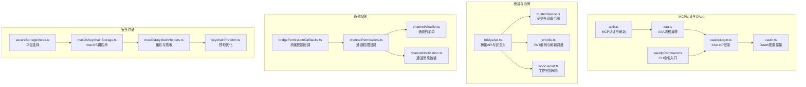
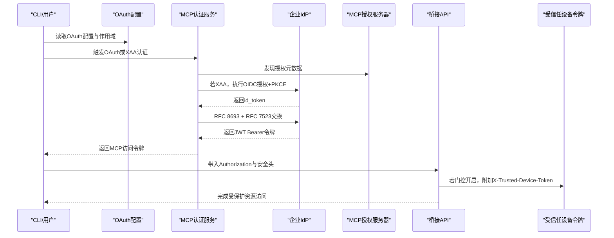
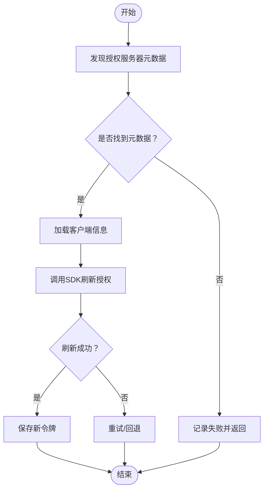
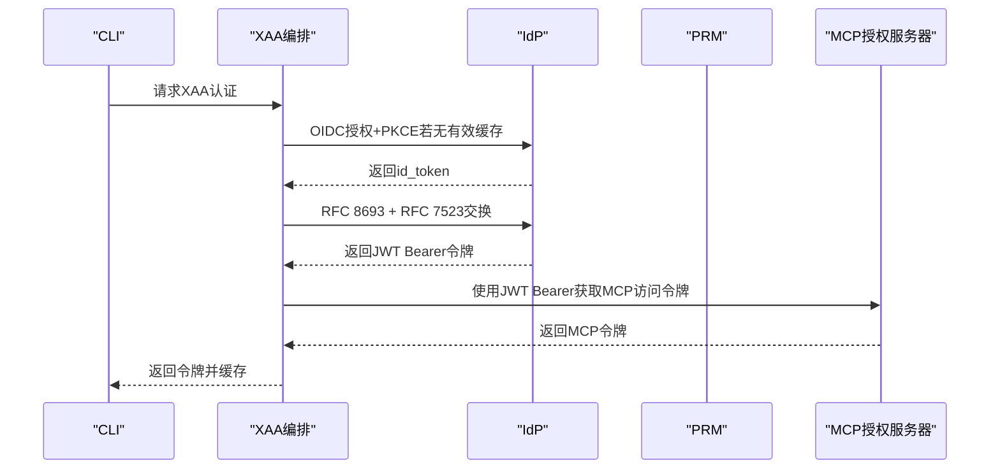
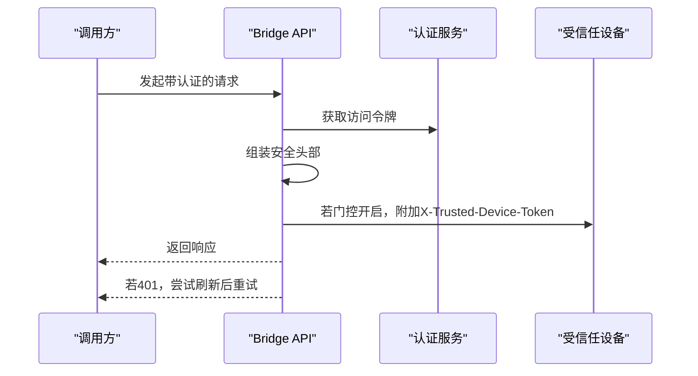
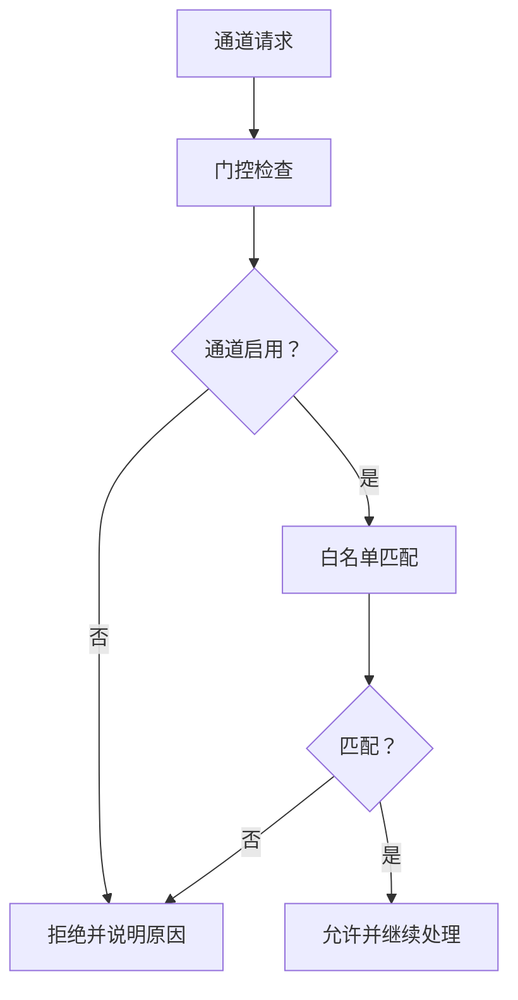
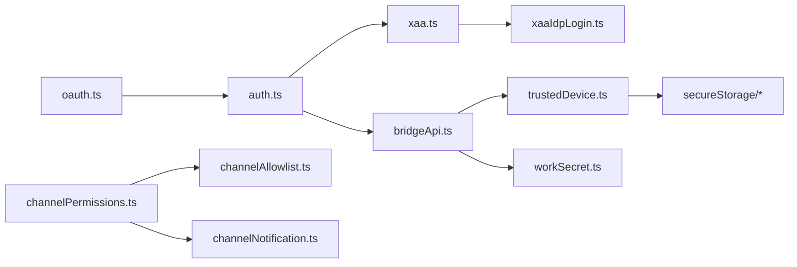

# 认证与安全

<cite>
**本文引用的文件**
- [src/services/mcp/auth.ts](file://src/services/mcp/auth.ts)
- [src/services/mcp/xaa.ts](file://src/services/mcp/xaa.ts)
- [src/services/mcp/xaaIdpLogin.ts](file://src/services/mcp/xaaIdpLogin.ts)
- [src/commands/mcp/xaaIdpCommand.ts](file://src/commands/mcp/xaaIdpCommand.ts)
- [src/constants/oauth.ts](file://src/constants/oauth.ts)
- [src/bridge/jwtUtils.ts](file://src/bridge/jwtUtils.ts)
- [src/bridge/bridgeApi.ts](file://src/bridge/bridgeApi.ts)
- [src/bridge/trustedDevice.ts](file://src/bridge/trustedDevice.ts)
- [src/bridge/workSecret.ts](file://src/bridge/workSecret.ts)
- [src/services/mcp/channelPermissions.ts](file://src/services/mcp/channelPermissions.ts)
- [src/services/mcp/channelAllowlist.ts](file://src/services/mcp/channelAllowlist.ts)
- [src/services/mcp/channelNotification.ts](file://src/services/mcp/channelNotification.ts)
- [src/bridge/bridgePermissionCallbacks.ts](file://src/bridge/bridgePermissionCallbacks.ts)
- [src/utils/secureStorage/index.ts](file://src/utils/secureStorage/index.ts)
- [src/utils/secureStorage/macOsKeychainStorage.ts](file://src/utils/secureStorage/macOsKeychainStorage.ts)
- [src/utils/secureStorage/macOsKeychainHelpers.ts](file://src/utils/secureStorage/macOsKeychainHelpers.ts)
- [src/utils/secureStorage/keychainPrefetch.ts](file://src/utils/secureStorage/keychainPrefetch.ts)
</cite>

## 目录
1. [简介](#简介)
2. [项目结构](#项目结构)
3. [核心组件](#核心组件)
4. [架构总览](#架构总览)
5. [详细组件分析](#详细组件分析)
6. [依赖关系分析](#依赖关系分析)
7. [性能考量](#性能考量)
8. [故障排查指南](#故障排查指南)
9. [结论](#结论)
10. [附录](#附录)

## 简介
本文件系统性梳理并解释本仓库中的MCP认证与安全体系，覆盖以下主题：
- MCP协议的认证机制与安全策略
- OAuth认证流程的实现与配置要点
- XAA（跨应用访问）适配器（Xenova Authentication Adapter）的工作原理与使用方法
- 通道权限控制与访问管理机制
- 安全头信息的处理与验证
- 安全最佳实践与常见问题的解决方案
- 认证配置与调试指南

## 项目结构
围绕认证与安全的关键目录与文件如下：
- MCP认证与OAuth：src/services/mcp/auth.ts、src/services/mcp/xaa.ts、src/services/mcp/xaaIdpLogin.ts、src/commands/mcp/xaaIdpCommand.ts、src/constants/oauth.ts
- 桥接与令牌刷新：src/bridge/jwtUtils.ts、src/bridge/bridgeApi.ts、src/bridge/trustedDevice.ts、src/bridge/workSecret.ts
- 通道权限与访问控制：src/services/mcp/channelPermissions.ts、src/services/mcp/channelAllowlist.ts、src/services/mcp/channelNotification.ts、src/bridge/bridgePermissionCallbacks.ts
- 安全存储与密钥缓存：src/utils/secureStorage/index.ts、src/utils/secureStorage/macOsKeychainStorage.ts、src/utils/secureStorage/macOsKeychainHelpers.ts、src/utils/secureStorage/keychainPrefetch.ts

图表来源
- [src/services/mcp/auth.ts](file://src/services/mcp/auth.ts)
- [src/services/mcp/xaa.ts](file://src/services/mcp/xaa.ts)
- [src/services/mcp/xaaIdpLogin.ts](file://src/services/mcp/xaaIdpLogin.ts)
- [src/commands/mcp/xaaIdpCommand.ts](file://src/commands/mcp/xaaIdpCommand.ts)
- [src/constants/oauth.ts](file://src/constants/oauth.ts)
- [src/bridge/bridgeApi.ts](file://src/bridge/bridgeApi.ts)
- [src/bridge/jwtUtils.ts](file://src/bridge/jwtUtils.ts)
- [src/bridge/trustedDevice.ts](file://src/bridge/trustedDevice.ts)
- [src/bridge/workSecret.ts](file://src/bridge/workSecret.ts)
- [src/services/mcp/channelPermissions.ts](file://src/services/mcp/channelPermissions.ts)
- [src/services/mcp/channelAllowlist.ts](file://src/services/mcp/channelAllowlist.ts)
- [src/services/mcp/channelNotification.ts](file://src/services/mcp/channelNotification.ts)
- [src/bridge/bridgePermissionCallbacks.ts](file://src/bridge/bridgePermissionCallbacks.ts)
- [src/utils/secureStorage/index.ts](file://src/utils/secureStorage/index.ts)
- [src/utils/secureStorage/macOsKeychainStorage.ts](file://src/utils/secureStorage/macOsKeychainStorage.ts)
- [src/utils/secureStorage/macOsKeychainHelpers.ts](file://src/utils/secureStorage/macOsKeychainHelpers.ts)
- [src/utils/secureStorage/keychainPrefetch.ts](file://src/utils/secureStorage/keychainPrefetch.ts)

章节来源
- [src/services/mcp/auth.ts](file://src/services/mcp/auth.ts)
- [src/services/mcp/xaa.ts](file://src/services/mcp/xaa.ts)
- [src/services/mcp/xaaIdpLogin.ts](file://src/services/mcp/xaaIdpLogin.ts)
- [src/commands/mcp/xaaIdpCommand.ts](file://src/commands/mcp/xaaIdpCommand.ts)
- [src/constants/oauth.ts](file://src/constants/oauth.ts)
- [src/bridge/bridgeApi.ts](file://src/bridge/bridgeApi.ts)
- [src/bridge/jwtUtils.ts](file://src/bridge/jwtUtils.ts)
- [src/bridge/trustedDevice.ts](file://src/bridge/trustedDevice.ts)
- [src/bridge/workSecret.ts](file://src/bridge/workSecret.ts)
- [src/services/mcp/channelPermissions.ts](file://src/services/mcp/channelPermissions.ts)
- [src/services/mcp/channelAllowlist.ts](file://src/services/mcp/channelAllowlist.ts)
- [src/services/mcp/channelNotification.ts](file://src/services/mcp/channelNotification.ts)
- [src/bridge/bridgePermissionCallbacks.ts](file://src/bridge/bridgePermissionCallbacks.ts)
- [src/utils/secureStorage/index.ts](file://src/utils/secureStorage/index.ts)
- [src/utils/secureStorage/macOsKeychainStorage.ts](file://src/utils/secureStorage/macOsKeychainStorage.ts)
- [src/utils/secureStorage/macOsKeychainHelpers.ts](file://src/utils/secureStorage/macOsKeychainHelpers.ts)
- [src/utils/secureStorage/keychainPrefetch.ts](file://src/utils/secureStorage/keychainPrefetch.ts)

## 核心组件
- MCP认证与刷新：封装OAuth发现、令牌刷新、错误归因与重试策略；支持XAA路径与标准OAuth路径。
- XAA（跨应用访问）：统一IdP登录、RFC 8693 + RFC 7523交换、JWT Bearer授权，形成“一次登录、多处静默使用”的体验。
- OAuth配置常量：集中管理授权端点、客户端ID、作用域、代理URL等，支持本地/预发/生产环境切换与自定义。
- 桥接API与安全头：在请求中注入Authorization、anthropic-version、anthropic-beta、runner版本与受信任设备令牌等头部。
- 令牌刷新调度：基于JWT过期时间的主动刷新，避免会话中断。
- 受信任设备令牌：在特定门控开启时，向服务器发送X-Trusted-Device-Token以满足ELEVATED安全级别要求。
- 工作密钥解析：对base64url编码的工作密钥进行解码与校验，生成SDK URL与会话关联。
- 通道权限与访问控制：通过GrowthBook门控与组织级白名单共同决定通道启用与权限决策。
- 安全存储：在macOS上使用钥匙串，结合缓存与预取优化，保障凭据安全与可用性。

章节来源
- [src/services/mcp/auth.ts](file://src/services/mcp/auth.ts)
- [src/services/mcp/xaa.ts](file://src/services/mcp/xaa.ts)
- [src/services/mcp/xaaIdpLogin.ts](file://src/services/mcp/xaaIdpLogin.ts)
- [src/constants/oauth.ts](file://src/constants/oauth.ts)
- [src/bridge/bridgeApi.ts](file://src/bridge/bridgeApi.ts)
- [src/bridge/jwtUtils.ts](file://src/bridge/jwtUtils.ts)
- [src/bridge/trustedDevice.ts](file://src/bridge/trustedDevice.ts)
- [src/bridge/workSecret.ts](file://src/bridge/workSecret.ts)
- [src/services/mcp/channelPermissions.ts](file://src/services/mcp/channelPermissions.ts)
- [src/services/mcp/channelAllowlist.ts](file://src/services/mcp/channelAllowlist.ts)
- [src/utils/secureStorage/index.ts](file://src/utils/secureStorage/index.ts)
- [src/utils/secureStorage/macOsKeychainStorage.ts](file://src/utils/secureStorage/macOsKeychainStorage.ts)
- [src/utils/secureStorage/macOsKeychainHelpers.ts](file://src/utils/secureStorage/macOsKeychainHelpers.ts)
- [src/utils/secureStorage/keychainPrefetch.ts](file://src/utils/secureStorage/keychainPrefetch.ts)

## 架构总览
下图展示MCP认证与安全的整体交互：从OAuth配置到令牌刷新，再到XAA跨应用访问，以及桥接层的安全头注入与受信任设备令牌。

图表来源
- [src/constants/oauth.ts](file://src/constants/oauth.ts)
- [src/services/mcp/auth.ts](file://src/services/mcp/auth.ts)
- [src/services/mcp/xaa.ts](file://src/services/mcp/xaa.ts)
- [src/services/mcp/xaaIdpLogin.ts](file://src/services/mcp/xaaIdpLogin.ts)
- [src/bridge/bridgeApi.ts](file://src/bridge/bridgeApi.ts)
- [src/bridge/trustedDevice.ts](file://src/bridge/trustedDevice.ts)

## 详细组件分析

### MCP认证与OAuth流程
- 元数据发现与缓存：优先使用内存与持久化缓存，避免每次刷新都重新发现授权服务器元数据。
- 刷新策略：基于SDK刷新函数，结合失败原因事件上报，确保可诊断性与可恢复性。
- 错误归一化：对非标准错误码进行归一化处理，保证无效授权等场景触发正确的失效逻辑。
- 敏感参数脱敏：对日志中的state、nonce、code等敏感OAuth参数进行脱敏输出。

图表来源
- [src/services/mcp/auth.ts](file://src/services/mcp/auth.ts)

章节来源
- [src/services/mcp/auth.ts](file://src/services/mcp/auth.ts)

### OAuth配置与作用域
- 配置类型：根据环境变量自动选择生产/预发/本地配置，并支持自定义OAuth基础URL（仅允许白名单域名）。
- 客户端ID元数据文档：当授权服务器支持客户端元数据文档时，直接使用该URL作为client_id，避免动态注册。
- 作用域集合：统一聚合Console与Claude.ai所需的OAuth作用域，便于一次性授权。

章节来源
- [src/constants/oauth.ts](file://src/constants/oauth.ts)

### XAA（跨应用访问）适配器
- 组件职责：统一IdP登录、PRM发现、RFC 8693 + RFC 7523交换、JWT Bearer授权与最终令牌保存。
- 流程编排：performCrossAppAccess将四层操作组合为一个可复用的编排函数，供认证服务与调试脚本使用。
- IdP登录：通过OIDC authorization_code + PKCE完成一次浏览器弹窗登录，随后静默复用缓存的id_token进行多次MCP服务器认证。
- 安全设计：IdP与MCP服务器的客户端密钥分属不同信任域；IdP id_token仅用于RFC 8693交换，不参与后续MCP鉴权。

图表来源
- [src/services/mcp/xaa.ts](file://src/services/mcp/xaa.ts)
- [src/services/mcp/xaaIdpLogin.ts](file://src/services/mcp/xaaIdpLogin.ts)

章节来源
- [src/services/mcp/xaa.ts](file://src/services/mcp/xaa.ts)
- [src/services/mcp/xaaIdpLogin.ts](file://src/services/mcp/xaaIdpLogin.ts)
- [src/commands/mcp/xaaIdpCommand.ts](file://src/commands/mcp/xaaIdpCommand.ts)

### 桥接API与安全头
- 头部注入：统一注入Authorization、anthropic-version、anthropic-beta、runner版本等头部；在受信任设备门控开启时附加X-Trusted-Device-Token。
- 401处理：在收到401时尝试OAuth刷新并重试一次；若刷新失败则抛出致命错误以便上层处理。
- 路径ID校验：对服务器返回的ID进行安全校验，防止路径遍历与注入。

图表来源
- [src/bridge/bridgeApi.ts](file://src/bridge/bridgeApi.ts)
- [src/bridge/trustedDevice.ts](file://src/bridge/trustedDevice.ts)

章节来源
- [src/bridge/bridgeApi.ts](file://src/bridge/bridgeApi.ts)
- [src/bridge/trustedDevice.ts](file://src/bridge/trustedDevice.ts)

### 令牌刷新调度与JWT处理
- JWT解码：支持剥离前缀的JWT解码与exp声明提取，用于计算刷新时机。
- 刷新调度：基于JWT过期时间提前刷新，同时设置最大连续失败次数与回退刷新间隔，保证长会话稳定。
- 透明降级：当无法解析JWT时保留现有定时器，避免打断刷新链路。

章节来源
- [src/bridge/jwtUtils.ts](file://src/bridge/jwtUtils.ts)

### 受信任设备令牌
- 门控机制：通过GrowthBook门控决定是否发送X-Trusted-Device-Token；门控开启后，桥接API在每次请求中附加该头部。
- 注册流程：在登录后短时间内尝试注册设备令牌并持久化至安全存储；支持环境变量覆盖以满足企业集成需求。
- 缓存与清理：对钥匙串读取结果进行缓存与预取优化，同时提供缓存失效接口以配合登出与密钥变更。

章节来源
- [src/bridge/trustedDevice.ts](file://src/bridge/trustedDevice.ts)
- [src/utils/secureStorage/macOsKeychainStorage.ts](file://src/utils/secureStorage/macOsKeychainStorage.ts)
- [src/utils/secureStorage/macOsKeychainHelpers.ts](file://src/utils/secureStorage/macOsKeychainHelpers.ts)
- [src/utils/secureStorage/keychainPrefetch.ts](file://src/utils/secureStorage/keychainPrefetch.ts)

### 工作密钥解析与SDK URL构建
- 解码校验：对base64url编码的工作密钥进行版本与字段校验，确保安全性与兼容性。
- URL构建：根据API基础URL与会话ID构建SDK WebSocket或HTTP URL，区分本地与生产环境的版本路径。

章节来源
- [src/bridge/workSecret.ts](file://src/bridge/workSecret.ts)

### 通道权限控制与访问管理
- 权限回调：定义通道权限请求/响应的回调接口，支持允许/拒绝与消息传递。
- 白名单策略：组织级白名单优先于GrowthBook清单；未设置时回退到默认清单。
- 通知包装：对通道消息进行XML属性安全转义与标签包装，确保传输安全。

图表来源
- [src/services/mcp/channelPermissions.ts](file://src/services/mcp/channelPermissions.ts)
- [src/services/mcp/channelAllowlist.ts](file://src/services/mcp/channelAllowlist.ts)
- [src/services/mcp/channelNotification.ts](file://src/services/mcp/channelNotification.ts)
- [src/bridge/bridgePermissionCallbacks.ts](file://src/bridge/bridgePermissionCallbacks.ts)

章节来源
- [src/services/mcp/channelPermissions.ts](file://src/services/mcp/channelPermissions.ts)
- [src/services/mcp/channelAllowlist.ts](file://src/services/mcp/channelAllowlist.ts)
- [src/services/mcp/channelNotification.ts](file://src/services/mcp/channelNotification.ts)
- [src/bridge/bridgePermissionCallbacks.ts](file://src/bridge/bridgePermissionCallbacks.ts)

### 安全存储与密钥缓存
- 平台选择：在macOS上优先使用钥匙串存储，其他平台采用明文存储（未来可扩展libsecret）。
- 缓存与预取：对钥匙串读取进行缓存与并发去重，启动阶段并行预取以降低冷启动延迟。
- 写入安全：优先使用stdin传参写入以避免命令行参数泄露；超过限制时回退argv并以十六进制形式传递。

章节来源
- [src/utils/secureStorage/index.ts](file://src/utils/secureStorage/index.ts)
- [src/utils/secureStorage/macOsKeychainStorage.ts](file://src/utils/secureStorage/macOsKeychainStorage.ts)
- [src/utils/secureStorage/macOsKeychainHelpers.ts](file://src/utils/secureStorage/macOsKeychainHelpers.ts)
- [src/utils/secureStorage/keychainPrefetch.ts](file://src/utils/secureStorage/keychainPrefetch.ts)

## 依赖关系分析
- 认证服务依赖OAuth配置常量与XAA模块；XAA模块进一步依赖IdP登录模块与OAuth SDK。
- 桥接API依赖认证服务提供的访问令牌与受信任设备令牌；受信任设备令牌依赖安全存储与门控。
- 通道权限模块依赖GrowthBook门控与组织白名单；通知包装依赖XML转义工具。
- 安全存储模块在macOS上依赖钥匙串子系统，并提供缓存与预取优化。

图表来源
- [src/constants/oauth.ts](file://src/constants/oauth.ts)
- [src/services/mcp/auth.ts](file://src/services/mcp/auth.ts)
- [src/services/mcp/xaa.ts](file://src/services/mcp/xaa.ts)
- [src/services/mcp/xaaIdpLogin.ts](file://src/services/mcp/xaaIdpLogin.ts)
- [src/bridge/bridgeApi.ts](file://src/bridge/bridgeApi.ts)
- [src/bridge/trustedDevice.ts](file://src/bridge/trustedDevice.ts)
- [src/utils/secureStorage/index.ts](file://src/utils/secureStorage/index.ts)
- [src/services/mcp/channelPermissions.ts](file://src/services/mcp/channelPermissions.ts)
- [src/services/mcp/channelAllowlist.ts](file://src/services/mcp/channelAllowlist.ts)
- [src/services/mcp/channelNotification.ts](file://src/services/mcp/channelNotification.ts)
- [src/bridge/workSecret.ts](file://src/bridge/workSecret.ts)

章节来源
- [src/constants/oauth.ts](file://src/constants/oauth.ts)
- [src/services/mcp/auth.ts](file://src/services/mcp/auth.ts)
- [src/services/mcp/xaa.ts](file://src/services/mcp/xaa.ts)
- [src/services/mcp/xaaIdpLogin.ts](file://src/services/mcp/xaaIdpLogin.ts)
- [src/bridge/bridgeApi.ts](file://src/bridge/bridgeApi.ts)
- [src/bridge/trustedDevice.ts](file://src/bridge/trustedDevice.ts)
- [src/utils/secureStorage/index.ts](file://src/utils/secureStorage/index.ts)
- [src/services/mcp/channelPermissions.ts](file://src/services/mcp/channelPermissions.ts)
- [src/services/mcp/channelAllowlist.ts](file://src/services/mcp/channelAllowlist.ts)
- [src/services/mcp/channelNotification.ts](file://src/services/mcp/channelNotification.ts)
- [src/bridge/workSecret.ts](file://src/bridge/workSecret.ts)

## 性能考量
- 令牌刷新：通过提前缓冲与回退刷新间隔减少频繁刷新带来的抖动；对无法解析JWT的情况保留现有定时器，避免刷新链断裂。
- 钥匙串访问：缓存与预取显著降低钥匙串读取开销；并发去重避免重复spawn导致的资源浪费。
- 请求超时：OAuth请求统一使用短超时，避免阻塞；桥接API在401时快速重试一次，提升可用性。
- 路径ID校验：在URL拼接前进行字符集校验，避免潜在的路径遍历风险与额外的后端校验成本。

## 故障排查指南
- OAuth刷新失败
  - 现象：刷新失败事件上报，可能伴随瞬时不可用或配额限制。
  - 排查：查看失败原因枚举，确认是否为元数据发现失败、无客户端信息、无令牌返回、无效授权、重试耗尽或请求失败。
  - 处理：根据原因采取重新发现元数据、检查客户端信息、确认网络连通性或等待重试。
  
  章节来源
  - [src/services/mcp/auth.ts](file://src/services/mcp/auth.ts)

- XAA流程异常
  - 现象：IdP登录超时、状态不匹配、端口占用、交换失败或JWT Bearer响应不符合预期。
  - 排查：确认IdP配置、端口可用性、回调URI一致性与端点HTTPS要求；检查RFC 8693交换与JWT Bearer响应格式。
  - 处理：更换固定回调端口、修正IdP元数据、确保HTTPS端点与正确的作用域。
  
  章节来源
  - [src/services/mcp/xaaIdpLogin.ts](file://src/services/mcp/xaaIdpLogin.ts)
  - [src/services/mcp/xaa.ts](file://src/services/mcp/xaa.ts)

- 桥接API 401
  - 现象：请求返回401。
  - 排查：确认访问令牌是否有效、刷新是否成功；检查受信任设备门控是否开启且令牌有效。
  - 处理：触发OAuth刷新并重试；如仍失败，按致命错误处理流程上报。
  
  章节来源
  - [src/bridge/bridgeApi.ts](file://src/bridge/bridgeApi.ts)
  - [src/bridge/trustedDevice.ts](file://src/bridge/trustedDevice.ts)

- 钥匙串写入失败
  - 现象：凭据更新失败或警告。
  - 排查：检查命令行长度限制、权限与钥匙串可用性；确认缓存已失效并重新读取。
  - 处理：使用argv方式写入、检查系统钥匙串服务状态、清理缓存后重试。
  
  章节来源
  - [src/utils/secureStorage/macOsKeychainStorage.ts](file://src/utils/secureStorage/macOsKeychainStorage.ts)
  - [src/utils/secureStorage/macOsKeychainHelpers.ts](file://src/utils/secureStorage/macOsKeychainHelpers.ts)

- 通道权限被拒绝
  - 现象：通道启用但权限被拒绝。
  - 排查：确认组织白名单是否覆盖、GrowthBook门控状态、会话策略与市场插件标识。
  - 处理：调整白名单或门控配置，确保插件标识符合预期。
  
  章节来源
  - [src/services/mcp/channelPermissions.ts](file://src/services/mcp/channelPermissions.ts)
  - [src/services/mcp/channelAllowlist.ts](file://src/services/mcp/channelAllowlist.ts)
  - [src/services/mcp/channelNotification.ts](file://src/services/mcp/channelNotification.ts)

## 结论
本仓库在MCP认证与安全方面形成了从OAuth配置、令牌刷新、XAA跨应用访问到桥接层安全头与受信任设备令牌的完整闭环；同时通过通道权限与访问控制、安全存储与缓存优化，提供了高可用、可诊断与可审计的安全能力。建议在生产环境中：
- 严格遵循白名单与门控策略
- 使用HTTPS端点与最小权限作用域
- 启用并监控令牌刷新与错误事件
- 对钥匙串访问进行容量与超时调优

## 附录
- 常用配置项
  - OAuth基础URL与客户端ID可通过环境变量覆盖，仅允许白名单域名
  - 受信任设备令牌可通过环境变量强制覆盖，便于企业集成
- 调试建议
  - 开启详细日志，关注敏感参数脱敏与刷新事件
  - 使用XAA调试脚本验证IdP与授权服务器交互
  - 在桥接API层捕获401并验证刷新链路