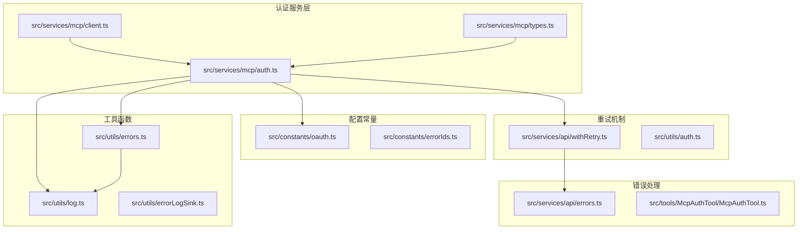
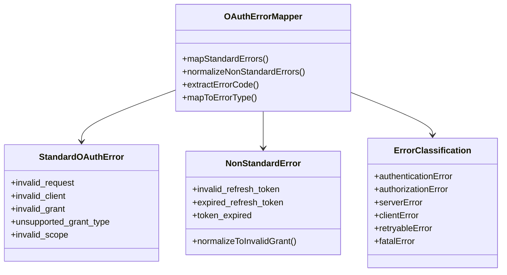
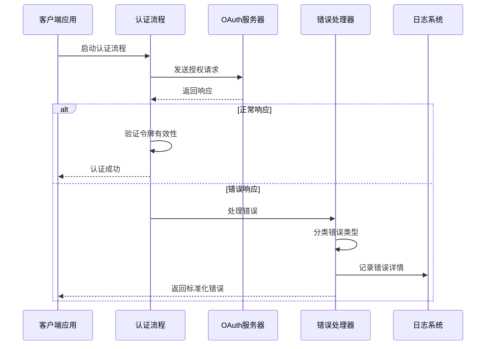
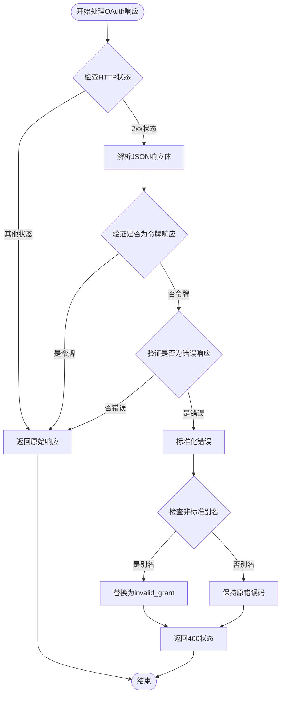
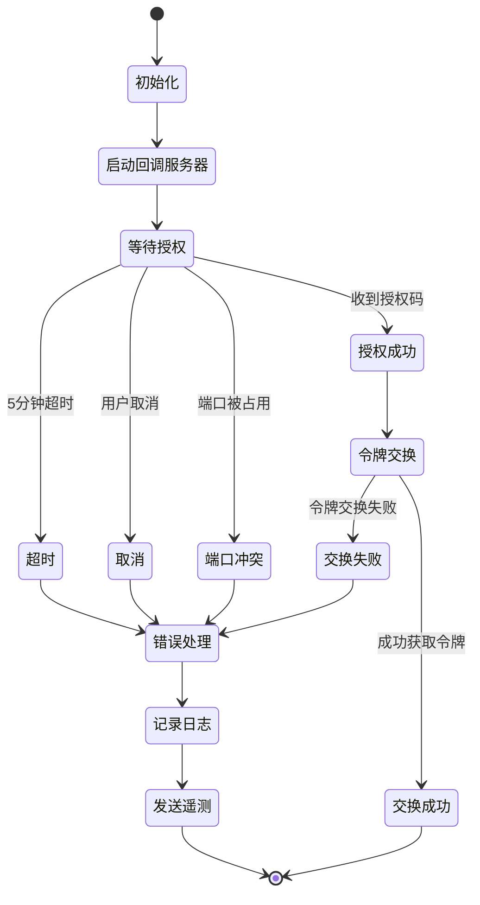
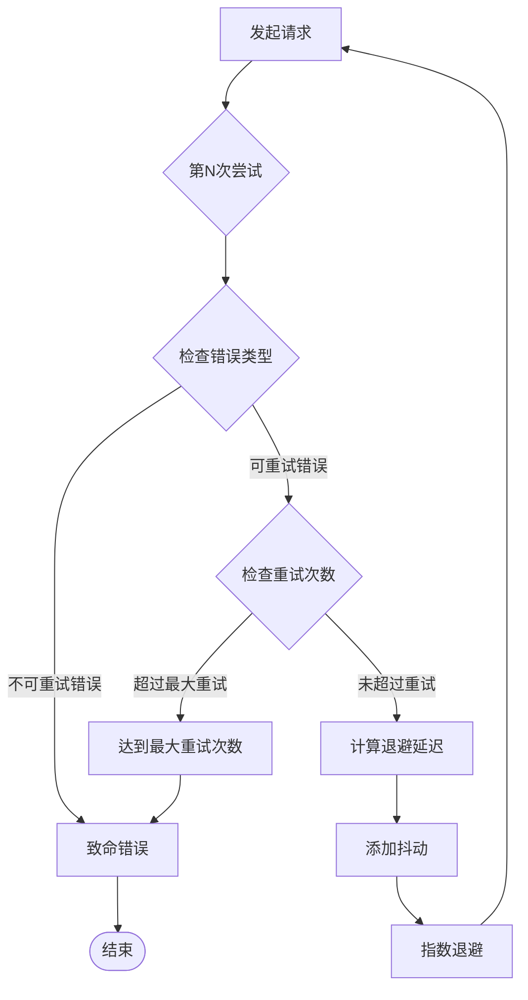
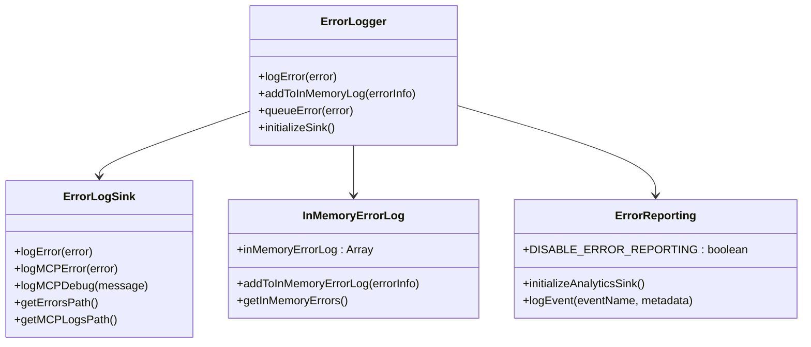

# 认证错误处理

<cite>
**本文档引用的文件**
- [auth.ts](file://src/services/mcp/auth.ts)
- [oauth.ts](file://src/constants/oauth.ts)
- [errors.ts](file://src/utils/errors.ts)
- [log.ts](file://src/utils/log.ts)
- [errorLogSink.ts](file://src/utils/errorLogSink.ts)
- [withRetry.ts](file://src/services/api/withRetry.ts)
- [auth.ts](file://src/utils/auth.ts)
- [errors.ts](file://src/services/api/errors.ts)
- [McpAuthTool.ts](file://src/tools/McpAuthTool/McpAuthTool.ts)
- [bridgeMain.ts](file://src/bridge/bridgeMain.ts)
</cite>

## 目录
1. [简介](#简介)
2. [项目结构](#项目结构)
3. [核心组件](#核心组件)
4. [架构概览](#架构概览)
5. [详细组件分析](#详细组件分析)
6. [依赖关系分析](#依赖关系分析)
7. [性能考虑](#性能考虑)
8. [故障排除指南](#故障排除指南)
9. [结论](#结论)

## 简介

本文档详细介绍了Claude Code中MCP认证错误处理系统的设计与实现。该系统涵盖了OAuth认证过程中的各种错误类型、错误码映射机制、重试机制和退避策略，以及认证取消、超时、网络异常等特殊情况的处理方法。

## 项目结构

认证错误处理系统主要分布在以下模块中：



**图表来源**
- [auth.ts:1-200](file://src/services/mcp/auth.ts#L1-L200)
- [oauth.ts:1-235](file://src/constants/oauth.ts#L1-L235)

## 核心组件

### OAuth错误映射系统

系统实现了完整的OAuth错误映射机制，支持标准OAuth错误和非标准错误的处理策略：



**图表来源**
- [auth.ts:127-190](file://src/services/mcp/auth.ts#L127-L190)

### 错误分类体系

系统定义了八种稳定的错误原因分类：

| 错误类别 | 描述 | 适用场景 |
|---------|------|----------|
| cancelled | 用户主动取消认证 | ESC键取消、手动中断 |
| timeout | 认证超时 | 5分钟超时限制 |
| provider_denied | 提供商拒绝授权 | 用户拒绝授权请求 |
| state_mismatch | OAuth状态不匹配 | CSRF攻击防护 |
| port_unavailable | 端口不可用 | 回调服务器端口冲突 |
| sdk_auth_failed | SDK认证失败 | 内部认证流程错误 |
| token_exchange_failed | 令牌交换失败 | 授权码换取令牌失败 |
| unknown | 未知错误 | 未识别的错误类型 |

**章节来源**
- [auth.ts:84-92](file://src/services/mcp/auth.ts#L84-L92)
- [auth.ts:1262-1291](file://src/services/mcp/auth.ts#L1262-L1291)

## 架构概览

认证错误处理系统采用分层架构设计，确保错误处理的完整性和可维护性：



**图表来源**
- [auth.ts:1009-1291](file://src/services/mcp/auth.ts#L1009-L1291)

## 详细组件分析

### OAuth错误标准化处理

系统实现了对非标准OAuth错误的标准化处理机制：



**图表来源**
- [auth.ts:157-190](file://src/services/mcp/auth.ts#L157-L190)

**章节来源**
- [auth.ts:127-190](file://src/services/mcp/auth.ts#L127-L190)

### 认证流程错误处理

认证流程包含多个关键节点的错误处理：



**图表来源**
- [auth.ts:1009-1291](file://src/services/mcp/auth.ts#L1009-L1291)

**章节来源**
- [auth.ts:1009-1291](file://src/services/mcp/auth.ts#L1009-L1291)

### 重试机制和退避策略

系统实现了智能的重试机制，结合指数退避和线性退避策略：



**图表来源**
- [withRetry.ts:353-463](file://src/services/api/withRetry.ts#L353-L463)

**章节来源**
- [withRetry.ts:353-463](file://src/services/api/withRetry.ts#L353-L463)

### 错误日志记录系统

系统提供了完整的错误日志记录和报告机制：



**图表来源**
- [log.ts:158-223](file://src/utils/log.ts#L158-L223)
- [errorLogSink.ts:212-235](file://src/utils/errorLogSink.ts#L212-L235)

**章节来源**
- [log.ts:158-223](file://src/utils/log.ts#L158-L223)
- [errorLogSink.ts:212-235](file://src/utils/errorLogSink.ts#L212-L235)

## 依赖关系分析

认证错误处理系统的关键依赖关系如下：

```mermaid
graph TB
subgraph "外部依赖"
A[@modelcontextprotocol/sdk]
B[axios]
C[xss]
D[AbortController]
end
subgraph "内部模块"
E[src/services/mcp/auth.ts]
F[src/utils/errors.ts]
G[src/utils/log.ts]
H[src/services/api/withRetry.ts]
I[src/utils/auth.ts]
end
subgraph "配置模块"
J[src/constants/oauth.ts]
K[src/constants/errorIds.ts]
end
E --> A
E --> B
E --> C
E --> D
E --> F
E --> G
E --> J
H --> I
G --> K
```

**图表来源**
- [auth.ts:1-61](file://src/services/mcp/auth.ts#L1-L61)
- [oauth.ts:1-31](file://src/constants/oauth.ts#L1-L31)

**章节来源**
- [auth.ts:1-61](file://src/services/mcp/auth.ts#L1-L61)
- [oauth.ts:1-31](file://src/constants/oauth.ts#L1-L31)

## 性能考虑

系统在设计时充分考虑了性能优化：

1. **异步错误处理**: 所有错误处理都是异步进行，避免阻塞主线程
2. **内存管理**: 使用队列机制处理大量错误日志，防止内存泄漏
3. **缓存策略**: 实现了OAuth令牌缓存和失效检测机制
4. **资源清理**: 确保所有服务器和定时器都能正确清理

## 故障排除指南

### 常见认证问题及解决方案

| 问题类型 | 错误代码 | 解决方案 |
|---------|---------|----------|
| 认证超时 | Authentication timeout | 检查网络连接，延长超时时间 |
| 状态不匹配 | OAuth state mismatch | 检查CSRF防护配置 |
| 端口冲突 | EADDRINUSE | 更改回调端口或关闭占用程序 |
| 令牌无效 | invalid_grant | 清除缓存重新认证 |
| 提供商拒绝 | provider_denied | 检查用户授权设置 |
| SDK失败 | SDK auth failed | 检查OAuth配置和网络 |

### 诊断步骤

1. **启用调试模式**: 查看详细的认证流程日志
2. **检查网络连接**: 确认能够访问OAuth服务器
3. **验证配置**: 检查客户端ID和密钥配置
4. **查看错误码**: 分析具体的OAuth错误代码
5. **检查令牌状态**: 验证访问令牌和刷新令牌的有效性

**章节来源**
- [auth.ts:1262-1342](file://src/services/mcp/auth.ts#L1262-L1342)
- [errors.ts:1-200](file://src/utils/errors.ts#L1-L200)

## 结论

Claude Code的认证错误处理系统通过标准化的错误映射、智能的重试机制和完善的日志记录，为MCP认证过程提供了全面的错误处理能力。系统不仅能够处理标准的OAuth错误，还能有效应对各种非标准情况，确保认证流程的稳定性和可靠性。

该系统的设计体现了以下特点：
- 完整的错误分类和映射机制
- 智能的重试和退避策略
- 全面的日志记录和报告功能
- 良好的性能优化和资源管理
- 易于扩展和维护的架构设计