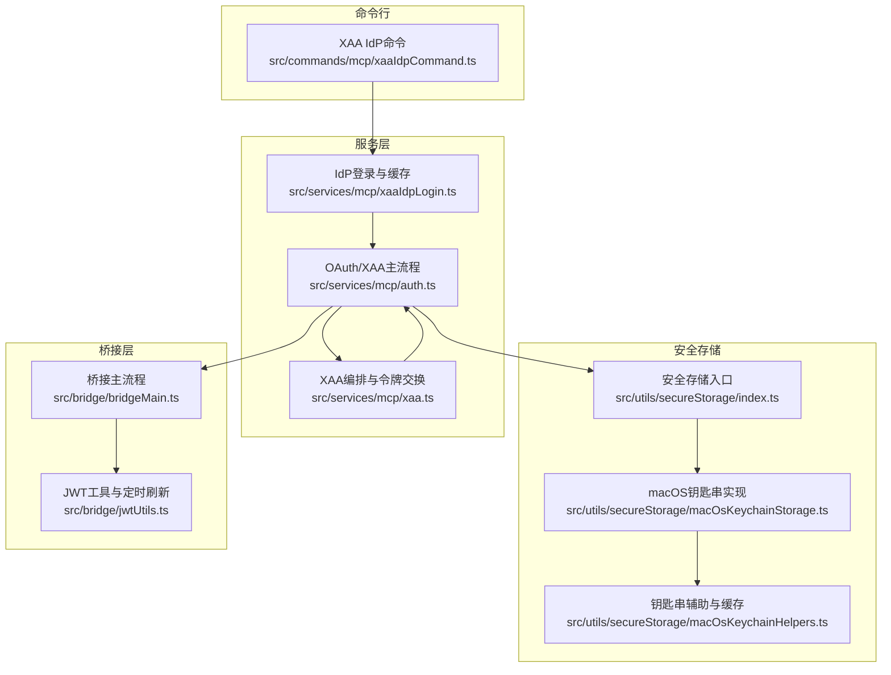
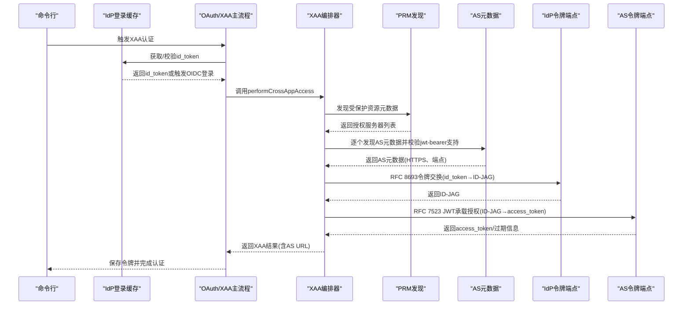
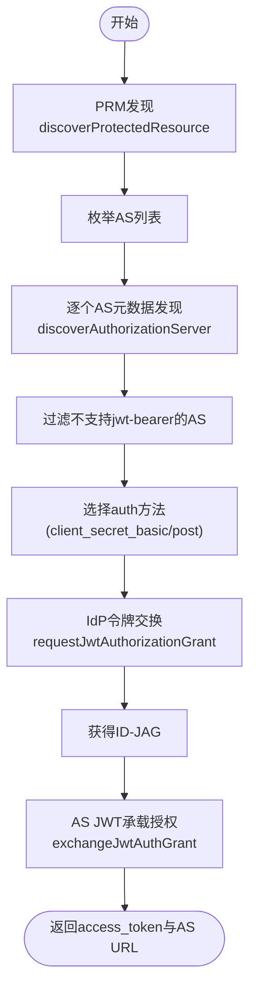
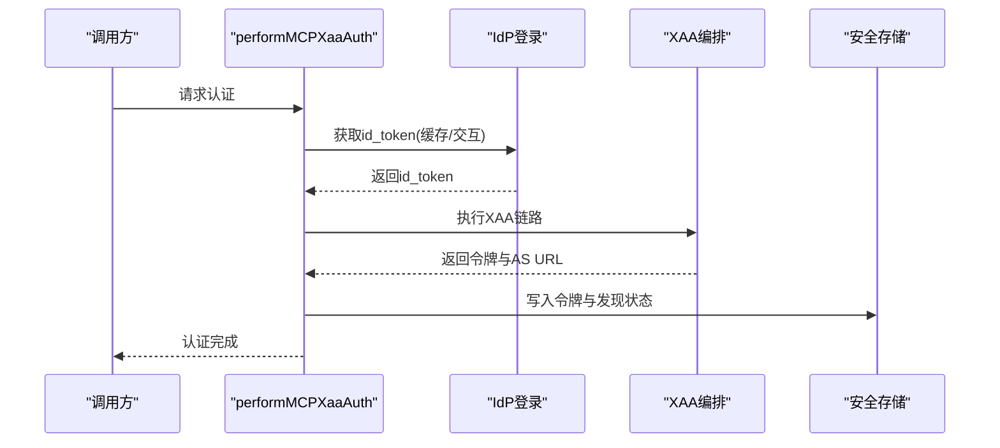
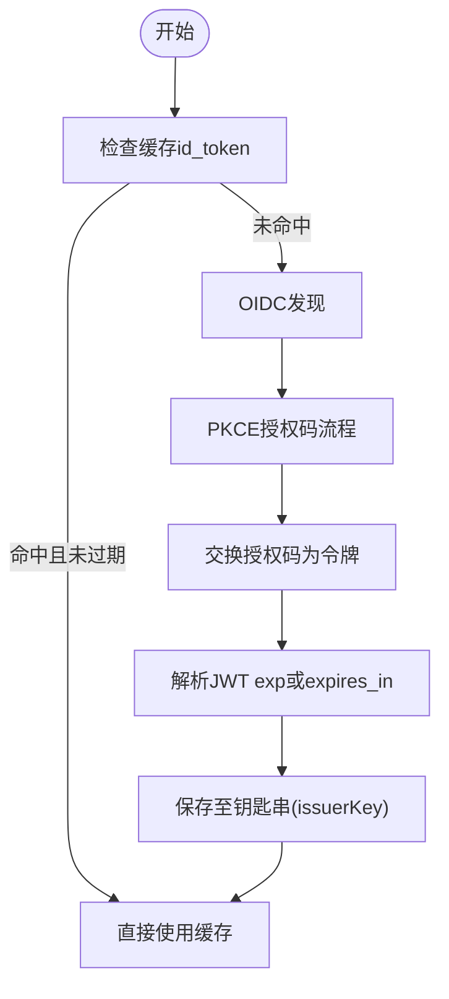
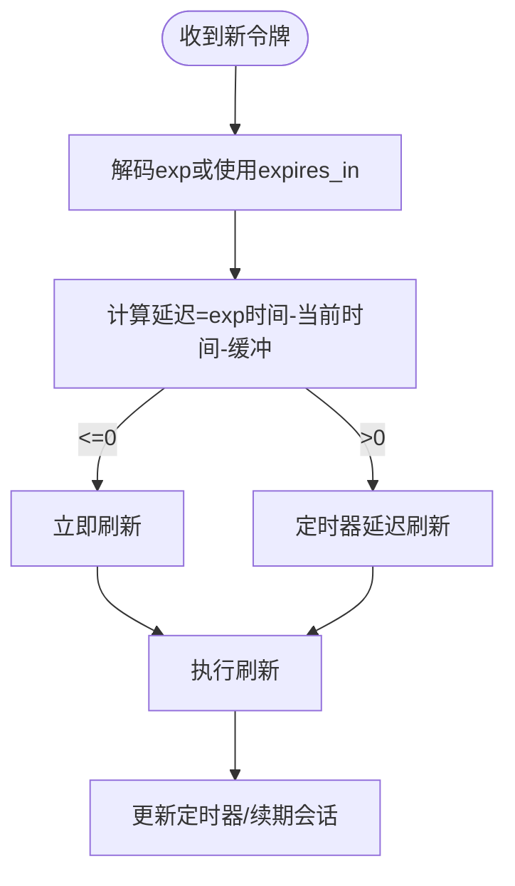
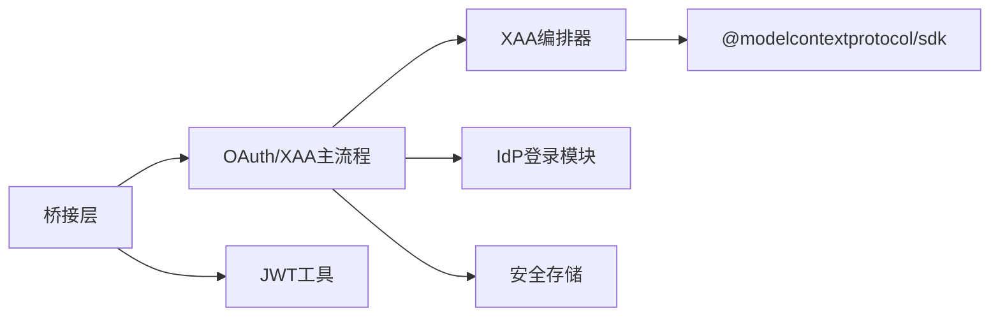

# 跨应用访问(XAA)

<cite>
**本文档引用的文件**
- [src/services/mcp/xaa.ts](file://src/services/mcp/xaa.ts)
- [src/services/mcp/auth.ts](file://src/services/mcp/auth.ts)
- [src/services/mcp/xaaIdpLogin.ts](file://src/services/mcp/xaaIdpLogin.ts)
- [src/commands/mcp/xaaIdpCommand.ts](file://src/commands/mcp/xaaIdpCommand.ts)
- [src/utils/secureStorage/index.ts](file://src/utils/secureStorage/index.ts)
- [src/utils/secureStorage/macOsKeychainStorage.ts](file://src/utils/secureStorage/macOsKeychainStorage.ts)
- [src/utils/secureStorage/macOsKeychainHelpers.ts](file://src/utils/secureStorage/macOsKeychainHelpers.ts)
- [src/bridge/jwtUtils.ts](file://src/bridge/jwtUtils.ts)
- [src/bridge/bridgeMain.ts](file://src/bridge/bridgeMain.ts)
</cite>

## 目录
1. [简介](#简介)
2. [项目结构](#项目结构)
3. [核心组件](#核心组件)
4. [架构总览](#架构总览)
5. [详细组件分析](#详细组件分析)
6. [依赖关系分析](#依赖关系分析)
7. [性能考量](#性能考量)
8. [故障排查指南](#故障排查指南)
9. [结论](#结论)
10. [附录](#附录)

## 简介
本文件系统性阐述跨应用访问（XAA）在该代码库中的实现与使用，涵盖以下要点：
- 架构设计：基于RFC 8693（令牌交换）与RFC 7523（JWT承载授权）的两阶段令牌链路，结合IdP缓存与AS元数据发现，实现无浏览器弹窗的静默认证。
- 核心流程：IdP一次登录、多MCP服务器复用；PRM/AS元数据发现；IdP令牌交换为ID-JAG；AS端JWT承载换取访问令牌。
- 安全与合规：HTTPS强制、令牌脱敏日志、错误语义化（4xx/5xx对缓存的影响）、RFC 7009撤销、密钥存储与缓存一致性。
- 部署与运维：命令行配置、故障转移与降级、调试与排障。

## 项目结构
XAA相关代码主要分布在以下模块：
- 服务层：XAA编排与令牌交换、OAuth通用鉴权与刷新、IdP登录与缓存
- 命令行：IdP连接配置与清理
- 安全存储：平台化密钥链与缓存一致性
- 桥接层：令牌定时刷新与续期



**图表来源**
- [src/commands/mcp/xaaIdpCommand.ts:1-266](file://src/commands/mcp/xaaIdpCommand.ts#L1-L266)
- [src/services/mcp/auth.ts:1-2466](file://src/services/mcp/auth.ts#L1-L2466)
- [src/services/mcp/xaa.ts:1-512](file://src/services/mcp/xaa.ts#L1-L512)
- [src/services/mcp/xaaIdpLogin.ts:1-488](file://src/services/mcp/xaaIdpLogin.ts#L1-L488)
- [src/utils/secureStorage/index.ts:1-17](file://src/utils/secureStorage/index.ts#L1-L17)
- [src/utils/secureStorage/macOsKeychainStorage.ts:1-161](file://src/utils/secureStorage/macOsKeychainStorage.ts#L1-L161)
- [src/utils/secureStorage/macOsKeychainHelpers.ts:71-111](file://src/utils/secureStorage/macOsKeychainHelpers.ts#L71-L111)
- [src/bridge/bridgeMain.ts:279-314](file://src/bridge/bridgeMain.ts#L279-L314)
- [src/bridge/jwtUtils.ts:96-163](file://src/bridge/jwtUtils.ts#L96-L163)

**章节来源**
- [src/commands/mcp/xaaIdpCommand.ts:1-266](file://src/commands/mcp/xaaIdpCommand.ts#L1-L266)
- [src/services/mcp/auth.ts:1-2466](file://src/services/mcp/auth.ts#L1-L2466)
- [src/services/mcp/xaa.ts:1-512](file://src/services/mcp/xaa.ts#L1-L512)
- [src/services/mcp/xaaIdpLogin.ts:1-488](file://src/services/mcp/xaaIdpLogin.ts#L1-L488)
- [src/utils/secureStorage/index.ts:1-17](file://src/utils/secureStorage/index.ts#L1-L17)
- [src/utils/secureStorage/macOsKeychainStorage.ts:1-161](file://src/utils/secureStorage/macOsKeychainStorage.ts#L1-L161)
- [src/utils/secureStorage/macOsKeychainHelpers.ts:71-111](file://src/utils/secureStorage/macOsKeychainHelpers.ts#L71-L111)
- [src/bridge/bridgeMain.ts:279-314](file://src/bridge/bridgeMain.ts#L279-L314)
- [src/bridge/jwtUtils.ts:96-163](file://src/bridge/jwtUtils.ts#L96-L163)

## 核心组件
- XAA编排器：负责PRM/AS元数据发现、IdP令牌交换（RFC 8693）、AS JWT承载授权（RFC 7523），返回标准化访问令牌结果。
- OAuth/XAA主流程：统一处理OAuth与XAA两种路径，支持静默刷新、撤销、错误归因与分析事件上报。
- IdP登录与缓存：通过OIDC PKCE获取id_token并缓存于钥匙串，按过期时间与缓冲期管理复用。
- 安全存储：平台化密钥链封装，含缓存一致性与并发读写保护。
- 桥接层定时刷新：基于JWT过期时间的定时刷新与续期，保障会话稳定。

**章节来源**
- [src/services/mcp/xaa.ts:426-512](file://src/services/mcp/xaa.ts#L426-L512)
- [src/services/mcp/auth.ts:641-845](file://src/services/mcp/auth.ts#L641-L845)
- [src/services/mcp/xaaIdpLogin.ts:99-150](file://src/services/mcp/xaaIdpLogin.ts#L99-L150)
- [src/utils/secureStorage/index.ts:1-17](file://src/utils/secureStorage/index.ts#L1-L17)
- [src/bridge/jwtUtils.ts:96-163](file://src/bridge/jwtUtils.ts#L96-L163)

## 架构总览
XAA整体流程分为三层：
- 层1：元数据发现（PRM/AS）
- 层2：令牌交换与授权（IdP令牌交换、AS JWT承载）
- 层3：编排器组合（performCrossAppAccess）



**图表来源**
- [src/services/mcp/auth.ts:664-845](file://src/services/mcp/auth.ts#L664-L845)
- [src/services/mcp/xaa.ts:426-512](file://src/services/mcp/xaa.ts#L426-L512)
- [src/services/mcp/xaaIdpLogin.ts:401-487](file://src/services/mcp/xaaIdpLogin.ts#L401-L487)

## 详细组件分析

### 组件A：XAA编排器（performCrossAppAccess）
- 功能：执行完整的XAA链路，包含PRM发现、AS元数据发现、IdP令牌交换、AS JWT承载授权。
- 关键点：
  - PRM资源匹配与URL规范化，防止混用攻击。
  - AS元数据HTTPS强制与issuer一致性校验。
  - 支持多AS候选与grant类型过滤。
  - IdP令牌交换后严格校验issued_token_type为ID-JAG。
  - AS端根据advertised auth method选择client_secret_basic或client_secret_post。
- 错误处理：对IdP 4xx/5xx与响应体结构进行语义化区分，决定是否清除id_token缓存。



**图表来源**
- [src/services/mcp/xaa.ts:135-210](file://src/services/mcp/xaa.ts#L135-L210)
- [src/services/mcp/xaa.ts:233-310](file://src/services/mcp/xaa.ts#L233-L310)
- [src/services/mcp/xaa.ts:337-394](file://src/services/mcp/xaa.ts#L337-L394)
- [src/services/mcp/xaa.ts:426-512](file://src/services/mcp/xaa.ts#L426-L512)

**章节来源**
- [src/services/mcp/xaa.ts:124-210](file://src/services/mcp/xaa.ts#L124-L210)
- [src/services/mcp/xaa.ts:212-310](file://src/services/mcp/xaa.ts#L212-L310)
- [src/services/mcp/xaa.ts:312-394](file://src/services/mcp/xaa.ts#L312-L394)
- [src/services/mcp/xaa.ts:396-512](file://src/services/mcp/xaa.ts#L396-L512)

### 组件B：OAuth/XAA主流程（performMCPXaaAuth）
- 功能：统一入口，协调IdP登录、XAA编排、令牌保存与错误归因。
- 关键点：
  - 强制XAA路径，不进行静默回退。
  - 失败阶段归因（idp_login/discovery/token_exchange/jwt_bearer）。
  - 对IdP 4xx错误清理id_token缓存，5xx保留以避免重复登录。
  - 令牌保存到同一密钥槽位，兼容后续刷新与撤销。
- 与桥接层联动：当access_token即将过期时，通过桥接层定时刷新维持会话。



**图表来源**
- [src/services/mcp/auth.ts:664-845](file://src/services/mcp/auth.ts#L664-L845)
- [src/services/mcp/auth.ts:847-901](file://src/services/mcp/auth.ts#L847-L901)
- [src/bridge/bridgeMain.ts:279-314](file://src/bridge/bridgeMain.ts#L279-L314)

**章节来源**
- [src/services/mcp/auth.ts:641-845](file://src/services/mcp/auth.ts#L641-L845)
- [src/services/mcp/auth.ts:847-901](file://src/services/mcp/auth.ts#L847-L901)
- [src/bridge/bridgeMain.ts:279-314](file://src/bridge/bridgeMain.ts#L279-L314)

### 组件C：IdP登录与缓存（acquireIdpIdToken）
- 功能：OIDC PKCE获取id_token，缓存至钥匙串，按JWT exp与缓冲期管理复用。
- 关键点：
  - 缓存命中条件：存在且未接近过期（缓冲期默认60秒）。
  - OIDC发现：强制HTTPS token_endpoint，修正路径拼接避免Azure AD/Okta等特殊基地址问题。
  - 回调端口：支持固定端口以适配某些IdP的RFC 8252限制。
  - 安全：JWT解析仅提取exp用于TTL，不进行签名验证，降低复杂度并避免绕过风险。



**图表来源**
- [src/services/mcp/xaaIdpLogin.ts:99-150](file://src/services/mcp/xaaIdpLogin.ts#L99-L150)
- [src/services/mcp/xaaIdpLogin.ts:202-237](file://src/services/mcp/xaaIdpLogin.ts#L202-L237)
- [src/services/mcp/xaaIdpLogin.ts:401-487](file://src/services/mcp/xaaIdpLogin.ts#L401-L487)

**章节来源**
- [src/services/mcp/xaaIdpLogin.ts:99-150](file://src/services/mcp/xaaIdpLogin.ts#L99-L150)
- [src/services/mcp/xaaIdpLogin.ts:202-237](file://src/services/mcp/xaaIdpLogin.ts#L202-L237)
- [src/services/mcp/xaaIdpLogin.ts:401-487](file://src/services/mcp/xaaIdpLogin.ts#L401-L487)

### 组件D：安全存储与缓存一致性（macOS钥匙串）
- 功能：平台化密钥存储，支持缓存TTL、并发去重、失败回退。
- 关键点：
  - 缓存状态：generation计数、readInFlight去重、stale-while-error策略。
  - 写入优化：优先stdin注入避免命令行参数暴露；超限回退argv。
  - 清理：更新/删除前清空缓存，保证读写一致性。

```mermaid
classDiagram
class KeychainStorage {
+name : string
+read() : SecureStorageData
+readAsync() : Promise~SecureStorageData~
+update(data) : {success, warning?}
+delete() : boolean
}
class KeychainCacheState {
+cache : {data, cachedAt}
+generation : number
+readInFlight : Promise
}
KeychainStorage --> KeychainCacheState : "维护缓存"
```

**图表来源**
- [src/utils/secureStorage/macOsKeychainStorage.ts:26-161](file://src/utils/secureStorage/macOsKeychainStorage.ts#L26-L161)
- [src/utils/secureStorage/macOsKeychainHelpers.ts:71-111](file://src/utils/secureStorage/macOsKeychainHelpers.ts#L71-L111)

**章节来源**
- [src/utils/secureStorage/index.ts:1-17](file://src/utils/secureStorage/index.ts#L1-L17)
- [src/utils/secureStorage/macOsKeychainStorage.ts:26-161](file://src/utils/secureStorage/macOsKeychainStorage.ts#L26-L161)
- [src/utils/secureStorage/macOsKeychainHelpers.ts:71-111](file://src/utils/secureStorage/macOsKeychainHelpers.ts#L71-L111)

### 组件E：桥接层定时刷新（createTokenRefreshScheduler）
- 功能：基于JWT exp的定时刷新，确保会话在过期前续期。
- 关键点：
  - 解析JWT exp或服务端expires_in，计算刷新延迟。
  - 刷新缓冲：默认刷新提前量，避免临界窗口。
  - 会话v2：到期前通过reconnectSession触发服务端重新派发。



**图表来源**
- [src/bridge/jwtUtils.ts:96-163](file://src/bridge/jwtUtils.ts#L96-L163)
- [src/bridge/bridgeMain.ts:279-314](file://src/bridge/bridgeMain.ts#L279-L314)

**章节来源**
- [src/bridge/jwtUtils.ts:96-163](file://src/bridge/jwtUtils.ts#L96-L163)
- [src/bridge/bridgeMain.ts:279-314](file://src/bridge/bridgeMain.ts#L279-L314)

## 依赖关系分析
- 组件耦合：
  - XAA编排器依赖OAuth SDK进行PRM/AS元数据发现。
  - OAuth/XAA主流程依赖IdP登录模块与安全存储。
  - 桥接层依赖JWT工具与OAuth主流程的令牌刷新。
- 外部依赖：
  - OAuth SDK（@modelcontextprotocol/sdk）提供元数据发现与授权流程抽象。
  - 平台密钥存储（macOS钥匙串）用于敏感凭据持久化。



**图表来源**
- [src/services/mcp/xaa.ts:19-27](file://src/services/mcp/xaa.ts#L19-L27)
- [src/services/mcp/auth.ts:1-51](file://src/services/mcp/auth.ts#L1-L51)
- [src/bridge/bridgeMain.ts:279-314](file://src/bridge/bridgeMain.ts#L279-L314)

**章节来源**
- [src/services/mcp/xaa.ts:19-27](file://src/services/mcp/xaa.ts#L19-L27)
- [src/services/mcp/auth.ts:1-51](file://src/services/mcp/auth.ts#L1-L51)
- [src/bridge/bridgeMain.ts:279-314](file://src/bridge/bridgeMain.ts#L279-L314)

## 性能考量
- 元数据发现：PRM与AS元数据发现为幂等请求，建议在首次连接时缓存，后续复用减少网络开销。
- 令牌交换：XAA链路为四次请求（PRM→AS→IdP→AS），建议在高并发场景下增加进程内锁避免重复交换。
- 刷新策略：基于JWT exp的定时刷新可减少无效请求；缓冲期设置需平衡网络抖动与续期频率。
- 存储性能：钥匙串读写采用缓存与去重策略，避免频繁子进程调用。

## 故障排查指南
- 常见错误与处理：
  - PRM/AS发现失败：检查MCP服务器是否实现RFC 9728/RFC 8414；确认URL与HTTPS要求。
  - IdP令牌交换失败（4xx）：清理id_token缓存以触发新登录；检查scope与client认证方式。
  - IdP令牌交换失败（5xx）：保留id_token缓存，等待IdP恢复。
  - AS JWT承载授权失败：检查AS是否支持jwt-bearer与client认证方式。
- 日志与诊断：
  - 使用命令行配置IdP连接，支持查看/清理缓存与密钥。
  - 分析OAuth失败阶段（idp_login/discovery/token_exchange/jwt_bearer）定位问题根因。
  - 启用调试日志与错误日志收集，定位网络代理、Captive Portal或非JSON响应等问题。
- 撤销与清理：
  - 通过RFC 7009撤销access_token/refresh_token，优先client_secret_basic，必要时退回Bearer认证。
  - 清理本地令牌与发现状态，避免残留导致的静默失败。

**章节来源**
- [src/services/mcp/auth.ts:641-845](file://src/services/mcp/auth.ts#L641-L845)
- [src/services/mcp/xaa.ts:260-310](file://src/services/mcp/xaa.ts#L260-L310)
- [src/services/mcp/auth.ts:467-618](file://src/services/mcp/auth.ts#L467-L618)
- [src/commands/mcp/xaaIdpCommand.ts:1-266](file://src/commands/mcp/xaaIdpCommand.ts#L1-L266)

## 结论
该XAA实现以RFC 8693与RFC 7523为核心，结合IdP缓存与AS元数据发现，实现了企业环境下的无感认证与静默刷新。通过严格的HTTPS与元数据校验、令牌脱敏与错误语义化、平台化密钥存储与缓存一致性，以及与桥接层的协同，提供了安全、可靠、可观测的跨应用访问能力。建议在生产环境中启用HTTPS、合理设置刷新缓冲、完善监控与日志，以获得最佳体验。

## 附录

### 配置方法
- IdP连接配置（一次性，所有XAA服务器共享）：
  - 设置issuer、client-id、可选client-secret、可选固定回调端口。
  - 命令：`claude mcp xaa setup --issuer <url> --client-id <id> [--client-secret] [--callback-port <port>]`
- 服务器侧启用XAA：
  - 在服务器配置中开启oauth.xaa，并提供AS的clientId/clientSecret。
  - 命令：`claude mcp add ... --oauth-client-id <id> --oauth-client-secret <secret> --oauth-xaa`

**章节来源**
- [src/commands/mcp/xaaIdpCommand.ts:29-112](file://src/commands/mcp/xaaIdpCommand.ts#L29-L112)
- [src/commands/mcp/addCommand.ts:198-229](file://src/commands/mcp/addCommand.ts#L198-L229)

### 故障转移与降级
- 多AS候选：当PRM声明多个AS时，按支持的grant类型筛选，逐个探测HTTPS与端点可用性。
- 静默刷新：当access_token即将过期且无refresh_token时，尝试使用缓存id_token进行静默交换。
- 降级策略：若XAA不可用或禁用，OAuth路径仍可作为替代方案（但XAA服务器明确配置时不回退）。

**章节来源**
- [src/services/mcp/xaa.ts:441-471](file://src/services/mcp/xaa.ts#L441-L471)
- [src/services/mcp/auth.ts:1575-1615](file://src/services/mcp/auth.ts#L1575-L1615)

### 安全考虑
- HTTPS强制：PRM/AS元数据与IdP令牌端点均要求HTTPS，防止明文传输泄露。
- 令牌脱敏：日志中对敏感字段进行脱敏处理，避免泄露。
- CSRF防护：OAuth state参数校验与XSS净化，防止中间人攻击。
- 密钥存储：钥匙串写入采用stdin注入或argv回退，避免命令行参数暴露。

**章节来源**
- [src/services/mcp/xaa.ts:195-202](file://src/services/mcp/xaa.ts#L195-L202)
- [src/services/mcp/xaaIdpLogin.ts:208-236](file://src/services/mcp/xaaIdpLogin.ts#L208-L236)
- [src/services/mcp/auth.ts:100-125](file://src/services/mcp/auth.ts#L100-L125)
- [src/services/mcp/auth.ts:1109-1140](file://src/services/mcp/auth.ts#L1109-L1140)

### 部署指南与调试技巧
- 部署要点：
  - 确保MCP服务器实现RFC 9728与RFC 8414元数据端点。
  - IdP必须支持RFC 8693令牌交换与HTTPS token_endpoint。
  - AS必须支持jwt-bearer与client认证方式（优先basic）。
- 调试技巧：
  - 使用`CLAUDE_CODE_ENABLE_XAA=1`启用XAA路径。
  - 查看OAuth失败阶段与分析事件，定位问题根因。
  - 检查钥匙串缓存与回调端口占用，排除网络与代理干扰。

**章节来源**
- [src/services/mcp/auth.ts:871-876](file://src/services/mcp/auth.ts#L871-L876)
- [src/services/mcp/auth.ts:641-663](file://src/services/mcp/auth.ts#L641-L663)
- [src/services/mcp/xaaIdpLogin.ts:36-34](file://src/services/mcp/xaaIdpLogin.ts#L36-L34)