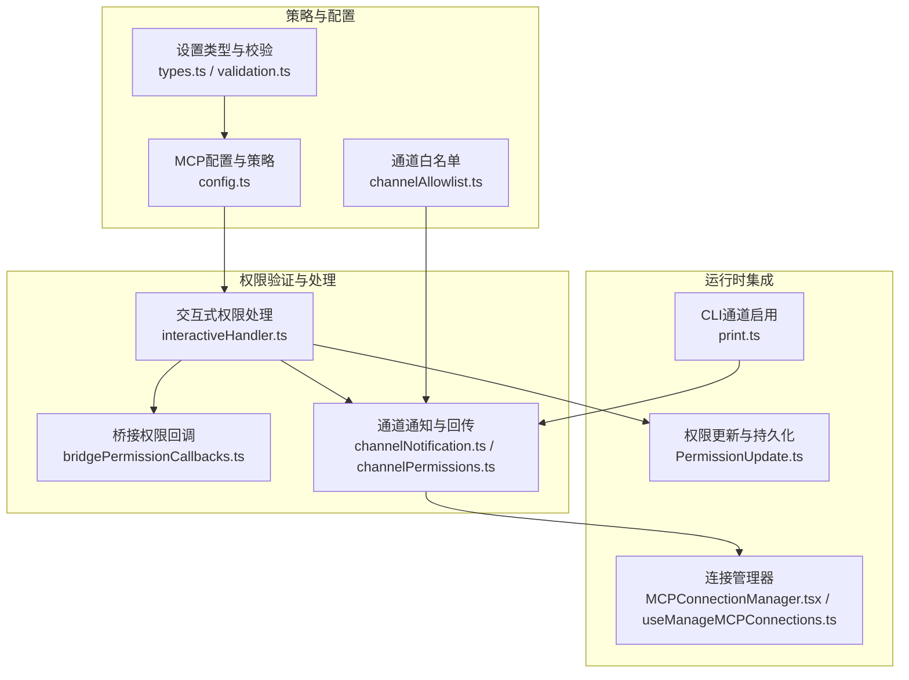
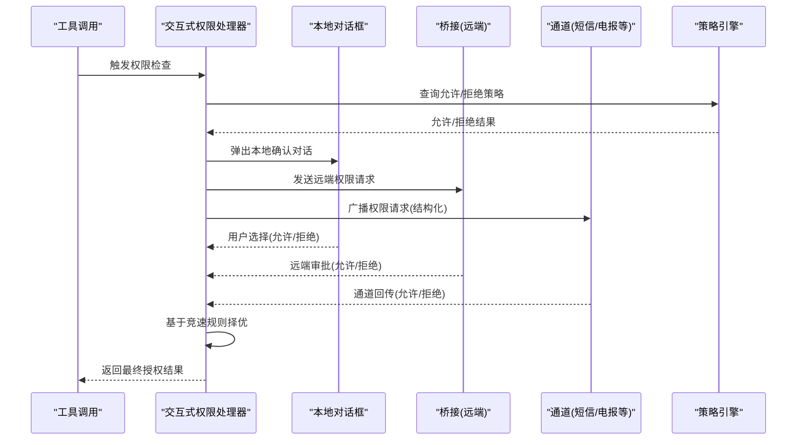
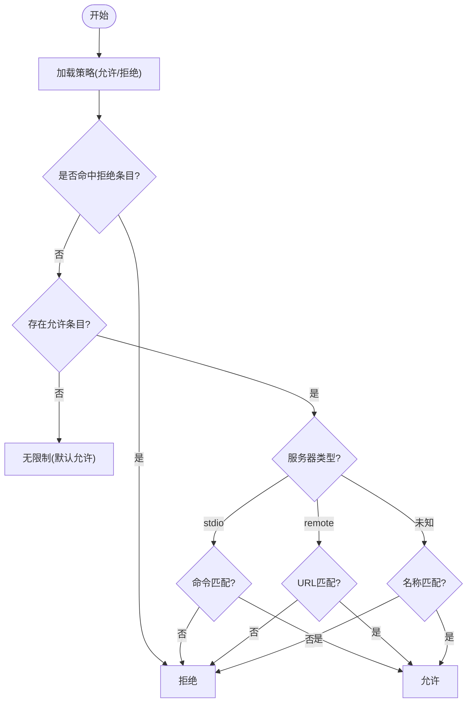
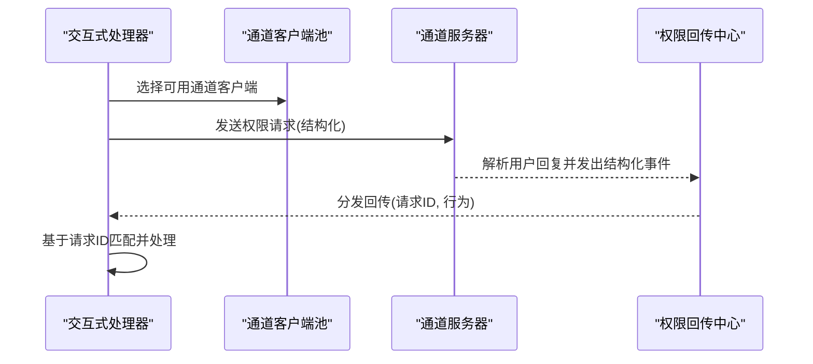
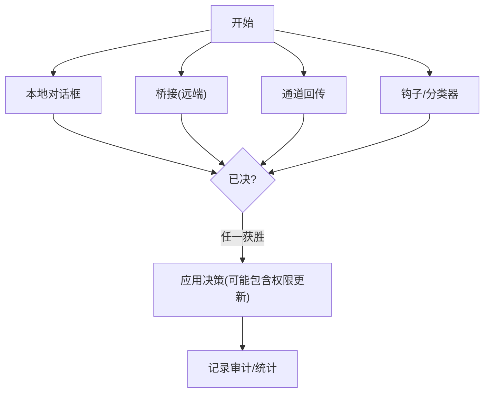
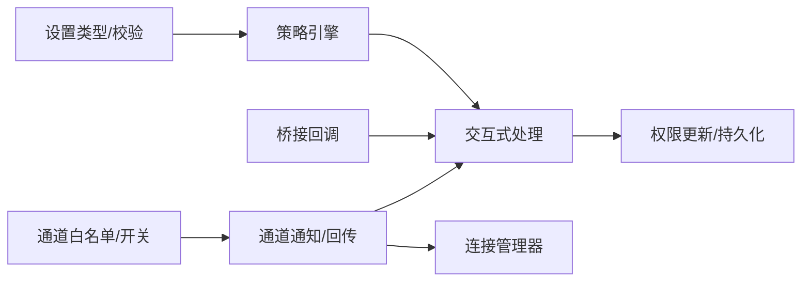

# 通道权限控制

<cite>
**本文档引用的文件**
- [config.ts](file://src/services/mcp/config.ts)
- [channelPermissions.ts](file://src/services/mcp/channelPermissions.ts)
- [channelNotification.ts](file://src/services/mcp/channelNotification.ts)
- [channelAllowlist.ts](file://src/services/mcp/channelAllowlist.ts)
- [interactiveHandler.ts](file://src/hooks/toolPermission/handlers/interactiveHandler.ts)
- [bridgePermissionCallbacks.ts](file://src/bridge/bridgePermissionCallbacks.ts)
- [print.ts](file://src/cli/print.ts)
- [types.ts](file://src/utils/settings/types.ts)
- [validation.ts](file://src/utils/settings/validation.ts)
- [MCPConnectionManager.tsx](file://src/services/mcp/MCPConnectionManager.tsx)
- [useManageMCPConnections.ts](file://src/services/mcp/useManageMCPConnections.ts)
- [PermissionUpdate.ts](file://src/utils/permissions/PermissionUpdate.ts)
- [denialTracking.ts](file://src/utils/permissions/denialTracking.ts)
- [toolExecution.ts](file://src/services/tools/toolExecution.ts)
</cite>

## 目录
1. [简介](#简介)
2. [项目结构](#项目结构)
3. [核心组件](#核心组件)
4. [架构总览](#架构总览)
5. [详细组件分析](#详细组件分析)
6. [依赖关系分析](#依赖关系分析)
7. [性能考虑](#性能考虑)
8. [故障排除指南](#故障排除指南)
9. [结论](#结论)
10. [附录](#附录)

## 简介
本文件系统性阐述MCP（Model Context Protocol）通道权限控制系统的设计原理与实现策略，重点覆盖：
- 企业级MCP服务器允许列表与拒绝列表机制
- 权限验证流程、访问控制决策逻辑与多通道权限回传
- 通道级别的安全边界与隔离策略
- 权限配置示例、继承规则与审计追踪
- 权限问题排查与性能优化建议

该系统通过“策略门禁 + 多源并发决策 + 结构化回传”的设计，在保证安全的同时兼顾用户体验与可运维性。

## 项目结构
围绕MCP通道权限控制的关键模块分布如下：
- 企业策略与MCP服务器配置：src/services/mcp/config.ts
- 通道通知与权限回传：src/services/mcp/channelNotification.ts、src/services/mcp/channelPermissions.ts
- 通道白名单与运行开关：src/services/mcp/channelAllowlist.ts
- 交互式权限处理与并发竞速：src/hooks/toolPermission/handlers/interactiveHandler.ts
- 桥接端权限回调（远端批准）：src/bridge/bridgePermissionCallbacks.ts
- CLI通道启用流程：src/cli/print.ts
- 权限更新与持久化：src/utils/permissions/PermissionUpdate.ts
- 权限规则校验与审计：src/utils/settings/validation.ts、src/services/tools/toolExecution.ts
- 运行时上下文与连接管理：src/services/mcp/MCPConnectionManager.tsx、src/services/mcp/useManageMCPConnections.ts

**图表来源**
- [config.ts:336-551](file://src/services/mcp/config.ts#L336-L551)
- [channelNotification.ts:191-317](file://src/services/mcp/channelNotification.ts#L191-L317)
- [channelPermissions.ts:1-241](file://src/services/mcp/channelPermissions.ts#L1-L241)
- [interactiveHandler.ts:57-537](file://src/hooks/toolPermission/handlers/interactiveHandler.ts#L57-L537)
- [bridgePermissionCallbacks.ts:1-44](file://src/bridge/bridgePermissionCallbacks.ts#L1-L44)
- [print.ts:4662-4768](file://src/cli/print.ts#L4662-L4768)
- [types.ts:111-158](file://src/utils/settings/types.ts#L111-L158)
- [validation.ts:238-265](file://src/utils/settings/validation.ts#L238-L265)
- [MCPConnectionManager.tsx:1-72](file://src/services/mcp/MCPConnectionManager.tsx#L1-L72)
- [useManageMCPConnections.ts:159-185](file://src/services/mcp/useManageMCPConnections.ts#L159-L185)
- [PermissionUpdate.ts:349-353](file://src/utils/permissions/PermissionUpdate.ts#L349-L353)

**章节来源**
- [config.ts:336-551](file://src/services/mcp/config.ts#L336-L551)
- [channelNotification.ts:191-317](file://src/services/mcp/channelNotification.ts#L191-L317)
- [channelPermissions.ts:1-241](file://src/services/mcp/channelPermissions.ts#L1-L241)
- [interactiveHandler.ts:57-537](file://src/hooks/toolPermission/handlers/interactiveHandler.ts#L57-L537)
- [bridgePermissionCallbacks.ts:1-44](file://src/bridge/bridgePermissionCallbacks.ts#L1-L44)
- [print.ts:4662-4768](file://src/cli/print.ts#L4662-L4768)
- [types.ts:111-158](file://src/utils/settings/types.ts#L111-L158)
- [validation.ts:238-265](file://src/utils/settings/validation.ts#L238-L265)
- [MCPConnectionManager.tsx:1-72](file://src/services/mcp/MCPConnectionManager.tsx#L1-L72)
- [useManageMCPConnections.ts:159-185](file://src/services/mcp/useManageMCPConnections.ts#L159-L185)
- [PermissionUpdate.ts:349-353](file://src/utils/permissions/PermissionUpdate.ts#L349-L353)

## 核心组件
- 企业MCP策略引擎：负责解析合并策略、执行允许/拒绝检查，并在添加服务器时进行即时校验。
- 通道通知与权限回传：定义通道消息包装、权限请求/响应协议、通道能力声明与过滤。
- 交互式权限处理：统一汇聚本地、桥接、通道、钩子与分类器的并发决策，采用“先到先决”原则。
- 权限更新与持久化：支持将用户授权结果转换为可持久化的规则更新，实现会话/永久授权的差异化存储。
- CLI通道启用流程：在IDE触发场景下，对通道启用进行门禁校验与注册。

**章节来源**
- [config.ts:336-551](file://src/services/mcp/config.ts#L336-L551)
- [channelNotification.ts:191-317](file://src/services/mcp/channelNotification.ts#L191-L317)
- [channelPermissions.ts:1-241](file://src/services/mcp/channelPermissions.ts#L1-L241)
- [interactiveHandler.ts:57-537](file://src/hooks/toolPermission/handlers/interactiveHandler.ts#L57-L537)
- [PermissionUpdate.ts:349-353](file://src/utils/permissions/PermissionUpdate.ts#L349-L353)

## 架构总览
下图展示从工具调用到多源并发决策与最终授权的完整链路：

**图表来源**
- [interactiveHandler.ts:57-537](file://src/hooks/toolPermission/handlers/interactiveHandler.ts#L57-L537)
- [bridgePermissionCallbacks.ts:1-44](file://src/bridge/bridgePermissionCallbacks.ts#L1-L44)
- [channelPermissions.ts:209-241](file://src/services/mcp/channelPermissions.ts#L209-L241)
- [config.ts:417-508](file://src/services/mcp/config.ts#L417-L508)

## 详细组件分析

### 企业MCP策略引擎（允许/拒绝列表）
- 策略来源与合并：
  - 允许列表：当开启“仅受托管策略”时，仅使用托管策略；否则合并多源策略。
  - 拒绝列表：始终合并所有来源，确保个人可对特定服务器进行拒绝。
- 匹配维度：
  - 名称匹配：serverName
  - 命令匹配：serverCommand（仅stdio）
  - URL匹配：serverUrl（支持通配符，仅远程服务器）
- 优先级：拒绝列表绝对优先，其次允许列表；空允许列表表示“全部拒绝”。

**图表来源**
- [config.ts:336-508](file://src/services/mcp/config.ts#L336-L508)
- [types.ts:111-158](file://src/utils/settings/types.ts#L111-L158)

**章节来源**
- [config.ts:336-551](file://src/services/mcp/config.ts#L336-L551)
- [types.ts:111-158](file://src/utils/settings/types.ts#L111-L158)

### 通道通知与权限回传
- 通道能力声明：服务器需声明实验性能力以参与通道通知与权限回传。
- 通知封装：将通道内容包裹为XML标签，携带元数据属性，防止注入。
- 权限请求/响应协议：
  - 请求：结构化参数包含请求ID、工具名、描述与输入预览。
  - 响应：结构化事件包含请求ID与行为（允许/拒绝），避免误识别文本回复。
- 通道回传客户端筛选：要求服务器同时具备“通道发送能力”和“权限回传能力”，且必须在会话允许列表中。

**图表来源**
- [channelPermissions.ts:177-241](file://src/services/mcp/channelPermissions.ts#L177-L241)
- [channelNotification.ts:62-95](file://src/services/mcp/channelNotification.ts#L62-L95)

**章节来源**
- [channelNotification.ts:191-317](file://src/services/mcp/channelNotification.ts#L191-L317)
- [channelPermissions.ts:1-241](file://src/services/mcp/channelPermissions.ts#L1-L241)

### 交互式权限处理（并发竞速）
- 并发来源：
  - 本地对话框：用户直接确认
  - 桥接（远端）：通过桥接通道进行远端审批
  - 通道：通过短信/电报等通道回传
  - 钩子与分类器：自动决策与提示
- 决策规则：
  - 原子性：首个到达的决策获胜（resolve-once）
  - 取消语义：其他未决来源收到取消信号，避免重复弹窗
  - 自动化：在满足条件时，分类器可自动放行并显示确认指示
- 输入与权限更新：
  - 支持返回更新后的输入与权限建议
  - 将远端批准的权限更新持久化为规则

**图表来源**
- [interactiveHandler.ts:57-537](file://src/hooks/toolPermission/handlers/interactiveHandler.ts#L57-L537)
- [bridgePermissionCallbacks.ts:1-44](file://src/bridge/bridgePermissionCallbacks.ts#L1-L44)
- [channelPermissions.ts:209-241](file://src/services/mcp/channelPermissions.ts#L209-L241)

**章节来源**
- [interactiveHandler.ts:57-537](file://src/hooks/toolPermission/handlers/interactiveHandler.ts#L57-L537)
- [bridgePermissionCallbacks.ts:1-44](file://src/bridge/bridgePermissionCallbacks.ts#L1-L44)
- [channelPermissions.ts:209-241](file://src/services/mcp/channelPermissions.ts#L209-L241)

### CLI通道启用流程
- IDE触发通道启用时，系统对服务器进行门禁校验：
  - 能力检查、运行开关、认证状态、组织策略、会话允许列表、通道白名单
- 成功后注册通道通知处理器，将通道消息以高优先级入队，供模型在下一回合消费。

**章节来源**
- [print.ts:4662-4768](file://src/cli/print.ts#L4662-L4768)
- [channelNotification.ts:191-317](file://src/services/mcp/channelNotification.ts#L191-L317)

### 权限更新与持久化
- 权限更新类型：新增/移除规则、目录授权等
- 持久化目标：区分会话临时授权与用户永久授权
- 规则校验：对权限规则进行合法性校验与告警

**章节来源**
- [PermissionUpdate.ts:349-353](file://src/utils/permissions/PermissionUpdate.ts#L349-L353)
- [validation.ts:238-265](file://src/utils/settings/validation.ts#L238-L265)

### 审计与统计
- 决策来源映射：将规则来源映射为标准化的OTel source标签，便于审计
- 统计维度：按来源（用户临时/永久/配置/钩子等）统计授权与拒绝

**章节来源**
- [toolExecution.ts:173-231](file://src/services/tools/toolExecution.ts#L173-L231)

## 依赖关系分析
- 策略层依赖设置类型与校验模块，确保允许/拒绝条目的合法性
- 通道层依赖通道白名单与运行开关，确保只有经批准的插件才能启用通道
- 处理层依赖桥接回调与通道回传，形成多源并发决策
- 连接管理层负责通道通知处理器的注册与生命周期管理

**图表来源**
- [types.ts:111-158](file://src/utils/settings/types.ts#L111-L158)
- [validation.ts:238-265](file://src/utils/settings/validation.ts#L238-L265)
- [config.ts:336-551](file://src/services/mcp/config.ts#L336-L551)
- [channelAllowlist.ts:1-77](file://src/services/mcp/channelAllowlist.ts#L1-L77)
- [channelNotification.ts:191-317](file://src/services/mcp/channelNotification.ts#L191-L317)
- [interactiveHandler.ts:57-537](file://src/hooks/toolPermission/handlers/interactiveHandler.ts#L57-L537)
- [bridgePermissionCallbacks.ts:1-44](file://src/bridge/bridgePermissionCallbacks.ts#L1-L44)
- [PermissionUpdate.ts:349-353](file://src/utils/permissions/PermissionUpdate.ts#L349-L353)
- [MCPConnectionManager.tsx:1-72](file://src/services/mcp/MCPConnectionManager.tsx#L1-L72)

**章节来源**
- [config.ts:336-551](file://src/services/mcp/config.ts#L336-L551)
- [channelNotification.ts:191-317](file://src/services/mcp/channelNotification.ts#L191-L317)
- [channelPermissions.ts:1-241](file://src/services/mcp/channelPermissions.ts#L1-L241)
- [interactiveHandler.ts:57-537](file://src/hooks/toolPermission/handlers/interactiveHandler.ts#L57-L537)
- [bridgePermissionCallbacks.ts:1-44](file://src/bridge/bridgePermissionCallbacks.ts#L1-L44)
- [types.ts:111-158](file://src/utils/settings/types.ts#L111-L158)
- [validation.ts:238-265](file://src/utils/settings/validation.ts#L238-L265)
- [MCPConnectionManager.tsx:1-72](file://src/services/mcp/MCPConnectionManager.tsx#L1-L72)

## 性能考虑
- 策略计算缓存：企业MCP配置存在缓存函数，避免重复解析
- 通道回传幂等：基于请求ID匹配，重复事件会被忽略
- 并发竞速：通过原子性与取消语义减少无效UI弹窗与资源消耗
- 日志与调试：关键路径提供调试日志，便于定位性能瓶颈

**章节来源**
- [config.ts:1470-1477](file://src/services/mcp/config.ts#L1470-L1477)
- [channelPermissions.ts:228-238](file://src/services/mcp/channelPermissions.ts#L228-L238)
- [interactiveHandler.ts:57-537](file://src/hooks/toolPermission/handlers/interactiveHandler.ts#L57-L537)

## 故障排除指南
- 通道无法启用：
  - 检查通道能力声明与回传能力是否同时满足
  - 确认会话允许列表与通道白名单是否包含对应插件
  - 核对组织策略与认证状态
- 权限未生效：
  - 检查权限更新是否被持久化为目标位置（会话/永久）
  - 校验权限规则合法性与格式
- 自动化分类器频繁拒绝：
  - 查看连续拒绝计数，超过阈值将回退到人工确认
- 远端/通道响应延迟：
  - 关注竞速窗口内的其他来源是否提前决议
  - 检查通道服务器是否正确发出结构化事件

**章节来源**
- [channelNotification.ts:191-317](file://src/services/mcp/channelNotification.ts#L191-L317)
- [channelPermissions.ts:209-241](file://src/services/mcp/channelPermissions.ts#L209-L241)
- [denialTracking.ts:1-45](file://src/utils/permissions/denialTracking.ts#L1-L45)
- [validation.ts:238-265](file://src/utils/settings/validation.ts#L238-L265)

## 结论
该MCP通道权限控制系统通过“策略门禁 + 多源并发决策 + 结构化回传”的设计，在保障企业安全边界的同时，提供了灵活的用户体验与可观测性。其关键优势包括：
- 明确的企业策略优先级与可配置的匹配维度
- 通道回传的结构化协议与严格的白名单控制
- 交互式处理的竞速与取消语义，降低冗余与冲突
- 完整的权限更新与审计能力，便于合规与运维

## 附录

### 权限配置示例（概念性说明）
- 允许列表条目（三选一）：
  - 仅名称匹配：serverName
  - 仅命令匹配：serverCommand（数组，精确匹配）
  - 仅URL匹配：serverUrl（支持通配符）
- 拒绝列表条目：同上三类，但作用为拒绝
- 通道白名单条目：{ marketplace, plugin }，用于通道启用前置校验

**章节来源**
- [types.ts:111-158](file://src/utils/settings/types.ts#L111-L158)
- [config.ts:336-508](file://src/services/mcp/config.ts#L336-L508)
- [channelAllowlist.ts:23-44](file://src/services/mcp/channelAllowlist.ts#L23-L44)

### 权限继承与作用域
- 策略来源合并：允许列表在“仅托管策略”模式下由托管策略独占；否则合并多源
- 拒绝列表始终合并：个人可对任意服务器进行拒绝
- 通道白名单：组织可通过托管策略覆盖默认清单

**章节来源**
- [config.ts:336-355](file://src/services/mcp/config.ts#L336-L355)
- [channelAllowlist.ts:37-53](file://src/services/mcp/channelAllowlist.ts#L37-L53)

### 安全边界与隔离
- 通道服务器必须显式声明能力，且需同时具备“通道发送能力”和“权限回传能力”
- 通道回传严格基于结构化事件，避免误识别普通文本
- 通道白名单与组织策略共同决定通道启用范围

**章节来源**
- [channelPermissions.ts:177-194](file://src/services/mcp/channelPermissions.ts#L177-L194)
- [channelNotification.ts:49-95](file://src/services/mcp/channelNotification.ts#L49-L95)