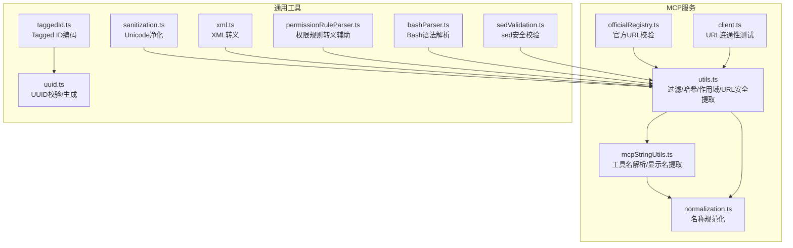
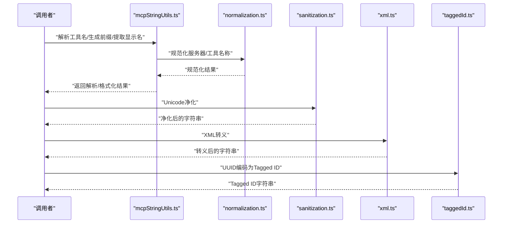
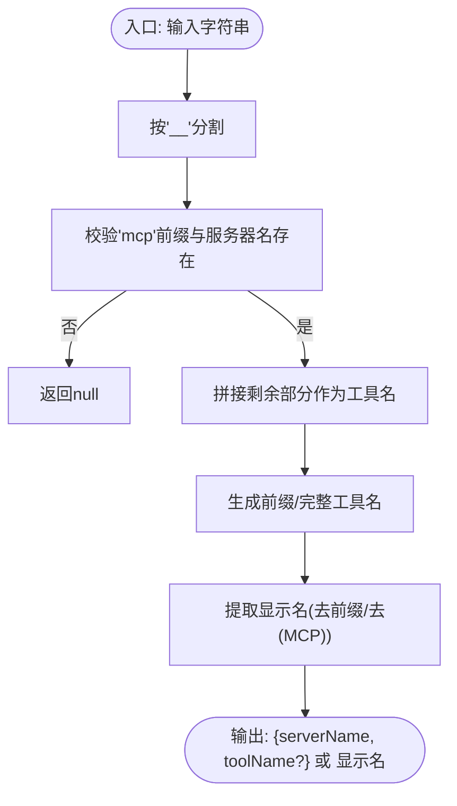
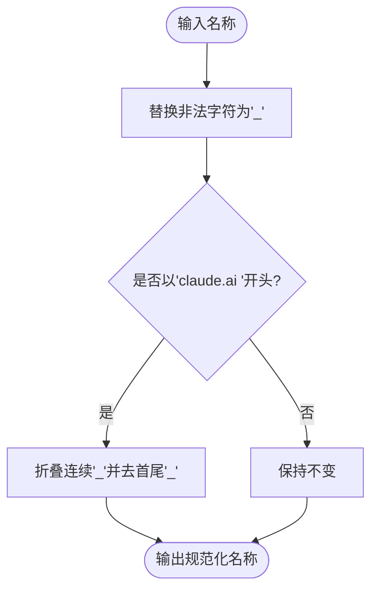
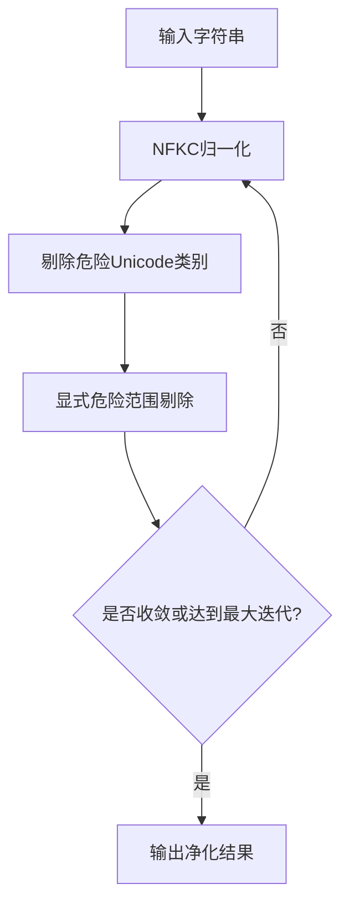
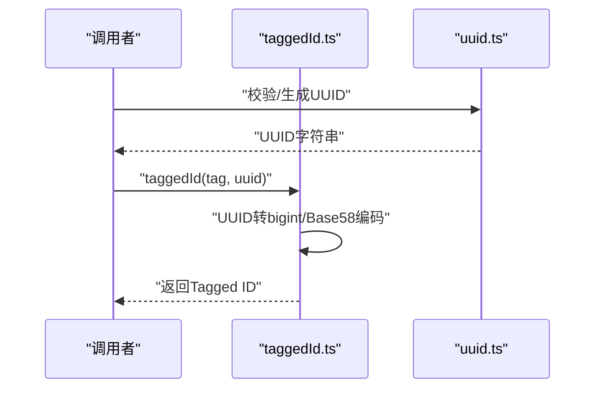
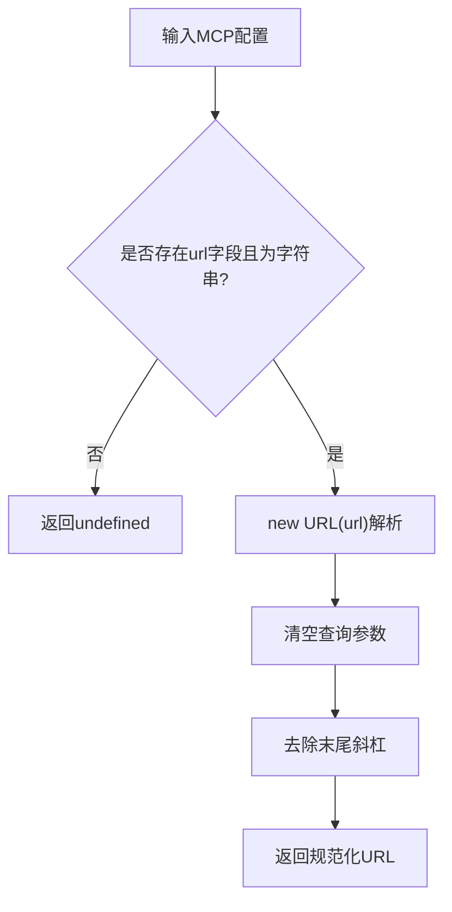
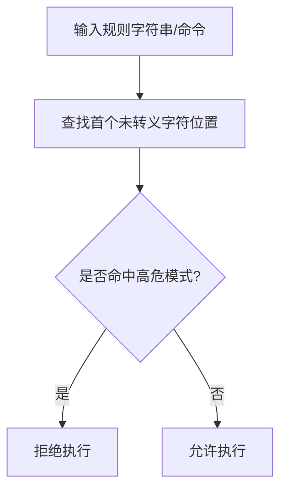
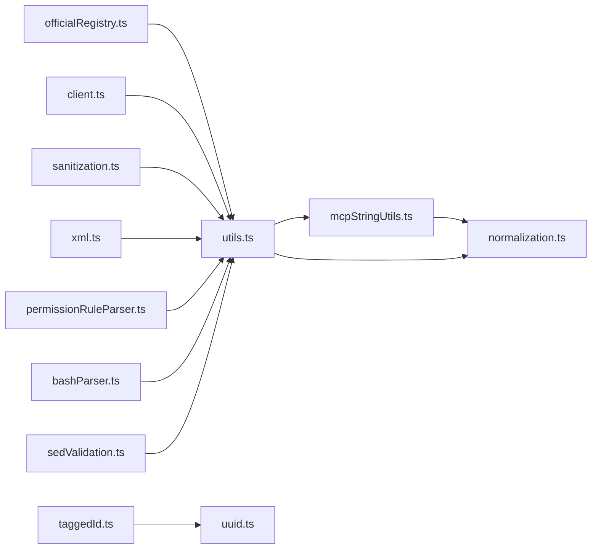

# MCP字符串工具

<cite>
**本文档引用的文件**
- [mcpStringUtils.ts](file://src/services/mcp/mcpStringUtils.ts)
- [normalization.ts](file://src/services/mcp/normalization.ts)
- [utils.ts](file://src/services/mcp/utils.ts)
- [sanitization.ts](file://src/utils/sanitization.ts)
- [xml.ts](file://src/utils/xml.ts)
- [taggedId.ts](file://src/utils/taggedId.ts)
- [uuid.ts](file://src/utils/uuid.ts)
- [permissionRuleParser.ts](file://src/utils/permissions/permissionRuleParser.ts)
- [bashParser.ts](file://src/utils/bash/bashParser.ts)
- [sedValidation.ts](file://src/tools/BashTool/sedValidation.ts)
- [officialRegistry.ts](file://src/services/mcp/officialRegistry.ts)
- [client.ts](file://src/services/mcp/client.ts)
- [getLoggingSafeMcpBaseUrl:561-575](file://src/services/mcp/utils.ts#L561-L575)
</cite>

## 目录
1. [简介](#简介)
2. [项目结构](#项目结构)
3. [核心组件](#核心组件)
4. [架构总览](#架构总览)
5. [详细组件分析](#详细组件分析)
6. [依赖关系分析](#依赖关系分析)
7. [性能考虑](#性能考虑)
8. [故障排除指南](#故障排除指南)
9. [结论](#结论)
10. [附录](#附录)

## 简介
本文件系统性梳理并深入解析MCP（模型上下文协议）相关的字符串工具集，覆盖以下关键领域：
- MCP专用字符串解析与格式化：包括工具名解析、前缀生成、显示名提取等
- 标识符生成与转换：UUID到带标签的标识符、Base58编码、规范化名称
- URL处理与安全：URL标准化、日志安全URL提取、官方注册表校验
- 字符串验证与清理：Unicode隐藏字符攻击防护、XML转义、权限规则转义
- 编码与转义：Base58、XML实体转义、路径与头信息解析
- 正则表达式与匹配：权限规则转义辅助、Bash sed命令安全校验
- 性能优化与内存管理：LRU缓存、TTL记忆化、稳定哈希
- 最佳实践与常见场景：权限匹配、显示名剥离、URL安全处理

## 项目结构
MCP字符串工具主要分布在如下模块：
- 服务层字符串工具：MCP工具名解析、显示名提取、配置作用域识别
- 规范化工具：名称规范化以适配API约束
- 安全与清理：Unicode净化、XML转义
- 标识符与编码：Tagged ID、UUID工具
- 权限与转义：权限规则转义辅助、Bash sed安全校验
- URL与注册表：URL安全提取、官方URL校验

**图表来源**
- [mcpStringUtils.ts:1-107](file://src/services/mcp/mcpStringUtils.ts#L1-L107)
- [normalization.ts:1-24](file://src/services/mcp/normalization.ts#L1-L24)
- [utils.ts:1-576](file://src/services/mcp/utils.ts#L1-L576)
- [officialRegistry.ts:44-72](file://src/services/mcp/officialRegistry.ts#L44-L72)
- [client.ts:1026-1046](file://src/services/mcp/client.ts#L1026-L1046)
- [sanitization.ts:1-92](file://src/utils/sanitization.ts#L1-L92)
- [xml.ts:1-16](file://src/utils/xml.ts#L1-L16)
- [taggedId.ts:1-54](file://src/utils/taggedId.ts#L1-L54)
- [uuid.ts:1-27](file://src/utils/uuid.ts#L1-L27)
- [permissionRuleParser.ts:154-198](file://src/utils/permissions/permissionRuleParser.ts#L154-L198)
- [bashParser.ts:2707-3933](file://src/utils/bash/bashParser.ts#L2707-L3933)
- [sedValidation.ts:477-517](file://src/tools/BashTool/sedValidation.ts#L477-L517)

**章节来源**
- [mcpStringUtils.ts:1-107](file://src/services/mcp/mcpStringUtils.ts#L1-L107)
- [utils.ts:1-576](file://src/services/mcp/utils.ts#L1-L576)

## 核心组件
- MCP工具名解析与格式化
  - 工具名解析：从形如“mcp__serverName__toolName”的字符串中提取服务器与工具名
  - 前缀生成：根据服务器名生成mcp__前缀
  - 显示名提取：去除前缀与后缀，保留用户可读名称
- 名称规范化
  - 将任意字符串规范化为API约束的合法字符集合
  - 特殊处理claude.ai前缀，折叠连续下划线并去首尾下划线
- 安全与清理
  - Unicode净化：NFKC归一化 + 危险Unicode类剔除 + 多轮迭代
  - XML转义：文本与属性值的安全转义
- 标识符与编码
  - Tagged ID：基于UUID的带标签编码，版本前缀+固定长度Base58
  - UUID校验与生成：正则校验与随机生成
- URL与注册表
  - 日志安全URL提取：剥离查询参数与尾部斜杠
  - 官方URL校验：基于官方注册表的白名单检查
- 权限与转义
  - 权限规则转义辅助：查找首个未转义字符位置
  - Bash sed安全校验：拒绝非ASCII、大括号、换行、注释、否定等高危模式

**章节来源**
- [mcpStringUtils.ts:9-107](file://src/services/mcp/mcpStringUtils.ts#L9-L107)
- [normalization.ts:9-23](file://src/services/mcp/normalization.ts#L9-L23)
- [sanitization.ts:25-92](file://src/utils/sanitization.ts#L25-L92)
- [xml.ts:6-16](file://src/utils/xml.ts#L6-L16)
- [taggedId.ts:16-54](file://src/utils/taggedId.ts#L16-L54)
- [uuid.ts:12-27](file://src/utils/uuid.ts#L12-L27)
- [utils.ts:561-575](file://src/services/mcp/utils.ts#L561-L575)
- [officialRegistry.ts:66-68](file://src/services/mcp/officialRegistry.ts#L66-L68)
- [permissionRuleParser.ts:154-198](file://src/utils/permissions/permissionRuleParser.ts#L154-L198)
- [sedValidation.ts:477-517](file://src/tools/BashTool/sedValidation.ts#L477-L517)

## 架构总览
MCP字符串工具围绕“解析—规范化—安全—格式化”四步流程工作：
- 解析：从工具名或显示名中提取服务器与工具信息
- 规范化：确保名称符合API约束，避免非法字符与歧义
- 安全：对输入进行Unicode净化与XML转义，防止隐藏字符注入与注入攻击
- 格式化：生成前缀、显示名、Tagged ID、日志安全URL等

**图表来源**
- [mcpStringUtils.ts:19-106](file://src/services/mcp/mcpStringUtils.ts#L19-L106)
- [normalization.ts:17-23](file://src/services/mcp/normalization.ts#L17-L23)
- [sanitization.ts:25-65](file://src/utils/sanitization.ts#L25-L65)
- [xml.ts:6-16](file://src/utils/xml.ts#L6-L16)
- [taggedId.ts:51-54](file://src/utils/taggedId.ts#L51-L54)

## 详细组件分析

### 组件A：MCP工具名解析与格式化
职责与能力：
- 从“mcp__serverName__toolName”解析服务器与工具名
- 生成mcp__前缀与完整工具名
- 提取显示名（去除前缀与(MCP)后缀）
- 权限匹配时使用完全限定名，避免内置工具误判

**图表来源**
- [mcpStringUtils.ts:19-106](file://src/services/mcp/mcpStringUtils.ts#L19-L106)

**章节来源**
- [mcpStringUtils.ts:9-107](file://src/services/mcp/mcpStringUtils.ts#L9-L107)

### 组件B：名称规范化
职责与能力：
- 将任意字符串替换非法字符为下划线
- 对claude.ai前缀进行特殊处理：折叠连续下划线并去首尾下划线
- 保证名称长度与字符集满足API约束

**图表来源**
- [normalization.ts:17-23](file://src/services/mcp/normalization.ts#L17-L23)

**章节来源**
- [normalization.ts:9-23](file://src/services/mcp/normalization.ts#L9-L23)

### 组件C：Unicode净化与XML转义
职责与能力：
- Unicode净化：NFKC归一化 + Unicode危险类别剔除 + 显式范围剔除 + 多轮迭代
- XML转义：文本与属性值分别转义，防止注入与渲染异常
- 支持递归净化复杂数据结构

**图表来源**
- [sanitization.ts:25-65](file://src/utils/sanitization.ts#L25-L65)
- [xml.ts:6-16](file://src/utils/xml.ts#L6-L16)

**章节来源**
- [sanitization.ts:1-92](file://src/utils/sanitization.ts#L1-L92)
- [xml.ts:1-16](file://src/utils/xml.ts#L1-L16)

### 组件D：标识符生成与转换
职责与能力：
- Tagged ID：基于UUID的带标签编码，版本前缀+固定长度Base58
- UUID校验与生成：正则校验与随机生成，支持带/不带短横线的UUID

**图表来源**
- [taggedId.ts:51-54](file://src/utils/taggedId.ts#L51-L54)
- [uuid.ts:12-27](file://src/utils/uuid.ts#L12-L27)

**章节来源**
- [taggedId.ts:1-54](file://src/utils/taggedId.ts#L1-L54)
- [uuid.ts:1-27](file://src/utils/uuid.ts#L1-L27)

### 组件E：URL处理与官方注册表校验
职责与能力：
- 日志安全URL提取：剥离查询参数与尾部斜杠，失败时返回undefined
- 官方URL校验：基于已加载的官方注册表进行白名单检查
- HTTP连接性测试：解析URL并记录主机、端口、协议等调试信息

**图表来源**
- [utils.ts:561-575](file://src/services/mcp/utils.ts#L561-L575)
- [client.ts:1026-1046](file://src/services/mcp/client.ts#L1026-L1046)
- [officialRegistry.ts:66-68](file://src/services/mcp/officialRegistry.ts#L66-L68)

**章节来源**
- [utils.ts:561-575](file://src/services/mcp/utils.ts#L561-L575)
- [client.ts:1026-1046](file://src/services/mcp/client.ts#L1026-L1046)
- [officialRegistry.ts:44-72](file://src/services/mcp/officialRegistry.ts#L44-L72)

### 组件F：权限规则与Bash sed安全校验
职责与能力：
- 权限规则转义辅助：在解析规则时查找首个未转义字符位置，支持反斜杠计数判断
- Bash sed安全校验：拒绝非ASCII、大括号、换行、注释、否定等高危模式

**图表来源**
- [permissionRuleParser.ts:154-198](file://src/utils/permissions/permissionRuleParser.ts#L154-L198)
- [sedValidation.ts:477-517](file://src/tools/BashTool/sedValidation.ts#L477-L517)

**章节来源**
- [permissionRuleParser.ts:154-198](file://src/utils/permissions/permissionRuleParser.ts#L154-L198)
- [sedValidation.ts:477-517](file://src/tools/BashTool/sedValidation.ts#L477-L517)

## 依赖关系分析
- 模块内聚与耦合
  - mcpStringUtils依赖normalization进行名称规范化
  - utils集中提供过滤、哈希、作用域、URL安全提取等跨模块能力
  - 安全相关工具（sanitization、xml）被多处调用，形成高复用低耦合
- 外部依赖
  - URL构造与解析用于HTTP传输与日志安全URL提取
  - 正则表达式用于Unicode净化与sed安全校验
  - Base58编码用于Tagged ID生成

**图表来源**
- [mcpStringUtils.ts:7-7](file://src/services/mcp/mcpStringUtils.ts#L7-L7)
- [utils.ts:17-18](file://src/services/mcp/utils.ts#L17-L18)
- [officialRegistry.ts:44-54](file://src/services/mcp/officialRegistry.ts#L44-L54)
- [client.ts:1026-1046](file://src/services/mcp/client.ts#L1026-L1046)
- [sanitization.ts:25-65](file://src/utils/sanitization.ts#L25-L65)
- [xml.ts:6-16](file://src/utils/xml.ts#L6-L16)
- [taggedId.ts:51-54](file://src/utils/taggedId.ts#L51-L54)
- [uuid.ts:12-27](file://src/utils/uuid.ts#L12-L27)
- [permissionRuleParser.ts:154-198](file://src/utils/permissions/permissionRuleParser.ts#L154-L198)
- [bashParser.ts:2707-3933](file://src/utils/bash/bashParser.ts#L2707-L3933)
- [sedValidation.ts:477-517](file://src/tools/BashTool/sedValidation.ts#L477-L517)

**章节来源**
- [mcpStringUtils.ts:1-107](file://src/services/mcp/mcpStringUtils.ts#L1-L107)
- [utils.ts:1-576](file://src/services/mcp/utils.ts#L1-L576)

## 性能考虑
- 记忆化与缓存
  - TTL记忆化：写穿透缓存，先返回旧值再后台刷新，降低重复计算开销
  - LRU缓存：限制缓存大小，避免内存膨胀
- 稳定哈希
  - 配置对象稳定序列化与哈希，用于变更检测，避免不必要的重连
- 字符串处理优化
  - 使用NFKC归一化减少后续处理复杂度
  - 正则替换批量化，减少多次遍历
- I/O与网络
  - URL解析与官方注册表加载采用一次性缓存策略，避免频繁网络请求

**章节来源**
- [utils.ts:157-169](file://src/services/mcp/utils.ts#L157-L169)
- [sanitization.ts:25-65](file://src/utils/sanitization.ts#L25-L65)

## 故障排除指南
- Unicode净化异常
  - 现象：达到最大迭代次数抛错
  - 排查：检查输入是否包含极端嵌套Unicode组合；确认NFKC归一化是否生效
  - 参考
    - [sanitization.ts:57-62](file://src/utils/sanitization.ts#L57-L62)
- XML转义导致渲染异常
  - 现象：属性值未正确转义导致HTML/XML解析错误
  - 排查：区分文本转义与属性转义，确保双引号与单引号均被转义
  - 参考
    - [xml.ts:6-16](file://src/utils/xml.ts#L6-L16)
- 权限规则解析错误
  - 现象：规则中的转义字符未被正确识别
  - 排查：确认反斜杠计数为偶数才视为未转义
  - 参考
    - [permissionRuleParser.ts:154-198](file://src/utils/permissions/permissionRuleParser.ts#L154-L198)
- Bash sed命令被拒绝
  - 现象：命令包含非ASCII、大括号、换行、注释或否定
  - 排查：移除高危模式，仅使用ASCII与受支持的操作符
  - 参考
    - [sedValidation.ts:477-517](file://src/tools/BashTool/sedValidation.ts#L477-L517)
- URL安全提取失败
  - 现象：stdo/sdk服务器或URL解析失败返回undefined
  - 排查：确认配置包含有效URL字符串；检查URL格式
  - 参考
    - [utils.ts:561-575](file://src/services/mcp/utils.ts#L561-L575)

**章节来源**
- [sanitization.ts:57-62](file://src/utils/sanitization.ts#L57-L62)
- [xml.ts:6-16](file://src/utils/xml.ts#L6-L16)
- [permissionRuleParser.ts:154-198](file://src/utils/permissions/permissionRuleParser.ts#L154-L198)
- [sedValidation.ts:477-517](file://src/tools/BashTool/sedValidation.ts#L477-L517)
- [utils.ts:561-575](file://src/services/mcp/utils.ts#L561-L575)

## 结论
MCP字符串工具集通过“解析—规范化—安全—格式化”的分层设计，提供了：
- 稳健的MCP工具名解析与显示名提取
- 符合API约束的名称规范化
- 面向注入攻击的Unicode净化与XML转义
- 安全的标识符编码与UUID工具
- URL安全提取与官方注册表校验
- 权限规则与Bash sed的安全校验
配合TTL记忆化、LRU缓存与稳定哈希，整体在安全性与性能之间取得平衡。

## 附录
- 常见使用场景
  - 权限匹配：使用完全限定工具名进行deny规则匹配
  - 显示名剥离：从用户可见名称中去除服务器前缀与(MCP)后缀
  - URL安全：在日志中记录无查询参数与尾斜杠的URL
  - 标识符生成：将UUID编码为Tagged ID用于API交互
- 最佳实践
  - 输入一律先Unicode净化再进入下游处理
  - XML内容插入前后端时务必转义
  - 权限规则与外部命令严格遵循转义与白名单原则
  - URL统一走日志安全提取，避免泄露敏感参数