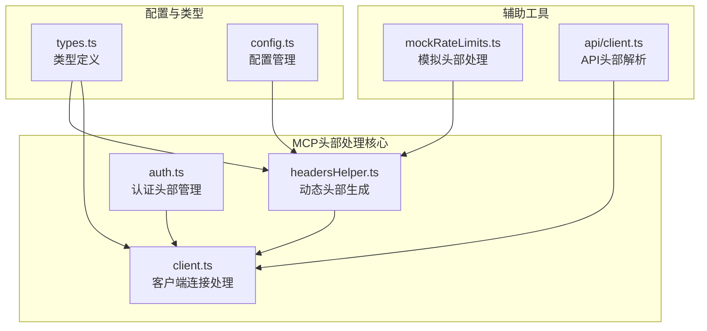
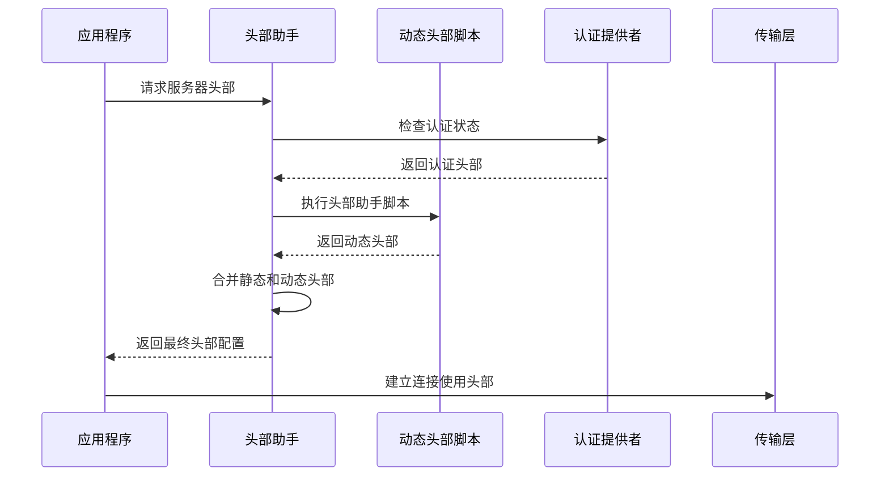
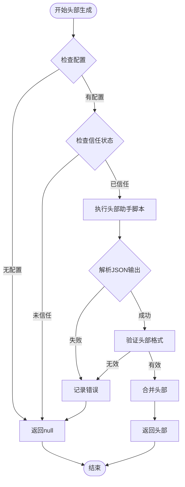
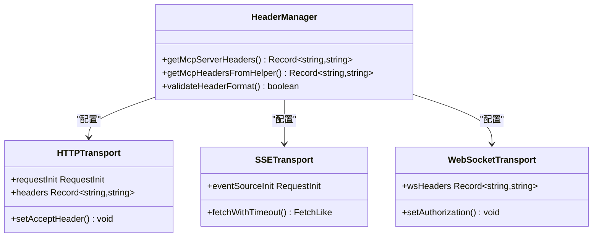
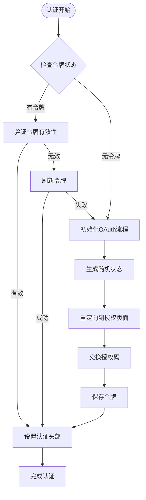
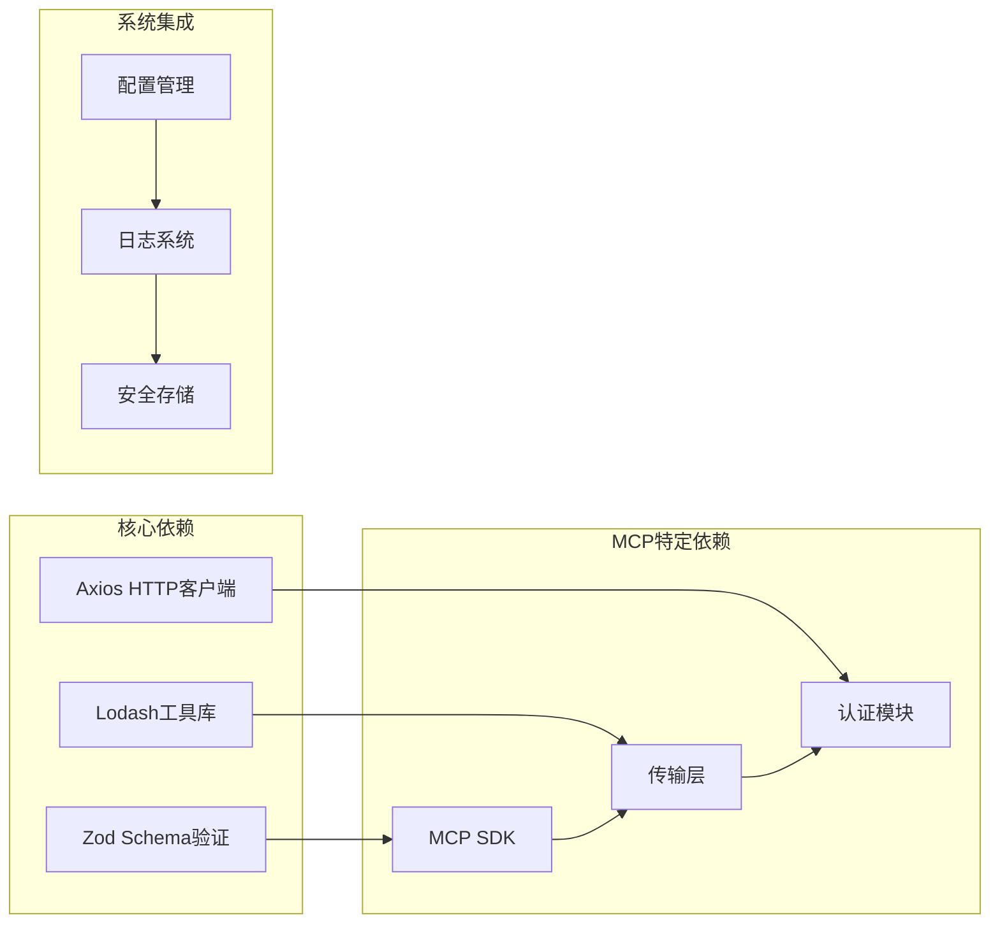

# 头部信息处理

<cite>
**本文档引用的文件**
- [headersHelper.ts](file://src/services/mcp/headersHelper.ts)
- [client.ts](file://src/services/mcp/client.ts)
- [auth.ts](file://src/services/mcp/auth.ts)
- [types.ts](file://src/services/mcp/types.ts)
- [config.ts](file://src/services/mcp/config.ts)
- [mockRateLimits.ts](file://src/services/mockRateLimits.ts)
- [client.ts](file://src/services/api/client.ts)
</cite>

## 目录
1. [简介](#简介)
2. [项目结构](#项目结构)
3. [核心组件](#核心组件)
4. [架构概览](#架构概览)
5. [详细组件分析](#详细组件分析)
6. [依赖关系分析](#依赖关系分析)
7. [性能考虑](#性能考虑)
8. [故障排除指南](#故障排除指南)
9. [结论](#结论)

## 简介

本文档深入解析MCP（Model Context Protocol）头部信息处理系统的技术实现。该系统负责HTTP头部的构建、验证和管理，确保MCP协议中头部信息的标准化处理和安全传输。系统支持静态头部配置、动态头部生成、认证头部维护以及安全保护机制。

## 项目结构

MCP头部信息处理系统主要分布在以下核心文件中：

**图表来源**
- [headersHelper.ts:1-138](file://src/services/mcp/headersHelper.ts#L1-L138)
- [client.ts:1-800](file://src/services/mcp/client.ts#L1-L800)
- [auth.ts:1-800](file://src/services/mcp/auth.ts#L1-L800)

**章节来源**
- [headersHelper.ts:1-138](file://src/services/mcp/headersHelper.ts#L1-L138)
- [client.ts:1-800](file://src/services/mcp/client.ts#L1-L800)
- [auth.ts:1-800](file://src/services/mcp/auth.ts#L1-L800)

## 核心组件

### 动态头部生成器

动态头部生成器是系统的核心组件，负责从外部脚本获取认证和上下文相关的头部信息。

**章节来源**
- [headersHelper.ts:32-116](file://src/services/mcp/headersHelper.ts#L32-L116)

### 客户端连接处理器

客户端连接处理器负责在建立MCP连接时正确设置和管理各种类型的头部信息。

**章节来源**
- [client.ts:619-865](file://src/services/mcp/client.ts#L619-L865)

### 认证头部管理器

认证头部管理器专门处理OAuth认证相关的头部信息，包括令牌管理和安全保护。

**章节来源**
- [auth.ts:1354-1374](file://src/services/mcp/auth.ts#L1354-L1374)

## 架构概览

MCP头部信息处理系统采用分层架构设计，确保头部信息的标准化处理和安全传输：

**图表来源**
- [headersHelper.ts:125-138](file://src/services/mcp/headersHelper.ts#L125-L138)
- [client.ts:801-840](file://src/services/mcp/client.ts#L801-L840)

## 详细组件分析

### 动态头部生成系统

动态头部生成系统通过外部脚本提供灵活的头部配置能力：

**图表来源**
- [headersHelper.ts:32-116](file://src/services/mcp/headersHelper.ts#L32-L116)

**章节来源**
- [headersHelper.ts:32-116](file://src/services/mcp/headersHelper.ts#L32-L116)

### 多传输类型头部处理

系统支持多种传输类型的头部处理，包括HTTP、SSE和WebSocket：

**图表来源**
- [client.ts:821-865](file://src/services/mcp/client.ts#L821-L865)
- [client.ts:619-783](file://src/services/mcp/client.ts#L619-L783)

**章节来源**
- [client.ts:821-865](file://src/services/mcp/client.ts#L821-L865)
- [client.ts:619-783](file://src/services/mcp/client.ts#L619-L783)

### 认证头部安全机制

认证头部管理系统实现了多层次的安全保护机制：

**图表来源**
- [auth.ts:1354-1374](file://src/services/mcp/auth.ts#L1354-L1374)
- [auth.ts:847-1342](file://src/services/mcp/auth.ts#L847-L1342)

**章节来源**
- [auth.ts:1354-1374](file://src/services/mcp/auth.ts#L1354-L1374)
- [auth.ts:847-1342](file://src/services/mcp/auth.ts#L847-L1342)

### 头部缓存和复用机制

系统实现了智能的头部缓存和复用机制以提高性能：

**章节来源**
- [client.ts:257-316](file://src/services/mcp/client.ts#L257-L316)

## 依赖关系分析

MCP头部处理系统的依赖关系体现了清晰的模块化设计：

**图表来源**
- [types.ts:1-259](file://src/services/mcp/types.ts#L1-L259)
- [client.ts:1-100](file://src/services/mcp/client.ts#L1-L100)

**章节来源**
- [types.ts:1-259](file://src/services/mcp/types.ts#L1-L259)
- [client.ts:1-100](file://src/services/mcp/client.ts#L1-L100)

## 性能考虑

系统在性能优化方面采用了多项策略：

### 头部缓存策略
- **认证缓存**: 15分钟TTL的认证状态缓存
- **连接缓存**: 基于服务器配置的连接缓存
- **请求缓存**: 避免重复的头部生成操作

### 并发处理
- **异步头部生成**: 使用Promise避免阻塞主线程
- **并发限制**: 控制同时进行的头部生成数量
- **错误隔离**: 单个头部生成失败不影响整体系统

### 内存管理
- **垃圾回收**: 及时清理不再使用的头部对象
- **字符串池化**: 重用常用的头部键名
- **流式处理**: 大量头部数据的流式处理

## 故障排除指南

### 常见问题诊断

**头部生成失败**
- 检查headersHelper脚本的可执行权限
- 验证脚本输出的JSON格式正确性
- 确认环境变量传递正确

**认证头部问题**
- 检查OAuth令牌的有效性和过期时间
- 验证授权服务器的元数据配置
- 确认回调URL和端口配置

**连接超时问题**
- 检查网络代理设置
- 验证服务器可达性
- 调整超时参数配置

**章节来源**
- [headersHelper.ts:104-116](file://src/services/mcp/headersHelper.ts#L104-L116)
- [auth.ts:1265-1341](file://src/services/mcp/auth.ts#L1265-L1341)

## 结论

MCP头部信息处理系统通过模块化设计和多层安全保护，为MCP协议提供了可靠的头部管理机制。系统支持静态和动态头部配置，实现了灵活的认证管理，并通过缓存和优化策略确保了良好的性能表现。该系统的设计充分考虑了安全性、可维护性和扩展性，为MCP生态系统的稳定运行提供了重要支撑。