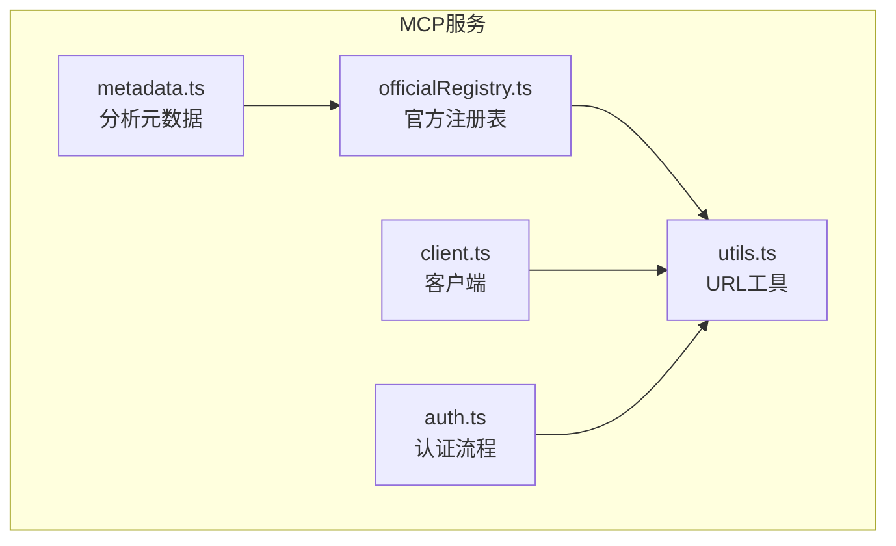
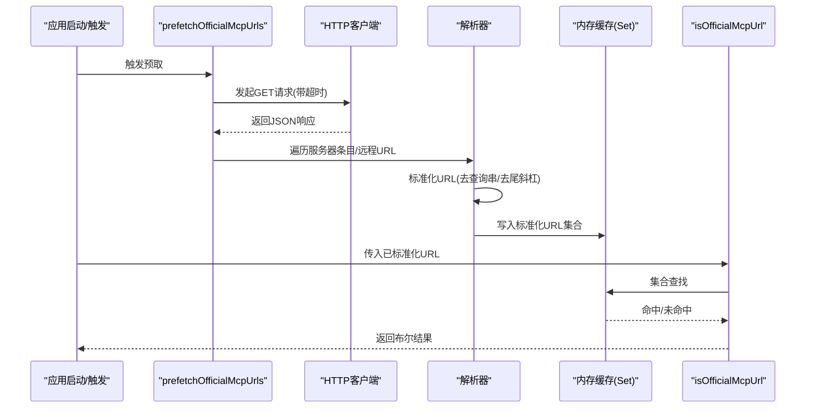
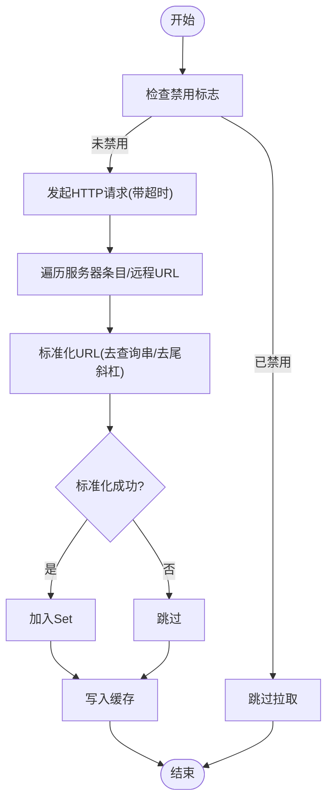
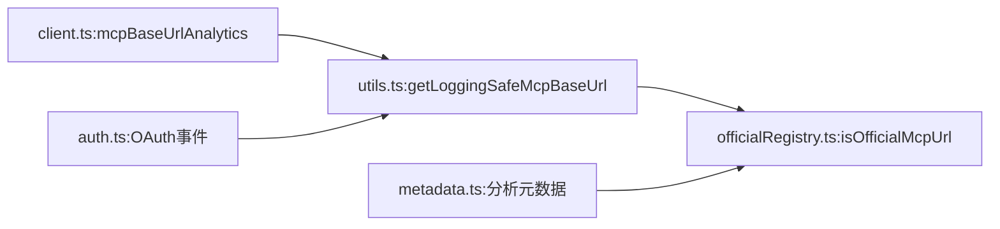

# 官方注册表

<cite>
**本文引用的文件**
- [officialRegistry.ts](file://src/services/mcp/officialRegistry.ts)
- [utils.ts](file://src/services/mcp/utils.ts)
- [client.ts](file://src/services/mcp/client.ts)
- [auth.ts](file://src/services/mcp/auth.ts)
- [metadata.ts](file://src/services/analytics/metadata.ts)
</cite>

## 目录
1. [简介](#简介)
2. [项目结构](#项目结构)
3. [核心组件](#核心组件)
4. [架构总览](#架构总览)
5. [详细组件分析](#详细组件分析)
6. [依赖关系分析](#依赖关系分析)
7. [性能考量](#性能考量)
8. [故障排查指南](#故障排查指南)
9. [结论](#结论)
10. [附录](#附录)

## 简介
本文件系统性阐述官方MCP注册表（MCP Official Registry）的技术设计与实现，覆盖以下关键主题：
- 官方注册表的获取、缓存与验证机制
- prefetchOfficialMcpUrls 函数的工作原理与异步加载策略
- isOfficialMcpUrl 函数的URL规范化与匹配算法
- 注册表数据结构设计与URL标准化处理
- 错误处理与降级策略
- 注册表更新机制与测试支持
- 官方URL验证的最佳实践与性能优化建议

该能力用于判定某个MCP服务器URL是否属于官方受信来源，从而在日志、权限与安全策略中进行差异化处理。

## 项目结构
官方注册表能力位于MCP服务子模块内，主要涉及三个文件：
- 官方注册表：负责拉取、解析与缓存官方URL集合
- URL工具：提供统一的URL标准化（去查询串、去尾斜杠等）
- 使用方：在认证、客户端连接与分析上报等环节调用官方URL判定

图表来源
- [officialRegistry.ts:1-73](file://src/services/mcp/officialRegistry.ts#L1-L73)
- [utils.ts:555-576](file://src/services/mcp/utils.ts#L555-L576)
- [client.ts:315-333](file://src/services/mcp/client.ts#L315-L333)
- [auth.ts:880-952](file://src/services/mcp/auth.ts#L880-L952)
- [metadata.ts:100-120](file://src/services/analytics/metadata.ts#L100-L120)

章节来源
- [officialRegistry.ts:1-73](file://src/services/mcp/officialRegistry.ts#L1-L73)
- [utils.ts:555-576](file://src/services/mcp/utils.ts#L555-L576)

## 核心组件
- 官方注册表模块（officialRegistry.ts）
  - 负责异步预取官方MCP服务器清单，解析并标准化URL，缓存到内存集合中，供快速判定
  - 提供 isOfficialMcpUrl 用于判定给定已标准化URL是否属于官方清单
  - 提供 resetOfficialMcpUrlsForTesting 用于测试重置
- URL标准化工具（utils.ts）
  - 提供 getLoggingSafeMcpBaseUrl，将MCP配置中的URL标准化为“无查询串、无尾斜杠”的基地址，便于与官方注册表缓存进行精确匹配
- 使用方（client.ts、auth.ts、metadata.ts）
  - 在认证、客户端连接与分析上报时，先对URL进行标准化，再调用 isOfficialMcpUrl 进行判定

章节来源
- [officialRegistry.ts:19-68](file://src/services/mcp/officialRegistry.ts#L19-L68)
- [utils.ts:561-575](file://src/services/mcp/utils.ts#L561-L575)
- [client.ts:323-333](file://src/services/mcp/client.ts#L323-L333)
- [auth.ts:883-951](file://src/services/mcp/auth.ts#L883-L951)
- [metadata.ts:100-120](file://src/services/analytics/metadata.ts#L100-L120)

## 架构总览
官方注册表的运行链路如下：
- 启动阶段或按需触发：prefetchOfficialMcpUrls 异步拉取官方清单
- 解析阶段：遍历返回的服务器条目，提取每个服务器的远程URL，进行URL标准化
- 缓存阶段：将标准化后的URL放入Set，作为后续判定的权威来源
- 判定阶段：isOfficialMcpUrl 接收已标准化的URL，直接进行集合查找
- 使用阶段：在认证、客户端连接与分析上报等路径中，先标准化URL，再进行官方判定

图表来源
- [officialRegistry.ts:33-68](file://src/services/mcp/officialRegistry.ts#L33-L68)
- [utils.ts:561-575](file://src/services/mcp/utils.ts#L561-L575)

## 详细组件分析

### 官方注册表模块（officialRegistry.ts）
- 数据结构
  - officialUrls：全局可选的Set，存储标准化后的官方URL
  - RegistryServer/RegistryResponse：类型定义，描述从官方接口返回的服务器清单结构
- 关键函数
  - normalizeUrl：将原始URL标准化（去除查询串、去除尾斜杠；失败则返回undefined）
  - prefetchOfficialMcpUrls：异步拉取官方清单，解析并写入缓存；支持通过环境变量禁用非必要流量
  - isOfficialMcpUrl：基于已标准化URL进行集合查找，未初始化时返回false（fail-closed）
  - resetOfficialMcpUrlsForTesting：测试重置缓存

图表来源
- [officialRegistry.ts:33-68](file://src/services/mcp/officialRegistry.ts#L33-L68)

章节来源
- [officialRegistry.ts:1-73](file://src/services/mcp/officialRegistry.ts#L1-L73)

### URL标准化工具（utils.ts）
- getLoggingSafeMcpBaseUrl
  - 输入：MCP服务器配置对象（含url字段）
  - 处理：解析URL、清空查询串、去除尾斜杠
  - 输出：标准化字符串或undefined（当输入无效或解析失败时）
- 设计要点
  - 统一的标准化规则确保与官方注册表缓存一致，避免因查询串或尾斜杠差异导致误判
  - 对于stdio/sdk等非HTTP类型的服务器，返回undefined，避免污染官方判定

章节来源
- [utils.ts:561-575](file://src/services/mcp/utils.ts#L561-L575)

### 使用方集成（client.ts、auth.ts、metadata.ts）
- 客户端连接与分析
  - mcpBaseUrlAnalytics：在连接事件中提取并标准化URL，用于分析字段
- 认证流程
  - 在OAuth流程开始与关键节点，记录包含标准化URL的分析事件，便于追踪官方服务器的授权行为
- 分析元数据
  - 在构建分析元数据时，对MCP服务器URL进行官方判定，决定是否标记为官方来源

章节来源
- [client.ts:323-333](file://src/services/mcp/client.ts#L323-L333)
- [auth.ts:883-951](file://src/services/mcp/auth.ts#L883-L951)
- [metadata.ts:100-120](file://src/services/analytics/metadata.ts#L100-L120)

## 依赖关系分析
- 模块耦合
  - officialRegistry.ts 依赖 axios 进行HTTP请求，依赖日志工具输出调试信息
  - 使用方（client.ts、auth.ts、metadata.ts）依赖 utils.ts 的URL标准化函数
- 关键依赖链
  - URL标准化 → 官方注册表缓存 → 判定结果
- 可能的循环依赖
  - 当前结构清晰，无明显循环导入；使用方仅单向依赖URL标准化工具

图表来源
- [officialRegistry.ts:66-68](file://src/services/mcp/officialRegistry.ts#L66-L68)
- [utils.ts:561-575](file://src/services/mcp/utils.ts#L561-L575)
- [client.ts:323-333](file://src/services/mcp/client.ts#L323-L333)
- [auth.ts:883-951](file://src/services/mcp/auth.ts#L883-L951)
- [metadata.ts:100-120](file://src/services/analytics/metadata.ts#L100-L120)

## 性能考量
- 异步预取与非阻塞
  - prefetchOfficialMcpUrls 采用fire-and-forget式异步拉取，避免阻塞主流程
  - 支持通过环境变量禁用非必要网络流量，降低资源消耗
- 缓存与查找
  - 使用Set进行O(1)平均时间复杂度的查找，适合高频判定场景
  - 标准化规则简单明确，减少解析成本
- 超时与容错
  - 请求设置超时，异常时仅记录调试日志，不影响主流程
- 并发与一致性
  - 判定时若缓存未初始化，默认返回false，保证线程安全与一致性

章节来源
- [officialRegistry.ts:33-68](file://src/services/mcp/officialRegistry.ts#L33-L68)

## 故障排查指南
- 症状：官方判定始终为false
  - 可能原因：缓存未初始化（首次启动或禁用网络）
  - 处理：确认是否调用了预取函数；检查环境变量是否禁用非必要流量
- 症状：URL标准化后仍无法匹配
  - 可能原因：URL格式不合法或非HTTP类型（返回undefined）
  - 处理：确认输入配置包含有效url字段；检查是否为stdio/sdk类型
- 症状：网络请求失败
  - 可能原因：网络超时、服务不可达、解析异常
  - 处理：查看调试日志中的错误信息；确认目标接口可达性
- 测试场景
  - 使用 resetOfficialMcpUrlsForTesting 清空缓存，重新注入期望数据进行断言

章节来源
- [officialRegistry.ts:33-68](file://src/services/mcp/officialRegistry.ts#L33-L68)
- [utils.ts:561-575](file://src/services/mcp/utils.ts#L561-L575)

## 结论
官方MCP注册表通过“异步预取 + 标准化缓存 + 快速判定”的设计，在保证安全性与性能的同时，提供了可靠的官方URL识别能力。其fail-closed策略与fail-safe的URL标准化，确保了在异常情况下不会误判为官方来源。配合分析与认证流程的集成，进一步提升了系统的可观测性与可控性。

## 附录

### API定义与行为
- prefetchOfficialMcpUrls
  - 功能：异步拉取官方MCP服务器清单，解析并缓存标准化URL
  - 参数：无
  - 返回：Promise<void>
  - 特性：支持禁用非必要流量；带超时；异常仅记录日志
- isOfficialMcpUrl(normalizedUrl: string)
  - 功能：判定已标准化URL是否属于官方清单
  - 参数：标准化后的URL字符串
  - 返回：boolean（未初始化时返回false）
- resetOfficialMcpUrlsForTesting()
  - 功能：测试重置缓存
  - 参数：无
  - 返回：void
- getLoggingSafeMcpBaseUrl(config)
  - 功能：将MCP配置中的URL标准化为“无查询串、无尾斜杠”的基地址
  - 参数：MCP服务器配置对象
  - 返回：string | undefined

章节来源
- [officialRegistry.ts:33-72](file://src/services/mcp/officialRegistry.ts#L33-L72)
- [utils.ts:561-575](file://src/services/mcp/utils.ts#L561-L575)