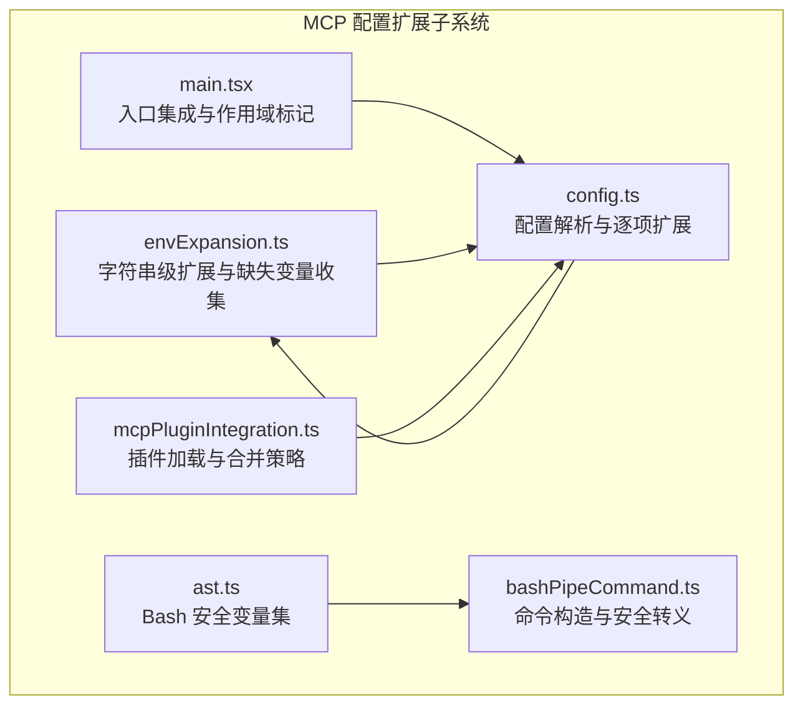
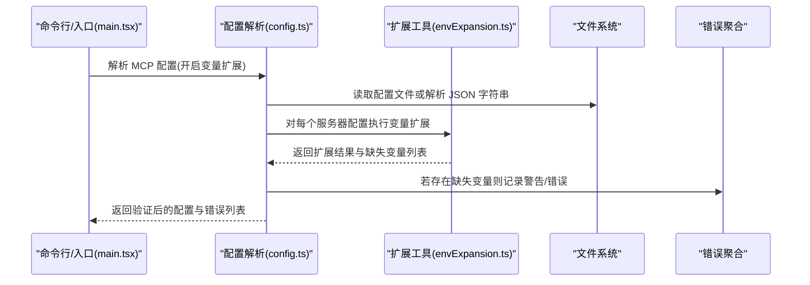
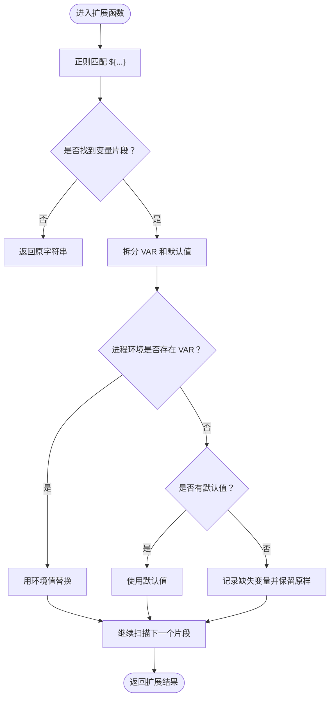
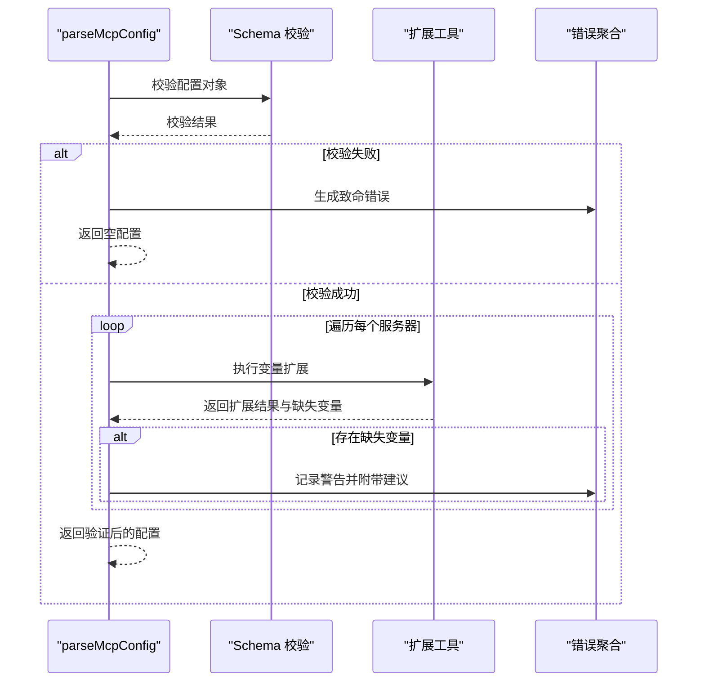
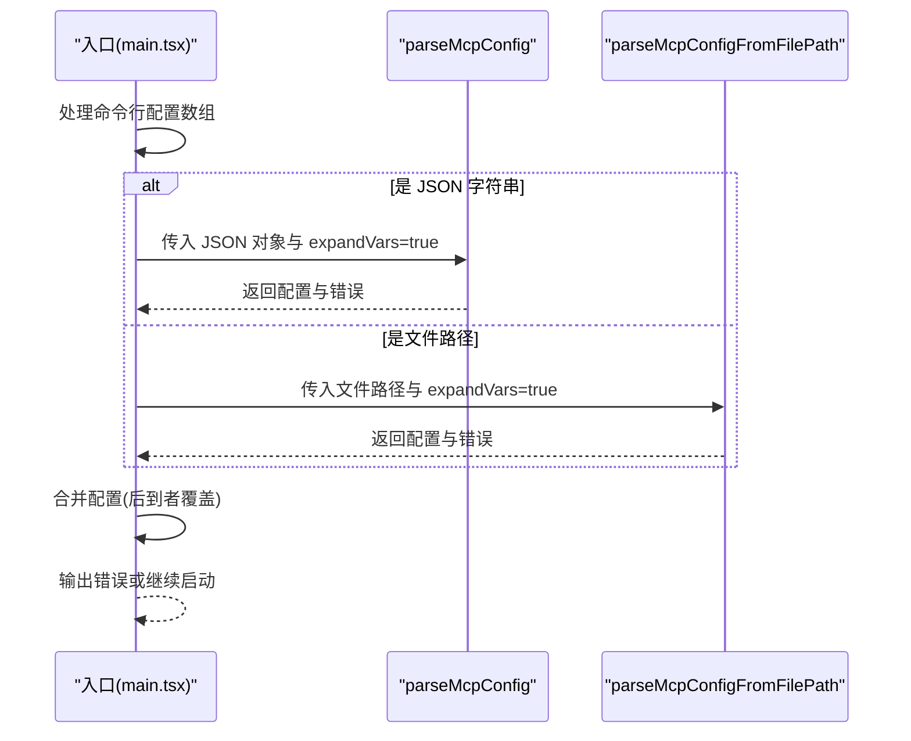
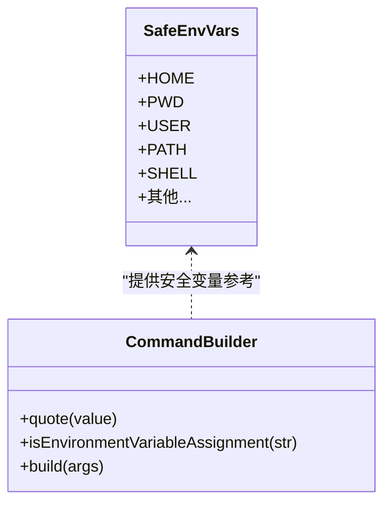
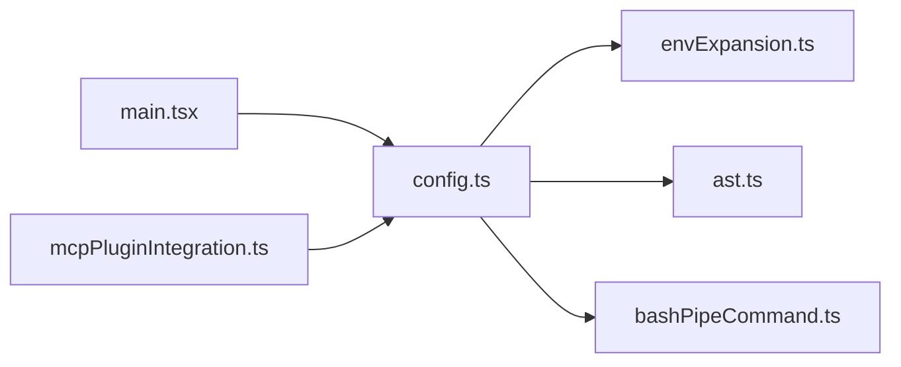

# 环境变量扩展

<cite>
**本文档引用的文件**
- [envExpansion.ts](file://src/services/mcp/envExpansion.ts)
- [config.ts](file://src/services/mcp/config.ts)
- [main.tsx](file://src/main.tsx)
- [ast.ts](file://src/utils/bash/ast.ts)
- [bashPipeCommand.ts](file://src/utils/bash/bashPipeCommand.ts)
- [mcpPluginIntegration.ts](file://src/utils/plugins/mcpPluginIntegration.ts)
</cite>

## 目录
1. [简介](#简介)
2. [项目结构](#项目结构)
3. [核心组件](#核心组件)
4. [架构总览](#架构总览)
5. [详细组件分析](#详细组件分析)
6. [依赖关系分析](#依赖关系分析)
7. [性能考量](#性能考量)
8. [故障排查指南](#故障排查指南)
9. [结论](#结论)
10. [附录](#附录)

## 简介
本文件系统性阐述 MCP（Model Context Protocol）环境变量扩展系统的设计与实现，重点覆盖以下方面：
- 环境变量解析、扩展与替换机制
- 在 MCP 配置中的作用与应用场景
- 变量引用语法与默认值处理
- 安全检查与潜在注入风险控制
- 变量覆盖与作用域管理
- 最佳实践与常见问题解决方案

该系统通过统一的环境变量扩展工具，为 MCP 服务器配置提供可移植、可维护的参数化能力，并在解析阶段进行缺失变量检测与错误提示，确保配置在不同运行环境中的一致性。

## 项目结构
围绕 MCP 环境变量扩展的关键文件分布如下：
- 扩展工具：envExpansion.ts 提供字符串级别的环境变量扩展与缺失变量收集
- 配置解析：config.ts 负责 MCP 配置对象的校验、逐项扩展与错误聚合
- 入口集成：main.tsx 将命令行或文件路径形式的 MCP 配置传入解析流程，并开启变量扩展
- 安全基线：ast.ts 与 bashPipeCommand.ts 提供 Bash 环境变量安全集合与命令构造的安全处理，作为扩展系统的安全参考
- 插件集成：mcpPluginIntegration.ts 展示了从插件加载 MCP 服务器配置时对文件路径与内联配置的处理方式

图表来源
- [envExpansion.ts:1-39](file://src/services/mcp/envExpansion.ts#L1-L39)
- [config.ts:1297-1377](file://src/services/mcp/config.ts#L1297-L1377)
- [main.tsx:1413-1464](file://src/main.tsx#L1413-L1464)
- [ast.ts:117-1958](file://src/utils/bash/ast.ts#L117-L1958)
- [bashPipeCommand.ts:181-221](file://src/utils/bash/bashPipeCommand.ts#L181-L221)
- [mcpPluginIntegration.ts:150-189](file://src/utils/plugins/mcpPluginIntegration.ts#L150-L189)

章节来源
- [envExpansion.ts:1-39](file://src/services/mcp/envExpansion.ts#L1-L39)
- [config.ts:1297-1377](file://src/services/mcp/config.ts#L1297-L1377)
- [main.tsx:1413-1464](file://src/main.tsx#L1413-L1464)
- [ast.ts:117-1958](file://src/utils/bash/ast.ts#L117-L1958)
- [bashPipeCommand.ts:181-221](file://src/utils/bash/bashPipeCommand.ts#L181-L221)
- [mcpPluginIntegration.ts:150-189](file://src/utils/plugins/mcpPluginIntegration.ts#L150-L189)

## 核心组件
- 环境变量扩展函数：支持 ${VAR} 与 ${VAR:-default} 语法，返回扩展后的字符串及缺失变量列表
- 配置解析器：对 MCP 配置对象进行 Schema 校验，按需执行变量扩展，并收集错误信息
- 入口集成：在命令行或文件路径解析场景中启用变量扩展，并以作用域区分动态配置
- 安全基线：定义 Bash 安全变量集与命令构造的安全策略，为扩展系统的安全边界提供参考
- 插件集成：展示如何从插件加载 MCP 服务器配置，以及合并顺序与覆盖规则

章节来源
- [envExpansion.ts:10-38](file://src/services/mcp/envExpansion.ts#L10-L38)
- [config.ts:1297-1377](file://src/services/mcp/config.ts#L1297-L1377)
- [main.tsx:1413-1464](file://src/main.tsx#L1413-L1464)
- [ast.ts:117-1958](file://src/utils/bash/ast.ts#L117-L1958)
- [bashPipeCommand.ts:181-221](file://src/utils/bash/bashPipeCommand.ts#L181-L221)
- [mcpPluginIntegration.ts:150-189](file://src/utils/plugins/mcpPluginIntegration.ts#L150-L189)

## 架构总览
下图展示了 MCP 环境变量扩展在整体流程中的位置与交互：

图表来源
- [main.tsx:1413-1464](file://src/main.tsx#L1413-L1464)
- [config.ts:1297-1377](file://src/services/mcp/config.ts#L1297-L1377)
- [envExpansion.ts:10-38](file://src/services/mcp/envExpansion.ts#L10-L38)

## 详细组件分析

### 组件一：环境变量扩展工具（envExpansion.ts）
- 功能定位：提供字符串级别的环境变量扩展，支持默认值语法
- 关键行为
  - 匹配 ${VAR} 与 ${VAR:-default} 形式
  - 优先使用进程环境变量；若不存在且提供默认值，则使用默认值
  - 若既无环境变量也无默认值，记录变量名并保留原样（便于调试与错误上报）
- 复杂度与性能
  - 时间复杂度：O(n)，其中 n 为输入字符串长度
  - 空间复杂度：O(k)，k 为匹配到的变量数量（用于收集缺失变量）
- 错误处理
  - 缺失变量被收集到列表中，供上层解析器统一处理
  - 原始未解析片段保持不变，避免破坏可诊断性

图表来源
- [envExpansion.ts:10-38](file://src/services/mcp/envExpansion.ts#L10-L38)

章节来源
- [envExpansion.ts:10-38](file://src/services/mcp/envExpansion.ts#L10-L38)

### 组件二：MCP 配置解析与扩展（config.ts）
- 功能定位：对 MCP 配置对象进行 Schema 校验，并在需要时对每个服务器配置执行变量扩展
- 关键行为
  - 使用 Schema 校验配置结构，失败时生成结构化错误
  - 遍历每个服务器配置，调用扩展工具进行变量替换
  - 收集缺失变量并生成带有建议的警告/错误信息
  - 对 Windows 平台上的 npx 使用给出兼容性提示
- 错误处理
  - 文件读取失败、JSON 解析失败等均转换为结构化错误
  - 缺失变量错误包含服务器名称、变量列表与修复建议
- 作用域与覆盖
  - 通过 scope 参数区分不同来源（如 dynamic、enterprise 等）
  - 合并策略遵循“后到者覆盖”的原则（由入口层体现）

图表来源
- [config.ts:1297-1377](file://src/services/mcp/config.ts#L1297-L1377)

章节来源
- [config.ts:1297-1377](file://src/services/mcp/config.ts#L1297-L1377)

### 组件三：入口集成与作用域（main.tsx）
- 功能定位：接收命令行传入的 MCP 配置（JSON 字符串或文件路径），统一解析并开启变量扩展
- 关键行为
  - 支持多条配置的合并，后到者覆盖先前配置
  - 对 JSON 字符串与文件路径分别处理
  - 为动态配置指定 scope 为 'dynamic'，并在错误时输出格式化的错误信息
- 作用域管理
  - scope 用于标识配置来源，便于后续策略与权限控制

图表来源
- [main.tsx:1413-1464](file://src/main.tsx#L1413-L1464)

章节来源
- [main.tsx:1413-1464](file://src/main.tsx#L1413-L1464)

### 组件四：安全基线与注入防护（ast.ts 与 bashPipeCommand.ts）
- 安全变量集：ast.ts 定义一组 Bash 自动设置的安全变量集合，这些变量值受系统/Shell 控制，不包含任意用户输入，因此在安全上下文中可直接引用
- 命令构造安全：bashPipeCommand.ts 对环境变量赋值进行转义处理，避免空格与特殊字符导致的注入风险；同时对通配符等操作符进行特殊处理
- 与扩展系统的关系：这些安全基线为 MCP 扩展系统提供了参考，确保在执行外部命令或脚本时，仅使用已知安全的变量或经过严格转义的值

图表来源
- [ast.ts:117-1958](file://src/utils/bash/ast.ts#L117-L1958)
- [bashPipeCommand.ts:181-221](file://src/utils/bash/bashPipeCommand.ts#L181-L221)

章节来源
- [ast.ts:117-1958](file://src/utils/bash/ast.ts#L117-L1958)
- [bashPipeCommand.ts:181-221](file://src/utils/bash/bashPipeCommand.ts#L181-L221)

### 组件五：插件集成与合并策略（mcpPluginIntegration.ts）
- 加载策略：支持从插件加载 MCP 服务器配置，包括 MCPB 文件与 JSON 文件路径
- 合并顺序：并行加载多个源，然后按照原始顺序合并，确保“最后胜出”的覆盖语义
- 与扩展系统协作：插件加载的配置同样会经过统一的解析与扩展流程

章节来源
- [mcpPluginIntegration.ts:150-189](file://src/utils/plugins/mcpPluginIntegration.ts#L150-L189)

## 依赖关系分析
- 模块耦合
  - config.ts 依赖 envExpansion.ts 进行字符串级扩展
  - main.tsx 依赖 config.ts 完成配置解析与错误处理
  - ast.ts 与 bashPipeCommand.ts 为扩展系统的安全边界提供参考
  - mcpPluginIntegration.ts 通过统一接口参与配置加载与合并
- 外部依赖
  - Node.js 进程环境变量 process.env
  - 文件系统读写与 JSON 解析
- 循环依赖
  - 当前模块间无明显循环依赖；扩展工具为纯函数，解析器单向依赖扩展工具

图表来源
- [main.tsx:1413-1464](file://src/main.tsx#L1413-L1464)
- [config.ts:1297-1377](file://src/services/mcp/config.ts#L1297-L1377)
- [envExpansion.ts:10-38](file://src/services/mcp/envExpansion.ts#L10-L38)
- [ast.ts:117-1958](file://src/utils/bash/ast.ts#L117-L1958)
- [bashPipeCommand.ts:181-221](file://src/utils/bash/bashPipeCommand.ts#L181-L221)
- [mcpPluginIntegration.ts:150-189](file://src/utils/plugins/mcpPluginIntegration.ts#L150-L189)

## 性能考量
- 字符串扩展成本低：正则替换 O(n)，适合在配置解析阶段进行
- 缺失变量收集：仅在未命中环境变量且无默认值时产生开销，通常较少
- 文件读取与 JSON 解析：I/O 成本为主，建议缓存与复用已解析配置
- 并发加载：插件加载采用 Promise.all 并行处理，缩短总等待时间

## 故障排查指南
- 缺失环境变量
  - 现象：解析阶段报告缺失变量并给出建议
  - 排查：确认变量是否在当前进程环境中设置，或在配置中提供默认值
  - 参考：config.ts 中对缺失变量的错误聚合与建议字段
- Windows 平台 npx 兼容性
  - 现象：提示需要 cmd /c 包装
  - 排查：将命令改为 "cmd" 并添加 "/c" 作为参数
  - 参考：config.ts 中针对 Windows 的 npx 使用警告
- 文件读取与 JSON 语法错误
  - 现象：文件不存在或 JSON 不合法
  - 排查：检查路径正确性、文件权限与 JSON 语法
  - 参考：config.ts 中对文件读取与 JSON 解析失败的错误处理
- 变量覆盖与合并顺序
  - 现象：后到配置覆盖先前配置
  - 排查：确认命令行参数与文件加载顺序，合理组织配置来源
  - 参考：main.tsx 中的合并逻辑

章节来源
- [config.ts:1330-1377](file://src/services/mcp/config.ts#L1330-L1377)
- [config.ts:1350-1369](file://src/services/mcp/config.ts#L1350-L1369)
- [config.ts:1395-1467](file://src/services/mcp/config.ts#L1395-L1467)
- [main.tsx:1413-1464](file://src/main.tsx#L1413-L1464)

## 结论
MCP 环境变量扩展系统通过“字符串级扩展 + 配置级校验”的双层设计，在保证灵活性的同时兼顾安全性与可观测性。其默认值语法与缺失变量检测机制，使得配置在不同环境下具备更强的可移植性；而作用域与合并策略则为多源配置提供了清晰的覆盖规则。配合安全基线与命令构造转义策略，系统在执行层面也具备良好的抗注入能力。

## 附录

### 变量引用语法与默认值
- 语法：${VAR} 与 ${VAR:-default}
- 行为：优先使用进程环境变量；若不存在且提供默认值，则使用默认值；否则记录缺失变量并保留原样

章节来源
- [envExpansion.ts:16-31](file://src/services/mcp/envExpansion.ts#L16-L31)

### 安全检查与注入防护要点
- 已知安全变量集：来源于 Bash 自动设置的变量，值可控
- 命令构造转义：对环境变量赋值进行转义，避免空格与特殊字符引发注入
- 仅在字符串内允许某些变量：在裸参数位置禁止未知变量，防止路径或标志被隐藏

章节来源
- [ast.ts:117-1958](file://src/utils/bash/ast.ts#L117-L1958)
- [bashPipeCommand.ts:181-221](file://src/utils/bash/bashPipeCommand.ts#L181-L221)

### 优先级与作用域管理
- 优先级：后到者覆盖（由入口层合并逻辑决定）
- 作用域：通过 scope 标记配置来源（如 dynamic、enterprise 等），便于后续策略控制

章节来源
- [main.tsx:1455-1460](file://src/main.tsx#L1455-L1460)
- [config.ts:69-81](file://src/services/mcp/config.ts#L69-L81)

### 最佳实践
- 为关键变量提供默认值，减少运行时缺失变量的风险
- 在 CI/CD 环境中集中管理环境变量，避免本地差异
- 对外部命令与脚本使用已知安全变量或严格转义
- 合理组织配置来源与合并顺序，明确覆盖规则
- 使用作用域区分不同来源，便于审计与策略控制