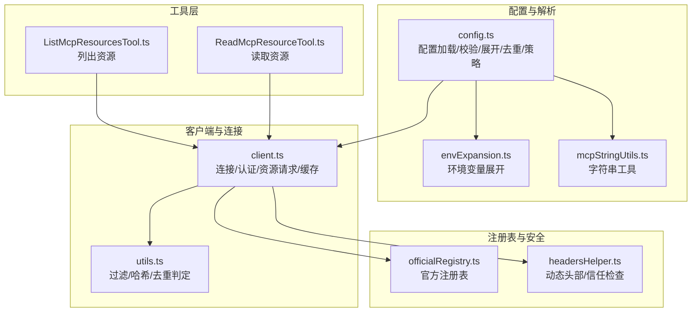
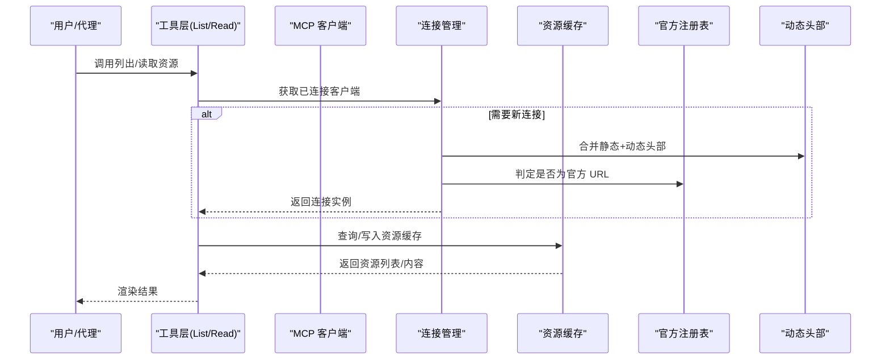
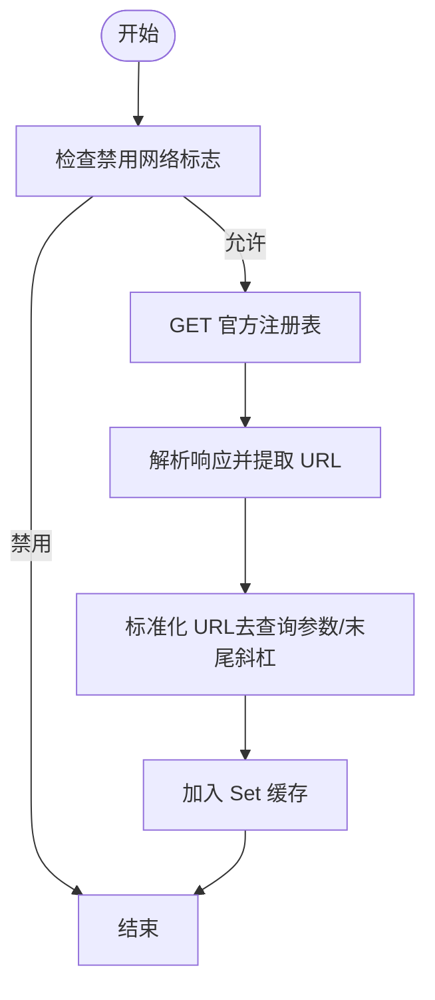
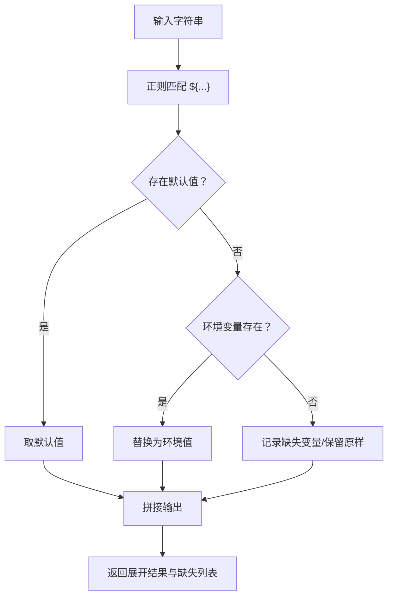
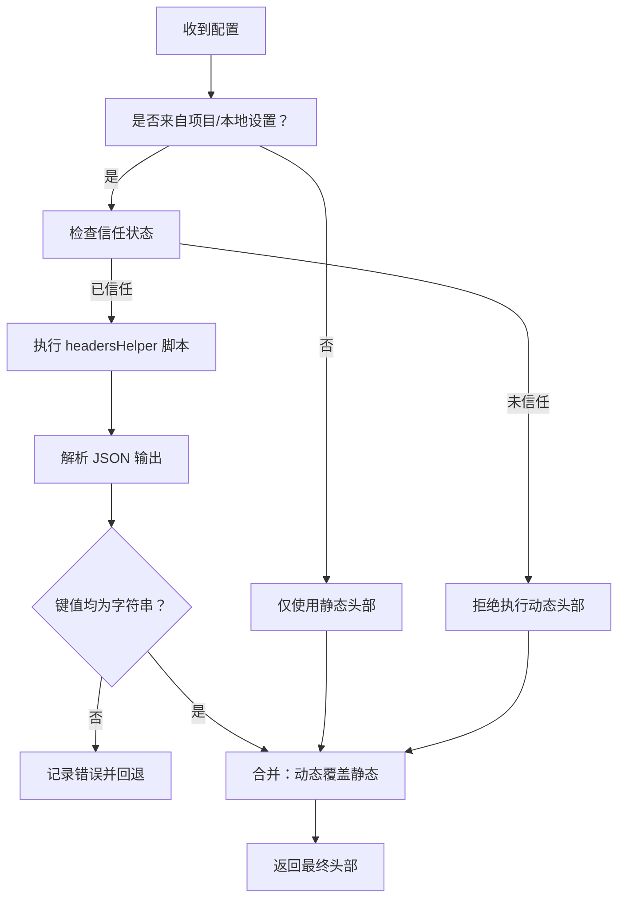
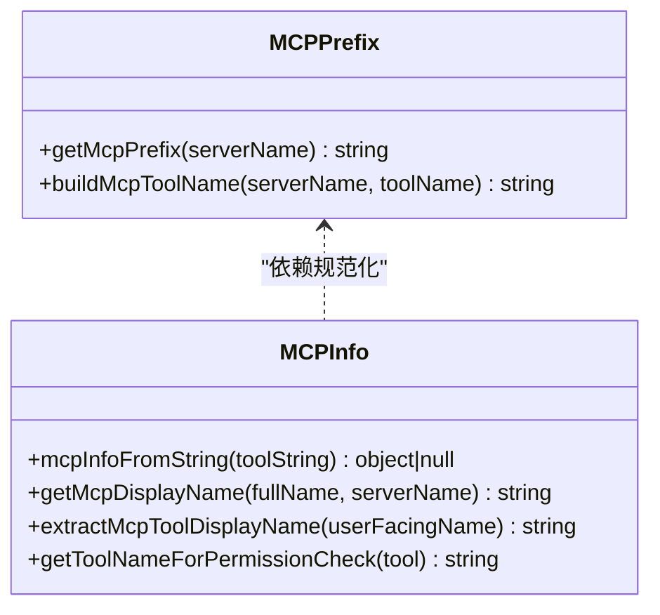
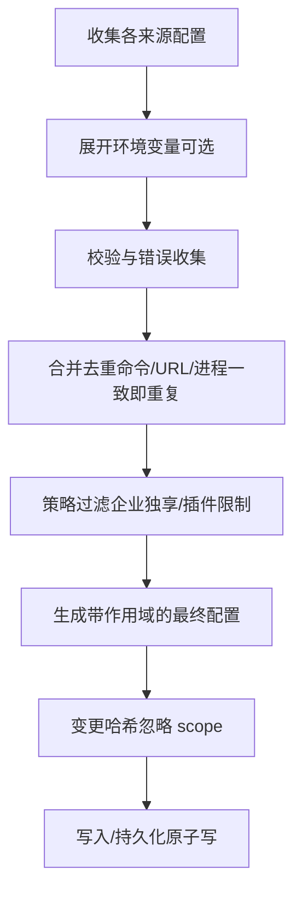
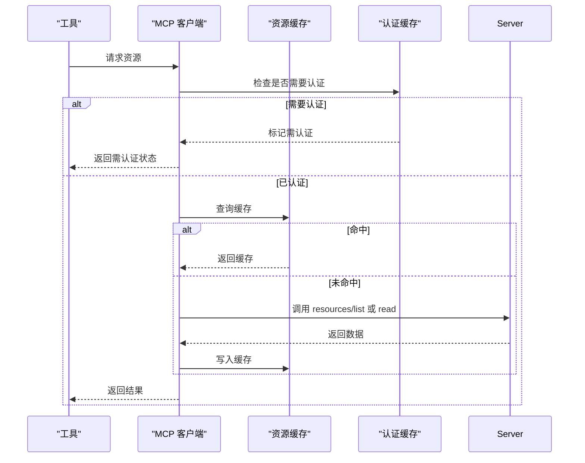
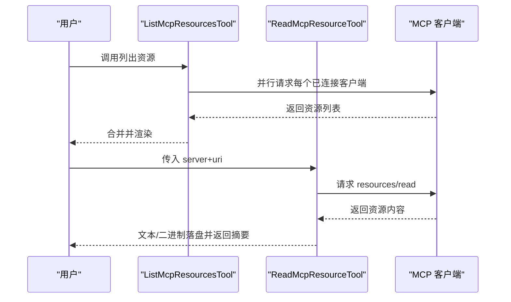
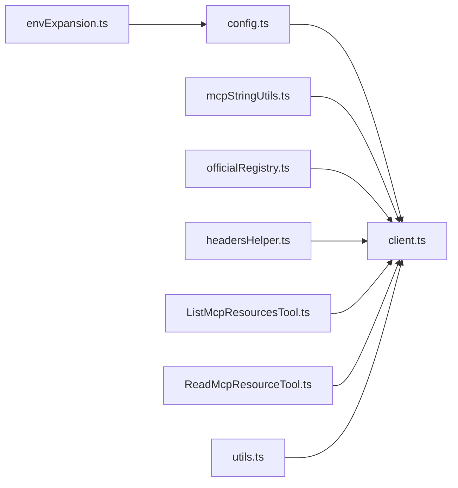

# 资源管理

<cite>
**本文引用的文件**
- [officialRegistry.ts](file://src/services/mcp/officialRegistry.ts)
- [envExpansion.ts](file://src/services/mcp/envExpansion.ts)
- [headersHelper.ts](file://src/services/mcp/headersHelper.ts)
- [mcpStringUtils.ts](file://src/services/mcp/mcpStringUtils.ts)
- [config.ts](file://src/services/mcp/config.ts)
- [client.ts](file://src/services/mcp/client.ts)
- [utils.ts](file://src/services/mcp/utils.ts)
- [ListMcpResourcesTool.ts](file://src/tools/ListMcpResourcesTool/ListMcpResourcesTool.ts)
- [ReadMcpResourceTool.ts](file://src/tools/ReadMcpResourceTool/ReadMcpResourceTool.ts)
</cite>

## 目录
1. [简介](#简介)
2. [项目结构](#项目结构)
3. [核心组件](#核心组件)
4. [架构总览](#架构总览)
5. [详细组件分析](#详细组件分析)
6. [依赖关系分析](#依赖关系分析)
7. [性能考量](#性能考量)
8. [故障排查指南](#故障排查指南)
9. [结论](#结论)
10. [附录](#附录)

## 简介
本文件系统性阐述 MCP（Model Context Protocol）资源管理机制，覆盖资源发现、注册与管理流程；官方注册表的实现与使用；环境变量扩展与头部信息处理；MCP 字符串工具的功能与场景；资源缓存与优化策略；配置管理与动态更新；以及最佳实践与性能优化建议。目标是帮助开发者在不直接阅读源码的情况下，也能高效理解并正确使用该体系。

## 项目结构
围绕 MCP 资源管理的关键模块分布如下：
- 配置与解析：负责从多来源加载、校验与展开 MCP 配置（含环境变量），并进行去重与策略过滤。
- 客户端与连接：封装与远端 MCP 服务器的连接、认证、资源拉取与缓存失效。
- 工具层：提供列出资源与读取资源的工具，作为用户或代理调用入口。
- 注册表与工具函数：维护官方服务器注册表、字符串解析与显示名提取等辅助能力。
- 头部信息与安全：支持静态与动态头部合并，并在项目/本地设置下执行信任检查。

图表来源
- [config.ts:1071-1200](file://src/services/mcp/config.ts#L1071-L1200)
- [client.ts:1-200](file://src/services/mcp/client.ts#L1-L200)
- [utils.ts:151-200](file://src/services/mcp/utils.ts#L151-L200)
- [ListMcpResourcesTool.ts:66-101](file://src/tools/ListMcpResourcesTool/ListMcpResourcesTool.ts#L66-L101)
- [ReadMcpResourceTool.ts:75-101](file://src/tools/ReadMcpResourceTool/ReadMcpResourceTool.ts#L75-L101)
- [officialRegistry.ts:33-68](file://src/services/mcp/officialRegistry.ts#L33-L68)
- [headersHelper.ts:32-138](file://src/services/mcp/headersHelper.ts#L32-L138)

章节来源
- [config.ts:1071-1200](file://src/services/mcp/config.ts#L1071-L1200)
- [client.ts:1-200](file://src/services/mcp/client.ts#L1-L200)
- [utils.ts:151-200](file://src/services/mcp/utils.ts#L151-L200)
- [ListMcpResourcesTool.ts:66-101](file://src/tools/ListMcpResourcesTool/ListMcpResourcesTool.ts#L66-L101)
- [ReadMcpResourceTool.ts:75-101](file://src/tools/ReadMcpResourceTool/ReadMcpResourceTool.ts#L75-L101)
- [officialRegistry.ts:33-68](file://src/services/mcp/officialRegistry.ts#L33-L68)
- [headersHelper.ts:32-138](file://src/services/mcp/headersHelper.ts#L32-L138)

## 核心组件
- 官方注册表：异步预取并缓存官方 MCP 服务器 URL，提供“是否为官方 URL”的判定。
- 环境变量扩展：对字符串中的 ${VAR} 与 ${VAR:-default} 进行展开，返回缺失变量列表，便于错误报告。
- 动态头部与静态头部：支持通过外部脚本生成动态头部，合并时动态覆盖静态；在项目/本地设置中执行信任检查。
- MCP 字符串工具：解析/构建 MCP 命名、显示名提取、权限匹配名称生成等。
- 配置管理：多来源合并（企业/用户/项目/本地/插件/动态），去重与策略过滤，配置变更检测与热重载。
- 客户端与缓存：连接生命周期管理、认证失败处理、资源请求与 LRU 缓存、会话过期检测与恢复。
- 工具接口：列出资源与读取资源，自动复用已连接客户端，失败隔离，结果截断检测与 UI 映射。

章节来源
- [officialRegistry.ts:33-68](file://src/services/mcp/officialRegistry.ts#L33-L68)
- [envExpansion.ts:10-38](file://src/services/mcp/envExpansion.ts#L10-L38)
- [headersHelper.ts:32-138](file://src/services/mcp/headersHelper.ts#L32-L138)
- [mcpStringUtils.ts:19-106](file://src/services/mcp/mcpStringUtils.ts#L19-L106)
- [config.ts:1071-1200](file://src/services/mcp/config.ts#L1071-L1200)
- [client.ts:257-316](file://src/services/mcp/client.ts#L257-L316)
- [ListMcpResourcesTool.ts:66-101](file://src/tools/ListMcpResourcesTool/ListMcpResourcesTool.ts#L66-L101)
- [ReadMcpResourceTool.ts:75-101](file://src/tools/ReadMcpResourceTool/ReadMcpResourceTool.ts#L75-L101)

## 架构总览
MCP 资源管理以“配置—连接—工具”为主线，结合“注册表—头部—字符串工具”提供安全与可用性保障。

图表来源
- [ListMcpResourcesTool.ts:66-101](file://src/tools/ListMcpResourcesTool/ListMcpResourcesTool.ts#L66-L101)
- [ReadMcpResourceTool.ts:75-101](file://src/tools/ReadMcpResourceTool/ReadMcpResourceTool.ts#L75-L101)
- [client.ts:257-316](file://src/services/mcp/client.ts#L257-L316)
- [officialRegistry.ts:33-68](file://src/services/mcp/officialRegistry.ts#L33-L68)
- [headersHelper.ts:125-138](file://src/services/mcp/headersHelper.ts#L125-L138)

## 详细组件分析

### 官方注册表（officialRegistry）
- 异步预取：在允许网络访问的前提下，从官方 API 拉取服务器清单，标准化 URL 并去重存储。
- 快速判定：基于 Set 的 O(1) 查找，判断给定 URL 是否属于官方集合。
- 测试友好：提供重置函数以便单元测试隔离。

图表来源
- [officialRegistry.ts:33-68](file://src/services/mcp/officialRegistry.ts#L33-L68)

章节来源
- [officialRegistry.ts:33-68](file://src/services/mcp/officialRegistry.ts#L33-L68)

### 环境变量扩展（envExpansion）
- 支持语法：${VAR} 与 ${VAR:-default}，未找到变量时记录缺失变量名。
- 返回值：展开后的字符串与缺失变量数组，便于上层错误聚合与提示。

图表来源
- [envExpansion.ts:10-38](file://src/services/mcp/envExpansion.ts#L10-L38)

章节来源
- [envExpansion.ts:10-38](file://src/services/mcp/envExpansion.ts#L10-L38)

### 动态头部与静态头部（headersHelper）
- 安全前置：当配置来自项目/本地设置且非交互式会话时，先检查信任状态，否则拒绝执行动态头部脚本。
- 执行与校验：通过外部脚本执行，要求返回 JSON 对象且键值均为字符串；失败时记录错误并回退为空。
- 合并策略：动态头部覆盖同名静态头部，保证灵活性与可控性。

图表来源
- [headersHelper.ts:32-138](file://src/services/mcp/headersHelper.ts#L32-L138)

章节来源
- [headersHelper.ts:32-138](file://src/services/mcp/headersHelper.ts#L32-L138)

### MCP 字符串工具（mcpStringUtils）
- 解析命名：从工具名中提取服务器与工具名，支持双下划线转义与显示名剥离。
- 命名规范：生成前缀与完全限定名，确保权限匹配使用完全限定名避免歧义。
- 显示名处理：从用户可见名中去除服务器前缀与“(MCP)”后缀，提取纯展示名。

图表来源
- [mcpStringUtils.ts:19-106](file://src/services/mcp/mcpStringUtils.ts#L19-L106)

章节来源
- [mcpStringUtils.ts:19-106](file://src/services/mcp/mcpStringUtils.ts#L19-L106)

### 配置管理与动态更新（config）
- 多源合并：企业/用户/项目/本地/插件/动态配置按优先级与策略合并，支持去重与策略过滤。
- 变更检测：对配置对象进行稳定化序列化与哈希，用于插件重载时识别变更并触发断开/重建。
- 错误聚合：对各来源的配置错误进行分类与上报，避免因单点错误阻断整体加载。

图表来源
- [config.ts:1071-1200](file://src/services/mcp/config.ts#L1071-L1200)

章节来源
- [config.ts:1071-1200](file://src/services/mcp/config.ts#L1071-L1200)

### 客户端与资源缓存（client）
- 认证缓存：对需要认证的服务器建立短期缓存，批量并发时串行写入，避免竞态。
- 会话过期：识别“会话不存在”错误，触发重新获取连接并重试。
- 资源缓存：对资源列表采用 LRU 缓存，连接关闭或收到资源变更通知时失效，保证一致性。
- 工具超时：支持通过环境变量自定义工具调用超时时间。

图表来源
- [client.ts:257-316](file://src/services/mcp/client.ts#L257-L316)
- [client.ts:193-206](file://src/services/mcp/client.ts#L193-L206)

章节来源
- [client.ts:257-316](file://src/services/mcp/client.ts#L257-L316)
- [client.ts:193-206](file://src/services/mcp/client.ts#L193-L206)

### 工具：列出与读取资源（ListMcpResourcesTool / ReadMcpResourceTool）
- 列出资源：对目标或全部已连接客户端并行发起请求，失败隔离，结果扁平化。
- 读取资源：按 URI 请求资源，拦截二进制字段并落盘，返回路径与文本摘要，支持截断检测。
- 名称与权限：工具名称与权限匹配使用完全限定名，避免内置工具名冲突。

图表来源
- [ListMcpResourcesTool.ts:66-101](file://src/tools/ListMcpResourcesTool/ListMcpResourcesTool.ts#L66-L101)
- [ReadMcpResourceTool.ts:75-101](file://src/tools/ReadMcpResourceTool/ReadMcpResourceTool.ts#L75-L101)

章节来源
- [ListMcpResourcesTool.ts:66-101](file://src/tools/ListMcpResourcesTool/ListMcpResourcesTool.ts#L66-L101)
- [ReadMcpResourceTool.ts:75-101](file://src/tools/ReadMcpResourceTool/ReadMcpResourceTool.ts#L75-L101)

## 依赖关系分析
- 组件内聚与耦合
  - 配置模块与客户端模块高内聚，通过类型与工具函数解耦。
  - 工具层仅依赖客户端与工具函数，不直接接触配置细节。
  - 注册表与头部模块独立性强，分别服务于安全与可用性。
- 关键依赖链
  - 配置 → 客户端：配置决定连接参数与去重策略。
  - 客户端 → 缓存：缓存提升性能并降低远端压力。
  - 工具 → 客户端：工具通过客户端暴露统一资源访问接口。
  - 注册表/头部 → 客户端：影响连接建立与认证策略。

图表来源
- [config.ts:1071-1200](file://src/services/mcp/config.ts#L1071-L1200)
- [client.ts:1-200](file://src/services/mcp/client.ts#L1-L200)
- [utils.ts:151-200](file://src/services/mcp/utils.ts#L151-L200)
- [ListMcpResourcesTool.ts:66-101](file://src/tools/ListMcpResourcesTool/ListMcpResourcesTool.ts#L66-L101)
- [ReadMcpResourceTool.ts:75-101](file://src/tools/ReadMcpResourceTool/ReadMcpResourceTool.ts#L75-L101)
- [officialRegistry.ts:33-68](file://src/services/mcp/officialRegistry.ts#L33-L68)
- [headersHelper.ts:32-138](file://src/services/mcp/headersHelper.ts#L32-L138)
- [envExpansion.ts:10-38](file://src/services/mcp/envExpansion.ts#L10-L38)
- [mcpStringUtils.ts:19-106](file://src/services/mcp/mcpStringUtils.ts#L19-L106)

章节来源
- [config.ts:1071-1200](file://src/services/mcp/config.ts#L1071-L1200)
- [client.ts:1-200](file://src/services/mcp/client.ts#L1-L200)
- [utils.ts:151-200](file://src/services/mcp/utils.ts#L151-L200)
- [ListMcpResourcesTool.ts:66-101](file://src/tools/ListMcpResourcesTool/ListMcpResourcesTool.ts#L66-L101)
- [ReadMcpResourceTool.ts:75-101](file://src/tools/ReadMcpResourceTool/ReadMcpResourceTool.ts#L75-L101)
- [officialRegistry.ts:33-68](file://src/services/mcp/officialRegistry.ts#L33-L68)
- [headersHelper.ts:32-138](file://src/services/mcp/headersHelper.ts#L32-L138)
- [envExpansion.ts:10-38](file://src/services/mcp/envExpansion.ts#L10-L38)
- [mcpStringUtils.ts:19-106](file://src/services/mcp/mcpStringUtils.ts#L19-L106)

## 性能考量
- 缓存策略
  - 资源列表：LRU 缓存，连接关闭或收到资源变更通知时失效，避免频繁远端请求。
  - 认证状态：短期缓存（如 15 分钟），批量并发时串行写入，减少磁盘争用。
- 并发与隔离
  - 工具层对多个客户端并行请求，单个失败不影响整体结果。
  - 连接获取采用记忆化（memoize）避免重复握手。
- I/O 优化
  - 配置写入采用临时文件+原子重命名，保持权限与一致性。
  - 二进制资源落盘后仅返回路径，减少上下文传输体积。
- 超时与限流
  - 工具调用超时可通过环境变量定制，默认极长超时以避免误杀。
  - 注册表预取设置超时，失败不阻塞主流程。

章节来源
- [client.ts:257-316](file://src/services/mcp/client.ts#L257-L316)
- [client.ts:224-229](file://src/services/mcp/client.ts#L224-L229)
- [config.ts:88-131](file://src/services/mcp/config.ts#L88-L131)
- [ReadMcpResourceTool.ts:106-139](file://src/tools/ReadMcpResourceTool/ReadMcpResourceTool.ts#L106-L139)

## 故障排查指南
- 认证失败
  - 现象：连接被标记为“需认证”，工具调用返回 401。
  - 排查：检查 OAuth 令牌有效性与刷新逻辑；查看认证缓存文件是否存在与有效期。
  - 处理：触发认证流程，稍后重试；必要时清理认证缓存。
- 会话过期
  - 现象：远端返回“会话不存在”错误。
  - 排查：确认会话是否被远端回收；检查连接缓存是否已失效。
  - 处理：重新获取连接实例并重试。
- 资源不可用
  - 现象：服务器不支持资源能力或资源不存在。
  - 排查：确认服务器 capabilities 中包含 resources；核对 URI 正确性。
  - 处理：切换到支持资源的服务器或修正 URI。
- 动态头部异常
  - 现象：动态头部脚本返回非 JSON 或非字符串值。
  - 排查：检查脚本输出格式与权限；确认信任状态。
  - 处理：修复脚本输出或移除 headersHelper。
- 注册表加载失败
  - 现象：无法获取官方 URL 列表。
  - 排查：检查网络与禁用标志；查看日志错误。
  - 处理：重试或忽略（不影响连接，仅影响判定）。

章节来源
- [client.ts:340-361](file://src/services/mcp/client.ts#L340-L361)
- [client.ts:193-206](file://src/services/mcp/client.ts#L193-L206)
- [ReadMcpResourceTool.ts:90-92](file://src/tools/ReadMcpResourceTool/ReadMcpResourceTool.ts#L90-L92)
- [headersHelper.ts:79-116](file://src/services/mcp/headersHelper.ts#L79-L116)
- [officialRegistry.ts:55-59](file://src/services/mcp/officialRegistry.ts#L55-L59)

## 结论
该 MCP 资源管理体系通过“配置—连接—工具”三层架构，结合“注册表—头部—字符串工具”三大支撑能力，在安全性、可用性与性能之间取得平衡。其设计强调：
- 安全：动态头部与信任检查、官方 URL 判定、认证失败快速反馈。
- 可靠：缓存与去重、失败隔离、变更检测与热重载。
- 易用：统一的工具接口、清晰的命名与显示名处理、环境变量展开。

## 附录
- 最佳实践
  - 在项目/本地设置中启用动态头部前，确保已建立信任。
  - 使用完全限定工具名参与权限匹配，避免内置工具名冲突。
  - 对二进制资源落地后仅传递路径，减少上下文膨胀。
  - 合理设置工具超时，避免长时间阻塞。
- 性能优化建议
  - 充分利用资源缓存，减少重复请求。
  - 并行处理多个客户端请求，但注意失败隔离。
  - 配置写入采用原子操作，避免部分写入导致的不一致。
  - 对注册表预取设置合理超时，避免阻塞启动。