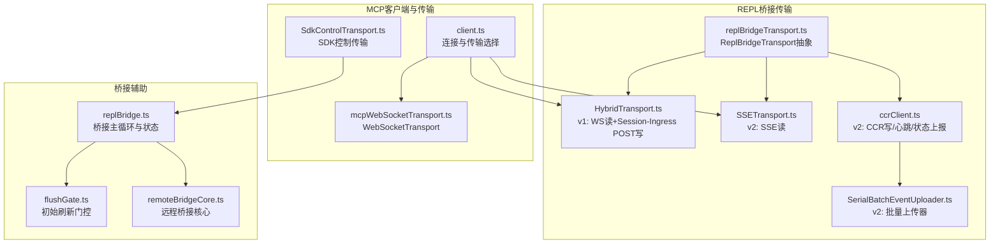
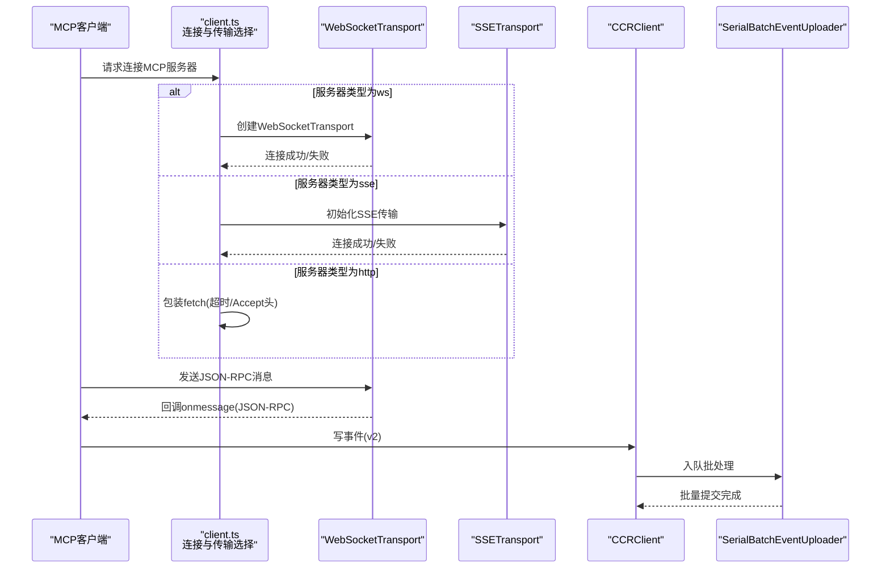
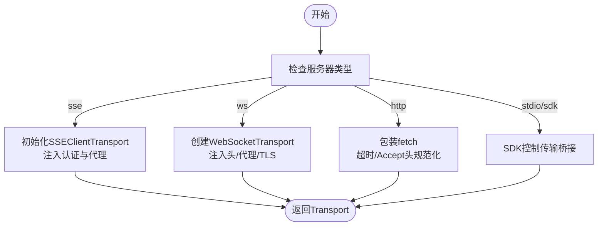
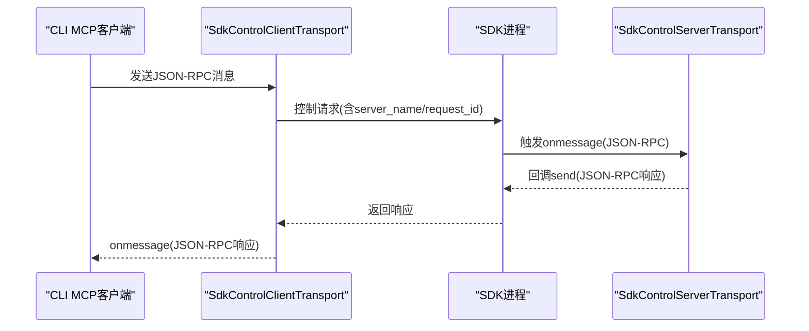
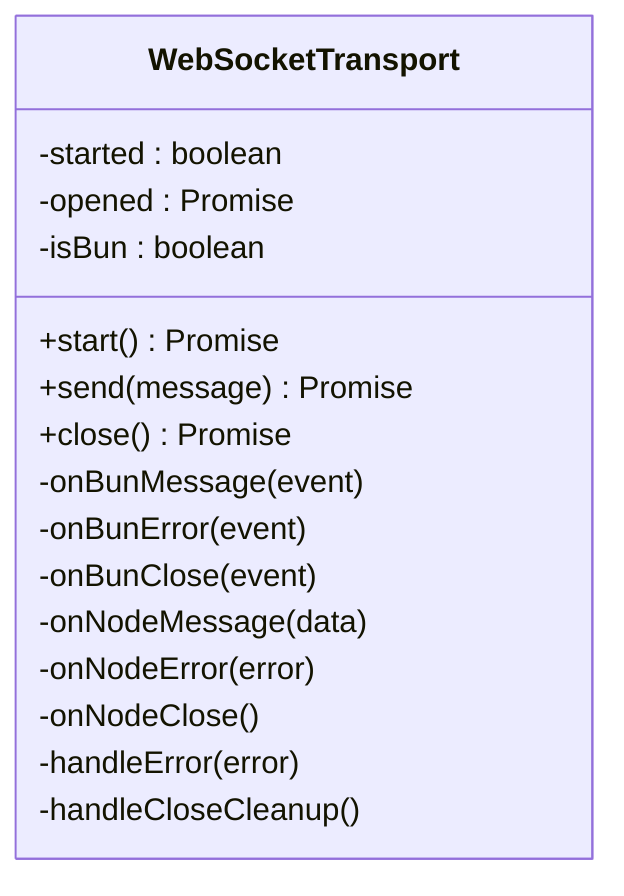
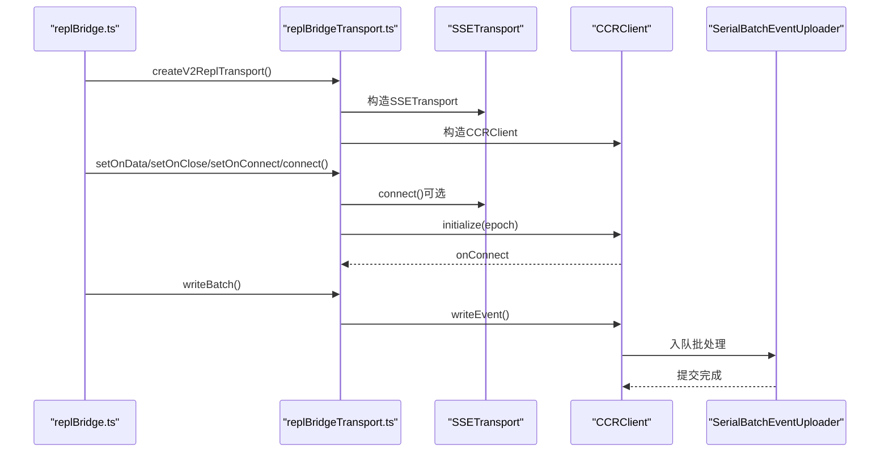
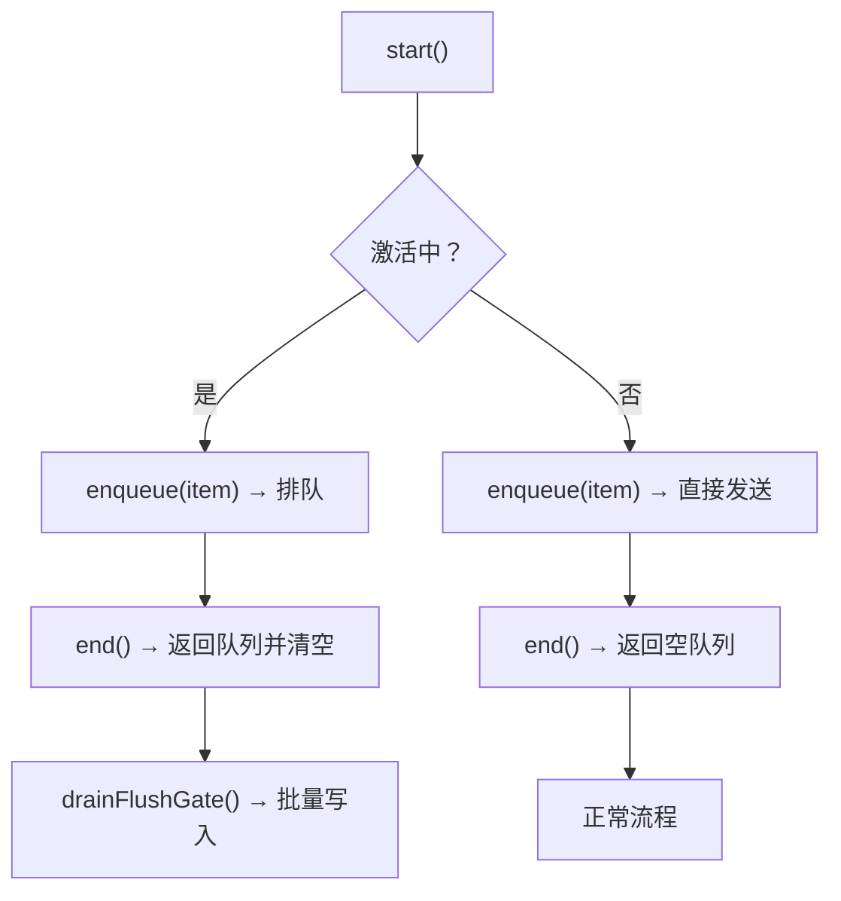
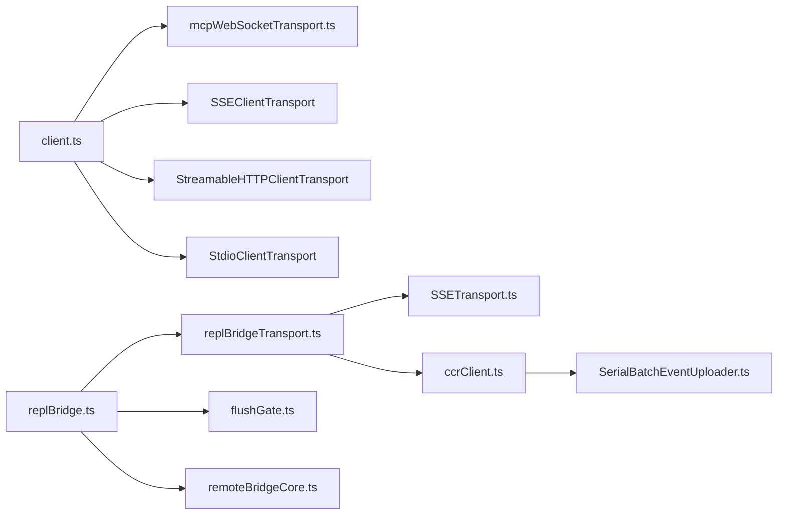
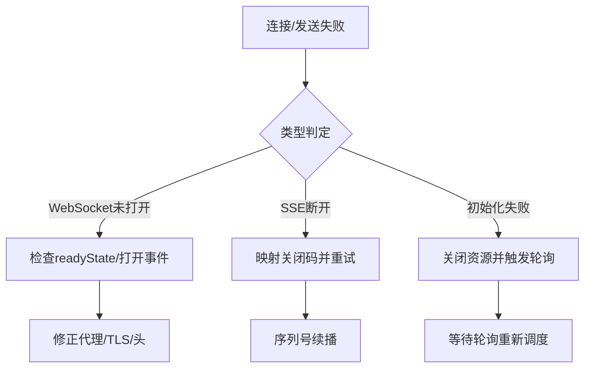

# 传输层实现

<cite>
**本文引用的文件**
- [client.ts](file://src/services/mcp/client.ts)
- [SdkControlTransport.ts](file://src/services/mcp/SdkControlTransport.ts)
- [mcpWebSocketTransport.ts](file://src/utils/mcpWebSocketTransport.ts)
- [replBridgeTransport.ts](file://src/bridge/replBridgeTransport.ts)
- [HybridTransport.ts](file://src/cli/transports/HybridTransport.ts)
- [SSETransport.ts](file://src/cli/transports/SSETransport.ts)
- [ccrClient.ts](file://src/cli/transports/ccrClient.ts)
- [SerialBatchEventUploader.ts](file://src/cli/transports/SerialBatchEventUploader.ts)
- [flushGate.ts](file://src/bridge/flushGate.ts)
- [replBridge.ts](file://src/bridge/replBridge.ts)
- [remoteBridgeCore.ts](file://src/bridge/remoteBridgeCore.ts)
- [print.ts](file://src/cli/print.ts)
</cite>

## 目录
1. [简介](#简介)
2. [项目结构](#项目结构)
3. [核心组件](#核心组件)
4. [架构总览](#架构总览)
5. [详细组件分析](#详细组件分析)
6. [依赖关系分析](#依赖关系分析)
7. [性能考量](#性能考量)
8. [故障排查指南](#故障排查指南)
9. [结论](#结论)
10. [附录](#附录)

## 简介
本文件系统性梳理并解析该代码库中的MCP（Model Context Protocol）传输层实现，覆盖SDK控制传输、WebSocket传输、标准输入输出传输（通过CLI传输层）以及HTTP/SSE/流式HTTP等传输方式。文档重点阐述：
- 传输协议选择与配置：连接建立、认证头注入、代理与TLS、用户代理与环境变量
- 数据编码与消息格式：JSON-RPC封装、事件流与序列化
- 性能优化：批量写入、顺序批上传器、初始刷新门控、心跳保活
- 安全机制：会话令牌、OAuth令牌传递、mTLS与代理支持
- 错误处理与重试：连接失败诊断、关闭清理、异常传播
- 监控与指标：诊断日志、事件埋点、状态标签
- 调试与排障：日志策略、错误码映射、重连与回放

## 项目结构
传输层相关代码主要分布在以下模块：
- MCP客户端与传输选择：服务端MCP连接与传输初始化
- SDK控制传输桥接：CLI与SDK进程间的消息桥接
- WebSocket传输适配：统一Transport接口的WebSocket实现
- REPL桥接传输抽象：v1/v2两种传输形态的统一接口
- CLI传输层：HybridTransport、SSETransport、CCRClient、批上传器
- 桥接辅助：flushGate用于初始历史消息刷写时的有序写入

**图表来源**
- [client.ts:1-800](file://src/services/mcp/client.ts#L1-L800)
- [SdkControlTransport.ts:1-137](file://src/services/mcp/SdkControlTransport.ts#L1-L137)
- [mcpWebSocketTransport.ts:1-201](file://src/utils/mcpWebSocketTransport.ts#L1-L201)
- [replBridgeTransport.ts:1-371](file://src/bridge/replBridgeTransport.ts#L1-L371)
- [HybridTransport.ts](file://src/cli/transports/HybridTransport.ts)
- [SSETransport.ts](file://src/cli/transports/SSETransport.ts)
- [ccrClient.ts](file://src/cli/transports/ccrClient.ts)
- [SerialBatchEventUploader.ts](file://src/cli/transports/SerialBatchEventUploader.ts)
- [flushGate.ts:1-50](file://src/bridge/flushGate.ts#L1-L50)
- [replBridge.ts:845-1822](file://src/bridge/replBridge.ts#L845-L1822)
- [remoteBridgeCore.ts:379-389](file://src/bridge/remoteBridgeCore.ts#L379-L389)

**章节来源**
- [client.ts:1-800](file://src/services/mcp/client.ts#L1-L800)
- [replBridgeTransport.ts:1-371](file://src/bridge/replBridgeTransport.ts#L1-L371)

## 核心组件
- MCP客户端与传输选择：根据服务器类型（sse/ws/http/stdio/sdk）选择对应传输，并注入认证头、代理、TLS、用户代理等参数；对HTTP/Streamable HTTP进行Accept头规范化与请求超时包装。
- SDK控制传输：在CLI与SDK进程之间桥接控制消息，支持多SDK服务器并保持消息ID关联。
- WebSocket传输：统一Transport接口的WebSocket实现，兼容Bun原生WebSocket与Node ws包，负责消息解析、错误处理与关闭清理。
- REPL桥接传输：抽象v1/v2两种形态，v1使用HybridTransport（Session-Ingress），v2使用SSETransport读+SSE事件上报，CCRClient写入并维护心跳、状态与交付跟踪。
- 批量上传器：v2写路径通过SerialBatchEventUploader进行顺序批处理，提升吞吐并降低网络开销。
- 初始刷新门控：flushGate在历史消息刷写期间阻塞新消息写入，确保顺序一致性。

**章节来源**
- [client.ts:595-800](file://src/services/mcp/client.ts#L595-L800)
- [SdkControlTransport.ts:60-137](file://src/services/mcp/SdkControlTransport.ts#L60-L137)
- [mcpWebSocketTransport.ts:22-201](file://src/utils/mcpWebSocketTransport.ts#L22-L201)
- [replBridgeTransport.ts:23-70](file://src/bridge/replBridgeTransport.ts#L23-L70)
- [SerialBatchEventUploader.ts](file://src/cli/transports/SerialBatchEventUploader.ts)
- [flushGate.ts:16-50](file://src/bridge/flushGate.ts#L16-L50)

## 架构总览
下图展示MCP客户端到不同传输层的整体调用链与关键节点：

**图表来源**
- [client.ts:595-800](file://src/services/mcp/client.ts#L595-L800)
- [mcpWebSocketTransport.ts:142-201](file://src/utils/mcpWebSocketTransport.ts#L142-L201)
- [SSETransport.ts](file://src/cli/transports/SSETransport.ts)
- [ccrClient.ts](file://src/cli/transports/ccrClient.ts)
- [SerialBatchEventUploader.ts](file://src/cli/transports/SerialBatchEventUploader.ts)

## 详细组件分析

### 组件A：MCP客户端与传输选择
- 协议选择：根据serverRef.type选择sse、ws、http或stdio/sdk。
- 认证与头注入：动态组合静态与动态头部，支持会话令牌与OAuth令牌；敏感头在日志中脱敏。
- 代理与TLS：支持HTTP(S)_PROXY与自定义TLS选项；Node端通过agent与proxy选项传递。
- HTTP/Streamable HTTP：规范化Accept头，避免严格服务器拒绝；对POST请求设置超时信号，GET请求不超时以维持长连接。
- 连接超时：统一连接超时配置，避免信号过期导致后续请求立即超时的问题。

**图表来源**
- [client.ts:619-800](file://src/services/mcp/client.ts#L619-L800)

**章节来源**
- [client.ts:619-800](file://src/services/mcp/client.ts#L619-L800)

### 组件B：SDK控制传输桥接
- 双向桥接：CLI侧SdkControlClientTransport将MCP消息封装为控制请求发送至SDK；SDK侧SdkControlServerTransport将响应回调给CLI。
- 多服务器支持：通过server_name路由到正确的SDK服务器实例。
- 关闭与错误：传输关闭后抛出错误；onerror/onclose回调用于上层处理。

**图表来源**
- [SdkControlTransport.ts:60-137](file://src/services/mcp/SdkControlTransport.ts#L60-L137)

**章节来源**
- [SdkControlTransport.ts:60-137](file://src/services/mcp/SdkControlTransport.ts#L60-L137)

### 组件C：WebSocket传输
- 统一接口：实现Transport接口，支持start/send/close。
- 平台兼容：Bun原生WebSocket与Node ws包分别绑定事件监听。
- 错误处理：捕获解析异常与底层错误，触发onerror；关闭时清理监听。
- 发送流程：序列化JSON-RPC消息，按平台调用send或带回调的send。

**图表来源**
- [mcpWebSocketTransport.ts:22-201](file://src/utils/mcpWebSocketTransport.ts#L22-L201)

**章节来源**
- [mcpWebSocketTransport.ts:22-201](file://src/utils/mcpWebSocketTransport.ts#L22-L201)

### 组件D：REPL桥接传输抽象（v1/v2）
- v1：HybridTransport（Session-Ingress WS），读写均通过该传输；支持连接状态查询与关闭。
- v2：SSETransport（读）+ CCRClient（写），写路径通过SerialBatchEventUploader顺序批处理；支持心跳、状态上报、交付跟踪；支持outboundOnly模式。
- 生命周期：connect()异步初始化，onConnect在写就绪后触发；onClose映射SSE断开与初始化失败等场景。

**图表来源**
- [replBridgeTransport.ts:119-371](file://src/bridge/replBridgeTransport.ts#L119-L371)
- [SSETransport.ts](file://src/cli/transports/SSETransport.ts)
- [ccrClient.ts](file://src/cli/transports/ccrClient.ts)
- [SerialBatchEventUploader.ts](file://src/cli/transports/SerialBatchEventUploader.ts)

**章节来源**
- [replBridgeTransport.ts:23-70](file://src/bridge/replBridgeTransport.ts#L23-L70)
- [replBridgeTransport.ts:119-371](file://src/bridge/replBridgeTransport.ts#L119-L371)

### 组件E：初始刷新门控（flushGate）
- 目标：在桥接会话启动时，历史消息通过单次HTTP POST刷写，期间阻止新消息写入，防止乱序。
- 行为：start()激活；enqueue()在激活时排队；end()返回待刷写队列；drop()丢弃队列并永久关闭。

**图表来源**
- [flushGate.ts:16-50](file://src/bridge/flushGate.ts#L16-L50)
- [replBridge.ts:845-870](file://src/bridge/replBridge.ts#L845-L870)

**章节来源**
- [flushGate.ts:16-50](file://src/bridge/flushGate.ts#L16-L50)
- [replBridge.ts:845-870](file://src/bridge/replBridge.ts#L845-L870)

### 组件F：CLI传输层（Hybrid/SSE/CCR）
- HybridTransport：v1形态，结合WebSocket读取与Session-Ingress POST写入。
- SSETransport：v2读取端，支持从指定序列号续播，处理SSE事件流。
- CCRClient：v2写入端，负责事件写入、心跳、状态与元数据上报、交付跟踪。
- SerialBatchEventUploader：顺序批处理上传器，内部批大小默认100，保证写入顺序与低抖动。

**章节来源**
- [HybridTransport.ts](file://src/cli/transports/HybridTransport.ts)
- [SSETransport.ts](file://src/cli/transports/SSETransport.ts)
- [ccrClient.ts](file://src/cli/transports/ccrClient.ts)
- [SerialBatchEventUploader.ts](file://src/cli/transports/SerialBatchEventUploader.ts)

## 依赖关系分析
- MCP客户端依赖：
  - 传输层：WebSocketTransport、SSEClientTransport、StreamableHTTPClientTransport、StdioClientTransport
  - 工具：代理与TLS配置、用户代理、会话令牌、超时包装
- REPL桥接：
  - v1：HybridTransport直接复用
  - v2：SSETransport + CCRClient + SerialBatchEventUploader
- 辅助：
  - flushGate用于桥接写入顺序控制
  - remoteBridgeCore与replBridge负责桥接生命周期与状态机

**图表来源**
- [client.ts:1-800](file://src/services/mcp/client.ts#L1-L800)
- [mcpWebSocketTransport.ts:1-201](file://src/utils/mcpWebSocketTransport.ts#L1-L201)
- [replBridgeTransport.ts:1-371](file://src/bridge/replBridgeTransport.ts#L1-L371)
- [SSETransport.ts](file://src/cli/transports/SSETransport.ts)
- [ccrClient.ts](file://src/cli/transports/ccrClient.ts)
- [SerialBatchEventUploader.ts](file://src/cli/transports/SerialBatchEventUploader.ts)
- [flushGate.ts:1-50](file://src/bridge/flushGate.ts#L1-L50)
- [remoteBridgeCore.ts:379-389](file://src/bridge/remoteBridgeCore.ts#L379-L389)

**章节来源**
- [client.ts:1-800](file://src/services/mcp/client.ts#L1-L800)
- [replBridgeTransport.ts:1-371](file://src/bridge/replBridgeTransport.ts#L1-L371)

## 性能考量
- 批量传输：v2写路径通过SerialBatchEventUploader顺序批处理，减少网络往返与服务器压力。
- 缓冲区管理：flushGate在历史消息刷写期间阻塞新消息，避免无界队列增长；v2写路径无最大连续失败丢弃统计，降低静默丢弃风险。
- 心跳保活：REPL桥接定期发送keep_alive帧，防止上游代理与会话入口层回收空闲会话。
- 超时与Accept头：HTTP请求采用逐请求超时信号，避免信号过期问题；强制设置Streamable HTTP所需的Accept头，减少服务器拒绝。
- 连接并发：支持批量连接服务器，提高整体可用性。

**章节来源**
- [replBridgeTransport.ts:322-323](file://src/bridge/replBridgeTransport.ts#L322-L323)
- [replBridge.ts:1528-1547](file://src/bridge/replBridge.ts#L1528-L1547)
- [client.ts:492-550](file://src/services/mcp/client.ts#L492-L550)
- [client.ts:552-561](file://src/services/mcp/client.ts#L552-L561)

## 故障排查指南
- 连接失败诊断：
  - WebSocket连接失败：记录诊断事件，检查代理/TLS/协议头；确认readyState与打开事件。
  - SSE连接失败：区分初始化失败与SSE断开，前者映射为特定关闭码以便重试。
- 关闭与清理：
  - 传输关闭时移除事件监听，避免内存泄漏；v2在epoch冲突时主动关闭资源并通知上层。
- 错误码映射：
  - REPL桥接将SSE预算耗尽映射为特定关闭码，便于区分不同类型的断开。
- 日志与埋点：
  - 使用诊断日志与事件埋点记录连接、发送、关闭、消息解析失败等关键事件。
- 重连与回放：
  - v2通过序列号续播避免全量重放；初始化失败时触发轮询重试。

**图表来源**
- [mcpWebSocketTransport.ts:142-168](file://src/utils/mcpWebSocketTransport.ts#L142-L168)
- [replBridgeTransport.ts:304-315](file://src/bridge/replBridgeTransport.ts#L304-L315)
- [replBridge.ts:906-920](file://src/bridge/replBridge.ts#L906-L920)

**章节来源**
- [mcpWebSocketTransport.ts:142-168](file://src/utils/mcpWebSocketTransport.ts#L142-L168)
- [replBridgeTransport.ts:304-315](file://src/bridge/replBridgeTransport.ts#L304-L315)
- [replBridge.ts:906-920](file://src/bridge/replBridge.ts#L906-L920)

## 结论
该传输层实现围绕MCP协议提供了多样的传输适配与稳健的桥接机制：
- 通过统一的Transport接口与平台兼容实现，确保WebSocket在Bun与Node环境的一致行为。
- v2桥接方案以SSE读+CCR写为核心，配合批上传器与心跳保活，显著提升稳定性与吞吐。
- flushGate与序列号续播保障了消息顺序与回放正确性。
- 丰富的日志与埋点为运维与开发提供了可观测性基础。

## 附录
- 传输协议选择与配置要点
  - 服务器类型：sse/ws/http/stdio/sdk
  - 认证：会话令牌与OAuth令牌注入；敏感头脱敏日志
  - 代理与TLS：HTTP(S)_PROXY、自定义TLS与代理agent
  - 用户代理与环境：统一UA与NODE_OPTIONS/UV_THREADPOOL_SIZE
- 数据编码与消息格式
  - JSON-RPC封装；SSE事件流；HTTP POST/GET语义
- 安全机制
  - 会话令牌与OAuth令牌传递；mTLS与代理支持
- 监控与指标
  - 诊断日志、事件埋点、状态标签、序列号续播
- 调试与排障
  - 诊断事件、错误码映射、重连与回放策略