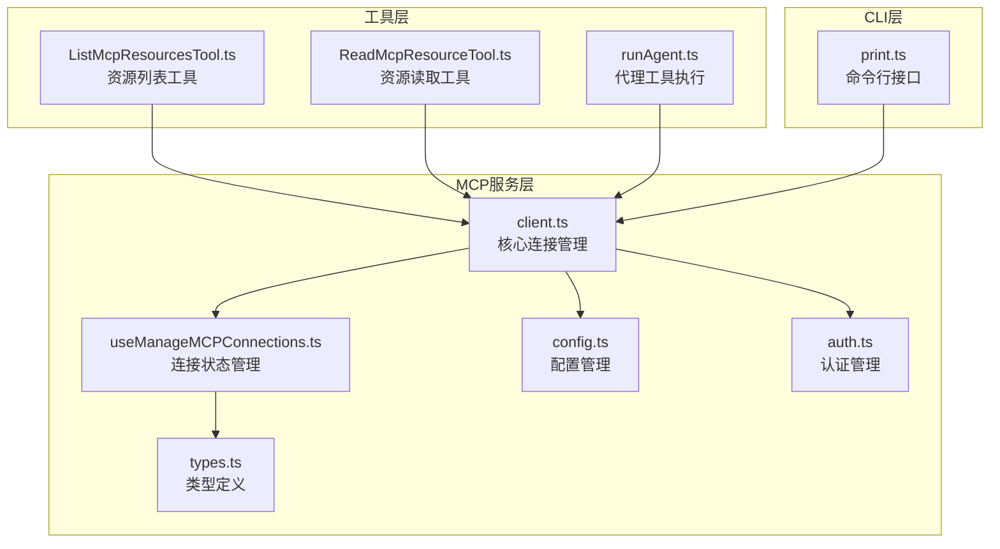
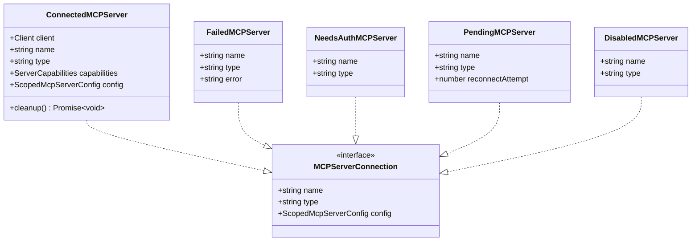
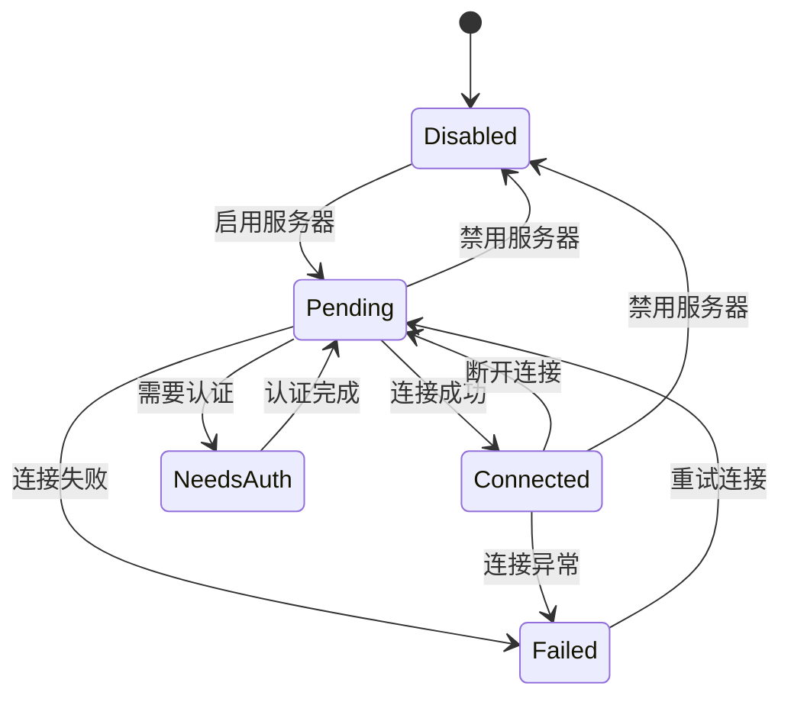
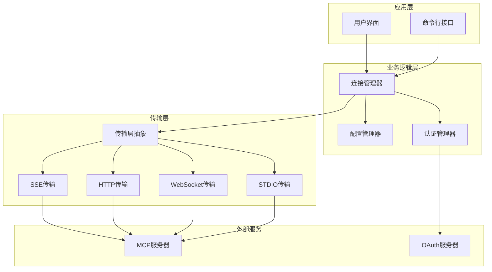
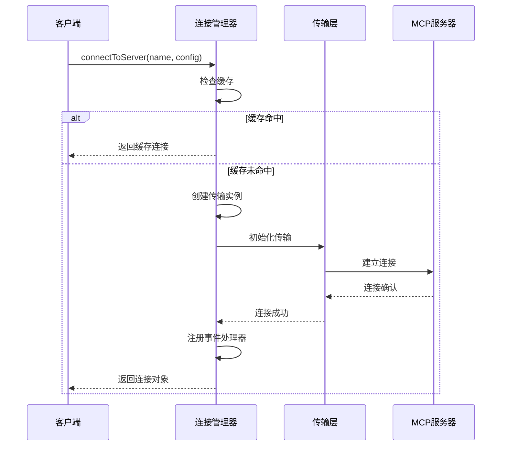
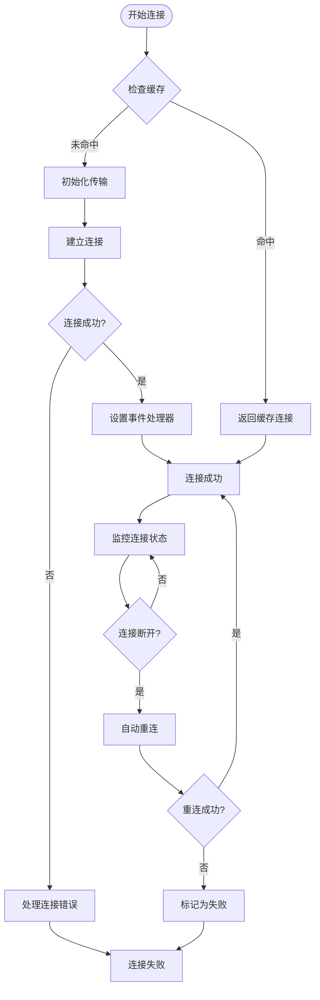
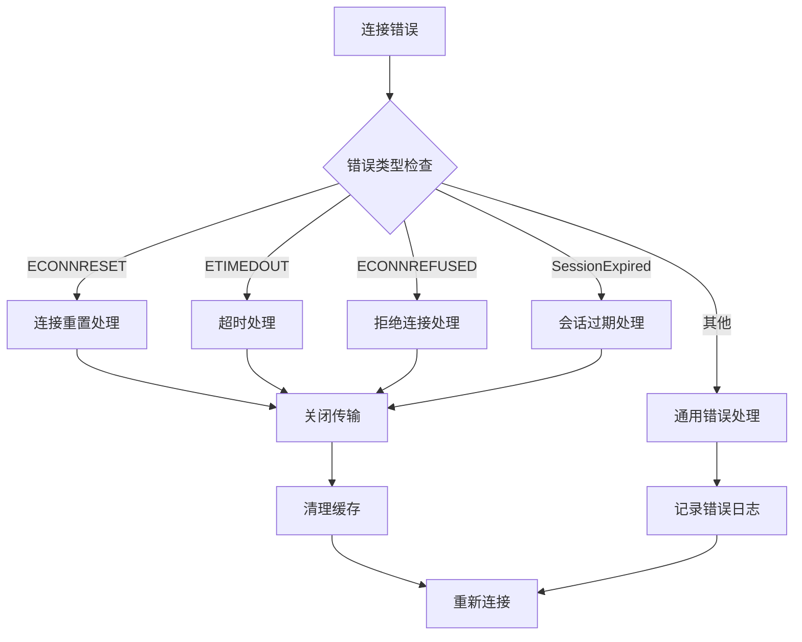
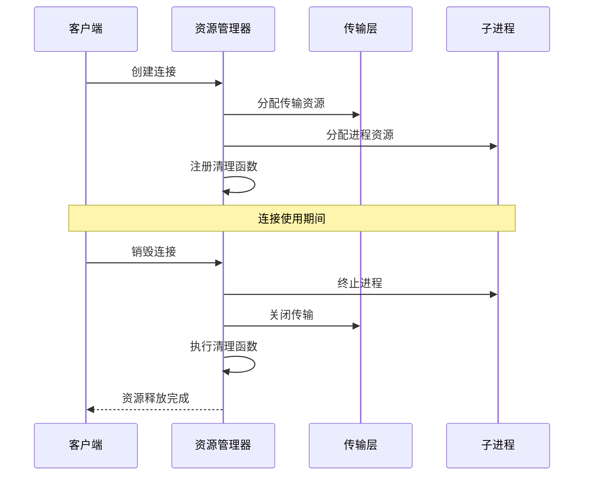
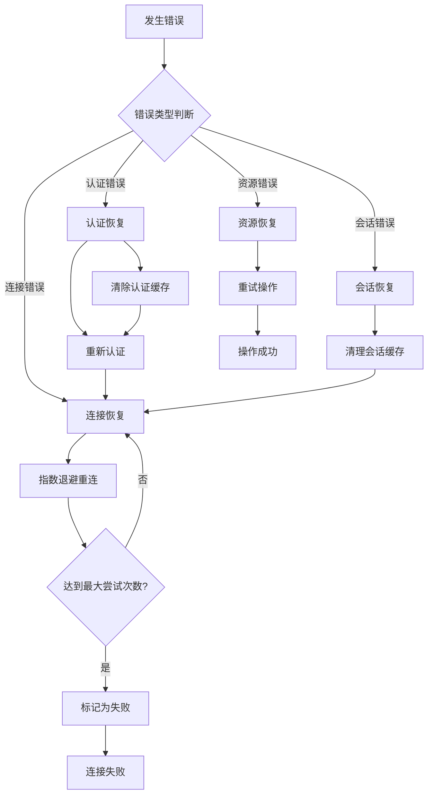
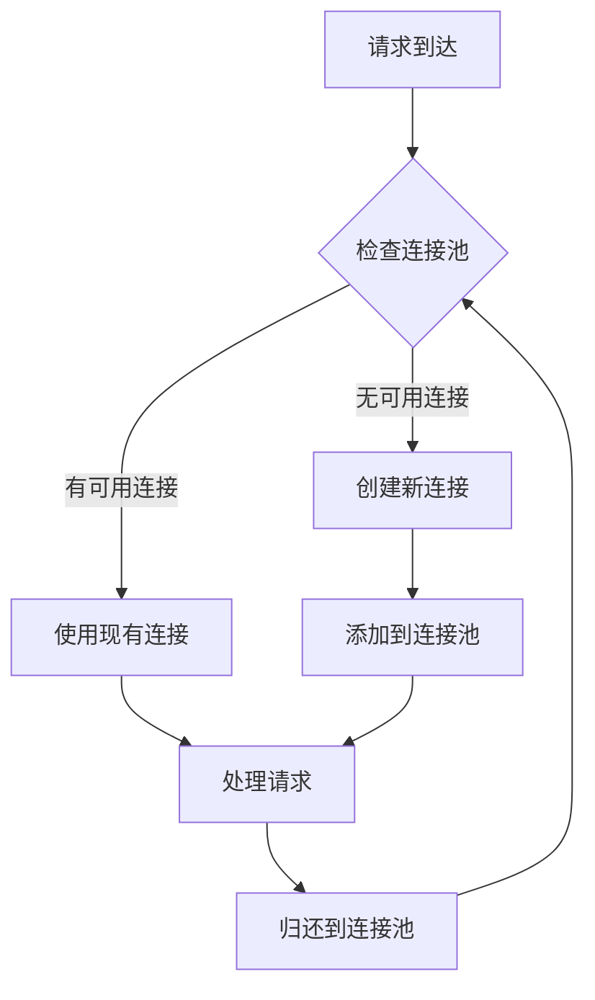

# 客户端生命周期管理

<cite>
**本文档引用的文件**
- [client.ts](file://src/services/mcp/client.ts)
- [useManageMCPConnections.ts](file://src/services/mcp/useManageMCPConnections.ts)
- [types.ts](file://src/services/mcp/types.ts)
- [config.ts](file://src/services/mcp/config.ts)
- [auth.ts](file://src/services/mcp/auth.ts)
- [print.ts](file://src/cli/print.ts)
- [ListMcpResourcesTool.ts](file://src/tools/ListMcpResourcesTool/ListMcpResourcesTool.ts)
- [ReadMcpResourceTool.ts](file://src/tools/ReadMcpResourceTool/ReadMcpResourceTool.ts)
- [runAgent.ts](file://src/tools/AgentTool/runAgent.ts)
</cite>

## 目录
1. [简介](#简介)
2. [项目结构](#项目结构)
3. [核心组件](#核心组件)
4. [架构概览](#架构概览)
5. [详细组件分析](#详细组件分析)
6. [依赖关系分析](#依赖关系分析)
7. [性能考虑](#性能考虑)
8. [故障排查指南](#故障排查指南)
9. [结论](#结论)

## 简介

本文档深入解析MCP（Model Context Protocol）客户端的完整生命周期管理机制。MCP客户端作为连接外部AI服务器的关键组件，需要经过严格的创建、初始化、运行时管理和销毁流程。本文将详细说明客户端状态转换机制、配置管理、资源分配与释放、异常处理与错误恢复策略，并提供监控指标和性能优化技术。

## 项目结构

MCP客户端生命周期管理主要分布在以下核心模块中：



**图表来源**
- [client.ts:1-800](file://src/services/mcp/client.ts#L1-L800)
- [useManageMCPConnections.ts:1-800](file://src/services/mcp/useManageMCPConnections.ts#L1-L800)
- [types.ts:1-259](file://src/services/mcp/types.ts#L1-L259)

**章节来源**
- [client.ts:1-800](file://src/services/mcp/client.ts#L1-L800)
- [useManageMCPConnections.ts:1-800](file://src/services/mcp/useManageMCPConnections.ts#L1-L800)
- [types.ts:1-259](file://src/services/mcp/types.ts#L1-L259)

## 核心组件

### 连接管理器（ConnectToServer）

连接管理器是MCP客户端生命周期的核心组件，负责处理所有类型的MCP服务器连接：



**图表来源**
- [types.ts:179-227](file://src/services/mcp/types.ts#L179-L227)

### 连接状态管理器

连接状态管理器负责监控和管理所有MCP客户端的连接状态：



**图表来源**
- [useManageMCPConnections.ts:325-760](file://src/services/mcp/useManageMCPConnections.ts#L325-L760)

**章节来源**
- [types.ts:179-227](file://src/services/mcp/types.ts#L179-L227)
- [useManageMCPConnections.ts:325-760](file://src/services/mcp/useManageMCPConnections.ts#L325-L760)

## 架构概览

MCP客户端生命周期管理采用分层架构设计，确保各组件职责清晰、耦合度低：



**图表来源**
- [client.ts:595-961](file://src/services/mcp/client.ts#L595-L961)
- [useManageMCPConnections.ts:143-146](file://src/services/mcp/useManageMCPConnections.ts#L143-L146)

## 详细组件分析

### 连接创建与初始化

连接创建过程涉及多种传输协议和认证方式：

#### 连接创建流程



**图表来源**
- [client.ts:595-1080](file://src/services/mcp/client.ts#L595-L1080)

#### 支持的传输协议

系统支持多种传输协议，每种协议都有特定的使用场景：

| 传输协议 | 使用场景 | 特点 |
|---------|----------|------|
| SSE | 远程服务器连接 | 实时双向通信，适合长连接 |
| HTTP | RESTful API调用 | 标准HTTP请求，易于调试 |
| WebSocket | 交互式通信 | 双向实时通信，低延迟 |
| STDIO | 本地进程通信 | 本地子进程，高性能 |
| SDK | 内部集成 | 无网络开销，直接内存访问 |

**章节来源**
- [client.ts:619-961](file://src/services/mcp/client.ts#L619-L961)
- [types.ts:23-135](file://src/services/mcp/types.ts#L23-L135)

### 状态转换机制

MCP客户端在生命周期内会经历多种状态转换，每个状态都有特定的处理逻辑：

#### 状态转换流程



**图表来源**
- [client.ts:1216-1402](file://src/services/mcp/client.ts#L1216-L1402)
- [useManageMCPConnections.ts:354-468](file://src/services/mcp/useManageMCPConnections.ts#L354-L468)

#### 异常检测与处理

系统实现了多层次的异常检测机制：



**图表来源**
- [client.ts:1249-1365](file://src/services/mcp/client.ts#L1249-L1365)

**章节来源**
- [client.ts:1216-1402](file://src/services/mcp/client.ts#L1216-L1402)
- [useManageMCPConnections.ts:354-468](file://src/services/mcp/useManageMCPConnections.ts#L354-L468)

### 配置管理

MCP客户端支持多层级配置管理，确保灵活性和安全性：

#### 配置层次结构


**图表来源**
- [config.ts:69-81](file://src/services/mcp/config.ts#L69-L81)
- [types.ts:10-56](file://src/services/mcp/types.ts#L10-L56)

#### 配置验证与安全

系统实现了严格的配置验证机制：

**章节来源**
- [config.ts:625-761](file://src/services/mcp/config.ts#L625-L761)
- [types.ts:10-135](file://src/services/mcp/types.ts#L10-L135)

### 资源分配与释放

MCP客户端生命周期中的资源管理至关重要，系统提供了完善的资源分配和释放机制：

#### 资源管理流程



**图表来源**
- [client.ts:1404-1580](file://src/services/mcp/client.ts#L1404-L1580)

#### 清理策略

系统实现了多层次的清理策略：

**章节来源**
- [client.ts:1404-1580](file://src/services/mcp/client.ts#L1404-L1580)

### 异常处理与错误恢复

MCP客户端实现了全面的异常处理和错误恢复机制：

#### 错误恢复策略



**图表来源**
- [useManageMCPConnections.ts:371-468](file://src/services/mcp/useManageMCPConnections.ts#L371-L468)

**章节来源**
- [useManageMCPConnections.ts:371-468](file://src/services/mcp/useManageMCPConnections.ts#L371-L468)

### 监控指标与性能优化

系统提供了丰富的监控指标和性能优化技术：

#### 性能监控指标

| 指标类别 | 具体指标 | 描述 |
|---------|----------|------|
| 连接性能 | 连接时间(ms) | 测量从发起连接到建立连接的时间 |
| 传输性能 | 请求响应时间(ms) | 测量单个请求的平均响应时间 |
| 资源使用 | 内存使用量(MB) | 监控客户端内存占用情况 |
| 错误率 | 失败请求比例(%) | 统计失败请求占总请求数的比例 |
| 重连性能 | 重连成功率(%) | 测量自动重连的成功率 |

#### 性能优化技术

**章节来源**
- [client.ts:1583-1594](file://src/services/mcp/client.ts#L1583-L1594)
- [useManageMCPConnections.ts:207-208](file://src/services/mcp/useManageMCPConnections.ts#L207-L208)

## 依赖关系分析

MCP客户端生命周期管理系统具有清晰的依赖关系：

```mermaid
graph TB
subgraph "核心依赖"
A[client.ts] --> B[useManageMCPConnections.ts]
A --> C[types.ts]
A --> D[config.ts]
A --> E[auth.ts]
end
subgraph "工具依赖"
F[ListMcpResourcesTool.ts] --> A
G[ReadMcpResourceTool.ts] --> A
H[runAgent.ts] --> A
end
subgraph "CLI依赖"
I[print.ts] --> A
I --> B
end
subgraph "外部依赖"
J[@modelcontextprotocol/sdk]
K[lodash-es]
L[axios]
M[ws]
end
A --> J
A --> K
F --> L
A --> M
```

**图表来源**
- [client.ts:1-50](file://src/services/mcp/client.ts#L1-L50)
- [useManageMCPConnections.ts:1-20](file://src/services/mcp/useManageMCPConnections.ts#L1-L20)

**章节来源**
- [client.ts:1-50](file://src/services/mcp/client.ts#L1-L50)
- [useManageMCPConnections.ts:1-20](file://src/services/mcp/useManageMCPConnections.ts#L1-L20)

## 性能考虑

### 连接池管理

系统实现了智能的连接池管理机制，通过缓存已建立的连接来提高性能：

### 并发控制



**图表来源**
- [client.ts:595-607](file://src/services/mcp/client.ts#L595-L607)

### 缓存策略

系统采用了多层缓存策略来优化性能：

**章节来源**
- [client.ts:595-607](file://src/services/mcp/client.ts#L595-L607)

## 故障排查指南

### 常见问题诊断

#### 连接失败排查

1. **检查网络连接**
   - 验证服务器可达性
   - 检查防火墙设置
   - 确认端口开放

2. **验证认证配置**
   - 检查OAuth令牌有效性
   - 验证服务器证书
   - 确认客户端凭据正确

3. **查看日志信息**
   - 启用详细日志模式
   - 检查连接超时信息
   - 分析错误堆栈跟踪

#### 性能问题排查

1. **监控资源使用**
   - 监控内存使用情况
   - 检查CPU占用率
   - 分析网络带宽使用

2. **分析连接池状态**
   - 检查连接池大小
   - 监控连接复用率
   - 分析连接泄漏情况

**章节来源**
- [client.ts:1048-1080](file://src/services/mcp/client.ts#L1048-L1080)
- [useManageMCPConnections.ts:354-468](file://src/services/mcp/useManageMCPConnections.ts#L354-L468)

### 调试工具

系统提供了多种调试工具来帮助诊断问题：

#### 日志级别控制

| 日志级别 | 用途 | 适用场景 |
|----------|------|----------|
| Debug | 详细调试信息 | 开发和测试环境 |
| Info | 一般信息 | 生产环境监控 |
| Warn | 警告信息 | 需要注意的问题 |
| Error | 错误信息 | 故障诊断 |

#### 性能分析工具

**章节来源**
- [client.ts:1623-1627](file://src/services/mcp/client.ts#L1623-L1627)

## 结论

MCP客户端生命周期管理系统通过精心设计的架构和完善的机制，确保了MCP客户端在整个生命周期内的稳定性和可靠性。系统的主要特点包括：

1. **模块化设计**：清晰的分层架构使得各组件职责明确，便于维护和扩展
2. **状态管理**：完善的连接状态管理机制确保客户端能够正确处理各种状态转换
3. **错误恢复**：多层次的错误处理和恢复机制提高了系统的容错能力
4. **性能优化**：智能的缓存策略和连接池管理提升了系统性能
5. **监控完善**：丰富的监控指标和日志记录为故障诊断提供了有力支持

通过本文档的详细分析，开发者可以更好地理解和使用MCP客户端生命周期管理系统，为构建可靠的AI应用提供坚实的技术基础。