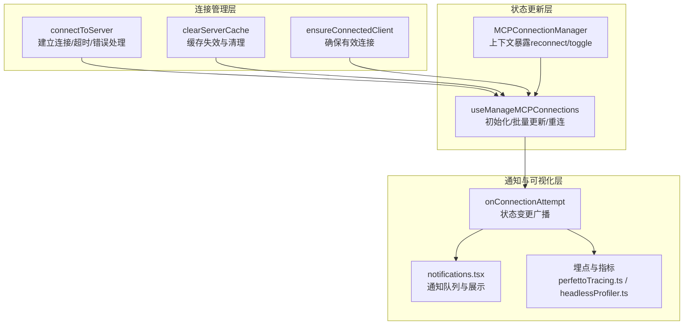
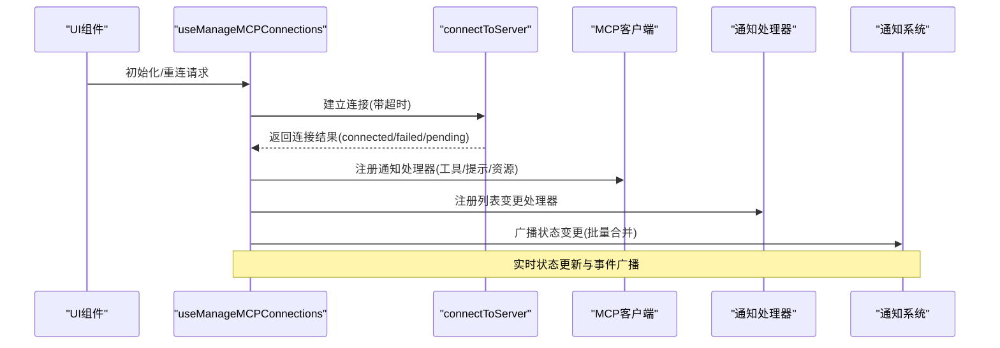
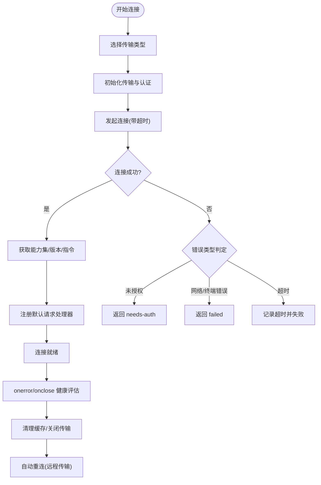
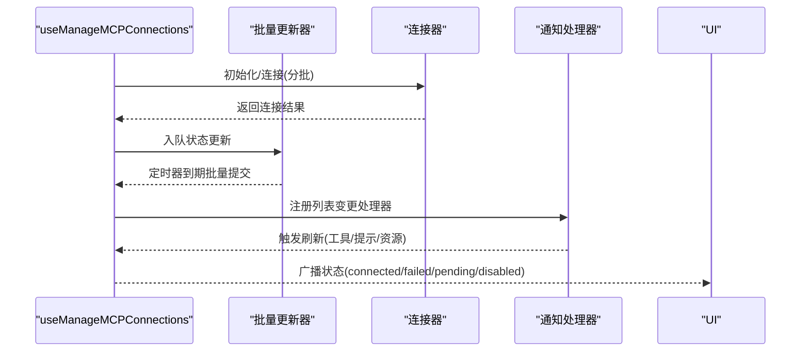
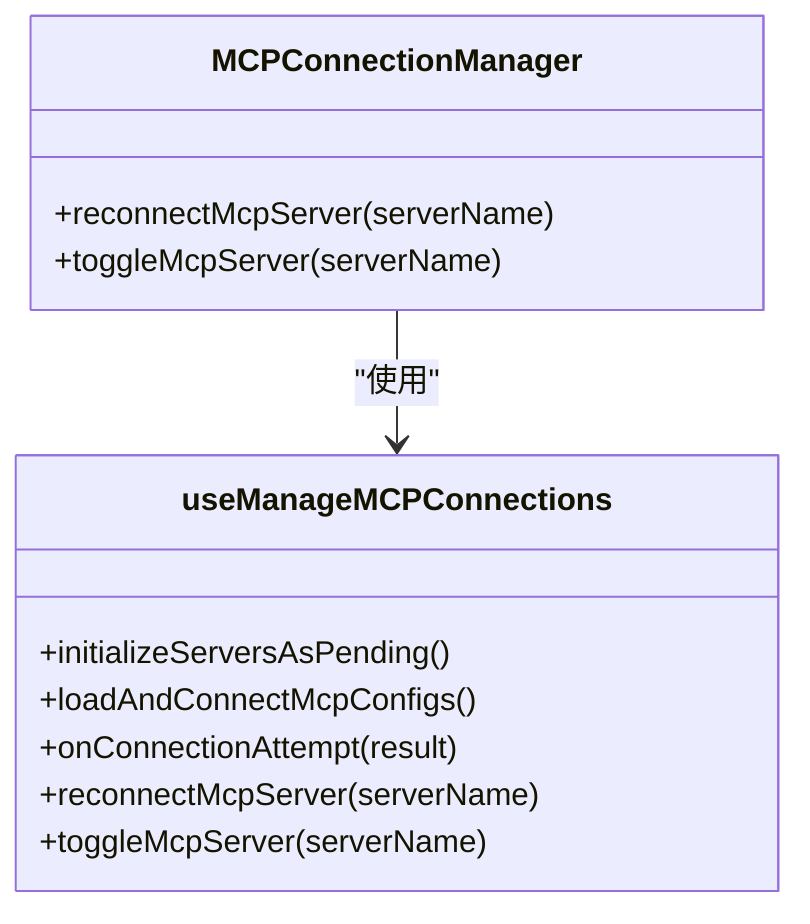
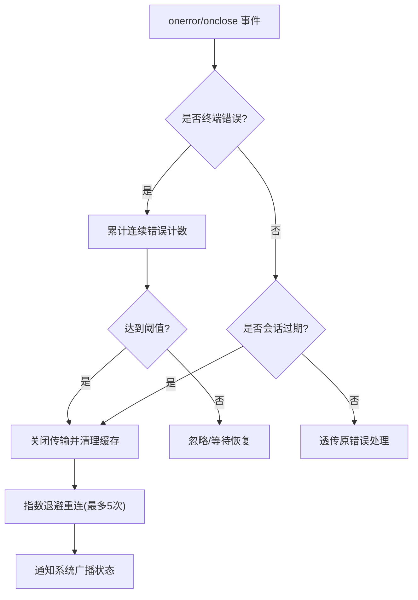
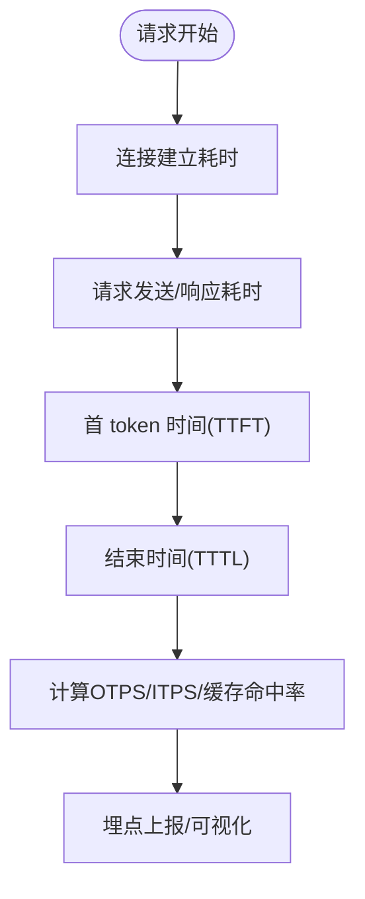
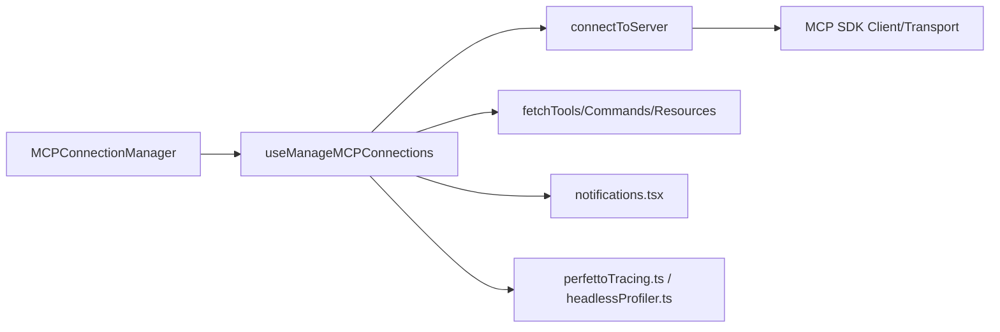

# 连接状态监控

<cite>
**本文引用的文件**
- [client.ts](file://src/services/mcp/client.ts)
- [useManageMCPConnections.ts](file://src/services/mcp/useManageMCPConnections.ts)
- [MCPConnectionManager.tsx](file://src/services/mcp/MCPConnectionManager.tsx)
- [AgentTool.tsx](file://src/tools/AgentTool/AgentTool.tsx)
- [print.ts](file://src/cli/print.ts)
- [perfettoTracing.ts](file://src/utils/telemetry/perfettoTracing.ts)
- [headlessProfiler.ts](file://src/utils/headlessProfiler.ts)
- [bridgeMain.ts](file://src/bridge/bridgeMain.ts)
- [notifications.tsx](file://src/context/notifications.tsx)
- [useStartupNotification.ts](file://src/hooks/notifs/useStartupNotification.ts)
</cite>

## 目录
1. [简介](#简介)
2. [项目结构](#项目结构)
3. [核心组件](#核心组件)
4. [架构总览](#架构总览)
5. [详细组件分析](#详细组件分析)
6. [依赖关系分析](#依赖关系分析)
7. [性能考量](#性能考量)
8. [故障排查指南](#故障排查指南)
9. [结论](#结论)
10. [附录](#附录)

## 简介
本技术文档围绕 MCPP（Model Context Protocol）连接状态监控系统进行深入解析，覆盖以下关键主题：
- 连接状态跟踪：在线状态检测、心跳监测、连接健康评估
- 状态变化通知：实时状态更新与事件广播机制
- 连接质量监控指标：延迟测量、吞吐量统计、错误率计算
- 异常检测与告警：连接异常识别与自动重连策略
- 状态持久化与恢复：配置变更检测、缓存失效与重连
- 可视化与报表：基于埋点的监控与统计
- 性能优化与故障诊断：批处理并发、超时与背压策略

## 项目结构
MCP 连接状态监控由“连接管理”“状态更新”“通知与可视化”三层组成：
- 连接管理层：负责连接建立、断开、重连、缓存与清理
- 状态更新层：负责批量合并状态变更、注册通知处理器、触发 UI 更新
- 通知与可视化层：负责事件广播、通知队列与可视化指标

图表来源
- [client.ts:595-1641](file://src/services/mcp/client.ts#L595-L1641)
- [useManageMCPConnections.ts:143-1129](file://src/services/mcp/useManageMCPConnections.ts#L143-L1129)
- [MCPConnectionManager.tsx:1-73](file://src/services/mcp/MCPConnectionManager.tsx#L1-L73)
- [notifications.tsx:1-239](file://src/context/notifications.tsx#L1-L239)
- [perfettoTracing.ts:508-545](file://src/utils/telemetry/perfettoTracing.ts#L508-L545)
- [headlessProfiler.ts:123-157](file://src/utils/headlessProfiler.ts#L123-L157)

章节来源
- [client.ts:595-1641](file://src/services/mcp/client.ts#L595-L1641)
- [useManageMCPConnections.ts:143-1129](file://src/services/mcp/useManageMCPConnections.ts#L143-L1129)
- [MCPConnectionManager.tsx:1-73](file://src/services/mcp/MCPConnectionManager.tsx#L1-L73)

## 核心组件
- 连接建立与超时控制：统一的连接入口 connectToServer，支持 SSE/HTTP/WebSocket/STDIO/IDE 等多种传输类型，并内置连接超时与请求超时包装器
- 状态批量更新与去抖：useManageMCPConnections 将频繁的状态回调合并为批次，减少 UI 重渲染
- 自动重连与指数退避：对远程传输类型在断开后按指数退避重连，避免风暴
- 通知处理器注册：根据服务器能力动态注册工具/提示/资源列表变更通知处理器
- 缓存与清理：连接关闭时清理连接缓存与 fetch 缓存，确保下次调用获取最新资源
- 事件广播与可视化：通过埋点与通知系统输出连接状态、耗时与错误等指标

章节来源
- [client.ts:595-1641](file://src/services/mcp/client.ts#L595-L1641)
- [useManageMCPConnections.ts:207-763](file://src/services/mcp/useManageMCPConnections.ts#L207-L763)
- [MCPConnectionManager.tsx:1-73](file://src/services/mcp/MCPConnectionManager.tsx#L1-L73)

## 架构总览
下图展示了从连接建立到状态广播的关键流程：

图表来源
- [useManageMCPConnections.ts:310-763](file://src/services/mcp/useManageMCPConnections.ts#L310-L763)
- [client.ts:1048-1402](file://src/services/mcp/client.ts#L1048-L1402)
- [notifications.tsx:1-239](file://src/context/notifications.tsx#L1-L239)

## 详细组件分析

### 组件A：连接建立与健康评估（connectToServer）
- 多传输类型支持：SSE、HTTP、WebSocket、STDIO、IDE（SSE-IDE/WS-IDE）、claude.ai 代理
- 超时与请求隔离：连接超时与单次请求超时分别控制，避免信号复用导致的“过期超时”问题
- 错误分类与降级：针对不同传输类型的错误进行分类，必要时返回 needs-auth 或 failed
- 连接健康评估：记录连接耗时、能力集、版本信息；在 onerror/onclose 中进行断线检测与缓存清理
- 会话过期检测：HTTP/代理场景下识别 404 + 特定 JSON-RPC 代码作为会话过期信号，触发清理与重连

图表来源
- [client.ts:595-1641](file://src/services/mcp/client.ts#L595-L1641)

章节来源
- [client.ts:595-1641](file://src/services/mcp/client.ts#L595-L1641)

### 组件B：状态批量更新与通知广播（useManageMCPConnections）
- 批量更新：使用定时器窗口合并多次状态回调，降低 UI 抖动
- 列表变更通知：根据服务器能力注册工具/提示/资源变更处理器，变更后刷新对应缓存并更新状态
- 自动重连：对远程传输类型在 onclose 后按指数退避重连，支持取消与最大尝试次数
- 交互式重连：提供 reconnectMcpServer 与 toggleMcpServer 接口，支持用户主动干预
- 插件与动态配置：支持动态 MCP 配置与插件重载，清理过期连接并重新连接

图表来源
- [useManageMCPConnections.ts:207-763](file://src/services/mcp/useManageMCPConnections.ts#L207-L763)

章节来源
- [useManageMCPConnections.ts:143-1129](file://src/services/mcp/useManageMCPConnections.ts#L143-L1129)

### 组件C：上下文与外部集成（MCPConnectionManager 与 CLI）
- 上下文暴露：通过 React Context 暴露 reconnectMcpServer 与 toggleMcpServer，供 UI 使用
- CLI 集成：CLI 控制通道在连接成功后注册弹性质询处理器与频道处理器，失败时返回错误响应

图表来源
- [MCPConnectionManager.tsx:1-73](file://src/services/mcp/MCPConnectionManager.tsx#L1-L73)
- [useManageMCPConnections.ts:143-1129](file://src/services/mcp/useManageMCPConnections.ts#L143-L1129)

章节来源
- [MCPConnectionManager.tsx:1-73](file://src/services/mcp/MCPConnectionManager.tsx#L1-L73)
- [print.ts:3281-3314](file://src/cli/print.ts#L3281-L3314)

### 组件D：异常检测与告警（自动重连与通知）
- 异常检测：onerror 中识别终端网络错误（如 ECONNRESET/ETIMEDOUT/EHOSTUNREACH 等），超过阈值触发关闭
- 会话过期：HTTP/代理场景下识别特定 JSON-RPC 错误码，触发清理与重连
- 自动重连：指数退避（初始 1s，上限 30s），最多 5 次；支持取消与 UI 反馈
- 通知系统：通过通知队列与优先级机制，向用户展示通道权限、连接失败等信息

图表来源
- [client.ts:1216-1402](file://src/services/mcp/client.ts#L1216-L1402)
- [useManageMCPConnections.ts:354-468](file://src/services/mcp/useManageMCPConnections.ts#L354-L468)
- [notifications.tsx:1-239](file://src/context/notifications.tsx#L1-L239)

章节来源
- [client.ts:1216-1402](file://src/services/mcp/client.ts#L1216-L1402)
- [useManageMCPConnections.ts:310-468](file://src/services/mcp/useManageMCPConnections.ts#L310-L468)
- [notifications.tsx:1-239](file://src/context/notifications.tsx#L1-L239)

### 组件E：连接质量监控指标（延迟、吞吐、错误率）
- 延迟测量：连接耗时、请求耗时、首次响应时间（TTFT/TTLT）等
- 吞吐量统计：输出令牌速率（OTPS）、输入令牌速率（ITPS）、缓存命中率等
- 错误率计算：结合连接失败、请求失败与异常事件进行统计
- 指标来源：埋点系统与性能分析器，支持多阶段耗时拆解

图表来源
- [perfettoTracing.ts:508-545](file://src/utils/telemetry/perfettoTracing.ts#L508-L545)
- [headlessProfiler.ts:123-157](file://src/utils/headlessProfiler.ts#L123-L157)

章节来源
- [perfettoTracing.ts:508-545](file://src/utils/telemetry/perfettoTracing.ts#L508-L545)
- [headlessProfiler.ts:123-157](file://src/utils/headlessProfiler.ts#L123-L157)

## 依赖关系分析
- 组件耦合
  - useManageMCPConnections 依赖 connectToServer 与各类 fetch 缓存函数，负责状态聚合与 UI 广播
  - MCPConnectionManager 仅作为上下文提供者，不直接参与业务逻辑
  - 通知系统与埋点系统独立存在，通过 onConnectionAttempt 与日志接口进行集成
- 外部依赖
  - MCP SDK 的 Client/Transport 抽象封装了具体传输细节
  - 通知系统与通知钩子提供统一的消息队列与优先级控制

图表来源
- [useManageMCPConnections.ts:143-1129](file://src/services/mcp/useManageMCPConnections.ts#L143-L1129)
- [client.ts:595-1641](file://src/services/mcp/client.ts#L595-L1641)
- [notifications.tsx:1-239](file://src/context/notifications.tsx#L1-L239)
- [perfettoTracing.ts:508-545](file://src/utils/telemetry/perfettoTracing.ts#L508-L545)

章节来源
- [useManageMCPConnections.ts:143-1129](file://src/services/mcp/useManageMCPConnections.ts#L143-L1129)
- [client.ts:595-1641](file://src/services/mcp/client.ts#L595-L1641)

## 性能考量
- 并发与批处理
  - 本地服务器（STDIO/SDK）与远程服务器采用不同并发度，避免进程启动竞争
  - 使用 pMap 实现更优的任务调度，单个慢任务不影响其他槽位
- 超时与背压
  - 连接超时与请求超时分离，防止信号复用导致的“过期超时”
  - 批量更新定时器窗口（约 16ms）平衡实时性与性能
- 缓存与清理
  - 连接关闭时清理连接缓存与 fetch 缓存，避免脏数据影响后续请求
  - 认证失败缓存（15 分钟）减少无效探测，提升用户体验
- 指标采样
  - 通过埋点与性能分析器对关键路径进行采样，避免高频统计带来的额外开销

## 故障排查指南
- 常见问题定位
  - 连接超时：检查 getConnectionTimeoutMs 与网络连通性；查看连接耗时日志
  - 未授权：查看 handleRemoteAuthFailure 流程，确认认证缓存与 OAuth 状态
  - 终端网络错误：关注 onerror 中的错误字符串匹配，必要时调整指数退避参数
  - 会话过期：识别 404 + 特定 JSON-RPC 代码，触发 clearServerCache 与重连
- 用户可见告警
  - 通知系统支持高优先级消息（如通道权限被阻断），可通过通知钩子进行一次性展示
  - CLI 控制通道在连接失败时返回明确错误信息，便于自动化脚本处理

章节来源
- [client.ts:1048-1402](file://src/services/mcp/client.ts#L1048-L1402)
- [useManageMCPConnections.ts:354-468](file://src/services/mcp/useManageMCPConnections.ts#L354-L468)
- [notifications.tsx:1-239](file://src/context/notifications.tsx#L1-L239)
- [print.ts:3281-3314](file://src/cli/print.ts#L3281-L3314)

## 结论
该 MCP 连接状态监控系统以“连接管理 + 状态更新 + 通知可视化”为核心，实现了：
- 多传输类型的统一连接与健康评估
- 批量状态更新与自动重连的稳健机制
- 基于能力集的通知处理器注册
- 丰富的连接质量指标与可视化埋点
- 面向用户的告警与通知体系

建议在生产环境中：
- 根据网络环境调整超时与退避参数
- 结合埋点与可视化仪表盘持续观察关键指标
- 对关键 MCP 服务器启用更严格的健康检查与告警阈值

## 附录
- 关键实现位置参考
  - 连接建立与超时控制：[client.ts:595-1641](file://src/services/mcp/client.ts#L595-L1641)
  - 状态批量更新与重连：[useManageMCPConnections.ts:207-763](file://src/services/mcp/useManageMCPConnections.ts#L207-L763)
  - 上下文与外部集成：[MCPConnectionManager.tsx:1-73](file://src/services/mcp/MCPConnectionManager.tsx#L1-L73)、[print.ts:3281-3314](file://src/cli/print.ts#L3281-L3314)
  - 通知与可视化：[notifications.tsx:1-239](file://src/context/notifications.tsx#L1-L239)、[perfettoTracing.ts:508-545](file://src/utils/telemetry/perfettoTracing.ts#L508-L545)、[headlessProfiler.ts:123-157](file://src/utils/headlessProfiler.ts#L123-L157)
  - 异常检测与自动重连：[client.ts:1216-1402](file://src/services/mcp/client.ts#L1216-L1402)、[useManageMCPConnections.ts:354-468](file://src/services/mcp/useManageMCPConnections.ts#L354-L468)