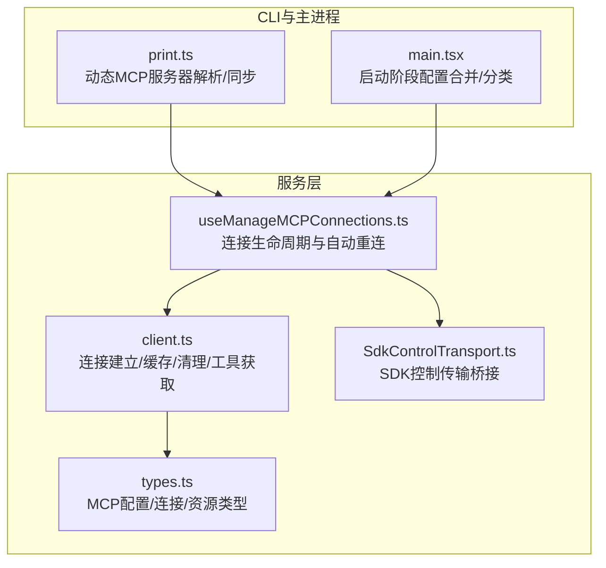
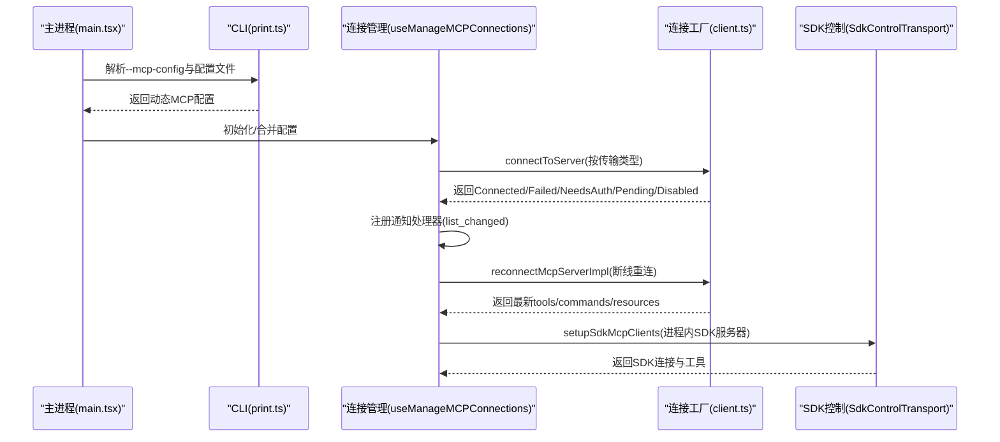
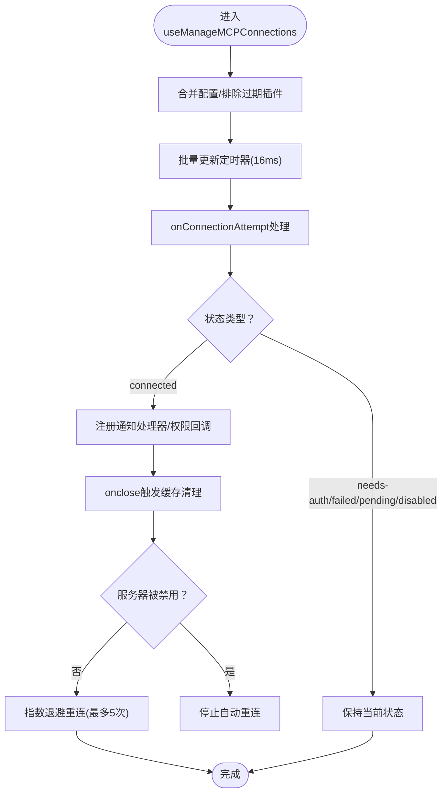
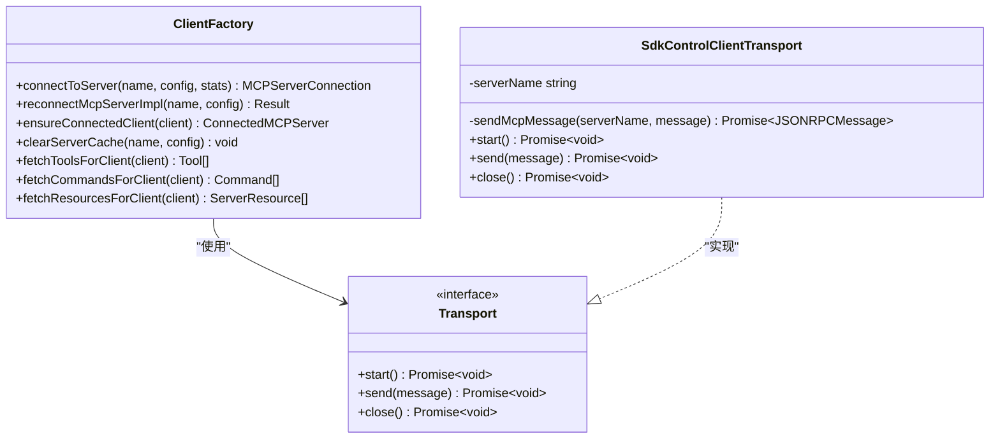
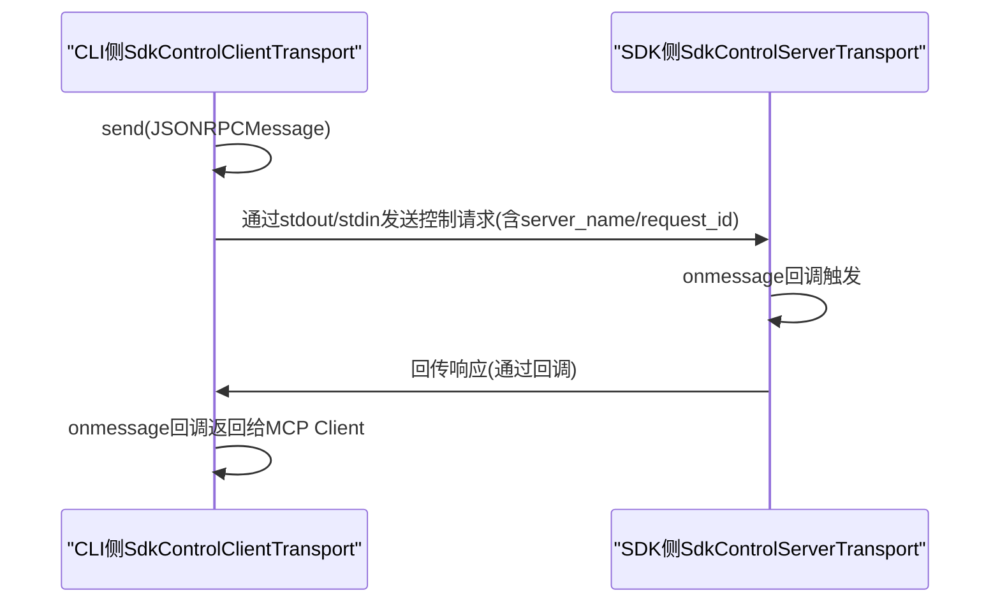
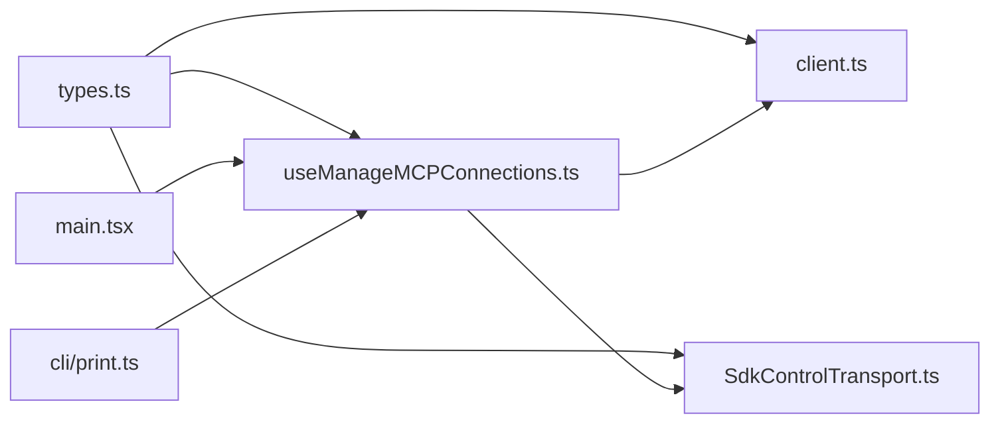

# 连接管理

<cite>
**本文引用的文件**
- [useManageMCPConnections.ts](file://src/services/mcp/useManageMCPConnections.ts)
- [client.ts](file://src/services/mcp/client.ts)
- [SdkControlTransport.ts](file://src/services/mcp/SdkControlTransport.ts)
- [types.ts](file://src/services/mcp/types.ts)
- [print.ts](file://src/cli/print.ts)
- [main.tsx](file://src/main.tsx)
- [cli/print.ts](file://src/cli/print.ts)
- [useManageMCPConnections.ts](file://src/services/mcp/useManageMCPConnections.ts)
</cite>

## 目录
1. [简介](#简介)
2. [项目结构](#项目结构)
3. [核心组件](#核心组件)
4. [架构总览](#架构总览)
5. [详细组件分析](#详细组件分析)
6. [依赖关系分析](#依赖关系分析)
7. [性能考量](#性能考量)
8. [故障排查指南](#故障排查指南)
9. [结论](#结论)
10. [附录](#附录)

## 简介
本文件面向MCP（Model Context Protocol）连接管理系统的技术文档，聚焦于连接管理器的架构设计与实现原理，涵盖MCP客户端生命周期管理（连接建立、维护、重连与断开）、SDK控制传输机制、连接状态监控与错误处理策略、连接池与资源优化、连接配置与超时/重试机制，并提供故障排查与性能优化建议。文档以代码为依据，结合可视化图示帮助读者快速理解系统行为。

## 项目结构
围绕MCP连接管理的关键模块分布如下：
- 服务层：连接管理与工具/资源获取、通知处理、SDK MCP服务器桥接等
- 类型定义：MCP服务器配置、连接状态、能力与资源类型
- CLI集成：动态MCP服务器的解析与同步、SDK MCP服务器占位与初始化
- 主进程：启动阶段合并CLI参数与文件配置，分离SDK与常规MCP配置

**图表来源**
- [useManageMCPConnections.ts:143-1142](file://src/services/mcp/useManageMCPConnections.ts#L143-L1142)
- [client.ts:595-1641](file://src/services/mcp/client.ts#L595-L1641)
- [SdkControlTransport.ts:1-137](file://src/services/mcp/SdkControlTransport.ts#L1-L137)
- [types.ts:1-259](file://src/services/mcp/types.ts#L1-L259)
- [print.ts:5446-5479](file://src/cli/print.ts#L5446-L5479)
- [main.tsx:1413-2402](file://src/main.tsx#L1413-L2402)

**章节来源**
- [useManageMCPConnections.ts:143-1142](file://src/services/mcp/useManageMCPConnections.ts#L143-L1142)
- [client.ts:595-1641](file://src/services/mcp/client.ts#L595-L1641)
- [SdkControlTransport.ts:1-137](file://src/services/mcp/SdkControlTransport.ts#L1-L137)
- [types.ts:1-259](file://src/services/mcp/types.ts#L1-L259)
- [print.ts:5446-5479](file://src/cli/print.ts#L5446-L5479)
- [main.tsx:1413-2402](file://src/main.tsx#L1413-L2402)

## 核心组件
- 连接管理钩子：负责初始化MCP服务器列表、批量更新状态、注册通知处理器、自动重连与断开清理
- 连接工厂与缓存：封装不同传输类型的连接创建、超时控制、错误分类、连接关闭与清理
- SDK控制传输：在CLI与SDK进程之间桥接MCP消息，支持SDK内嵌MCP服务器
- 类型系统：统一描述MCP服务器配置、连接状态、能力与资源
- CLI动态同步：解析/合并动态配置，识别SDK MCP服务器并创建占位配置

**章节来源**
- [useManageMCPConnections.ts:143-1142](file://src/services/mcp/useManageMCPConnections.ts#L143-L1142)
- [client.ts:595-1641](file://src/services/mcp/client.ts#L595-L1641)
- [SdkControlTransport.ts:1-137](file://src/services/mcp/SdkControlTransport.ts#L1-L137)
- [types.ts:1-259](file://src/services/mcp/types.ts#L1-L259)
- [print.ts:2861-2878](file://src/cli/print.ts#L2861-L2878)

## 架构总览
MCP连接管理由“配置解析—连接建立—状态维护—自动重连—资源发现—通知处理”构成闭环。关键路径：
- 启动阶段：主进程合并CLI与文件配置，区分SDK与常规MCP配置
- 动态同步：CLI解析动态MCP服务器，与当前状态对比，增删改按需重建
- 连接建立：按传输类型选择对应Transport，注入认证与代理，设置超时与请求头
- 状态维护：onclose/onerror触发缓存清理与重连；通知处理器响应list_changed事件
- 资源发现：并发拉取tools/prompts/resources，按能力决定是否加载资源工具
- SDK桥接：通过SdkControlClientTransport/SdkControlServerTransport在进程间转发消息

**图表来源**
- [main.tsx:1413-2402](file://src/main.tsx#L1413-L2402)
- [print.ts:5446-5479](file://src/cli/print.ts#L5446-L5479)
- [useManageMCPConnections.ts:310-763](file://src/services/mcp/useManageMCPConnections.ts#L310-L763)
- [client.ts:595-1641](file://src/services/mcp/client.ts#L595-L1641)
- [SdkControlTransport.ts:1-137](file://src/services/mcp/SdkControlTransport.ts#L1-L137)

## 详细组件分析

### 组件A：连接生命周期管理（useManageMCPConnections）
职责与特性：
- 初始化：将现有配置与动态配置合并，排除过期插件服务器，批量更新状态
- 生命周期回调：onConnectionAttempt统一处理连接结果，注册通知处理器与权限回调
- 断线重连：对非本地传输（非stdio/sdk）进行指数退避重连，支持取消与最大尝试次数
- 批量更新：16ms时间窗口聚合状态变更，减少渲染抖动
- 通知处理：监听tools/prompts/resources的list_changed，触发缓存失效与重新拉取
- 渠道通知：在特定特性开启时，注册claude/channel相关通知处理器

**图表来源**
- [useManageMCPConnections.ts:293-763](file://src/services/mcp/useManageMCPConnections.ts#L293-L763)

**章节来源**
- [useManageMCPConnections.ts:143-1142](file://src/services/mcp/useManageMCPConnections.ts#L143-L1142)

### 组件B：连接工厂与缓存（client.ts）
职责与特性：
- 连接创建：根据配置类型选择SSE/HTTP/WebSocket/stdio/SDK/IDE等传输
- 认证与代理：注入OAuth令牌、会话入口令牌、代理选项；HTTP包装超时与Accept头
- 超时控制：连接超时（默认30秒）、请求超时（默认60秒）、工具调用超时（可配置）
- 错误分类：UnauthorizedError、Session not found（404+JSON-RPC -32001）、终端网络错误
- 缓存与清理：memoized连接缓存、fetch缓存（LRU），onclose清理缓存并关闭子进程
- 工具/资源获取：并发拉取tools/prompts/resources，按能力决定是否加载资源工具
- SDK MCP：setupSdkMcpClients直接创建Client并通过SdkControlClientTransport连接

**图表来源**
- [client.ts:595-1641](file://src/services/mcp/client.ts#L595-L1641)
- [SdkControlTransport.ts:60-136](file://src/services/mcp/SdkControlTransport.ts#L60-L136)

**章节来源**
- [client.ts:595-1641](file://src/services/mcp/client.ts#L595-L1641)
- [SdkControlTransport.ts:1-137](file://src/services/mcp/SdkControlTransport.ts#L1-L137)

### 组件C：SDK控制传输（SdkControlTransport）
职责与特性：
- 双向桥接：CLI侧SdkControlClientTransport与SDK侧SdkControlServerTransport
- 消息路由：通过server_name与request_id确保多服务器场景下的正确关联
- 关闭语义：两端均支持close，触发onclose回调
- 协议一致性：遵循MCP JSON-RPC消息格式，保留消息ID用于correlation

**图表来源**
- [SdkControlTransport.ts:1-137](file://src/services/mcp/SdkControlTransport.ts#L1-L137)

**章节来源**
- [SdkControlTransport.ts:1-137](file://src/services/mcp/SdkControlTransport.ts#L1-L137)

### 组件D：类型系统（types.ts）
职责与特性：
- 配置类型：stdio/sse/sse-ide/ws-ide/http/ws/sdk/claudeai-proxy
- 连接状态：connected/failed/needs-auth/pending/disabled
- 能力与资源：ServerCapabilities、ServerResource、SerializedTool/Client/State
- 配置作用域：local/user/project/dynamic/enterprise/claudeai/managed

**章节来源**
- [types.ts:1-259](file://src/services/mcp/types.ts#L1-L259)

### 组件E：CLI动态MCP服务器解析与同步（print.ts）
职责与特性：
- 动态配置解析：从initialize消息中提取SDK MCP服务器名称，创建占位配置
- 增量同步：对比当前状态与期望配置，计算新增/删除/替换，按需重建
- 配置变更检测：基于areMcpConfigsEqual判断是否需要替换

**章节来源**
- [print.ts:2861-2878](file://src/cli/print.ts#L2861-L2878)
- [print.ts:5446-5479](file://src/cli/print.ts#L5446-L5479)

## 依赖关系分析
- useManageMCPConnections依赖client.ts中的连接工厂、重连实现与工具/资源拉取
- client.ts依赖SdkControlTransport用于SDK MCP服务器桥接
- main.tsx与CLI print.ts共同决定初始配置与动态配置的来源与优先级
- types.ts为上述模块提供统一的类型约束

**图表来源**
- [types.ts:1-259](file://src/services/mcp/types.ts#L1-L259)
- [useManageMCPConnections.ts:1-1142](file://src/services/mcp/useManageMCPConnections.ts#L1-L1142)
- [client.ts:1-1641](file://src/services/mcp/client.ts#L1-L1641)
- [SdkControlTransport.ts:1-137](file://src/services/mcp/SdkControlTransport.ts#L1-L137)
- [main.tsx:1413-2402](file://src/main.tsx#L1413-L2402)
- [print.ts:5446-5479](file://src/cli/print.ts#L5446-L5479)

**章节来源**
- [useManageMCPConnections.ts:1-1142](file://src/services/mcp/useManageMCPConnections.ts#L1-L1142)
- [client.ts:1-1641](file://src/services/mcp/client.ts#L1-L1641)
- [types.ts:1-259](file://src/services/mcp/types.ts#L1-L259)
- [main.tsx:1413-2402](file://src/main.tsx#L1413-L2402)
- [print.ts:5446-5479](file://src/cli/print.ts#L5446-L5479)

## 性能考量
- 并发连接：本地服务器（stdio/sdk）低并发，远程服务器高并发，避免进程/网络竞争
- 批处理调度：pMap替代固定批次顺序，空闲槽位尽快释放，提升整体吞吐
- 缓存策略：连接与fetch结果LRU缓存，配合onclose清理，避免陈旧数据
- 批量状态更新：16ms窗口聚合，降低频繁渲染成本
- 大输出处理：超过阈值时持久化到文件并返回指引，避免内存与上下文溢出
- 超时与背压：连接/请求/工具调用超时，防止长时间阻塞；指数退避重连避免风暴

[本节为通用指导，无需具体文件引用]

## 故障排查指南
常见问题与定位要点：
- 连接超时：检查MCP_TIMEOUT（连接超时，默认30秒）、MCP_REQUEST_TIMEOUT（请求超时，默认60秒）、MCP_TOOL_TIMEOUT（工具调用超时，可配置）
- 401未授权：OAuth令牌过期或缺失，触发needs-auth状态；可通过claude.ai代理重试与刷新
- 会话过期：HTTP/claudeai-proxy返回404+JSON-RPC -32001或连接被SDK标记为closed，清除缓存后重连
- 终端网络错误：ECONNRESET/ETIMEDOUT/EHOSTUNREACH等，达到阈值后主动关闭并触发重连
- SSE断流：SDK在耗尽内部重连次数后不触发onclose，需通过错误信号触发关闭
- SDK MCP无法连接：确认CLI与SDK进程间控制通道正常，server_name与request_id匹配

**章节来源**
- [client.ts:211-229](file://src/services/mcp/client.ts#L211-L229)
- [client.ts:456-463](file://src/services/mcp/client.ts#L456-L463)
- [client.ts:1020-1077](file://src/services/mcp/client.ts#L1020-L1077)
- [client.ts:1313-1371](file://src/services/mcp/client.ts#L1313-L1371)
- [client.ts:3200-3232](file://src/services/mcp/client.ts#L3200-L3232)

## 结论
该MCP连接管理系统通过“配置解析—连接工厂—状态维护—自动重连—资源发现—通知处理”的完整链路，实现了对多传输类型、多服务器场景的稳健支持。其关键优势在于：
- 明确的生命周期与状态机，便于调试与可观测性
- 针对远程传输的指数退避重连与缓存清理，提升鲁棒性
- SDK控制传输桥接，使SDK内嵌服务器无缝接入
- 并发与批处理优化，兼顾吞吐与稳定性
- 完善的超时与错误分类，便于快速定位问题

## 附录

### 连接配置与超时/重试参数
- 连接超时：MCP_TIMEOUT（默认30秒）
- 请求超时：MCP_REQUEST_TIMEOUT（默认60秒）
- 工具调用超时：MCP_TOOL_TIMEOUT（默认约27.8小时，可覆盖）
- 连接并发：MCP_SERVER_CONNECTION_BATCH_SIZE（本地，默认3）与MCP_REMOTE_SERVER_CONNECTION_BATCH_SIZE（远程，默认20）
- 自动重连：最大尝试5次，初始1秒，上限30秒，指数退避

**章节来源**
- [client.ts:211-229](file://src/services/mcp/client.ts#L211-L229)
- [client.ts:456-463](file://src/services/mcp/client.ts#L456-L463)
- [client.ts:552-561](file://src/services/mcp/client.ts#L552-L561)
- [useManageMCPConnections.ts:87-90](file://src/services/mcp/useManageMCPConnections.ts#L87-L90)