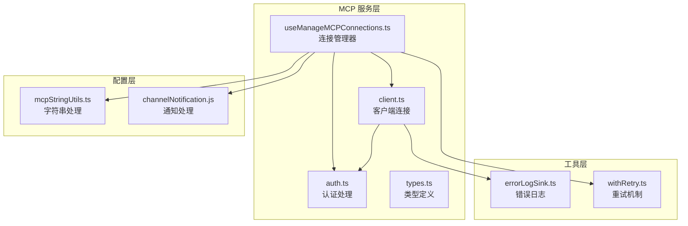
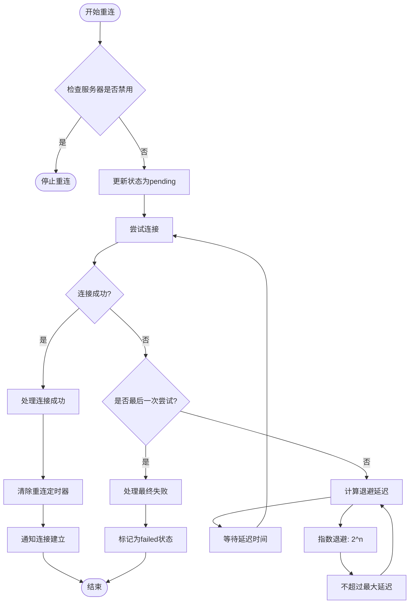
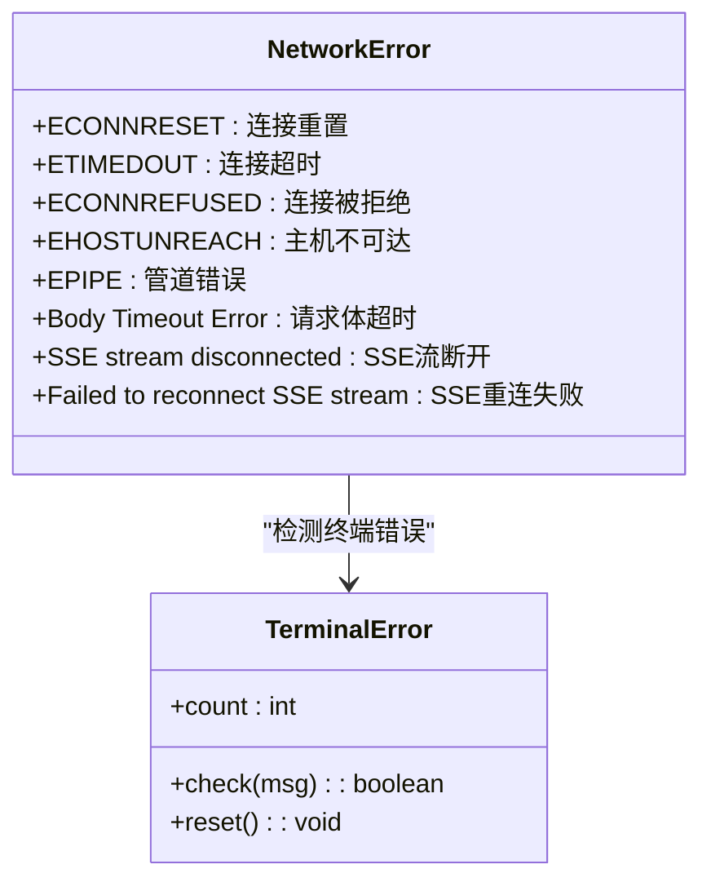
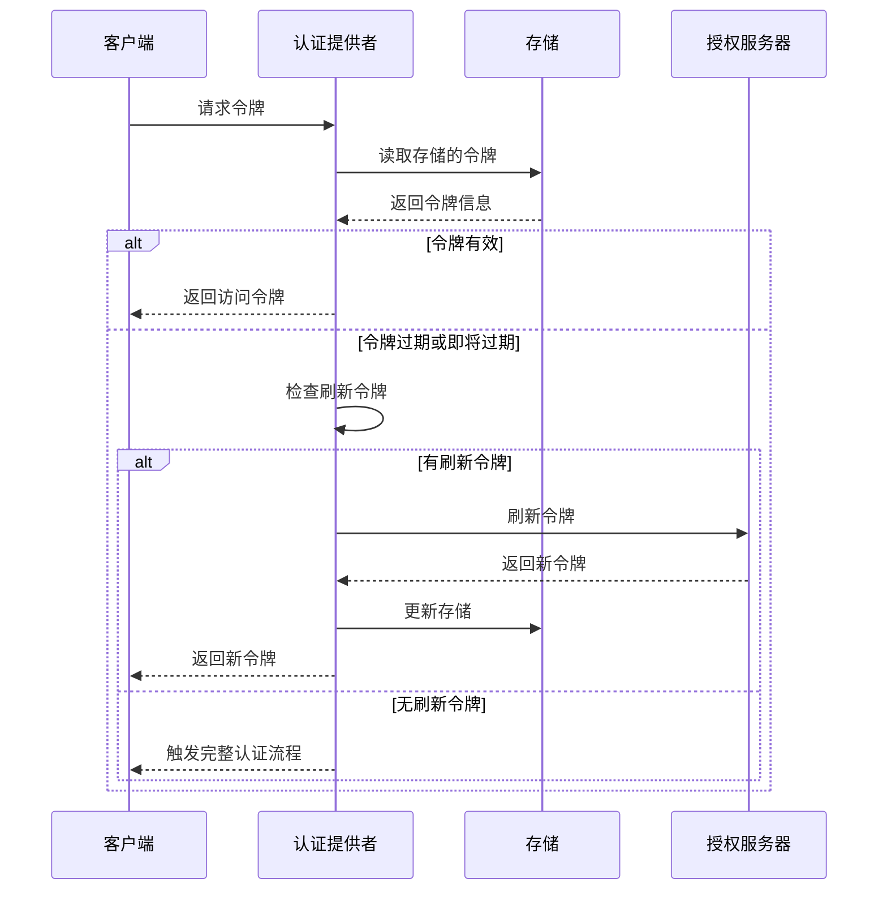
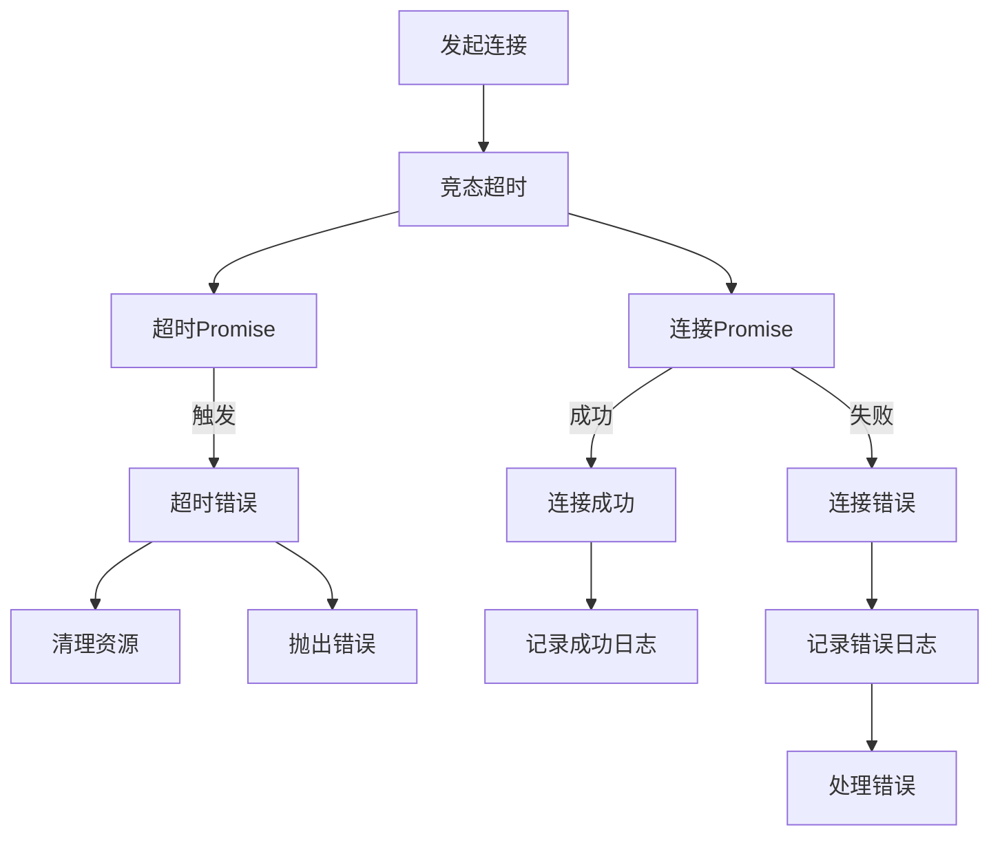
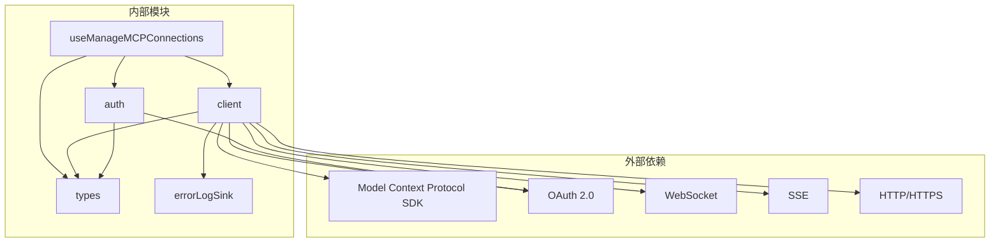

# 错误处理和重连机制

<cite>
**本文档引用的文件**
- [useManageMCPConnections.ts](file://src/services/mcp/useManageMCPConnections.ts)
- [client.ts](file://src/services/mcp/client.ts)
- [auth.ts](file://src/services/mcp/auth.ts)
- [types.ts](file://src/services/mcp/types.ts)
- [errorLogSink.ts](file://src/utils/errorLogSink.ts)
</cite>

## 目录
1. [简介](#简介)
2. [项目结构](#项目结构)
3. [核心组件](#核心组件)
4. [架构概览](#架构概览)
5. [详细组件分析](#详细组件分析)
6. [依赖关系分析](#依赖关系分析)
7. [性能考虑](#性能考虑)
8. [故障排除指南](#故障排除指南)
9. [结论](#结论)

## 简介

本文档深入分析了 Claude Code 源码中 MCP（Model Context Protocol）连接的错误处理和重连机制。该系统实现了完善的错误分类、自动重连算法、认证错误处理、超时管理和日志记录机制。

MCP 连接错误处理机制涵盖了以下主要场景：
- 网络错误：连接重置、超时、拒绝连接、主机不可达等
- 认证失败：OAuth 令牌过期、401 未授权、权限不足等
- 协议错误：会话过期、连接关闭、协议不匹配等
- 资源不足：内存不足、进程终止、资源耗尽等

## 项目结构

MCP 错误处理和重连机制主要分布在以下文件中：



**图表来源**
- [useManageMCPConnections.ts:1-1142](file://src/services/mcp/useManageMCPConnections.ts#L1-L1142)
- [client.ts:1-3349](file://src/services/mcp/client.ts#L1-L3349)
- [auth.ts:1-2466](file://src/services/mcp/auth.ts#L1-L2466)

**章节来源**
- [useManageMCPConnections.ts:1-1142](file://src/services/mcp/useManageMCPConnections.ts#L1-L1142)
- [client.ts:1-3349](file://src/services/mcp/client.ts#L1-L3349)
- [auth.ts:1-2466](file://src/services/mcp/auth.ts#L1-L2466)

## 核心组件

### 连接管理器 (useManageMCPConnections)

连接管理器是整个错误处理系统的核心组件，负责：

- **自动重连管理**：实现指数退避算法，支持最多5次重试
- **状态跟踪**：维护服务器连接状态（connected、failed、pending、disabled）
- **批量更新**：优化状态更新性能，避免频繁的 UI 重渲染
- **错误分类**：根据错误类型执行相应的处理策略

### 客户端连接 (client.ts)

客户端连接组件提供了全面的错误检测和处理能力：

- **连接超时**：支持可配置的连接超时时间（默认30秒）
- **传输类型支持**：支持 SSE、HTTP、WebSocket、stdio 等多种传输方式
- **会话管理**：自动检测和处理会话过期
- **资源清理**：确保连接断开时进行适当的资源清理

### 认证处理 (auth.ts)

认证处理模块专门负责 OAuth 认证相关的错误处理：

- **令牌刷新**：实现智能的令牌刷新机制
- **步骤升级**：处理权限提升场景
- **跨应用访问**：支持 XAA（Cross-App Access）认证
- **错误恢复**：提供多种认证失败的恢复策略

**章节来源**
- [useManageMCPConnections.ts:87-91](file://src/services/mcp/useManageMCPConnections.ts#L87-L91)
- [client.ts:210-229](file://src/services/mcp/client.ts#L210-L229)
- [auth.ts:64-65](file://src/services/mcp/auth.ts#L64-L65)

## 架构概览

MCP 错误处理和重连机制采用分层架构设计：

```mermaid
sequenceDiagram
participant App as 应用程序
participant Manager as 连接管理器
participant Client as 客户端
participant Auth as 认证模块
participant Server as MCP服务器
App->>Manager : 初始化连接
Manager->>Client : 建立连接
Client->>Server : 发送连接请求
Server-->>Client : 返回连接结果
alt 连接成功
Client->>Manager : 通知连接建立
Manager->>Manager : 更新状态为connected
Manager->>Manager : 注册事件处理器
else 连接失败
Client->>Manager : 通知连接失败
Manager->>Manager : 检查错误类型
alt 可重连错误
Manager->>Manager : 启动指数退避重连
loop 最多5次重试
Manager->>Client : 尝试重连
Client->>Server : 发送连接请求
Server-->>Client : 返回连接结果
alt 重连成功
Client->>Manager : 通知重连成功
Manager->>Manager : 更新状态为connected
break
else 重连失败
Manager->>Manager : 计算下一次重连延迟
end
end
Manager->>Manager : 标记为failed状态
else 不可重连错误
Manager->>Manager : 直接标记为failed
end
end
```

**图表来源**
- [useManageMCPConnections.ts:371-462](file://src/services/mcp/useManageMCPConnections.ts#L371-L462)
- [client.ts:1048-1155](file://src/services/mcp/client.ts#L1048-L1155)

## 详细组件分析

### 自动重连算法

系统实现了完善的指数退避重连算法：



**图表来源**
- [useManageMCPConnections.ts:446-461](file://src/services/mcp/useManageMCPConnections.ts#L446-L461)

#### 重连参数配置

系统使用以下常量配置重连行为：

- **最大重试次数**：5次
- **初始退避延迟**：1000ms
- **最大退避延迟**：30000ms
- **退避倍数**：2^n

#### 重连触发条件

自动重连仅在以下情况下触发：
- 远程传输类型（非本地进程）
- 非 SDK 内部传输
- 服务器未被禁用
- 连接意外断开而非正常关闭

**章节来源**
- [useManageMCPConnections.ts:87-91](file://src/services/mcp/useManageMCPConnections.ts#L87-L91)
- [useManageMCPConnections.ts:370-467](file://src/services/mcp/useManageMCPConnections.ts#L370-L467)

### 错误分类和处理策略

系统对不同类型的错误进行了详细的分类和处理：

#### 网络错误处理



**图表来源**
- [client.ts:1249-1263](file://src/services/mcp/client.ts#L1249-L1263)

系统通过 `isTerminalConnectionError` 函数检测终端网络错误，并设置最大连续错误次数为3次。

#### 认证错误处理

认证错误处理机制包括：

- **401 未授权错误**：触发认证流程
- **令牌过期**：自动刷新令牌
- **权限不足**：提示用户进行权限提升
- **会话过期**：清理缓存并重新建立连接

**章节来源**
- [client.ts:1313-1329](file://src/services/mcp/client.ts#L1313-L1329)
- [client.ts:340-361](file://src/services/mcp/client.ts#L340-L361)

### 认证错误处理机制

#### 令牌刷新流程



**图表来源**
- [auth.ts:1540-1667](file://src/services/mcp/auth.ts#L1540-L1667)

#### 步骤升级处理

系统支持 OAuth 权限的逐步提升：

- **403 权限不足**：检测 `WWW-Authenticate` 头中的 `insufficient_scope`
- **权限提升**：标记步骤升级待处理状态
- **重新认证**：跳过刷新令牌直接进行新的授权流程

**章节来源**
- [auth.ts:1354-1374](file://src/services/mcp/auth.ts#L1354-L1374)
- [auth.ts:1468-1471](file://src/services/mcp/auth.ts#L1468-L1471)

### 超时处理和连接中断恢复

#### 连接超时处理

系统实现了多层次的超时保护：



**图表来源**
- [client.ts:1048-1080](file://src/services/mcp/client.ts#L1048-L1080)

#### 连接中断检测

系统通过增强的错误处理器检测连接中断：

- **连续错误计数**：统计连续的终端网络错误
- **最大错误阈值**：达到3次后自动触发重连
- **错误类型识别**：区分终端错误和瞬时错误

**章节来源**
- [client.ts:1020-1080](file://src/services/mcp/client.ts#L1020-L1080)
- [client.ts:1265-1371](file://src/services/mcp/client.ts#L1265-L1371)

### 错误恢复机制

#### 连接状态回滚

当连接失败时，系统执行以下回滚操作：

- **状态重置**：将服务器状态重置为 `failed`
- **缓存清理**：清除连接缓存以避免使用过期连接
- **资源释放**：释放所有相关的系统资源

#### 资源清理

系统确保在连接断开时进行完整的资源清理：

- **进程终止**：对于本地进程传输，发送适当的信号终止子进程
- **文件描述符**：关闭所有打开的文件描述符
- **内存释放**：清理内存中的临时数据
- **网络连接**：关闭所有网络连接

**章节来源**
- [client.ts:1404-1570](file://src/services/mcp/client.ts#L1404-L1570)

### 数据同步机制

#### 工具和资源同步

系统维护工具和资源的同步状态：

- **工具列表**：自动同步可用的工具列表
- **提示词列表**：同步可用的提示词模板
- **资源列表**：同步可用的资源文件
- **技能索引**：维护 MCP 技能的索引状态

#### 缓存管理

系统使用智能缓存策略：

- **连接缓存**：缓存连接对象以提高性能
- **工具缓存**：缓存工具元数据以减少网络请求
- **资源缓存**：缓存资源内容以提高响应速度
- **失效策略**：基于时间戳和内容哈希的缓存失效机制

**章节来源**
- [client.ts:1383-1397](file://src/services/mcp/client.ts#L1383-L1397)

## 依赖关系分析



**图表来源**
- [useManageMCPConnections.ts:1-64](file://src/services/mcp/useManageMCPConnections.ts#L1-L64)
- [client.ts:1-128](file://src/services/mcp/client.ts#L1-L128)

系统的主要依赖关系包括：

- **Model Context Protocol SDK**：提供核心的 MCP 协议实现
- **OAuth 2.0**：处理认证和授权流程
- **WebSocket 和 SSE**：支持实时通信
- **HTTP/HTTPS**：支持基于 HTTP 的通信

**章节来源**
- [types.ts:1-259](file://src/services/mcp/types.ts#L1-L259)

## 性能考虑

### 批量更新优化

系统使用批量更新机制优化性能：

- **批量刷新**：16ms 时间窗口内的更新合并
- **状态去重**：避免重复的状态更新
- **异步处理**：使用异步队列处理更新操作

### 连接池管理

系统实现了智能的连接池管理：

- **连接复用**：避免频繁创建和销毁连接
- **资源限制**：限制同时活跃的连接数量
- **健康检查**：定期检查连接的健康状态

### 内存管理

系统采用多种内存管理策略：

- **缓存淘汰**：基于 LRU 的缓存淘汰策略
- **垃圾回收**：及时释放不再使用的对象
- **内存监控**：监控内存使用情况并采取预防措施

## 故障排除指南

### 常见问题诊断

#### 连接超时问题

**症状**：连接在30秒内超时

**诊断步骤**：
1. 检查网络连接状态
2. 验证服务器地址和端口
3. 查看防火墙设置
4. 检查代理配置

**解决方案**：
- 增加超时时间配置
- 检查网络路由
- 配置正确的代理设置

#### 认证失败问题

**症状**：出现401未授权错误

**诊断步骤**：
1. 检查OAuth配置
2. 验证客户端凭据
3. 查看令牌状态
4. 检查权限范围

**解决方案**：
- 重新配置OAuth设置
- 刷新或重新获取令牌
- 调整权限范围

#### 重连失败问题

**症状**：自动重连多次失败后标记为failed

**诊断步骤**：
1. 检查服务器状态
2. 查看网络连接
3. 检查防火墙规则
4. 验证服务器负载

**解决方案**：
- 手动重连服务器
- 检查服务器配置
- 调整重连参数

### 日志分析

系统提供了详细的日志记录机制：

#### 错误日志格式

系统使用统一的日志格式：

- **时间戳**：精确到毫秒的时间戳
- **服务器名称**：发生错误的MCP服务器标识
- **错误类型**：具体的错误类别
- **错误详情**：详细的错误描述和堆栈信息
- **诊断信息**：相关的诊断和调试信息

#### 日志级别

系统支持多种日志级别：

- **DEBUG**：详细的技术信息，用于开发调试
- **ERROR**：严重的错误信息
- **WARNING**：潜在的问题警告
- **INFO**：一般性的信息

**章节来源**
- [errorLogSink.ts:212-235](file://src/utils/errorLogSink.ts#L212-L235)

### 性能调优建议

#### 连接参数调优

- **重试次数**：根据网络环境调整最大重试次数
- **退避延迟**：根据服务器响应时间调整初始延迟
- **超时设置**：根据网络状况调整连接超时时间

#### 资源管理调优

- **缓存大小**：根据内存限制调整缓存大小
- **连接池大小**：根据服务器性能调整连接池大小
- **并发限制**：根据系统资源调整并发操作限制

## 结论

Claude Code 中的 MCP 连接错误处理和重连机制展现了高度的工程化水平。系统通过分层架构设计、完善的错误分类、智能的重连算法和全面的监控机制，为用户提供稳定可靠的 MCP 连接体验。

主要特点包括：

1. **多层次的错误处理**：从网络层到应用层的全方位错误检测和处理
2. **智能的重连机制**：基于指数退避的自适应重连算法
3. **完善的认证支持**：支持多种认证方式和权限管理
4. **全面的监控和日志**：提供详细的诊断信息和性能指标
5. **优雅的资源管理**：确保连接断开时的完整资源清理

这些特性使得系统能够在各种复杂的网络环境下保持稳定的连接状态，为开发者提供了可靠的 MCP 服务集成基础。