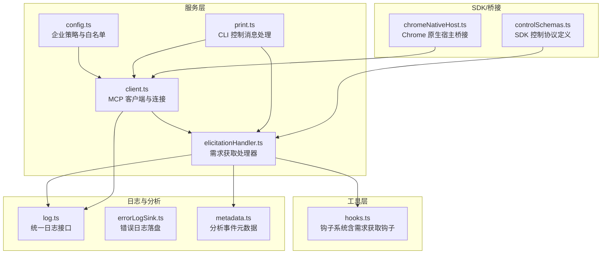
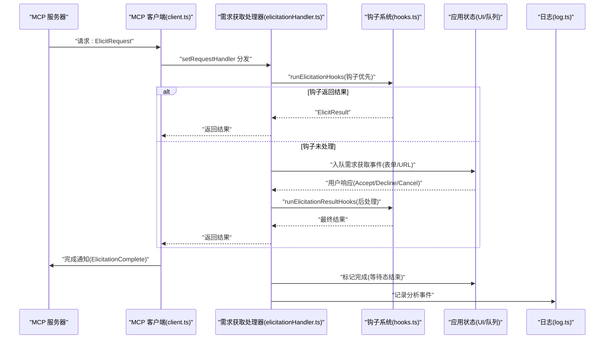
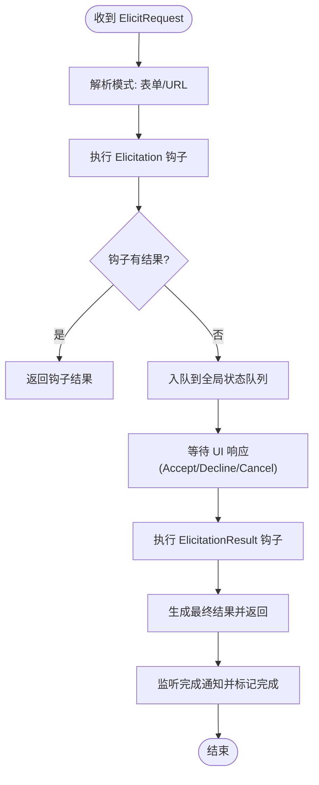
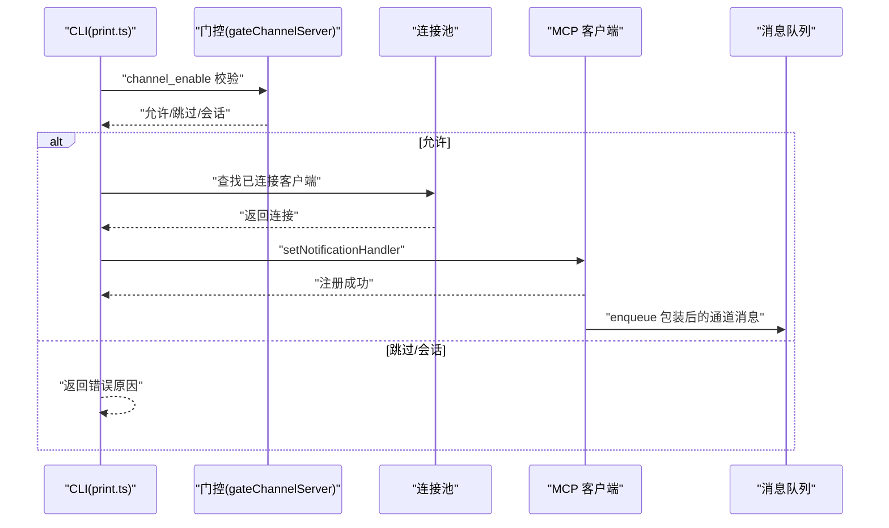
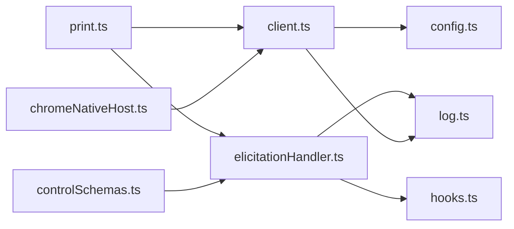

# 需求获取处理

<cite>
**本文引用的文件**
- [elicitationHandler.ts](file://src/services/mcp/elicitationHandler.ts)
- [client.ts](file://src/services/mcp/client.ts)
- [config.ts](file://src/services/mcp/config.ts)
- [print.ts](file://src/cli/print.ts)
- [hooks.ts](file://src/utils/hooks.ts)
- [log.ts](file://src/utils/log.ts)
- [errorLogSink.ts](file://src/utils/errorLogSink.ts)
- [metadata.ts](file://src/services/analytics/metadata.ts)
- [controlSchemas.ts](file://src/entrypoints/sdk/controlSchemas.ts)
- [chromeNativeHost.ts](file://src/utils/claudeInChrome/chromeNativeHost.ts)
- [MonitorMcpTask.js](file://tasks/MonitorMcpTask/MonitorMcpTask.js)
</cite>

## 目录
1. [简介](#简介)
2. [项目结构](#项目结构)
3. [核心组件](#核心组件)
4. [架构总览](#架构总览)
5. [详细组件分析](#详细组件分析)
6. [依赖关系分析](#依赖关系分析)
7. [性能考量](#性能考量)
8. [故障排除指南](#故障排除指南)
9. [结论](#结论)
10. [附录](#附录)

## 简介
本文件系统化阐述 Claude Code 源码中“MCP 需求获取（Elicitation）”处理体系的设计与实现，涵盖以下关键主题：
- 需求获取的概念与在 MCP 中的作用：用于向用户请求输入或确认，支持表单与 URL 两种模式；在工具调用前或错误重试场景中触发。
- 需求获取处理器的实现机制与工作流程：包括请求接收、钩子优先响应、UI 队列展示、结果后处理钩子、完成通知处理等。
- 通道通知系统的配置与管理：如何启用插件来源的通道消息订阅，以及断连后的重新注册。
- 通道白名单与访问控制策略：基于插件标识与市场来源的准入控制，结合能力门控与幂等写入。
- 触发条件与响应机制：何时触发需求获取（显式请求、错误重试）、如何响应（接受/拒绝/取消）及后续处理。
- 调试与监控：日志记录、错误队列、分析事件埋点、错误日志落盘与查看路径。
- 优化建议与故障排除：连接超时、认证失败缓存、钩子执行超时、通道消息丢失等问题的定位与修复。

## 项目结构
围绕需求获取处理的相关模块主要分布在以下目录：
- 服务层：MCP 客户端、配置、通道与通知处理
- 工具层：钩子系统（含需求获取钩子）
- 日志与分析：统一错误日志与分析事件
- CLI：控制消息处理（如 channel_enable）
- SDK：控制协议中的需求获取请求/响应定义

图表来源
- [elicitationHandler.ts:1-314](file://src/services/mcp/elicitationHandler.ts#L1-L314)
- [client.ts:1-800](file://src/services/mcp/client.ts#L1-L800)
- [config.ts:1-800](file://src/services/mcp/config.ts#L1-L800)
- [print.ts:4700-4835](file://src/cli/print.ts#L4700-L4835)
- [hooks.ts:1-800](file://src/utils/hooks.ts#L1-L800)
- [log.ts:1-363](file://src/utils/log.ts#L1-L363)
- [errorLogSink.ts:212-235](file://src/utils/errorLogSink.ts#L212-L235)
- [metadata.ts:118-184](file://src/services/analytics/metadata.ts#L118-L184)
- [controlSchemas.ts:522-545](file://src/entrypoints/sdk/controlSchemas.ts#L522-L545)
- [chromeNativeHost.ts:295-385](file://src/utils/claudeInChrome/chromeNativeHost.ts#L295-L385)

章节来源
- [elicitationHandler.ts:1-314](file://src/services/mcp/elicitationHandler.ts#L1-L314)
- [client.ts:1-800](file://src/services/mcp/client.ts#L1-L800)
- [config.ts:1-800](file://src/services/mcp/config.ts#L1-L800)
- [print.ts:4700-4835](file://src/cli/print.ts#L4700-L4835)
- [hooks.ts:1-800](file://src/utils/hooks.ts#L1-L800)
- [log.ts:1-363](file://src/utils/log.ts#L1-L363)
- [errorLogSink.ts:212-235](file://src/utils/errorLogSink.ts#L212-L235)
- [metadata.ts:118-184](file://src/services/analytics/metadata.ts#L118-L184)
- [controlSchemas.ts:522-545](file://src/entrypoints/sdk/controlSchemas.ts#L522-L545)
- [chromeNativeHost.ts:295-385](file://src/utils/claudeInChrome/chromeNativeHost.ts#L295-L385)

## 核心组件
- 需求获取处理器（elicitationHandler.ts）
  - 注册请求处理器与完成通知处理器
  - 支持钩子优先响应与结果后处理钩子
  - 维护等待态与完成态，驱动 UI 展示与交互
- MCP 客户端（client.ts）
  - 连接建立、能力声明、默认请求处理器（初始化阶段）
  - 认证失败处理与缓存、超时包装、代理与 mTLS 支持
- 钩子系统（hooks.ts）
  - 提供 Elicitation/ElicitationResult 钩子类型与执行框架
  - 支持同步/异步钩子、阻塞错误、权限决策等
- 通道通知与白名单（print.ts + client.ts）
  - channel_enable 控制消息处理与通道注册
  - 基于插件来源与市场标识的白名单准入控制
- 企业策略与白名单（config.ts）
  - 名称/命令/URL 多维度策略匹配
  - 允许/拒绝列表合并与过滤
- 日志与分析（log.ts + errorLogSink.ts + metadata.ts）
  - 统一错误与调试日志接口
  - 错误日志落盘与分析事件埋点
- SDK 控制协议（controlSchemas.ts）
  - 定义 SDK 控制消息中的需求获取请求/响应结构
- Chrome 原生桥接（chromeNativeHost.ts）
  - 将工具响应与通知转发至 MCP 客户端

章节来源
- [elicitationHandler.ts:68-212](file://src/services/mcp/elicitationHandler.ts#L68-L212)
- [client.ts:1173-1197](file://src/services/mcp/client.ts#L1173-L1197)
- [hooks.ts:103-109](file://src/utils/hooks.ts#L103-L109)
- [print.ts:4700-4768](file://src/cli/print.ts#L4700-L4768)
- [config.ts:410-508](file://src/services/mcp/config.ts#L410-L508)
- [log.ts:300-326](file://src/utils/log.ts#L300-L326)
- [errorLogSink.ts:212-235](file://src/utils/errorLogSink.ts#L212-L235)
- [metadata.ts:145-167](file://src/services/analytics/metadata.ts#L145-L167)
- [controlSchemas.ts:522-545](file://src/entrypoints/sdk/controlSchemas.ts#L522-L545)
- [chromeNativeHost.ts:295-385](file://src/utils/claudeInChrome/chromeNativeHost.ts#L295-L385)

## 架构总览
需求获取处理在 MCP 生态中的位置与交互如下：

图表来源
- [elicitationHandler.ts:68-212](file://src/services/mcp/elicitationHandler.ts#L68-L212)
- [client.ts:1173-1197](file://src/services/mcp/client.ts#L1173-L1197)
- [hooks.ts:674-706](file://src/utils/hooks.ts#L674-L706)
- [log.ts:300-326](file://src/utils/log.ts#L300-L326)

## 详细组件分析

### 需求获取处理器（elicitationHandler.ts）
- 请求处理器
  - 接收 ElicitRequest，解析模式（表单/URL），记录分析事件
  - 优先尝试执行 Elicitation 钩子；若钩子返回结果则直接返回
  - 若无钩子结果，则将请求入队到全局状态队列，等待 UI 响应
- 完成通知处理器
  - 监听 ElicitationComplete 通知，查找对应队列项并标记完成
  - 执行通知钩子，确保可观测性
- 结果后处理钩子
  - 在用户响应后执行 ElicitationResult 钩子，可覆盖动作/内容或阻止响应
- 关键数据结构
  - ElicitationRequestEvent：封装请求参数、信号、响应回调、等待态等
  - ElicitationWaitingState：URL 模式下的等待态提示

图表来源
- [elicitationHandler.ts:68-212](file://src/services/mcp/elicitationHandler.ts#L68-L212)
- [hooks.ts:674-706](file://src/utils/hooks.ts#L674-L706)

章节来源
- [elicitationHandler.ts:29-212](file://src/services/mcp/elicitationHandler.ts#L29-L212)
- [hooks.ts:674-706](file://src/utils/hooks.ts#L674-L706)

### MCP 客户端与连接（client.ts）
- 初始化阶段默认请求处理器
  - 在客户端能力声明前，设置默认的 ElicitRequest 处理器返回 cancel，避免过早阻塞
- 连接与认证
  - 包装 fetch 设置超时与 Streamable HTTP Accept 头
  - 处理 claude.ai 代理认证失败，缓存 needs-auth 状态
- 传输与安全
  - 支持 SSE/WebSocket/HTTP/STDIO 等多种传输
  - mTLS 代理与代理支持，保障远端连接稳定性
- 错误与会话
  - 识别会话过期错误，触发重连与状态更新
  - 认证缓存与并发写入串行化，避免竞态

章节来源
- [client.ts:1173-1197](file://src/services/mcp/client.ts#L1173-L1197)
- [client.ts:340-361](file://src/services/mcp/client.ts#L340-L361)
- [client.ts:492-550](file://src/services/mcp/client.ts#L492-L550)

### 通道通知系统与白名单（print.ts + client.ts）
- 控制消息处理
  - channel_enable：校验特性开关、连接状态、插件来源与市场标识
  - 幂等写入允许的通道条目，进行能力门控检查
  - 注册 ChannelMessageNotificationSchema 的通知处理器，将消息以特定优先级入队
- 断连后的重新注册
  - 在 mcp_reconnect/mcp_toggle 后，重新绑定通知处理器，避免消息静默丢失

图表来源
- [print.ts:4700-4768](file://src/cli/print.ts#L4700-L4768)
- [print.ts:4786-4835](file://src/cli/print.ts#L4786-L4835)

章节来源
- [print.ts:4700-4768](file://src/cli/print.ts#L4700-L4768)
- [print.ts:4786-4835](file://src/cli/print.ts#L4786-L4835)

### 企业策略与白名单（config.ts）
- 策略匹配
  - 名称/命令/URL 三类条目支持，URL 支持通配符正则转换
  - 允许列表为空时默认阻断；拒绝列表优先于允许列表
- 配置入口过滤
  - add/remove/get/filter 系列函数均结合策略进行验证与过滤
- 插件与企业独占
  - 企业配置存在时，其他来源被限制；插件独占策略下仅保留企业服务器

章节来源
- [config.ts:320-408](file://src/services/mcp/config.ts#L320-L408)
- [config.ts:417-508](file://src/services/mcp/config.ts#L417-L508)
- [config.ts:625-761](file://src/services/mcp/config.ts#L625-L761)

### 钩子系统（hooks.ts）
- 需求获取钩子
  - Elicitation：在请求到达时执行，可直接返回结果或阻塞错误
  - ElicitationResult：在用户响应后执行，可覆盖动作/内容或阻止响应
- 执行框架
  - 支持同步/异步钩子、阻塞错误、权限决策、更新输入/输出等
  - 提供 JSON 输出校验与错误格式化

章节来源
- [hooks.ts:103-109](file://src/utils/hooks.ts#L103-L109)
- [hooks.ts:674-706](file://src/utils/hooks.ts#L674-L706)
- [hooks.ts:382-451](file://src/utils/hooks.ts#L382-L451)

### 日志与分析（log.ts + errorLogSink.ts + metadata.ts）
- 统一日志接口
  - logError/logMCPError/logMCPDebug，支持队列与落盘
  - 错误内存缓存与持久化路径
- 错误日志落盘
  - initializeErrorLogSink 在启动时挂载日志后端
- 分析事件
  - mcpToolDetailsForAnalytics 提取 MCP 工具详情，结合内置服务器名豁免

章节来源
- [log.ts:109-134](file://src/utils/log.ts#L109-L134)
- [log.ts:300-326](file://src/utils/log.ts#L300-L326)
- [errorLogSink.ts:212-235](file://src/utils/errorLogSink.ts#L212-L235)
- [metadata.ts:145-167](file://src/services/analytics/metadata.ts#L145-L167)

### SDK 控制协议（controlSchemas.ts）
- 定义 SDK 控制消息中的需求获取请求与响应结构
  - subtype: 'elicitation'
  - 支持 form/url 模式、URL、elicitation_id、requested_schema 等字段

章节来源
- [controlSchemas.ts:522-545](file://src/entrypoints/sdk/controlSchemas.ts#L522-L545)

### Chrome 原生桥接（chromeNativeHost.ts）
- 将工具响应与通知转发给 MCP 客户端
- 数据帧长度前缀与缓冲区处理，异常长度检测与断开保护

章节来源
- [chromeNativeHost.ts:295-385](file://src/utils/claudeInChrome/chromeNativeHost.ts#L295-L385)

## 依赖关系分析
- 组件耦合
  - 需求获取处理器依赖钩子系统与日志系统
  - MCP 客户端依赖配置策略与日志系统
  - CLI 控制消息处理依赖通道门控与 MCP 客户端
- 外部依赖
  - MCP SDK 类型与传输（SSE/HTTP/WebSocket/STDIO）
  - 分析事件与错误日志后端

图表来源
- [elicitationHandler.ts:1-314](file://src/services/mcp/elicitationHandler.ts#L1-L314)
- [client.ts:1-800](file://src/services/mcp/client.ts#L1-L800)
- [config.ts:1-800](file://src/services/mcp/config.ts#L1-L800)
- [print.ts:4700-4835](file://src/cli/print.ts#L4700-L4835)
- [hooks.ts:1-800](file://src/utils/hooks.ts#L1-L800)
- [log.ts:1-363](file://src/utils/log.ts#L1-L363)
- [controlSchemas.ts:522-545](file://src/entrypoints/sdk/controlSchemas.ts#L522-L545)
- [chromeNativeHost.ts:295-385](file://src/utils/claudeInChrome/chromeNativeHost.ts#L295-L385)

章节来源
- [elicitationHandler.ts:1-314](file://src/services/mcp/elicitationHandler.ts#L1-L314)
- [client.ts:1-800](file://src/services/mcp/client.ts#L1-L800)
- [config.ts:1-800](file://src/services/mcp/config.ts#L1-L800)
- [print.ts:4700-4835](file://src/cli/print.ts#L4700-L4835)
- [hooks.ts:1-800](file://src/utils/hooks.ts#L1-L800)
- [log.ts:1-363](file://src/utils/log.ts#L1-L363)
- [controlSchemas.ts:522-545](file://src/entrypoints/sdk/controlSchemas.ts#L522-L545)
- [chromeNativeHost.ts:295-385](file://src/utils/claudeInChrome/chromeNativeHost.ts#L295-L385)

## 性能考量
- 连接与请求超时
  - 单请求超时包装避免信号过期导致的立即超时问题
  - 连接超时与批量连接大小可配置，平衡吞吐与资源占用
- 认证与缓存
  - 认证失败缓存减少重复认证开销
  - 并发写入串行化避免竞态与磁盘争用
- 通道消息优先级
  - 通道消息以“next”优先级入队，确保在下一轮被模型看到
- 钩子执行
  - 同步钩子快速返回，异步钩子后台执行并支持阻塞错误

## 故障排除指南
- 需求获取未显示或被默认拒绝
  - 检查初始化阶段默认请求处理器是否生效（应返回 cancel）
  - 确认钩子是否正确返回结果或阻塞错误
- URL 模式等待态不消失
  - 确认完成通知是否到达并标记完成
  - 检查队列中是否存在对应项
- 通道消息丢失
  - 断连后需重新注册通知处理器
  - 确认门控通过且插件来源与市场标识匹配
- 认证失败频繁
  - 查看 needs-auth 缓存与代理/证书配置
  - 检查会话过期错误并清理连接缓存
- 日志与诊断
  - 使用错误日志落盘路径与调试日志查看器定位问题
  - 分析埋点事件以确认关键流程是否发生

章节来源
- [client.ts:1173-1197](file://src/services/mcp/client.ts#L1173-L1197)
- [elicitationHandler.ts:173-207](file://src/services/mcp/elicitationHandler.ts#L173-L207)
- [print.ts:4786-4835](file://src/cli/print.ts#L4786-L4835)
- [log.ts:109-134](file://src/utils/log.ts#L109-L134)
- [errorLogSink.ts:212-235](file://src/utils/errorLogSink.ts#L212-L235)

## 结论
该需求获取处理系统通过“钩子优先、UI 反馈、后处理钩子”的三层机制，实现了对 MCP 需求获取的灵活控制与可观测性增强；配合通道通知系统与企业策略白名单，既保证了用户体验，也满足了安全与合规要求。日志与分析体系为问题定位与性能优化提供了坚实基础。

## 附录
- 相关任务与监控
  - MonitorMcpTask 作为占位任务存在，便于扩展监控能力

章节来源
- [MonitorMcpTask.js:1-3](file://tasks/MonitorMcpTask/MonitorMcpTask.js#L1-L3)