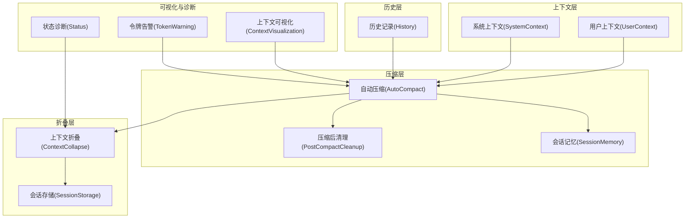
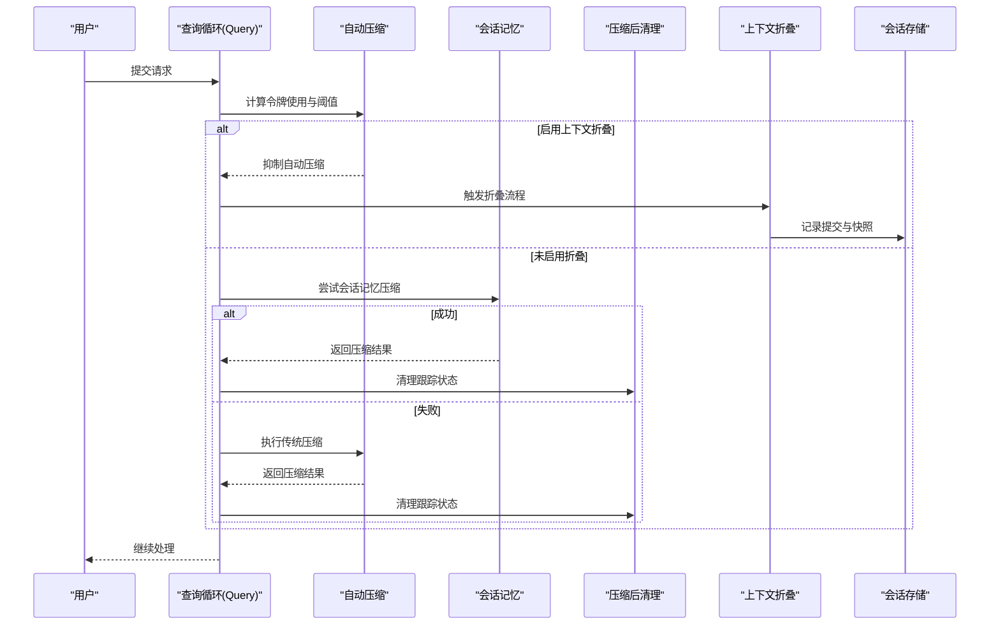
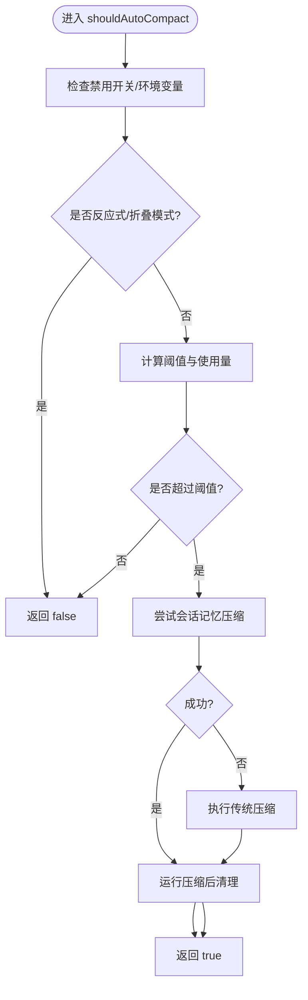
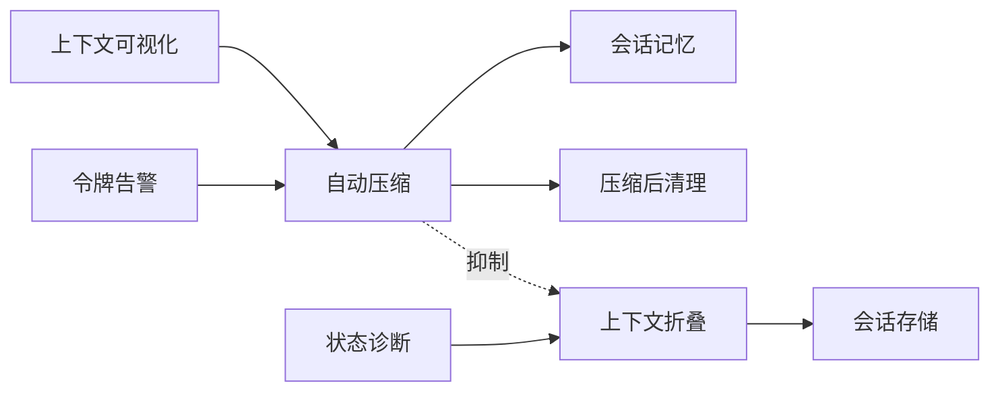

# 上下文管理系统

<cite>
**本文引用的文件**
- [src/context.ts](file://src/context.ts)
- [src/history.ts](file://src/history.ts)
- [src/services/compact/autoCompact.ts](file://src/services/compact/autoCompact.ts)
- [src/services/compact/postCompactCleanup.ts](file://src/services/compact/postCompactCleanup.ts)
- [src/services/SessionMemory/sessionMemory.ts](file://src/services/SessionMemory/sessionMemory.ts)
- [src/services/SessionMemory/sessionMemoryUtils.ts](file://src/services/SessionMemory/sessionMemoryUtils.ts)
- [src/utils/sessionStorage.ts](file://src/utils/sessionStorage.ts)
- [src/utils/analyzeContext.ts](file://src/utils/analyzeContext.ts)
- [src/utils/contextSuggestions.ts](file://src/utils/contextSuggestions.ts)
- [src/components/ContextVisualization.tsx](file://src/components/ContextVisualization.tsx)
- [src/components/TokenWarning.tsx](file://src/components/TokenWarning.tsx)
- [src/commands/context/index.ts](file://src/commands/context/index.ts)
- [src/commands/context/context.tsx](file://src/commands/context/context.tsx)
- [src/utils/memory/types.ts](file://src/utils/memory/types.ts)
- [src/utils/status.tsx](file://src/utils/status.tsx)
</cite>

## 目录
1. [简介](#简介)
2. [项目结构](#项目结构)
3. [核心组件](#核心组件)
4. [架构总览](#架构总览)
5. [详细组件分析](#详细组件分析)
6. [依赖关系分析](#依赖关系分析)
7. [性能考量](#性能考量)
8. [故障排查指南](#故障排查指南)
9. [结论](#结论)
10. [附录](#附录)

## 简介
本技术文档面向 Claude Code 的上下文管理系统，系统性阐述上下文压缩、历史记录优化、内存管理与性能优化、配置与调优、以及上下文折叠（context collapse）等机制。文档同时覆盖上下文压缩对对话质量的影响与权衡，并提供监控与调试方法及最佳实践。

## 项目结构
围绕上下文管理的关键模块分布如下：
- 上下文生成与缓存：用户上下文与系统上下文的构建与缓存
- 历史记录：会话历史的持久化、去重与读取
- 自动压缩：基于阈值与缓冲区的自动触发与执行
- 会话记忆：会话级记忆抽取与复用
- 上下文折叠：Marble Origami（上下文折叠）的提交与快照
- 可视化与诊断：上下文使用可视化、建议与状态诊断
- 配置与环境变量：影响上下文行为的开关与阈值

图表来源
- [src/context.ts:116-190](file://src/context.ts#L116-L190)
- [src/history.ts:190-217](file://src/history.ts#L190-L217)
- [src/services/compact/autoCompact.ts:160-239](file://src/services/compact/autoCompact.ts#L160-L239)
- [src/services/compact/postCompactCleanup.ts:31-39](file://src/services/compact/postCompactCleanup.ts#L31-L39)
- [src/services/SessionMemory/sessionMemory.ts:64-99](file://src/services/SessionMemory/sessionMemory.ts#L64-L99)
- [src/utils/sessionStorage.ts:1536-1585](file://src/utils/sessionStorage.ts#L1536-L1585)
- [src/components/ContextVisualization.tsx:105-125](file://src/components/ContextVisualization.tsx#L105-L125)
- [src/components/TokenWarning.tsx:149-178](file://src/components/TokenWarning.tsx#L149-L178)
- [src/utils/status.tsx:116-125](file://src/utils/status.tsx#L116-L125)

章节来源
- [src/context.ts:116-190](file://src/context.ts#L116-L190)
- [src/history.ts:190-217](file://src/history.ts#L190-L217)
- [src/services/compact/autoCompact.ts:160-239](file://src/services/compact/autoCompact.ts#L160-L239)
- [src/services/compact/postCompactCleanup.ts:31-39](file://src/services/compact/postCompactCleanup.ts#L31-L39)
- [src/services/SessionMemory/sessionMemory.ts:64-99](file://src/services/SessionMemory/sessionMemory.ts#L64-L99)
- [src/utils/sessionStorage.ts:1536-1585](file://src/utils/sessionStorage.ts#L1536-L1585)
- [src/components/ContextVisualization.tsx:105-125](file://src/components/ContextVisualization.tsx#L105-L125)
- [src/components/TokenWarning.tsx:149-178](file://src/components/TokenWarning.tsx#L149-L178)
- [src/utils/status.tsx:116-125](file://src/utils/status.tsx#L116-L125)

## 核心组件
- 用户上下文与系统上下文：负责在会话期间缓存并注入必要的上下文信息（如 Git 状态、日期、内存文件等），减少重复计算与 I/O。
- 历史记录：维护当前项目与会话的历史条目，支持去重、延迟写入、锁文件保护与回溯删除。
- 自动压缩：根据模型上下文窗口与预留输出空间动态计算阈值，触发压缩流程；支持会话记忆优先尝试与失败后的传统压缩。
- 会话记忆：在压缩前尝试抽取会话记忆以减少消息数量，提升吞吐与稳定性。
- 上下文折叠：Marble Origami（上下文折叠）的提交与快照记录，用于恢复时重建压缩后的片段。
- 可视化与诊断：通过网格可视化展示上下文使用情况、建议与健康状态；令牌告警提示自动压缩触发时机；状态面板汇总 MCP 服务器等关键指标。

章节来源
- [src/context.ts:116-190](file://src/context.ts#L116-L190)
- [src/history.ts:292-353](file://src/history.ts#L292-L353)
- [src/services/compact/autoCompact.ts:160-239](file://src/services/compact/autoCompact.ts#L160-L239)
- [src/services/SessionMemory/sessionMemory.ts:64-99](file://src/services/SessionMemory/sessionMemory.ts#L64-L99)
- [src/utils/sessionStorage.ts:1536-1585](file://src/utils/sessionStorage.ts#L1536-L1585)
- [src/components/ContextVisualization.tsx:105-125](file://src/components/ContextVisualization.tsx#L105-L125)
- [src/components/TokenWarning.tsx:149-178](file://src/components/TokenWarning.tsx#L149-L178)
- [src/utils/status.tsx:116-125](file://src/utils/status.tsx#L116-L125)

## 架构总览
上下文管理贯穿“上下文生成—历史—压缩/折叠—可视化”的完整链路。自动压缩与上下文折叠互斥且互补：当启用上下文折叠时，自动压缩被抑制以避免竞争；当未启用折叠或处于反应式模式时，自动压缩作为兜底保障。

图表来源
- [src/services/compact/autoCompact.ts:160-239](file://src/services/compact/autoCompact.ts#L160-L239)
- [src/services/compact/autoCompact.ts:241-351](file://src/services/compact/autoCompact.ts#L241-L351)
- [src/services/compact/postCompactCleanup.ts:31-39](file://src/services/compact/postCompactCleanup.ts#L31-L39)
- [src/utils/sessionStorage.ts:1536-1585](file://src/utils/sessionStorage.ts#L1536-L1585)

## 详细组件分析

### 上下文生成与缓存（User/System Context）
- 用户上下文：聚合内存文件、日期等，缓存在会话生命周期内，避免重复 I/O。
- 系统上下文：可选注入 Git 状态与缓存破坏标记，便于调试与刷新缓存。
- 缓存键：系统提示注入变化会清空缓存，确保一致性。

章节来源
- [src/context.ts:116-190](file://src/context.ts#L116-L190)

### 历史记录优化（History）
- 延迟写入与锁文件：批量写入，避免频繁磁盘操作；写入前创建文件并获取锁，失败重试。
- 去重与窗口限制：按项目与会话分组，限制最大条目数，保证 UI 与搜索效率。
- 撤销与跳过：支持撤销最近一次输入，避免恢复时重复显示。

章节来源
- [src/history.ts:292-353](file://src/history.ts#L292-L353)
- [src/history.ts:190-217](file://src/history.ts#L190-L217)
- [src/history.ts:453-465](file://src/history.ts#L453-L465)

### 自动压缩（AutoCompact）
- 阈值计算：有效上下文窗口减去最大输出令牌预留，结合环境变量与特性门控调整。
- 抑制条件：禁用开关、反应式模式、上下文折叠模式、特定查询来源均会抑制自动压缩。
- 触发逻辑：当令牌使用超过阈值且满足抑制条件时触发；优先尝试会话记忆压缩，失败则执行传统压缩。
- 失败熔断：连续失败达到上限后停止尝试，避免无效 API 调用。

图表来源
- [src/services/compact/autoCompact.ts:160-239](file://src/services/compact/autoCompact.ts#L160-L239)
- [src/services/compact/autoCompact.ts:241-351](file://src/services/compact/autoCompact.ts#L241-L351)

章节来源
- [src/services/compact/autoCompact.ts:32-91](file://src/services/compact/autoCompact.ts#L32-L91)
- [src/services/compact/autoCompact.ts:160-239](file://src/services/compact/autoCompact.ts#L160-L239)
- [src/services/compact/autoCompact.ts:241-351](file://src/services/compact/autoCompact.ts#L241-L351)

### 压缩后清理（PostCompactCleanup）
- 仅在主线程压缩时重置共享模块状态，避免子代理进程污染主进程状态。
- 不清理已调用技能内容，确保后续压缩仍可包含完整技能文本。

章节来源
- [src/services/compact/postCompactCleanup.ts:31-39](file://src/services/compact/postCompactCleanup.ts#L31-L39)

### 会话记忆（SessionMemory）
- 配置与初始化：从远端配置加载，具备最小令牌阈值与初始化标志位。
- 内容提取：延迟等待进行中提取完成，超时或陈旧则直接返回。
- 记录与清理：提取完成后更新最后摘要消息 ID，并在压缩后清理缓存基线。

章节来源
- [src/services/SessionMemory/sessionMemory.ts:64-99](file://src/services/SessionMemory/sessionMemory.ts#L64-L99)
- [src/services/SessionMemory/sessionMemoryUtils.ts:85-138](file://src/services/SessionMemory/sessionMemoryUtils.ts#L85-L138)
- [src/services/SessionMemory/sessionMemoryUtils.ts:140-177](file://src/services/SessionMemory/sessionMemoryUtils.ts#L140-L177)

### 上下文折叠（ContextCollapse）
- 提交与快照：记录折叠提交与阶段快照，采用“最后写入胜出”策略，便于恢复重建。
- 可视化与健康：可视化组件展示折叠统计与错误/空运行警告，帮助用户感知折叠健康度。

章节来源
- [src/utils/sessionStorage.ts:1536-1585](file://src/utils/sessionStorage.ts#L1536-L1585)
- [src/components/ContextVisualization.tsx:21-71](file://src/components/ContextVisualization.tsx#L21-L71)

### 分析与可视化（Analyze/Visualization/Suggestions）
- 使用分析：综合消息、工具、MCP、技能、系统提示等维度，生成网格化使用视图。
- 建议生成：基于内存文件占用与阈值给出修剪建议。
- 令牌告警：在非折叠模式下显示自动压缩剩余百分比，在折叠模式下显示折叠进度与健康状态。

章节来源
- [src/utils/analyzeContext.ts:1105-1132](file://src/utils/analyzeContext.ts#L1105-L1132)
- [src/utils/contextSuggestions.ts:197-235](file://src/utils/contextSuggestions.ts#L197-L235)
- [src/components/ContextVisualization.tsx:105-125](file://src/components/ContextVisualization.tsx#L105-L125)
- [src/components/TokenWarning.tsx:149-178](file://src/components/TokenWarning.tsx#L149-L178)

### 命令与入口（Context 命令）
- 可视化命令：渲染当前上下文使用网格，支持交互与非交互两种模式。
- 数据来源：分析压缩后消息与原始消息，确保准确提取 API 使用量。

章节来源
- [src/commands/context/index.ts:1-24](file://src/commands/context/index.ts#L1-L24)
- [src/commands/context/context.tsx:46-63](file://src/commands/context/context.tsx#L46-L63)

## 依赖关系分析
- 上下文折叠与自动压缩互斥：折叠启用时抑制自动压缩，避免竞争。
- 自动压缩与会话记忆协同：优先尝试会话记忆压缩，失败再走传统压缩。
- 可视化与诊断依赖上下文分析与折叠状态，形成闭环反馈。

图表来源
- [src/services/compact/autoCompact.ts:160-239](file://src/services/compact/autoCompact.ts#L160-L239)
- [src/services/compact/autoCompact.ts:241-351](file://src/services/compact/autoCompact.ts#L241-L351)
- [src/services/compact/postCompactCleanup.ts:31-39](file://src/services/compact/postCompactCleanup.ts#L31-L39)
- [src/utils/sessionStorage.ts:1536-1585](file://src/utils/sessionStorage.ts#L1536-L1585)
- [src/components/ContextVisualization.tsx:105-125](file://src/components/ContextVisualization.tsx#L105-L125)
- [src/components/TokenWarning.tsx:149-178](file://src/components/TokenWarning.tsx#L149-L178)
- [src/utils/status.tsx:116-125](file://src/utils/status.tsx#L116-L125)

章节来源
- [src/services/compact/autoCompact.ts:160-239](file://src/services/compact/autoCompact.ts#L160-L239)
- [src/services/compact/autoCompact.ts:241-351](file://src/services/compact/autoCompact.ts#L241-L351)
- [src/services/compact/postCompactCleanup.ts:31-39](file://src/services/compact/postCompactCleanup.ts#L31-L39)
- [src/utils/sessionStorage.ts:1536-1585](file://src/utils/sessionStorage.ts#L1536-L1585)
- [src/components/ContextVisualization.tsx:105-125](file://src/components/ContextVisualization.tsx#L105-L125)
- [src/components/TokenWarning.tsx:149-178](file://src/components/TokenWarning.tsx#L149-L178)
- [src/utils/status.tsx:116-125](file://src/utils/status.tsx#L116-L125)

## 性能考量
- 缓存与延迟写入：上下文与历史均采用缓存与延迟写入策略，降低 I/O 开销。
- 阈值与缓冲区：通过预留输出令牌与缓冲区阈值，平衡吞吐与稳定性。
- 会话记忆优先：在自动压缩前尝试会话记忆压缩，减少消息规模，提高响应速度。
- 熔断与重试：自动压缩失败达到上限后熔断，避免无效调用；历史写入失败有限重试。
- 折叠与自动压缩互斥：折叠模式下抑制自动压缩，避免竞争导致的额外开销。

章节来源
- [src/context.ts:116-190](file://src/context.ts#L116-L190)
- [src/history.ts:292-353](file://src/history.ts#L292-L353)
- [src/services/compact/autoCompact.ts:32-91](file://src/services/compact/autoCompact.ts#L32-L91)
- [src/services/compact/autoCompact.ts:241-351](file://src/services/compact/autoCompact.ts#L241-L351)

## 故障排查指南
- 上下文折叠健康：通过可视化组件查看折叠统计、错误计数与空运行警告，定位折叠异常。
- 令牌告警：关注自动压缩剩余百分比与折叠进度，判断是否需要手动压缩或调整阈值。
- 历史写入问题：若出现写入失败，检查锁文件与磁盘权限；确认重试机制是否生效。
- 会话记忆提取：等待提取完成或超时处理，必要时重试或调整阈值。
- 状态诊断：查看 MCP 服务器状态与大内存文件诊断，辅助定位性能瓶颈。

章节来源
- [src/components/ContextVisualization.tsx:21-71](file://src/components/ContextVisualization.tsx#L21-L71)
- [src/components/TokenWarning.tsx:149-178](file://src/components/TokenWarning.tsx#L149-L178)
- [src/history.ts:292-353](file://src/history.ts#L292-L353)
- [src/services/SessionMemory/sessionMemoryUtils.ts:85-138](file://src/services/SessionMemory/sessionMemoryUtils.ts#L85-L138)
- [src/utils/status.tsx:116-125](file://src/utils/status.tsx#L116-L125)

## 结论
上下文管理系统通过“上下文缓存—历史优化—自动压缩/会话记忆—上下文折叠—可视化诊断”的闭环设计，实现了在高上下文负载下的稳定与高效。自动压缩与上下文折叠互斥互补，配合阈值与缓冲区策略，既保障对话质量又维持系统性能。建议在复杂场景优先启用上下文折叠，并结合可视化与诊断工具持续优化配置。

## 附录

### 配置与调优要点
- 自动压缩阈值：可通过环境变量覆盖百分比与阻断限制，便于测试与调优。
- 上下文折叠：启用后抑制自动压缩，建议在长对话与多 Agent 场景下开启。
- 会话记忆：合理设置最小令牌阈值与更新间隔，平衡压缩效果与资源消耗。
- 内存类型：区分用户、项目、本地、托管、自动记忆与团队记忆，按需裁剪。

章节来源
- [src/services/compact/autoCompact.ts:78-91](file://src/services/compact/autoCompact.ts#L78-L91)
- [src/services/compact/autoCompact.ts:126-135](file://src/services/compact/autoCompact.ts#L126-L135)
- [src/services/SessionMemory/sessionMemoryUtils.ts:140-177](file://src/services/SessionMemory/sessionMemoryUtils.ts#L140-L177)
- [src/utils/memory/types.ts:1-12](file://src/utils/memory/types.ts#L1-L12)