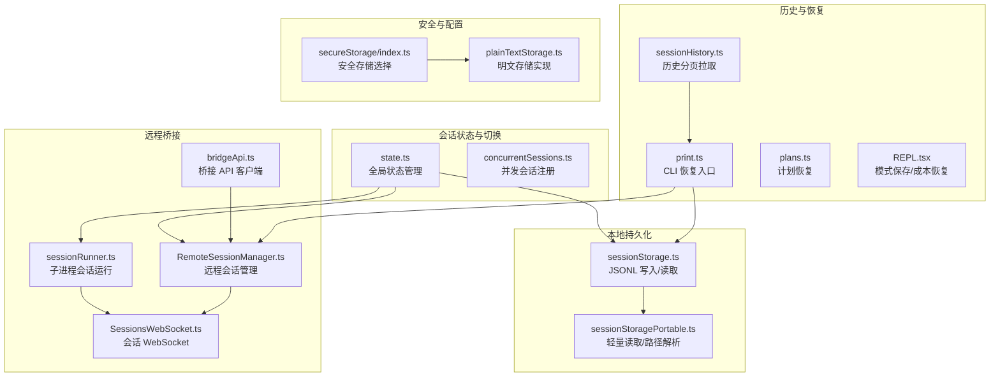
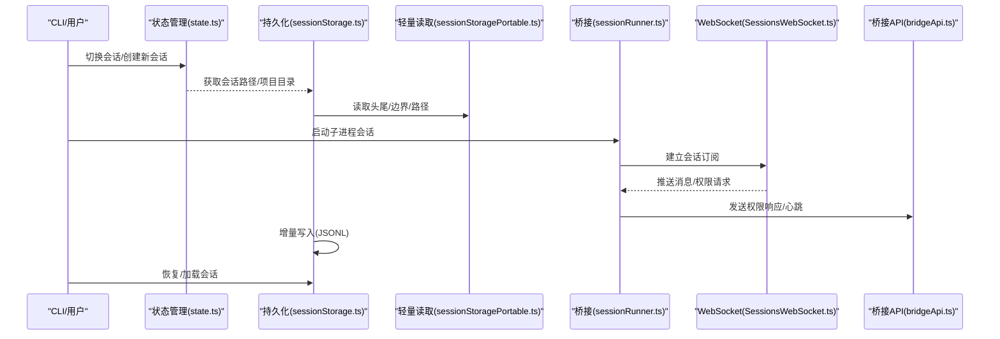
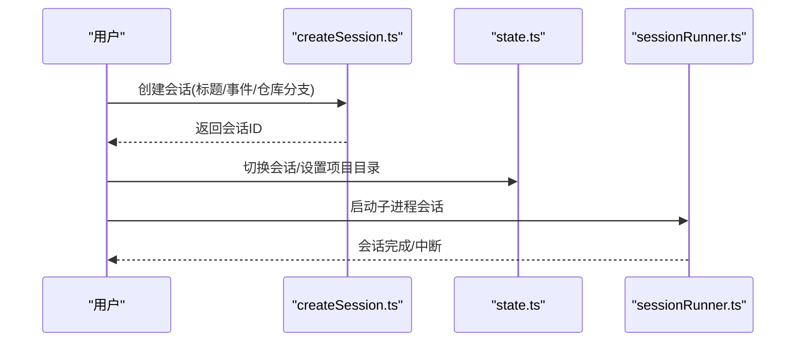
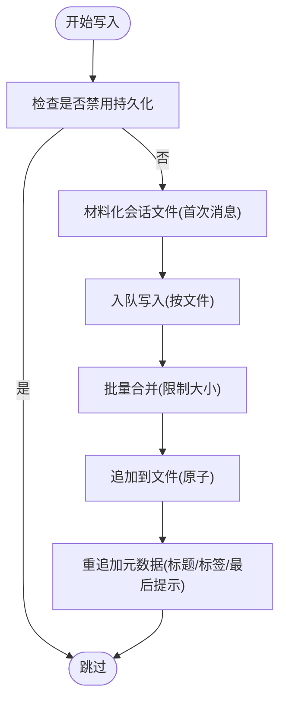
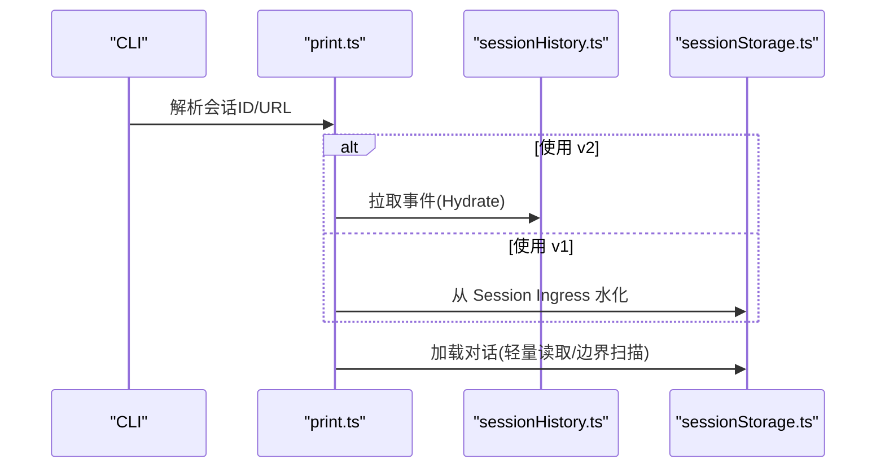
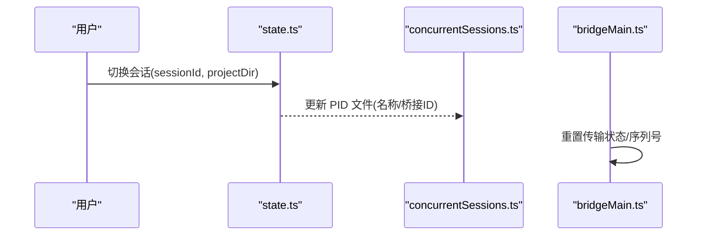
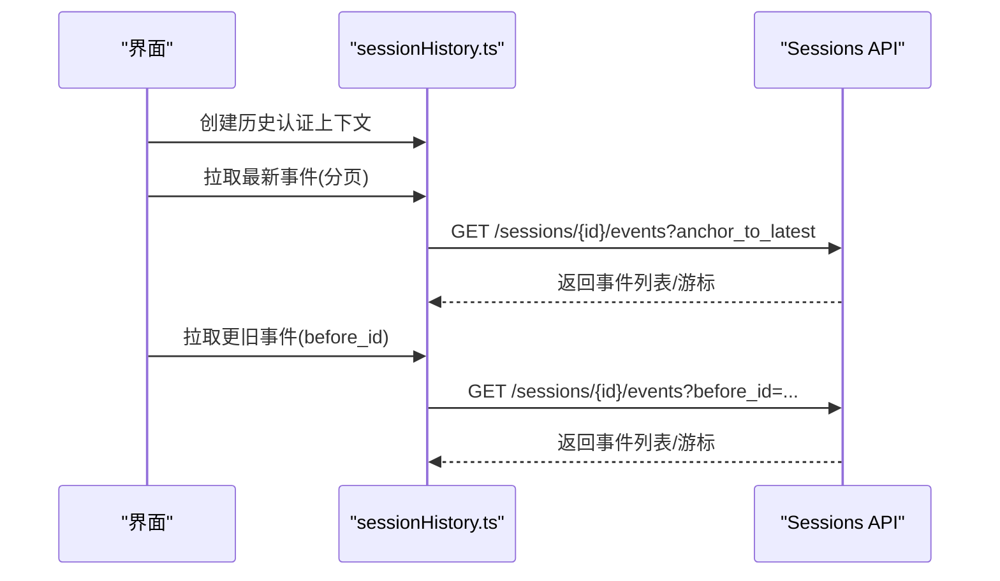
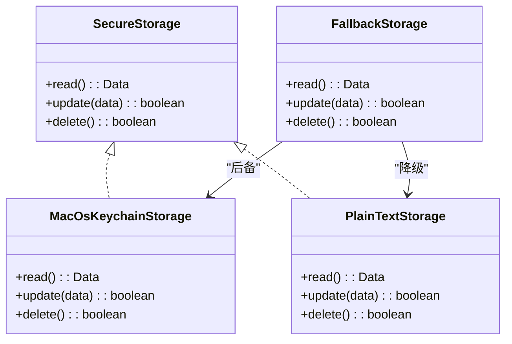
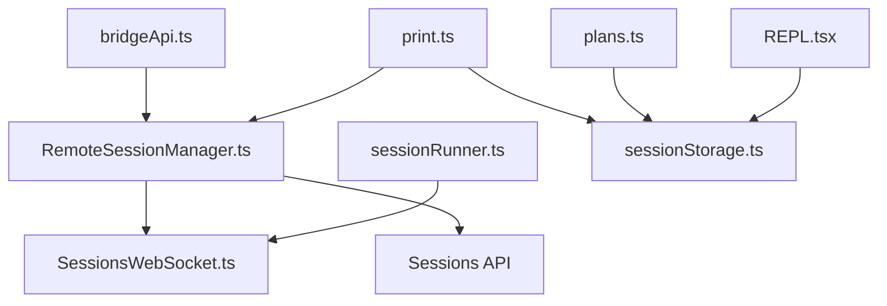
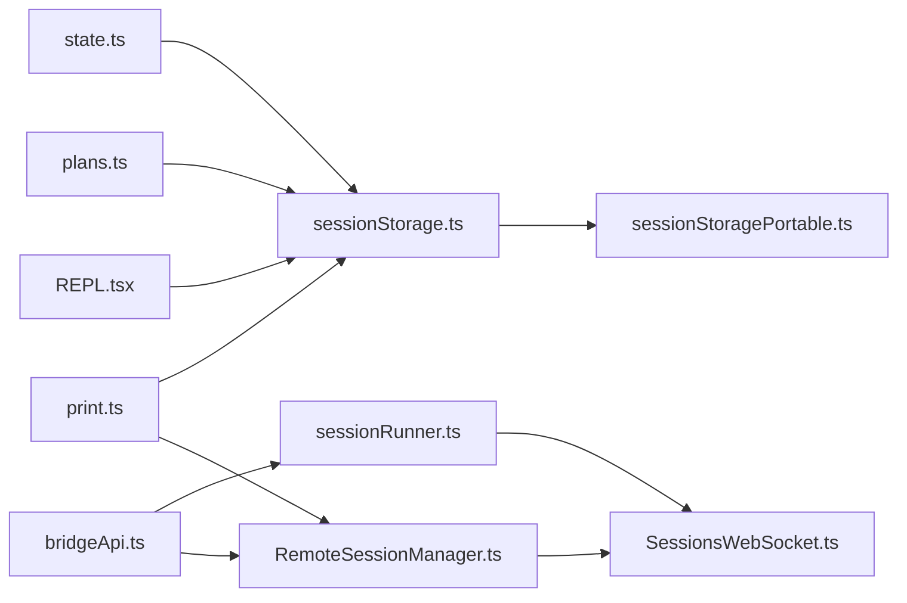

# 会话管理系统

<cite>
**本文档引用的文件**
- [sessionStorage.ts](file://src/utils/sessionStorage.ts)
- [sessionStoragePortable.ts](file://src/utils/sessionStoragePortable.ts)
- [state.ts](file://src/bootstrap/state.ts)
- [sessionRunner.ts](file://src/bridge/sessionRunner.ts)
- [createSession.ts](file://src/bridge/createSession.ts)
- [bridgeApi.ts](file://src/bridge/bridgeApi.ts)
- [SessionsWebSocket.ts](file://src/remote/SessionsWebSocket.ts)
- [sessionHistory.ts](file://src/assistant/sessionHistory.ts)
- [index.ts](file://src/remote/RemoteSessionManager.ts)
- [index.ts](file://src/utils/secureStorage/index.ts)
- [plainTextStorage.ts](file://src/utils/secureStorage/plainTextStorage.ts)
- [print.ts](file://src/cli/print.ts)
- [plans.ts](file://src/utils/plans.ts)
- [bridgeMain.ts](file://src/bridge/bridgeMain.ts)
- [concurrentSessions.ts](file://src/utils/concurrentSessions.ts)
- [REPL.tsx](file://src/screens/REPL.tsx)
</cite>

## 目录
1. [简介](#简介)
2. [项目结构](#项目结构)
3. [核心组件](#核心组件)
4. [架构总览](#架构总览)
5. [详细组件分析](#详细组件分析)
6. [依赖关系分析](#依赖关系分析)
7. [性能考虑](#性能考虑)
8. [故障排除指南](#故障排除指南)
9. [结论](#结论)
10. [附录](#附录)

## 简介
本文件为 Claude Code 会话管理系统的详细技术文档，覆盖会话生命周期管理（创建、状态维护、结束）、JSONL 格式持久化与增量写入、崩溃恢复、会话恢复与断点续传、多会话并发与切换、会话历史管理与检索、安全存储与隐私保护、配置选项与自定义方法，以及与其他组件的集成方式。

## 项目结构
会话管理系统由以下关键模块构成：
- 会话状态与切换：通过全局状态管理器维护当前会话 ID、项目目录、父会话 ID 等
- 本地持久化：以 JSONL 文件形式存储对话转录，支持增量写入、元数据重追加、轻量读取
- 远程桥接：通过 WebSocket 与远端环境建立连接，支持权限请求、心跳、重连与控制消息
- 历史检索：提供分页拉取会话事件的能力
- 安全存储：跨平台凭据安全存储方案
- CLI 恢复：在 CLI 中实现从远程或本地恢复会话、断点续传

**图表来源**
- [state.ts:1-800](file://src/bootstrap/state.ts#L1-L800)
- [sessionStorage.ts:1-800](file://src/utils/sessionStorage.ts#L1-L800)
- [sessionStoragePortable.ts:1-794](file://src/utils/sessionStoragePortable.ts#L1-L794)
- [sessionRunner.ts:1-551](file://src/bridge/sessionRunner.ts#L1-L551)
- [bridgeApi.ts:1-540](file://src/bridge/bridgeApi.ts#L1-L540)
- [SessionsWebSocket.ts:1-405](file://src/remote/SessionsWebSocket.ts#L1-L405)
- [sessionHistory.ts:1-88](file://src/assistant/sessionHistory.ts#L1-L88)
- [print.ts:5048-5078](file://src/cli/print.ts#L5048-L5078)
- [plans.ts:153-175](file://src/utils/plans.ts#L153-L175)
- [secureStorage/index.ts:1-18](file://src/utils/secureStorage/index.ts#L1-L18)
- [plainTextStorage.ts:57-84](file://src/utils/secureStorage/plainTextStorage.ts#L57-L84)

**章节来源**
- [state.ts:1-800](file://src/bootstrap/state.ts#L1-L800)
- [sessionStorage.ts:1-800](file://src/utils/sessionStorage.ts#L1-L800)
- [sessionStoragePortable.ts:1-794](file://src/utils/sessionStoragePortable.ts#L1-L794)
- [sessionRunner.ts:1-551](file://src/bridge/sessionRunner.ts#L1-L551)
- [bridgeApi.ts:1-540](file://src/bridge/bridgeApi.ts#L1-L540)
- [SessionsWebSocket.ts:1-405](file://src/remote/SessionsWebSocket.ts#L1-L405)
- [sessionHistory.ts:1-88](file://src/assistant/sessionHistory.ts#L1-L88)
- [print.ts:5048-5078](file://src/cli/print.ts#L5048-L5078)
- [plans.ts:153-175](file://src/utils/plans.ts#L153-L175)
- [secureStorage/index.ts:1-18](file://src/utils/secureStorage/index.ts#L1-L18)
- [plainTextStorage.ts:57-84](file://src/utils/secureStorage/plainTextStorage.ts#L57-L84)

## 核心组件
- 全局状态管理：负责会话 ID、项目根目录、会话项目目录、父会话 ID、交互时间、持久化开关等
- 会话持久化：Project 类封装 JSONL 写入队列、批处理、延迟刷新、元数据重追加、远程写入适配
- 轻量读取工具：提供头尾窗口读取、首提示提取、边界标记扫描、路径解析与工作树回退
- 子进程会话运行：管理子进程生命周期、活动日志、权限请求转发、调试输出与转录记录
- 桥接 API 客户端：封装 OAuth 头部、重试策略、错误分类、工作轮询、会话归档、心跳等
- 会话 WebSocket：订阅会话事件流，鉴权后自动认证，心跳保活，有限重连与永久关闭处理
- 历史检索：按锚点分页拉取会话事件，支持最新页与更旧页
- 安全存储：根据平台选择密钥链或明文存储，提供读写删除接口
- CLI 恢复：根据环境变量与参数决定使用 v1 或 v2 恢复路径，Hydrate 与恢复成本/模式状态
- 计划恢复：从日志中恢复计划 slug 并在目标会话上设置
- 并发会话：通过 PID 文件记录会话名称与桥接 ID，支持去重与同步
- 模式与成本恢复：在 REPL 中保存/恢复会话模式与成本状态

**章节来源**
- [state.ts:431-499](file://src/bootstrap/state.ts#L431-L499)
- [sessionStorage.ts:532-800](file://src/utils/sessionStorage.ts#L532-L800)
- [sessionStoragePortable.ts:215-282](file://src/utils/sessionStoragePortable.ts#L215-L282)
- [sessionRunner.ts:248-551](file://src/bridge/sessionRunner.ts#L248-L551)
- [bridgeApi.ts:68-452](file://src/bridge/bridgeApi.ts#L68-L452)
- [SessionsWebSocket.ts:82-405](file://src/remote/SessionsWebSocket.ts#L82-L405)
- [sessionHistory.ts:31-88](file://src/assistant/sessionHistory.ts#L31-L88)
- [secureStorage/index.ts:9-17](file://src/utils/secureStorage/index.ts#L9-L17)
- [print.ts:5048-5078](file://src/cli/print.ts#L5048-L5078)
- [plans.ts:164-175](file://src/utils/plans.ts#L164-L175)
- [concurrentSessions.ts:116-148](file://src/utils/concurrentSessions.ts#L116-L148)
- [REPL.tsx:1894-1910](file://src/screens/REPL.tsx#L1894-L1910)

## 架构总览
会话管理系统采用“状态中心 + 多传输通道”的架构：
- 状态中心：全局状态管理器统一维护当前会话上下文
- 本地通道：JSONL 文件持久化 + 轻量读取工具
- 远程通道：WebSocket 订阅 + 桥接 API + 子进程运行
- 恢复通道：CLI 恢复入口 + 历史分页 + 计划恢复 + 成本/模式恢复

**图表来源**
- [state.ts:468-499](file://src/bootstrap/state.ts#L468-L499)
- [sessionStorage.ts:532-800](file://src/utils/sessionStorage.ts#L532-L800)
- [sessionStoragePortable.ts:215-282](file://src/utils/sessionStoragePortable.ts#L215-L282)
- [sessionRunner.ts:248-551](file://src/bridge/sessionRunner.ts#L248-L551)
- [SessionsWebSocket.ts:100-205](file://src/remote/SessionsWebSocket.ts#L100-L205)
- [bridgeApi.ts:142-452](file://src/bridge/bridgeApi.ts#L142-L452)

## 详细组件分析

### 会话生命周期管理
- 创建：通过桥接 API 创建会话，返回会话 ID；支持预填充历史事件
- 状态维护：全局状态管理器维护会话 ID、项目目录、父会话 ID、交互时间、持久化开关等
- 结束：桥接 API 提供归档接口；子进程会话在完成/中断时清理资源并唤醒容量等待

**图表来源**
- [createSession.ts:34-180](file://src/bridge/createSession.ts#L34-L180)
- [state.ts:468-499](file://src/bootstrap/state.ts#L468-L499)
- [sessionRunner.ts:248-551](file://src/bridge/sessionRunner.ts#L248-L551)

**章节来源**
- [createSession.ts:34-180](file://src/bridge/createSession.ts#L34-L180)
- [state.ts:468-499](file://src/bootstrap/state.ts#L468-L499)
- [sessionRunner.ts:248-551](file://src/bridge/sessionRunner.ts#L248-L551)

### 会话持久化与增量写入
- JSONL 存储：每个会话一个 .jsonl 文件，按条目逐行写入
- 写入队列：Project 类维护 per-文件写入队列，批量合并写入，限制单批大小
- 增量写入：首次用户/助手消息前可缓冲条目，避免空文件
- 元数据重追加：在清理阶段或压缩后将标题/标签/最后提示等元数据追加到文件末尾，确保轻量读取可见
- 远程写入适配：支持通过内部事件写入替代 v1 Session Ingress

**图表来源**
- [sessionStorage.ts:1128-1155](file://src/utils/sessionStorage.ts#L1128-L1155)
- [sessionStorage.ts:606-686](file://src/utils/sessionStorage.ts#L606-L686)
- [sessionStorage.ts:721-800](file://src/utils/sessionStorage.ts#L721-L800)

**章节来源**
- [sessionStorage.ts:1128-1155](file://src/utils/sessionStorage.ts#L1128-L1155)
- [sessionStorage.ts:606-686](file://src/utils/sessionStorage.ts#L606-L686)
- [sessionStorage.ts:721-800](file://src/utils/sessionStorage.ts#L721-L800)

### 崩溃恢复与断点续传
- 轻量读取：仅读取文件头尾固定大小窗口，提取首提示、标题、标签等元数据
- 边界扫描：在大文件中定位压缩边界，截断或保留片段，保证恢复一致性
- 路径解析：支持工作树回退，跨项目目录查找会话文件
- CLI 恢复：根据环境变量选择 v1(via Session Ingress) 或 v2(via CCR v2) 恢复路径，Hydrate 与成本/模式状态恢复

**图表来源**
- [print.ts:5048-5078](file://src/cli/print.ts#L5048-L5078)
- [sessionHistory.ts:31-88](file://src/assistant/sessionHistory.ts#L31-L88)
- [sessionStoragePortable.ts:215-282](file://src/utils/sessionStoragePortable.ts#L215-L282)

**章节来源**
- [print.ts:5048-5078](file://src/cli/print.ts#L5048-L5078)
- [sessionHistory.ts:31-88](file://src/assistant/sessionHistory.ts#L31-L88)
- [sessionStoragePortable.ts:215-282](file://src/utils/sessionStoragePortable.ts#L215-L282)

### 多会话并发处理与会话切换
- 并发会话：通过 PID 文件记录会话名称与桥接 ID，避免重复显示
- 会话切换：原子切换会话 ID 与项目目录，触发监听器保持外部状态一致
- 子进程会话：管理多个子进程会话，分别维护序列号与去重 UUID，防止混流

**图表来源**
- [state.ts:468-499](file://src/bootstrap/state.ts#L468-L499)
- [concurrentSessions.ts:116-148](file://src/utils/concurrentSessions.ts#L116-L148)
- [bridgeMain.ts:163-475](file://src/bridge/bridgeMain.ts#L163-L475)

**章节来源**
- [state.ts:468-499](file://src/bootstrap/state.ts#L468-L499)
- [concurrentSessions.ts:116-148](file://src/utils/concurrentSessions.ts#L116-L148)
- [bridgeMain.ts:163-475](file://src/bridge/bridgeMain.ts#L163-L475)

### 会话历史管理与检索
- 分页拉取：基于锚点向最新或更旧方向分页获取事件
- 认证上下文：一次性准备基础 URL、头部与组织 UUID，复用以减少开销
- 错误处理：对非 200 响应进行调试记录与降级处理

**图表来源**
- [sessionHistory.ts:31-88](file://src/assistant/sessionHistory.ts#L31-L88)

**章节来源**
- [sessionHistory.ts:31-88](file://src/assistant/sessionHistory.ts#L31-L88)

### 安全存储与隐私保护
- 平台适配：macOS 使用密钥链后备，其他平台使用明文存储
- 权限最小化：仅在必要时写入凭据，删除时兼容不存在场景
- 敏感信息：凭据写入后设置严格权限，避免被其他用户读取

**图表来源**
- [secureStorage/index.ts:9-17](file://src/utils/secureStorage/index.ts#L9-L17)
- [plainTextStorage.ts:57-84](file://src/utils/secureStorage/plainTextStorage.ts#L57-L84)

**章节来源**
- [secureStorage/index.ts:9-17](file://src/utils/secureStorage/index.ts#L9-L17)
- [plainTextStorage.ts:57-84](file://src/utils/secureStorage/plainTextStorage.ts#L57-L84)

### 会话系统与其他组件的集成
- 与桥接 API 集成：通过桥接 API 客户端进行会话创建、归档、心跳、权限事件发送
- 与 WebSocket 集成：订阅会话事件流，处理权限请求与控制消息
- 与子进程集成：启动/管理子进程会话，记录转录与调试输出
- 与 CLI 集成：在 CLI 中实现恢复、Hydrate、成本与模式状态恢复
- 与计划恢复集成：从日志中恢复计划 slug 并在目标会话上设置

**图表来源**
- [bridgeApi.ts:142-452](file://src/bridge/bridgeApi.ts#L142-L452)
- [SessionsWebSocket.ts:82-405](file://src/remote/SessionsWebSocket.ts#L82-L405)
- [sessionRunner.ts:248-551](file://src/bridge/sessionRunner.ts#L248-L551)
- [print.ts:5048-5078](file://src/cli/print.ts#L5048-L5078)
- [plans.ts:164-175](file://src/utils/plans.ts#L164-L175)
- [REPL.tsx:1894-1910](file://src/screens/REPL.tsx#L1894-L1910)

**章节来源**
- [bridgeApi.ts:142-452](file://src/bridge/bridgeApi.ts#L142-L452)
- [SessionsWebSocket.ts:82-405](file://src/remote/SessionsWebSocket.ts#L82-L405)
- [sessionRunner.ts:248-551](file://src/bridge/sessionRunner.ts#L248-L551)
- [print.ts:5048-5078](file://src/cli/print.ts#L5048-L5078)
- [plans.ts:164-175](file://src/utils/plans.ts#L164-L175)
- [REPL.tsx:1894-1910](file://src/screens/REPL.tsx#L1894-L1910)

## 依赖关系分析
- 组件耦合：状态管理器与持久化模块强耦合，确保路径与会话 ID 一致性
- 外部依赖：桥接 API、WebSocket、文件系统、远程服务
- 循环依赖：通过模块拆分避免直接循环导入

**图表来源**
- [state.ts:431-499](file://src/bootstrap/state.ts#L431-L499)
- [sessionStorage.ts:532-800](file://src/utils/sessionStorage.ts#L532-L800)
- [sessionStoragePortable.ts:215-282](file://src/utils/sessionStoragePortable.ts#L215-L282)
- [sessionRunner.ts:248-551](file://src/bridge/sessionRunner.ts#L248-L551)
- [SessionsWebSocket.ts:82-405](file://src/remote/SessionsWebSocket.ts#L82-L405)
- [bridgeApi.ts:142-452](file://src/bridge/bridgeApi.ts#L142-L452)
- [print.ts:5048-5078](file://src/cli/print.ts#L5048-L5078)
- [plans.ts:164-175](file://src/utils/plans.ts#L164-L175)
- [REPL.tsx:1894-1910](file://src/screens/REPL.tsx#L1894-L1910)

**章节来源**
- [state.ts:431-499](file://src/bootstrap/state.ts#L431-L499)
- [sessionStorage.ts:532-800](file://src/utils/sessionStorage.ts#L532-L800)
- [sessionStoragePortable.ts:215-282](file://src/utils/sessionStoragePortable.ts#L215-L282)
- [sessionRunner.ts:248-551](file://src/bridge/sessionRunner.ts#L248-L551)
- [SessionsWebSocket.ts:82-405](file://src/remote/SessionsWebSocket.ts#L82-L405)
- [bridgeApi.ts:142-452](file://src/bridge/bridgeApi.ts#L142-L452)
- [print.ts:5048-5078](file://src/cli/print.ts#L5048-L5078)
- [plans.ts:164-175](file://src/utils/plans.ts#L164-L175)
- [REPL.tsx:1894-1910](file://src/screens/REPL.tsx#L1894-L1910)

## 性能考虑
- 批量写入：限制单批大小，减少磁盘写放大
- 轻量读取：仅读取头尾窗口，避免全文件扫描
- 边界扫描：在大文件中快速定位压缩边界，减少内存占用
- 重连退避：指数退避 + 抖动，降低服务器压力
- 缓冲与去重：子进程传输层维护序列号与最近 UUID，避免重复与丢包

## 故障排除指南
- 409 冲突恢复：当服务端返回 409 且确认条目已存在时，更新本地状态并继续
- 4001 会话未找到：在压缩期间可能短暂出现，有限次重试后仍失败则视为永久关闭
- 持久化失败：目录不存在时自动创建；权限不足时捕获错误并降级处理
- 权限请求：桥接层转发权限请求，用户拒绝或超时需在 UI 层提示
- 令牌刷新：桥接 API 支持 401 自动刷新，刷新失败则抛出致命错误

**章节来源**
- [sessionStorage.ts:77-103](file://src/utils/sessionStorage.ts#L77-L103)
- [SessionsWebSocket.ts:255-288](file://src/remote/SessionsWebSocket.ts#L255-L288)
- [bridgeApi.ts:454-500](file://src/bridge/bridgeApi.ts#L454-L500)

## 结论
Claude Code 的会话管理系统通过“状态中心 + 多传输通道”实现了高可靠、高性能的会话生命周期管理。本地 JSONL 持久化与轻量读取工具确保了大规模会话的可扩展性；远程桥接与 WebSocket 提供了稳定的远端交互能力；安全存储与严格的错误处理保障了隐私与稳定性。通过 CLI 恢复、历史检索与计划恢复，系统实现了完整的断点续传与会话迁移能力。

## 附录
- 配置选项与自定义
  - 会话持久化开关：通过全局状态中的持久化标志控制
  - 会话项目目录：可通过切换会话时指定项目目录，确保路径一致性
  - v2/v1 恢复：通过环境变量与参数选择不同恢复路径
  - 安全存储：平台自动选择，可在不支持密钥链的平台上使用明文存储
- 与其他组件的集成
  - 与桥接 API：用于会话创建、归档、心跳、权限事件发送
  - 与 WebSocket：用于订阅会话事件流与控制消息
  - 与子进程：用于本地会话运行与调试输出
  - 与 CLI：用于会话恢复、Hydrate、成本与模式状态恢复
  - 与计划恢复：用于从日志中恢复计划 slug 并在目标会话上设置