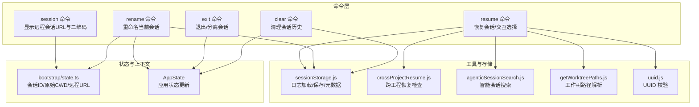
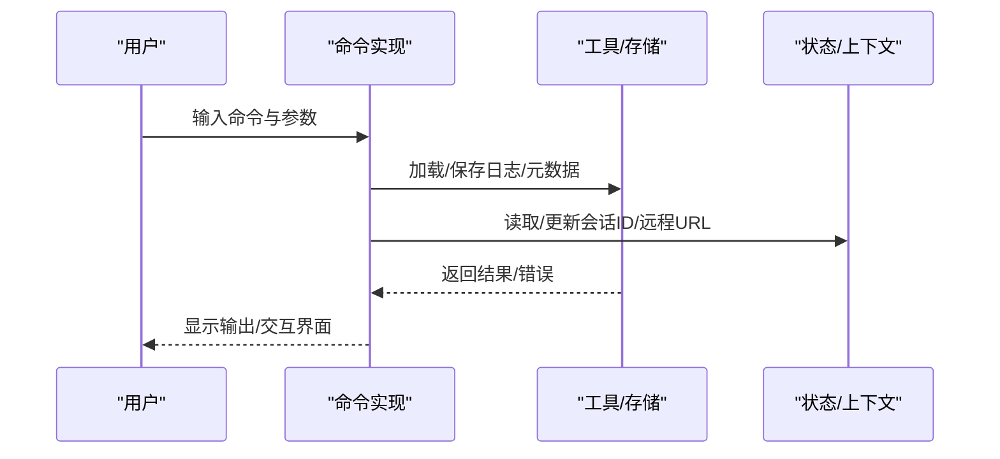
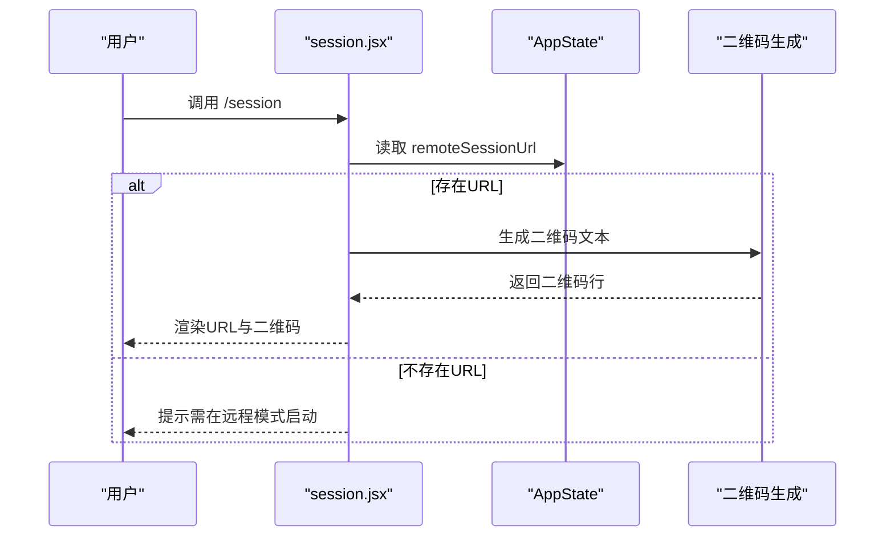
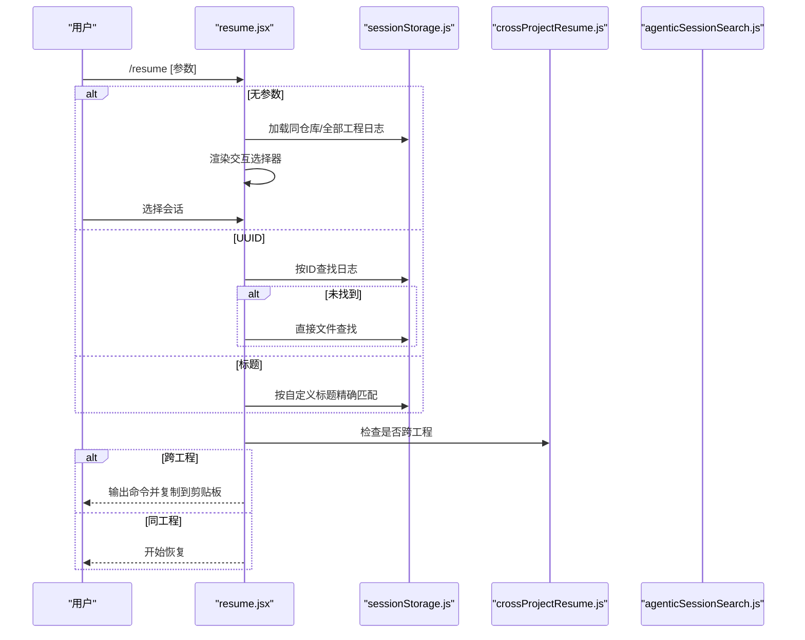
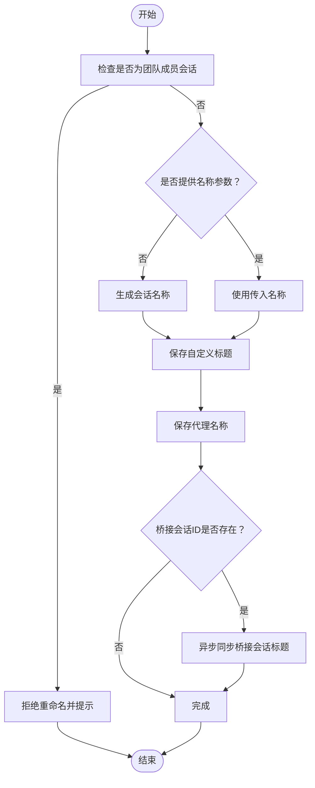
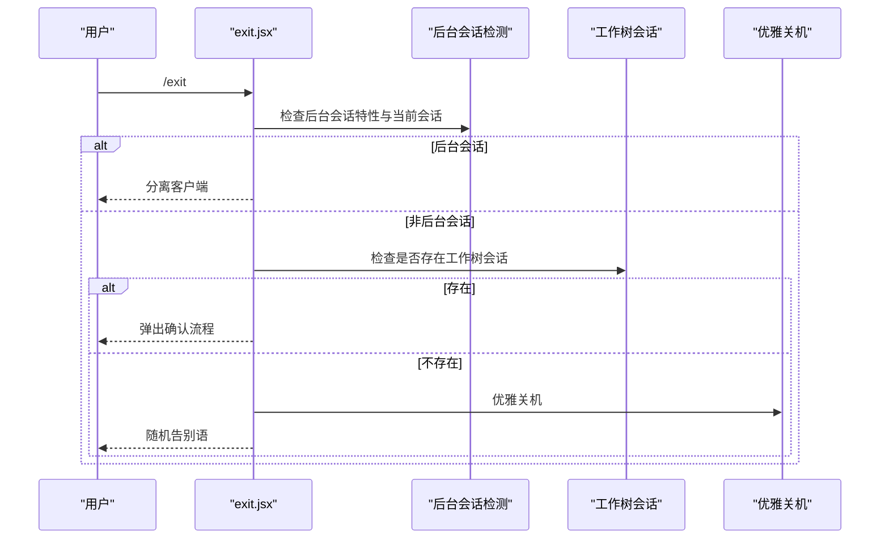
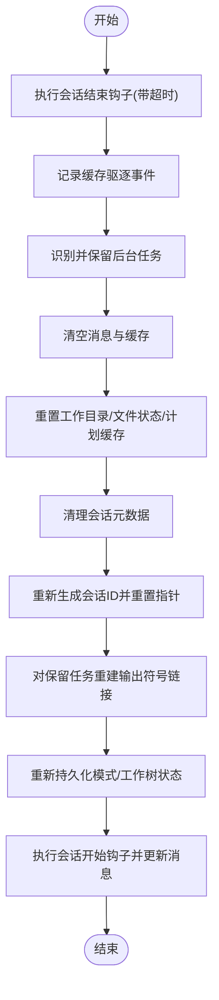
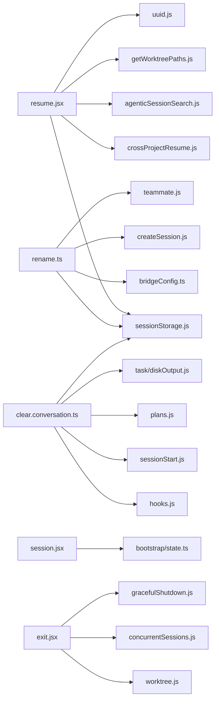

# 会话管理命令

<cite>
**本文引用的文件**
- [src/commands/session/index.ts](file://src/commands/session/index.ts)
- [src/commands/session/session.tsx](file://src/commands/session/session.tsx)
- [src/commands/resume/index.ts](file://src/commands/resume/index.ts)
- [src/commands/resume/resume.tsx](file://src/commands/resume/resume.tsx)
- [src/commands/rename/index.ts](file://src/commands/rename/index.ts)
- [src/commands/rename/rename.ts](file://src/commands/rename/rename.ts)
- [src/commands/exit/exit.tsx](file://src/commands/exit/exit.tsx)
- [src/commands/clear/index.ts](file://src/commands/clear/index.ts)
- [src/commands/clear/clear.ts](file://src/commands/clear/clear.ts)
- [src/commands/clear/conversation.ts](file://src/commands/clear/conversation.ts)
- [src/utils/sessionStorage.js](file://src/utils/sessionStorage.js)
- [src/utils/crossProjectResume.js](file://src/utils/crossProjectResume.js)
- [src/utils/agenticSessionSearch.js](file://src/utils/agenticSessionSearch.js)
- [src/utils/getWorktreePaths.js](file://src/utils/getWorktreePaths.js)
- [src/bootstrap/state.ts](file://src/bootstrap/state.ts)
- [src/components/LogSelector.js](file://src/components/LogSelector.js)
- [src/components/ExitFlow.js](file://src/components/ExitFlow.js)
- [src/bridge/createSession.js](file://src/bridge/createSession.js)
- [src/bridge/bridgeConfig.ts](file://src/bridge/bridgeConfig.ts)
- [src/utils/teammate.js](file://src/utils/teammate.js)
- [src/utils/uuid.js](file://src/utils/uuid.js)
- [src/tasks/LocalAgentTask/LocalAgentTask.js](file://src/tasks/LocalAgentTask/LocalAgentTask.js)
- [src/tasks/InProcessTeammateTask/types.js](file://src/tasks/InProcessTeammateTask/types.js)
- [src/utils/hooks.js](file://src/utils/hooks.js)
- [src/services/analytics/index.js](file://src/services/analytics/index.js)
- [src/utils/worktree.js](file://src/utils/worktree.js)
- [src/utils/concurrentSessions.js](file://src/utils/concurrentSessions.js)
- [src/utils/gracefulShutdown.js](file://src/utils/gracefulShutdown.js)
- [src/utils/plans.js](file://src/utils/plans.js)
- [src/utils/sessionStart.js](file://src/utils/sessionStart.js)
- [src/utils/task/diskOutput.js](file://src/utils/task/diskOutput.js)
- [src/proactive/index.js](file://src/proactive/index.js)
</cite>

## 目录
1. [简介](#简介)
2. [项目结构](#项目结构)
3. [核心组件](#核心组件)
4. [架构总览](#架构总览)
5. [详细组件分析](#详细组件分析)
6. [依赖关系分析](#依赖关系分析)
7. [性能考量](#性能考量)
8. [故障排查指南](#故障排查指南)
9. [结论](#结论)
10. [附录](#附录)

## 简介
本文件系统性梳理 Claude Code 的会话管理命令，覆盖以下命令的行为、参数、使用场景与最佳实践：
- session：在远程模式下展示远程会话地址与二维码，便于在浏览器中打开
- resume：恢复之前的对话会话，支持按会话 ID、自定义标题或交互式选择
- rename：重命名当前会话（含自动命名），并同步到桥接服务与本地存储
- exit：退出当前会话，支持后台会话分离与工作树场景下的确认流程
- clear conversation：清理会话历史，重置上下文与任务状态，生成新的会话 ID

同时，文档解释会话状态管理机制、会话持久化策略与恢复流程，并提供安全与权限相关的注意事项。

## 项目结构
围绕会话管理的关键文件组织如下：
- 命令注册与入口
  - session：命令注册与 JSX 实现
  - resume：命令注册与 JSX 实现
  - rename：命令注册与调用实现
  - exit：命令注册与 JSX 实现
  - clear：命令注册与调用实现
- 会话工具与存储
  - 会话存储与元数据：加载/保存、跨工程恢复、代理桥接同步
  - 工作树路径与跨工程检查
  - 会话搜索与 UUID 校验
- 状态与上下文
  - 启动态状态（会话 ID、原始 CWD、远程会话 URL）
  - 应用状态更新（代理名称、任务、MCP 状态等）

图表来源
- [src/commands/session/index.ts:1-17](file://src/commands/session/index.ts#L1-L17)
- [src/commands/session/session.tsx:1-140](file://src/commands/session/session.tsx#L1-L140)
- [src/commands/resume/index.ts:1-13](file://src/commands/resume/index.ts#L1-L13)
- [src/commands/resume/resume.tsx:1-275](file://src/commands/resume/resume.tsx#L1-L275)
- [src/commands/rename/index.ts:1-13](file://src/commands/rename/index.ts#L1-L13)
- [src/commands/rename/rename.ts:1-88](file://src/commands/rename/rename.ts#L1-L88)
- [src/commands/exit/exit.tsx:1-33](file://src/commands/exit/exit.tsx#L1-L33)
- [src/commands/clear/index.ts:1-20](file://src/commands/clear/index.ts#L1-L20)
- [src/commands/clear/clear.ts:1-8](file://src/commands/clear/clear.ts#L1-L8)
- [src/commands/clear/conversation.ts:1-252](file://src/commands/clear/conversation.ts#L1-L252)
- [src/utils/sessionStorage.js](file://src/utils/sessionStorage.js)
- [src/utils/crossProjectResume.js](file://src/utils/crossProjectResume.js)
- [src/utils/agenticSessionSearch.js](file://src/utils/agenticSessionSearch.js)
- [src/utils/getWorktreePaths.js](file://src/utils/getWorktreePaths.js)
- [src/bootstrap/state.ts](file://src/bootstrap/state.ts)

章节来源
- [src/commands/session/index.ts:1-17](file://src/commands/session/index.ts#L1-L17)
- [src/commands/resume/index.ts:1-13](file://src/commands/resume/index.ts#L1-L13)
- [src/commands/rename/index.ts:1-13](file://src/commands/rename/index.ts#L1-L13)
- [src/commands/exit/exit.tsx:1-33](file://src/commands/exit/exit.tsx#L1-L33)
- [src/commands/clear/index.ts:1-20](file://src/commands/clear/index.ts#L1-L20)

## 核心组件
- 会话信息展示（session）
  - 仅在远程模式启用；通过应用状态获取远程会话 URL，并生成二维码文本以供渲染
  - 支持键盘绑定“确认取消”以关闭界面
- 会话恢复（resume）
  - 支持无参交互选择、按 UUID 恢复、按自定义标题精确匹配
  - 自动过滤侧链会话与当前会话；处理轻量日志转全量日志；跨工程恢复时提示命令并复制到剪贴板
- 会话重命名（rename）
  - 支持传入新名称或自动生成名称；写入自定义标题与代理名称；异步同步到桥接会话标题
  - 团队成员会话禁止重命名（由团队领导设定）
- 退出会话（exit）
  - 在后台 tmux 会话中执行“分离”而非直接退出；否则进入退出流程并优雅关机
  - 若存在工作树会话，弹出确认流程
- 清理会话（clear）
  - 执行会话结束钩子、清理缓存、重置任务与 MCP 状态、生成新会话 ID、重置会话指针
  - 保留后台任务与主会话任务的状态，确保不中断运行中的任务

章节来源
- [src/commands/session/session.tsx:1-140](file://src/commands/session/session.tsx#L1-L140)
- [src/commands/resume/resume.tsx:1-275](file://src/commands/resume/resume.tsx#L1-L275)
- [src/commands/rename/rename.ts:1-88](file://src/commands/rename/rename.ts#L1-L88)
- [src/commands/exit/exit.tsx:1-33](file://src/commands/exit/exit.tsx#L1-L33)
- [src/commands/clear/conversation.ts:1-252](file://src/commands/clear/conversation.ts#L1-L252)

## 架构总览
会话管理命令围绕“命令注册 → JSX/调用实现 → 工具函数/存储 → 状态更新”的链路工作。命令层负责用户交互与参数解析，工具层负责日志与元数据操作，状态层负责会话标识与应用上下文。

图表来源
- [src/commands/resume/resume.tsx:194-274](file://src/commands/resume/resume.tsx#L194-L274)
- [src/commands/rename/rename.ts:21-87](file://src/commands/rename/rename.ts#L21-L87)
- [src/commands/clear/conversation.ts:49-251](file://src/commands/clear/conversation.ts#L49-L251)
- [src/utils/sessionStorage.js](file://src/utils/sessionStorage.js)

## 详细组件分析

### 命令：session
- 功能
  - 在远程模式下展示远程会话 URL 与二维码文本，便于在浏览器中打开
  - 不在远程模式时提示用户先以远程模式启动
- 参数与行为
  - 无参数；内部从应用状态读取远程会话 URL 并生成二维码文本
  - 支持 Esc 键关闭界面
- 使用场景
  - 远程协作、跨设备访问同一会话
- 最佳实践
  - 确保在远程模式启动后使用该命令
  - 二维码生成失败时查看调试日志

图表来源
- [src/commands/session/session.tsx:14-139](file://src/commands/session/session.tsx#L14-L139)
- [src/commands/session/index.ts:1-17](file://src/commands/session/index.ts#L1-L17)

章节来源
- [src/commands/session/session.tsx:1-140](file://src/commands/session/session.tsx#L1-L140)
- [src/commands/session/index.ts:1-17](file://src/commands/session/index.ts#L1-L17)

### 命令：resume
- 功能
  - 恢复之前的对话会话，支持多种输入方式与交互选择
- 参数与行为
  - 无参数：进入交互式选择器，支持切换“全部工程”视图、代理搜索、终端尺寸适配
  - UUID：按会话 ID 恢复，若未找到则尝试直接文件查找
  - 自定义标题：启用特性时按精确标题匹配，多匹配时报错
- 跨工程恢复
  - 若目标会话来自不同目录，区分“同仓库不同工作树”与“不同工程”
  - 同仓库工作树可直接恢复；不同工程则提示命令并复制到剪贴板
- 使用场景
  - 快速回到上次讨论内容
  - 多工程/多工作树环境下的会话定位
- 最佳实践
  - 优先使用 UUID 或自定义标题进行精确恢复
  - 遇到跨工程提示时，按提示命令在正确目录执行

图表来源
- [src/commands/resume/resume.tsx:194-274](file://src/commands/resume/resume.tsx#L194-L274)
- [src/utils/sessionStorage.js](file://src/utils/sessionStorage.js)
- [src/utils/crossProjectResume.js](file://src/utils/crossProjectResume.js)
- [src/utils/agenticSessionSearch.js](file://src/utils/agenticSessionSearch.js)
- [src/utils/getWorktreePaths.js](file://src/utils/getWorktreePaths.js)
- [src/utils/uuid.js](file://src/utils/uuid.js)

章节来源
- [src/commands/resume/resume.tsx:1-275](file://src/commands/resume/resume.tsx#L1-L275)
- [src/commands/resume/index.ts:1-13](file://src/commands/resume/index.ts#L1-L13)

### 命令：rename
- 功能
  - 重命名当前会话；支持传入名称或自动生成名称
- 参数与行为
  - 无参数：基于压缩边界后的消息生成名称
  - 有参数：使用传入名称
  - 同步更新：自定义标题、代理名称；桥接会话标题（尽力而为，非阻塞）
- 权限与限制
  - 团队成员会话禁止重命名（由团队领导设定）
- 使用场景
  - 为会话添加语义化标题，便于后续检索
- 最佳实践
  - 优先使用语义明确的自定义标题
  - 避免在团队成员会话上执行重命名

图表来源
- [src/commands/rename/rename.ts:21-87](file://src/commands/rename/rename.ts#L21-L87)
- [src/utils/teammate.js](file://src/utils/teammate.js)
- [src/utils/sessionStorage.js](file://src/utils/sessionStorage.js)
- [src/bridge/createSession.js](file://src/bridge/createSession.js)
- [src/bridge/bridgeConfig.ts](file://src/bridge/bridgeConfig.ts)

章节来源
- [src/commands/rename/rename.ts:1-88](file://src/commands/rename/rename.ts#L1-L88)
- [src/commands/rename/index.ts:1-13](file://src/commands/rename/index.ts#L1-L13)

### 命令：exit
- 功能
  - 退出当前会话；在后台 tmux 会话中执行“分离”而非直接退出
- 行为细节
  - 检测后台会话特性与当前会话类型
  - 存在工作树会话时弹出确认流程
  - 否则执行优雅关机
- 使用场景
  - 结束当前 REPL 会话或断开连接
- 最佳实践
  - 在 tmux 中使用后台会话时，优先使用“分离”保持进程运行

图表来源
- [src/commands/exit/exit.tsx:14-32](file://src/commands/exit/exit.tsx#L14-L32)
- [src/utils/concurrentSessions.js](file://src/utils/concurrentSessions.js)
- [src/utils/worktree.js](file://src/utils/worktree.js)
- [src/utils/gracefulShutdown.js](file://src/utils/gracefulShutdown.js)
- [src/components/ExitFlow.js](file://src/components/ExitFlow.js)

章节来源
- [src/commands/exit/exit.tsx:1-33](file://src/commands/exit/exit.tsx#L1-L33)

### 命令：clear conversation
- 功能
  - 清理会话历史，释放上下文占用，重置任务与 MCP 状态，生成新的会话 ID
- 关键步骤
  - 执行会话结束钩子（带超时）
  - 记录缓存驱逐事件（用于推理端优化）
  - 识别并保留后台任务状态，清理前台任务
  - 清空会话缓存、重置工作目录与文件状态缓存
  - 清空计划缓存与会话元数据
  - 重新生成会话 ID，重置会话指针
  - 对保留的本地代理任务重建输出符号链接
  - 重新持久化模式与工作树状态
  - 执行会话开始钩子并更新消息
- 使用场景
  - 需要彻底清空上下文、重启全新会话
- 最佳实践
  - 在需要重置所有状态时使用
  - 注意后台任务不会被中断，前台任务会被终止并清理

图表来源
- [src/commands/clear/conversation.ts:49-251](file://src/commands/clear/conversation.ts#L49-L251)
- [src/utils/hooks.js](file://src/utils/hooks.js)
- [src/services/analytics/index.js](file://src/services/analytics/index.js)
- [src/utils/task/diskOutput.js](file://src/utils/task/diskOutput.js)
- [src/utils/plans.js](file://src/utils/plans.js)
- [src/utils/sessionStorage.js](file://src/utils/sessionStorage.js)
- [src/utils/sessionStart.js](file://src/utils/sessionStart.js)

章节来源
- [src/commands/clear/conversation.ts:1-252](file://src/commands/clear/conversation.ts#L1-L252)
- [src/commands/clear/clear.ts:1-8](file://src/commands/clear/clear.ts#L1-L8)
- [src/commands/clear/index.ts:1-20](file://src/commands/clear/index.ts#L1-L20)

## 依赖关系分析
- 命令与工具层耦合
  - resume 依赖会话存储、跨工程检查、代理搜索、工作树路径与 UUID 校验
  - rename 依赖会话存储、桥接配置与团队成员判定
  - clear 依赖会话存储、任务管理、钩子与工作树状态
- 状态与上下文
  - session 依赖远程会话 URL
  - resume 依赖当前会话 ID 以排除自身
  - rename 依赖当前会话 ID 与应用状态更新
  - exit 依赖后台会话检测与工作树状态
- 外部集成
  - 桥接会话标题同步（尽力而为，非阻塞）
  - 终端与剪贴板交互（用于跨工程恢复提示）

图表来源
- [src/commands/resume/resume.tsx:1-275](file://src/commands/resume/resume.tsx#L1-L275)
- [src/commands/rename/rename.ts:1-88](file://src/commands/rename/rename.ts#L1-L88)
- [src/commands/clear/conversation.ts:1-252](file://src/commands/clear/conversation.ts#L1-L252)
- [src/commands/session/session.tsx:1-140](file://src/commands/session/session.tsx#L1-L140)
- [src/commands/exit/exit.tsx:1-33](file://src/commands/exit/exit.tsx#L1-L33)
- [src/utils/sessionStorage.js](file://src/utils/sessionStorage.js)
- [src/utils/crossProjectResume.js](file://src/utils/crossProjectResume.js)
- [src/utils/agenticSessionSearch.js](file://src/utils/agenticSessionSearch.js)
- [src/utils/getWorktreePaths.js](file://src/utils/getWorktreePaths.js)
- [src/utils/uuid.js](file://src/utils/uuid.js)
- [src/bridge/bridgeConfig.ts](file://src/bridge/bridgeConfig.ts)
- [src/bridge/createSession.js](file://src/bridge/createSession.js)
- [src/utils/teammate.js](file://src/utils/teammate.js)
- [src/utils/hooks.js](file://src/utils/hooks.js)
- [src/utils/sessionStart.js](file://src/utils/sessionStart.js)
- [src/utils/plans.js](file://src/utils/plans.js)
- [src/utils/task/diskOutput.js](file://src/utils/task/diskOutput.js)
- [src/bootstrap/state.ts](file://src/bootstrap/state.ts)
- [src/utils/worktree.js](file://src/utils/worktree.js)
- [src/utils/concurrentSessions.js](file://src/utils/concurrentSessions.js)
- [src/utils/gracefulShutdown.js](file://src/utils/gracefulShutdown.js)

章节来源
- [src/commands/resume/resume.tsx:1-275](file://src/commands/resume/resume.tsx#L1-L275)
- [src/commands/rename/rename.ts:1-88](file://src/commands/rename/rename.ts#L1-L88)
- [src/commands/clear/conversation.ts:1-252](file://src/commands/clear/conversation.ts#L1-L252)
- [src/commands/session/session.tsx:1-140](file://src/commands/session/session.tsx#L1-L140)
- [src/commands/exit/exit.tsx:1-33](file://src/commands/exit/exit.tsx#L1-L33)

## 性能考量
- 恢复流程
  - 交互选择器根据终端尺寸动态调整高度，避免不必要的滚动
  - 轻量日志转全量日志仅在必要时触发，减少 IO 压力
- 重命名与桥接同步
  - 桥接标题同步为异步非阻塞调用，避免影响主流程
- 清理会话
  - 会话结束钩子带超时，防止长时间阻塞
  - 仅清理会话相关缓存，保留后台任务状态，降低重启成本

## 故障排查指南
- session 命令未显示远程 URL
  - 确认处于远程模式；检查应用状态中的远程会话 URL 是否可用
  - 参考：[src/commands/session/session.tsx:14-139](file://src/commands/session/session.tsx#L14-L139)
- resume 无法找到会话
  - 使用 UUID 或自定义标题精确匹配；若为跨工程会话，按提示命令在正确目录执行
  - 参考：[src/commands/resume/resume.tsx:206-274](file://src/commands/resume/resume.tsx#L206-L274)
- rename 失败或无效
  - 团队成员会话不可重命名；若无上下文，使用自动生成名称
  - 参考：[src/commands/rename/rename.ts:21-87](file://src/commands/rename/rename.ts#L21-L87)
- exit 未退出而是分离
  - 在后台 tmux 会话中默认分离；如需退出请手动终止 tmux 会话
  - 参考：[src/commands/exit/exit.tsx:14-32](file://src/commands/exit/exit.tsx#L14-L32)
- clear 后任务丢失
  - 前台任务会被终止并清理；后台任务与主会话任务会被保留
  - 参考：[src/commands/clear/conversation.ts:95-167](file://src/commands/clear/conversation.ts#L95-L167)

章节来源
- [src/commands/session/session.tsx:1-140](file://src/commands/session/session.tsx#L1-L140)
- [src/commands/resume/resume.tsx:1-275](file://src/commands/resume/resume.tsx#L1-L275)
- [src/commands/rename/rename.ts:1-88](file://src/commands/rename/rename.ts#L1-L88)
- [src/commands/exit/exit.tsx:1-33](file://src/commands/exit/exit.tsx#L1-L33)
- [src/commands/clear/conversation.ts:1-252](file://src/commands/clear/conversation.ts#L1-L252)

## 结论
会话管理命令围绕“远程会话展示、会话恢复、会话重命名、退出与清理”构建，形成完整的会话生命周期管理闭环。通过会话存储与工具层的解耦设计，命令层专注于用户交互与参数处理，保证了良好的扩展性与稳定性。在多工程/多工作树场景下，resume 提供了稳健的跨工程恢复能力；clear 则提供了可控的上下文重置与状态迁移方案。建议在团队协作中遵循重命名与恢复的最佳实践，确保会话可追踪、可恢复且安全可控。

## 附录
- 安全与权限
  - 团队成员会话禁止重命名，防止身份混淆
  - 退出命令在后台会话中默认分离，避免误杀进程
- 会话持久化策略
  - 会话元数据与日志持久化于本地存储；桥接会话标题同步为尽力而为
- 恢复流程要点
  - 优先 UUID 与自定义标题；跨工程时复制命令到剪贴板以便在正确目录恢复