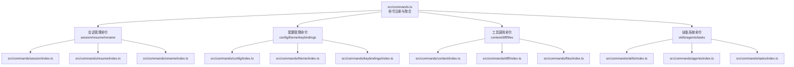
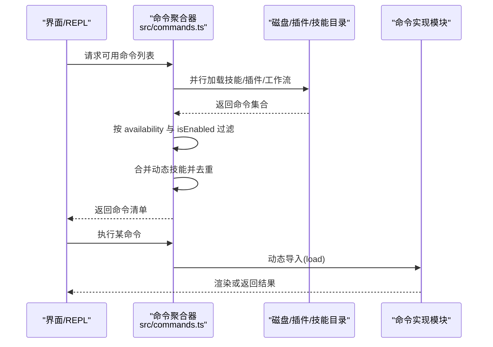
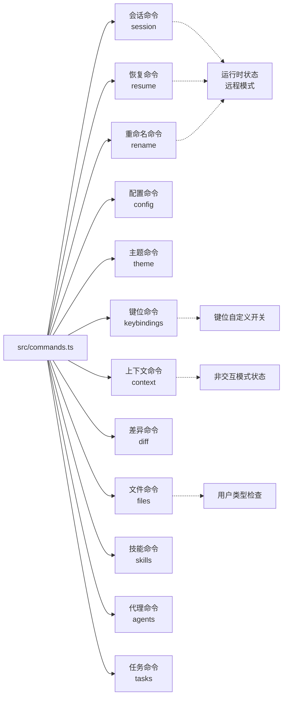

# 内置命令详解

<cite>
**本文引用的文件**
- [src/commands.ts](file://src/commands.ts)
- [src/commands/session/index.ts](file://src/commands/session/index.ts)
- [src/commands/resume/index.ts](file://src/commands/resume/index.ts)
- [src/commands/rename/index.ts](file://src/commands/rename/index.ts)
- [src/commands/config/index.ts](file://src/commands/config/index.ts)
- [src/commands/theme/index.ts](file://src/commands/theme/index.ts)
- [src/commands/keybindings/index.ts](file://src/commands/keybindings/index.ts)
- [src/commands/context/index.ts](file://src/commands/context/index.ts)
- [src/commands/diff/index.ts](file://src/commands/diff/index.ts)
- [src/commands/files/index.ts](file://src/commands/files/index.ts)
- [src/commands/skills/index.ts](file://src/commands/skills/index.ts)
- [src/commands/agents/index.ts](file://src/commands/agents/index.ts)
- [src/commands/tasks/index.ts](file://src/commands/tasks/index.ts)
</cite>

## 目录
1. [简介](#简介)
2. [项目结构](#项目结构)
3. [核心组件](#核心组件)
4. [架构总览](#架构总览)
5. [详细组件分析](#详细组件分析)
6. [依赖关系分析](#依赖关系分析)
7. [性能考量](#性能考量)
8. [故障排除指南](#故障排除指南)
9. [结论](#结论)
10. [附录](#附录)

## 简介
本文件为 Claude Code 内置命令系统的权威参考，聚焦以下主题：
- 会话管理命令：session、resume、rename
- 配置管理命令：config、theme、keybindings
- 工具调用命令：context、diff、files
- 技能系统命令：skills、agents、tasks

内容涵盖命令功能、参数与使用方法、别名机制、可用性条件与权限要求、错误处理与故障排除、性能与使用建议，并通过图示展示命令加载与执行流程。

## 项目结构
内置命令由统一入口集中注册与导出，命令定义采用“声明式 + 延迟加载”的模式，支持按需动态导入，以降低启动开销并提升可扩展性。

图表来源
- [src/commands.ts:258-346](file://src/commands.ts#L258-L346)
- [src/commands/session/index.ts:4-14](file://src/commands/session/index.ts#L4-L14)
- [src/commands/resume/index.ts:3-10](file://src/commands/resume/index.ts#L3-L10)
- [src/commands/rename/index.ts:3-10](file://src/commands/rename/index.ts#L3-L10)
- [src/commands/config/index.ts:3-9](file://src/commands/config/index.ts#L3-L9)
- [src/commands/theme/index.ts:3-8](file://src/commands/theme/index.ts#L3-L8)
- [src/commands/keybindings/index.ts:4-11](file://src/commands/keybindings/index.ts#L4-L11)
- [src/commands/context/index.ts:4-24](file://src/commands/context/index.ts#L4-L24)
- [src/commands/diff/index.ts:3-8](file://src/commands/diff/index.ts#L3-L8)
- [src/commands/files/index.ts:3-9](file://src/commands/files/index.ts#L3-L9)
- [src/commands/skills/index.ts:3-8](file://src/commands/skills/index.ts#L3-L8)
- [src/commands/agents/index.ts:3-8](file://src/commands/agents/index.ts#L3-L8)
- [src/commands/tasks/index.ts:3-8](file://src/commands/tasks/index.ts#L3-L8)

章节来源
- [src/commands.ts:258-346](file://src/commands.ts#L258-L346)

## 核心组件
- 命令类型与元数据
  - type：local、local-jsx、prompt 等，决定命令的执行环境与输出形态
  - name/aliases：命令名称与别名，用于命令发现与匹配
  - description：对用户可见的简要说明
  - isEnabled/isHidden：运行时可用性与可见性控制
  - supportsNonInteractive：是否支持非交互模式
  - immediate：是否立即执行（如 rename）
  - argumentHint：提示参数占位符
  - load：延迟加载实现模块
- 可用性与权限
  - availability：按提供方/订阅状态过滤（如 claude-ai、console）
  - 运行时状态：如远程模式、非交互模式、用户类型等
- 安全与远程
  - REMOTE_SAFE_COMMANDS：远程模式下允许显示的命令集合
  - BRIDGE_SAFE_COMMANDS：远程桥接（移动端/网页）安全执行的本地命令集合
  - isBridgeSafeCommand：判断命令在远程桥接输入下是否安全

章节来源
- [src/commands.ts:417-443](file://src/commands.ts#L417-L443)
- [src/commands.ts:619-686](file://src/commands.ts#L619-L686)
- [src/commands.ts:672-676](file://src/commands.ts#L672-L676)

## 架构总览
命令系统通过统一入口聚合内置命令、插件技能、工作流与动态技能，再根据可用性与启用状态进行筛选与去重，最终向 UI 与模型暴露。

图表来源
- [src/commands.ts:449-517](file://src/commands.ts#L449-L517)
- [src/commands.ts:688-719](file://src/commands.ts#L688-L719)

## 详细组件分析

### 会话管理命令

#### 命令：session
- 类型与用途
  - 类型：local-jsx
  - 功能：在远程模式下展示远程会话 URL 与二维码
  - 别名：remote
  - 可见性：仅在远程模式下显示
- 参数与行为
  - 无显式参数；通过运行时状态决定是否可用
- 使用示例
  - 在远程模式下输入 /session 或 /remote，查看会话入口
- 最佳实践
  - 仅在需要从移动设备或网页端访问会话时使用
- 权限与可用性
  - 仅在远程模式下启用
- 错误处理与故障排除
  - 若未处于远程模式，命令不可见；请先启用远程模式后再尝试

章节来源
- [src/commands/session/index.ts:4-14](file://src/commands/session/index.ts#L4-L14)

#### 命令：resume
- 类型与用途
  - 类型：local-jsx
  - 功能：恢复之前的对话
  - 别名：continue
  - 支持参数：可选的会话 ID 或搜索关键词
- 参数与行为
  - argumentHint：[conversation id or search term]
- 使用示例
  - 输入 /resume 或 /continue，随后选择历史会话
- 最佳实践
  - 使用搜索关键词快速定位相关会话
- 权限与可用性
  - 通用可用
- 错误处理与故障排除
  - 若无历史会话，将提示无法恢复

章节来源
- [src/commands/resume/index.ts:3-10](file://src/commands/resume/index.ts#L3-L10)

#### 命令：rename
- 类型与用途
  - 类型：local-jsx
  - 功能：重命名当前对话
  - 行为：immediate=true，立即执行
- 参数与行为
  - argumentHint：[name]
- 使用示例
  - 输入 /rename NewName 即刻生效
- 最佳实践
  - 建议使用简洁明确的名称便于检索
- 权限与可用性
  - 通用可用
- 错误处理与故障排除
  - 名称为空或无效字符时，将提示重新输入

章节来源
- [src/commands/rename/index.ts:3-10](file://src/commands/rename/index.ts#L3-L10)

### 配置管理命令

#### 命令：config
- 类型与用途
  - 类型：local-jsx
  - 功能：打开配置面板
  - 别名：settings
- 参数与行为
  - 无显式参数
- 使用示例
  - 输入 /config 或 /settings 打开设置界面
- 最佳实践
  - 结合主题与键位绑定使用，提升操作效率
- 权限与可用性
  - 通用可用
- 错误处理与故障排除
  - 设置界面异常时，可尝试重启应用后重试

章节来源
- [src/commands/config/index.ts:3-9](file://src/commands/config/index.ts#L3-L9)

#### 命令：theme
- 类型与用途
  - 类型：local-jsx
  - 功能：切换终端主题
- 参数与行为
  - 无显式参数
- 使用示例
  - 输入 /theme 选择主题
- 最佳实践
  - 根据环境光照选择明/暗主题
- 权限与可用性
  - 通用可用
- 错误处理与故障排除
  - 主题切换失败时检查终端兼容性

章节来源
- [src/commands/theme/index.ts:3-8](file://src/commands/theme/index.ts#L3-L8)

#### 命令：keybindings
- 类型与用途
  - 类型：local
  - 功能：打开或创建键位绑定配置文件
- 参数与行为
  - 不支持非交互模式
- 使用示例
  - 输入 /keybindings 打开配置文件
- 最佳实践
  - 自定义键位前先备份原配置
- 权限与可用性
  - 受键位自定义开关控制（isEnabled 由运行时检测）
- 错误处理与故障排除
  - 若禁用自定义键位，命令不可用；请在设置中开启

章节来源
- [src/commands/keybindings/index.ts:4-11](file://src/commands/keybindings/index.ts#L4-L11)

### 工具调用命令

#### 命令：context
- 类型与用途
  - 类型：local-jsx（交互式网格可视化）
  - 功能：以彩色网格可视化当前上下文占用情况
  - 可见性：仅在非交互模式下隐藏
- 参数与行为
  - 无显式参数
- 使用示例
  - 输入 /context 查看上下文分布
- 最佳实践
  - 结合 compact 缩减上下文，避免超出限制
- 权限与可用性
  - 非交互模式下不可见
- 错误处理与故障排除
  - 若无上下文信息，将提示暂无可视化数据

章节来源
- [src/commands/context/index.ts:4-10](file://src/commands/context/index.ts#L4-L10)

#### 命令：context（非交互）
- 类型与用途
  - 类型：local（文本输出）
  - 功能：显示当前上下文使用情况
  - 支持非交互模式
  - 可见性：仅在非交互模式下显示
- 参数与行为
  - 无显式参数
- 使用示例
  - 在脚本或自动化场景中使用
- 最佳实践
  - 与 CI/CD 流水线结合，监控上下文占用
- 权限与可用性
  - 非交互模式下可用
- 错误处理与故障排除
  - 输出格式可能随实现更新，请关注版本变更

章节来源
- [src/commands/context/index.ts:12-24](file://src/commands/context/index.ts#L12-L24)

#### 命令：diff
- 类型与用途
  - 类型：local-jsx
  - 功能：查看未提交变更与按轮次的差异
- 参数与行为
  - 无显式参数
- 使用示例
  - 输入 /diff 查看工作区变更
- 最佳实践
  - 在提交前核对 diff，确保变更符合预期
- 权限与可用性
  - 通用可用
- 错误处理与故障排除
  - 若无变更或仓库状态异常，将提示无差异

章节来源
- [src/commands/diff/index.ts:3-8](file://src/commands/diff/index.ts#L3-L8)

#### 命令：files
- 类型与用途
  - 类型：local
  - 功能：列出当前上下文中跟踪的所有文件
  - 支持非交互模式
- 参数与行为
  - 无显式参数
- 使用示例
  - 输入 /files 获取文件清单
- 最佳实践
  - 与 context 结合，评估文件数量对上下文的影响
- 权限与可用性
  - 仅在特定用户类型（ANT）下可用
- 错误处理与故障排除
  - 若当前无文件在上下文中，将提示空列表

章节来源
- [src/commands/files/index.ts:3-9](file://src/commands/files/index.ts#L3-L9)

### 技能系统命令

#### 命令：skills
- 类型与用途
  - 类型：local-jsx
  - 功能：列出可用技能
- 参数与行为
  - 无显式参数
- 使用示例
  - 输入 /skills 查看技能列表
- 最佳实践
  - 结合模型调用能力，优先选择描述清晰的技能
- 权限与可用性
  - 通用可用
- 错误处理与故障排除
  - 技能加载失败时，系统会降级并记录日志

章节来源
- [src/commands/skills/index.ts:3-8](file://src/commands/skills/index.ts#L3-L8)

#### 命令：agents
- 类型与用途
  - 类型：local-jsx
  - 功能：管理代理配置
- 参数与行为
  - 无显式参数
- 使用示例
  - 输入 /agents 打开代理管理界面
- 最佳实践
  - 为不同任务场景配置专用代理
- 权限与可用性
  - 通用可用
- 错误处理与故障排除
  - 配置冲突时，按提示修正后重试

章节来源
- [src/commands/agents/index.ts:3-8](file://src/commands/agents/index.ts#L3-L8)

#### 命令：tasks
- 类型与用途
  - 类型：local-jsx
  - 功能：列出与管理后台任务
  - 别名：bashes
- 参数与行为
  - 无显式参数
- 使用示例
  - 输入 /tasks 或 /bashes 查看任务队列
- 最佳实践
  - 定期清理已完成任务，保持队列整洁
- 权限与可用性
  - 通用可用
- 错误处理与故障排除
  - 任务异常时，查看任务详情并重试

章节来源
- [src/commands/tasks/index.ts:3-8](file://src/commands/tasks/index.ts#L3-L8)

## 依赖关系分析
命令系统通过统一入口聚合多源命令，内部存在以下关键依赖链：

图表来源
- [src/commands.ts:258-346](file://src/commands.ts#L258-L346)
- [src/commands/session/index.ts:4-14](file://src/commands/session/index.ts#L4-L14)
- [src/commands/resume/index.ts:3-10](file://src/commands/resume/index.ts#L3-L10)
- [src/commands/rename/index.ts:3-10](file://src/commands/rename/index.ts#L3-L10)
- [src/commands/context/index.ts:4-24](file://src/commands/context/index.ts#L4-L24)
- [src/commands/keybindings/index.ts:4-11](file://src/commands/keybindings/index.ts#L4-L11)
- [src/commands/files/index.ts:3-9](file://src/commands/files/index.ts#L3-L9)

章节来源
- [src/commands.ts:258-346](file://src/commands.ts#L258-L346)

## 性能考量
- 延迟加载与缓存
  - 命令通过 load 延迟导入，减少初始化时间
  - getCommands 与相关加载函数采用 memoize 缓存，避免重复 I/O
- 动态技能与去重
  - 动态技能在合并时进行去重，避免重复命令影响性能
- 远程与桥接安全
  - 通过 REMOTE_SAFE_COMMANDS 与 BRIDGE_SAFE_COMMANDS 过滤，减少不必要的渲染与网络传输
- 非交互模式
  - 非交互命令（如 files、contextNonInteractive）仅在必要时启用，降低资源消耗

章节来源
- [src/commands.ts:449-517](file://src/commands.ts#L449-L517)
- [src/commands.ts:619-686](file://src/commands.ts#L619-L686)
- [src/commands.ts:672-676](file://src/commands.ts#L672-L676)

## 故障排除指南
- 命令不可见或不可用
  - 检查运行时状态（如远程模式、非交互模式、用户类型）
  - 确认 availability 与 isEnabled 的条件是否满足
- 键位命令不可用
  - 确认键位自定义开关已启用
- 文件列表为空
  - 确认当前上下文是否包含文件，或用户类型是否满足
- 远程/桥接命令异常
  - 仅允许安全命令执行；确认命令是否在安全白名单内
- 命令加载失败
  - 系统会降级并记录错误日志；重启后重试

章节来源
- [src/commands.ts:417-443](file://src/commands.ts#L417-L443)
- [src/commands.ts:619-686](file://src/commands.ts#L619-L686)
- [src/commands.ts:672-676](file://src/commands.ts#L672-L676)

## 结论
Claude Code 内置命令系统以声明式与延迟加载为核心设计，兼顾易用性与可扩展性。通过统一入口聚合多源命令、严格的可用性与安全策略，以及完善的缓存与去重机制，为用户提供稳定高效的命令体验。建议在日常使用中结合上下文管理与主题/键位优化，配合远程与桥接安全策略，获得更流畅的开发与协作体验。

## 附录
- 命令别名与组合使用模式
  - session 与 remote：远程模式下的会话入口
  - resume 与 continue：恢复历史会话
  - rename：立即重命名当前会话
  - config 与 settings：配置面板入口
  - tasks 与 bashes：后台任务管理
- 常见组合
  - 在远程模式下：/session → 扫码接入 → 使用 /tasks 管理后台任务
  - 配置优化：/theme → /keybindings → /config
  - 上下文优化：/context → /compact → /files