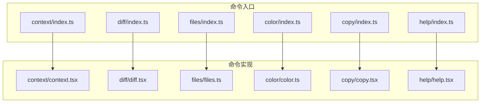
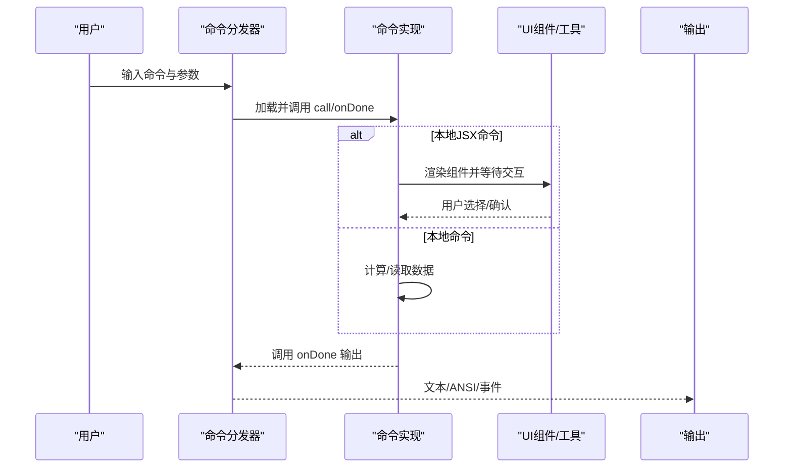
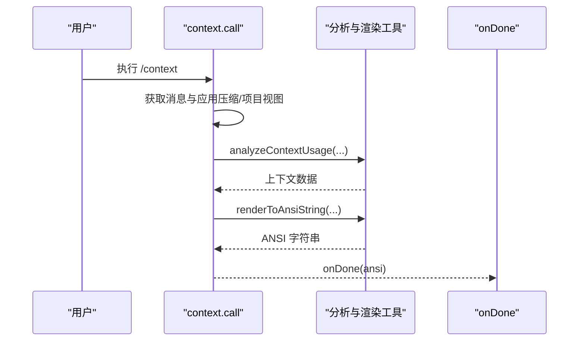
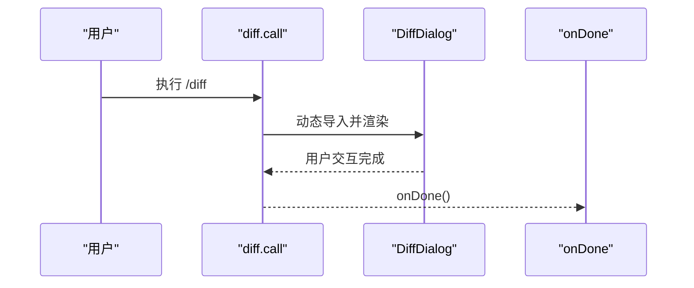
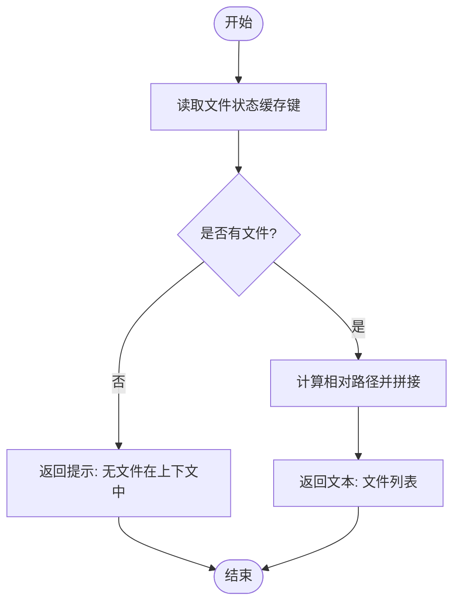
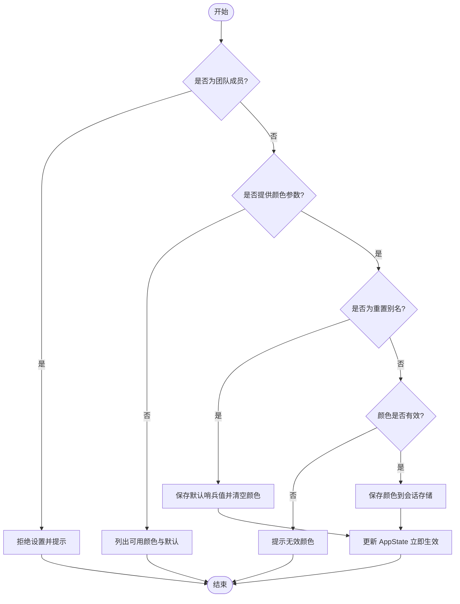
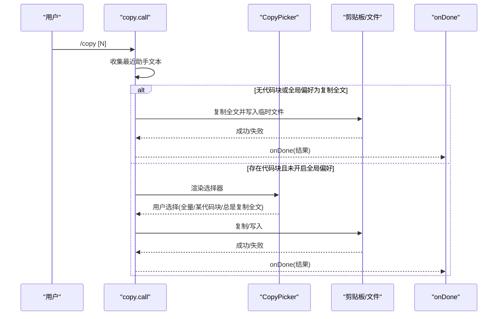
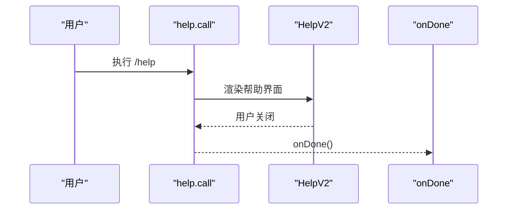
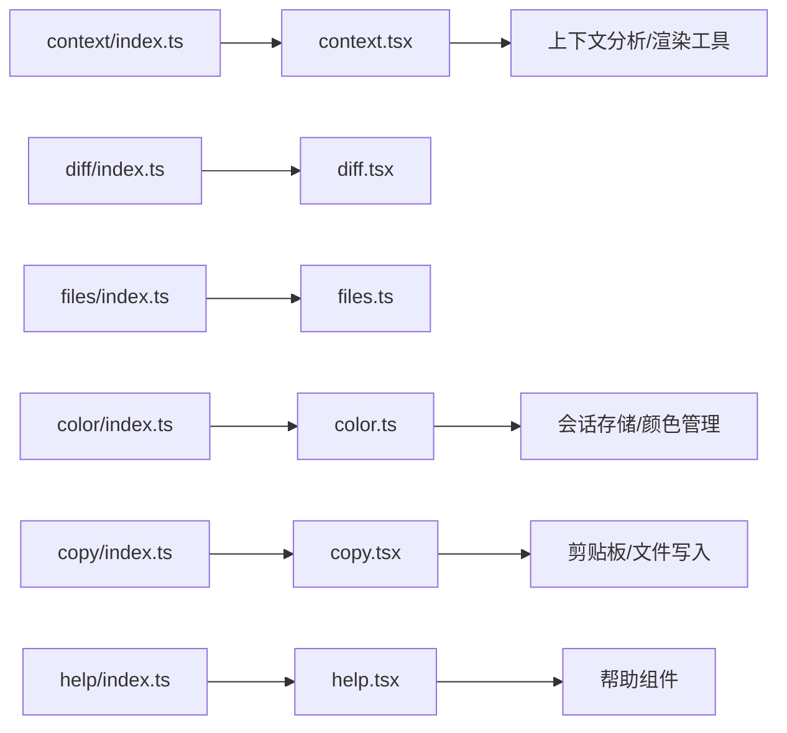

# 实用工具命令

<cite>
**本文引用的文件**
- [src/commands/context/index.ts](file://src/commands/context/index.ts)
- [src/commands/context/context.tsx](file://src/commands/context/context.tsx)
- [src/commands/diff/index.ts](file://src/commands/diff/index.ts)
- [src/commands/diff/diff.tsx](file://src/commands/diff/diff.tsx)
- [src/commands/files/index.ts](file://src/commands/files/index.ts)
- [src/commands/files/files.ts](file://src/commands/files/files.ts)
- [src/commands/color/index.ts](file://src/commands/color/index.ts)
- [src/commands/color/color.ts](file://src/commands/color/color.ts)
- [src/commands/copy/index.ts](file://src/commands/copy/index.ts)
- [src/commands/copy/copy.tsx](file://src/commands/copy/copy.tsx)
- [src/commands/help/index.ts](file://src/commands/help/index.ts)
- [src/commands/help/help.tsx](file://src/commands/help/help.tsx)
</cite>

## 目录
1. [简介](#简介)
2. [项目结构](#项目结构)
3. [核心组件](#核心组件)
4. [架构总览](#架构总览)
5. [详细组件分析](#详细组件分析)
6. [依赖关系分析](#依赖关系分析)
7. [性能考量](#性能考量)
8. [故障排查指南](#故障排查指南)
9. [结论](#结论)
10. [附录](#附录)

## 简介
本文件为 Claude Code 实用工具命令的权威参考，覆盖以下命令：
- context：上下文分析与可视化（交互式网格视图）
- diff：查看未提交变更与按轮次差异
- files：列出当前上下文中文件
- color：设置会话提示栏颜色（支持重置）
- copy：复制 Claude 最近回复（支持选择代码块或全文）
- help：显示帮助与可用命令列表

文档将从系统架构、数据流、处理逻辑、集成点、错误处理与性能特性等维度进行深入解析，并提供参数选项、输出格式、使用技巧、组合用法与自动化脚本思路。

## 项目结构
实用工具命令均位于 src/commands 下的子目录中，采用“命令名/index.ts + 命令实现”的组织方式；部分命令以本地 JSX 命令形式渲染 UI 组件，另一些为纯本地命令返回文本结果。

图表来源
- [src/commands/context/index.ts:1-25](file://src/commands/context/index.ts#L1-L25)
- [src/commands/context/context.tsx:1-64](file://src/commands/context/context.tsx#L1-L64)
- [src/commands/diff/index.ts:1-9](file://src/commands/diff/index.ts#L1-L9)
- [src/commands/diff/diff.tsx:1-9](file://src/commands/diff/diff.tsx#L1-L9)
- [src/commands/files/index.ts:1-13](file://src/commands/files/index.ts#L1-L13)
- [src/commands/files/files.ts:1-20](file://src/commands/files/files.ts#L1-L20)
- [src/commands/color/index.ts:1-17](file://src/commands/color/index.ts#L1-L17)
- [src/commands/color/color.ts:1-94](file://src/commands/color/color.ts#L1-L94)
- [src/commands/copy/index.ts:1-16](file://src/commands/copy/index.ts#L1-L16)
- [src/commands/copy/copy.tsx:1-371](file://src/commands/copy/copy.tsx#L1-L371)
- [src/commands/help/index.ts:1-11](file://src/commands/help/index.ts#L1-L11)
- [src/commands/help/help.tsx:1-11](file://src/commands/help/help.tsx#L1-L11)

章节来源
- [src/commands/context/index.ts:1-25](file://src/commands/context/index.ts#L1-L25)
- [src/commands/diff/index.ts:1-9](file://src/commands/diff/index.ts#L1-L9)
- [src/commands/files/index.ts:1-13](file://src/commands/files/index.ts#L1-L13)
- [src/commands/color/index.ts:1-17](file://src/commands/color/index.ts#L1-L17)
- [src/commands/copy/index.ts:1-16](file://src/commands/copy/index.ts#L1-L16)
- [src/commands/help/index.ts:1-11](file://src/commands/help/index.ts#L1-L11)

## 核心组件
- context：在交互式界面中以彩色网格展示当前上下文使用情况，结合消息压缩与项目视图，呈现模型实际看到的内容。
- diff：打开差异对话框，展示未提交变更与按轮次的差异。
- files：列出当前上下文中已加载文件路径（相对工作目录）。
- color：设置会话提示栏颜色，支持默认重置；对团队成员有权限限制。
- copy：复制 Claude 最近回复，支持选择具体代码块或全文；同时写入临时文件作为剪贴板不可用时的后备。
- help：渲染帮助界面，列出所有可用命令并提供关闭回调。

章节来源
- [src/commands/context/context.tsx:1-64](file://src/commands/context/context.tsx#L1-L64)
- [src/commands/diff/diff.tsx:1-9](file://src/commands/diff/diff.tsx#L1-L9)
- [src/commands/files/files.ts:1-20](file://src/commands/files/files.ts#L1-L20)
- [src/commands/color/color.ts:1-94](file://src/commands/color/color.ts#L1-L94)
- [src/commands/copy/copy.tsx:1-371](file://src/commands/copy/copy.tsx#L1-L371)
- [src/commands/help/help.tsx:1-11](file://src/commands/help/help.tsx#L1-L11)

## 架构总览
命令执行流程遵循统一模式：命令注册定义元信息与加载器；调用时根据类型决定是渲染 JSX 组件还是返回文本结果；通过 onDone 回调输出最终结果；部分命令访问全局状态、配置与工具权限上下文。

图表来源
- [src/commands/context/context.tsx:30-63](file://src/commands/context/context.tsx#L30-L63)
- [src/commands/copy/copy.tsx:334-371](file://src/commands/copy/copy.tsx#L334-L371)
- [src/commands/diff/diff.tsx:3-8](file://src/commands/diff/diff.tsx#L3-L8)
- [src/commands/files/files.ts:7-20](file://src/commands/files/files.ts#L7-L20)
- [src/commands/color/color.ts:20-94](file://src/commands/color/color.ts#L20-L94)
- [src/commands/help/help.tsx:4-10](file://src/commands/help/help.tsx#L4-L10)

## 详细组件分析

### context 命令
- 功能：将当前对话历史转换为模型视角（经压缩与项目视图），生成彩色网格可视化，并以 ANSI 字符串输出。
- 关键处理：
  - 将消息经压缩边界后转换为 API 视图，必要时应用项目视图以消除折叠误差。
  - 使用微压缩算法得到发送给 API 的消息集合。
  - 分析上下文使用并渲染到终端宽度，再转为 ANSI 字符串输出。
- 参数与行为：
  - 非交互会话下提供非交互变体；交互会话下渲染彩色网格。
  - 输出为可直接在终端显示的 ANSI 字符串。
- 典型应用场景：
  - 快速评估上下文占用、识别大段折叠区域、定位长历史导致的 token 溢出风险。
- 使用技巧：
  - 在大型对话中先运行 /context，再结合 /files 查看哪些文件被纳入上下文。
  - 结合 /diff 对比不同轮次的上下文变化。

图表来源
- [src/commands/context/context.tsx:18-63](file://src/commands/context/context.tsx#L18-L63)

章节来源
- [src/commands/context/index.ts:4-24](file://src/commands/context/index.ts#L4-L24)
- [src/commands/context/context.tsx:18-63](file://src/commands/context/context.tsx#L18-L63)

### diff 命令
- 功能：打开差异对话框，展示未提交变更与按轮次的差异。
- 行为：加载差异组件并传入当前消息上下文，由组件负责渲染与交互。
- 应用场景：对比工作区变更、审查某一轮对话引入的改动。

图表来源
- [src/commands/diff/diff.tsx:3-8](file://src/commands/diff/diff.tsx#L3-L8)

章节来源
- [src/commands/diff/index.ts:3-8](file://src/commands/diff/index.ts#L3-L8)
- [src/commands/diff/diff.tsx:1-9](file://src/commands/diff/diff.tsx#L1-L9)

### files 命令
- 功能：列出当前上下文中已加载的文件路径（相对工作目录）。
- 行为：读取文件状态缓存键，映射为相对路径并换行输出；若无文件则提示。
- 参数：无。
- 应用场景：快速确认哪些文件参与了当前上下文，辅助 /context 与 /diff 的解读。

图表来源
- [src/commands/files/files.ts:7-20](file://src/commands/files/files.ts#L7-L20)

章节来源
- [src/commands/files/index.ts:3-12](file://src/commands/files/index.ts#L3-L12)
- [src/commands/files/files.ts:1-20](file://src/commands/files/files.ts#L1-L20)

### color 命令
- 功能：设置会话提示栏颜色；支持默认重置。
- 权限：团队成员无法自行设置颜色，需由团队领导分配。
- 行为：
  - 无参数时列出可用颜色与默认选项。
  - 接受颜色名或别名（如 default/reset/none/gray/grey），重置为默认灰。
  - 保存到会话存储并在 AppState 中即时生效。
- 参数：
  - <color|default>：颜色名称或重置别名。
- 应用场景：区分多会话颜色、便于视觉定位。

图表来源
- [src/commands/color/color.ts:20-94](file://src/commands/color/color.ts#L20-L94)

章节来源
- [src/commands/color/index.ts:7-16](file://src/commands/color/index.ts#L7-L16)
- [src/commands/color/color.ts:1-94](file://src/commands/color/color.ts#L1-L94)

### copy 命令
- 功能：复制 Claude 最近回复；支持选择具体代码块或全文；同时写入临时文件作为后备。
- 行为：
  - 收集最近若干条助手消息文本（上限常量）。
  - 解析 Markdown 提取代码块；若无代码块或全局偏好为复制全文，则直接复制/写入全文。
  - 否则弹出选择器：全量、各代码块、总是复制全文（可持久化）。
  - 支持快捷键：回车复制、W 写入文件、ESC 取消。
- 参数：
  - [N]：第 N 条最新回复（1 为最新，2 为次新，依此类推）。
- 输出：复制成功提示（字符数与行数），并尝试写入临时文件。
- 应用场景：批量提取代码片段、一键复制完整回复、离线备份。

图表来源
- [src/commands/copy/copy.tsx:334-371](file://src/commands/copy/copy.tsx#L334-L371)

章节来源
- [src/commands/copy/index.ts:7-15](file://src/commands/copy/index.ts#L7-L15)
- [src/commands/copy/copy.tsx:1-371](file://src/commands/copy/copy.tsx#L1-L371)

### help 命令
- 功能：显示帮助界面，列出所有可用命令并提供关闭回调。
- 行为：动态导入帮助组件并传入命令集合，渲染后通过 onDone 关闭。
- 应用场景：首次使用或忘记命令时快速查阅。

图表来源
- [src/commands/help/help.tsx:4-10](file://src/commands/help/help.tsx#L4-L10)

章节来源
- [src/commands/help/index.ts:3-10](file://src/commands/help/index.ts#L3-L10)
- [src/commands/help/help.tsx:1-11](file://src/commands/help/help.tsx#L1-L11)

## 依赖关系分析
- 命令注册：各命令通过 index.ts 导出 Command 定义，声明类型、名称、描述、是否支持非交互、加载器等。
- 交互式命令：context、diff、copy、help 为本地 JSX 命令，依赖 UI 组件与消息上下文；files、color 为本地命令，返回文本或更新状态。
- 工具与服务：context 使用上下文分析与渲染工具；copy 使用剪贴板与临时文件写入；color 使用会话存储与颜色管理；help 使用帮助组件。

图表来源
- [src/commands/context/index.ts:4-10](file://src/commands/context/index.ts#L4-L10)
- [src/commands/diff/index.ts:3-8](file://src/commands/diff/index.ts#L3-L8)
- [src/commands/files/index.ts:3-10](file://src/commands/files/index.ts#L3-L10)
- [src/commands/color/index.ts:7-14](file://src/commands/color/index.ts#L7-L14)
- [src/commands/copy/index.ts:7-13](file://src/commands/copy/index.ts#L7-L13)
- [src/commands/help/index.ts:3-8](file://src/commands/help/index.ts#L3-L8)

章节来源
- [src/commands/context/index.ts:1-25](file://src/commands/context/index.ts#L1-L25)
- [src/commands/diff/index.ts:1-9](file://src/commands/diff/index.ts#L1-L9)
- [src/commands/files/index.ts:1-13](file://src/commands/files/index.ts#L1-L13)
- [src/commands/color/index.ts:1-17](file://src/commands/color/index.ts#L1-L17)
- [src/commands/copy/index.ts:1-16](file://src/commands/copy/index.ts#L1-L16)
- [src/commands/help/index.ts:1-11](file://src/commands/help/index.ts#L1-L11)

## 性能考量
- context：
  - 在大型历史中进行压缩与项目视图转换，避免重复统计折叠内容，减少 token 误报。
  - 终端宽度自适应，避免过宽导致渲染抖动。
- copy：
  - 仅回溯有限条消息（上限常量），避免遍历全量历史造成开销。
  - 优先使用剪贴板，失败时回退到临时文件写入，兼顾可靠性与性能。
- files/color/help：
  - files 为 O(n) 列表化；color 为即时状态更新；help 为轻量 UI 渲染，开销极低。
- 建议：
  - 在超长对话中定期使用 /context 评估上下文占用，必要时清理旧消息或缩小文件范围。
  - 使用 /copy 时优先选择代码块，减少复制体积；需要全文时启用“总是复制全文”偏好以减少交互成本。

## 故障排查指南
- /copy 无响应或复制失败：
  - 检查终端是否支持剪贴板协议；若不支持，临时文件会作为后备，检查默认临时目录权限。
  - 确认消息上下文中存在可提取文本（排除纯工具调用轮次）。
- /color 设置无效：
  - 若提示“此会话为群蜂队友”，请由团队领导设置颜色。
  - 确认输入的颜色名在可用列表内，或使用重置别名。
- /files 显示为空：
  - 确认当前上下文确实加载了文件；可先运行 /context 或 /diff 辅助判断。
- /help 无法显示：
  - 确认命令注册正常，且帮助组件可被动态导入。

章节来源
- [src/commands/copy/copy.tsx:81-94](file://src/commands/copy/copy.tsx#L81-L94)
- [src/commands/color/color.ts:25-32](file://src/commands/color/color.ts#L25-L32)
- [src/commands/color/color.ts:66-73](file://src/commands/color/color.ts#L66-L73)
- [src/commands/files/files.ts:13-15](file://src/commands/files/files.ts#L13-L15)
- [src/commands/help/help.tsx:4-10](file://src/commands/help/help.tsx#L4-L10)

## 结论
上述实用工具命令围绕“上下文可视化、差异审阅、文件清单、颜色管理、回复复制、帮助导航”构建了高效的日常开发辅助能力。通过合理的参数设计、交互式 UI 与稳健的后备策略，既满足新手易用性，也兼顾资深用户的性能与自动化需求。建议在团队协作中配合使用，形成“审阅上下文—对比差异—核对文件—复制代码—查阅帮助”的标准工作流。

## 附录
- 常见组合用法示例（思路）
  - 审阅上下文与差异：/context → /diff → /files → 评估与调整
  - 快速复制代码：/copy → 选择代码块 → 自动写入临时文件
  - 多会话颜色区分：/color blue → /color default（重置）
  - 查看命令列表：/help → 快速定位所需命令
- 自动化脚本思路（概念）
  - 基于非交互命令输出进行批处理：例如定期导出 /files 列表与 /context 输出，结合日志分析上下文增长趋势。
  - 将 /copy 的临时文件路径纳入版本控制外的归档策略，便于后续检索。
  - 在 CI 场景中，结合 /diff 与 /context 输出生成报告摘要。