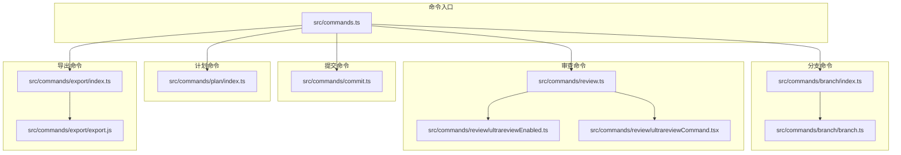
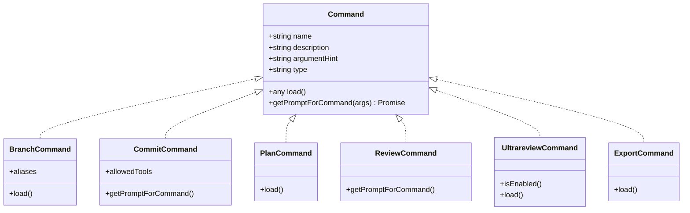
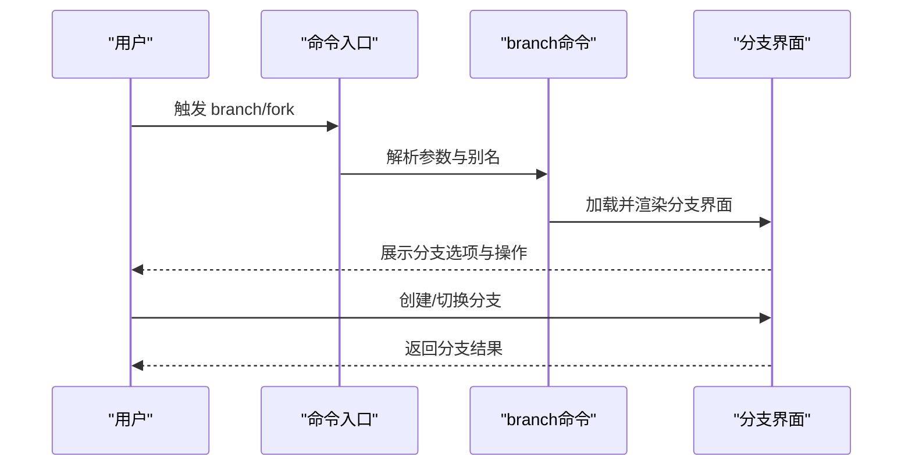
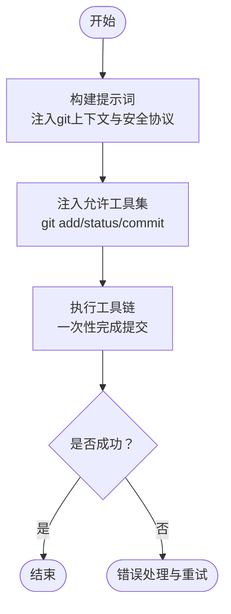
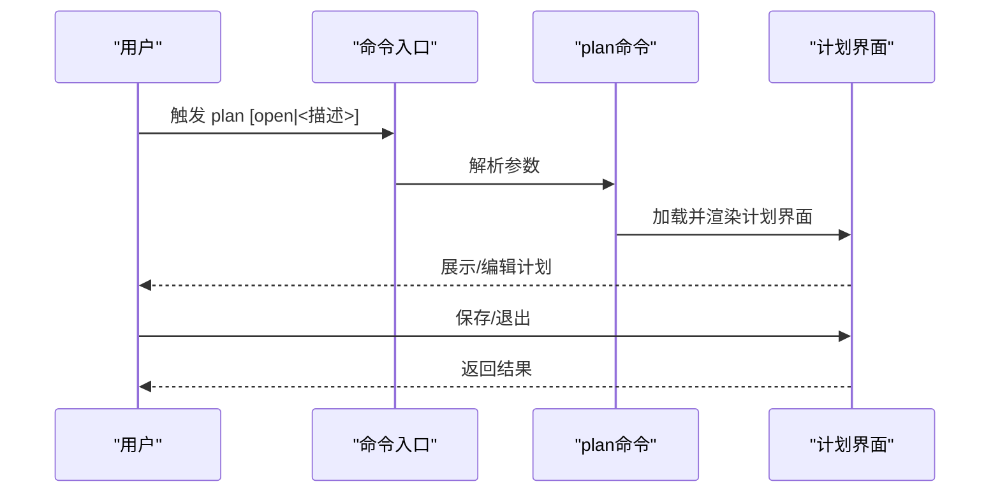
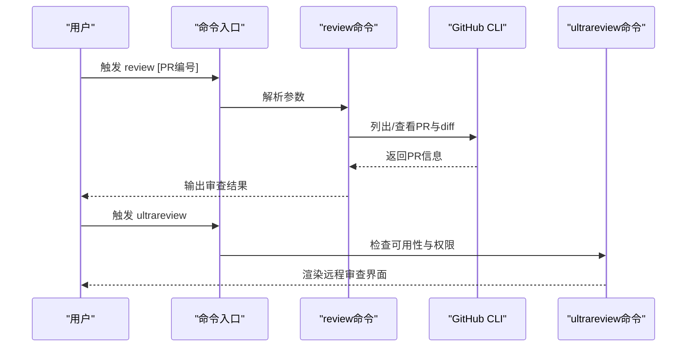
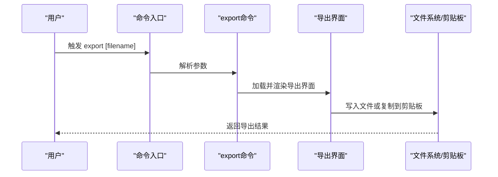
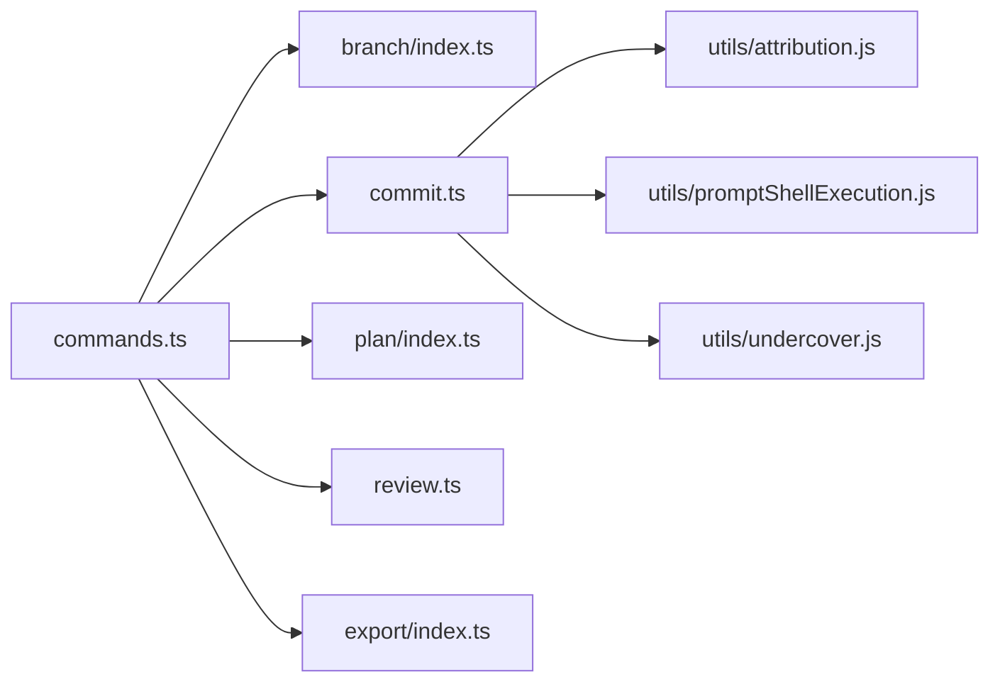

# 开发工具命令

<cite>
**本文引用的文件**
- [src/commands/branch/index.ts](file://src/commands/branch/index.ts)
- [src/commands/branch/branch.ts](file://src/commands/branch/branch.ts)
- [src/commands/commit.ts](file://src/commands/commit.ts)
- [src/commands/plan/index.ts](file://src/commands/plan/index.ts)
- [src/commands/review.ts](file://src/commands/review.ts)
- [src/commands/review/ultrareviewEnabled.ts](file://src/commands/review/ultrareviewEnabled.ts)
- [src/commands/review/ultrareviewCommand.tsx](file://src/commands/review/ultrareviewCommand.tsx)
- [src/commands/export/index.ts](file://src/commands/export/index.ts)
- [src/commands/export/export.js](file://src/commands/export/export.js)
- [src/commands.ts](file://src/commands.ts)
- [src/utils/attribution.js](file://src/utils/attribution.js)
- [src/utils/promptShellExecution.js](file://src/utils/promptShellExecution.js)
- [src/utils/undercover.js](file://src/utils/undercover.js)
</cite>

## 目录
1. [简介](#简介)
2. [项目结构](#项目结构)
3. [核心组件](#核心组件)
4. [架构总览](#架构总览)
5. [详细组件分析](#详细组件分析)
6. [依赖关系分析](#依赖关系分析)
7. [性能考量](#性能考量)
8. [故障排查指南](#故障排查指南)
9. [结论](#结论)
10. [附录](#附录)

## 简介
本文件面向Claude Code开发工具中的命令系统，聚焦以下开发相关命令的技术文档：branch（分支管理与切换）、commit（代码提交与版本控制）、plan（开发计划制定）、review（代码审查与质量检查）、export（导出对话与报告）。文档将说明各命令的功能、实现细节、与版本控制系统的集成方式、最佳实践与自动化脚本建议，并给出代码质量保障与持续集成相关配置要点。

## 项目结构
命令模块位于src/commands目录下，采用按功能分层的组织方式：
- 命令入口与注册：commands.ts负责聚合所有命令定义
- 各命令独立子目录：branch、commit、plan、review、export等
- 工具与辅助模块：utils下的attribution、promptShellExecution、undercover等

**图表来源**
- [src/commands.ts](file://src/commands.ts)
- [src/commands/branch/index.ts](file://src/commands/branch/index.ts)
- [src/commands/branch/branch.ts](file://src/commands/branch/branch.ts)
- [src/commands/commit.ts](file://src/commands/commit.ts)
- [src/commands/plan/index.ts](file://src/commands/plan/index.ts)
- [src/commands/review.ts](file://src/commands/review.ts)
- [src/commands/review/ultrareviewEnabled.ts](file://src/commands/review/ultrareviewEnabled.ts)
- [src/commands/review/ultrareviewCommand.tsx](file://src/commands/review/ultrareviewCommand.tsx)
- [src/commands/export/index.ts](file://src/commands/export/index.ts)
- [src/commands/export/export.js](file://src/commands/export/export.js)

**章节来源**
- [src/commands.ts](file://src/commands.ts)
- [src/commands/branch/index.ts](file://src/commands/branch/index.ts)
- [src/commands/commit.ts](file://src/commands/commit.ts)
- [src/commands/plan/index.ts](file://src/commands/plan/index.ts)
- [src/commands/review.ts](file://src/commands/review.ts)
- [src/commands/export/index.ts](file://src/commands/export/index.ts)

## 核心组件
- branch命令：用于在当前会话点创建分支，支持别名“fork”（当特定特性开关启用时）。
- commit命令：通过提示词生成器动态注入git状态信息，限定允许工具集，执行安全的git提交流程。
- plan命令：启用或查看当前会话的计划模式，提供交互式计划制定界面。
- review命令：本地PR审查与ultrareview远程深度审查入口，结合权限与配额控制。
- export命令：将当前对话导出到文件或剪贴板，支持带参数的文件名。

**章节来源**
- [src/commands/branch/index.ts](file://src/commands/branch/index.ts)
- [src/commands/branch/branch.ts](file://src/commands/branch/branch.ts)
- [src/commands/commit.ts](file://src/commands/commit.ts)
- [src/commands/plan/index.ts](file://src/commands/plan/index.ts)
- [src/commands/review.ts](file://src/commands/review.ts)
- [src/commands/export/index.ts](file://src/commands/export/index.ts)

## 架构总览
命令系统以统一的Command类型为契约，通过commands.ts集中注册。每个命令可选择：
- prompt型：通过getPromptForCommand生成提示内容，交由后端工具链执行
- local-jsx型：在前端渲染交互界面，通常用于需要用户确认或复杂UI的场景
- 其他类型：如工具加载器、桥接器等

**图表来源**
- [src/commands.ts](file://src/commands.ts)
- [src/commands/branch/index.ts](file://src/commands/branch/index.ts)
- [src/commands/commit.ts](file://src/commands/commit.ts)
- [src/commands/plan/index.ts](file://src/commands/plan/index.ts)
- [src/commands/review.ts](file://src/commands/review.ts)
- [src/commands/export/index.ts](file://src/commands/export/index.ts)

## 详细组件分析

### branch命令：分支管理与切换
- 功能概述
  - 在当前会话点创建分支，便于并行探索不同方案
  - 支持别名“fork”，当特性开关开启时，优先使用“fork”作为别名
- 实现要点
  - 命令定义位于index.ts，声明type为local-jsx，通过load异步加载分支逻辑
  - 分支具体实现位于branch.ts，负责UI与交互
- 版本控制集成
  - 该命令专注于“会话分支”，不直接操作git；与git的集成体现在后续commit命令对分支上下文的利用
- 最佳实践
  - 在关键决策点使用branch创建分支，避免破坏主会话
  - 使用清晰的分支命名，便于后续合并与追踪

**图表来源**
- [src/commands/branch/index.ts](file://src/commands/branch/index.ts)
- [src/commands/branch/branch.ts](file://src/commands/branch/branch.ts)

**章节来源**
- [src/commands/branch/index.ts](file://src/commands/branch/index.ts)
- [src/commands/branch/branch.ts](file://src/commands/branch/branch.ts)

### commit命令：代码提交与版本控制
- 功能概述
  - 基于当前git状态与变更，生成并执行一次安全的git提交
  - 严格限制允许工具集，确保仅能调用git相关命令
- 安全协议与约束
  - 明确禁止修改git配置、跳过钩子、使用amend（除非用户明确要求）
  - 禁止交互式git命令（如rebase -i），避免无法自动化的输入
  - 警告敏感文件（如.env、凭证文件）不应被提交
- 提示词生成与工具注入
  - 动态注入git状态、diff、分支、最近提交等上下文
  - 自动注入归属信息与卧底模式提示（当满足条件时）
  - 通过alwaysAllowRules提升git工具的权限，确保一次性完成提交
- 版本控制集成
  - 直接与git交互，读取当前分支、状态、差异与历史
  - 生成符合仓库风格的提交信息，避免空提交

**图表来源**
- [src/commands/commit.ts](file://src/commands/commit.ts)
- [src/utils/attribution.js](file://src/utils/attribution.js)
- [src/utils/promptShellExecution.js](file://src/utils/promptShellExecution.js)
- [src/utils/undercover.js](file://src/utils/undercover.js)

**章节来源**
- [src/commands/commit.ts](file://src/commands/commit.ts)
- [src/utils/attribution.js](file://src/utils/attribution.js)
- [src/utils/promptShellExecution.js](file://src/utils/promptShellExecution.js)
- [src/utils/undercover.js](file://src/utils/undercover.js)

### plan命令：开发计划制定
- 功能概述
  - 启用计划模式或查看当前会话计划
  - 支持参数open或直接描述，进入交互式计划制定流程
- 实现要点
  - 命令定义为local-jsx，通过load异步加载计划界面
  - 与会话上下文结合，提供计划视图与编辑能力

**图表来源**
- [src/commands/plan/index.ts](file://src/commands/plan/index.ts)

**章节来源**
- [src/commands/plan/index.ts](file://src/commands/plan/index.ts)

### review命令：代码审查与质量检查
- 功能概述
  - 本地PR审查：列出开放PR、查看PR详情与diff，输出全面的审查意见
  - ultrareview远程深度审查：在网页版Claude Code中运行，适合发现与验证缺陷
- 权限与配额
  - ultrareview通过isEnabled进行可用性判断，超出配额时以local-jsx渲染超量权限对话框
- 集成方式
  - 本地审查依赖gh CLI工具链（列出PR、查看PR、diff）
  - ultrareview通过专用命令加载器接入远程服务

**图表来源**
- [src/commands/review.ts](file://src/commands/review.ts)
- [src/commands/review/ultrareviewEnabled.ts](file://src/commands/review/ultrareviewEnabled.ts)
- [src/commands/review/ultrareviewCommand.tsx](file://src/commands/review/ultrareviewCommand.tsx)

**章节来源**
- [src/commands/review.ts](file://src/commands/review.ts)
- [src/commands/review/ultrareviewEnabled.ts](file://src/commands/review/ultrareviewEnabled.ts)
- [src/commands/review/ultrareviewCommand.tsx](file://src/commands/review/ultrareviewCommand.tsx)

### export命令：导出数据与报告
- 功能概述
  - 将当前对话导出到文件或剪贴板
  - 支持带参数的文件名，便于归档与分享
- 实现要点
  - 命令定义为local-jsx，通过load异步加载导出界面
  - 导出逻辑位于export.js，负责格式化与写入

**图表来源**
- [src/commands/export/index.ts](file://src/commands/export/index.ts)
- [src/commands/export/export.js](file://src/commands/export/export.js)

**章节来源**
- [src/commands/export/index.ts](file://src/commands/export/index.ts)
- [src/commands/export/export.js](file://src/commands/export/export.js)

## 依赖关系分析
- 命令注册与聚合
  - commands.ts集中注册所有命令，branch、commit、plan、review、export均在此处被纳入
- 工具与辅助模块
  - commit命令依赖attribution（归属信息）、promptShellExecution（提示词内shell执行）、undercover（卧底模式）
- 运行时加载
  - 多数命令采用异步load，降低启动时的内存与I/O压力

**图表来源**
- [src/commands.ts](file://src/commands.ts)
- [src/commands/commit.ts](file://src/commands/commit.ts)
- [src/utils/attribution.js](file://src/utils/attribution.js)
- [src/utils/promptShellExecution.js](file://src/utils/promptShellExecution.js)
- [src/utils/undercover.js](file://src/utils/undercover.js)

**章节来源**
- [src/commands.ts](file://src/commands.ts)
- [src/commands/commit.ts](file://src/commands/commit.ts)
- [src/utils/attribution.js](file://src/utils/attribution.js)
- [src/utils/promptShellExecution.js](file://src/utils/promptShellExecution.js)
- [src/utils/undercover.js](file://src/utils/undercover.js)

## 性能考量
- 异步加载与延迟初始化
  - 通过load异步加载命令实现，减少初始启动开销
- 工具权限最小化
  - commit命令仅允许必要的git工具，降低执行风险与资源消耗
- 提示词动态生成
  - 仅注入当前上下文所需的git信息，避免冗余计算

## 故障排查指南
- commit命令常见问题
  - 无变更可提交：若未检测到未跟踪文件或修改，命令将避免创建空提交
  - 敏感文件误提交：命令会警告不应提交的文件（如.env、凭证文件）
  - 交互式命令不可用：禁止使用需要交互输入的git命令（如rebase -i）
  - amend与钩子：默认不使用amend与跳过钩子，除非用户显式请求
- review命令常见问题
  - gh CLI不可用：本地审查依赖gh CLI，请确保已安装并登录
  - ultrareview不可用：检查isEnabled返回值与配额状态
- export命令常见问题
  - 文件写入失败：检查目标路径权限与磁盘空间
  - 剪贴板权限：在某些环境中需授予剪贴板访问权限

**章节来源**
- [src/commands/commit.ts](file://src/commands/commit.ts)
- [src/commands/review.ts](file://src/commands/review.ts)
- [src/commands/export/index.ts](file://src/commands/export/index.ts)

## 结论
本文档梳理了branch、commit、plan、review、export五个开发工具命令的架构设计、实现细节与最佳实践。它们通过统一的Command契约与异步加载机制，实现了高内聚、低耦合的命令体系。commit命令与git深度集成，遵循严格的安全部署协议；review命令兼顾本地与远程审查能力；export命令提供灵活的数据导出能力。配合合理的自动化脚本与CI配置，可显著提升开发效率与代码质量。

## 附录
- 自动化脚本示例（概念性说明）
  - 提交前检查：在commit之前自动执行静态分析与单元测试，确保变更质量
  - 审查触发：在PR创建或更新时自动触发review命令，生成初步审查意见
  - 导出归档：定期将对话导出为报告，用于知识沉淀与审计
- 持续集成配置要点（概念性说明）
  - 在CI流水线中集成review命令，作为质量门禁的一部分
  - 使用export命令生成测试报告与变更摘要，供评审与发布使用
  - 对commit命令进行权限与合规性校验，防止敏感信息泄露