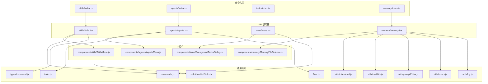
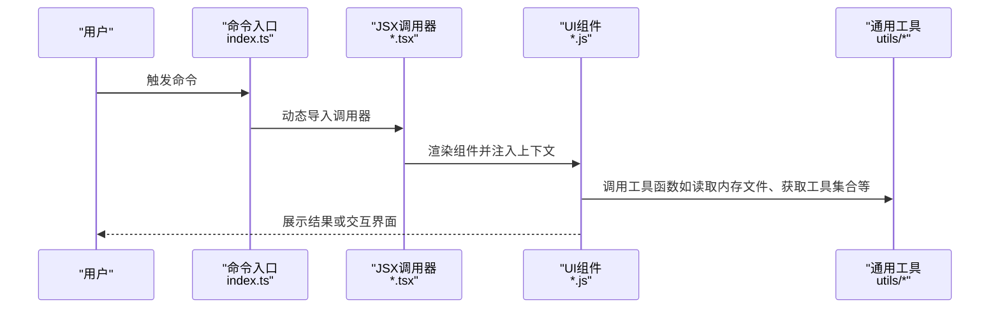
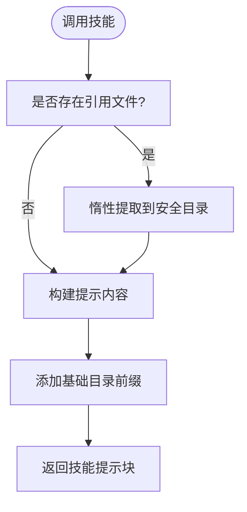
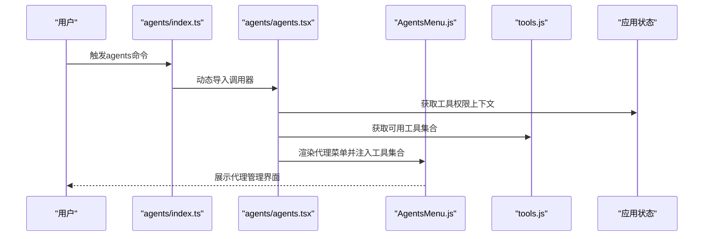
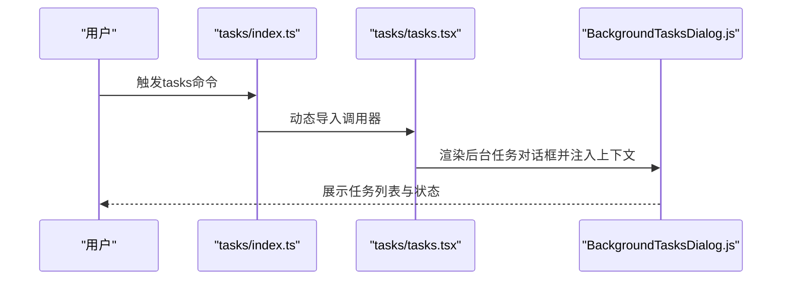
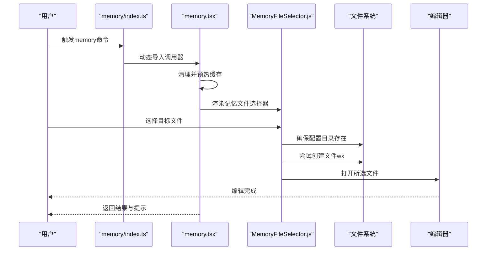
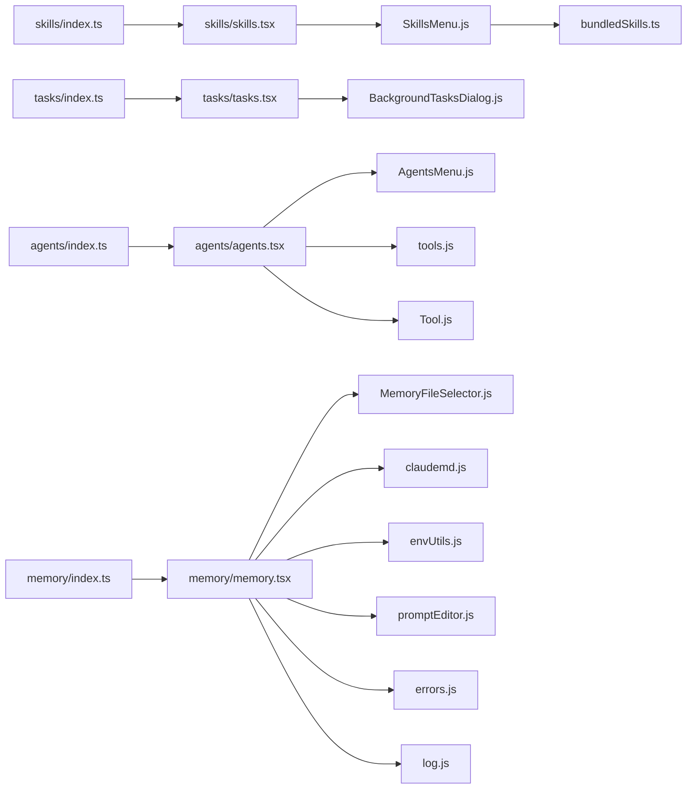

# 技能和代理命令

<cite>
**本文引用的文件**
- [src/commands/skills/index.ts](file://src/commands/skills/index.ts)
- [src/commands/skills/skills.tsx](file://src/commands/skills/skills.tsx)
- [src/commands/agents/index.ts](file://src/commands/agents/index.ts)
- [src/commands/agents/agents.tsx](file://src/commands/agents/agents.tsx)
- [src/commands/tasks/index.ts](file://src/commands/tasks/index.ts)
- [src/commands/tasks/tasks.tsx](file://src/commands/tasks/tasks.tsx)
- [src/commands/memory/index.ts](file://src/commands/memory/index.ts)
- [src/commands/memory/memory.tsx](file://src/commands/memory/memory.tsx)
- [src/skills/bundledSkills.ts](file://src/skills/bundledSkills.ts)
- [src/components/skills/SkillsMenu.js](file://src/components/skills/SkillsMenu.js)
- [src/components/agents/AgentsMenu.js](file://src/components/agents/AgentsMenu.js)
- [src/components/tasks/BackgroundTasksDialog.js](file://src/components/tasks/BackgroundTasksDialog.js)
- [src/components/memory/MemoryFileSelector.js](file://src/components/memory/MemoryFileSelector.js)
- [src/components/memory/MemoryUpdateNotification.js](file://src/components/memory/MemoryUpdateNotification.js)
- [src/utils/claudemd.js](file://src/utils/claudemd.js)
- [src/utils/envUtils.js](file://src/utils/envUtils.js)
- [src/utils/promptEditor.js](file://src/utils/promptEditor.js)
- [src/tools.js](file://src/tools.js)
- [src/commands.js](file://src/commands.js)
- [src/types/command.js](file://src/types/command.js)
- [src/Tool.js](file://src/Tool.js)
- [src/utils/errors.js](file://src/utils/errors.js)
- [src/utils/log.js](file://src/utils/log.js)
</cite>

## 目录
1. [简介](#简介)
2. [项目结构](#项目结构)
3. [核心组件](#核心组件)
4. [架构总览](#架构总览)
5. [详细组件分析](#详细组件分析)
6. [依赖关系分析](#依赖关系分析)
7. [性能考量](#性能考量)
8. [故障排查指南](#故障排查指南)
9. [结论](#结论)
10. [附录](#附录)

## 简介
本文件面向Claude Code技能与代理命令的专业文档，围绕以下四类命令展开：skills（技能管理与调用）、agents（代理创建与管理）、tasks（后台任务列表与管理）、memory（记忆与知识文件编辑）。文档从系统架构、组件关系、数据流与处理逻辑入手，解释技能加载机制、代理工作流程、任务执行状态与记忆存储策略，并提供技能开发、代理配置与任务调度的实际案例，以及多代理协作与技能扩展的高级用法。

## 项目结构
命令模块采用“命令入口 + JSX调用器 + UI组件”的分层设计：
- 命令入口负责声明命令元信息与动态加载器
- JSX调用器负责渲染对应UI组件并注入上下文
- UI组件负责具体交互与业务编排
- 工具与通用能力通过工具函数与工具集合注入

图表来源
- [src/commands/skills/index.ts:1-11](file://src/commands/skills/index.ts#L1-L11)
- [src/commands/skills/skills.tsx:1-8](file://src/commands/skills/skills.tsx#L1-L8)
- [src/commands/agents/index.ts:1-11](file://src/commands/agents/index.ts#L1-L11)
- [src/commands/agents/agents.tsx:1-12](file://src/commands/agents/agents.tsx#L1-L12)
- [src/commands/tasks/index.ts:1-12](file://src/commands/tasks/index.ts#L1-L12)
- [src/commands/tasks/tasks.tsx:1-8](file://src/commands/tasks/tasks.tsx#L1-L8)
- [src/commands/memory/index.ts:1-11](file://src/commands/memory/index.ts#L1-L11)
- [src/commands/memory/memory.tsx:1-90](file://src/commands/memory/memory.tsx#L1-L90)
- [src/skills/bundledSkills.ts:1-221](file://src/skills/bundledSkills.ts#L1-L221)
- [src/components/skills/SkillsMenu.js](file://src/components/skills/SkillsMenu.js)
- [src/components/agents/AgentsMenu.js](file://src/components/agents/AgentsMenu.js)
- [src/components/tasks/BackgroundTasksDialog.js](file://src/components/tasks/BackgroundTasksDialog.js)
- [src/components/memory/MemoryFileSelector.js](file://src/components/memory/MemoryFileSelector.js)
- [src/utils/claudemd.js](file://src/utils/claudemd.js)
- [src/utils/envUtils.js](file://src/utils/envUtils.js)
- [src/utils/promptEditor.js](file://src/utils/promptEditor.js)
- [src/tools.js](file://src/tools.js)
- [src/commands.js](file://src/commands.js)
- [src/types/command.js](file://src/types/command.js)
- [src/Tool.js](file://src/Tool.js)
- [src/utils/errors.js](file://src/utils/errors.js)
- [src/utils/log.js](file://src/utils/log.js)

章节来源
- [src/commands/skills/index.ts:1-11](file://src/commands/skills/index.ts#L1-L11)
- [src/commands/agents/index.ts:1-11](file://src/commands/agents/index.ts#L1-L11)
- [src/commands/tasks/index.ts:1-12](file://src/commands/tasks/index.ts#L1-L12)
- [src/commands/memory/index.ts:1-11](file://src/commands/memory/index.ts#L1-L11)

## 核心组件
- skills命令：列出可用技能，支持别名与描述；通过JSX调用器渲染技能菜单，菜单内部可访问已注册的技能定义与工具集合。
- agents命令：管理代理配置，渲染代理菜单，注入工具集合与权限上下文，便于在界面中进行代理创建与管理。
- tasks命令：列出与管理后台任务，渲染后台任务对话框，提供任务状态查看与操作入口。
- memory命令：编辑记忆文件，选择目标文件后确保目录存在并尝试创建文件，随后以编辑器打开，支持环境变量控制编辑器。

章节来源
- [src/commands/skills/skills.tsx:1-8](file://src/commands/skills/skills.tsx#L1-L8)
- [src/commands/agents/agents.tsx:1-12](file://src/commands/agents/agents.tsx#L1-L12)
- [src/commands/tasks/tasks.tsx:1-8](file://src/commands/tasks/tasks.tsx#L1-L8)
- [src/commands/memory/memory.tsx:1-90](file://src/commands/memory/memory.tsx#L1-L90)

## 架构总览
命令到UI的典型调用链如下：

图表来源
- [src/commands/skills/index.ts:1-11](file://src/commands/skills/index.ts#L1-L11)
- [src/commands/skills/skills.tsx:1-8](file://src/commands/skills/skills.tsx#L1-L8)
- [src/commands/agents/index.ts:1-11](file://src/commands/agents/index.ts#L1-L11)
- [src/commands/agents/agents.tsx:1-12](file://src/commands/agents/agents.tsx#L1-L12)
- [src/commands/tasks/index.ts:1-12](file://src/commands/tasks/index.ts#L1-L12)
- [src/commands/tasks/tasks.tsx:1-8](file://src/commands/tasks/tasks.tsx#L1-L8)
- [src/commands/memory/index.ts:1-11](file://src/commands/memory/index.ts#L1-L11)
- [src/commands/memory/memory.tsx:1-90](file://src/commands/memory/memory.tsx#L1-L90)

## 详细组件分析

### skills 命令：技能管理与调用
- 元信息与加载机制
  - 命令入口声明类型为本地JSX命令，名称为skills，描述为“列出可用技能”，并通过动态导入加载JSX调用器。
  - JSX调用器渲染技能菜单，并将命令集合作为属性传入，供菜单内部使用。
- 技能定义与加载
  - 内置技能通过注册表统一管理，支持描述、别名、使用时机提示、参数提示、允许使用的工具集、模型、是否允许模型调用、是否对用户可见、钩子设置、执行上下文、关联代理、启用条件等。
  - 对于带引用文件的内置技能，首次调用时会惰性提取到安全的临时目录，并在提示前添加“技能基础目录”前缀，以便模型按需读取/搜索文件。
  - 文件写入采用安全标志与权限，避免符号链接与竞态问题；路径解析严格禁止目录穿越。
- 使用场景
  - 列出所有可用技能，按需筛选与调用
  - 在代理工作流中，通过工具集合与权限上下文选择合适的技能组合

图表来源
- [src/skills/bundledSkills.ts:131-145](file://src/skills/bundledSkills.ts#L131-L145)
- [src/skills/bundledSkills.ts:208-220](file://src/skills/bundledSkills.ts#L208-L220)

章节来源
- [src/commands/skills/index.ts:1-11](file://src/commands/skills/index.ts#L1-L11)
- [src/commands/skills/skills.tsx:1-8](file://src/commands/skills/skills.tsx#L1-L8)
- [src/skills/bundledSkills.ts:1-221](file://src/skills/bundledSkills.ts#L1-L221)

### agents 命令：代理创建与管理
- 元信息与加载机制
  - 命令入口声明类型为本地JSX命令，名称为agents，描述为“管理代理配置”，并通过动态导入加载JSX调用器。
  - JSX调用器根据应用状态中的工具权限上下文获取可用工具集合，渲染代理菜单。
- 代理工作流程
  - 代理菜单基于工具集合与权限上下文进行筛选与呈现，便于用户在界面中完成代理的创建与管理。
  - 可结合技能注册表与工具集合，实现代理在不同任务场景下的灵活编排。

图表来源
- [src/commands/agents/index.ts:1-11](file://src/commands/agents/index.ts#L1-L11)
- [src/commands/agents/agents.tsx:1-12](file://src/commands/agents/agents.tsx#L1-L12)
- [src/components/agents/AgentsMenu.js](file://src/components/agents/AgentsMenu.js)
- [src/tools.js](file://src/tools.js)
- [src/Tool.js](file://src/Tool.js)

章节来源
- [src/commands/agents/index.ts:1-11](file://src/commands/agents/index.ts#L1-L11)
- [src/commands/agents/agents.tsx:1-12](file://src/commands/agents/agents.tsx#L1-L12)

### tasks 命令：后台任务列表与管理
- 元信息与加载机制
  - 命令入口声明类型为本地JSX命令，名称为tasks，别名为bashes，描述为“列出与管理后台任务”，并通过动态导入加载JSX调用器。
  - JSX调用器渲染后台任务对话框，并将工具使用上下文传递给对话框组件。
- 任务执行状态
  - 后台任务对话框负责展示当前运行的任务列表、状态与操作入口，便于用户监控与干预。

图表来源
- [src/commands/tasks/index.ts:1-12](file://src/commands/tasks/index.ts#L1-L12)
- [src/commands/tasks/tasks.tsx:1-8](file://src/commands/tasks/tasks.tsx#L1-L8)
- [src/components/tasks/BackgroundTasksDialog.js](file://src/components/tasks/BackgroundTasksDialog.js)

章节来源
- [src/commands/tasks/index.ts:1-12](file://src/commands/tasks/index.ts#L1-L12)
- [src/commands/tasks/tasks.tsx:1-8](file://src/commands/tasks/tasks.tsx#L1-L8)

### memory 命令：记忆与知识文件编辑
- 元信息与加载机制
  - 命令入口声明类型为本地JSX命令，名称为memory，描述为“编辑Claude记忆文件”，并通过动态导入加载JSX调用器。
  - JSX调用器在首次打开时清理并预热记忆文件缓存，然后渲染记忆文件选择器。
- 记忆存储策略
  - 用户选择目标记忆文件后，确保配置目录存在并尝试以“写且独占”方式创建文件（若已存在则忽略），随后以编辑器打开。
  - 编辑器来源优先级：$VISUAL > $EDITOR > 默认编辑器；错误时记录日志并反馈用户。
- 相关组件与工具
  - 记忆文件选择器负责文件列表与选择
  - 更新通知组件提供相对路径显示与学习链接
  - 缓存与文件系统工具负责目录创建、文件写入与错误码判断

图表来源
- [src/commands/memory/index.ts:1-11](file://src/commands/memory/index.ts#L1-L11)
- [src/commands/memory/memory.tsx:1-90](file://src/commands/memory/memory.tsx#L1-L90)
- [src/components/memory/MemoryFileSelector.js](file://src/components/memory/MemoryFileSelector.js)
- [src/components/memory/MemoryUpdateNotification.js](file://src/components/memory/MemoryUpdateNotification.js)
- [src/utils/claudemd.js](file://src/utils/claudemd.js)
- [src/utils/envUtils.js](file://src/utils/envUtils.js)
- [src/utils/promptEditor.js](file://src/utils/promptEditor.js)
- [src/utils/errors.js](file://src/utils/errors.js)
- [src/utils/log.js](file://src/utils/log.js)

章节来源
- [src/commands/memory/index.ts:1-11](file://src/commands/memory/index.ts#L1-L11)
- [src/commands/memory/memory.tsx:1-90](file://src/commands/memory/memory.tsx#L1-L90)

## 依赖关系分析
- 命令入口与JSX调用器之间通过动态导入建立松耦合关系，便于按需加载与延迟初始化
- JSX调用器与UI组件之间通过属性注入上下文，UI组件再调用通用工具函数
- 技能系统与工具系统相互独立但可组合：技能定义可指定允许使用的工具集合，代理菜单可基于工具集合进行筛选
- 记忆命令依赖文件系统与编辑器环境变量，具备良好的跨平台兼容性

图表来源
- [src/commands/skills/index.ts:1-11](file://src/commands/skills/index.ts#L1-L11)
- [src/commands/skills/skills.tsx:1-8](file://src/commands/skills/skills.tsx#L1-L8)
- [src/commands/agents/index.ts:1-11](file://src/commands/agents/index.ts#L1-L11)
- [src/commands/agents/agents.tsx:1-12](file://src/commands/agents/agents.tsx#L1-L12)
- [src/commands/tasks/index.ts:1-12](file://src/commands/tasks/index.ts#L1-L12)
- [src/commands/tasks/tasks.tsx:1-8](file://src/commands/tasks/tasks.tsx#L1-L8)
- [src/commands/memory/index.ts:1-11](file://src/commands/memory/index.ts#L1-L11)
- [src/commands/memory/memory.tsx:1-90](file://src/commands/memory/memory.tsx#L1-L90)
- [src/skills/bundledSkills.ts:1-221](file://src/skills/bundledSkills.ts#L1-L221)
- [src/components/skills/SkillsMenu.js](file://src/components/skills/SkillsMenu.js)
- [src/components/agents/AgentsMenu.js](file://src/components/agents/AgentsMenu.js)
- [src/components/tasks/BackgroundTasksDialog.js](file://src/components/tasks/BackgroundTasksDialog.js)
- [src/components/memory/MemoryFileSelector.js](file://src/components/memory/MemoryFileSelector.js)
- [src/utils/claudemd.js](file://src/utils/claudemd.js)
- [src/utils/envUtils.js](file://src/utils/envUtils.js)
- [src/utils/promptEditor.js](file://src/utils/promptEditor.js)
- [src/tools.js](file://src/tools.js)
- [src/Tool.js](file://src/Tool.js)
- [src/utils/errors.js](file://src/utils/errors.js)
- [src/utils/log.js](file://src/utils/log.js)

## 性能考量
- 惰性提取内置技能引用文件：仅在首次调用时进行磁盘写入，后续复用已提取目录，降低重复IO成本
- 安全写入策略：使用独占写入标志与严格权限，避免竞态与路径穿越风险，同时减少不必要的重试
- 预热缓存：记忆命令在首次打开时清理并预热缓存，避免首帧闪烁与等待
- 松耦合加载：命令入口与JSX调用器通过动态导入解耦，按需加载减少启动时资源占用

## 故障排查指南
- 记忆文件无法创建
  - 现象：选择记忆文件后提示错误
  - 排查：检查配置目录是否存在、权限是否足够；确认$VISUAL或$EDITOR环境变量是否正确设置；查看日志输出定位具体错误
  - 参考路径：[src/commands/memory/memory.tsx:21-62](file://src/commands/memory/memory.tsx#L21-L62)，[src/utils/errors.js](file://src/utils/errors.js)，[src/utils/log.js](file://src/utils/log.js)
- 技能引用文件路径异常
  - 现象：技能提示未包含基础目录前缀或报路径穿越错误
  - 排查：确认技能定义中引用文件路径不包含目录穿越片段；检查提取目录是否成功创建
  - 参考路径：[src/skills/bundledSkills.ts:195-206](file://src/skills/bundledSkills.ts#L195-L206)，[src/skills/bundledSkills.ts:131-145](file://src/skills/bundledSkills.ts#L131-L145)
- 代理工具不可用
  - 现象：代理菜单中某些工具不可见或不可用
  - 排查：检查应用状态中的工具权限上下文与工具集合；确认工具注册与权限配置正确
  - 参考路径：[src/commands/agents/agents.tsx:6-11](file://src/commands/agents/agents.tsx#L6-L11)，[src/tools.js](file://src/tools.js)

章节来源
- [src/commands/memory/memory.tsx:21-62](file://src/commands/memory/memory.tsx#L21-L62)
- [src/utils/errors.js](file://src/utils/errors.js)
- [src/utils/log.js](file://src/utils/log.js)
- [src/skills/bundledSkills.ts:195-206](file://src/skills/bundledSkills.ts#L195-L206)
- [src/skills/bundledSkills.ts:131-145](file://src/skills/bundledSkills.ts#L131-L145)
- [src/commands/agents/agents.tsx:6-11](file://src/commands/agents/agents.tsx#L6-L11)
- [src/tools.js](file://src/tools.js)

## 结论
skills、agents、tasks、memory四类命令构成了Claude Code中技能、代理、任务与记忆的核心操作面。通过命令入口的动态加载、JSX调用器的上下文注入与UI组件的交互编排，系统实现了高内聚、低耦合的模块化架构。内置技能的惰性提取与安全写入策略保障了性能与安全性；代理菜单与工具集合的结合提升了任务编排的灵活性；记忆命令的环境变量适配与错误处理增强了跨平台可用性。建议在实际使用中结合这些能力进行技能扩展与代理编排，以满足复杂任务场景的需求。

## 附录
- 实际案例（概念性说明）
  - 技能开发：新增一个内置技能，定义其提示生成函数与引用文件，首次调用时自动提取到隔离目录并在提示中添加基础目录前缀
  - 代理配置：在代理菜单中选择所需工具集合，结合权限上下文完成代理创建与参数配置
  - 任务调度：通过后台任务对话框查看任务状态，必要时进行暂停/恢复/终止操作
  - 多代理协作：为不同代理分配专用工具集合与技能组合，通过任务编排实现流水线式协作
- 高级用法
  - 技能扩展：利用内置技能注册表与提示生成函数，快速扩展领域特定技能
  - 记忆策略：结合记忆文件选择器与更新通知，维护团队共享的知识库与经验文档