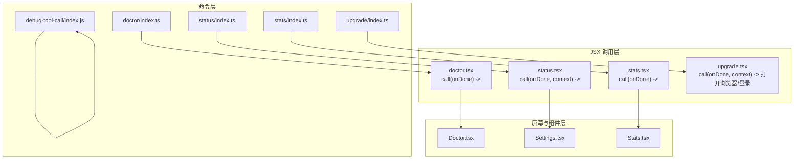
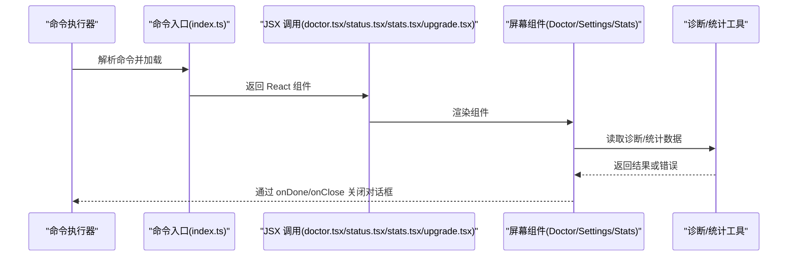
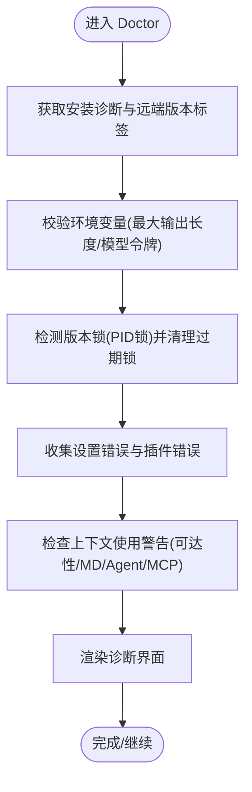
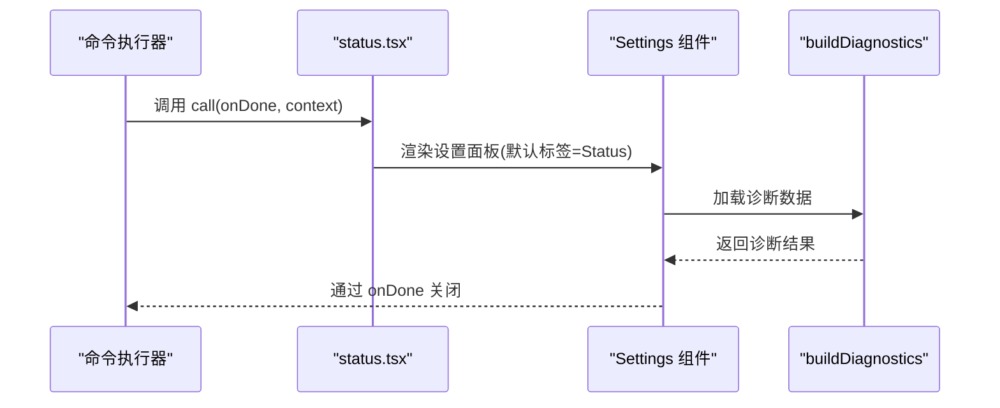
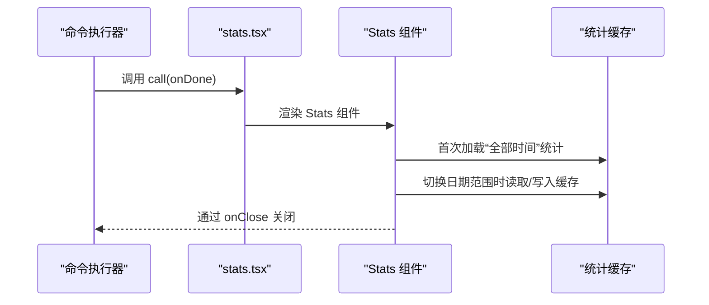
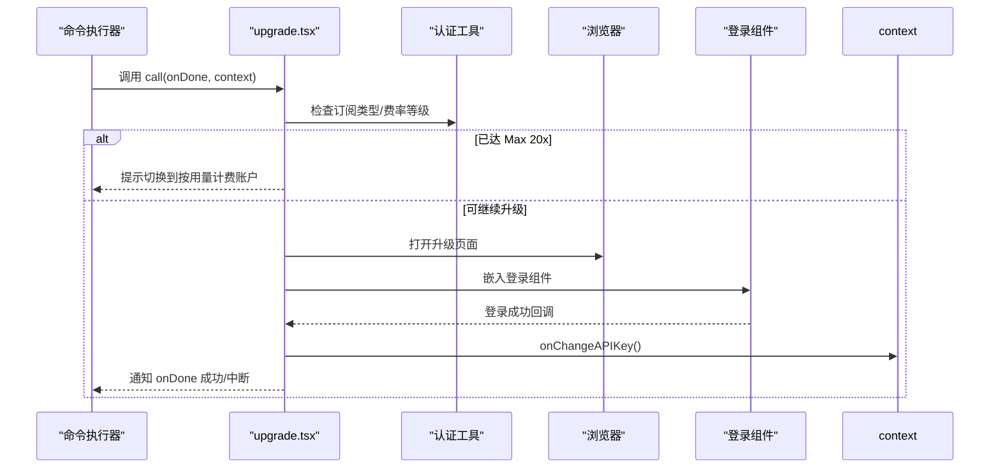
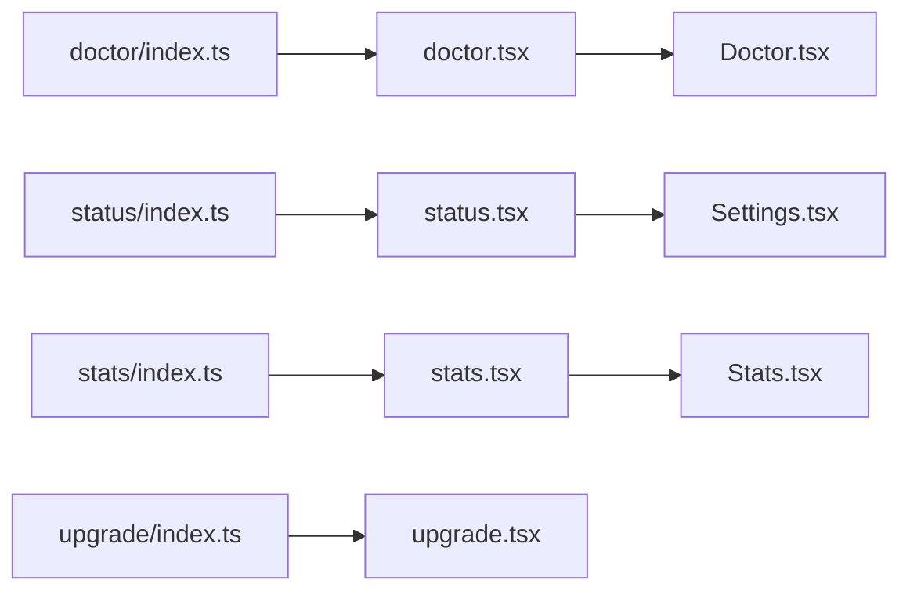

# 系统管理命令

<cite>
**本文档引用的文件**
- [src/commands/doctor/doctor.tsx](file://src/commands/doctor/doctor.tsx)
- [src/commands/doctor/index.ts](file://src/commands/doctor/index.ts)
- [src/screens/Doctor.tsx](file://src/screens/Doctor.tsx)
- [src/commands/status/index.ts](file://src/commands/status/index.ts)
- [src/commands/status/status.tsx](file://src/commands/status/status.tsx)
- [src/components/Settings/Settings.tsx](file://src/components/Settings/Settings.tsx)
- [src/components/Stats.tsx](file://src/components/Stats.tsx)
- [src/commands/stats/index.ts](file://src/commands/stats/index.ts)
- [src/commands/stats/stats.tsx](file://src/commands/stats/stats.tsx)
- [src/commands/upgrade/index.ts](file://src/commands/upgrade/index.ts)
- [src/commands/upgrade/upgrade.tsx](file://src/commands/upgrade/upgrade.tsx)
- [src/commands/debug-tool-call/index.js](file://src/commands/debug-tool-call/index.js)
</cite>

## 目录
1. [简介](#简介)
2. [项目结构](#项目结构)
3. [核心组件](#核心组件)
4. [架构总览](#架构总览)
5. [详细组件分析](#详细组件分析)
6. [依赖关系分析](#依赖关系分析)
7. [性能考虑](#性能考虑)
8. [故障排除指南](#故障排除指南)
9. [结论](#结论)

## 简介
本运维文档聚焦 Claude Code 系统的管理命令，涵盖以下五个核心命令：
- doctor：系统诊断与健康检查，输出安装状态、更新通道、环境变量校验、版本锁、插件错误、上下文使用警告等信息，并支持交互式继续。
- status：状态监控与显示，集成设置面板中的“状态”、“配置”、“用量”等标签页，展示版本、模型、账户、API 连接性、工具状态等。
- stats：性能统计与分析，提供活动热力图、会话时长、活跃天数、最长/当前连击、模型使用分布、令牌消耗对比等可视化数据。
- upgrade：系统升级与更新，引导用户访问升级页面并处理 Max 订阅上限判断与登录流程。
- debug-tool-call：调试工具调用（默认禁用），用于内部调试场景。

文档将从架构、数据流、处理逻辑、集成点、错误处理与性能特征等方面进行深入解析，并提供日志分析、错误追踪与系统调优的实用方法。

## 项目结构
命令模块采用“命令入口 + JSX 调用 + 屏幕组件”的分层设计：
- 命令入口负责声明命令元数据（名称、描述、可用性、加载方式）。
- JSX 调用负责返回 React 组件实例，交由命令执行器渲染。
- 屏幕组件负责具体 UI 与业务逻辑，如 Doctor 的诊断、Settings 的状态页、Stats 的统计图表等。

**图表来源**
- [src/commands/doctor/index.ts:1-13](file://src/commands/doctor/index.ts#L1-L13)
- [src/commands/doctor/doctor.tsx:1-7](file://src/commands/doctor/doctor.tsx#L1-L7)
- [src/screens/Doctor.tsx:100-501](file://src/screens/Doctor.tsx#L100-L501)
- [src/commands/status/index.ts:1-13](file://src/commands/status/index.ts#L1-L13)
- [src/commands/status/status.tsx:1-8](file://src/commands/status/status.tsx#L1-L8)
- [src/components/Settings/Settings.tsx:22-130](file://src/components/Settings/Settings.tsx#L22-L130)
- [src/commands/stats/index.ts:1-11](file://src/commands/stats/index.ts#L1-L11)
- [src/commands/stats/stats.tsx:1-7](file://src/commands/stats/stats.tsx#L1-L7)
- [src/components/Stats.tsx:82-311](file://src/components/Stats.tsx#L82-L311)
- [src/commands/upgrade/index.ts:1-17](file://src/commands/upgrade/index.ts#L1-L17)
- [src/commands/upgrade/upgrade.tsx:1-38](file://src/commands/upgrade/upgrade.tsx#L1-L38)
- [src/commands/debug-tool-call/index.js:1-2](file://src/commands/debug-tool-call/index.js#L1-L2)

**章节来源**
- [src/commands/doctor/index.ts:1-13](file://src/commands/doctor/index.ts#L1-L13)
- [src/commands/status/index.ts:1-13](file://src/commands/status/index.ts#L1-L13)
- [src/commands/stats/index.ts:1-11](file://src/commands/stats/index.ts#L1-L11)
- [src/commands/upgrade/index.ts:1-17](file://src/commands/upgrade/index.ts#L1-L17)
- [src/commands/debug-tool-call/index.js:1-2](file://src/commands/debug-tool-call/index.js#L1-L2)

## 核心组件
- doctor 命令
  - 入口：声明命令类型、启用条件、延迟加载 doctor.tsx。
  - JSX 调用：返回 Doctor 屏幕组件，通过 onDone 回调关闭对话框。
  - Doctor 屏幕：聚合安装诊断、更新通道、环境变量校验、版本锁、插件错误、上下文使用警告等信息，支持交互式继续。
- status 命令
  - 入口：声明即时执行、本地 JSX、延迟加载 status.tsx。
  - JSX 调用：返回 Settings 组件，默认打开“状态”标签页。
  - Settings 组件：整合“状态”“配置”“用量”等标签页，构建诊断信息。
- stats 命令
  - 入口：声明本地 JSX、延迟加载 stats.tsx。
  - JSX 调用：返回 Stats 组件，支持日期范围切换、复制截图、滚动浏览模型列表。
  - Stats 组件：生成活动热力图、会话统计、模型使用分布、令牌消耗对比等。
- upgrade 命令
  - 入口：声明可用性限制、启用条件、延迟加载 upgrade.tsx。
  - JSX 调用：检测 Max 订阅上限，打开浏览器升级页面，并在登录后刷新 API Key。
- debug-tool-call 命令
  - 入口：默认禁用且隐藏，仅用于内部调试。

**章节来源**
- [src/commands/doctor/doctor.tsx:1-7](file://src/commands/doctor/doctor.tsx#L1-L7)
- [src/commands/doctor/index.ts:1-13](file://src/commands/doctor/index.ts#L1-L13)
- [src/screens/Doctor.tsx:100-501](file://src/screens/Doctor.tsx#L100-L501)
- [src/commands/status/status.tsx:1-8](file://src/commands/status/status.tsx#L1-L8)
- [src/commands/status/index.ts:1-13](file://src/commands/status/index.ts#L1-L13)
- [src/components/Settings/Settings.tsx:22-130](file://src/components/Settings/Settings.tsx#L22-L130)
- [src/commands/stats/stats.tsx:1-7](file://src/commands/stats/stats.tsx#L1-L7)
- [src/commands/stats/index.ts:1-11](file://src/commands/stats/index.ts#L1-L11)
- [src/components/Stats.tsx:82-311](file://src/components/Stats.tsx#L82-L311)
- [src/commands/upgrade/upgrade.tsx:1-38](file://src/commands/upgrade/upgrade.tsx#L1-L38)
- [src/commands/upgrade/index.ts:1-17](file://src/commands/upgrade/index.ts#L1-L17)
- [src/commands/debug-tool-call/index.js:1-2](file://src/commands/debug-tool-call/index.js#L1-L2)

## 架构总览
下图展示了命令到组件的调用链路与数据流向：

**图表来源**
- [src/commands/doctor/index.ts:1-13](file://src/commands/doctor/index.ts#L1-L13)
- [src/commands/doctor/doctor.tsx:1-7](file://src/commands/doctor/doctor.tsx#L1-L7)
- [src/screens/Doctor.tsx:100-501](file://src/screens/Doctor.tsx#L100-L501)
- [src/commands/status/index.ts:1-13](file://src/commands/status/index.ts#L1-L13)
- [src/commands/status/status.tsx:1-8](file://src/commands/status/status.tsx#L1-L8)
- [src/components/Settings/Settings.tsx:22-130](file://src/components/Settings/Settings.tsx#L22-L130)
- [src/commands/stats/index.ts:1-11](file://src/commands/stats/index.ts#L1-L11)
- [src/commands/stats/stats.tsx:1-7](file://src/commands/stats/stats.tsx#L1-L7)
- [src/components/Stats.tsx:82-311](file://src/components/Stats.tsx#L82-L311)
- [src/commands/upgrade/index.ts:1-17](file://src/commands/upgrade/index.ts#L1-L17)
- [src/commands/upgrade/upgrade.tsx:1-38](file://src/commands/upgrade/upgrade.tsx#L1-L38)

## 详细组件分析

### doctor 命令
- 功能概述
  - 安装诊断：安装类型、路径、二进制、配置安装方式、搜索组件状态、推荐修复方案。
  - 更新通道：包管理器管理、自动更新状态、更新权限、自动更新频道。
  - 环境变量：对 Bash/Tasks 最大输出长度、模型最大输出令牌等进行校验。
  - 版本锁：清理过期锁、列出当前版本锁。
  - 插件与代理：插件错误列表、MCP 解析警告、键位冲突提示。
  - 上下文使用：不可达权限规则、Claude.md/Agent/MCP 使用警告。
- 数据流与处理逻辑
  - 初始化时异步获取诊断信息与远端版本标签。
  - 读取配置目录、工作目录下的代理定义，计算失败解析文件。
  - 检测 PID 基于锁机制，清理过期锁并列出当前锁。
  - 对环境变量进行边界值校验，输出“有效/上限/错误”三类结果。
  - 收集设置错误（排除 MCP），并汇总上下文使用警告。
- 交互与用户体验
  - 支持键盘确认关闭，提供“继续”提示。
  - 诊断信息按类别分组展示，便于快速定位问题。

**图表来源**
- [src/screens/Doctor.tsx:100-501](file://src/screens/Doctor.tsx#L100-L501)

**章节来源**
- [src/commands/doctor/doctor.tsx:1-7](file://src/commands/doctor/doctor.tsx#L1-L7)
- [src/commands/doctor/index.ts:1-13](file://src/commands/doctor/index.ts#L1-L13)
- [src/screens/Doctor.tsx:100-501](file://src/screens/Doctor.tsx#L100-L501)

### status 命令
- 功能概述
  - 集成设置面板的“状态”“配置”“用量”标签页。
  - “状态”标签页：构建诊断信息，展示版本、模型、账户、API 连接性、工具状态等。
  - “配置”“用量”标签页：分别展示配置项与用量统计。
- 数据流与处理逻辑
  - 通过 buildDiagnostics 异步构建诊断数据。
  - 根据上下文动态决定是否显示“Gates”标签（外部特性开关）。
  - 支持 ESC 键退出，Tabs 切换与内容高度自适应。
- 交互与用户体验
  - 支持键盘快捷键切换标签、ESC 退出。
  - 在模态与终端两种环境下自适应布局。

**图表来源**
- [src/commands/status/status.tsx:1-8](file://src/commands/status/status.tsx#L1-L8)
- [src/components/Settings/Settings.tsx:22-130](file://src/components/Settings/Settings.tsx#L22-L130)

**章节来源**
- [src/commands/status/index.ts:1-13](file://src/commands/status/index.ts#L1-L13)
- [src/commands/status/status.tsx:1-8](file://src/commands/status/status.tsx#L1-L8)
- [src/components/Settings/Settings.tsx:22-130](file://src/components/Settings/Settings.tsx#L22-L130)

### stats 命令
- 功能概述
  - 活动热力图：基于所有时间的每日活动生成 ASCII 热力图。
  - 日期范围：支持“全部时间”“最近7天”“最近30天”，可循环切换。
  - 使用概览：会话总数、最长会话、活跃天数、最长/当前连击、最活跃日期。
  - 模型使用：按输入/输出令牌排序，生成令牌使用图表与分布。
  - 令牌对比：与书籍页数/电影时长等进行趣味对比，生成“事实”。
- 数据流与处理逻辑
  - 首次加载时创建“全部时间”统计 Promise，失败则返回错误消息。
  - 切换日期范围时缓存结果，避免重复请求。
  - 使用 use() 读取 Promise，Suspense 渲染加载状态。
  - 生成 ASCII 图表与热力图，支持复制截图到剪贴板。
- 交互与用户体验
  - 支持 Tab 切换“概览/模型”，r 键循环日期范围，Ctrl+S 复制截图。
  - 支持上下箭头滚动模型列表，头部焦点切换。

**图表来源**
- [src/commands/stats/stats.tsx:1-7](file://src/commands/stats/stats.tsx#L1-L7)
- [src/components/Stats.tsx:82-311](file://src/components/Stats.tsx#L82-L311)

**章节来源**
- [src/commands/stats/index.ts:1-11](file://src/commands/stats/index.ts#L1-L11)
- [src/commands/stats/stats.tsx:1-7](file://src/commands/stats/stats.tsx#L1-L7)
- [src/components/Stats.tsx:82-311](file://src/components/Stats.tsx#L82-L311)

### upgrade 命令
- 功能概述
  - 检测当前订阅是否已达 Max 20x 上限；若已达到，提示切换到按用量计费的账户。
  - 否则打开浏览器访问升级页面，并在登录后刷新 API Key。
- 数据流与处理逻辑
  - 通过认证工具判断订阅类型与费率等级，必要时拉取 OAuth Profile。
  - 打开浏览器后，嵌入 Login 组件，登录成功回调中调用 context.onChangeAPIKey 并通知 onDone。
  - 异常时记录错误并提示用户手动访问升级页面。
- 交互与用户体验
  - 登录流程结束后自动刷新 API Key，确保后续操作可用。

**图表来源**
- [src/commands/upgrade/upgrade.tsx:1-38](file://src/commands/upgrade/upgrade.tsx#L1-L38)
- [src/commands/upgrade/index.ts:1-17](file://src/commands/upgrade/index.ts#L1-L17)

**章节来源**
- [src/commands/upgrade/index.ts:1-17](file://src/commands/upgrade/index.ts#L1-L17)
- [src/commands/upgrade/upgrade.tsx:1-38](file://src/commands/upgrade/upgrade.tsx#L1-L38)

### debug-tool-call 命令
- 功能概述
  - 默认禁用且隐藏，仅用于内部调试场景。
- 设计要点
  - 通过 isEnabled 返回 false、isHidden 返回 true 实现隐藏。
  - 作为占位符存在，避免误用。

**章节来源**
- [src/commands/debug-tool-call/index.js:1-2](file://src/commands/debug-tool-call/index.js#L1-L2)

## 依赖关系分析
- 命令入口与 JSX 调用
  - doctor/status/stats 通过 type: 'local-jsx' 声明，使用延迟加载，减少启动时资源占用。
  - upgrade 通过 availability 与启用条件限制使用场景。
- 组件间耦合
  - Settings 作为容器组件，聚合多个子标签页，降低单文件复杂度。
  - Doctor/Stats 作为独立屏幕组件，职责清晰，便于扩展与测试。
- 外部依赖
  - Doctor 依赖诊断工具与锁管理工具，用于环境与版本锁检测。
  - Stats 依赖统计聚合与热力图生成工具，提供可视化数据。
  - upgrade 依赖浏览器打开与认证工具，处理订阅状态与登录流程。

**图表来源**
- [src/commands/doctor/index.ts:1-13](file://src/commands/doctor/index.ts#L1-L13)
- [src/commands/doctor/doctor.tsx:1-7](file://src/commands/doctor/doctor.tsx#L1-L7)
- [src/commands/status/index.ts:1-13](file://src/commands/status/index.ts#L1-L13)
- [src/commands/status/status.tsx:1-8](file://src/commands/status/status.tsx#L1-L8)
- [src/commands/stats/index.ts:1-11](file://src/commands/stats/index.ts#L1-L11)
- [src/commands/stats/stats.tsx:1-7](file://src/commands/stats/stats.tsx#L1-L7)
- [src/commands/upgrade/index.ts:1-17](file://src/commands/upgrade/index.ts#L1-L17)
- [src/commands/upgrade/upgrade.tsx:1-38](file://src/commands/upgrade/upgrade.tsx#L1-L38)

**章节来源**
- [src/commands/doctor/index.ts:1-13](file://src/commands/doctor/index.ts#L1-L13)
- [src/commands/status/index.ts:1-13](file://src/commands/status/index.ts#L1-L13)
- [src/commands/stats/index.ts:1-11](file://src/commands/stats/index.ts#L1-L11)
- [src/commands/upgrade/index.ts:1-17](file://src/commands/upgrade/index.ts#L1-L17)

## 性能考虑
- 延迟加载与懒执行
  - doctor/status/stats 采用 type: 'local-jsx' 与延迟加载，避免启动时加载大量 UI 组件。
- 缓存策略
  - stats 对不同日期范围的结果进行缓存，减少重复请求与渲染成本。
- 可视化开销
  - ASCII 热力图与图表生成在终端中渲染，需注意终端宽度与字符宽度计算，避免过度重绘。
- 诊断与统计的异步化
  - Doctor/Stats 通过 Promise 与 Suspense 协作，避免阻塞主线程，提升响应速度。

[本节为通用指导，无需特定文件引用]

## 故障排除指南
- doctor 常见问题
  - 多安装实例：当发现多实例时，建议统一安装源或清理冗余安装。
  - 环境变量异常：根据“环境变量”部分的“有效/上限/错误”提示调整相关变量。
  - 版本锁冲突：查看“版本锁”部分，清理过期锁后重试。
  - 插件错误：根据“插件错误”列表定位具体插件并修复。
  - 上下文使用警告：关注“不可达权限规则”“Claude.md/Agent/MCP 使用警告”，修正权限或配置。
- status 常见问题
  - 无法加载诊断：检查网络与认证状态，确认 API Key 有效。
  - 标签页空白：确认外部特性开关与可用性条件满足。
- stats 常见问题
  - 无统计数据：首次使用时可能尚未产生数据，稍后再试。
  - 图表渲染异常：调整终端宽度或禁用颜色后重试。
- upgrade 常见问题
  - 已达 Max 20x：按提示切换到按用量计费账户后重试。
  - 浏览器无法打开：手动访问升级页面并完成登录，随后刷新 API Key。

**章节来源**
- [src/screens/Doctor.tsx:100-501](file://src/screens/Doctor.tsx#L100-L501)
- [src/components/Settings/Settings.tsx:22-130](file://src/components/Settings/Settings.tsx#L22-L130)
- [src/components/Stats.tsx:82-311](file://src/components/Stats.tsx#L82-L311)
- [src/commands/upgrade/upgrade.tsx:1-38](file://src/commands/upgrade/upgrade.tsx#L1-L38)

## 结论
本文档系统梳理了 Claude Code 的系统管理命令，覆盖 doctor、status、stats、upgrade 与 debug-tool-call 的架构设计、数据流、处理逻辑与运维实践。通过延迟加载、缓存策略与可视化呈现，这些命令在保证性能的同时提供了强大的诊断、监控与统计能力。结合故障排除与性能优化建议，可帮助运维人员高效地维护系统健康与稳定性。