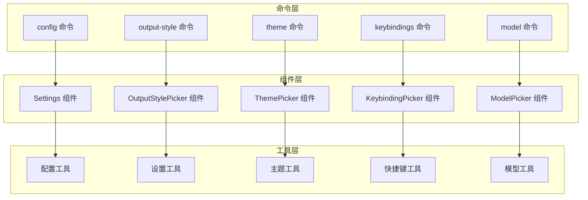
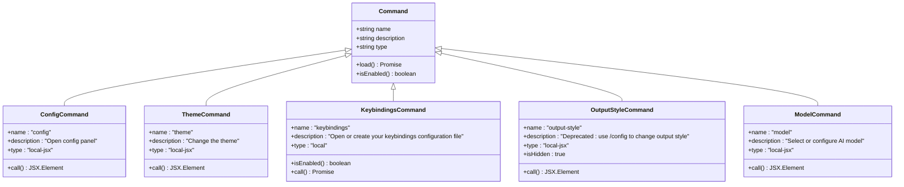
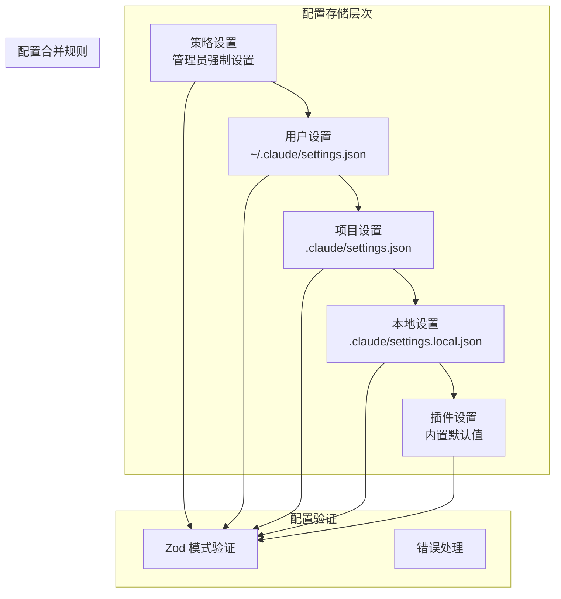
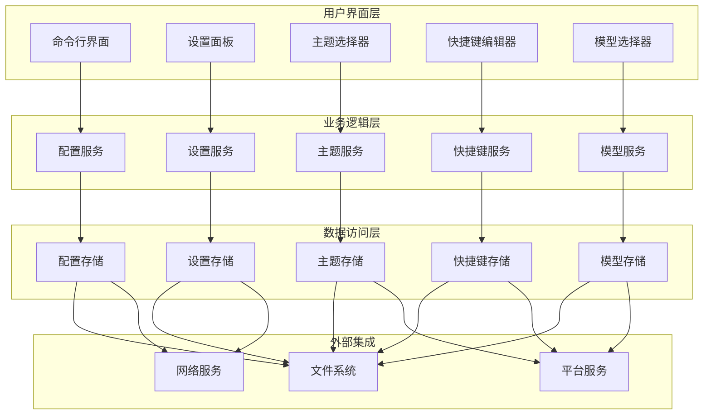
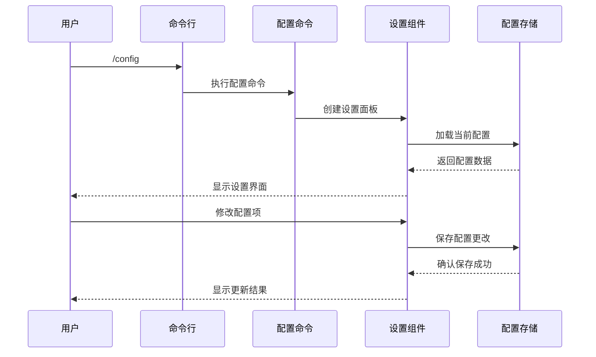
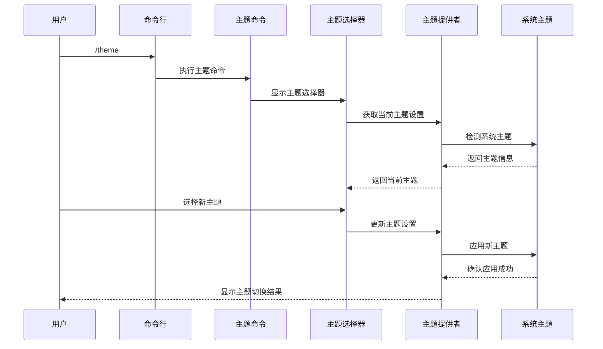
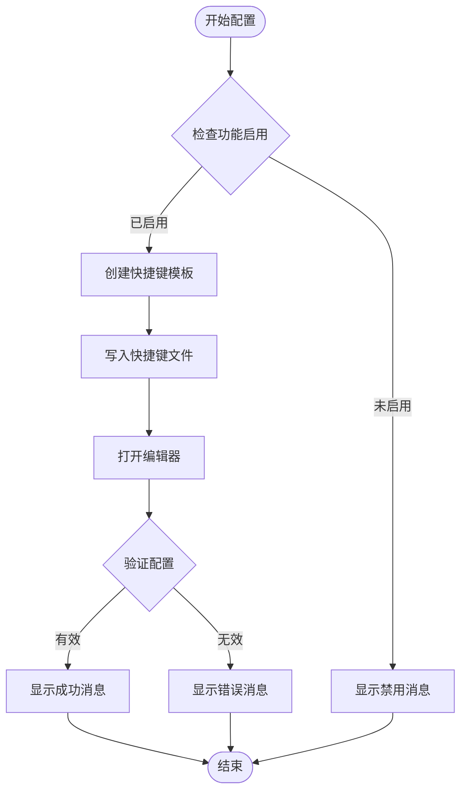
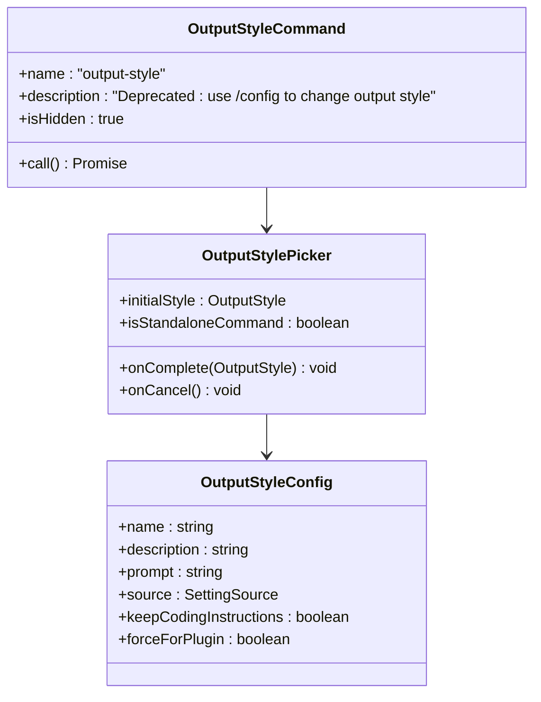
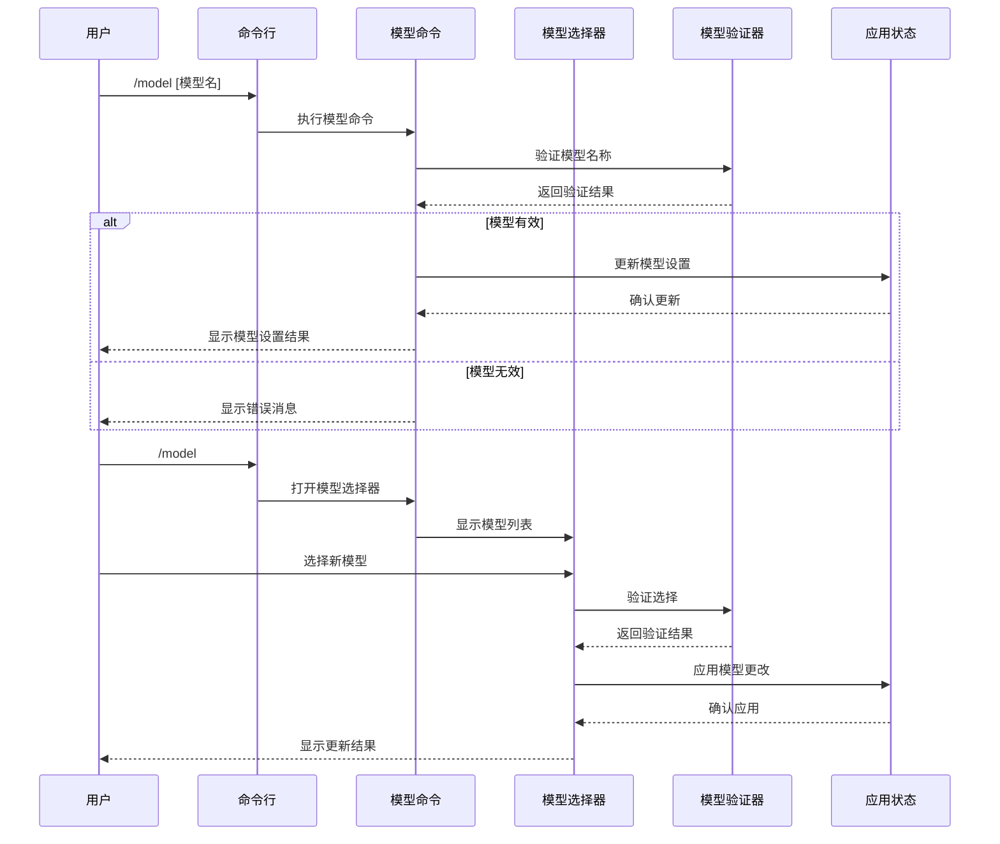
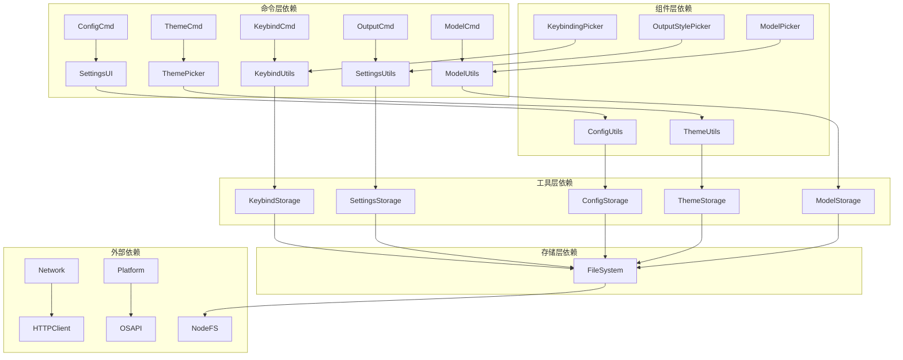

# 配置管理命令

<cite>
**本文档引用的文件**
- [config.tsx](file://src/commands/config/config.tsx)
- [index.ts](file://src/commands/config/index.ts)
- [theme.tsx](file://src/commands/theme/theme.tsx)
- [index.ts](file://src/commands/theme/index.ts)
- [keybindings.ts](file://src/commands/keybindings/keybindings.ts)
- [index.ts](file://src/commands/keybindings/index.ts)
- [output-style.tsx](file://src/commands/output-style/output-style.tsx)
- [index.ts](file://src/commands/output-style/index.ts)
- [model.tsx](file://src/commands/model/model.tsx)
- [config.ts](file://src/utils/config.ts)
- [settings.ts](file://src/utils/settings/settings.ts)
- [ThemeProvider.tsx](file://src/components/design-system/ThemeProvider.tsx)
- [ThemePicker.tsx](file://src/components/ThemePicker.tsx)
- [OutputStylePicker.tsx](file://src/components/OutputStylePicker.tsx)
- [model.tsx](file://src/utils/model/model.ts)
- [modelOptions.ts](file://src/utils/model/modelOptions.ts)
- [validateModel.ts](file://src/utils/model/validateModel.ts)
- [systemTheme.ts](file://src/utils/systemTheme.ts)
- [loadUserBindings.ts](file://src/keybindings/loadUserBindings.ts)
- [template.ts](file://src/keybindings/template.ts)
- [promptEditor.ts](file://src/utils/promptEditor.ts)
- [errors.ts](file://src/utils/errors.ts)
</cite>

## 目录
1. [简介](#简介)
2. [项目结构](#项目结构)
3. [核心组件](#核心组件)
4. [架构概览](#架构概览)
5. [详细组件分析](#详细组件分析)
6. [依赖关系分析](#依赖关系分析)
7. [性能考虑](#性能考虑)
8. [故障排除指南](#故障排除指南)
9. [结论](#结论)
10. [附录](#附录)

## 简介

Claude Code 配置管理命令提供了完整的配置管理系统，涵盖主题切换、键盘快捷键、输出格式和模型选择等核心功能。该系统采用分层架构设计，通过命令行接口提供用户友好的配置体验，同时支持程序化配置管理和团队协作。

系统的核心特性包括：
- 实时配置生效机制
- 多层次配置源（用户级、项目级、策略级）
- 主题自动检测和切换
- 键盘快捷键自定义
- 输出格式灵活配置
- 模型选择和管理

## 项目结构

配置管理系统的文件组织遵循模块化设计原则，每个命令都有独立的实现文件和相关组件：



**图表来源**
- [config.tsx:1-7](file://src/commands/config/config.tsx#L1-L7)
- [theme.tsx:1-56](file://src/commands/theme/theme.tsx#L1-L56)
- [keybindings.ts:1-54](file://src/commands/keybindings/keybindings.ts#L1-L54)

**章节来源**
- [config.tsx:1-7](file://src/commands/config/config.tsx#L1-L7)
- [theme.tsx:1-56](file://src/commands/theme/theme.tsx#L1-L56)
- [keybindings.ts:1-54](file://src/commands/keybindings/keybindings.ts#L1-L54)

## 核心组件

### 配置命令系统

配置命令系统基于统一的命令框架，所有配置相关命令都遵循相同的接口规范：



**图表来源**
- [index.ts:1-11](file://src/commands/config/index.ts#L1-L11)
- [index.ts:1-10](file://src/commands/theme/index.ts#L1-L10)
- [index.ts:1-13](file://src/commands/keybindings/index.ts#L1-L13)
- [index.ts:1-11](file://src/commands/output-style/index.ts#L1-L11)

### 配置存储架构

系统采用多层级配置存储机制，确保配置的灵活性和安全性：



**图表来源**
- [settings.ts:645-800](file://src/utils/settings/settings.ts#L645-L800)
- [config.ts:183-578](file://src/utils/config.ts#L183-L578)

**章节来源**
- [settings.ts:645-800](file://src/utils/settings/settings.ts#L645-L800)
- [config.ts:183-578](file://src/utils/config.ts#L183-L578)

## 架构概览

配置管理系统采用分层架构设计，确保各组件之间的松耦合和高内聚：



**图表来源**
- [config.ts:1044-1086](file://src/utils/config.ts#L1044-L1086)
- [settings.ts:645-800](file://src/utils/settings/settings.ts#L645-L800)

## 详细组件分析

### 配置命令 (config)

配置命令提供了一个完整的设置管理界面，支持所有配置项的查看和修改：



**图表来源**
- [config.tsx:1-7](file://src/commands/config/config.tsx#L1-L7)

配置命令的关键特性：
- 支持所有配置项的集中管理
- 实时配置生效机制
- 友好的用户界面
- 完整的配置验证

**章节来源**
- [config.tsx:1-7](file://src/commands/config/config.tsx#L1-L7)
- [index.ts:1-11](file://src/commands/config/index.ts#L1-L11)

### 主题命令 (theme)

主题命令允许用户在不同主题之间切换，并支持自动检测终端主题：



**图表来源**
- [theme.tsx:1-56](file://src/commands/theme/theme.tsx#L1-L56)
- [ThemeProvider.tsx:19-96](file://src/components/design-system/ThemeProvider.tsx#L19-L96)
- [systemTheme.ts:1-68](file://src/utils/systemTheme.ts#L1-L68)

主题系统的高级特性：
- 自动主题检测（基于终端背景色）
- 实时主题预览
- 支持多种主题变体（深色、浅色、色盲友好等）
- 主题缓存机制

**章节来源**
- [theme.tsx:1-56](file://src/commands/theme/theme.tsx#L1-L56)
- [ThemeProvider.tsx:19-96](file://src/components/design-system/ThemeProvider.tsx#L19-L96)
- [ThemePicker.tsx:21-155](file://src/components/ThemePicker.tsx#L21-L155)
- [systemTheme.ts:1-68](file://src/utils/systemTheme.ts#L1-L68)

### 键盘快捷键命令 (keybindings)

键盘快捷键命令提供了一个完整的快捷键配置系统：



**图表来源**
- [keybindings.ts:1-54](file://src/commands/keybindings/keybindings.ts#L1-L54)

快捷键配置的关键特性：
- 自动创建配置文件模板
- 编辑器集成
- 配置验证
- 错误处理

**章节来源**
- [keybindings.ts:1-54](file://src/commands/keybindings/keybindings.ts#L1-L54)
- [index.ts:1-13](file://src/commands/keybindings/index.ts#L1-L13)

### 输出样式命令 (output-style)

输出样式命令用于配置代码输出的格式化方式：



**图表来源**
- [output-style.tsx:1-7](file://src/commands/output-style/output-style.tsx#L1-L7)
- [OutputStylePicker.tsx:29-82](file://src/components/OutputStylePicker.tsx#L29-L82)
- [config.ts:11-27](file://src/constants/outputStyles.ts#L11-L27)

**章节来源**
- [output-style.tsx:1-7](file://src/commands/output-style/output-style.tsx#L1-L7)
- [OutputStylePicker.tsx:29-82](file://src/components/OutputStylePicker.tsx#L29-L82)
- [config.ts:11-27](file://src/constants/outputStyles.ts#L11-L27)

### 模型命令 (model)

模型命令提供AI模型的选择和配置功能：



**图表来源**
- [model.tsx:1-297](file://src/commands/model/model.tsx#L1-L297)
- [model.tsx:1-200](file://src/utils/model/model.ts#L1-L200)
- [modelOptions.ts:1-100](file://src/utils/model/modelOptions.ts#L1-L100)
- [validateModel.ts:1-150](file://src/utils/model/validateModel.ts#L1-L150)

模型管理的关键特性：
- 模型验证和兼容性检查
- 快速模式支持
- 效率级别配置
- 实时模型切换

**章节来源**
- [model.tsx:1-297](file://src/commands/model/model.tsx#L1-L297)
- [model.tsx:1-200](file://src/utils/model/model.ts#L1-L200)

## 依赖关系分析

配置管理系统中的组件依赖关系如下：



**图表来源**
- [config.ts:1-800](file://src/utils/config.ts#L1-L800)
- [settings.ts:1-800](file://src/utils/settings/settings.ts#L1-L800)

**章节来源**
- [config.ts:1-800](file://src/utils/config.ts#L1-L800)
- [settings.ts:1-800](file://src/utils/settings/settings.ts#L1-L800)

## 性能考虑

配置管理系统在设计时充分考虑了性能优化：

### 缓存策略
- 全局配置缓存：避免频繁的磁盘I/O操作
- 设置解析缓存：减少重复的JSON解析
- 文件变更监控：实时响应外部配置更改

### 异步处理
- 非阻塞的文件操作
- 并发的配置加载
- 延迟初始化的组件

### 内存管理
- 智能的对象池
- 及时的垃圾回收
- 内存使用监控

## 故障排除指南

### 常见问题及解决方案

#### 配置文件损坏
当配置文件损坏时，系统会自动回退到默认配置并记录错误日志。

**解决步骤：**
1. 检查配置文件语法
2. 使用备份文件恢复
3. 重新生成配置文件

#### 权限问题
当用户没有足够的权限访问配置文件时，系统会显示相应的错误信息。

**解决步骤：**
1. 检查文件权限
2. 以管理员身份运行
3. 更改配置文件位置

#### 配置冲突
当多个配置源存在冲突时，系统会按照优先级规则进行合并。

**解决步骤：**
1. 检查配置源优先级
2. 调整配置文件内容
3. 清除缓存后重启

**章节来源**
- [config.ts:834-866](file://src/utils/config.ts#L834-L866)
- [settings.ts:157-170](file://src/utils/settings/settings.ts#L157-L170)

## 结论

Claude Code 配置管理命令系统提供了一个完整、灵活且用户友好的配置解决方案。通过分层架构设计和多层级配置存储机制，系统能够满足从个人开发者到大型团队的各种配置需求。

系统的主要优势包括：
- 统一的配置管理界面
- 实时配置生效机制
- 完善的错误处理和恢复机制
- 灵活的配置继承和覆盖规则
- 强大的扩展性和定制能力

随着项目的持续发展，配置管理系统将继续演进，为用户提供更好的配置体验。

## 附录

### 配置文件结构说明

配置文件采用JSON格式，支持注释和验证：

```json
{
  "theme": "dark",
  "verbose": false,
  "autoUpdates": true,
  "projects": {
    "/path/to/project": {
      "allowedTools": ["file", "bash"],
      "mcpServers": {}
    }
  }
}
```

### 配置迁移指南

系统支持配置文件的自动迁移，包括：
- 字段重命名
- 数据类型转换
- 新字段添加
- 废弃字段清理

### 团队共享配置最佳实践

1. **版本控制**：将配置文件纳入版本控制系统
2. **环境隔离**：使用不同的配置文件区分开发和生产环境
3. **权限管理**：合理设置文件权限，保护敏感信息
4. **定期备份**：建立配置文件的定期备份机制
5. **文档维护**：保持配置文档的及时更新