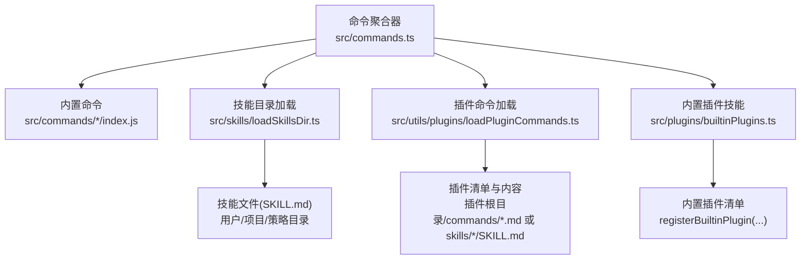
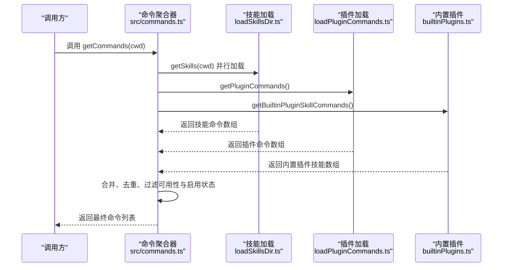
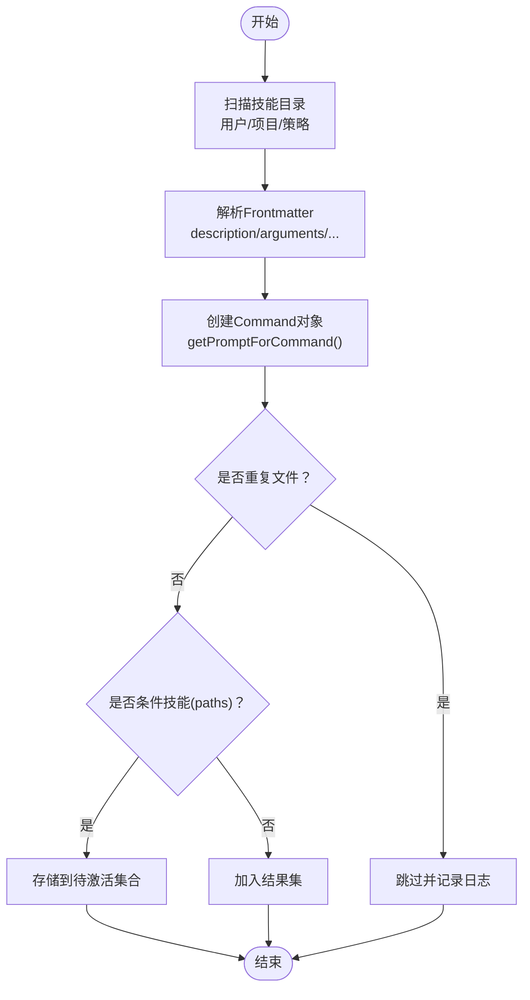
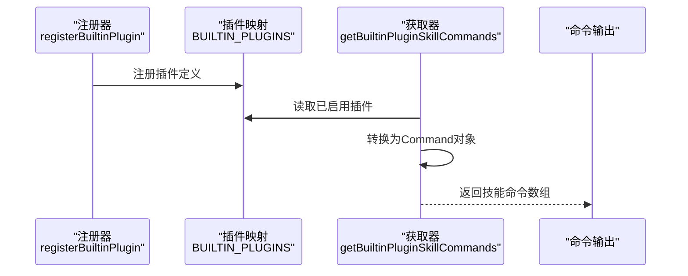
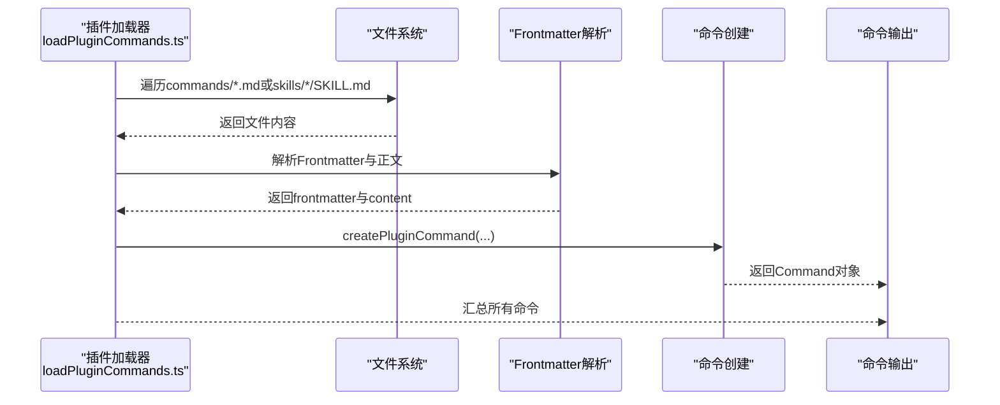
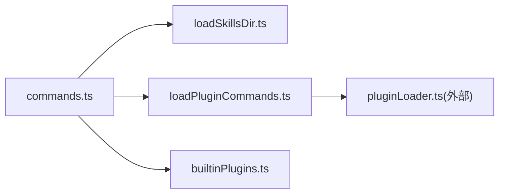

# 命令扩展开发

<cite>
**本文引用的文件**
- [src/commands.ts](file://src/commands.ts)
- [src/types/command.ts](file://src/types/command.ts)
- [src/skills/loadSkillsDir.ts](file://src/skills/loadSkillsDir.ts)
- [src/skills/bundledSkills.ts](file://src/skills/bundledSkills.ts)
- [src/plugins/builtinPlugins.ts](file://src/plugins/builtinPlugins.ts)
- [src/utils/plugins/loadPluginCommands.ts](file://src/utils/plugins/loadPluginCommands.ts)
- [src/types/plugin.ts](file://src/types/plugin.ts)
- [src/commands/init.ts](file://src/commands/init.ts)
- [src/skills/mcpSkillBuilders.ts](file://src/skills/mcpSkillBuilders.ts)
</cite>

## 目录
1. [简介](#简介)
2. [项目结构](#项目结构)
3. [核心组件](#核心组件)
4. [架构总览](#架构总览)
5. [详细组件分析](#详细组件分析)
6. [依赖关系分析](#依赖关系分析)
7. [性能考量](#性能考量)
8. [故障排查指南](#故障排查指南)
9. [结论](#结论)
10. [附录：开发示例与最佳实践](#附录开发示例与最佳实践)

## 简介
本指南面向为 Claude Code 开发“命令扩展”的工程师，涵盖以下主题：
- 如何创建自定义命令（命令接口实现、参数定义、执行逻辑）
- 命令生命周期钩子、错误处理与状态管理
- 技能系统扩展机制（技能目录结构、技能文件格式、动态加载）
- 插件命令开发流程（插件架构、命令注册、依赖管理）
- 性能优化、安全与用户体验设计最佳实践
- 完整开发示例、调试技巧与测试策略、发布流程

## 项目结构
Claude Code 的命令体系由三类来源构成：
- 内置命令：位于 src/commands/ 下的独立模块，统一在 src/commands.ts 中聚合导出
- 技能系统：支持用户/项目/策略来源的 SKILL.md 文件，以及内置/插件/市场来源的技能
- 插件系统：支持本地/内联/市场来源的插件，动态加载命令与技能



图表来源
- [src/commands.ts:258-469](file://src/commands.ts#L258-L469)
- [src/skills/loadSkillsDir.ts:638-800](file://src/skills/loadSkillsDir.ts#L638-L800)
- [src/utils/plugins/loadPluginCommands.ts:414-677](file://src/utils/plugins/loadPluginCommands.ts#L414-L677)
- [src/plugins/builtinPlugins.ts:108-121](file://src/plugins/builtinPlugins.ts#L108-L121)

章节来源
- [src/commands.ts:258-469](file://src/commands.ts#L258-L469)
- [src/skills/loadSkillsDir.ts:638-800](file://src/skills/loadSkillsDir.ts#L638-L800)
- [src/utils/plugins/loadPluginCommands.ts:414-677](file://src/utils/plugins/loadPluginCommands.ts#L414-L677)
- [src/plugins/builtinPlugins.ts:108-121](file://src/plugins/builtinPlugins.ts#L108-L121)

## 核心组件
- 命令类型与接口
  - Command/PromptCommand/LocalCommand/LocalJSXCommand：定义命令的类型、描述、可用性、执行上下文、参数与提示词生成等
  - 参考路径：[src/types/command.ts:16-217](file://src/types/command.ts#L16-L217)
- 命令聚合与可用性过滤
  - getCommands()/getMcpSkillCommands()/getSkillToolCommands()/getSlashCommandToolSkills()：统一加载、去重、过滤与排序
  - 参考路径：[src/commands.ts:449-608](file://src/commands.ts#L449-L608)
- 技能系统
  - getSkillDirCommands()/createSkillCommand()/parseSkillFrontmatterFields()：从目录加载 SKILL.md，解析 frontmatter，生成 Prompt 命令
  - 参考路径：[src/skills/loadSkillsDir.ts:638-800](file://src/skills/loadSkillsDir.ts#L638-L800)
- 内置插件技能
  - registerBuiltinPlugin()/getBuiltinPluginSkillCommands()：注册内置插件并将其技能注入命令列表
  - 参考路径：[src/plugins/builtinPlugins.ts:28-121](file://src/plugins/builtinPlugins.ts#L28-L121)
- 插件命令系统
  - getPluginCommands()/createPluginCommand()：从插件目录或清单元数据加载命令/技能
  - 参考路径：[src/utils/plugins/loadPluginCommands.ts:414-677](file://src/utils/plugins/loadPluginCommands.ts#L414-L677)
- MCP 技能构建器
  - registerMCPSkillBuilders()/getMCPSkillBuilders()：为 MCP 发现提供技能构建能力
  - 参考路径：[src/skills/mcpSkillBuilders.ts:33-44](file://src/skills/mcpSkillBuilders.ts#L33-L44)

章节来源
- [src/types/command.ts:16-217](file://src/types/command.ts#L16-L217)
- [src/commands.ts:449-608](file://src/commands.ts#L449-L608)
- [src/skills/loadSkillsDir.ts:638-800](file://src/skills/loadSkillsDir.ts#L638-L800)
- [src/plugins/builtinPlugins.ts:28-121](file://src/plugins/builtinPlugins.ts#L28-L121)
- [src/utils/plugins/loadPluginCommands.ts:414-677](file://src/utils/plugins/loadPluginCommands.ts#L414-L677)
- [src/skills/mcpSkillBuilders.ts:33-44](file://src/skills/mcpSkillBuilders.ts#L33-L44)

## 架构总览
命令系统通过“聚合—过滤—动态加载—去重—排序”的流水线，将来自不同来源的命令整合为统一的可执行集合，并在运行时根据可用性与启用状态进行筛选。



图表来源
- [src/commands.ts:449-517](file://src/commands.ts#L449-L517)
- [src/skills/loadSkillsDir.ts:638-800](file://src/skills/loadSkillsDir.ts#L638-L800)
- [src/utils/plugins/loadPluginCommands.ts:414-677](file://src/utils/plugins/loadPluginCommands.ts#L414-L677)
- [src/plugins/builtinPlugins.ts:108-121](file://src/plugins/builtinPlugins.ts#L108-L121)

## 详细组件分析

### 组件一：命令类型与生命周期
- 类型定义
  - PromptCommand：用于模型可调用的“技能”命令，包含 getPromptForCommand(args, context) 生成提示词
  - LocalCommand：本地命令，延迟加载 call(args, context)
  - LocalJSXCommand：本地 UI 命令，延迟加载渲染 React 组件
  - 参考路径：[src/types/command.ts:16-152](file://src/types/command.ts#L16-L152)
- 生命周期钩子
  - hooks：可在命令执行时注册工具权限、会话上下文等
  - skillRoot：技能资源基目录，用于派生 CLAUDE_PLUGIN_ROOT 等变量
  - 参考路径：[src/types/command.ts:38-50](file://src/types/command.ts#L38-L50)
- 执行上下文
  - context: 'inline' | 'fork'；agent: 子代理类型
  - 参考路径：[src/types/command.ts:42-48](file://src/types/command.ts#L42-L48)

```mermaid
classDiagram
class Command {
+string name
+string description
+boolean? isHidden
+boolean? disableModelInvocation
+string? userFacingName()
+boolean? isEnabled()
}
class PromptCommand {
+string progressMessage
+number contentLength
+string[]? argNames
+string[]? allowedTools
+string? model
+string source
+PluginInfo? pluginInfo
+HooksSettings? hooks
+string? skillRoot
+('inline'|'fork')? context
+string? agent
+EffortValue? effort
+string[]? paths
+getPromptForCommand(args, context) Promise<ContentBlockParam[]>
}
class LocalCommand {
+boolean supportsNonInteractive
+load() Promise<{call}>
}
class LocalJSXCommand {
+load() Promise<{call}>
}
Command <|.. PromptCommand
Command <|.. LocalCommand
Command <|.. LocalJSXCommand
```

图表来源
- [src/types/command.ts:16-152](file://src/types/command.ts#L16-L152)

章节来源
- [src/types/command.ts:16-152](file://src/types/command.ts#L16-L152)

### 组件二：技能系统（目录/前端面/动态加载）
- 目录结构与加载
  - 用户/项目/策略来源的 .claude/skills/ 目录，仅支持“技能名/SKILL.md”目录格式
  - 支持 --bare 模式仅加载显式 --add-dir
  - 参考路径：[src/skills/loadSkillsDir.ts:638-714](file://src/skills/loadSkillsDir.ts#L638-L714)
- Frontmatter 解析与校验
  - description、when_to_use、arguments、allowed-tools、model、effort、hooks、paths 等字段解析
  - 参考路径：[src/skills/loadSkillsDir.ts:185-265](file://src/skills/loadSkillsDir.ts#L185-L265)
- 提示词生成与参数替换
  - 替换 ${CLAUDE_SESSION_ID}、${CLAUDE_SKILL_DIR}、执行 shell 命令片段
  - 参考路径：[src/skills/loadSkillsDir.ts:344-398](file://src/skills/loadSkillsDir.ts#L344-L398)
- 动态技能激活
  - 条件技能（paths）在首次触达匹配文件时激活
  - 参考路径：[src/skills/loadSkillsDir.ts:771-796](file://src/skills/loadSkillsDir.ts#L771-L796)



图表来源
- [src/skills/loadSkillsDir.ts:638-800](file://src/skills/loadSkillsDir.ts#L638-L800)

章节来源
- [src/skills/loadSkillsDir.ts:638-800](file://src/skills/loadSkillsDir.ts#L638-L800)

### 组件三：内置插件技能
- 注册与启用
  - registerBuiltinPlugin() 注册插件定义；按用户设置启用/禁用
  - 参考路径：[src/plugins/builtinPlugins.ts:28-101](file://src/plugins/builtinPlugins.ts#L28-L101)
- 转换为命令
  - getBuiltinPluginSkillCommands() 将已启用插件的技能转换为 Command
  - 参考路径：[src/plugins/builtinPlugins.ts:108-121](file://src/plugins/builtinPlugins.ts#L108-L121)



图表来源
- [src/plugins/builtinPlugins.ts:28-121](file://src/plugins/builtinPlugins.ts#L28-L121)

章节来源
- [src/plugins/builtinPlugins.ts:28-121](file://src/plugins/builtinPlugins.ts#L28-L121)

### 组件四：插件命令系统
- 加载入口
  - getPluginCommands() 并行加载所有启用插件的命令与技能
  - 参考路径：[src/utils/plugins/loadPluginCommands.ts:414-677](file://src/utils/plugins/loadPluginCommands.ts#L414-L677)
- 命令命名与去重
  - 命名规则：pluginName:namespace:command；使用 loadedPaths 避免重复
  - 参考路径：[src/utils/plugins/loadPluginCommands.ts:60-97](file://src/utils/plugins/loadPluginCommands.ts#L60-L97)
- 前端面与变量替换
  - 替换 ${CLAUDE_PLUGIN_ROOT}/${CLAUDE_PLUGIN_DATA}/${CLAUDE_SKILL_DIR} 与 ${user_config.*}
  - 参考路径：[src/utils/plugins/loadPluginCommands.ts:326-376](file://src/utils/plugins/loadPluginCommands.ts#L326-L376)
- 错误处理
  - 记录插件加载错误，不影响其他插件
  - 参考路径：[src/utils/plugins/loadPluginCommands.ts:425-429](file://src/utils/plugins/loadPluginCommands.ts#L425-L429)



图表来源
- [src/utils/plugins/loadPluginCommands.ts:169-412](file://src/utils/plugins/loadPluginCommands.ts#L169-L412)

章节来源
- [src/utils/plugins/loadPluginCommands.ts:414-677](file://src/utils/plugins/loadPluginCommands.ts#L414-L677)

### 组件五：MCP 技能构建器
- 作用
  - 在不形成循环依赖的前提下，向 MCP 技能发现模块暴露技能构建函数
  - 参考路径：[src/skills/mcpSkillBuilders.ts:33-44](file://src/skills/mcpSkillBuilders.ts#L33-L44)

章节来源
- [src/skills/mcpSkillBuilders.ts:33-44](file://src/skills/mcpSkillBuilders.ts#L33-L44)

### 组件六：内置命令示例（/init）
- 功能
  - 生成/更新 CLAUDE.md、可选地生成技能与钩子配置
  - 支持新旧两种初始化流程
  - 参考路径：[src/commands/init.ts:226-257](file://src/commands/init.ts#L226-L257)

章节来源
- [src/commands/init.ts:226-257](file://src/commands/init.ts#L226-L257)

## 依赖关系分析
- 命令聚合器对各来源的依赖
  - 内置命令：静态导入
  - 技能：按需并行加载
  - 插件：按需并行加载
  - 内置插件：按用户设置启用
- 关键依赖链
  - commands.ts -> loadSkillsDir.ts（技能目录加载）
  - commands.ts -> loadPluginCommands.ts（插件命令加载）
  - commands.ts -> builtinPlugins.ts（内置插件技能）
  - loadPluginCommands.ts -> pluginLoader.ts（插件清单与仓库）



图表来源
- [src/commands.ts:258-469](file://src/commands.ts#L258-L469)
- [src/skills/loadSkillsDir.ts:638-800](file://src/skills/loadSkillsDir.ts#L638-L800)
- [src/utils/plugins/loadPluginCommands.ts:414-677](file://src/utils/plugins/loadPluginCommands.ts#L414-L677)
- [src/plugins/builtinPlugins.ts:108-121](file://src/plugins/builtinPlugins.ts#L108-L121)

章节来源
- [src/commands.ts:258-469](file://src/commands.ts#L258-L469)

## 性能考量
- 懒加载与缓存
  - 使用 memoize 缓存 getCommands/loadAllCommands/getSkills 等昂贵操作
  - 参考路径：[src/commands.ts:449-469](file://src/commands.ts#L449-L469)
- 并行加载
  - Promise.all 并行加载技能、插件与工作流命令
  - 参考路径：[src/commands.ts:454-458](file://src/commands.ts#L454-L458)
- 去重与最小化 I/O
  - realpath 去重、文件系统访问限制、忽略策略
  - 参考路径：[src/skills/loadSkillsDir.ts:118-124](file://src/skills/loadSkillsDir.ts#L118-L124)
- 前端面执行
  - executeShellCommandsInPrompt 在提示词中执行受控 shell 片段，避免在 MCP 场景下直接执行
  - 参考路径：[src/skills/loadSkillsDir.ts:374-396](file://src/skills/loadSkillsDir.ts#L374-L396)

## 故障排查指南
- 常见问题定位
  - 技能未显示：检查 frontmatter 字段（description/when_to_use/allowed-tools）、userInvocable、paths 匹配
  - 插件命令缺失：确认插件启用状态、commandsPath/commandsPaths 是否存在、文件是否被重复加载
  - 权限不足：查看工具权限上下文与 allowed-tools 设置
- 日志与调试
  - 使用 logForDebugging/logError 输出诊断信息
  - 参考路径：[src/skills/loadSkillsDir.ts:416-418](file://src/skills/loadSkillsDir.ts#L416-L418)
- 缓存清理
  - clearCommandsCache()/clearCommandMemoizationCaches() 清理命令缓存
  - 参考路径：[src/commands.ts:523-539](file://src/commands.ts#L523-L539)

章节来源
- [src/commands.ts:523-539](file://src/commands.ts#L523-L539)
- [src/skills/loadSkillsDir.ts:416-418](file://src/skills/loadSkillsDir.ts#L416-L418)

## 结论
Claude Code 的命令扩展体系以“统一类型 + 多源聚合 + 运行时过滤 + 懒加载缓存”为核心，既保证了灵活性（技能/插件/内置命令），又兼顾了性能与安全。开发者应优先遵循命令类型规范、合理使用 frontmatter 与 hooks、注意参数与敏感信息处理，并通过缓存与并行加载提升体验。

## 附录：开发示例与最佳实践

### 创建一个自定义命令（步骤指南）
- 步骤
  - 定义命令类型与基础属性（name/description/isHidden/isEnabled/availability）
  - 若为 Prompt 命令，实现 getPromptForCommand(args, context) 生成提示词
  - 若为本地命令，实现 load() 返回 call(args, context)
  - 若为本地 JSX 命令，实现 load() 返回渲染组件
  - 参考路径：[src/types/command.ts:16-152](file://src/types/command.ts#L16-L152)
- 参数与提示词
  - 使用 argNames/argumentHint/allowedTools/whenToUse/effect 等 frontmatter 字段
  - 参考路径：[src/skills/loadSkillsDir.ts:185-265](file://src/skills/loadSkillsDir.ts#L185-L265)
- 执行上下文
  - inline/fork 与 agent 配置，结合 effort 控制成本
  - 参考路径：[src/types/command.ts:42-48](file://src/types/command.ts#L42-L48)

章节来源
- [src/types/command.ts:16-152](file://src/types/command.ts#L16-L152)
- [src/skills/loadSkillsDir.ts:185-265](file://src/skills/loadSkillsDir.ts#L185-L265)

### 技能文件格式与目录结构
- 目录结构
  - 用户/项目/策略：.claude/skills/<技能名>/SKILL.md
  - 插件：插件根目录下 commands/*.md 或 skills/*/SKILL.md
  - 参考路径：[src/skills/loadSkillsDir.ts:407-480](file://src/skills/loadSkillsDir.ts#L407-L480)
- Frontmatter 字段
  - description、when_to_use、arguments、allowed-tools、model、effort、hooks、paths、name、version、disable-model-invocation、user-invocable、shell
  - 参考路径：[src/skills/loadSkillsDir.ts:185-265](file://src/skills/loadSkillsDir.ts#L185-L265)
- 提示词生成
  - 支持 ${CLAUDE_SESSION_ID}、${CLAUDE_SKILL_DIR}、执行 shell 片段
  - 参考路径：[src/skills/loadSkillsDir.ts:344-398](file://src/skills/loadSkillsDir.ts#L344-L398)

章节来源
- [src/skills/loadSkillsDir.ts:407-480](file://src/skills/loadSkillsDir.ts#L407-L480)
- [src/skills/loadSkillsDir.ts:185-265](file://src/skills/loadSkillsDir.ts#L185-L265)
- [src/skills/loadSkillsDir.ts:344-398](file://src/skills/loadSkillsDir.ts#L344-L398)

### 插件命令开发流程
- 插件清单与目录
  - commandsPath/commandsPaths/skillsPath/skillsPaths 等
  - 参考路径：[src/types/plugin.ts:48-70](file://src/types/plugin.ts#L48-L70)
- 命令命名与去重
  - 命名规则：pluginName:namespace:command；loadedPaths 去重
  - 参考路径：[src/utils/plugins/loadPluginCommands.ts:60-97](file://src/utils/plugins/loadPluginCommands.ts#L60-L97)
- 变量替换
  - ${CLAUDE_PLUGIN_ROOT}/${CLAUDE_PLUGIN_DATA}/${CLAUDE_SKILL_DIR}/${user_config.*}
  - 参考路径：[src/utils/plugins/loadPluginCommands.ts:326-376](file://src/utils/plugins/loadPluginCommands.ts#L326-L376)
- 错误处理
  - 记录并汇总错误，不影响其他插件
  - 参考路径：[src/utils/plugins/loadPluginCommands.ts:425-429](file://src/utils/plugins/loadPluginCommands.ts#L425-L429)

章节来源
- [src/types/plugin.ts:48-70](file://src/types/plugin.ts#L48-L70)
- [src/utils/plugins/loadPluginCommands.ts:60-97](file://src/utils/plugins/loadPluginCommands.ts#L60-L97)
- [src/utils/plugins/loadPluginCommands.ts:326-376](file://src/utils/plugins/loadPluginCommands.ts#L326-L376)
- [src/utils/plugins/loadPluginCommands.ts:425-429](file://src/utils/plugins/loadPluginCommands.ts#L425-L429)

### 生命周期钩子、错误处理与状态管理
- 生命周期钩子
  - hooks：在命令执行前/后注册工具权限与上下文
  - 参考路径：[src/types/command.ts:38-41](file://src/types/command.ts#L38-L41)
- 错误处理
  - 技能/插件加载失败时降级返回空数组或空列表，避免中断
  - 参考路径：[src/commands.ts:359-397](file://src/commands.ts#L359-L397)
- 状态管理
  - clearCommandsCache()/clearCommandMemoizationCaches() 用于刷新缓存
  - 参考路径：[src/commands.ts:523-539](file://src/commands.ts#L523-L539)

章节来源
- [src/types/command.ts:38-41](file://src/types/command.ts#L38-L41)
- [src/commands.ts:359-397](file://src/commands.ts#L359-L397)
- [src/commands.ts:523-539](file://src/commands.ts#L523-L539)

### 性能优化与安全建议
- 性能
  - 使用 memoize 缓存命令列表与技能索引
  - 并行加载多来源命令
  - 参考路径：[src/commands.ts:449-469](file://src/commands.ts#L449-L469)
- 安全
  - MCP 技能不直接执行 shell 片段，避免远程注入风险
  - 对插件变量与用户配置进行脱敏替换
  - 参考路径：[src/skills/loadSkillsDir.ts:374-396](file://src/skills/loadSkillsDir.ts#L374-L396)
- 用户体验
  - 合理设置 argumentHint/whenToUse/description，提升可发现性
  - 使用 effort 与 allowed-tools 控制成本与权限

章节来源
- [src/commands.ts:449-469](file://src/commands.ts#L449-L469)
- [src/skills/loadSkillsDir.ts:374-396](file://src/skills/loadSkillsDir.ts#L374-L396)

### 测试策略与发布流程
- 测试策略
  - 单元测试：针对命令类型、frontmatter 解析、变量替换、去重逻辑
  - 集成测试：模拟多来源命令合并、过滤、排序
  - 参考路径：[src/commands.ts:449-517](file://src/commands.ts#L449-L517)
- 发布流程
  - 本地验证：/init 初始化项目，检查 CLAUDE.md/技能/钩子生成
  - 插件发布：遵循插件清单字段，确保 commandsPath/skillsPath 正确
  - 参考路径：[src/commands/init.ts:226-257](file://src/commands/init.ts#L226-L257)

章节来源
- [src/commands.ts:449-517](file://src/commands.ts#L449-L517)
- [src/commands/init.ts:226-257](file://src/commands/init.ts#L226-L257)