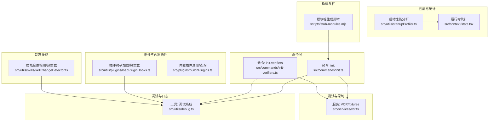
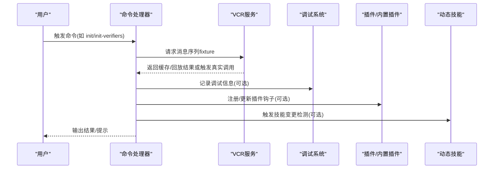
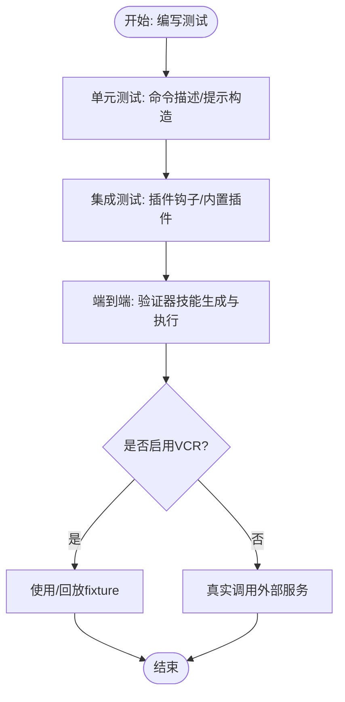
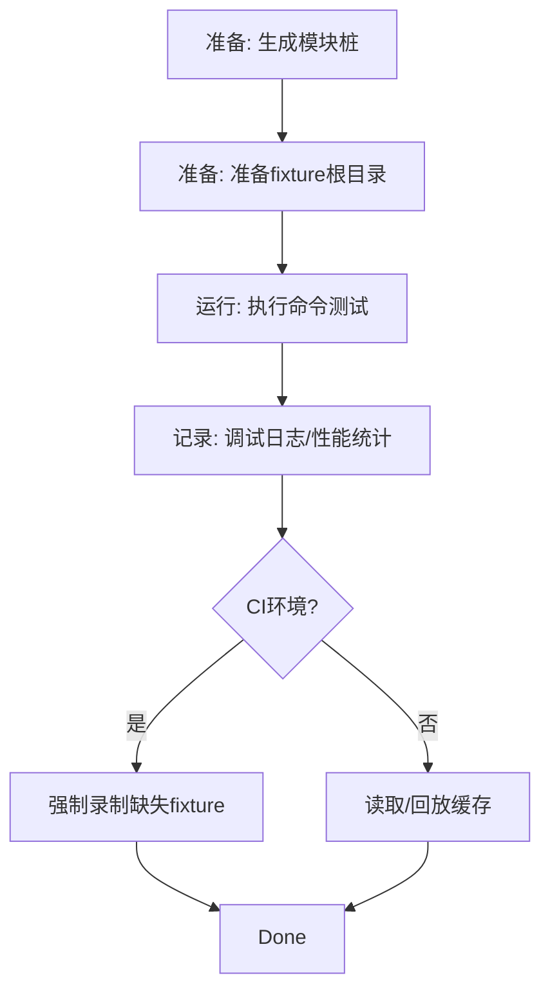
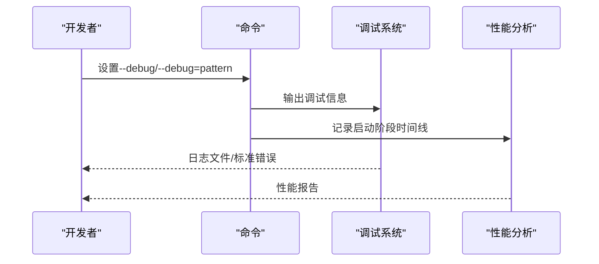
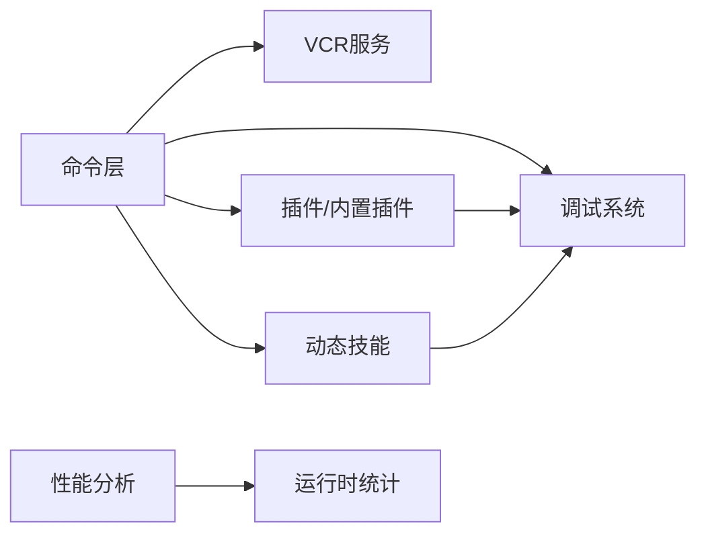

# 命令测试与调试

<cite>
**本文引用的文件**
- [package.json](file://package.json)
- [src/commands/init.ts](file://src/commands/init.ts)
- [src/commands/init-verifiers.ts](file://src/commands/init-verifiers.ts)
- [src/services/vcr.ts](file://src/services/vcr.ts)
- [src/utils/debug.ts](file://src/utils/debug.ts)
- [src/utils/plugins/loadPluginHooks.ts](file://src/utils/plugins/loadPluginHooks.ts)
- [src/plugins/builtinPlugins.ts](file://src/plugins/builtinPlugins.ts)
- [src/utils/skills/skillChangeDetector.ts](file://src/utils/skills/skillChangeDetector.ts)
- [src/utils/startupProfiler.ts](file://src/utils/startupProfiler.ts)
- [src/context/stats.tsx](file://src/context/stats.tsx)
- [scripts/stub-modules.mjs](file://scripts/stub-modules.mjs)
</cite>

## 目录
1. [引言](#引言)
2. [项目结构](#项目结构)
3. [核心组件](#核心组件)
4. [架构总览](#架构总览)
5. [详细组件分析](#详细组件分析)
6. [依赖分析](#依赖分析)
7. [性能考虑](#性能考虑)
8. [故障排查指南](#故障排查指南)
9. [结论](#结论)
10. [附录](#附录)

## 引言
本指南面向Claude Code命令系统的测试与调试，覆盖单元测试、集成测试与端到端测试的设计原则；测试环境搭建（模拟对象、测试数据、测试工具）；命令调试技巧（日志、断点、性能分析）；动态技能与插件命令的测试方法（热重载、依赖注入）；测试用例设计（正常流程、异常处理、边界条件）；测试覆盖率评估与改进；以及持续集成与自动化测试的最佳实践。

## 项目结构
围绕命令测试与调试的关键目录与文件：
- 命令定义与引导：src/commands/*（如初始化、验证器生成等）
- 测试与录制：src/services/vcr.ts（虚拟化/录制回放）
- 调试与日志：src/utils/debug.ts（调试开关、过滤、输出）
- 插件与内置插件：src/utils/plugins/loadPluginHooks.ts、src/plugins/builtinPlugins.ts
- 动态技能热重载：src/utils/skills/skillChangeDetector.ts
- 性能与统计：src/utils/startupProfiler.ts、src/context/stats.tsx
- 模块桩与测试准备：scripts/stub-modules.mjs



**图表来源**
- [src/commands/init.ts:226-257](file://src/commands/init.ts#L226-L257)
- [src/commands/init-verifiers.ts:1-263](file://src/commands/init-verifiers.ts#L1-L263)
- [src/services/vcr.ts:1-143](file://src/services/vcr.ts#L1-L143)
- [src/utils/debug.ts:1-269](file://src/utils/debug.ts#L1-L269)
- [src/utils/plugins/loadPluginHooks.ts:1-287](file://src/utils/plugins/loadPluginHooks.ts#L1-L287)
- [src/plugins/builtinPlugins.ts:1-160](file://src/plugins/builtinPlugins.ts#L1-L160)
- [src/utils/skills/skillChangeDetector.ts:281-311](file://src/utils/skills/skillChangeDetector.ts#L281-L311)
- [src/utils/startupProfiler.ts:68-128](file://src/utils/startupProfiler.ts#L68-L128)
- [src/context/stats.tsx:38-88](file://src/context/stats.tsx#L38-L88)
- [scripts/stub-modules.mjs:76-102](file://scripts/stub-modules.mjs#L76-L102)

**章节来源**
- [package.json:1-21](file://package.json#L1-L21)
- [src/commands/init.ts:1-257](file://src/commands/init.ts#L1-L257)
- [src/commands/init-verifiers.ts:1-263](file://src/commands/init-verifiers.ts#L1-L263)
- [src/services/vcr.ts:1-143](file://src/services/vcr.ts#L1-L143)
- [src/utils/debug.ts:1-269](file://src/utils/debug.ts#L1-L269)
- [src/utils/plugins/loadPluginHooks.ts:1-287](file://src/utils/plugins/loadPluginHooks.ts#L1-L287)
- [src/plugins/builtinPlugins.ts:1-160](file://src/plugins/builtinPlugins.ts#L1-L160)
- [src/utils/skills/skillChangeDetector.ts:281-311](file://src/utils/skills/skillChangeDetector.ts#L281-L311)
- [src/utils/startupProfiler.ts:68-128](file://src/utils/startupProfiler.ts#L68-L128)
- [src/context/stats.tsx:38-88](file://src/context/stats.tsx#L38-L88)
- [scripts/stub-modules.mjs:76-102](file://scripts/stub-modules.mjs#L76-L102)

## 核心组件
- 命令系统与引导
  - 初始化命令：用于生成/更新CLAUDE.md、技能与钩子，并引导测试框架设置。
  - 验证器初始化命令：自动识别项目类型与验证工具，生成对应验证器技能。
- 测试与录制
  - VCR服务：在测试或特定用户类型下，对消息序列进行去水化哈希命名的fixture缓存/回放，支持CI中强制录制。
- 调试与日志
  - 调试系统：支持命令行开关、过滤器、标准错误输出、会话级日志文件与最新日志符号链接。
- 插件与内置插件
  - 插件钩子热重载：基于策略设置变化触发插件钩子的清理与重新注册。
  - 内置插件注册表：按用户设置启用/禁用内置插件，暴露技能命令集合。
- 动态技能热重载
  - 技能变更检测：文件稳定性轮询、批量重载去抖、阻塞钩子检查、缓存清理与事件广播。
- 性能与统计
  - 启动性能分析：分阶段打点与内存快照，生成报告并采样上报。
  - 运行时统计：直方图、集合等指标收集与聚合。

**章节来源**
- [src/commands/init.ts:226-257](file://src/commands/init.ts#L226-L257)
- [src/commands/init-verifiers.ts:1-263](file://src/commands/init-verifiers.ts#L1-L263)
- [src/services/vcr.ts:23-86](file://src/services/vcr.ts#L23-L86)
- [src/utils/debug.ts:42-196](file://src/utils/debug.ts#L42-L196)
- [src/utils/plugins/loadPluginHooks.ts:255-287](file://src/utils/plugins/loadPluginHooks.ts#L255-L287)
- [src/plugins/builtinPlugins.ts:57-121](file://src/plugins/builtinPlugins.ts#L57-L121)
- [src/utils/skills/skillChangeDetector.ts:255-278](file://src/utils/skills/skillChangeDetector.ts#L255-L278)
- [src/utils/startupProfiler.ts:81-128](file://src/utils/startupProfiler.ts#L81-L128)
- [src/context/stats.tsx:38-88](file://src/context/stats.tsx#L38-L88)

## 架构总览
命令测试与调试贯穿“命令执行—测试录制—调试日志—热重载—性能统计”的闭环。



**图表来源**
- [src/commands/init.ts:239-253](file://src/commands/init.ts#L239-L253)
- [src/commands/init-verifiers.ts:106-259](file://src/commands/init-verifiers.ts#L106-L259)
- [src/services/vcr.ts:88-143](file://src/services/vcr.ts#L88-L143)
- [src/utils/debug.ts:203-228](file://src/utils/debug.ts#L203-L228)
- [src/utils/plugins/loadPluginHooks.ts:255-287](file://src/utils/plugins/loadPluginHooks.ts#L255-L287)
- [src/utils/skills/skillChangeDetector.ts:255-278](file://src/utils/skills/skillChangeDetector.ts#L255-L278)

## 详细组件分析

### 组件A：命令测试策略与用例设计
- 单元测试
  - 针对命令的输入解析、描述生成、提示内容构造等逻辑进行断言。
  - 使用VCR缓存消息序列，避免外部API波动影响测试稳定性。
- 集成测试
  - 验证命令与插件/内置插件交互、钩子注册与热重载路径。
  - 验证动态技能变更检测的批量重载与缓存清理流程。
- 端到端测试
  - 通过init-verifiers自动生成验证器技能，覆盖Web/UI/CLI/API三类验证场景。
  - 在CI中强制录制缺失fixture，确保回归稳定。



**图表来源**
- [src/commands/init.ts:226-257](file://src/commands/init.ts#L226-L257)
- [src/commands/init-verifiers.ts:163-259](file://src/commands/init-verifiers.ts#L163-L259)
- [src/services/vcr.ts:23-86](file://src/services/vcr.ts#L23-L86)

**章节来源**
- [src/commands/init.ts:226-257](file://src/commands/init.ts#L226-L257)
- [src/commands/init-verifiers.ts:1-263](file://src/commands/init-verifiers.ts#L1-L263)
- [src/services/vcr.ts:23-86](file://src/services/vcr.ts#L23-L86)

### 组件B：测试环境搭建与配置
- 模拟对象与桩
  - 使用模块桩脚本生成缺失的文本资产与JS/TS模块桩，保证导入链完整。
- 测试数据
  - 使用VCR按输入哈希生成fixture文件名，支持本地与CI两种工作流。
- 测试工具
  - 调试系统提供命令行开关与过滤器，便于定位问题。
  - 启动性能分析与运行时统计辅助性能回归检测。



**图表来源**
- [scripts/stub-modules.mjs:76-102](file://scripts/stub-modules.mjs#L76-L102)
- [src/services/vcr.ts:53-86](file://src/services/vcr.ts#L53-L86)
- [src/utils/debug.ts:155-196](file://src/utils/debug.ts#L155-L196)
- [src/utils/startupProfiler.ts:81-128](file://src/utils/startupProfiler.ts#L81-L128)
- [src/context/stats.tsx:38-88](file://src/context/stats.tsx#L38-L88)

**章节来源**
- [scripts/stub-modules.mjs:76-102](file://scripts/stub-modules.mjs#L76-L102)
- [src/services/vcr.ts:53-86](file://src/services/vcr.ts#L53-L86)
- [src/utils/debug.ts:155-196](file://src/utils/debug.ts#L155-L196)
- [src/utils/startupProfiler.ts:81-128](file://src/utils/startupProfiler.ts#L81-L128)
- [src/context/stats.tsx:38-88](file://src/context/stats.tsx#L38-L88)

### 组件C：命令调试技巧与工具
- 日志记录
  - 支持最小日志级别、命令行过滤、标准错误输出、会话级日志文件与最新日志符号链接。
- 断点调试
  - 结合命令行参数与调试开关，在关键路径插入日志以替代断点。
- 性能分析
  - 启动性能分析按阶段打点并生成报告；运行时统计提供直方图与集合指标。



**图表来源**
- [src/utils/debug.ts:42-196](file://src/utils/debug.ts#L42-L196)
- [src/utils/startupProfiler.ts:81-128](file://src/utils/startupProfiler.ts#L81-L128)

**章节来源**
- [src/utils/debug.ts:42-196](file://src/utils/debug.ts#L42-L196)
- [src/utils/startupProfiler.ts:81-128](file://src/utils/startupProfiler.ts#L81-L128)

### 组件D：动态技能与插件命令的测试方法
- 热重载测试
  - 技能变更检测：文件稳定性轮询、批量重载去抖、阻塞钩子检查、缓存清理与事件广播。
  - 插件钩子热重载：策略设置变化时仅在实际变更时重载，避免无谓开销。
- 依赖注入测试
  - 内置插件注册表按用户设置启用/禁用，验证不同启用状态下的命令可用性。

```mermaid
sequenceDiagram
participant FS as "文件系统"
participant SK as "技能变更检测"
participant H as "钩子系统"
participant P as "插件系统"
FS->>SK : 文件变更事件
SK->>SK : 去抖/批处理
SK->>H : 清理/通知
SK->>P : 清理/通知
Note over SK,H,P : 仅当阻塞钩子未阻止时执行重载
```

**图表来源**
- [src/utils/skills/skillChangeDetector.ts:255-278](file://src/utils/skills/skillChangeDetector.ts#L255-L278)
- [src/utils/plugins/loadPluginHooks.ts:255-287](file://src/utils/plugins/loadPluginHooks.ts#L255-L287)
- [src/plugins/builtinPlugins.ts:57-121](file://src/plugins/builtinPlugins.ts#L57-L121)

**章节来源**
- [src/utils/skills/skillChangeDetector.ts:255-278](file://src/utils/skills/skillChangeDetector.ts#L255-L278)
- [src/utils/plugins/loadPluginHooks.ts:255-287](file://src/utils/plugins/loadPluginHooks.ts#L255-L287)
- [src/plugins/builtinPlugins.ts:57-121](file://src/plugins/builtinPlugins.ts#L57-L121)

### 组件E：测试用例编写示例（设计思路）
- 正常流程
  - 初始化命令返回预期提示内容；验证器初始化命令根据项目类型生成相应技能。
- 异常处理
  - VCR在CI且未开启录制时抛出明确错误，指导补录fixture。
  - 调试系统在非调试模式下不输出日志，避免噪声。
- 边界条件
  - 插件钩子热重载仅在策略设置实际变化时触发。
  - 动态技能批量重载去抖，防止事件风暴导致事件循环卡死。

**章节来源**
- [src/commands/init.ts:226-257](file://src/commands/init.ts#L226-L257)
- [src/commands/init-verifiers.ts:163-259](file://src/commands/init-verifiers.ts#L163-L259)
- [src/services/vcr.ts:71-86](file://src/services/vcr.ts#L71-L86)
- [src/utils/debug.ts:104-125](file://src/utils/debug.ts#L104-L125)
- [src/utils/plugins/loadPluginHooks.ts:264-277](file://src/utils/plugins/loadPluginHooks.ts#L264-L277)
- [src/utils/skills/skillChangeDetector.ts:255-278](file://src/utils/skills/skillChangeDetector.ts#L255-L278)

### 组件F：测试覆盖率评估与改进
- 代码覆盖率
  - 使用VCR减少外部依赖波动，提高测试稳定性，间接提升覆盖率测量一致性。
- 分支覆盖率
  - 在调试系统中针对不同日志级别与输出路径进行分支覆盖。
- 功能覆盖率
  - 通过init-verifiers生成多类验证器技能，覆盖Web/UI/CLI/API场景，提升功能覆盖面。
- 改进方法
  - 在CI中强制录制缺失fixture，确保所有分支都有样本。
  - 对热重载路径增加边界用例（快速连续变更、阻塞钩子场景）。

**章节来源**
- [src/services/vcr.ts:71-86](file://src/services/vcr.ts#L71-L86)
- [src/utils/debug.ts:20-40](file://src/utils/debug.ts#L20-L40)
- [src/commands/init-verifiers.ts:163-259](file://src/commands/init-verifiers.ts#L163-L259)

### 组件G：持续集成与自动化测试
- CI策略
  - 在CI环境中若未开启录制，则要求补录缺失fixture，保证回归测试完整性。
- 自动化
  - 模块桩脚本在构建前自动生成缺失桩文件，减少手工维护成本。
  - 启动性能分析与运行时统计在开发与CI中统一启用，便于性能回归监控。

**章节来源**
- [src/services/vcr.ts:71-86](file://src/services/vcr.ts#L71-L86)
- [scripts/stub-modules.mjs:76-102](file://scripts/stub-modules.mjs#L76-L102)
- [src/utils/startupProfiler.ts:81-128](file://src/utils/startupProfiler.ts#L81-L128)
- [src/context/stats.tsx:38-88](file://src/context/stats.tsx#L38-L88)

## 依赖分析
- 命令层依赖测试与调试基础设施，确保测试可重复与问题可诊断。
- 插件与内置插件系统依赖调试系统进行热重载过程的日志记录。
- 动态技能系统依赖调试系统进行变更检测与重载路径的日志输出。
- 性能与统计系统为测试与调试提供量化支撑。



**图表来源**
- [src/commands/init.ts:226-257](file://src/commands/init.ts#L226-L257)
- [src/commands/init-verifiers.ts:1-263](file://src/commands/init-verifiers.ts#L1-L263)
- [src/services/vcr.ts:1-143](file://src/services/vcr.ts#L1-L143)
- [src/utils/debug.ts:1-269](file://src/utils/debug.ts#L1-L269)
- [src/utils/plugins/loadPluginHooks.ts:1-287](file://src/utils/plugins/loadPluginHooks.ts#L1-L287)
- [src/plugins/builtinPlugins.ts:1-160](file://src/plugins/builtinPlugins.ts#L1-L160)
- [src/utils/skills/skillChangeDetector.ts:1-311](file://src/utils/skills/skillChangeDetector.ts#L1-L311)
- [src/utils/startupProfiler.ts:68-128](file://src/utils/startupProfiler.ts#L68-L128)
- [src/context/stats.tsx:38-88](file://src/context/stats.tsx#L38-L88)

**章节来源**
- [src/commands/init.ts:226-257](file://src/commands/init.ts#L226-L257)
- [src/commands/init-verifiers.ts:1-263](file://src/commands/init-verifiers.ts#L1-L263)
- [src/services/vcr.ts:1-143](file://src/services/vcr.ts#L1-L143)
- [src/utils/debug.ts:1-269](file://src/utils/debug.ts#L1-L269)
- [src/utils/plugins/loadPluginHooks.ts:1-287](file://src/utils/plugins/loadPluginHooks.ts#L1-L287)
- [src/plugins/builtinPlugins.ts:1-160](file://src/plugins/builtinPlugins.ts#L1-L160)
- [src/utils/skills/skillChangeDetector.ts:1-311](file://src/utils/skills/skillChangeDetector.ts#L1-L311)
- [src/utils/startupProfiler.ts:68-128](file://src/utils/startupProfiler.ts#L68-L128)
- [src/context/stats.tsx:38-88](file://src/context/stats.tsx#L38-L88)

## 性能考虑
- 启动性能分析：分阶段打点与内存快照，适合在开发与CI中对比启动耗时。
- 运行时统计：直方图与集合指标可用于识别异常分布与唯一值基数。
- 调试日志：在高吞吐场景下建议提升最小日志级别或使用过滤器，避免I/O成为瓶颈。

**章节来源**
- [src/utils/startupProfiler.ts:81-128](file://src/utils/startupProfiler.ts#L81-L128)
- [src/context/stats.tsx:38-88](file://src/context/stats.tsx#L38-L88)
- [src/utils/debug.ts:20-40](file://src/utils/debug.ts#L20-L40)

## 故障排查指南
- 调试开关与过滤
  - 使用命令行参数开启调试并设置过滤模式，必要时输出到标准错误以便在CI中查看。
- 日志位置与符号链接
  - 查看会话级日志文件与最新日志符号链接，定位最近一次会话的问题。
- VCR缺失fixture
  - 在CI中未开启录制时，根据错误提示补录缺失fixture；本地开发可直接回放已有缓存。
- 插件钩子热重载无效
  - 确认策略设置是否实际发生变化；检查阻塞钩子是否阻止了重载。
- 动态技能重载风暴
  - 检查去抖阈值与批量重载逻辑，避免短时间内大量文件变更导致事件循环卡死。

**章节来源**
- [src/utils/debug.ts:42-196](file://src/utils/debug.ts#L42-L196)
- [src/services/vcr.ts:71-86](file://src/services/vcr.ts#L71-L86)
- [src/utils/plugins/loadPluginHooks.ts:264-277](file://src/utils/plugins/loadPluginHooks.ts#L264-L277)
- [src/utils/skills/skillChangeDetector.ts:255-278](file://src/utils/skills/skillChangeDetector.ts#L255-L278)

## 结论
通过将命令测试与调试体系化：以VCR稳定外部依赖、以调试系统保障可观测性、以热重载机制提升开发效率、以性能统计与覆盖率评估确保质量，可在复杂命令生态中实现高效、可靠的测试与调试闭环。结合CI策略与自动化脚本，可进一步降低维护成本并提升回归稳定性。

## 附录
- 关键实现参考路径
  - 初始化命令：[src/commands/init.ts:226-257](file://src/commands/init.ts#L226-L257)
  - 验证器初始化命令：[src/commands/init-verifiers.ts:1-263](file://src/commands/init-verifiers.ts#L1-L263)
  - VCR服务：[src/services/vcr.ts:1-143](file://src/services/vcr.ts#L1-L143)
  - 调试系统：[src/utils/debug.ts:1-269](file://src/utils/debug.ts#L1-L269)
  - 插件钩子热重载：[src/utils/plugins/loadPluginHooks.ts:255-287](file://src/utils/plugins/loadPluginHooks.ts#L255-L287)
  - 内置插件注册表：[src/plugins/builtinPlugins.ts:1-160](file://src/plugins/builtinPlugins.ts#L1-L160)
  - 动态技能热重载：[src/utils/skills/skillChangeDetector.ts:255-278](file://src/utils/skills/skillChangeDetector.ts#L255-L278)
  - 启动性能分析：[src/utils/startupProfiler.ts:68-128](file://src/utils/startupProfiler.ts#L68-L128)
  - 运行时统计：[src/context/stats.tsx:38-88](file://src/context/stats.tsx#L38-L88)
  - 模块桩生成：[scripts/stub-modules.mjs:76-102](file://scripts/stub-modules.mjs#L76-L102)