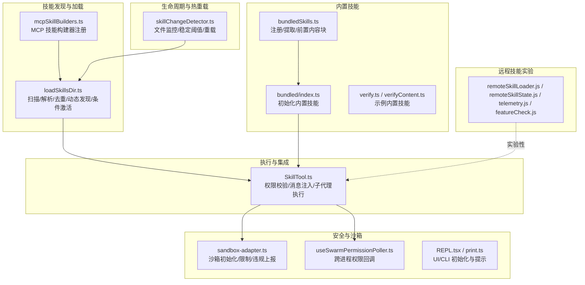
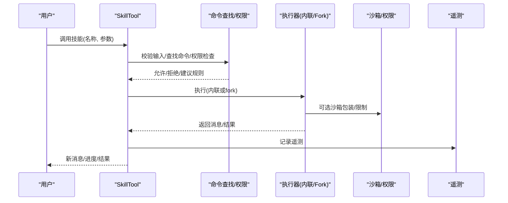
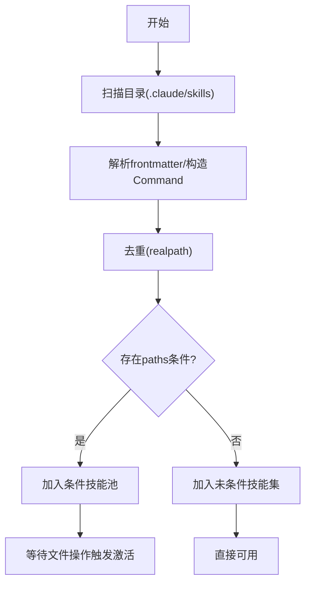
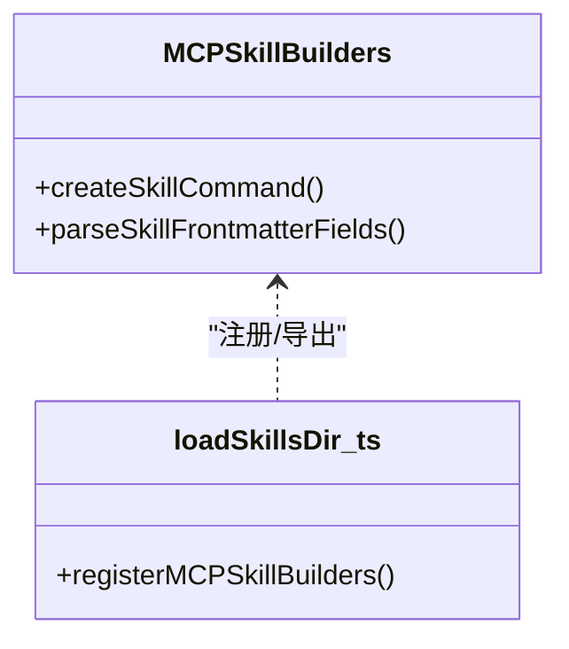
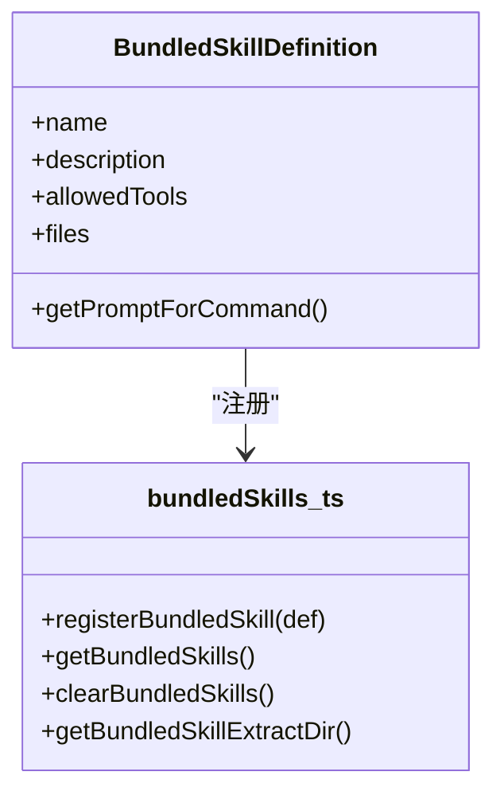
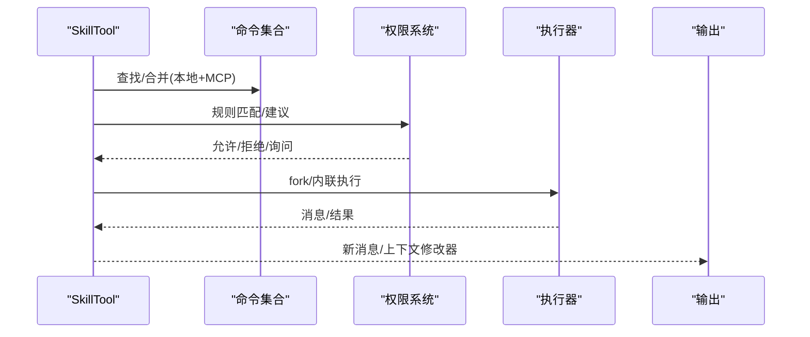
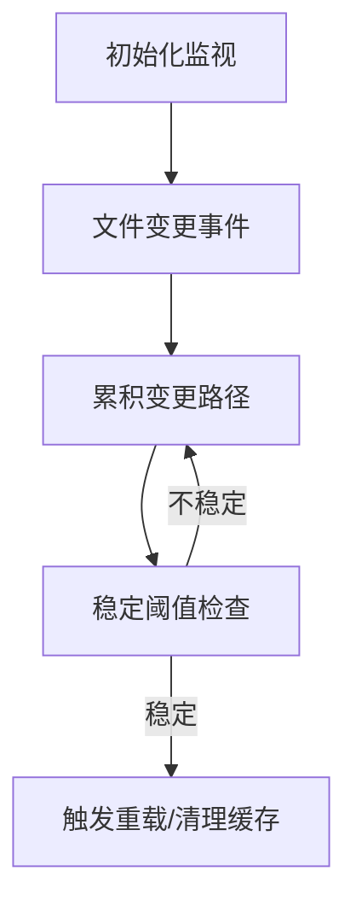
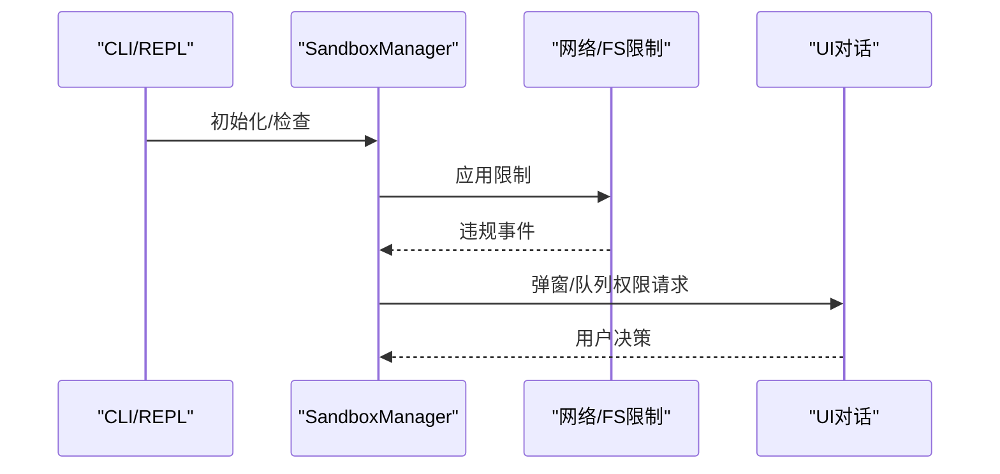
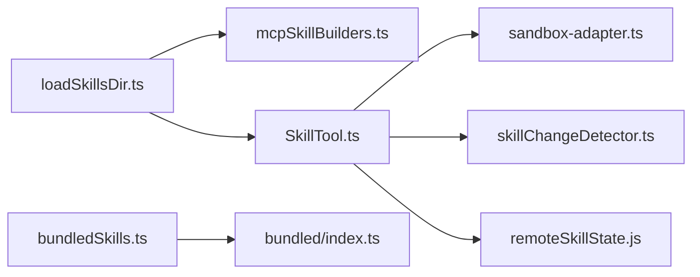

# 技能开发

<cite>
**本文引用的文件**
- [loadSkillsDir.ts](file://src/skills/loadSkillsDir.ts)
- [bundledSkills.ts](file://src/skills/bundledSkills.ts)
- [mcpSkillBuilders.ts](file://src/skills/mcpSkillBuilders.ts)
- [SkillTool.ts](file://src/tools/SkillTool/SkillTool.ts)
- [index.ts（内置技能入口）](file://src/skills/bundled/index.ts)
- [verify.ts](file://src/skills/bundled/verify.ts)
- [verifyContent.ts](file://src/skills/bundled/verifyContent.ts)
- [sandbox-adapter.ts](file://src/utils/sandbox/sandbox-adapter.ts)
- [skillChangeDetector.ts](file://src/utils/skills/skillChangeDetector.ts)
- [remoteSkillLoader.js](file://services/skillSearch/remoteSkillLoader.js)
- [remoteSkillState.js](file://services/skillSearch/remoteSkillState.js)
- [telemetry.js](file://services/skillSearch/telemetry.js)
- [featureCheck.js](file://services/skillSearch/featureCheck.js)
- [print.ts](file://src/cli/print.ts)
- [REPL.tsx](file://src/screens/REPL.tsx)
- [useSwarmPermissionPoller.ts](file://src/hooks/useSwarmPermissionPoller.ts)
- [skillImprovement.ts](file://src/utils/hooks/skillImprovement.ts)
</cite>

## 目录
1. [简介](#简介)
2. [项目结构](#项目结构)
3. [核心组件](#核心组件)
4. [架构总览](#架构总览)
5. [详细组件分析](#详细组件分析)
6. [依赖关系分析](#依赖关系分析)
7. [性能考量](#性能考量)
8. [故障排查指南](#故障排查指南)
9. [结论](#结论)
10. [附录：开发示例与最佳实践](#附录开发示例与最佳实践)

## 简介
本指南面向为 Claude Code 开发“技能”的工程师，系统讲解技能系统的核心概念、加载机制、执行流程、生命周期管理、与命令系统的集成、安全与权限控制、以及测试与性能优化的最佳实践。文档以仓库源码为依据，配合可视化图示帮助快速理解。

## 项目结构
技能系统主要由以下模块组成：
- 技能发现与加载：负责从用户目录、项目目录、策略目录、插件目录等位置扫描并加载技能；支持动态发现与条件激活。
- 技能构建器：统一解析 frontmatter、构造 Command 对象、生成提示词。
- 内置技能注册：在启动时注册随 CLI 分发的内置技能。
- 执行工具：SkillTool 将技能调用转化为消息流或子代理执行，并进行权限校验与结果处理。
- 安全与沙箱：提供网络/文件系统/代理等限制能力，支持跨进程权限请求与 UI 对话。
- 生命周期与热重载：基于文件系统监控实现技能变更检测与自动重载。
- 远程技能：实验性远程技能发现与加载能力（ant 用户可见）。

**图表来源**
- [loadSkillsDir.ts:638-804](file://src/skills/loadSkillsDir.ts#L638-L804)
- [mcpSkillBuilders.ts:1-45](file://src/skills/mcpSkillBuilders.ts#L1-L45)
- [bundledSkills.ts:1-108](file://src/skills/bundledSkills.ts#L1-L108)
- [index.ts（内置技能入口）:1-80](file://src/skills/bundled/index.ts#L1-L80)
- [verify.ts:1-31](file://src/skills/bundled/verify.ts#L1-L31)
- [verifyContent.ts:1-14](file://src/skills/bundled/verifyContent.ts#L1-L14)
- [SkillTool.ts:1-120](file://src/tools/SkillTool/SkillTool.ts#L1-L120)
- [sandbox-adapter.ts:537-985](file://src/utils/sandbox/sandbox-adapter.ts#L537-L985)
- [useSwarmPermissionPoller.ts:162-206](file://src/hooks/useSwarmPermissionPoller.ts#L162-L206)
- [REPL.tsx:2221-2265](file://src/screens/REPL.tsx#L2221-L2265)
- [print.ts:598-626](file://src/cli/print.ts#L598-L626)
- [skillChangeDetector.ts:51-311](file://src/utils/skills/skillChangeDetector.ts#L51-L311)
- [remoteSkillLoader.js:1-3](file://services/skillSearch/remoteSkillLoader.js#L1-L3)

**章节来源**
- [loadSkillsDir.ts:638-804](file://src/skills/loadSkillsDir.ts#L638-L804)
- [bundledSkills.ts:1-108](file://src/skills/bundledSkills.ts#L1-L108)
- [SkillTool.ts:1-120](file://src/tools/SkillTool/SkillTool.ts#L1-L120)
- [sandbox-adapter.ts:537-985](file://src/utils/sandbox/sandbox-adapter.ts#L537-L985)
- [skillChangeDetector.ts:51-311](file://src/utils/skills/skillChangeDetector.ts#L51-L311)

## 核心组件
- 技能目录与文件格式
  - 目录结构：每个技能为一个目录，包含 SKILL.md 文件；不支持单文件形式的 /skills/ 目录。
  - frontmatter 字段：名称、描述、是否允许用户调用、允许使用的工具列表、参数名、when_to_use、版本、模型、禁用模型调用、钩子、执行上下文（fork）、代理、努力等级、shell 前置命令等。
  - 条件技能：通过 paths frontmatter 指定匹配规则，仅在编辑/读取的文件路径命中时激活。
- 技能构建器
  - 解析 frontmatter 并构造 Command 对象，提供 getPromptForCommand 方法生成最终提示词，支持参数替换、环境变量替换、shell 命令执行（非 MCP 场景）。
- 动态加载与缓存
  - 使用 memoized 缓存减少重复扫描；提供 clearSkillCaches 清理缓存。
  - 动态发现：根据文件路径向上遍历到工作目录，发现 .claude/skills 子目录并加载。
  - 条件技能：使用 ignore 库匹配路径，命中后激活并加入动态技能集合。
- 执行工具（SkillTool）
  - 输入校验：检查技能名、类型、禁用模型调用标志。
  - 权限校验：支持精确匹配与前缀匹配规则，内置“仅安全属性”自动放行，否则弹窗询问。
  - 执行：内联执行或 fork 子代理执行；记录遥测与消息标签化；返回新消息与上下文修改器。
- 内置技能
  - 启动时注册，支持一次性提取参考文件到磁盘并在提示词中添加 base dir 前缀，便于模型按需读取。
- 沙箱与安全
  - 可选沙箱初始化与限制（平台支持性检查、依赖检查、网络/文件系统/代理限制），支持跨进程权限请求与 UI 提示。
- 生命周期与热重载
  - 基于文件监控的稳定阈值与防抖策略，避免频繁重载；支持订阅“动态技能已加载”事件清理缓存。
- 远程技能（实验）
  - ant 用户可发现/加载远程技能，支持标记“是否被发现”，并记录遥测。

**章节来源**
- [loadSkillsDir.ts:185-265](file://src/skills/loadSkillsDir.ts#L185-L265)
- [loadSkillsDir.ts:270-401](file://src/skills/loadSkillsDir.ts#L270-L401)
- [loadSkillsDir.ts:407-480](file://src/skills/loadSkillsDir.ts#L407-L480)
- [loadSkillsDir.ts:818-1087](file://src/skills/loadSkillsDir.ts#L818-L1087)
- [bundledSkills.ts:15-41](file://src/skills/bundledSkills.ts#L15-L41)
- [bundledSkills.ts:53-108](file://src/skills/bundledSkills.ts#L53-L108)
- [SkillTool.ts:354-430](file://src/tools/SkillTool/SkillTool.ts#L354-L430)
- [SkillTool.ts:432-578](file://src/tools/SkillTool/SkillTool.ts#L432-L578)
- [SkillTool.ts:580-800](file://src/tools/SkillTool/SkillTool.ts#L580-L800)
- [sandbox-adapter.ts:537-985](file://src/utils/sandbox/sandbox-adapter.ts#L537-L985)
- [skillChangeDetector.ts:51-311](file://src/utils/skills/skillChangeDetector.ts#L51-L311)
- [remoteSkillLoader.js:1-3](file://services/skillSearch/remoteSkillLoader.js#L1-L3)

## 架构总览
技能系统围绕“发现—构建—执行—反馈”闭环展开，关键交互如下：

**图表来源**
- [SkillTool.ts:354-430](file://src/tools/SkillTool/SkillTool.ts#L354-L430)
- [SkillTool.ts:432-578](file://src/tools/SkillTool/SkillTool.ts#L432-L578)
- [SkillTool.ts:580-800](file://src/tools/SkillTool/SkillTool.ts#L580-L800)
- [sandbox-adapter.ts:704-725](file://src/utils/sandbox/sandbox-adapter.ts#L704-L725)

## 详细组件分析

### 组件A：技能发现与加载（loadSkillsDir）
- 职责
  - 扫描策略/用户/项目/附加目录下的 .claude/skills，加载为 Command。
  - 解析 frontmatter，构造 Command，支持 paths 条件规则。
  - 去重（基于真实路径），动态发现（按深度排序覆盖），条件技能延迟激活。
  - 提供 onDynamicSkillsLoaded 信号，供其他模块清理缓存。
- 关键点
  - 目录优先：/skills/ 目录下仅支持“目录/文件”格式，不支持单文件。
  - 去重策略：使用 realpath 避免符号链接与重复父目录导致的重复加载。
  - 条件技能：使用 ignore 匹配 paths，命中后移入动态技能集合。
  - 动态发现：向上遍历至 cwd，过滤 gitignored 目录，避免 node_modules 等。
- 复杂度
  - 扫描与解析为 O(N)（N 为文件数），去重与合并为 O(N)。
  - 条件激活每次操作为 O(C×P)（C 为条件技能数，P 为路径数）。

**图表来源**
- [loadSkillsDir.ts:407-480](file://src/skills/loadSkillsDir.ts#L407-L480)
- [loadSkillsDir.ts:716-797](file://src/skills/loadSkillsDir.ts#L716-L797)
- [loadSkillsDir.ts:818-1087](file://src/skills/loadSkillsDir.ts#L818-L1087)

**章节来源**
- [loadSkillsDir.ts:638-804](file://src/skills/loadSkillsDir.ts#L638-L804)
- [loadSkillsDir.ts:818-1087](file://src/skills/loadSkillsDir.ts#L818-L1087)

### 组件B：技能构建器（mcpSkillBuilders）
- 职责
  - 作为依赖图叶子节点，向 MCP 技能发现模块暴露 createSkillCommand 与 parseSkillFrontmatterFields。
  - 避免动态导入环，确保在启动时尽早注册。
- 价值
  - 保证 MCP 技能与本地技能共享同一套解析与构建逻辑，保持一致性。

**图表来源**
- [mcpSkillBuilders.ts:1-45](file://src/skills/mcpSkillBuilders.ts#L1-L45)
- [loadSkillsDir.ts:1077-1087](file://src/skills/loadSkillsDir.ts#L1077-L1087)

**章节来源**
- [mcpSkillBuilders.ts:1-45](file://src/skills/mcpSkillBuilders.ts#L1-L45)
- [loadSkillsDir.ts:1077-1087](file://src/skills/loadSkillsDir.ts#L1077-L1087)

### 组件C：内置技能注册（bundledSkills）
- 职责
  - 注册随 CLI 分发的内置技能，支持一次性提取参考文件到磁盘，生成带 base dir 前缀的内容块。
  - 提供注册表与清理函数，用于测试与热重载场景。
- 安全
  - 写入采用安全模式（O_EXCL/O_NOFOLLOW/0o700/0o600），防止符号链接攻击与竞态。

**图表来源**
- [bundledSkills.ts:15-41](file://src/skills/bundledSkills.ts#L15-L41)
- [bundledSkills.ts:53-108](file://src/skills/bundledSkills.ts#L53-L108)

**章节来源**
- [bundledSkills.ts:1-108](file://src/skills/bundledSkills.ts#L1-L108)

### 组件D：执行工具（SkillTool）
- 职责
  - 输入校验：名称合法性、存在性、类型、禁用标志。
  - 权限校验：精确匹配/前缀匹配/仅安全属性自动放行/建议规则。
  - 执行：内联扩展为完整提示并发起查询；fork 子代理执行，收集进度消息。
  - 结果：返回新消息、上下文修改器、遥测字段。
- 与命令系统集成
  - 合并本地与 MCP 技能，去重后统一调度。
  - 支持远程规范技能（ant 用户）直接注入内容，无需 slash 扩展。

**图表来源**
- [SkillTool.ts:81-94](file://src/tools/SkillTool/SkillTool.ts#L81-L94)
- [SkillTool.ts:354-430](file://src/tools/SkillTool/SkillTool.ts#L354-L430)
- [SkillTool.ts:432-578](file://src/tools/SkillTool/SkillTool.ts#L432-L578)
- [SkillTool.ts:580-800](file://src/tools/SkillTool/SkillTool.ts#L580-L800)

**章节来源**
- [SkillTool.ts:1-120](file://src/tools/SkillTool/SkillTool.ts#L1-L120)
- [SkillTool.ts:354-430](file://src/tools/SkillTool/SkillTool.ts#L354-L430)
- [SkillTool.ts:432-578](file://src/tools/SkillTool/SkillTool.ts#L432-L578)
- [SkillTool.ts:580-800](file://src/tools/SkillTool/SkillTool.ts#L580-L800)

### 组件E：生命周期与热重载（skillChangeDetector）
- 职责
  - 监控技能目录文件变化，使用稳定阈值与防抖避免频繁重载。
  - 在技能变更后通知订阅者清理缓存，触发重新加载。
- 平台适配
  - 在 Bun 下使用轮询避免死锁问题。

**图表来源**
- [skillChangeDetector.ts:51-311](file://src/utils/skills/skillChangeDetector.ts#L51-L311)
- [loadSkillsDir.ts:831-851](file://src/skills/loadSkillsDir.ts#L831-L851)

**章节来源**
- [skillChangeDetector.ts:51-311](file://src/utils/skills/skillChangeDetector.ts#L51-L311)
- [loadSkillsDir.ts:831-851](file://src/skills/loadSkillsDir.ts#L831-L851)

### 组件F：安全与沙箱（sandbox-adapter）
- 职责
  - 平台与依赖检查，初始化沙箱，应用网络/文件系统/代理限制。
  - 支持跨进程权限请求与 UI 提示，失败时给出明确原因。
- 与 CLI/REPL 集成
  - CLI 启动时检测沙箱不可用原因并按策略终止或警告。
  - REPL 中处理沙箱权限请求队列与回调。

**图表来源**
- [sandbox-adapter.ts:537-985](file://src/utils/sandbox/sandbox-adapter.ts#L537-L985)
- [print.ts:598-626](file://src/cli/print.ts#L598-L626)
- [REPL.tsx:2221-2265](file://src/screens/REPL.tsx#L2221-L2265)
- [useSwarmPermissionPoller.ts:162-206](file://src/hooks/useSwarmPermissionPoller.ts#L162-L206)

**章节来源**
- [sandbox-adapter.ts:537-985](file://src/utils/sandbox/sandbox-adapter.ts#L537-L985)
- [print.ts:598-626](file://src/cli/print.ts#L598-L626)
- [REPL.tsx:2221-2265](file://src/screens/REPL.tsx#L2221-L2265)
- [useSwarmPermissionPoller.ts:162-206](file://src/hooks/useSwarmPermissionPoller.ts#L162-L206)

### 组件G：远程技能（实验）
- 职责
  - ant 用户可发现/加载远程技能，支持标记“是否被发现”，记录遥测。
  - 与本地技能共享执行路径，但内容来自远程存储。

**章节来源**
- [remoteSkillLoader.js:1-3](file://services/skillSearch/remoteSkillLoader.js#L1-L3)
- [remoteSkillState.js:1-200](file://services/skillSearch/remoteSkillState.js#L1-L200)
- [telemetry.js:1-200](file://services/skillSearch/telemetry.js#L1-L200)
- [featureCheck.js:1-200](file://services/skillSearch/featureCheck.js#L1-L200)

## 依赖关系分析
- 模块耦合
  - loadSkillsDir.ts 与 mcpSkillBuilders.ts 通过只导入类型的方式解耦，避免循环依赖。
  - SkillTool 依赖命令集合（本地+MCP），并通过工具权限系统进行规则匹配。
  - 沙箱模块独立于技能系统，通过初始化钩子接入 CLI/REPL。
- 外部依赖
  - ignore 用于路径匹配；memoize 用于缓存；lodash-es 用于去重与数组处理。
- 潜在风险
  - 动态导入环（非字面量）在某些打包器上会失败，mcpSkillBuilders.ts 通过“写一次注册”规避。
  - Bun 的 FSWatcher 死锁问题通过轮询解决。

**图表来源**
- [loadSkillsDir.ts:638-804](file://src/skills/loadSkillsDir.ts#L638-L804)
- [mcpSkillBuilders.ts:1-45](file://src/skills/mcpSkillBuilders.ts#L1-L45)
- [SkillTool.ts:1-120](file://src/tools/SkillTool/SkillTool.ts#L1-L120)
- [bundledSkills.ts:1-108](file://src/skills/bundledSkills.ts#L1-L108)
- [index.ts（内置技能入口）:1-80](file://src/skills/bundled/index.ts#L1-L80)
- [sandbox-adapter.ts:537-985](file://src/utils/sandbox/sandbox-adapter.ts#L537-L985)
- [skillChangeDetector.ts:51-311](file://src/utils/skills/skillChangeDetector.ts#L51-L311)
- [remoteSkillState.js:1-200](file://services/skillSearch/remoteSkillState.js#L1-L200)

**章节来源**
- [loadSkillsDir.ts:638-804](file://src/skills/loadSkillsDir.ts#L638-L804)
- [SkillTool.ts:1-120](file://src/tools/SkillTool/SkillTool.ts#L1-L120)

## 性能考量
- 缓存与去重
  - 使用 memoize 缓存目录扫描结果；去重基于 realpath，避免重复 IO。
- 执行路径优化
  - 内联执行适合轻量技能；fork 子代理执行适合需要隔离或长耗时任务。
- 文件监控
  - 在 Bun 下使用 stat 轮询避免死锁；设置稳定阈值与防抖降低重载频率。
- 前端渲染
  - SkillTool 在 fork 执行时按工具使用事件推送进度，避免阻塞主线程。

[本节为通用指导，无需特定文件来源]

## 故障排查指南
- 技能未出现
  - 检查目录结构是否为“目录/SKILL.md”，而非单文件。
  - 确认 frontmatter 是否包含有效名称与描述。
  - 若为条件技能，确认 paths 是否与当前文件匹配。
- 权限被拒绝
  - 检查权限规则：精确匹配、前缀匹配、仅安全属性自动放行。
  - 使用建议规则快速授权。
- 沙箱不可用
  - CLI 启动时若沙箱不可用会给出明确原因；必要时关闭强制要求或修复依赖。
- 远程技能不可用
  - 确认实验特性开启且已在会话中发现该技能。

**章节来源**
- [SkillTool.ts:354-430](file://src/tools/SkillTool/SkillTool.ts#L354-L430)
- [SkillTool.ts:432-578](file://src/tools/SkillTool/SkillTool.ts#L432-L578)
- [print.ts:598-626](file://src/cli/print.ts#L598-L626)
- [sandbox-adapter.ts:562-567](file://src/utils/sandbox/sandbox-adapter.ts#L562-L567)

## 结论
Claude Code 的技能系统以“统一的 frontmatter 解析与 Command 构建”为核心，结合动态发现、条件激活、权限与沙箱控制、以及文件监控热重载，形成高扩展、可审计、可隔离的技能生态。开发者可基于内置模板快速实现简单技能，并通过 fork 执行与远程技能能力扩展复杂场景。

[本节为总结，无需特定文件来源]

## 附录：开发示例与最佳实践

### 示例一：简单内置技能（verify）
- 目标
  - 展示如何注册一个内置技能，包含 frontmatter 描述与参考文件。
- 关键步骤
  - 在 bundled 目录新增注册函数，调用 registerBundledSkill。
  - 将 SKILL.md 与示例文件以文本形式内联，供运行时注入。
- 最佳实践
  - 使用 getBundledSkillExtractDir 生成确定性提取目录。
  - 仅在 ant 用户可见时启用（通过 USER_TYPE 判断）。
  - 为复杂技能提供示例文件，便于模型按需读取。

**章节来源**
- [verify.ts:1-31](file://src/skills/bundled/verify.ts#L1-L31)
- [verifyContent.ts:1-14](file://src/skills/bundled/verifyContent.ts#L1-L14)
- [bundledSkills.ts:117-145](file://src/skills/bundledSkills.ts#L117-L145)
- [index.ts（内置技能入口）:1-80](file://src/skills/bundled/index.ts#L1-L80)

### 示例二：复杂技能（fork 执行 + 权限）
- 目标
  - 展示如何编写需要 fork 执行、涉及工具使用与权限控制的技能。
- 关键步骤
  - 在 frontmatter 中声明 context: fork 或指定 allowed-tools。
  - 在 getPromptForCommand 中准备上下文与消息，必要时使用 prepareForkedCommandContext。
  - 在 SkillTool 中根据 command.context 决定 fork 执行路径。
- 最佳实践
  - 明确 effort 与 agent，以便子代理正确预算与行为。
  - 使用遥测字段记录技能来源、插件市场等信息，便于分析。

**章节来源**
- [SkillTool.ts:118-130](file://src/tools/SkillTool/SkillTool.ts#L118-L130)
- [SkillTool.ts:621-632](file://src/tools/SkillTool/SkillTool.ts#L621-L632)
- [SkillTool.ts:766-800](file://src/tools/SkillTool/SkillTool.ts#L766-L800)

### 开发清单与检查项
- 目录与文件
  - 技能目录结构：技能名/SKILL.md。
  - frontmatter 字段齐全：名称、描述、是否用户可调用、allowed-tools、arguments、when_to_use、paths（可选）。
- 执行与安全
  - 避免在 MCP 技能中执行 shell 命令（已内置保护）。
  - 必要时声明 context: fork，确保隔离与资源限制。
  - 使用仅安全属性自动放行策略，减少权限弹窗。
- 生命周期与热重载
  - 修改后通过文件监控自动重载，注意稳定阈值与防抖设置。
  - 如需立即生效，调用 clearSkillCaches 清理缓存。
- 测试与调试
  - 使用内置技能模板作为起点，逐步增加复杂度。
  - 通过遥测与日志定位问题，关注“动态技能变更”事件。

**章节来源**
- [loadSkillsDir.ts:806-811](file://src/skills/loadSkillsDir.ts#L806-L811)
- [skillChangeDetector.ts:51-311](file://src/utils/skills/skillChangeDetector.ts#L51-L311)
- [SkillTool.ts:432-578](file://src/tools/SkillTool/SkillTool.ts#L432-L578)