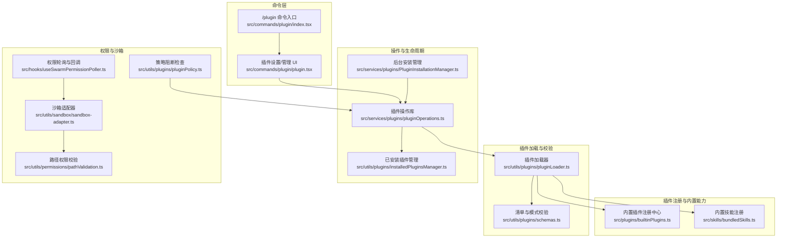
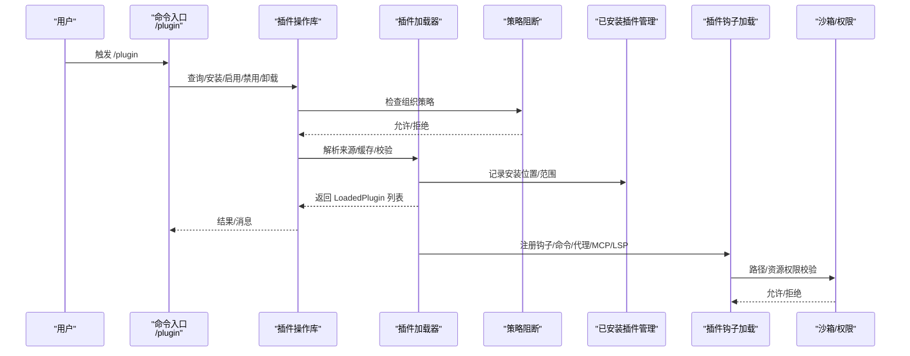
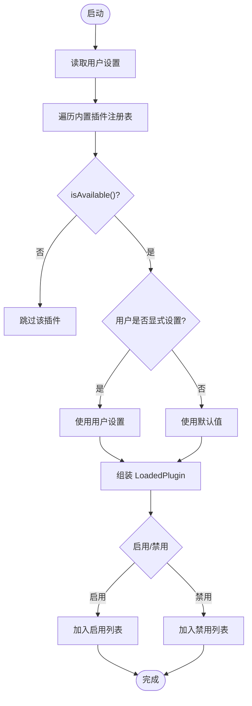
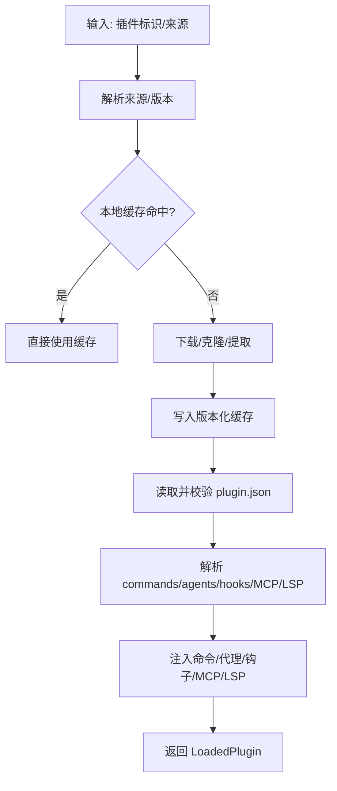
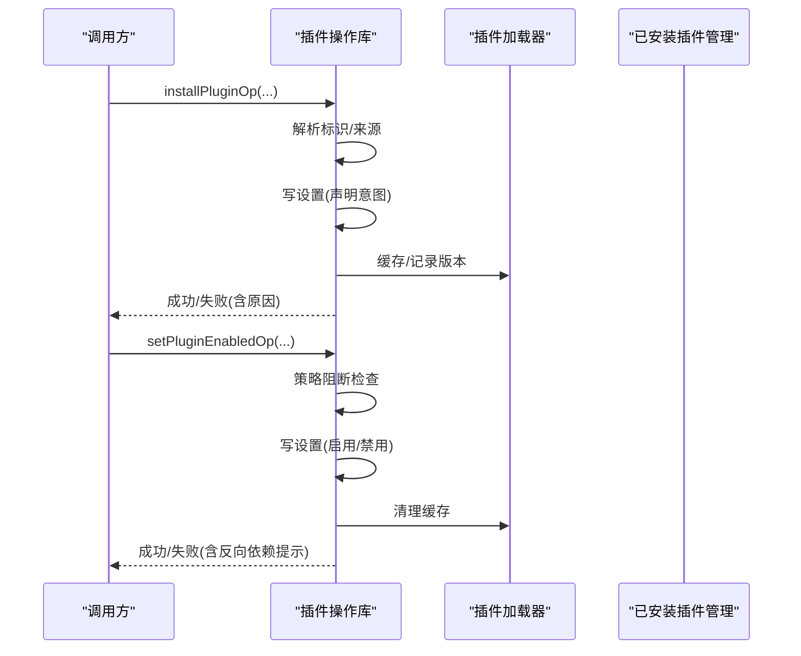
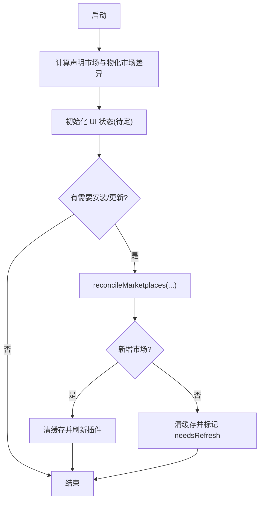
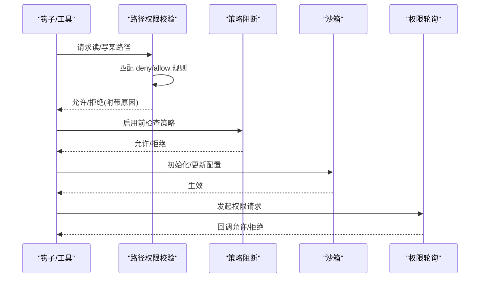
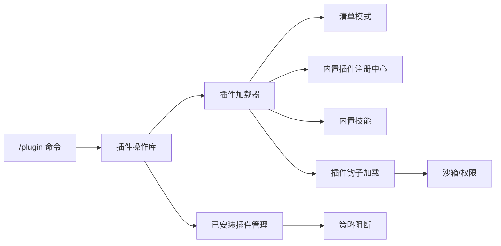

# 插件命令开发

<cite>
**本文引用的文件**
- [builtinPlugins.ts](file://src/plugins/builtinPlugins.ts)
- [plugin.ts](file://src/commands/plugin/plugin.tsx)
- [index.tsx](file://src/commands/plugin/index.tsx)
- [plugin.tsx](file://src/commands/plugin/plugin.tsx)
- [plugin.ts](file://src/commands/init.ts)
- [plugin.ts](file://src/utils/plugins/pluginLoader.ts)
- [pluginOperations.ts](file://src/services/plugins/pluginOperations.ts)
- [PluginInstallationManager.ts](file://src/services/plugins/PluginInstallationManager.ts)
- [schemas.ts](file://src/utils/plugins/schemas.ts)
- [plugin.ts](file://src/utils/plugins/pluginPolicy.ts)
- [plugin.ts](file://src/utils/plugins/loadPluginHooks.ts)
- [plugin.ts](file://src/hooks/useManagePlugins.ts)
- [plugin.ts](file://src/utils/plugins/installedPluginsManager.ts)
- [plugin.ts](file://src/utils/sandbox/sandbox-adapter.ts)
- [plugin.ts](file://src/hooks/useSwarmPermissionPoller.ts)
- [plugin.ts](file://src/utils/permissions/pathValidation.ts)
- [bundledSkills.ts](file://src/skills/bundledSkills.ts)
</cite>

## 目录
1. [简介](#简介)
2. [项目结构](#项目结构)
3. [核心组件](#核心组件)
4. [架构总览](#架构总览)
5. [详细组件分析](#详细组件分析)
6. [依赖关系分析](#依赖关系分析)
7. [性能考量](#性能考量)
8. [故障排查指南](#故障排查指南)
9. [结论](#结论)
10. [附录](#附录)

## 简介
本指南面向为 Claude Code 开发“插件命令”的开发者，系统阐述插件系统的架构设计、命令注册机制、插件生命周期管理、与主应用的交互方式、安全与权限控制，并提供从零到一的完整开发示例与测试发布流程。文档以仓库现有实现为依据，结合源码路径定位，帮助你快速构建可维护、可扩展且安全的插件。

## 项目结构
Claude Code 的插件体系由“内置插件注册中心”“插件清单与校验”“插件加载器”“操作编排（安装/启用/禁用/卸载）”“后台安装与刷新”“权限与沙箱”等模块协同组成。命令层通过“/plugin”入口进入插件管理界面，底层通过插件加载器解析市场与本地来源，再将技能、钩子、MCP/LSP 等能力注入主应用。

**图表来源**
- [index.tsx:1-11](file://src/commands/plugin/index.tsx#L1-L11)
- [plugin.tsx:1-7](file://src/commands/plugin/plugin.tsx#L1-L7)
- [builtinPlugins.ts:1-160](file://src/plugins/builtinPlugins.ts#L1-L160)
- [bundledSkills.ts:1-221](file://src/skills/bundledSkills.ts#L1-L221)
- [plugin.ts:1-800](file://src/utils/plugins/pluginLoader.ts#L1-L800)
- [schemas.ts:1-800](file://src/utils/plugins/schemas.ts#L1-L800)
- [pluginOperations.ts:1-800](file://src/services/plugins/pluginOperations.ts#L1-L800)
- [PluginInstallationManager.ts:1-185](file://src/services/plugins/PluginInstallationManager.ts#L1-L185)
- [installedPluginsManager.ts:468-505](file://src/utils/plugins/installedPluginsManager.ts#L468-L505)
- [plugin.ts:1-21](file://src/utils/plugins/pluginPolicy.ts#L1-L21)
- [plugin.ts:537-803](file://src/utils/sandbox/sandbox-adapter.ts#L537-L803)
- [plugin.ts:162-257](file://src/hooks/useSwarmPermissionPoller.ts#L162-L257)
- [plugin.ts:112-162](file://src/utils/permissions/pathValidation.ts#L112-L162)

**章节来源**
- [index.tsx:1-11](file://src/commands/plugin/index.tsx#L1-L11)
- [plugin.tsx:1-7](file://src/commands/plugin/plugin.tsx#L1-L7)
- [builtinPlugins.ts:1-160](file://src/plugins/builtinPlugins.ts#L1-L160)
- [bundledSkills.ts:1-221](file://src/skills/bundledSkills.ts#L1-L221)
- [plugin.ts:1-800](file://src/utils/plugins/pluginLoader.ts#L1-L800)
- [schemas.ts:1-800](file://src/utils/plugins/schemas.ts#L1-L800)
- [pluginOperations.ts:1-800](file://src/services/plugins/pluginOperations.ts#L1-L800)
- [PluginInstallationManager.ts:1-185](file://src/services/plugins/PluginInstallationManager.ts#L1-L185)
- [installedPluginsManager.ts:468-505](file://src/utils/plugins/installedPluginsManager.ts#L468-L505)
- [plugin.ts:1-21](file://src/utils/plugins/pluginPolicy.ts#L1-L21)
- [plugin.ts:537-803](file://src/utils/sandbox/sandbox-adapter.ts#L537-L803)
- [plugin.ts:162-257](file://src/hooks/useSwarmPermissionPoller.ts#L162-L257)
- [plugin.ts:112-162](file://src/utils/permissions/pathValidation.ts#L112-L162)

## 核心组件
- 内置插件注册中心：集中注册与导出内置插件，支持按用户设置启用/禁用，并将技能转换为命令对象。
- 插件加载器：负责从市场或本地来源发现、拉取、缓存、解包、校验与装配插件，产出 LoadedPlugin 并注入命令/代理/钩子/MCP/LSP。
- 插件操作库：提供安装、卸载、启用、禁用、批量禁用等纯函数式操作，返回结构化结果与错误信息。
- 后台安装管理：在启动时自动安装/更新市场，必要时触发插件刷新。
- 权限与沙箱：策略阻断、路径白/黑名单、沙箱配置热更新、跨进程权限请求与回调。
- 命令入口与 UI：/plugin 命令进入插件管理界面，驱动上述能力。

**章节来源**
- [builtinPlugins.ts:1-160](file://src/plugins/builtinPlugins.ts#L1-L160)
- [plugin.ts:1-800](file://src/utils/plugins/pluginLoader.ts#L1-L800)
- [pluginOperations.ts:1-800](file://src/services/plugins/pluginOperations.ts#L1-L800)
- [PluginInstallationManager.ts:1-185](file://src/services/plugins/PluginInstallationManager.ts#L1-L185)
- [plugin.ts:1-21](file://src/utils/plugins/pluginPolicy.ts#L1-L21)
- [plugin.ts:537-803](file://src/utils/sandbox/sandbox-adapter.ts#L537-L803)
- [plugin.ts:162-257](file://src/hooks/useSwarmPermissionPoller.ts#L162-L257)
- [plugin.ts:112-162](file://src/utils/permissions/pathValidation.ts#L112-L162)
- [index.tsx:1-11](file://src/commands/plugin/index.tsx#L1-L11)
- [plugin.tsx:1-7](file://src/commands/plugin/plugin.tsx#L1-L7)

## 架构总览
下图展示从“/plugin 命令”到“插件加载与装配”的端到端流程，以及与权限/沙箱的交互点。

**图表来源**
- [index.tsx:1-11](file://src/commands/plugin/index.tsx#L1-L11)
- [plugin.tsx:1-7](file://src/commands/plugin/plugin.tsx#L1-L7)
- [pluginOperations.ts:1-800](file://src/services/plugins/pluginOperations.ts#L1-L800)
- [plugin.ts:1-800](file://src/utils/plugins/pluginLoader.ts#L1-L800)
- [plugin.ts:1-21](file://src/utils/plugins/pluginPolicy.ts#L1-L21)
- [installedPluginsManager.ts:468-505](file://src/utils/plugins/installedPluginsManager.ts#L468-L505)
- [plugin.ts:159-287](file://src/utils/plugins/loadPluginHooks.ts#L159-L287)
- [plugin.ts:537-803](file://src/utils/sandbox/sandbox-adapter.ts#L537-L803)
- [plugin.ts:112-162](file://src/utils/permissions/pathValidation.ts#L112-L162)

## 详细组件分析

### 组件A：内置插件注册中心与技能命令导出
- 职责：注册内置插件，按用户设置拆分启用/禁用列表；将内置技能转换为命令对象，供命令系统使用。
- 关键点：
  - 插件标识格式：name@builtin，便于区分内置与市场插件。
  - 可选可用性检查：isAvailable() 过滤不可用插件。
  - 用户偏好优先级：settings.enabledPlugins > 默认值 > true。
  - 技能转命令：保留 allowedTools、argumentHint、model、hooks、context、agent 等字段。

**图表来源**
- [builtinPlugins.ts:57-102](file://src/plugins/builtinPlugins.ts#L57-L102)
- [builtinPlugins.ts:108-121](file://src/plugins/builtinPlugins.ts#L108-L121)
- [builtinPlugins.ts:132-160](file://src/plugins/builtinPlugins.ts#L132-L160)

**章节来源**
- [builtinPlugins.ts:1-160](file://src/plugins/builtinPlugins.ts#L1-L160)

### 组件B：插件加载器与清单校验
- 职责：解析市场/本地来源，下载/克隆/解压，缓存版本化目录，校验清单与模式，装配命令/代理/钩子/MCP/LSP。
- 关键点：
  - 支持本地目录、git 仓库、git 子目录、NPM 包（经市场入口）、ZIP 缓存。
  - 版本化缓存路径与种子缓存探测，避免重复下载。
  - 清单模式：插件元数据、依赖、hooks、commands/agents/skills/output-styles、MCP/LSP 配置、用户配置项等。
  - 安全：校验 marketplace 名称、禁止同名官方市场伪装；路径合法性与符号链接处理；.git 目录清理。

**图表来源**
- [plugin.ts:1-800](file://src/utils/plugins/pluginLoader.ts#L1-L800)
- [schemas.ts:1-800](file://src/utils/plugins/schemas.ts#L1-L800)

**章节来源**
- [plugin.ts:1-800](file://src/utils/plugins/pluginLoader.ts#L1-L800)
- [schemas.ts:1-800](file://src/utils/plugins/schemas.ts#L1-L800)

### 组件C：插件操作库（安装/卸载/启用/禁用/更新）
- 职责：纯函数式操作，不直接写日志/退出；返回统一结果对象；支持作用域（user/project/local/managed）。
- 关键点：
  - 安装：搜索市场 -> 写设置（声明意图）-> 缓存并记录版本提示。
  - 卸载：删除设置键 -> 清理缓存 -> 移除安装记录 -> 最后作用域时清理选项与数据目录。
  - 启用/禁用：内置插件走用户作用域；普通插件自动检测最具体作用域；策略阻断检查。
  - 更新：基于版本与来源变更判断；失败回退至 needsRefresh 提示。

**图表来源**
- [pluginOperations.ts:321-418](file://src/services/plugins/pluginOperations.ts#L321-L418)
- [pluginOperations.ts:427-558](file://src/services/plugins/pluginOperations.ts#L427-L558)
- [pluginOperations.ts:573-747](file://src/services/plugins/pluginOperations.ts#L573-L747)
- [plugin.ts:1-800](file://src/utils/plugins/pluginLoader.ts#L1-L800)
- [installedPluginsManager.ts:468-505](file://src/utils/plugins/installedPluginsManager.ts#L468-L505)

**章节来源**
- [pluginOperations.ts:1-800](file://src/services/plugins/pluginOperations.ts#L1-L800)
- [installedPluginsManager.ts:468-505](file://src/utils/plugins/installedPluginsManager.ts#L468-L505)

### 组件D：后台安装与刷新
- 职责：启动时对比“声明市场”与“已物化市场”，对缺失/变更的市场进行后台安装；安装完成后自动刷新插件或标记 needsRefresh。
- 关键点：
  - 将进度映射到 AppState，用于 REPL UI 展示。
  - 新增市场后自动刷新插件并重连 MCP；更新则标记 needsRefresh。

**图表来源**
- [PluginInstallationManager.ts:60-185](file://src/services/plugins/PluginInstallationManager.ts#L60-L185)

**章节来源**
- [PluginInstallationManager.ts:1-185](file://src/services/plugins/PluginInstallationManager.ts#L1-L185)

### 组件E：权限与沙箱
- 职责：策略阻断（企业策略禁止安装/启用）、路径权限校验（读/写白/黑名单）、沙箱配置动态更新、跨进程权限请求与回调。
- 关键点：
  - isPluginBlockedByPolicy：统一策略阻断入口。
  - isPathAllowed：先拒后允，deny 优先于 allow。
  - 沙箱初始化与配置更新：根据设置变化动态调整 allowedDomains 等。
  - Swarm 权限轮询：注册回调、处理响应、解析决策并回调上层。

**图表来源**
- [plugin.ts:1-21](file://src/utils/plugins/pluginPolicy.ts#L1-L21)
- [plugin.ts:112-162](file://src/utils/permissions/pathValidation.ts#L112-L162)
- [plugin.ts:537-803](file://src/utils/sandbox/sandbox-adapter.ts#L537-L803)
- [plugin.ts:162-257](file://src/hooks/useSwarmPermissionPoller.ts#L162-L257)

**章节来源**
- [plugin.ts:1-21](file://src/utils/plugins/pluginPolicy.ts#L1-L21)
- [plugin.ts:112-162](file://src/utils/permissions/pathValidation.ts#L112-L162)
- [plugin.ts:537-803](file://src/utils/sandbox/sandbox-adapter.ts#L537-L803)
- [plugin.ts:162-257](file://src/hooks/useSwarmPermissionPoller.ts#L162-L257)

### 组件F：命令入口与 UI
- /plugin 命令：立即加载 UI，进入插件管理界面；UI 中可浏览市场、安装/启用/禁用/卸载插件、查看错误与信任提示。
- /init 命令：可引导生成 CLAUDE.md、技能与钩子，其中包含官方插件推荐与安装建议。

**章节来源**
- [index.tsx:1-11](file://src/commands/plugin/index.tsx#L1-L11)
- [plugin.tsx:1-7](file://src/commands/plugin/plugin.tsx#L1-L7)
- [plugin.ts:226-257](file://src/commands/init.ts#L226-L257)

## 依赖关系分析
- 命令层依赖插件操作库；插件操作库依赖加载器与已安装插件管理；加载器依赖清单模式与内置/捆绑技能；后台安装管理依赖市场与加载器；权限与沙箱贯穿加载与运行期。
- 循环依赖控制：策略阻断模块仅依赖设置，避免与插件子系统形成环路。

**图表来源**
- [index.tsx:1-11](file://src/commands/plugin/index.tsx#L1-L11)
- [pluginOperations.ts:1-800](file://src/services/plugins/pluginOperations.ts#L1-L800)
- [plugin.ts:1-800](file://src/utils/plugins/pluginLoader.ts#L1-L800)
- [schemas.ts:1-800](file://src/utils/plugins/schemas.ts#L1-L800)
- [builtinPlugins.ts:1-160](file://src/plugins/builtinPlugins.ts#L1-L160)
- [bundledSkills.ts:1-221](file://src/skills/bundledSkills.ts#L1-L221)
- [installedPluginsManager.ts:468-505](file://src/utils/plugins/installedPluginsManager.ts#L468-L505)
- [plugin.ts:1-21](file://src/utils/plugins/pluginPolicy.ts#L1-L21)
- [plugin.ts:159-287](file://src/utils/plugins/loadPluginHooks.ts#L159-L287)
- [plugin.ts:537-803](file://src/utils/sandbox/sandbox-adapter.ts#L537-L803)

**章节来源**
- [index.tsx:1-11](file://src/commands/plugin/index.tsx#L1-L11)
- [pluginOperations.ts:1-800](file://src/services/plugins/pluginOperations.ts#L1-L800)
- [plugin.ts:1-800](file://src/utils/plugins/pluginLoader.ts#L1-L800)
- [schemas.ts:1-800](file://src/utils/plugins/schemas.ts#L1-L800)
- [builtinPlugins.ts:1-160](file://src/plugins/builtinPlugins.ts#L1-L160)
- [bundledSkills.ts:1-221](file://src/skills/bundledSkills.ts#L1-L221)
- [installedPluginsManager.ts:468-505](file://src/utils/plugins/installedPluginsManager.ts#L468-L505)
- [plugin.ts:1-21](file://src/utils/plugins/pluginPolicy.ts#L1-L21)
- [plugin.ts:159-287](file://src/utils/plugins/loadPluginHooks.ts#L159-L287)
- [plugin.ts:537-803](file://src/utils/sandbox/sandbox-adapter.ts#L537-L803)

## 性能考量
- 缓存与种子：版本化缓存与种子缓存优先命中，避免重复下载；ZIP 缓存减少磁盘占用与 IO。
- 部分克隆与稀疏检出：git-subdir 使用 filter+cone 模式仅拉取所需树对象，显著降低大仓库开销。
- 后台安装：启动时异步安装/更新市场，避免阻塞主流程；安装完成后自动刷新或提示手动刷新。
- 钩子热重载：移除禁用插件的钩子，避免无效回调；策略变更时原子性清理/注册钩子。

[本节为通用指导，无需特定文件引用]

## 故障排查指南
- 插件未找到/加载失败：检查市场名称、来源、网络与认证；查看错误类型（路径不存在、清单解析/校验失败、网络错误、依赖未满足等）。
- 启用/安装被策略阻断：确认企业策略中是否显式禁用该插件。
- 权限拒绝：核对路径规则、沙箱配置、跨进程权限请求是否被允许。
- 需要刷新：后台安装更新后会标记 needsRefresh，执行 /reload-plugins 刷新生效。

**章节来源**
- [plugin.ts:1-800](file://src/utils/plugins/pluginLoader.ts#L1-L800)
- [plugin.ts:1-21](file://src/utils/plugins/pluginPolicy.ts#L1-L21)
- [plugin.ts:112-162](file://src/utils/permissions/pathValidation.ts#L112-L162)
- [PluginInstallationManager.ts:1-185](file://src/services/plugins/PluginInstallationManager.ts#L1-L185)

## 结论
Claude Code 的插件系统以“声明式设置 + 版本化缓存 + 模式校验 + 权限沙箱”为核心，既保证了灵活性与可扩展性，又确保了安全性与稳定性。通过内置插件注册中心、插件加载器与操作库的协作，开发者可以快速实现从市场/本地来源的插件安装、启用、禁用与卸载，并在 UI 中直观管理。配合后台安装与刷新、策略阻断与权限校验，整体体验安全、可靠、可运维。

[本节为总结，无需特定文件引用]

## 附录

### A. 插件命令开发规范
- 命令接口定义
  - 类型：prompt 或 local-jsx（UI 驱动）。
  - 字段：name、description、aliases、allowedTools、argumentHint、model、disableModelInvocation、userInvocable、hooks、context、agent、isEnabled、isHidden、progressMessage、getPromptForCommand 等。
  - 示例参考：内置技能定义与转换为命令对象的流程。
- 参数验证
  - 使用清单模式校验（插件元数据、hooks、commands/agents/skills/output-styles、MCP/LSP、用户配置）。
  - 市场名称与来源合法性校验（禁止官方市场伪装、ASCII 校验、来源组织校验）。
- 执行逻辑
  - 安装：写设置（声明意图）-> 缓存 -> 记录版本提示。
  - 启用/禁用：内置插件走用户作用域；普通插件自动检测最具体作用域；策略阻断。
  - 卸载：删除设置键 -> 清理缓存 -> 移除安装记录 -> 最后作用域清理选项与数据目录。
- 错误处理
  - 统一的 PluginError 类型与错误消息映射，便于 UI 展示与日志记录。
  - 依赖未满足、清单解析/校验失败、网络错误、MCP/LSP 配置无效等场景均有明确错误类型。

**章节来源**
- [builtinPlugins.ts:132-160](file://src/plugins/builtinPlugins.ts#L132-L160)
- [schemas.ts:1-800](file://src/utils/plugins/schemas.ts#L1-L800)
- [pluginOperations.ts:321-418](file://src/services/plugins/pluginOperations.ts#L321-L418)
- [pluginOperations.ts:573-747](file://src/services/plugins/pluginOperations.ts#L573-L747)
- [plugin.ts:1-800](file://src/utils/plugins/pluginLoader.ts#L1-L800)

### B. 生命周期管理
- 安装：写设置（声明意图）-> 缓存 -> 记录安装位置与范围。
- 启用/禁用：策略阻断检查 -> 写设置 -> 清理缓存。
- 卸载：删除设置键 -> 清理缓存 -> 移除安装记录 -> 最后作用域清理选项与数据目录。
- 更新：后台安装管理根据来源变更自动处理；更新后标记 needsRefresh。
- 依赖管理：反向依赖检测与提示，避免破坏性卸载/禁用。

**章节来源**
- [pluginOperations.ts:427-558](file://src/services/plugins/pluginOperations.ts#L427-L558)
- [installedPluginsManager.ts:468-505](file://src/utils/plugins/installedPluginsManager.ts#L468-L505)
- [PluginInstallationManager.ts:1-185](file://src/services/plugins/PluginInstallationManager.ts#L1-L185)

### C. 与主应用交互
- API 调用：通过插件加载器注入命令/代理/钩子/MCP/LSP，主应用按需调用。
- 事件通信：插件钩子在工具事件（如 PostToolUse/PreToolUse/Stop）触发；权限轮询通过消息总线处理响应。
- 状态同步：后台安装管理将进度映射到 AppState；策略变更触发钩子热重载。

**章节来源**
- [plugin.ts:159-287](file://src/utils/plugins/loadPluginHooks.ts#L159-L287)
- [plugin.ts:162-257](file://src/hooks/useSwarmPermissionPoller.ts#L162-L257)
- [PluginInstallationManager.ts:1-185](file://src/services/plugins/PluginInstallationManager.ts#L1-L185)

### D. 安全机制与权限控制
- 沙箱执行：支持 macOS/Linux/WSL2 平台；配置动态更新；依赖缺失时给出明确原因。
- 资源访问限制：路径权限校验，deny 优先于 allow；支持工作区路径匹配。
- 恶意代码防护：清单模式校验、来源合法性检查、种子缓存与版本化缓存、.git 目录清理。
- 权限控制：策略阻断（企业策略）、跨进程权限请求与回调、权限规则解释与调试信息。

**章节来源**
- [plugin.ts:537-803](file://src/utils/sandbox/sandbox-adapter.ts#L537-L803)
- [plugin.ts:112-162](file://src/utils/permissions/pathValidation.ts#L112-L162)
- [plugin.ts:1-21](file://src/utils/plugins/pluginPolicy.ts#L1-L21)
- [plugin.ts:162-257](file://src/hooks/useSwarmPermissionPoller.ts#L162-L257)

### E. 测试、调试、打包与发布
- 测试：利用插件加载器与操作库的纯函数特性，构造输入输出断言；使用内置/捆绑技能作为测试基线。
- 调试：错误类型映射与日志记录；后台安装进度与 needsRefresh 提示；权限轮询调试信息。
- 打包：版本化缓存与 ZIP 缓存；种子缓存提升首次加载性能。
- 发布：遵循清单模式与来源合法性校验；市场名称与来源组织校验；策略阻断检查。

**章节来源**
- [plugin.ts:1-800](file://src/utils/plugins/pluginLoader.ts#L1-L800)
- [schemas.ts:1-800](file://src/utils/plugins/schemas.ts#L1-L800)
- [PluginInstallationManager.ts:1-185](file://src/services/plugins/PluginInstallationManager.ts#L1-L185)

### F. 开发示例（步骤指引）
- 简单插件
  - 创建插件目录与 plugin.json，定义基本元数据与一个命令文件。
  - 在命令文件中实现 getPromptForCommand，返回内容块参数。
  - 通过 /plugin 安装并启用，验证命令可用。
- 复杂插件
  - 添加 hooks.json、agents/、skills/、output-styles/ 等目录。
  - 在清单中声明 MCP/LSP 服务器与用户配置项。
  - 使用策略阻断与权限校验，确保资源访问受控。
  - 通过后台安装与刷新流程，观察 needsRefresh 提示与 /reload-plugins 效果。

**章节来源**
- [builtinPlugins.ts:132-160](file://src/plugins/builtinPlugins.ts#L132-L160)
- [schemas.ts:1-800](file://src/utils/plugins/schemas.ts#L1-L800)
- [plugin.ts:1-800](file://src/utils/plugins/pluginLoader.ts#L1-L800)
- [PluginInstallationManager.ts:1-185](file://src/services/plugins/PluginInstallationManager.ts#L1-L185)