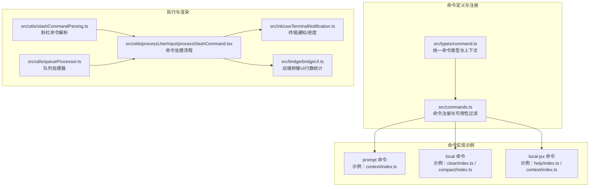
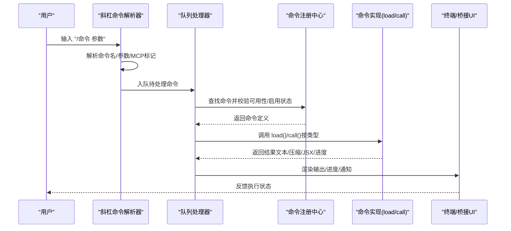
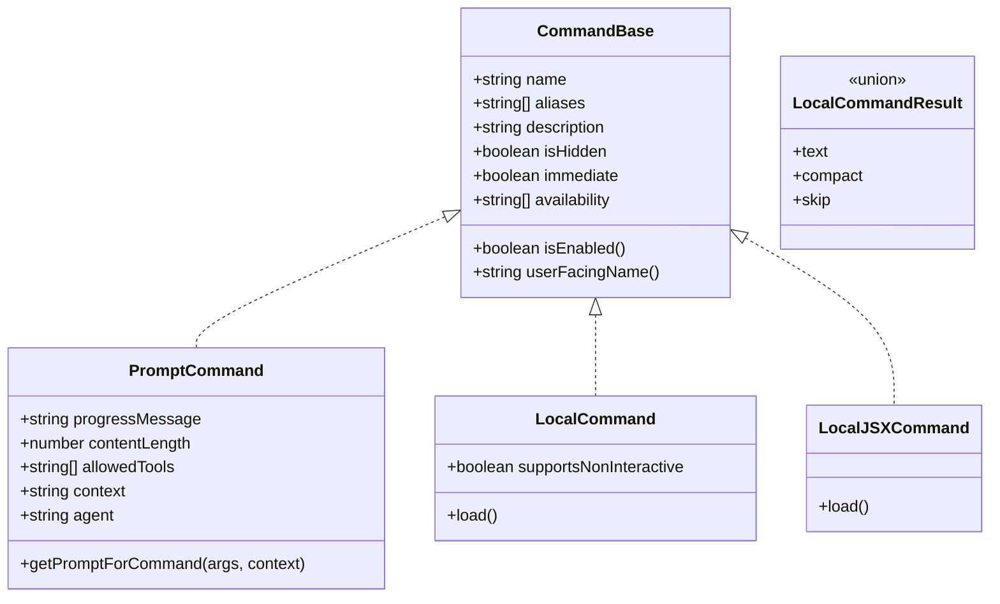
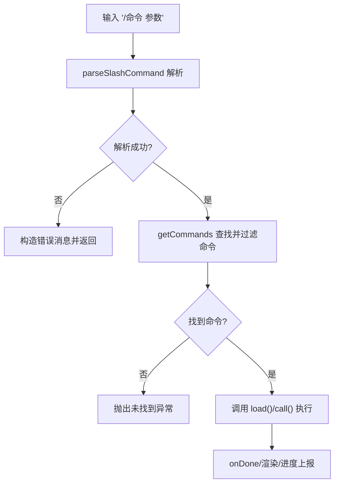
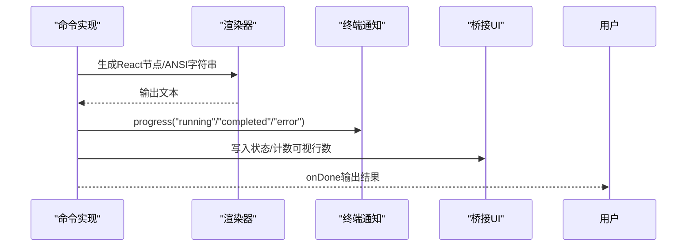
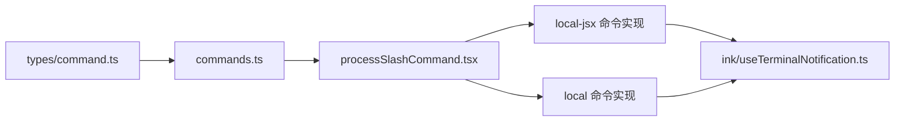

# 自定义命令实现

<cite>
**本文引用的文件**
- [src/types/command.ts](file://src/types/command.ts)
- [src/commands.ts](file://src/commands.ts)
- [src/commands/context/index.ts](file://src/commands/context/index.ts)
- [src/commands/context/context.tsx](file://src/commands/context/context.tsx)
- [src/commands/clear/index.ts](file://src/commands/clear/index.ts)
- [src/commands/clear/clear.ts](file://src/commands/clear/clear.ts)
- [src/commands/compact/index.ts](file://src/commands/compact/index.ts)
- [src/commands/compact/compact.ts](file://src/commands/compact/compact.ts)
- [src/commands/help/index.ts](file://src/commands/help/index.ts)
- [src/utils/commandLifecycle.ts](file://src/utils/commandLifecycle.ts)
- [src/utils/slashCommandParsing.ts](file://src/utils/slashCommandParsing.ts)
- [src/utils/processUserInput/processSlashCommand.tsx](file://src/utils/processUserInput/processSlashCommand.tsx)
- [src/utils/queueProcessor.ts](file://src/utils/queueProcessor.ts)
- [src/ink/useTerminalNotification.ts](file://src/ink/useTerminalNotification.ts)
- [src/ink/terminal.ts](file://src/ink/terminal.ts)
- [src/bridge/bridgeUI.ts](file://src/bridge/bridgeUI.ts)
</cite>

## 目录
1. [引言](#引言)
2. [项目结构](#项目结构)
3. [核心组件](#核心组件)
4. [架构总览](#架构总览)
5. [详细组件分析](#详细组件分析)
6. [依赖关系分析](#依赖关系分析)
7. [性能考虑](#性能考虑)
8. [故障排查指南](#故障排查指南)
9. [结论](#结论)
10. [附录](#附录)

## 引言
本指南面向希望在 Claude Code 中实现自定义命令的开发者，系统讲解命令系统的架构设计、核心接口、生命周期与执行机制，并覆盖三类命令（prompt 命令、local 命令、local-jsx 命令）的实现要点。文档还涵盖参数解析与校验、UI 渲染与交互（终端输出、进度显示、用户反馈）、性能优化策略（异步处理、内存管理、资源释放），以及测试、调试与文档编写的最佳实践。

## 项目结构
命令系统围绕统一的 Command 类型定义展开，通过集中注册与动态加载机制聚合内置命令、技能、插件技能与工作流命令；命令执行由输入解析、队列调度与 UI 渲染构成闭环。

**图表来源**
- [src/types/command.ts:16-206](file://src/types/command.ts#L16-L206)
- [src/commands.ts:258-517](file://src/commands.ts#L258-L517)
- [src/commands/context/index.ts:4-24](file://src/commands/context/index.ts#L4-L24)
- [src/commands/clear/index.ts:10-19](file://src/commands/clear/index.ts#L10-L19)
- [src/commands/compact/index.ts:4-13](file://src/commands/compact/index.ts#L4-L13)
- [src/utils/slashCommandParsing.ts:25-60](file://src/utils/slashCommandParsing.ts#L25-L60)
- [src/utils/queueProcessor.ts:17-31](file://src/utils/queueProcessor.ts#L17-L31)
- [src/utils/processUserInput/processSlashCommand.tsx:309-330](file://src/utils/processUserInput/processSlashCommand.tsx#L309-L330)
- [src/ink/useTerminalNotification.ts:25-125](file://src/ink/useTerminalNotification.ts#L25-L125)
- [src/bridge/bridgeUI.ts:95-121](file://src/bridge/bridgeUI.ts#L95-L121)

**章节来源**
- [src/types/command.ts:16-206](file://src/types/command.ts#L16-L206)
- [src/commands.ts:258-517](file://src/commands.ts#L258-L517)

## 核心组件
- 统一命令类型与上下文
  - CommandBase：命令元数据（名称、别名、描述、可用性、启用条件等）
  - PromptCommand：提示词型命令，支持获取提示内容、工具限制、上下文隔离等
  - LocalCommand：本地命令，延迟加载 call 实现，返回文本或压缩结果
  - LocalJSXCommand：本地 JSX 命令，延迟加载 UI 渲染，返回 React 节点
  - 上下文 LocalJSXCommandContext：包含消息、主题、IDE 状态、回调等
- 命令注册与发现
  - commands.ts 聚合内置命令、技能、插件技能、工作流与动态技能，按可用性与启用状态过滤
  - 提供 getCommands、getSkillToolCommands、getSlashCommandToolSkills 等查询方法
- 生命周期与事件
  - commandLifecycle 工具提供 started/completed 事件监听与通知

**章节来源**
- [src/types/command.ts:16-206](file://src/types/command.ts#L16-L206)
- [src/commands.ts:258-517](file://src/commands.ts#L258-L517)
- [src/utils/commandLifecycle.ts:1-21](file://src/utils/commandLifecycle.ts#L1-L21)

## 架构总览
命令从输入到执行再到 UI 展示的关键路径如下：

**图表来源**
- [src/utils/slashCommandParsing.ts:25-60](file://src/utils/slashCommandParsing.ts#L25-L60)
- [src/utils/queueProcessor.ts:17-31](file://src/utils/queueProcessor.ts#L17-L31)
- [src/commands.ts:476-517](file://src/commands.ts#L476-L517)
- [src/commands/context/context.tsx:30-63](file://src/commands/context/context.tsx#L30-L63)
- [src/commands/clear/clear.ts:4-7](file://src/commands/clear/clear.ts#L4-L7)
- [src/commands/compact/compact.ts:40-137](file://src/commands/compact/compact.ts#L40-L137)
- [src/ink/useTerminalNotification.ts:71-120](file://src/ink/useTerminalNotification.ts#L71-L120)
- [src/bridge/bridgeUI.ts:95-121](file://src/bridge/bridgeUI.ts#L95-L121)

## 详细组件分析

### 命令类型与生命周期
- CommandBase 字段
  - 名称、别名、描述、版本、是否对模型可见、是否敏感参数等
  - 可选 availability/isEnabled/isHidden/immediate/kind 等控制展示与启用
- PromptCommand
  - 支持 progressMessage、contentLength、allowedTools、context/agent 隔离、hooks、paths 等
  - getPromptForCommand(args, context) 生成提示内容块
- LocalCommand
  - supportsNonInteractive 控制非交互会话支持
  - load() 返回 { call }，call(args, context) 返回 LocalCommandResult
- LocalJSXCommand
  - load() 返回 { call }，call(onDone, context, args) 返回 React 节点
  - onDone(result?, options?) 用于控制显示方式与后续行为
- 生命周期
  - setCommandLifecycleListener / notifyCommandLifecycle 提供 started/completed 事件

**图表来源**
- [src/types/command.ts:16-206](file://src/types/command.ts#L16-L206)

**章节来源**
- [src/types/command.ts:16-206](file://src/types/command.ts#L16-L206)
- [src/utils/commandLifecycle.ts:1-21](file://src/utils/commandLifecycle.ts#L1-L21)

### 执行机制与参数处理
- 斜杠命令解析
  - parseSlashCommand 将输入拆分为命令名、参数与 MCP 标记
- 命令查找与过滤
  - getCommands 按 availability/isEnabled 动态过滤
  - getSkillToolCommands / getSlashCommandToolSkills 用于模型可调用技能索引
- 队列与调度
  - isSlashCommand 判断入队项是否为斜杠命令
- 执行入口
  - processSlashCommand 负责解析、安全检查、路由到具体命令实现

**图表来源**
- [src/utils/slashCommandParsing.ts:25-60](file://src/utils/slashCommandParsing.ts#L25-L60)
- [src/commands.ts:476-517](file://src/commands.ts#L476-L517)
- [src/utils/queueProcessor.ts:17-31](file://src/utils/queueProcessor.ts#L17-L31)
- [src/utils/processUserInput/processSlashCommand.tsx:309-330](file://src/utils/processUserInput/processSlashCommand.tsx#L309-L330)

**章节来源**
- [src/utils/slashCommandParsing.ts:25-60](file://src/utils/slashCommandParsing.ts#L25-L60)
- [src/utils/queueProcessor.ts:17-31](file://src/utils/queueProcessor.ts#L17-L31)
- [src/utils/processUserInput/processSlashCommand.tsx:309-330](file://src/utils/processUserInput/processSlashCommand.tsx#L309-L330)
- [src/commands.ts:476-517](file://src/commands.ts#L476-L517)

### 不同类型命令的实现方式

#### prompt 命令
- 特点
  - 通过 getPromptForCommand(args, context) 生成提示内容块，常用于“技能”式能力
  - 支持工具限制、上下文隔离（inline/fork）、代理类型、路径匹配等
- 示例参考
  - context/index.ts 定义了 prompt 型命令的元信息与懒加载
- 适用场景
  - 需要将命令扩展为模型可调用的“技能”，并与对话上下文融合

**章节来源**
- [src/commands/context/index.ts:4-10](file://src/commands/context/index.ts#L4-L10)
- [src/types/command.ts:25-57](file://src/types/command.ts#L25-L57)

#### local 命令
- 特点
  - 以文本或压缩结果作为输出，适合纯终端交互
  - 支持 supportsNonInteractive，便于在非交互会话中使用
- 示例参考
  - clear/index.ts：最小化元数据，懒加载实现
  - clear/clear.ts：调用清理函数并返回空文本结果
  - compact/index.ts：带启用条件与参数提示，懒加载实现
  - compact/compact.ts：复杂流程（会话记忆压缩、微压缩、传统压缩、反应式压缩、后置清理、显示文案构建）
- 适用场景
  - 需要直接修改会话状态、生成摘要或进行上下文压缩

**章节来源**
- [src/commands/clear/index.ts:10-19](file://src/commands/clear/index.ts#L10-L19)
- [src/commands/clear/clear.ts:4-7](file://src/commands/clear/clear.ts#L4-L7)
- [src/commands/compact/index.ts:4-13](file://src/commands/compact/index.ts#L4-L13)
- [src/commands/compact/compact.ts:40-137](file://src/commands/compact/compact.ts#L40-L137)

#### local-jsx 命令
- 特点
  - 通过 React 节点渲染 UI，适合可视化展示与交互
  - 通过 onDone 输出 ANSI 文本以便在终端中呈现
- 示例参考
  - help/index.ts：最小化元数据，懒加载 JSX 实现
  - context/index.ts：同时提供 local-jsx 与 local 非交互版本
  - context/context.tsx：计算上下文使用情况并渲染可视化，最终 onDone 输出
- 适用场景
  - 需要在终端内以图形化方式展示信息或引导用户操作

**章节来源**
- [src/commands/help/index.ts:3-8](file://src/commands/help/index.ts#L3-L8)
- [src/commands/context/index.ts:12-24](file://src/commands/context/index.ts#L12-L24)
- [src/commands/context/context.tsx:30-63](file://src/commands/context/context.tsx#L30-L63)

### 参数处理与验证
- 解析
  - parseSlashCommand 将输入拆分为命令名、参数与 MCP 标记
- 校验
  - processSlashCommand 对命令格式进行校验，若不合法则返回错误消息
- 建议
  - 在命令实现内部对 args 进行二次校验，结合默认值与必填字段，确保健壮性
  - 对敏感参数使用 isSensitive 标记，避免历史记录泄露

**章节来源**
- [src/utils/slashCommandParsing.ts:25-60](file://src/utils/slashCommandParsing.ts#L25-L60)
- [src/utils/processUserInput/processSlashCommand.tsx:309-330](file://src/utils/processUserInput/processSlashCommand.tsx#L309-L330)
- [src/types/command.ts:175-203](file://src/types/command.ts#L175-L203)

### UI 渲染与交互设计
- 终端输出
  - local-jsx 命令通过 renderToAnsiString 将 React 节点转为 ANSI 文本，再由 onDone 回传
  - bridgeUI 提供行数统计与写入逻辑，保证远端桥接时的正确布局
- 进度显示
  - useTerminalNotification 提供进度上报（运行/完成/错误/不确定），支持 iTerm2/Kitty/Ghostty 等
  - terminal.ts 提供进度报告能力检测（仅 TTY 且非 Windows Terminal）
- 用户反馈
  - onDone 支持 display/shouldQuery/metaMessages/nextInput/submitNextInput 等选项，灵活控制后续行为

**图表来源**
- [src/commands/context/context.tsx:60-63](file://src/commands/context/context.tsx#L60-L63)
- [src/ink/useTerminalNotification.ts:71-120](file://src/ink/useTerminalNotification.ts#L71-L120)
- [src/ink/terminal.ts:25-49](file://src/ink/terminal.ts#L25-L49)
- [src/bridge/bridgeUI.ts:95-121](file://src/bridge/bridgeUI.ts#L95-L121)

**章节来源**
- [src/commands/context/context.tsx:30-63](file://src/commands/context/context.tsx#L30-L63)
- [src/ink/useTerminalNotification.ts:25-125](file://src/ink/useTerminalNotification.ts#L25-L125)
- [src/ink/terminal.ts:1-49](file://src/ink/terminal.ts#L1-L49)
- [src/bridge/bridgeUI.ts:95-121](file://src/bridge/bridgeUI.ts#L95-L121)

### 开发示例

#### 简单命令（local 命令）
- 目标：清空会话历史
- 步骤
  - 在 commands/your-command/index.ts 导出 Command，type 为 'local'，supportsNonInteractive 设为 true/false
  - 在 commands/your-command/index.ts 的 load() 中懒加载实现模块
  - 在实现模块中导出 call(args, context)，返回 { type: 'text', value: '...' } 或 { type: 'skip' }
- 参考
  - [src/commands/clear/index.ts:10-19](file://src/commands/clear/index.ts#L10-L19)
  - [src/commands/clear/clear.ts:4-7](file://src/commands/clear/clear.ts#L4-L7)

**章节来源**
- [src/commands/clear/index.ts:10-19](file://src/commands/clear/index.ts#L10-L19)
- [src/commands/clear/clear.ts:4-7](file://src/commands/clear/clear.ts#L4-L7)

#### 复杂命令（local 命令）
- 目标：上下文压缩并生成摘要
- 步骤
  - 在 commands/your-command/index.ts 导出 Command，type 为 'local'
  - 在实现模块中：
    - 解析参数，必要时合并钩子指令
    - 选择压缩路径（会话记忆/微压缩/传统/反应式）
    - 处理异常与取消信号
    - 返回 { type: 'compact', compactionResult, displayText }
  - 后置清理与缓存重置
- 参考
  - [src/commands/compact/index.ts:4-13](file://src/commands/compact/index.ts#L4-L13)
  - [src/commands/compact/compact.ts:40-137](file://src/commands/compact/compact.ts#L40-L137)

**章节来源**
- [src/commands/compact/index.ts:4-13](file://src/commands/compact/index.ts#L4-L13)
- [src/commands/compact/compact.ts:40-137](file://src/commands/compact/compact.ts#L40-L137)

#### 可视化命令（local-jsx 命令）
- 目标：在终端内可视化展示上下文使用
- 步骤
  - 在 commands/your-command/index.ts 导出 Command，type 为 'local-jsx'
  - 在实现模块中：
    - 计算上下文数据（如 token 使用、折叠后消息等）
    - 渲染 React 组件
    - 将结果转为 ANSI 文本并通过 onDone 输出
- 参考
  - [src/commands/context/index.ts:12-24](file://src/commands/context/index.ts#L12-L24)
  - [src/commands/context/context.tsx:30-63](file://src/commands/context/context.tsx#L30-L63)

**章节来源**
- [src/commands/context/index.ts:12-24](file://src/commands/context/index.ts#L12-L24)
- [src/commands/context/context.tsx:30-63](file://src/commands/context/context.tsx#L30-L63)

## 依赖关系分析
- 命令注册与发现
  - commands.ts 聚合多源命令（内置、技能、插件、工作流、动态技能），并提供可用性与启用状态过滤
- 命令类型与上下文
  - types/command.ts 定义统一接口，确保各命令实现遵循一致契约
- 执行链路
  - slashCommandParsing → queueProcessor → processUserInput → 命令实现 → UI 渲染

**图表来源**
- [src/types/command.ts:16-206](file://src/types/command.ts#L16-L206)
- [src/commands.ts:258-517](file://src/commands.ts#L258-L517)
- [src/utils/processUserInput/processSlashCommand.tsx:309-330](file://src/utils/processUserInput/processSlashCommand.tsx#L309-L330)
- [src/ink/useTerminalNotification.ts:25-125](file://src/ink/useTerminalNotification.ts#L25-L125)

**章节来源**
- [src/commands.ts:258-517](file://src/commands.ts#L258-L517)
- [src/types/command.ts:16-206](file://src/types/command.ts#L16-L206)

## 性能考虑
- 异步与并发
  - 命令实现应使用异步调用，避免阻塞主线程
  - 对相互独立的任务（如钩子执行与缓存参数构建）采用并发执行
- 内存管理
  - 复杂命令完成后及时清理缓存（如 getUserContext.cache.clear）
  - 成功压缩后抑制告警，减少重复提示
- 资源释放
  - 正确处理取消信号（AbortController），在 catch 中区分取消与错误
  - 后置清理（runPostCompactCleanup）与状态复位（setLastSummarizedMessageId）确保一致性
- UI 渲染
  - JSX 命令优先渲染为 ANSI 文本，降低渲染开销
  - 进度上报仅在支持的终端中启用，避免无效输出

**章节来源**
- [src/commands/compact/compact.ts:159-165](file://src/commands/compact/compact.ts#L159-L165)
- [src/commands/compact/compact.ts:117-118](file://src/commands/compact/compact.ts#L117-L118)
- [src/commands/compact/compact.ts:125-136](file://src/commands/compact/compact.ts#L125-L136)
- [src/commands/context/context.tsx:60-63](file://src/commands/context/context.tsx#L60-L63)
- [src/ink/useTerminalNotification.ts:71-120](file://src/ink/useTerminalNotification.ts#L71-L120)
- [src/ink/terminal.ts:25-49](file://src/ink/terminal.ts#L25-L49)

## 故障排查指南
- 命令未出现
  - 检查 availability/isEnabled 是否导致被过滤
  - 确认命令已加入 commands.ts 的聚合列表
- 命令无法执行
  - 斜杠命令格式错误会被拒绝，检查 parseSlashCommand 的返回
  - 确认命令实现的 load() 能正确导出 call
- 执行卡顿或崩溃
  - 检查是否正确处理 AbortController 信号
  - 关注错误消息映射（不足消息、不完整响应、用户取消）
- UI 显示异常
  - 确认终端支持进度上报（非 TTY 或 Windows Terminal 会禁用）
  - 检查 JSX 渲染为 ANSI 文本后再 onDone 输出

**章节来源**
- [src/commands.ts:417-443](file://src/commands.ts#L417-L443)
- [src/utils/slashCommandParsing.ts:25-60](file://src/utils/slashCommandParsing.ts#L25-L60)
- [src/commands/compact/compact.ts:125-136](file://src/commands/compact/compact.ts#L125-L136)
- [src/ink/terminal.ts:25-49](file://src/ink/terminal.ts#L25-L49)

## 结论
Claude Code 的命令系统以统一类型定义为核心，配合动态注册与可用性过滤，实现了灵活的命令生态。开发者可依据需求选择 prompt/local/local-jsx 三类命令，并遵循参数解析、UI 渲染与性能优化的最佳实践，快速构建高质量的自定义命令。

## 附录
- 最佳实践清单
  - 使用懒加载（load）延迟昂贵依赖
  - 明确定义命令元数据（description/argumentHint/isSensitive）
  - 在命令实现中处理取消与错误，提供清晰反馈
  - JSX 命令优先输出 ANSI 文本，确保跨终端兼容
  - 仅在支持的终端上报进度，避免无效输出
  - 完成后清理缓存与状态，保持系统一致性