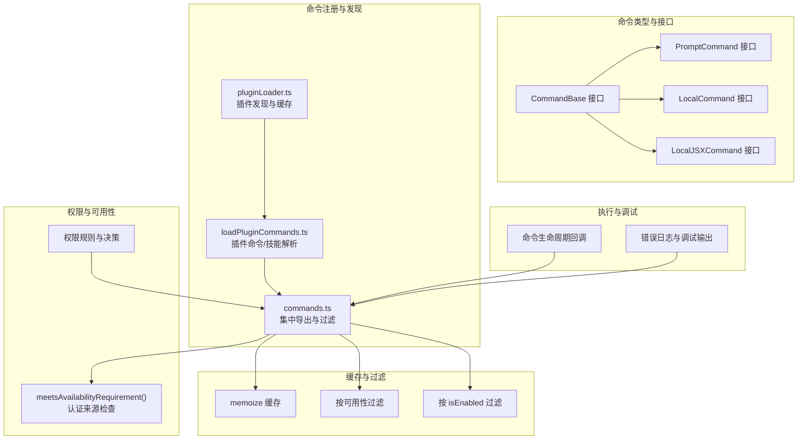
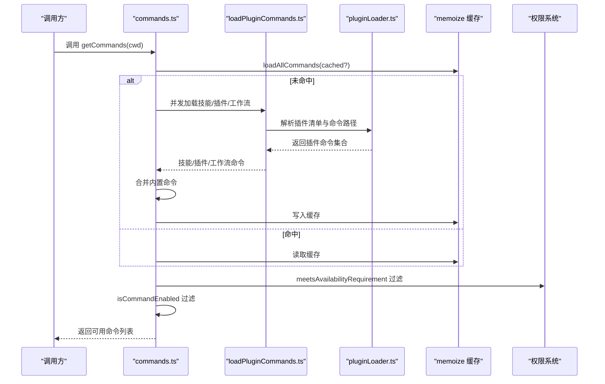
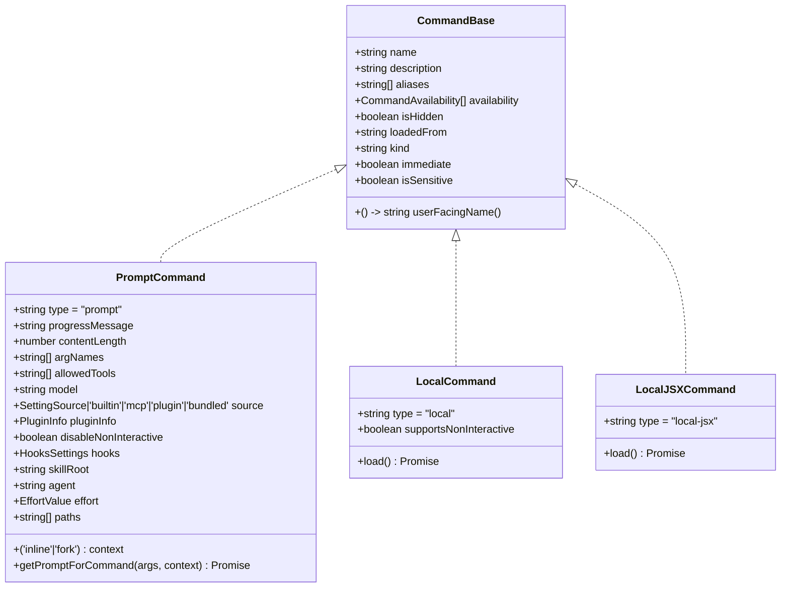
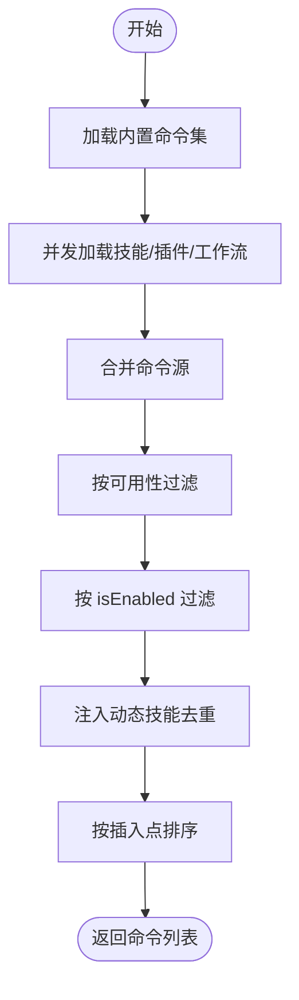
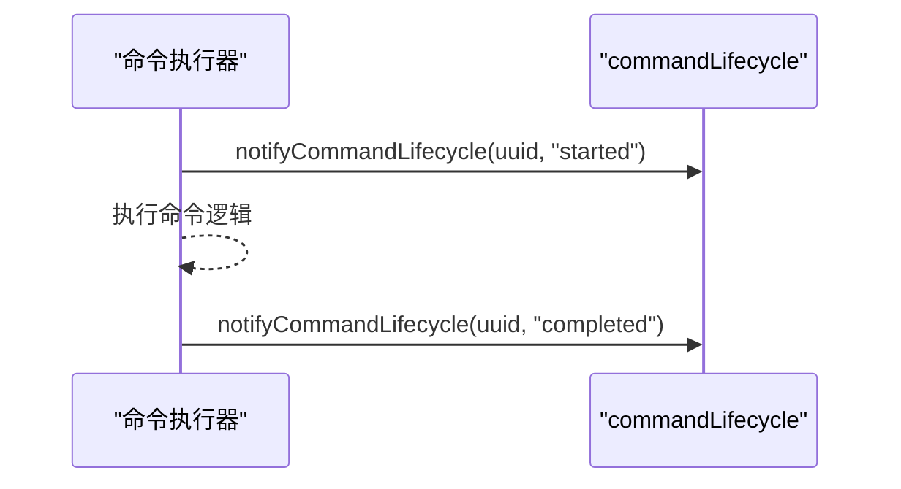
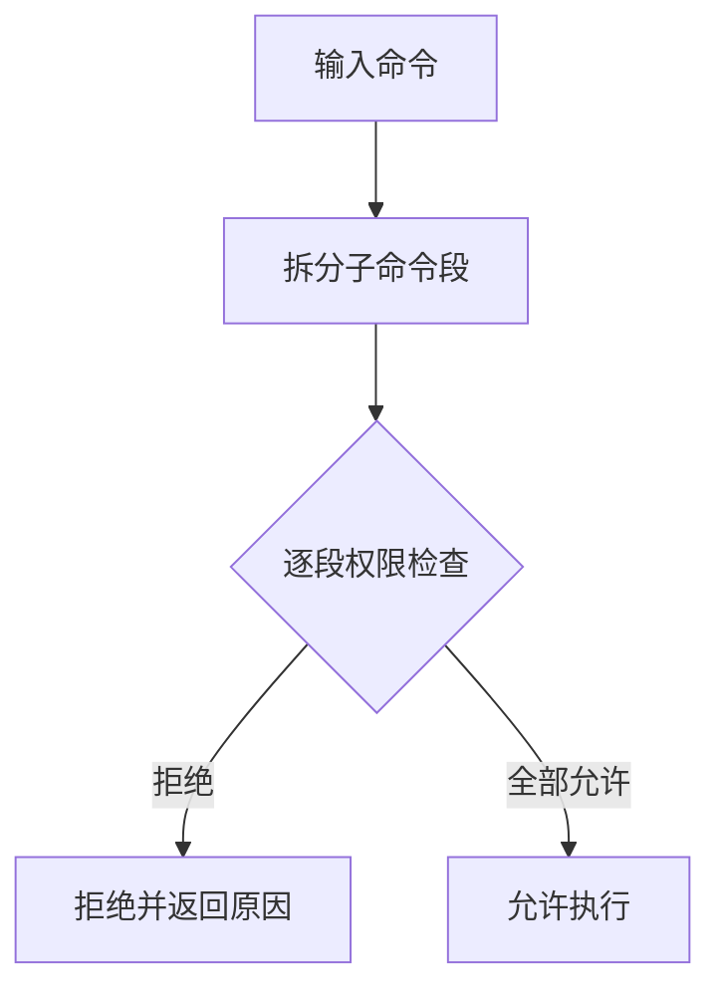
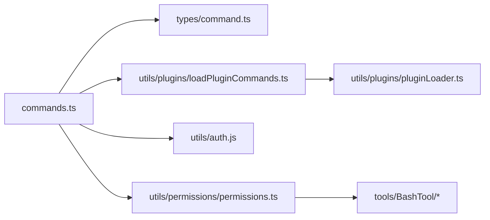

# 命令架构设计

<cite>
**本文引用的文件**
- [src/commands.ts](file://src/commands.ts)
- [src/types/command.ts](file://src/types/command.ts)
- [src/commands/help/index.ts](file://src/commands/help/index.ts)
- [src/commands/context/index.ts](file://src/commands/context/index.ts)
- [src/commands/compact/index.ts](file://src/commands/compact/index.ts)
- [src/commands/init.ts](file://src/commands/init.ts)
- [src/commands/review.ts](file://src/commands/review.ts)
- [src/utils/plugins/loadPluginCommands.ts](file://src/utils/plugins/loadPluginCommands.ts)
- [src/utils/plugins/pluginLoader.ts](file://src/utils/plugins/pluginLoader.ts)
- [src/utils/commandLifecycle.ts](file://src/utils/commandLifecycle.ts)
- [src/hooks/useSkillsChange.ts](file://src/hooks/useSkillsChange.ts)
- [src/tools/BashTool/bashCommandHelpers.ts](file://src/tools/BashTool/bashCommandHelpers.ts)
- [src/tools/BashTool/bashPermissions.ts](file://src/tools/BashTool/bashPermissions.ts)
- [src/utils/permissions/permissions.ts](file://src/utils/permissions/permissions.ts)
- [src/components/TrustDialog/TrustDialog.tsx](file://src/components/TrustDialog/TrustDialog.tsx)
</cite>

## 目录
1. [简介](#简介)
2. [项目结构](#项目结构)
3. [核心组件](#核心组件)
4. [架构总览](#架构总览)
5. [详细组件分析](#详细组件分析)
6. [依赖关系分析](#依赖关系分析)
7. [性能考量](#性能考量)
8. [故障排查指南](#故障排查指南)
9. [结论](#结论)
10. [附录：扩展点与自定义命令开发指南](#附录扩展点与自定义命令开发指南)

## 简介
本文件面向Claude Code命令架构设计，系统化阐述命令系统的整体架构、类型体系、生命周期管理、注册与发现机制、缓存策略、可用性检查与权限控制、执行管道、错误处理与调试支持，并提供扩展点与自定义命令开发指南。目标读者既包括需要快速上手的开发者，也包括希望深入理解实现细节的架构师。

## 项目结构
命令系统围绕“命令类型 + 命令注册与发现 + 缓存与过滤 + 权限与可用性 + 执行与调试”五大维度组织：
- 类型与接口：统一定义命令基类与三类命令形态（prompt、local、local-jsx）
- 注册与发现：集中导出内置命令、动态加载技能与插件命令、工作流命令
- 缓存与过滤：按用户态与环境态过滤命令，提供多层缓存与失效策略
- 权限与可用性：基于认证来源与运行时状态进行可用性检查与条件启用
- 执行与调试：命令生命周期回调、错误日志与调试输出、权限决策链路

图表来源
- [src/types/command.ts:175-216](file://src/types/command.ts#L175-L216)
- [src/commands.ts:258-517](file://src/commands.ts#L258-L517)
- [src/utils/plugins/loadPluginCommands.ts:169-200](file://src/utils/plugins/loadPluginCommands.ts#L169-L200)
- [src/utils/plugins/pluginLoader.ts:1-200](file://src/utils/plugins/pluginLoader.ts#L1-L200)
- [src/utils/commandLifecycle.ts:1-21](file://src/utils/commandLifecycle.ts#L1-L21)

章节来源
- [src/commands.ts:258-517](file://src/commands.ts#L258-L517)
- [src/types/command.ts:175-216](file://src/types/command.ts#L175-L216)

## 核心组件
- 命令类型与接口
  - CommandBase：命令元信息与通用属性（名称、描述、别名、可用性、启用条件、来源、是否对模型可见等）
  - PromptCommand：提示词型命令，负责生成发送给模型的内容块
  - LocalCommand：本地命令，通过异步调用返回文本或压缩结果
  - LocalJSXCommand：本地UI命令，延迟加载渲染React组件
- 命令注册与发现
  - 内置命令集中导出并按特性标志与环境变量条件加载
  - 插件命令与技能通过解析Markdown与Frontmatter动态生成命令
  - 工作流命令在特性开启时动态注入
- 缓存与过滤
  - 多层memoize缓存：命令列表、技能工具列表、斜杠技能列表
  - 按可用性与isEnabled条件实时过滤
  - 动态技能去重与插入位置控制
- 权限与可用性
  - 认证来源可用性检查（claude.ai订阅者、Console直连API用户）
  - 运行时isEnabled条件（特性标志、环境变量、平台状态）
  - 远程/桥接安全命令白名单
- 执行与调试
  - 命令生命周期回调（开始/完成）
  - 统一错误日志与调试输出
  - 权限系统对子命令段粒度决策

章节来源
- [src/types/command.ts:16-216](file://src/types/command.ts#L16-L216)
- [src/commands.ts:408-676](file://src/commands.ts#L408-L676)
- [src/utils/commandLifecycle.ts:1-21](file://src/utils/commandLifecycle.ts#L1-L21)

## 架构总览
命令系统采用“类型统一 + 动态发现 + 缓存过滤 + 权限校验”的分层架构。命令来源包括内置命令、技能目录、插件命令、工作流脚本与MCP技能；运行时根据认证来源、isEnabled条件与动态技能进行最终过滤与排序。

图表来源
- [src/commands.ts:449-517](file://src/commands.ts#L449-L517)
- [src/utils/plugins/loadPluginCommands.ts:169-200](file://src/utils/plugins/loadPluginCommands.ts#L169-L200)
- [src/utils/plugins/pluginLoader.ts:1-200](file://src/utils/plugins/pluginLoader.ts#L1-L200)

## 详细组件分析

### 命令类型与接口规范
- CommandBase
  - 关键字段：name、description、aliases、availability、isEnabled、isHidden、loadedFrom、kind、immediate、isSensitive、userFacingName等
  - 语义：统一承载命令元信息与来源标记
- PromptCommand
  - 关键字段：type='prompt'、progressMessage、contentLength、allowedTools、model、source、pluginInfo、hooks、skillRoot、context、agent、effort、paths、getPromptForCommand
  - 语义：面向模型的提示词命令，支持fork上下文与路径过滤
- LocalCommand
  - 关键字段：type='local'、supportsNonInteractive、load
  - 语义：本地执行命令，返回文本或压缩结果
- LocalJSXCommand
  - 关键字段：type='local-jsx'、load
  - 语义：延迟加载UI命令，渲染React组件

图表来源
- [src/types/command.ts:16-216](file://src/types/command.ts#L16-L216)

章节来源
- [src/types/command.ts:16-216](file://src/types/command.ts#L16-L216)

### 命令注册机制与发现流程
- 内置命令集中导出
  - 通过模块导入集中注册，按特性标志与环境变量条件筛选
  - 使用memoize缓存命令列表，避免重复构建
- 插件命令与技能
  - 解析插件目录中的Markdown文件，提取Frontmatter与内容
  - 支持技能目录与普通命令目录，自动命名空间拼接
  - 并发扫描与加载，支持commandsPaths扩展路径
- 工作流命令
  - 特性开启时动态注入，从工具层创建命令对象
- MCP技能
  - 从外部MCP服务器加载，过滤prompt型且可被模型调用的技能

图表来源
- [src/commands.ts:258-517](file://src/commands.ts#L258-L517)
- [src/utils/plugins/loadPluginCommands.ts:169-200](file://src/utils/plugins/loadPluginCommands.ts#L169-L200)

章节来源
- [src/commands.ts:258-517](file://src/commands.ts#L258-L517)
- [src/utils/plugins/loadPluginCommands.ts:169-200](file://src/utils/plugins/loadPluginCommands.ts#L169-L200)

### 命令生命周期管理
- 生命周期事件
  - started/completed两类状态
  - 通过setCommandLifecycleListener注册监听器
  - 通过notifyCommandLifecycle触发通知
- 调用时机
  - 在命令执行前后触发，便于外部统计与可观测性

图表来源
- [src/utils/commandLifecycle.ts:1-21](file://src/utils/commandLifecycle.ts#L1-L21)

章节来源
- [src/utils/commandLifecycle.ts:1-21](file://src/utils/commandLifecycle.ts#L1-L21)

### 命令可用性检查与权限控制
- 可用性检查
  - meetsAvailabilityRequirement：基于认证来源（claude.ai订阅者、Console直连API用户）判断
  - 运行时每次获取命令列表时重新评估，确保登录状态变化即时生效
- 权限控制
  - 子命令段粒度决策：对复合命令逐段检查权限，任一段拒绝则整体拒绝
  - 规则来源：设置、CLI参数、命令、会话等多源聚合
  - UI交互：信任对话框展示潜在危险与AWS/GCP来源命令，引导用户确认

图表来源
- [src/commands.ts:417-443](file://src/commands.ts#L417-L443)
- [src/tools/BashTool/bashCommandHelpers.ts:84-131](file://src/tools/BashTool/bashCommandHelpers.ts#L84-L131)
- [src/tools/BashTool/bashPermissions.ts:981-1033](file://src/tools/BashTool/bashPermissions.ts#L981-L1033)
- [src/utils/permissions/permissions.ts:107-132](file://src/utils/permissions/permissions.ts#L107-L132)
- [src/components/TrustDialog/TrustDialog.tsx:75-127](file://src/components/TrustDialog/TrustDialog.tsx#L75-L127)

章节来源
- [src/commands.ts:417-443](file://src/commands.ts#L417-L443)
- [src/tools/BashTool/bashCommandHelpers.ts:84-131](file://src/tools/BashTool/bashCommandHelpers.ts#L84-L131)
- [src/tools/BashTool/bashPermissions.ts:981-1033](file://src/tools/BashTool/bashPermissions.ts#L981-L1033)
- [src/utils/permissions/permissions.ts:107-132](file://src/utils/permissions/permissions.ts#L107-L132)
- [src/components/TrustDialog/TrustDialog.tsx:75-127](file://src/components/TrustDialog/TrustDialog.tsx#L75-L127)

### 命令执行管道、错误处理与调试支持
- 执行管道
  - PromptCommand：通过getPromptForCommand生成内容块，交由模型处理
  - LocalCommand：返回文本或压缩结果，支持非交互式执行
  - LocalJSXCommand：延迟加载UI组件，渲染交互界面
- 错误处理
  - 技能/插件加载失败时捕获异常并记录日志，继续提供其他命令
  - 命令查找失败抛出明确错误，包含可用命令列表
- 调试支持
  - 统一的日志与调试输出函数，便于追踪命令来源与加载过程

章节来源
- [src/commands.ts:353-398](file://src/commands.ts#L353-L398)
- [src/commands.ts:688-719](file://src/commands.ts#L688-L719)

### 典型命令示例与类型映射
- help（local-jsx）
  - 类型：local-jsx，延迟加载帮助UI
- context（local-jsx + local）
  - 非交互会话禁用GUI版本，提供纯文本版本
- compact（local）
  - 支持非交互执行，带参数提示
- init（prompt）
  - 根据特性标志选择新旧初始化流程，生成提示词
- review/ultrareview（prompt/local-jsx）
  - review为本地提示词命令；ultrareview为付费远程能力入口

章节来源
- [src/commands/help/index.ts:1-11](file://src/commands/help/index.ts#L1-L11)
- [src/commands/context/index.ts:1-25](file://src/commands/context/index.ts#L1-L25)
- [src/commands/compact/index.ts:1-16](file://src/commands/compact/index.ts#L1-L16)
- [src/commands/init.ts:226-257](file://src/commands/init.ts#L226-L257)
- [src/commands/review.ts:1-58](file://src/commands/review.ts#L1-L58)

## 依赖关系分析
命令系统的关键依赖与耦合关系如下：
- commands.ts对类型定义、插件加载、技能加载、权限与认证工具存在直接依赖
- 插件命令解析依赖Frontmatter解析、Markdown配置加载、插件清单与目录遍历
- 权限系统贯穿命令执行前的决策链路，影响命令可用性与执行许可

图表来源
- [src/commands.ts:156-210](file://src/commands.ts#L156-L210)
- [src/utils/plugins/loadPluginCommands.ts:1-36](file://src/utils/plugins/loadPluginCommands.ts#L1-L36)
- [src/utils/plugins/pluginLoader.ts:1-200](file://src/utils/plugins/pluginLoader.ts#L1-L200)
- [src/utils/permissions/permissions.ts:107-132](file://src/utils/permissions/permissions.ts#L107-L132)

章节来源
- [src/commands.ts:156-210](file://src/commands.ts#L156-L210)
- [src/utils/plugins/loadPluginCommands.ts:1-36](file://src/utils/plugins/loadPluginCommands.ts#L1-L36)
- [src/utils/plugins/pluginLoader.ts:1-200](file://src/utils/plugins/pluginLoader.ts#L1-L200)
- [src/utils/permissions/permissions.ts:107-132](file://src/utils/permissions/permissions.ts#L107-L132)

## 性能考量
- 缓存策略
  - 多层memoize：命令列表、技能工具列表、斜杠技能列表
  - 缓存清理：按需清除命令缓存、插件命令/技能缓存、技能索引缓存
- 并发加载
  - 技能目录、插件命令、工作流命令并发加载，缩短冷启动时间
- 动态技能插入
  - 去重与插入点控制，避免重复与顺序问题
- 远程/桥接安全
  - 预过滤远程安全命令，减少UI闪烁与无效渲染

章节来源
- [src/commands.ts:449-539](file://src/commands.ts#L449-L539)
- [src/hooks/useSkillsChange.ts:1-43](file://src/hooks/useSkillsChange.ts#L1-L43)

## 故障排查指南
- 命令未显示
  - 检查availability与isEnabled条件是否满足
  - 确认是否处于远程模式，使用filterCommandsForRemoteMode预过滤
- 命令加载失败
  - 查看错误日志，确认技能/插件目录可访问
  - 清除命令缓存后重试：clearCommandsCache
- 权限拒绝
  - 检查权限规则来源与匹配情况
  - 对复合命令查看子命令段拒绝原因
- 调试建议
  - 使用调试输出定位命令来源与加载路径
  - 在UI中查看信任对话框，识别潜在危险命令来源

章节来源
- [src/commands.ts:684-754](file://src/commands.ts#L684-L754)
- [src/hooks/useSkillsChange.ts:12-43](file://src/hooks/useSkillsChange.ts#L12-L43)
- [src/utils/commandLifecycle.ts:1-21](file://src/utils/commandLifecycle.ts#L1-L21)

## 结论
命令系统通过统一的类型接口、动态发现与并发加载、多层缓存与实时过滤、严格的可用性与权限控制，以及完善的生命周期与调试支持，实现了高扩展性与高可靠性。对于开发者而言，遵循本文档的扩展点与开发指南，即可快速构建自定义命令并融入现有生态。

## 附录：扩展点与自定义命令开发指南
- 自定义命令类型
  - PromptCommand：适合需要向模型发送复杂提示词的场景
  - LocalCommand：适合本地文本/压缩结果输出
  - LocalJSXCommand：适合需要渲染交互UI的场景
- 开发步骤
  - 定义命令对象，填写基础元信息与类型字段
  - 实现getPromptForCommand（prompt）或call（local/local-jsx）
  - 如需延迟加载，提供load函数返回Promise模块
  - 如需条件启用，实现isEnabled函数
  - 如需限制可用性，设置availability数组
- 注册方式
  - 内置命令：在commands.ts中导入并加入COMMANDS数组
  - 插件命令：在插件目录下编写Markdown，利用Frontmatter声明命令元信息
  - 工作流命令：在特性开启时动态注入
- 最佳实践
  - 明确命令来源（source），便于UI标注与审计
  - 提供清晰的description与argumentHint，提升用户体验
  - 对敏感命令设置isSensitive，避免历史泄露
  - 对可能产生副作用的命令设置disableModelInvocation或isHidden
  - 使用memoize缓存昂贵操作，避免重复计算
  - 在UI中提供必要的权限说明与信任对话框

章节来源
- [src/types/command.ts:16-216](file://src/types/command.ts#L16-L216)
- [src/commands.ts:258-517](file://src/commands.ts#L258-L517)
- [src/utils/plugins/loadPluginCommands.ts:169-200](file://src/utils/plugins/loadPluginCommands.ts#L169-L200)