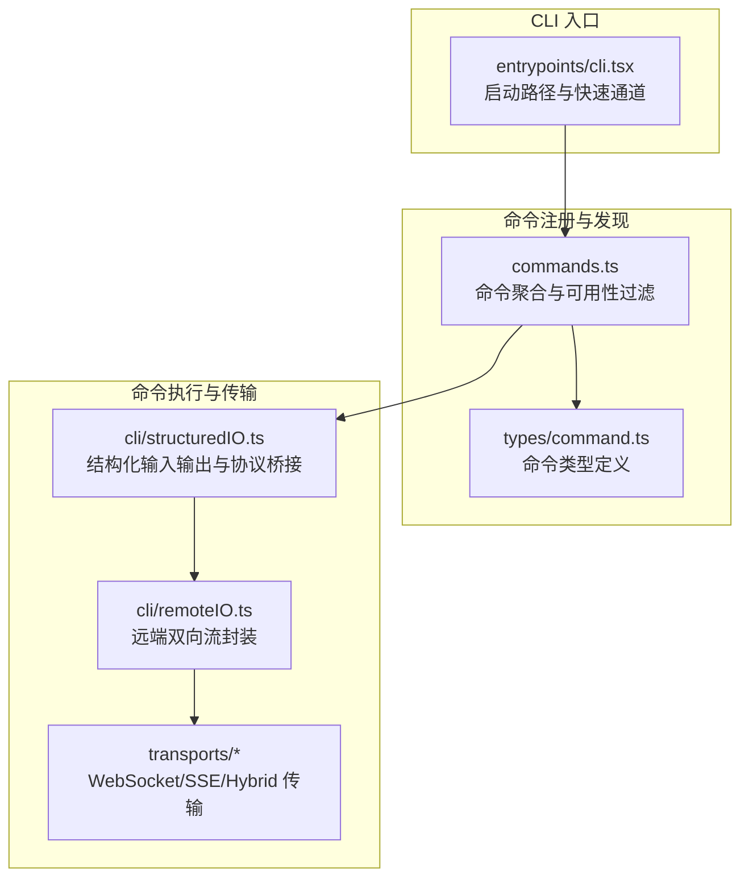
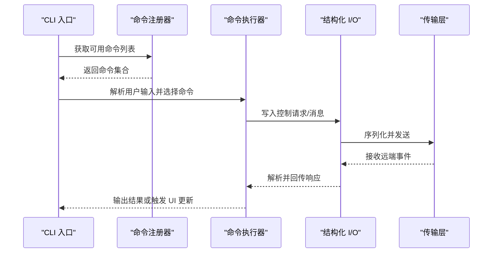
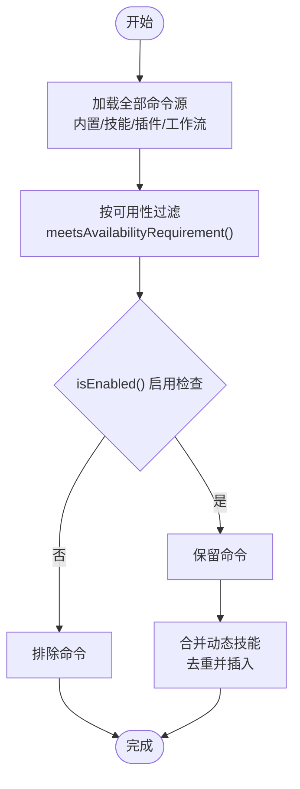
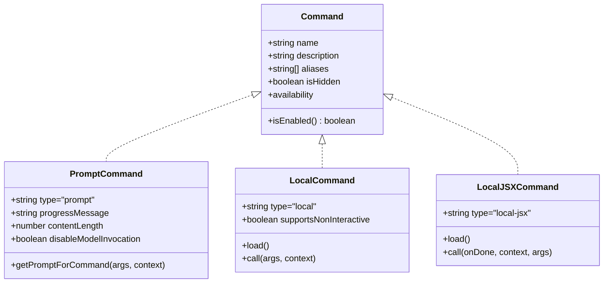
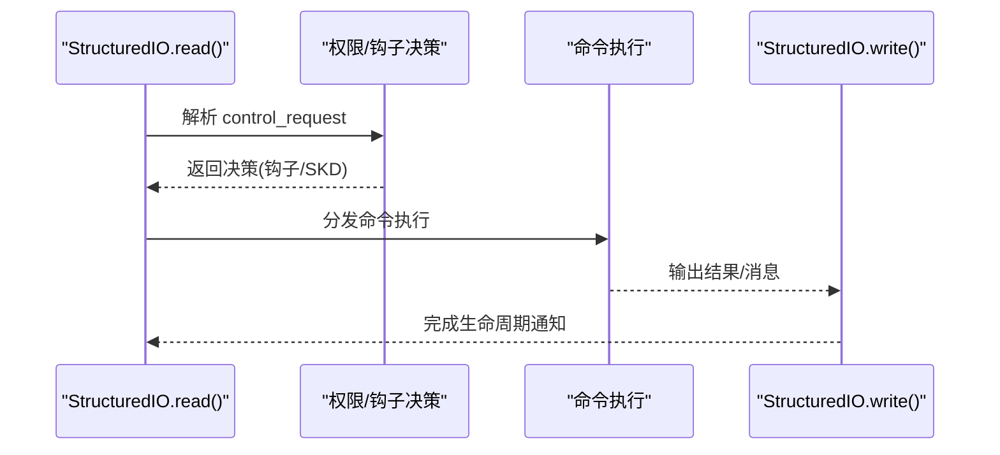
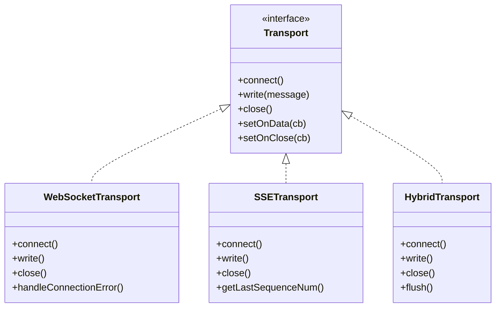
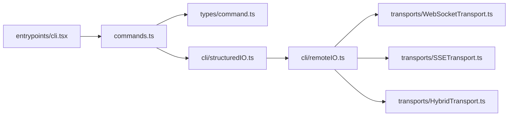

# 命令系统

<cite>
**本文档引用的文件**
- [src/commands.ts](file://src/commands.ts)
- [src/types/command.ts](file://src/types/command.ts)
- [src/cli/structuredIO.ts](file://src/cli/structuredIO.ts)
- [src/cli/remoteIO.ts](file://src/cli/remoteIO.ts)
- [src/cli/transports/WebSocketTransport.ts](file://src/cli/transports/WebSocketTransport.ts)
- [src/cli/transports/SSETransport.ts](file://src/cli/transports/SSETransport.ts)
- [src/cli/transports/HybridTransport.ts](file://src/cli/transports/HybridTransport.ts)
- [src/cli/transports/transportUtils.ts](file://src/cli/transports/transportUtils.ts)
- [src/entrypoints/cli.tsx](file://src/entrypoints/cli.tsx)
- [src/commands/help/index.ts](file://src/commands/help/index.ts)
- [src/commands/session/index.ts](file://src/commands/session/index.ts)
- [src/commands/config/index.ts](file://src/commands/config/index.ts)
</cite>

## 目录
1. [简介](#简介)
2. [项目结构](#项目结构)
3. [核心组件](#核心组件)
4. [架构总览](#架构总览)
5. [详细组件分析](#详细组件分析)
6. [依赖关系分析](#依赖关系分析)
7. [性能考虑](#性能考虑)
8. [故障排查指南](#故障排查指南)
9. [结论](#结论)
10. [附录](#附录)

## 简介
本文件系统性阐述 Claude Code 的命令系统（Slash 命令）：从架构设计到实现原理，覆盖命令注册机制、命令解析与执行管道、内置命令分类与功能、命令扩展开发指南、命令行传输层设计、使用示例与参数说明、以及错误处理与调试机制。目标是帮助开发者快速理解并高效扩展命令系统。

## 项目结构
命令系统由“命令注册与发现”、“命令类型与上下文”、“命令执行与传输层”三部分组成，并通过 CLI 入口统一调度。

**图表来源**
- [src/commands.ts:258-346](file://src/commands.ts#L258-L346)
- [src/types/command.ts:16-206](file://src/types/command.ts#L16-L206)
- [src/cli/structuredIO.ts:135-170](file://src/cli/structuredIO.ts#L135-L170)
- [src/cli/remoteIO.ts:35-51](file://src/cli/remoteIO.ts#L35-L51)
- [src/entrypoints/cli.tsx:33-297](file://src/entrypoints/cli.tsx#L33-L297)

**章节来源**
- [src/commands.ts:258-346](file://src/commands.ts#L258-L346)
- [src/types/command.ts:16-206](file://src/types/command.ts#L16-L206)
- [src/cli/structuredIO.ts:135-170](file://src/cli/structuredIO.ts#L135-L170)
- [src/cli/remoteIO.ts:35-51](file://src/cli/remoteIO.ts#L35-L51)
- [src/entrypoints/cli.tsx:33-297](file://src/entrypoints/cli.tsx#L33-L297)

## 核心组件
- 命令注册与聚合：集中导出所有命令，按可用性与启用状态动态筛选，支持插件、技能目录、工作流等动态源。
- 命令类型与上下文：统一的命令类型定义，支持 prompt、local、local-jsx 三类；提供丰富的上下文与回调接口。
- 结构化 I/O 与权限桥：将命令执行结果与 SDK 协议对接，处理工具权限请求、Hook 回调、MCP 消息等。
- 远程传输层：支持 WebSocket、SSE、Hybrid 三种传输，适配不同运行环境与网络拓扑。
- CLI 启动路径：快速通道优化、特性门控、远端控制桥接入等。

**章节来源**
- [src/commands.ts:258-346](file://src/commands.ts#L258-L346)
- [src/types/command.ts:16-206](file://src/types/command.ts#L16-L206)
- [src/cli/structuredIO.ts:135-170](file://src/cli/structuredIO.ts#L135-L170)
- [src/cli/remoteIO.ts:35-51](file://src/cli/remoteIO.ts#L35-L51)
- [src/entrypoints/cli.tsx:33-297](file://src/entrypoints/cli.tsx#L33-L297)

## 架构总览
命令系统采用“声明式注册 + 动态加载 + 统一协议”的架构。命令在模块层面以统一接口声明，运行时通过聚合器按需加载并注入上下文；执行阶段通过结构化 I/O 与传输层完成跨进程/跨设备通信。

**图表来源**
- [src/commands.ts:476-517](file://src/commands.ts#L476-L517)
- [src/cli/structuredIO.ts:465-467](file://src/cli/structuredIO.ts#L465-L467)
- [src/cli/remoteIO.ts:231-242](file://src/cli/remoteIO.ts#L231-L242)

## 详细组件分析

### 命令注册机制与可用性过滤
- 聚合与缓存：命令通过中央聚合器统一导入与缓存，避免重复加载；动态技能与插件源按目录扫描与懒加载。
- 可用性要求：根据认证与提供商环境进行静态过滤（如 claude.ai 订阅者、Console 直连用户），未满足条件的命令不显示。
- 启用状态：结合 feature flag、环境变量与运行时状态，动态决定命令是否启用。
- 动态插入：动态技能去重后插入到插件技能之后、内置命令之前，保证优先级与一致性。

**图表来源**
- [src/commands.ts:449-469](file://src/commands.ts#L449-L469)
- [src/commands.ts:417-443](file://src/commands.ts#L417-L443)
- [src/commands.ts:476-517](file://src/commands.ts#L476-L517)

**章节来源**
- [src/commands.ts:258-346](file://src/commands.ts#L258-L346)
- [src/commands.ts:417-443](file://src/commands.ts#L417-L443)
- [src/commands.ts:449-469](file://src/commands.ts#L449-L469)
- [src/commands.ts:476-517](file://src/commands.ts#L476-L517)

### 命令类型与上下文
- 类型定义：支持 prompt（可被模型调用）、local（本地执行）、local-jsx（渲染 UI）三类；每类具备不同的执行路径与显示策略。
- 上下文能力：提供工具使用上下文、消息修改器、主题切换、IDE 集成状态、动态 MCP 配置等。
- 描述格式化：对来自不同来源（插件、内置、MCP、打包）的命令描述进行标注，便于用户识别。

**图表来源**
- [src/types/command.ts:16-206](file://src/types/command.ts#L16-L206)

**章节来源**
- [src/types/command.ts:16-206](file://src/types/command.ts#L16-L206)
- [src/commands.ts:728-754](file://src/commands.ts#L728-L754)

### 命令解析与执行管道
- 解析：从结构化 I/O 流中读取消息，过滤 keep_alive、未知类型等；对 control_request 进行权限决策与钩子并发评估。
- 执行：根据命令类型分派至 prompt 展开、local 同步执行或 local-jsx 懒加载渲染；支持非交互模式批处理与队列合并。
- 权限与钩子：并发触发权限钩子与 SDK 提示，谁先返回谁获胜；重复响应与去重保障会话一致性。
- MCP 与工具：支持 MCP 消息转发、工具权限请求、Hook 回调等。

**图表来源**
- [src/cli/structuredIO.ts:333-463](file://src/cli/structuredIO.ts#L333-L463)
- [src/cli/structuredIO.ts:533-659](file://src/cli/structuredIO.ts#L533-L659)

**章节来源**
- [src/cli/structuredIO.ts:135-170](file://src/cli/structuredIO.ts#L135-L170)
- [src/cli/structuredIO.ts:333-463](file://src/cli/structuredIO.ts#L333-L463)
- [src/cli/structuredIO.ts:533-659](file://src/cli/structuredIO.ts#L533-L659)

### 命令行传输层设计
- 远端 I/O 封装：RemoteIO 基于结构化 I/O，支持 WebSocket/SSE/Hybrid 传输，自动心跳与事件写入。
- 传输抽象：Transport 接口统一连接、断线重连、保活、写入策略；WebSocketTransport 支持 ping/pong、睡眠检测；SSETransport 支持事件流与序列号恢复；HybridTransport 写入 HTTP POST，读取 WebSocket。
- URL 选择：根据 URL 协议与环境变量选择合适传输；支持刷新会话令牌头。

**图表来源**
- [src/cli/transports/WebSocketTransport.ts:74-133](file://src/cli/transports/WebSocketTransport.ts#L74-L133)
- [src/cli/transports/SSETransport.ts:162-219](file://src/cli/transports/SSETransport.ts#L162-L219)
- [src/cli/transports/HybridTransport.ts:54-108](file://src/cli/transports/HybridTransport.ts#L54-L108)

**章节来源**
- [src/cli/remoteIO.ts:35-51](file://src/cli/remoteIO.ts#L35-L51)
- [src/cli/transports/WebSocketTransport.ts:74-133](file://src/cli/transports/WebSocketTransport.ts#L74-L133)
- [src/cli/transports/SSETransport.ts:162-219](file://src/cli/transports/SSETransport.ts#L162-L219)
- [src/cli/transports/HybridTransport.ts:54-108](file://src/cli/transports/HybridTransport.ts#L54-L108)
- [src/cli/transports/transportUtils.ts](file://src/cli/transports/transportUtils.ts)

### 内置命令分类与功能
- 会话管理：如 session 命令在远端模式下展示会话 URL 与二维码，便于移动端/网页端接入。
- 配置管理：config 命令打开配置面板，支持设置与主题切换。
- 工具调用：通过权限桥接与 SDK 协议，实现工具权限请求、Hook 回调、MCP 消息转发。
- 技能系统：prompt 类命令作为模型可调用技能，支持禁用模型调用、路径匹配、上下文隔离等。

**章节来源**
- [src/commands/session/index.ts:4-14](file://src/commands/session/index.ts#L4-L14)
- [src/commands/config/index.ts:3-9](file://src/commands/config/index.ts#L3-L9)
- [src/types/command.ts:25-57](file://src/types/command.ts#L25-L57)

### 命令扩展开发指南
- 新增命令：在命令目录下创建模块，导出符合 Command 接口的对象；根据需要选择 prompt/local/local-jsx 类型。
- 上下文与回调：利用 LocalJSXCommandContext 提供的主题、IDE 状态、消息修改器等能力；必要时实现异步钩子与工具权限回调。
- 描述与可见性：为命令提供清晰描述；通过 availability 与 isEnabled 控制可见性与启用状态。
- 动态技能：将技能放置于技能目录，系统会自动发现并注入；注意去重与优先级插入规则。

**章节来源**
- [src/types/command.ts:16-206](file://src/types/command.ts#L16-L206)
- [src/commands.ts:476-517](file://src/commands.ts#L476-L517)

### 命令处理器实现模式与最佳实践
- 模式一：prompt 展开为文本内容，适合模型直接消费的技能。
- 模式二：local 同步执行，适合无 UI 且仅产生文本输出的命令。
- 模式三：local-jsx 懒加载渲染，适合复杂 UI 与交互场景。
- 最佳实践：严格区分命令类型；对敏感参数进行脱敏；合理使用非交互模式与批处理；确保权限请求及时响应与去重。

**章节来源**
- [src/types/command.ts:16-206](file://src/types/command.ts#L16-L206)
- [src/cli/structuredIO.ts:533-659](file://src/cli/structuredIO.ts#L533-L659)

### 使用示例与参数说明
- 示例一：查看帮助
  - 命令：help
  - 作用：显示帮助与可用命令列表
  - 参数：无
- 示例二：会话管理
  - 命令：session 或 remote
  - 作用：在远端模式下展示会话 URL 与二维码
  - 参数：无
- 示例三：配置管理
  - 命令：config 或 settings
  - 作用：打开配置面板
  - 参数：无

**章节来源**
- [src/commands/help/index.ts:3-8](file://src/commands/help/index.ts#L3-L8)
- [src/commands/session/index.ts:4-14](file://src/commands/session/index.ts#L4-L14)
- [src/commands/config/index.ts:3-9](file://src/commands/config/index.ts#L3-L9)

### 错误处理与调试机制
- 结构化 I/O：对未知类型消息静默忽略，对控制响应进行去重与生命周期通知；对解析异常进行退出保护。
- 传输层：断线重连、睡眠检测、保活帧、幂等写入与失败重试；SSE 事件序列号去重与高水位标记。
- 调试：提供诊断日志与调试开关，记录连接状态、重连次数、失败原因与性能指标。

**章节来源**
- [src/cli/structuredIO.ts:333-463](file://src/cli/structuredIO.ts#L333-L463)
- [src/cli/transports/WebSocketTransport.ts:397-554](file://src/cli/transports/WebSocketTransport.ts#L397-L554)
- [src/cli/transports/SSETransport.ts:467-535](file://src/cli/transports/SSETransport.ts#L467-L535)

## 依赖关系分析
命令系统的关键依赖链如下：

**图表来源**
- [src/entrypoints/cli.tsx:33-297](file://src/entrypoints/cli.tsx#L33-L297)
- [src/commands.ts:258-346](file://src/commands.ts#L258-L346)
- [src/types/command.ts:16-206](file://src/types/command.ts#L16-L206)
- [src/cli/structuredIO.ts:135-170](file://src/cli/structuredIO.ts#L135-L170)
- [src/cli/remoteIO.ts:35-51](file://src/cli/remoteIO.ts#L35-L51)
- [src/cli/transports/WebSocketTransport.ts:74-133](file://src/cli/transports/WebSocketTransport.ts#L74-L133)
- [src/cli/transports/SSETransport.ts:162-219](file://src/cli/transports/SSETransport.ts#L162-L219)
- [src/cli/transports/HybridTransport.ts:54-108](file://src/cli/transports/HybridTransport.ts#L54-L108)

**章节来源**
- [src/entrypoints/cli.tsx:33-297](file://src/entrypoints/cli.tsx#L33-L297)
- [src/commands.ts:258-346](file://src/commands.ts#L258-L346)
- [src/types/command.ts:16-206](file://src/types/command.ts#L16-L206)
- [src/cli/structuredIO.ts:135-170](file://src/cli/structuredIO.ts#L135-L170)
- [src/cli/remoteIO.ts:35-51](file://src/cli/remoteIO.ts#L35-L51)
- [src/cli/transports/WebSocketTransport.ts:74-133](file://src/cli/transports/WebSocketTransport.ts#L74-L133)
- [src/cli/transports/SSETransport.ts:162-219](file://src/cli/transports/SSETransport.ts#L162-L219)
- [src/cli/transports/HybridTransport.ts:54-108](file://src/cli/transports/HybridTransport.ts#L54-L108)

## 性能考虑
- 命令加载缓存：命令聚合与技能加载采用 memoize 缓存，减少磁盘与动态导入开销。
- 批处理与合并：非交互模式下支持命令批处理与队列合并，降低往返与解析成本。
- 传输优化：WebSocket 保活与心跳、SSE 事件去重与序列号恢复、Hybrid 写入批量与重试退避。
- 内存与 GC：长会话下定期强制 GC，限制已解决工具 ID 集大小，避免内存膨胀。

**章节来源**
- [src/commands.ts:449-469](file://src/commands.ts#L449-L469)
- [src/cli/structuredIO.ts:135-170](file://src/cli/structuredIO.ts#L135-L170)
- [src/cli/transports/WebSocketTransport.ts:697-799](file://src/cli/transports/WebSocketTransport.ts#L697-L799)
- [src/cli/transports/SSETransport.ts:568-653](file://src/cli/transports/SSETransport.ts#L568-L653)
- [src/cli/transports/HybridTransport.ts:117-133](file://src/cli/transports/HybridTransport.ts#L117-L133)

## 故障排查指南
- 命令不可见：检查 availability 与 isEnabled；确认特性门与环境变量；验证动态技能去重逻辑。
- 传输连接失败：查看断线重连日志、睡眠检测、保活帧与代理超时；确认会话令牌刷新。
- 权限请求卡住：检查钩子与 SDK 提示竞争结果；确认重复响应去重与生命周期通知。
- 输入解析错误：关注结构化 I/O 对未知类型的处理与退出保护；检查消息键名兼容性。

**章节来源**
- [src/commands.ts:417-443](file://src/commands.ts#L417-L443)
- [src/cli/transports/WebSocketTransport.ts:397-554](file://src/cli/transports/WebSocketTransport.ts#L397-L554)
- [src/cli/structuredIO.ts:333-463](file://src/cli/structuredIO.ts#L333-L463)

## 结论
命令系统通过“声明式注册 + 动态加载 + 统一协议 + 多传输适配”的设计，在保证扩展性的同时兼顾了性能与可靠性。开发者可基于现有类型与上下文快速扩展命令，配合传输层与权限桥实现跨设备、跨平台的一致体验。

## 附录
- 快速通道：CLI 入口对版本查询、系统提示导出、远端控制桥等常见场景提供零依赖快速路径。
- 远端安全：提供远端安全命令白名单与桥接安全命令判定，确保移动端/网页端输入的安全可控。

**章节来源**
- [src/entrypoints/cli.tsx:33-297](file://src/entrypoints/cli.tsx#L33-L297)
- [src/commands.ts:619-676](file://src/commands.ts#L619-L676)