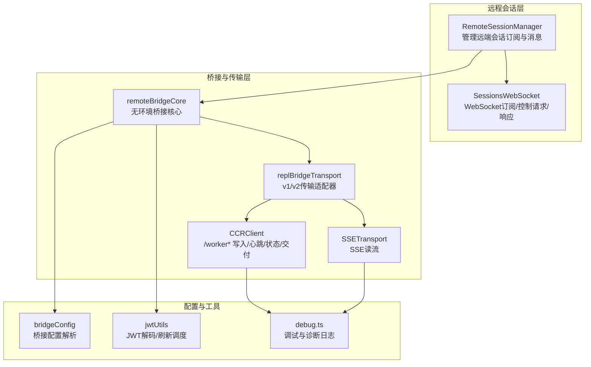
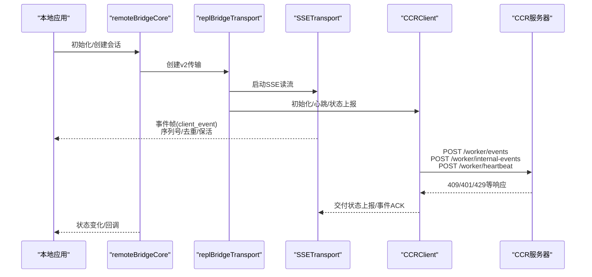
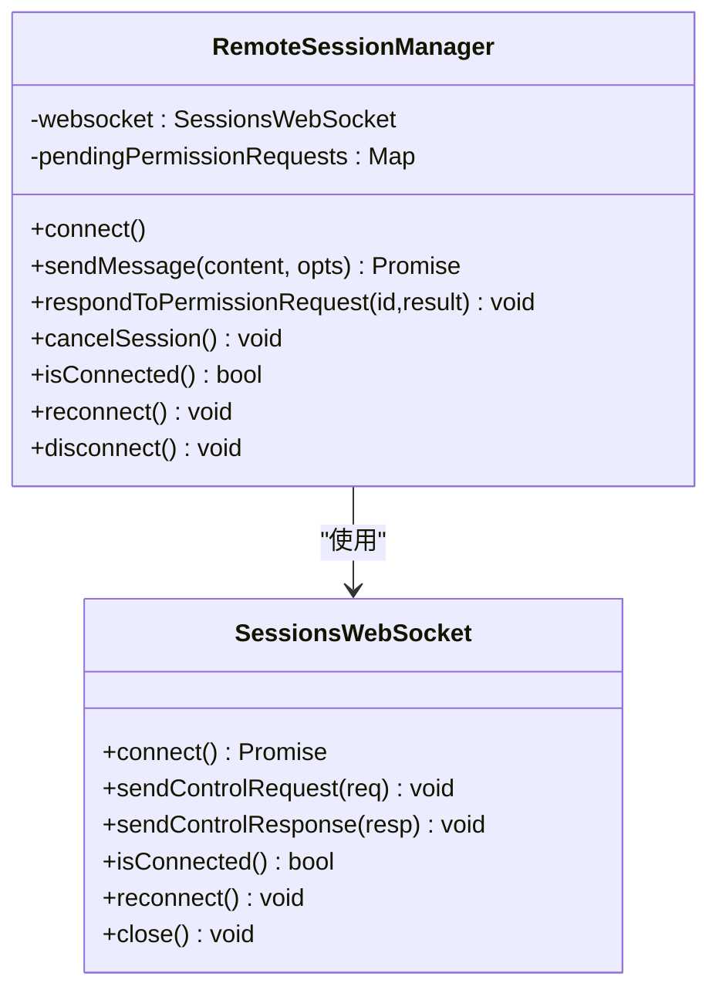
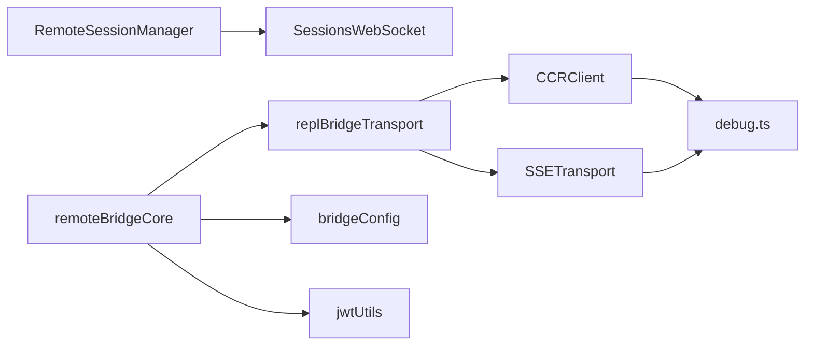
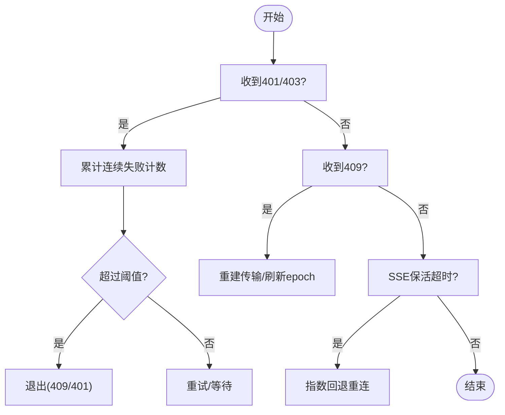

# CCR客户端

<cite>
**本文引用的文件**
- [RemoteSessionManager.ts](file://src/remote/RemoteSessionManager.ts)
- [SessionsWebSocket.ts](file://src/remote/SessionsWebSocket.ts)
- [replBridgeTransport.ts](file://src/bridge/replBridgeTransport.ts)
- [remoteBridgeCore.ts](file://src/bridge/remoteBridgeCore.ts)
- [ccrClient.ts](file://src/cli/transports/ccrClient.ts)
- [SSETransport.ts](file://src/cli/transports/SSETransport.ts)
- [bridgeConfig.ts](file://src/bridge/bridgeConfig.ts)
- [jwtUtils.ts](file://src/bridge/jwtUtils.ts)
- [debug.ts](file://src/utils/debug.ts)
- [WebSocketTransport.ts](file://src/cli/transports/WebSocketTransport.ts)
</cite>

## 目录
1. [简介](#简介)
2. [项目结构](#项目结构)
3. [核心组件](#核心组件)
4. [架构总览](#架构总览)
5. [详细组件分析](#详细组件分析)
6. [依赖关系分析](#依赖关系分析)
7. [性能考量](#性能考量)
8. [故障排查指南](#故障排查指南)
9. [结论](#结论)
10. [附录](#附录)

## 简介
本技术文档面向Claude Code的中央控制室（Central Control Room，简称CCR）客户端，系统性阐述其设计目标、通信协议、数据交换格式、身份认证与会话管理、状态同步机制、请求-响应与事件通知流程、重连与超时策略、错误恢复、配置参数、性能调优与监控方法，并补充安全与审计要点及在集群与分布式协调中的应用模式。

## 项目结构
围绕CCR客户端的关键模块，主要由以下层次构成：
- 远程会话管理层：负责与远端会话建立订阅、发送用户消息、处理权限请求与取消、中断控制等。
- 传输层：提供两类路径
  - v1：基于HybridTransport（WebSocket读+HTTP写）的Session-Ingress通道
  - v2：基于SSETransport（读）+ CCRClient（写）的CCR v2 /worker/* 协议
- 桥接核心：在“无环境”模式下直接连接到会话入口，完成会话创建、凭据获取、v2传输初始化、心跳与状态上报、刷新与重建等。
- 配置与工具：桥接配置解析、JWT解码与刷新调度、调试与诊断日志等。

图表来源
- [RemoteSessionManager.ts:95-324](file://src/remote/RemoteSessionManager.ts#L95-L324)
- [SessionsWebSocket.ts:82-404](file://src/remote/SessionsWebSocket.ts#L82-L404)
- [remoteBridgeCore.ts:140-760](file://src/bridge/remoteBridgeCore.ts#L140-L760)
- [replBridgeTransport.ts:119-371](file://src/bridge/replBridgeTransport.ts#L119-L371)
- [SSETransport.ts:162-690](file://src/cli/transports/SSETransport.ts#L162-L690)
- [ccrClient.ts:262-800](file://src/cli/transports/ccrClient.ts#L262-L800)
- [bridgeConfig.ts:17-48](file://src/bridge/bridgeConfig.ts#L17-L48)
- [jwtUtils.ts:1-163](file://src/bridge/jwtUtils.ts#L1-L163)
- [debug.ts:203-228](file://src/utils/debug.ts#L203-L228)

章节来源
- [RemoteSessionManager.ts:95-324](file://src/remote/RemoteSessionManager.ts#L95-L324)
- [SessionsWebSocket.ts:82-404](file://src/remote/SessionsWebSocket.ts#L82-L404)
- [remoteBridgeCore.ts:140-760](file://src/bridge/remoteBridgeCore.ts#L140-L760)
- [replBridgeTransport.ts:119-371](file://src/bridge/replBridgeTransport.ts#L119-L371)
- [SSETransport.ts:162-690](file://src/cli/transports/SSETransport.ts#L162-L690)
- [ccrClient.ts:262-800](file://src/cli/transports/ccrClient.ts#L262-L800)
- [bridgeConfig.ts:17-48](file://src/bridge/bridgeConfig.ts#L17-L48)
- [jwtUtils.ts:1-163](file://src/bridge/jwtUtils.ts#L1-L163)
- [debug.ts:203-228](file://src/utils/debug.ts#L203-L228)

## 核心组件
- RemoteSessionManager：封装远端会话的订阅、消息发送、权限请求/响应、中断控制与连接状态管理。
- SessionsWebSocket：基于WebSocket的订阅端，负责认证、消息收发、心跳、断线重连与关闭。
- CCRClient：面向CCR v2协议的写入端，负责事件批量上传、内部事件、交付状态上报、心跳、状态上报与epoch不匹配处理。
- SSETransport：基于Server-Sent Events的读取端，负责事件流解析、序列号跟踪、去重、保活检测与指数回退重连。
- remoteBridgeCore：无环境桥接核心，负责会话创建、凭据获取、v2传输初始化、JWT刷新与重建、状态变化与清理。
- replBridgeTransport：v1/v2传输适配器，统一上层调用接口，屏蔽底层差异。
- bridgeConfig：桥接配置解析，支持开发覆盖与OAuth令牌来源。
- jwtUtils：JWT解码与刷新调度，避免过期导致的不可恢复失败。
- debug.ts：统一调试与诊断日志输出，支持过滤、缓冲与符号链接追踪最新日志。

章节来源
- [RemoteSessionManager.ts:95-324](file://src/remote/RemoteSessionManager.ts#L95-L324)
- [SessionsWebSocket.ts:82-404](file://src/remote/SessionsWebSocket.ts#L82-L404)
- [ccrClient.ts:262-800](file://src/cli/transports/ccrClient.ts#L262-L800)
- [SSETransport.ts:162-690](file://src/cli/transports/SSETransport.ts#L162-L690)
- [remoteBridgeCore.ts:140-760](file://src/bridge/remoteBridgeCore.ts#L140-L760)
- [replBridgeTransport.ts:119-371](file://src/bridge/replBridgeTransport.ts#L119-L371)
- [bridgeConfig.ts:17-48](file://src/bridge/bridgeConfig.ts#L17-L48)
- [jwtUtils.ts:1-163](file://src/bridge/jwtUtils.ts#L1-L163)
- [debug.ts:203-228](file://src/utils/debug.ts#L203-L228)

## 架构总览
下图展示了从本地到CCR的完整数据通路与控制流，包括v2写入（/worker/*）、SSE读取（/worker/events/stream）、以及权限请求/响应的双向交互。

图表来源
- [remoteBridgeCore.ts:140-760](file://src/bridge/remoteBridgeCore.ts#L140-L760)
- [replBridgeTransport.ts:119-371](file://src/bridge/replBridgeTransport.ts#L119-L371)
- [SSETransport.ts:162-690](file://src/cli/transports/SSETransport.ts#L162-L690)
- [ccrClient.ts:262-800](file://src/cli/transports/ccrClient.ts#L262-L800)

## 详细组件分析

### RemoteSessionManager：远端会话管理
- 职责
  - 建立WebSocket订阅，接收SDK消息与控制请求/响应
  - 通过HTTP POST向远端会话发送用户消息
  - 处理权限请求（can_use_tool），并允许应答或取消
  - 支持中断控制请求与连接状态查询
- 关键流程
  - 订阅建立后，消息分发至回调；控制请求进入权限处理分支
  - 权限请求缓存，应答时移除并发送控制响应
  - 连接断开/重连/错误回调透传给上层

图表来源
- [RemoteSessionManager.ts:95-324](file://src/remote/RemoteSessionManager.ts#L95-L324)
- [SessionsWebSocket.ts:82-404](file://src/remote/SessionsWebSocket.ts#L82-L404)

章节来源
- [RemoteSessionManager.ts:95-324](file://src/remote/RemoteSessionManager.ts#L95-L324)
- [SessionsWebSocket.ts:82-404](file://src/remote/SessionsWebSocket.ts#L82-L404)

### SessionsWebSocket：WebSocket订阅与控制
- 协议与认证
  - 使用Bearer Token进行头部认证
  - 订阅URL：wss://.../v1/sessions/ws/{sessionId}/subscribe?organization_uuid=...
- 控制消息
  - 发送/接收控制请求（如interrupt）
  - 发送/接收控制响应（权限应答）
- 断线与重连
  - 固定最大尝试次数与固定延迟
  - 特殊关闭码（如4001/4003）采用有限重试或永久关闭
  - 心跳定时器维持连接活性

章节来源
- [SessionsWebSocket.ts:82-404](file://src/remote/SessionsWebSocket.ts#L82-L404)

### CCRClient：CCR v2写入端
- 生命周期与状态
  - 初始化：PUT /worker，设置worker状态为idle，启动心跳
  - 心跳：周期性POST /worker/heartbeat，带epoch与session_id
  - 状态上报：PUT /worker，携带requires_action_details
  - 元数据上报：PUT /worker，携带external_metadata
- 事件上传
  - 客户端事件：POST /worker/events（批量，最大100条/批）
  - 内部事件：POST /worker/internal-events（用于会话恢复）
  - 交付状态：POST /worker/events/delivery（received/processing/processed）
- 错误与恢复
  - 409：epoch不匹配，触发退出（进程或在进程内优雅关闭）
  - 401/403：连续失败阈值保护，避免无效轮询
  - 429：尊重Retry-After回退

章节来源
- [ccrClient.ts:262-800](file://src/cli/transports/ccrClient.ts#L262-L800)

### SSETransport：SSE读取与保活
- 事件解析
  - 解析SSE帧，提取event/id/data字段
  - 仅处理client_event类型事件，其他类型记录诊断
- 序列号与去重
  - 维护lastSequenceNum与seenSequenceNums，防止重复处理
- 保活与重连
  - 45秒静默超时触发重连
  - 指数回退（上限30秒），总预算10分钟
  - Last-Event-ID与from_sequence_num支持断点续拉

章节来源
- [SSETransport.ts:162-690](file://src/cli/transports/SSETransport.ts#L162-L690)

### remoteBridgeCore：无环境桥接核心
- 会话生命周期
  - 创建会话（POST /v1/code/sessions）
  - 获取桥接凭据（POST /v1/code/sessions/{id}/bridge）
  - 初始化v2传输（SSETransport + CCRClient）
- 刷新与重建
  - JWT刷新调度（距离expires_in提前5分钟）
  - 401自动恢复：刷新OAuth后重建传输
  - epoch变更：每次/bridge调用都会提升worker_epoch，必须重建
- 状态与清理
  - 连接/断开/超时/失败事件的诊断与埋点
  - 优雅关闭：写入结果消息、归档会话、清理资源

章节来源
- [remoteBridgeCore.ts:140-760](file://src/bridge/remoteBridgeCore.ts#L140-L760)

### replBridgeTransport：v1/v2传输适配器
- 统一接口
  - write/writeBatch/close/isConnectedStatus/getStateLabel/setOnData/setOnClose/setOnConnect/connect
  - getLastSequenceNum/droppedBatchCount/reportState/reportMetadata/reportDelivery/flush
- v2特性
  - SSE读流与CCRClient写入并行
  - epoch不匹配时关闭并通知上层重建
  - outboundOnly模式仅写入不读取

章节来源
- [replBridgeTransport.ts:119-371](file://src/bridge/replBridgeTransport.ts#L119-L371)

### 配置与工具
- 桥接配置
  - 开发覆盖：CLAUDE_BRIDGE_OAUTH_TOKEN/CLAUDE_BRIDGE_BASE_URL
  - 运行时：OAuth存储与生产配置回退
- JWT工具
  - 解码payload（剥离前缀）、按expires_in调度刷新
- 调试与诊断
  - 日志级别、过滤、缓冲写入、最新日志符号链接

章节来源
- [bridgeConfig.ts:17-48](file://src/bridge/bridgeConfig.ts#L17-L48)
- [jwtUtils.ts:1-163](file://src/bridge/jwtUtils.ts#L1-L163)
- [debug.ts:203-228](file://src/utils/debug.ts#L203-L228)

## 依赖关系分析
- RemoteSessionManager依赖SessionsWebSocket进行订阅与控制
- remoteBridgeCore同时依赖replBridgeTransport、SSETransport与CCRClient
- CCRClient与SSETransport分别负责写入与读取，二者通过transport回调联动
- jwtUtils与bridgeConfig贯穿于remoteBridgeCore的初始化与刷新流程

图表来源
- [RemoteSessionManager.ts:95-324](file://src/remote/RemoteSessionManager.ts#L95-L324)
- [remoteBridgeCore.ts:140-760](file://src/bridge/remoteBridgeCore.ts#L140-L760)
- [replBridgeTransport.ts:119-371](file://src/bridge/replBridgeTransport.ts#L119-L371)
- [SSETransport.ts:162-690](file://src/cli/transports/SSETransport.ts#L162-L690)
- [ccrClient.ts:262-800](file://src/cli/transports/ccrClient.ts#L262-L800)
- [bridgeConfig.ts:17-48](file://src/bridge/bridgeConfig.ts#L17-L48)
- [jwtUtils.ts:1-163](file://src/bridge/jwtUtils.ts#L1-L163)
- [debug.ts:203-228](file://src/utils/debug.ts#L203-L228)

## 性能考量
- 批量与合并
  - CCRClient对客户端事件采用批量上传（最大100条/批），降低HTTP开销
  - SSETransport对text_delta进行100ms窗口合并，减少事件风暴
- 心跳与保活
  - CCRClient心跳间隔默认20秒，配合服务端TTL（60秒）保证容器租约
  - SSETransport保活超时45秒，避免代理空闲超时导致的静默断开
- 重连与背压
  - SSETransport指数回退上限30秒，总预算10分钟，避免雪崩
  - WebSocketTransport对瞬时断开进行内部重试，避免上层感知抖动
- 序列号与去重
  - SSETransport维护seenSequenceNums集合，防止重复处理与内存膨胀

章节来源
- [ccrClient.ts:359-436](file://src/cli/transports/ccrClient.ts#L359-L436)
- [SSETransport.ts:16-33](file://src/cli/transports/SSETransport.ts#L16-L33)
- [SSETransport.ts:470-535](file://src/cli/transports/SSETransport.ts#L470-L535)
- [WebSocketTransport.ts:520-554](file://src/cli/transports/WebSocketTransport.ts#L520-L554)

## 故障排查指南
- 常见错误与处理
  - 401/403：连续失败阈值保护，超过阈值退出；若token已过期，直接退出
  - 409：epoch不匹配，必须重建传输；replBridgeTransport映射为4090
  - 4001：会话不存在（可能因压缩短暂），有限重试后仍失败则关闭
  - SSE liveness超时：45秒无事件触发重连
- 诊断与日志
  - 使用logForDebugging输出时间戳、级别与消息；支持过滤与缓冲写入
  - 通过CLAUDE_CODE_DEBUG_LOG_LEVEL调整最小日志级别
  - 最新日志文件通过符号链接指向当前会话日志
- 重连策略
  - WebSocketTransport：指数回退，总预算10分钟；瞬时断开内部重试
  - SSETransport：指数回退，上限30秒，总预算10分钟
  - remoteBridgeCore：JWT刷新与401恢复，重建传输并保留序列号高水位

图表来源
- [ccrClient.ts:556-642](file://src/cli/transports/ccrClient.ts#L556-L642)
- [SSETransport.ts:470-535](file://src/cli/transports/SSETransport.ts#L470-L535)
- [SessionsWebSocket.ts:234-288](file://src/remote/SessionsWebSocket.ts#L234-L288)

章节来源
- [ccrClient.ts:556-642](file://src/cli/transports/ccrClient.ts#L556-L642)
- [SSETransport.ts:470-535](file://src/cli/transports/SSETransport.ts#L470-L535)
- [SessionsWebSocket.ts:234-288](file://src/remote/SessionsWebSocket.ts#L234-L288)
- [WebSocketTransport.ts:520-554](file://src/cli/transports/WebSocketTransport.ts#L520-L554)
- [debug.ts:203-228](file://src/utils/debug.ts#L203-L228)

## 结论
该CCR客户端以RemoteSessionManager与SessionsWebSocket为基础，结合remoteBridgeCore与replBridgeTransport，实现了v1/v2双栈传输能力。通过SSETransport与CCRClient的分工协作，既保证了事件流的可靠读取，又确保了写入端的批量与幂等。配合JWT刷新、序列号去重、保活与指数回退等机制，系统在复杂网络环境下具备良好的鲁棒性与可观测性。

## 附录

### 通信协议与数据交换格式
- WebSocket订阅
  - 认证：Authorization: Bearer <token>
  - 订阅URL：/v1/sessions/ws/{sessionId}/subscribe?organization_uuid=...
  - 控制消息：control_request/control_response/control_cancel_request
- SSE读取
  - 事件类型：client_event
  - 字段：event_id、sequence_num、event_type、source、payload、created_at
- CCR v2写入
  - /worker：PUT（状态/元数据）
  - /worker/events：POST（批量客户端事件）
  - /worker/internal-events：POST（内部事件）
  - /worker/events/delivery：POST（交付状态）
  - /worker/heartbeat：POST（心跳）

章节来源
- [SessionsWebSocket.ts:74-82](file://src/remote/SessionsWebSocket.ts#L74-L82)
- [SSETransport.ts:136-143](file://src/cli/transports/SSETransport.ts#L136-L143)
- [ccrClient.ts:346-436](file://src/cli/transports/ccrClient.ts#L346-L436)

### 身份认证与会话管理
- OAuth令牌来源：开发覆盖优先，其次OAuth存储
- 会话创建：POST /v1/code/sessions
- 桥接凭据：POST /v1/code/sessions/{id}/bridge（返回worker_jwt/worker_epoch/api_base_url）
- JWT刷新：距离expires_in提前5分钟调度，401时主动刷新并重建传输

章节来源
- [bridgeConfig.ts:17-48](file://src/bridge/bridgeConfig.ts#L17-L48)
- [remoteBridgeCore.ts:173-211](file://src/bridge/remoteBridgeCore.ts#L173-L211)
- [jwtUtils.ts:147-163](file://src/bridge/jwtUtils.ts#L147-L163)

### 请求-响应与事件通知流程
- 用户消息发送：RemoteSessionManager.sendMessage → HTTP POST（远端会话）
- 权限请求：SessionsWebSocket接收control_request → RemoteSessionManager缓存 → 上层应答 → 发送control_response
- 事件通知：SSETransport解析client_event → 上层回调；CCRClient上报交付状态

章节来源
- [RemoteSessionManager.ts:219-242](file://src/remote/RemoteSessionManager.ts#L219-L242)
- [RemoteSessionManager.ts:146-214](file://src/remote/RemoteSessionManager.ts#L146-L214)
- [SSETransport.ts:425-465](file://src/cli/transports/SSETransport.ts#L425-L465)
- [ccrClient.ts:443-446](file://src/cli/transports/ccrClient.ts#L443-L446)

### 重连策略与超时处理
- WebSocketTransport：瞬时断开内部重试；指数回退，总预算10分钟
- SSETransport：指数回退，上限30秒；保活超时45秒
- SessionsWebSocket：固定最大尝试次数与延迟；特殊关闭码有限重试

章节来源
- [WebSocketTransport.ts:520-554](file://src/cli/transports/WebSocketTransport.ts#L520-L554)
- [SSETransport.ts:470-535](file://src/cli/transports/SSETransport.ts#L470-L535)
- [SessionsWebSocket.ts:274-288](file://src/remote/SessionsWebSocket.ts#L274-L288)

### 错误恢复机制
- epoch不匹配：立即退出（进程或在进程内关闭），上层重建传输
- 401/403：连续失败阈值保护；过期JWT直接退出
- 4001：会话不存在（压缩期间），有限重试
- SSE liveness超时：重连并恢复序列号

章节来源
- [ccrClient.ts:586-614](file://src/cli/transports/ccrClient.ts#L586-L614)
- [SSETransport.ts:542-550](file://src/cli/transports/SSETransport.ts#L542-L550)
- [SessionsWebSocket.ts:255-272](file://src/remote/SessionsWebSocket.ts#L255-L272)

### 配置参数与调优建议
- 日志级别：CLAUDE_CODE_DEBUG_LOG_LEVEL（verbose/debug/info/warn/error）
- 调试输出：--debug/--debug-file/--debug-to-stderr
- SSE重连：RECONNECT_BASE_DELAY_MS/RECONNECT_MAX_DELAY_MS/RECONNECT_GIVE_UP_MS
- 心跳间隔：DEFAULT_HEARTBEAT_INTERVAL_MS（默认20秒）
- 批量大小：/worker/events最大100条/批
- 保活超时：LIVENESS_TIMEOUT_MS（默认45秒）

章节来源
- [debug.ts:203-228](file://src/utils/debug.ts#L203-L228)
- [SSETransport.ts:16-21](file://src/cli/transports/SSETransport.ts#L16-L21)
- [ccrClient.ts:32-42](file://src/cli/transports/ccrClient.ts#L32-L42)
- [ccrClient.ts:359-385](file://src/cli/transports/ccrClient.ts#L359-L385)

### 监控与审计
- 诊断埋点：连接/断开/重连/超时/错误等事件分类与统计
- 最新日志：符号链接指向当前会话日志，便于快速定位
- 409/401/429等关键状态码的分类与告警

章节来源
- [remoteBridgeCore.ts:380-466](file://src/bridge/remoteBridgeCore.ts#L380-L466)
- [debug.ts:230-253](file://src/utils/debug.ts#L230-L253)

### 安全考虑
- 数据加密：TLS与mTLS选项在WebSocket与SSE中启用
- 访问控制：Bearer Token认证，支持Cookie认证场景下的头清理
- 审计日志：统一调试与诊断日志输出，支持过滤与缓冲写入
- 令牌管理：JWT解码与刷新，避免过期导致的不可恢复失败

章节来源
- [SessionsWebSocket.ts:13-15](file://src/remote/SessionsWebSocket.ts#L13-L15)
- [SSETransport.ts:254-266](file://src/cli/transports/SSETransport.ts#L254-L266)
- [jwtUtils.ts:21-31](file://src/bridge/jwtUtils.ts#L21-L31)
- [debug.ts:203-228](file://src/utils/debug.ts#L203-L228)

### 集群与分布式协调应用模式
- 多会话并发：通过per-instance getAuthToken避免进程全局冲突
- 无环境桥接：直接创建会话与桥接凭据，绕过环境工作分派层
- epoch一致性：每次/bridge调用提升worker_epoch，确保多实例间的一致性
- 镜像模式：outboundOnly仅写入，适合转发事件但不接收提示的场景

章节来源
- [replBridgeTransport.ts:165-181](file://src/bridge/replBridgeTransport.ts#L165-L181)
- [remoteBridgeCore.ts:477-527](file://src/bridge/remoteBridgeCore.ts#L477-L527)
- [remoteBridgeCore.ts:748-752](file://src/bridge/remoteBridgeCore.ts#L748-L752)