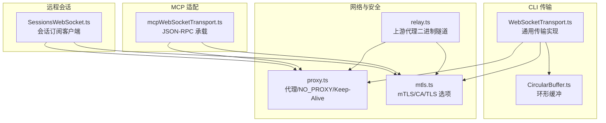
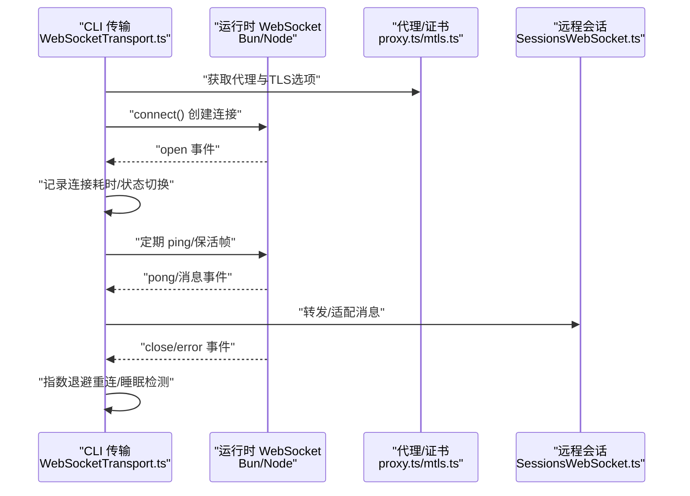
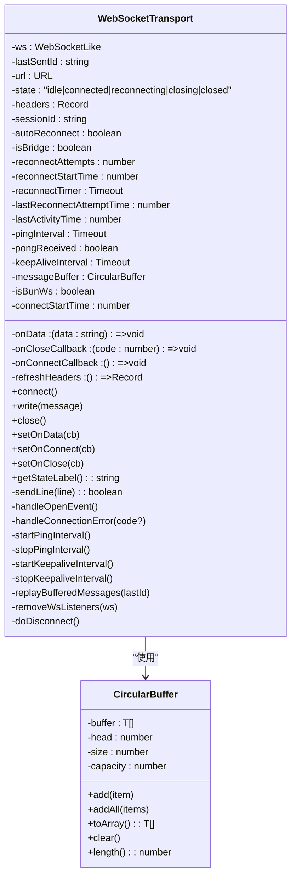
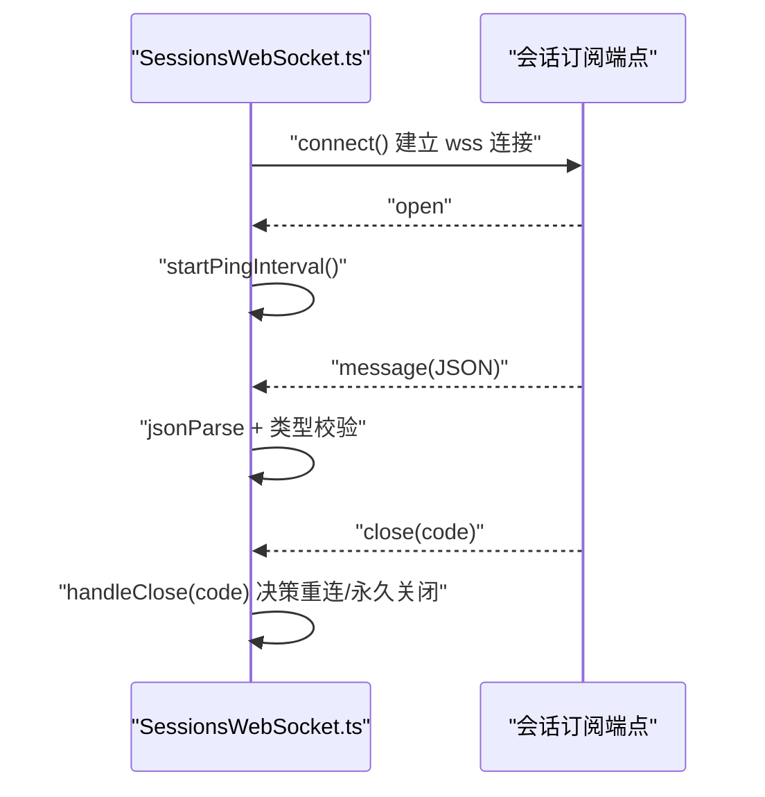
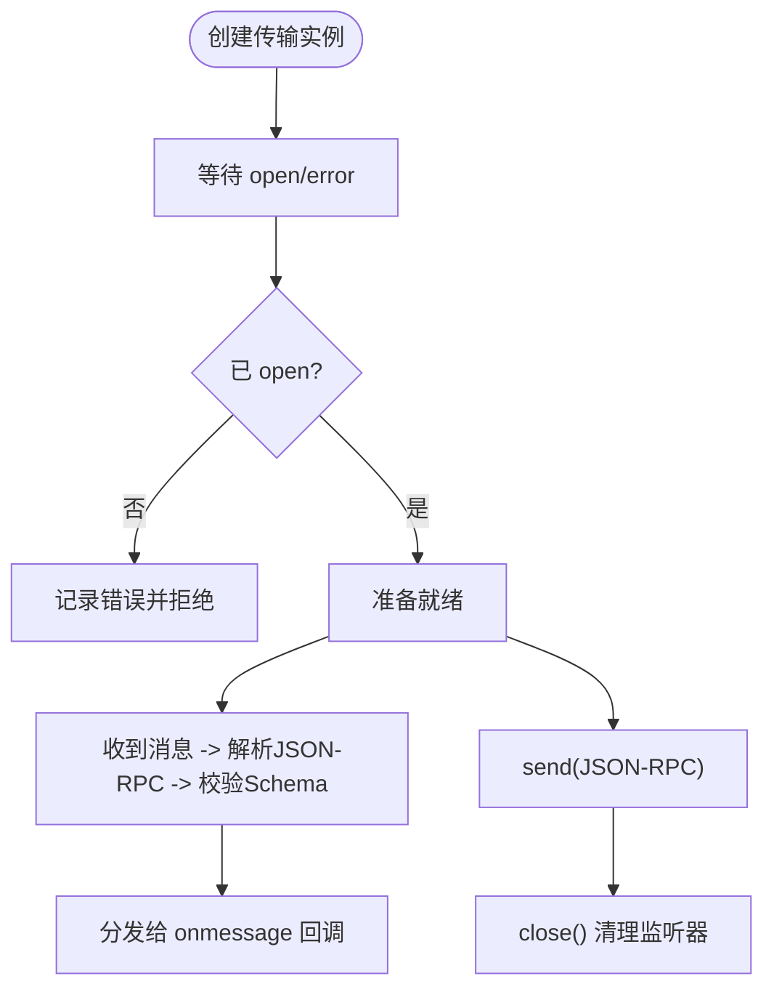
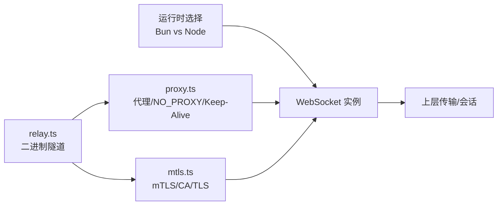

# WebSocket传输协议

<cite>
**本文引用的文件**
- [WebSocketTransport.ts](file://src/cli/transports/WebSocketTransport.ts)
- [SessionsWebSocket.ts](file://src/remote/SessionsWebSocket.ts)
- [mcpWebSocketTransport.ts](file://src/utils/mcpWebSocketTransport.ts)
- [CircularBuffer.ts](file://src/utils/CircularBuffer.ts)
- [proxy.ts](file://src/utils/proxy.ts)
- [mtls.ts](file://src/utils/mtls.ts)
- [relay.ts](file://src/upstreamproxy/relay.ts)
</cite>

## 目录
1. [简介](#简介)
2. [项目结构](#项目结构)
3. [核心组件](#核心组件)
4. [架构总览](#架构总览)
5. [详细组件分析](#详细组件分析)
6. [依赖关系分析](#依赖关系分析)
7. [性能考量](#性能考量)
8. [故障排查指南](#故障排查指南)
9. [结论](#结论)
10. [附录](#附录)

## 简介
本文件系统性阐述 Claude Code 的 WebSocket 传输协议实现，覆盖连接建立、消息编解码、重连与保活、缓冲与去重、代理与 mTLS、安全与可观测性等主题。重点围绕三类传输实现：
- CLI 侧通用 WebSocket 传输：用于命令行工具与服务端会话的可靠数据通道。
- 远程会话 WebSocket：面向 CCR 会话订阅的认证与消息处理。
- MCP 适配 WebSocket 传输：面向 Model Context Protocol 的 JSON-RPC 消息承载。

文档同时给出握手、帧格式、消息类型、缓冲与流量控制、配置项、监控与诊断、安全（TLS、认证、授权）以及最佳实践。

## 项目结构
与 WebSocket 传输相关的核心文件分布如下：
- CLI 传输层：src/cli/transports/WebSocketTransport.ts
- 远程会话客户端：src/remote/SessionsWebSocket.ts
- MCP 适配传输：src/utils/mcpWebSocketTransport.ts
- 缓冲与环形队列：src/utils/CircularBuffer.ts
- 代理与 mTLS 配置：src/utils/proxy.ts、src/utils/mtls.ts
- 上游代理隧道（二进制分片）：src/upstreamproxy/relay.ts

**图表来源**
- [WebSocketTransport.ts:119-133](file://src/cli/transports/WebSocketTransport.ts#L119-L133)
- [CircularBuffer.ts:5-12](file://src/utils/CircularBuffer.ts#L5-L12)
- [SessionsWebSocket.ts:90-95](file://src/remote/SessionsWebSocket.ts#L90-L95)
- [mcpWebSocketTransport.ts:22-28](file://src/utils/mcpWebSocketTransport.ts#L22-L28)
- [proxy.ts:243-275](file://src/utils/proxy.ts#L243-L275)
- [mtls.ts:100-112](file://src/utils/mtls.ts#L100-L112)
- [relay.ts:344-374](file://src/upstreamproxy/relay.ts#L344-L374)

**章节来源**
- [WebSocketTransport.ts:119-133](file://src/cli/transports/WebSocketTransport.ts#L119-L133)
- [SessionsWebSocket.ts:90-95](file://src/remote/SessionsWebSocket.ts#L90-L95)
- [mcpWebSocketTransport.ts:22-28](file://src/utils/mcpWebSocketTransport.ts#L22-L28)
- [proxy.ts:243-275](file://src/utils/proxy.ts#L243-L275)
- [mtls.ts:100-112](file://src/utils/mtls.ts#L100-L112)
- [relay.ts:344-374](file://src/upstreamproxy/relay.ts#L344-L374)

## 核心组件
- 通用 WebSocket 传输（CLI）
  - 支持 Bun 原生 WebSocket 与 Node ws 包，自动选择运行时并正确移除事件监听器，避免内存泄漏。
  - 提供连接状态机、指数退避重连、抖动、睡眠检测、心跳与保活帧、消息缓冲与去重、回调注册与关闭清理。
  - 关键字段与行为：URL、头信息、会话 ID、自动重连开关、桥接模式标记、重连计数与时间戳、最后活动时间、心跳与保活定时器、环形消息缓冲、运行时标识、连接开始时间、刷新头函数。
- 远程会话 WebSocket
  - 订阅 /v1/sessions/ws/{id}/subscribe，通过请求头携带认证令牌；支持 ping 心跳、有限重试、特定关闭码的特殊处理（如会话不存在）。
  - 关键字段与行为：会话 ID、组织 UUID、访问令牌获取器、回调集合（消息、连接、错误、关闭、重连）、状态机、重连尝试计数、会话不存在重试计数、ping 定时器、重连定时器。
- MCP 适配 WebSocket 传输
  - 将 JSON-RPC 消息封装在 WebSocket 中，解析与校验消息结构，统一错误与关闭处理，支持 Bun 与 Node 不同事件模型。
  - 关键字段与行为：WebSocket 实例、打开 Promise、运行时判断、消息/错误/关闭回调、一次性启动约束、发送与关闭流程。

**章节来源**
- [WebSocketTransport.ts:74-133](file://src/cli/transports/WebSocketTransport.ts#L74-L133)
- [SessionsWebSocket.ts:82-95](file://src/remote/SessionsWebSocket.ts#L82-L95)
- [mcpWebSocketTransport.ts:22-70](file://src/utils/mcpWebSocketTransport.ts#L22-L70)

## 架构总览
下图展示 CLI 通用传输与远程会话传输在连接建立、消息编解码、重连与保活方面的交互关系，并映射到具体源文件。

**图表来源**
- [WebSocketTransport.ts:135-193](file://src/cli/transports/WebSocketTransport.ts#L135-L193)
- [proxy.ts:243-275](file://src/utils/proxy.ts#L243-L275)
- [mtls.ts:100-112](file://src/utils/mtls.ts#L100-L112)
- [SessionsWebSocket.ts:100-204](file://src/remote/SessionsWebSocket.ts#L100-L204)

## 详细组件分析

### 组件一：CLI 通用 WebSocket 传输（WebSocketTransport）
- 连接建立
  - 自动区分 Bun 与 Node 运行时，分别使用原生 WebSocket 或 ws 包；注入代理与 TLS 选项；支持运行时代理参数（Bun）或 Node 代理 Agent。
  - 在 open 事件中记录连接耗时、触发连接回调、启动心跳与保活。
- 消息编解码
  - 发送前将消息序列化为字符串并追加换行；接收时根据运行时类型提取文本内容；对非字符串数据进行转换。
  - 使用环形缓冲保存带 UUID 的消息以便重连后重放；服务器通过 X-Last-Request-Id 或响应头中的 last-id 协商确认点。
- 连接管理
  - 状态机：idle → reconnecting → connected → closing → closed。
  - 重连策略：指数退避 + 抖动，最大延迟限制，总预算超限后放弃；支持“睡眠检测”（进程挂起/休眠）重置重连预算。
  - 心跳与保活：周期性 ping 检测死连接；周期性发送 keep_alive 数据帧以重置代理空闲超时。
  - 关闭与清理：停止定时器、移除事件监听、注销会话活动回调、释放 WebSocket 引用。
- 错误与恢复
  - 对永久关闭码（如协议错误、会话过期、未授权）直接进入 closed 状态；对 4003 可通过 refreshHeaders 刷新令牌后重试。
  - 重放已发送但未确认的消息，确保幂等（由服务器按 UUID 去重）。

**图表来源**
- [WebSocketTransport.ts:74-133](file://src/cli/transports/WebSocketTransport.ts#L74-L133)
- [CircularBuffer.ts:5-12](file://src/utils/CircularBuffer.ts#L5-L12)

**章节来源**
- [WebSocketTransport.ts:135-193](file://src/cli/transports/WebSocketTransport.ts#L135-L193)
- [WebSocketTransport.ts:296-329](file://src/cli/transports/WebSocketTransport.ts#L296-L329)
- [WebSocketTransport.ts:397-554](file://src/cli/transports/WebSocketTransport.ts#L397-L554)
- [WebSocketTransport.ts:697-799](file://src/cli/transports/WebSocketTransport.ts#L697-L799)
- [CircularBuffer.ts:5-84](file://src/utils/CircularBuffer.ts#L5-L84)

### 组件二：远程会话 WebSocket（SessionsWebSocket）
- 连接建立
  - 构造 wss://.../v1/sessions/ws/{sessionId}/subscribe URL，使用 Bearer Token 作为请求头认证；Bun/Node 分支一致处理 open/message/error/close。
- 消息编解码
  - 接收端解析 JSON 字符串为对象，按类型字段过滤有效消息；控制请求/响应通过专用发送接口。
- 连接管理
  - 状态机：connecting → connected → closed；有限重连次数；对 4001（会话不存在）进行短暂重试；对 4003（未授权）视为永久关闭。
  - 定时 ping 保持连接活性。
- 关闭与重连
  - 关闭时停止 ping，根据关闭码决定是否重连；支持强制重连以应对订阅过期场景。

**图表来源**
- [SessionsWebSocket.ts:100-204](file://src/remote/SessionsWebSocket.ts#L100-L204)
- [SessionsWebSocket.ts:234-288](file://src/remote/SessionsWebSocket.ts#L234-L288)

**章节来源**
- [SessionsWebSocket.ts:82-95](file://src/remote/SessionsWebSocket.ts#L82-L95)
- [SessionsWebSocket.ts:100-204](file://src/remote/SessionsWebSocket.ts#L100-L204)
- [SessionsWebSocket.ts:234-288](file://src/remote/SessionsWebSocket.ts#L234-L288)

### 组件三：MCP 适配 WebSocket 传输（mcpWebSocketTransport）
- 连接建立
  - 以现有 WebSocket 实例为基础，等待 open 或 error；Bun/Node 分别附加事件监听。
- 消息编解码
  - 使用 JSON-RPC Schema 校验消息结构；解析失败统一走错误回调。
- 发送与关闭
  - 发送前序列化；Node 版本支持回调式 send；关闭时清理监听器，确保资源回收。

**图表来源**
- [mcpWebSocketTransport.ts:22-70](file://src/utils/mcpWebSocketTransport.ts#L22-L70)
- [mcpWebSocketTransport.ts:142-200](file://src/utils/mcpWebSocketTransport.ts#L142-L200)

**章节来源**
- [mcpWebSocketTransport.ts:22-70](file://src/utils/mcpWebSocketTransport.ts#L22-L70)
- [mcpWebSocketTransport.ts:142-200](file://src/utils/mcpWebSocketTransport.ts#L142-L200)

## 依赖关系分析
- 运行时选择
  - Bun：使用原生 WebSocket，支持 headers/proxy/tls 参数；事件监听器可移除。
  - Node：使用 ws 包，通过 agent 注入代理；事件监听器通过 off 移除。
- 代理与 mTLS
  - 代理：优先使用 https_proxy/HTTP_PROXY，遵循 NO_PROXY 规则；Bun 使用 proxy 字符串，Node 使用 Agent。
  - mTLS：从环境变量加载客户端证书/密钥/口令，合并 CA 证书；为 WebSocket 提供 TLS 选项。
- 上游代理隧道
  - relay.ts 将 TCP CONNECT 隧道通过 WebSocket 二进制分片承载，设置 Content-Type 为 application/proto，维持应用级保活。

**图表来源**
- [WebSocketTransport.ts:159-192](file://src/cli/transports/WebSocketTransport.ts#L159-L192)
- [proxy.ts:243-275](file://src/utils/proxy.ts#L243-L275)
- [mtls.ts:100-112](file://src/utils/mtls.ts#L100-L112)
- [relay.ts:344-374](file://src/upstreamproxy/relay.ts#L344-L374)

**章节来源**
- [WebSocketTransport.ts:159-192](file://src/cli/transports/WebSocketTransport.ts#L159-L192)
- [proxy.ts:243-275](file://src/utils/proxy.ts#L243-L275)
- [mtls.ts:100-112](file://src/utils/mtls.ts#L100-L112)
- [relay.ts:344-374](file://src/upstreamproxy/relay.ts#L344-L374)

## 性能考量
- 连接建立
  - 通过代理与 mTLS 配置减少握手失败与重试成本；在 Node 环境复用 Agent 降低连接开销。
- 重连策略
  - 指数退避 + 抖动避免风暴；睡眠检测快速重置预算，缩短异常恢复时间。
- 心跳与保活
  - 定期 ping 检测死连接；周期性发送 keep_alive 数据帧防止代理空闲断开。
- 缓冲与去重
  - 环形缓冲限制内存占用；UUID 去重保证消息不丢失且幂等。
- I/O 与解析
  - 统一 JSON 序列化/反序列化；MCP 传输使用 Schema 校验，降低无效消息处理成本。

[本节为通用性能讨论，无需列出具体文件来源]

## 故障排查指南
- 常见关闭码
  - 1002/1006：协议错误/异常断开，检查代理与网络稳定性。
  - 4001：会话不存在/过期，可能为服务端压缩导致的瞬态；可进行有限重试。
  - 4003：未授权，若存在 refreshHeaders，可刷新令牌后重试。
- 重连与诊断
  - 查看重连尝试次数、累计耗时、延迟分布；关注“睡眠检测”日志以定位系统休眠影响。
  - 通过诊断事件（如 tengu_ws_transport_reconnecting/closed/reconnected）聚合同步问题。
- 代理与证书
  - 确认 NO_PROXY 规则与代理地址；检查 mTLS 证书/密钥路径与权限；验证 CA 证书链。
- 会话订阅
  - 若频繁出现 4001，适当增加重试窗口或优化会话生命周期管理。

**章节来源**
- [WebSocketTransport.ts:423-455](file://src/cli/transports/WebSocketTransport.ts#L423-L455)
- [WebSocketTransport.ts:465-554](file://src/cli/transports/WebSocketTransport.ts#L465-L554)
- [SessionsWebSocket.ts:246-287](file://src/remote/SessionsWebSocket.ts#L246-L287)

## 结论
该实现以运行时无关的方式统一了 WebSocket 传输，结合代理与 mTLS、环形缓冲与 UUID 去重、指数退避与睡眠检测、心跳与保活帧，构建了稳定可靠的双向通信通道。针对不同场景（CLI 传输、远程会话、MCP 适配），提供了清晰的职责边界与扩展点，便于在复杂网络环境中持续演进。

[本节为总结性内容，无需列出具体文件来源]

## 附录

### WebSocket 协议优势与要点
- 双向通信：服务端可主动推送消息，客户端即时响应。
- 低延迟：一次握手后无额外头部开销，适合高频小包。
- 持久连接：减少反复建连成本，配合心跳与保活维持活跃。

[本节为概念性说明，无需列出具体文件来源]

### 握手与帧格式
- 握手
  - CLI 传输：connect() 时注入自定义头（如 X-Last-Request-Id），Bun/Node 分支分别传入代理与 TLS 选项。
  - 远程会话：通过 Authorization 头传递访问令牌，建立订阅。
- 帧格式
  - 文本帧承载 JSON 字符串；CLI 传输每条消息以换行结尾；MCP 传输严格遵循 JSON-RPC Schema。
  - 上游代理隧道采用二进制分片（application/proto），并在 open 时发送首包携带 CONNECT 行与鉴权头。

**章节来源**
- [WebSocketTransport.ts:159-192](file://src/cli/transports/WebSocketTransport.ts#L159-L192)
- [SessionsWebSocket.ts:113-118](file://src/remote/SessionsWebSocket.ts#L113-L118)
- [relay.ts:356-374](file://src/upstreamproxy/relay.ts#L356-L374)

### 传输层缓冲、流量控制与拥塞避免
- 缓冲机制
  - 环形缓冲限制最大容量，默认大小可配置；仅对带 UUID 的消息进行缓冲与重放。
- 流量控制
  - 通过 keep_alive 数据帧与 ping/pong 机制反馈链路健康；在 CLI 传输中，会话活动回调也会触发保活帧。
- 拥塞避免
  - 指数退避 + 抖动；当检测到系统睡眠时重置预算，避免长时间无响应导致的拥塞。

**章节来源**
- [WebSocketTransport.ts:105-106](file://src/cli/transports/WebSocketTransport.ts#L105-L106)
- [WebSocketTransport.ts:767-791](file://src/cli/transports/WebSocketTransport.ts#L767-L791)
- [WebSocketTransport.ts:465-537](file://src/cli/transports/WebSocketTransport.ts#L465-L537)

### 配置选项与环境变量
- 代理
  - https_proxy/HTTPS_PROXY/http_proxy/HTTP_PROXY；no_proxy/NO_PROXY；Bun 使用 proxy 字符串，Node 使用 Agent。
- mTLS
  - CLAUDE_CODE_CLIENT_CERT、CLAUDE_CODE_CLIENT_KEY、CLAUDE_CODE_CLIENT_KEY_PASSPHRASE；NODE_EXTRA_CA_CERTS。
- 其他
  - CLAUDE_CODE_REMOTE：影响 keep_alive 策略（远程模式下由会话活动心跳处理）。
  - ANTHROPIC_UNIX_SOCKET：SSH 透传场景下的 Unix Socket 路径（仅限 Anthropic API）。

**章节来源**
- [proxy.ts:64-75](file://src/utils/proxy.ts#L64-L75)
- [proxy.ts:88-129](file://src/utils/proxy.ts#L88-L129)
- [proxy.ts:243-275](file://src/utils/proxy.ts#L243-L275)
- [mtls.ts:23-73](file://src/utils/mtls.ts#L23-L73)
- [mtls.ts:100-112](file://src/utils/mtls.ts#L100-L112)
- [WebSocketTransport.ts:771-772](file://src/cli/transports/WebSocketTransport.ts#L771-L772)

### 性能监控与诊断
- 事件与日志
  - 连接耗时、重连尝试、睡眠检测、pong 超时、keep_alive 失败、消息发送/接收统计。
  - 诊断事件（如 tengu_ws_transport_*）用于桥接模式下的连接健康观测。
- 指标建议
  - 连接成功率、平均/95 分位重连延迟、心跳存活率、消息去重数量、代理断开频率。

**章节来源**
- [WebSocketTransport.ts:296-301](file://src/cli/transports/WebSocketTransport.ts#L296-L301)
- [WebSocketTransport.ts:520-532](file://src/cli/transports/WebSocketTransport.ts#L520-L532)
- [WebSocketTransport.ts:724-734](file://src/cli/transports/WebSocketTransport.ts#L724-L734)

### 安全考虑（TLS、认证、授权）
- TLS 加密
  - 通过 getWebSocketTLSOptions 注入客户端证书、私钥与 CA 证书链；Node 环境使用自定义 Agent。
- 认证与授权
  - CLI 传输：X-Last-Request-Id 与动态头刷新（refreshHeaders）支持令牌轮换。
  - 远程会话：Authorization: Bearer 令牌；4003 视为未授权，可刷新后重试。
  - 上游代理：在隧道 open 时发送 Proxy-Authorization 与目标主机信息。

**章节来源**
- [WebSocketTransport.ts:150-157](file://src/cli/transports/WebSocketTransport.ts#L150-L157)
- [WebSocketTransport.ts:427-438](file://src/cli/transports/WebSocketTransport.ts#L427-L438)
- [SessionsWebSocket.ts:113-118](file://src/remote/SessionsWebSocket.ts#L113-L118)
- [relay.ts:378-384](file://src/upstreamproxy/relay.ts#L378-L384)

### 实际使用示例与最佳实践
- 示例
  - CLI 传输：构造 URL 与头，注册 onData/onConnect/onClose 回调，调用 connect() 并在需要时 write() 发送消息。
  - 远程会话：传入会话 ID、组织 UUID、令牌获取器与回调集合，调用 connect() 订阅消息。
  - MCP 适配：将已有 WebSocket 实例包装为传输，按需发送 JSON-RPC 控制请求/响应。
- 最佳实践
  - 明确 autoReconnect 与 isBridge 选项，结合业务场景调整重连预算。
  - 在代理与 mTLS 场景下，预先验证配置与证书链，避免运行时失败。
  - 使用 UUID 标记关键消息，确保重连后服务端可去重。
  - 监控心跳与保活指标，及时发现代理空闲断开与网络抖动。

**章节来源**
- [WebSocketTransport.ts:119-133](file://src/cli/transports/WebSocketTransport.ts#L119-L133)
- [SessionsWebSocket.ts:90-95](file://src/remote/SessionsWebSocket.ts#L90-L95)
- [mcpWebSocketTransport.ts:22-70](file://src/utils/mcpWebSocketTransport.ts#L22-L70)