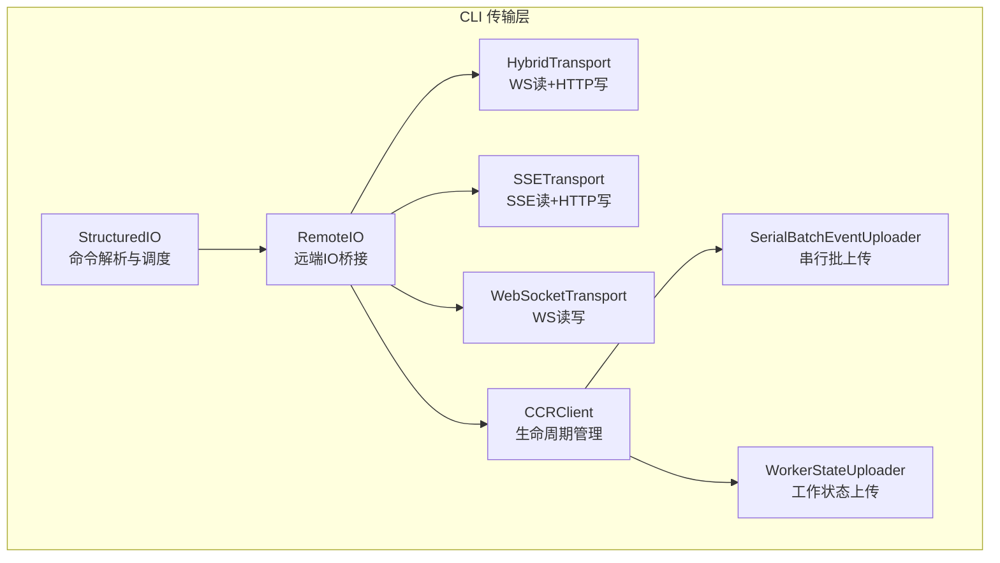
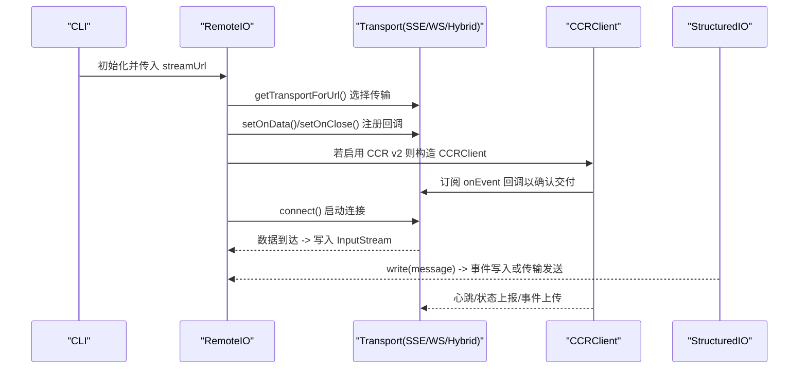
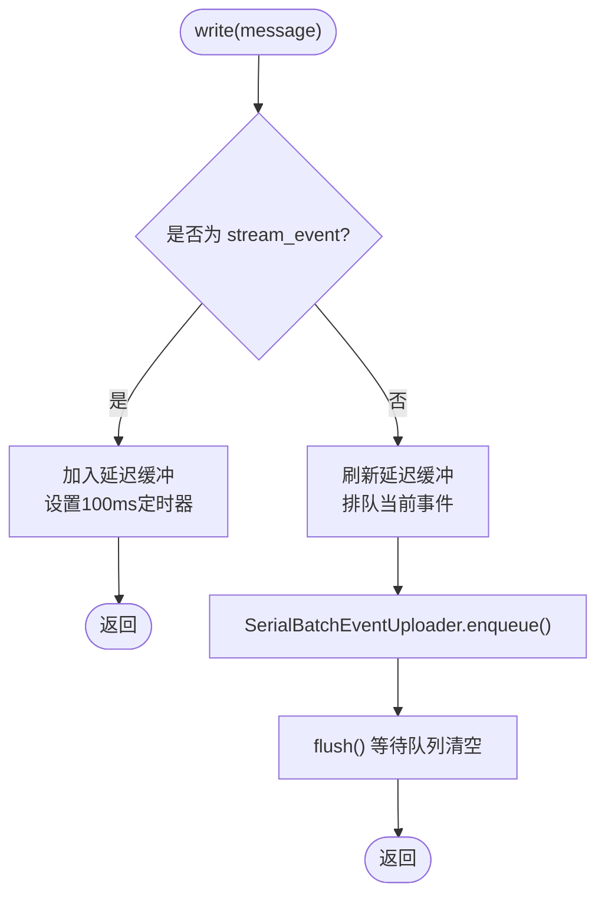
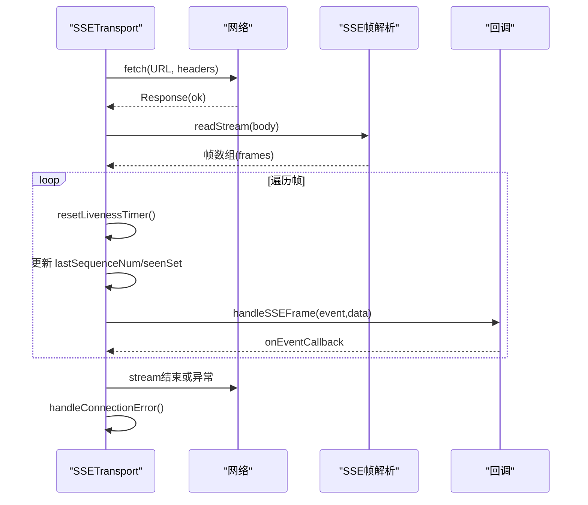
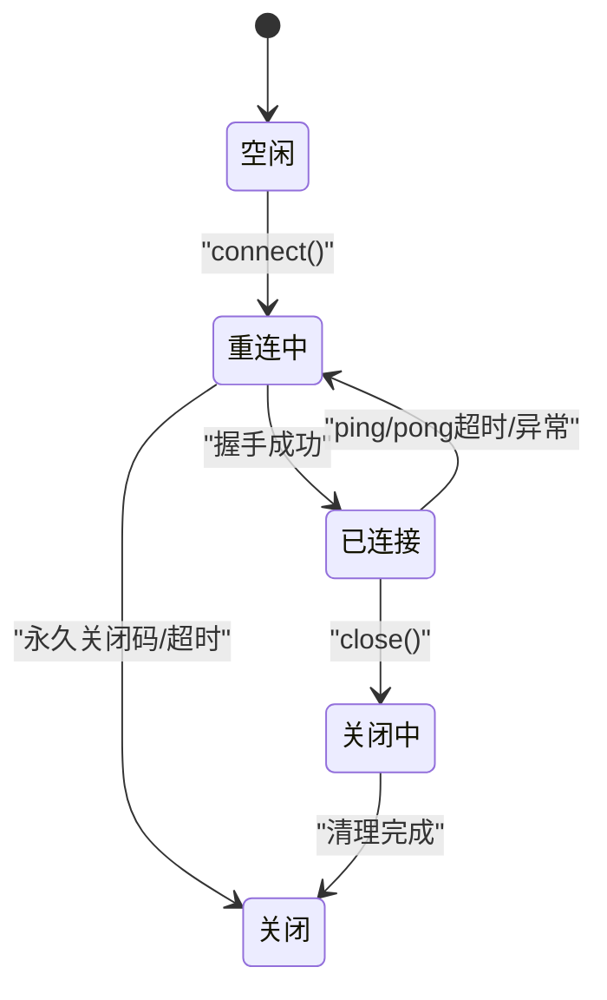
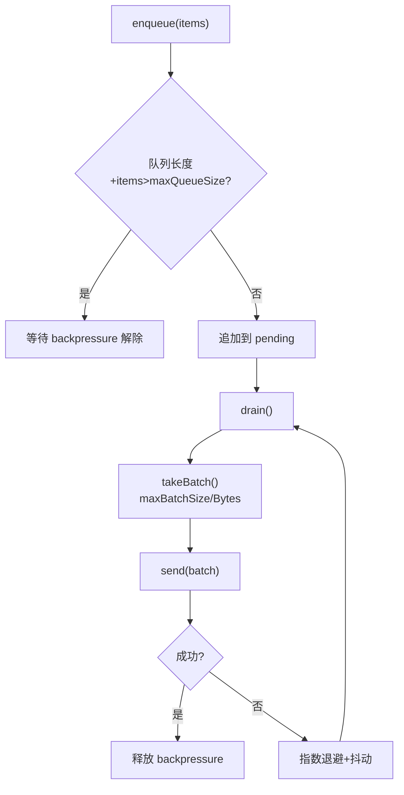
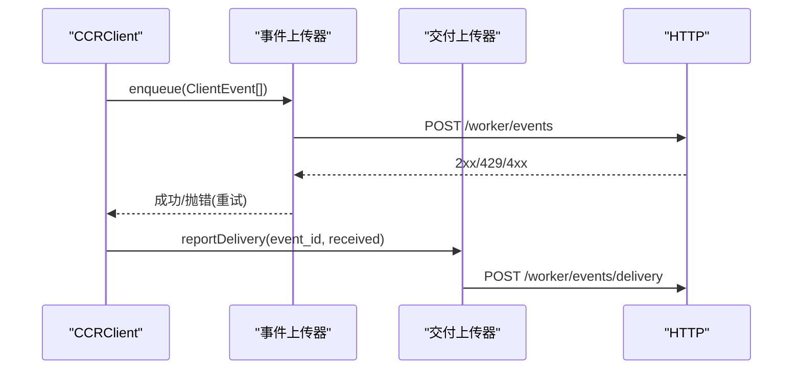
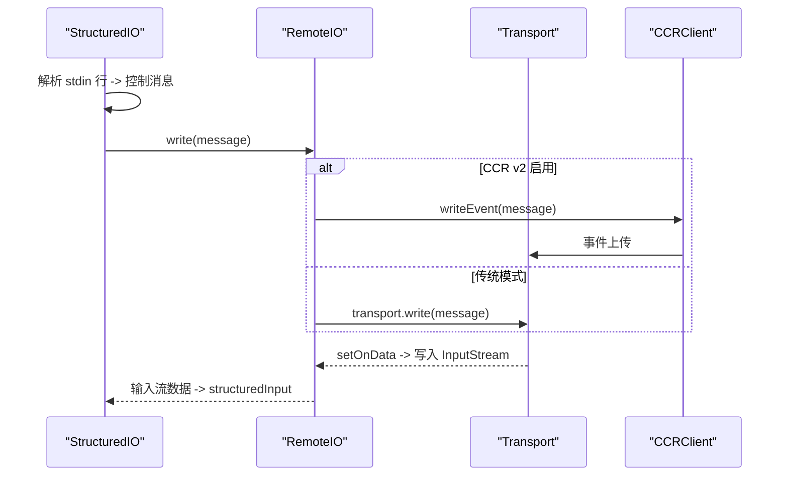
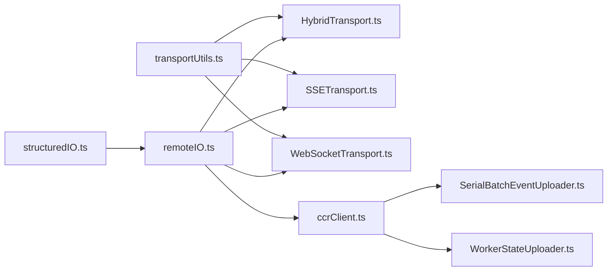

# 命令行传输层

<cite>
**本文档引用的文件**
- [HybridTransport.ts](file://src/cli/transports/HybridTransport.ts)
- [SSETransport.ts](file://src/cli/transports/SSETransport.ts)
- [WebSocketTransport.ts](file://src/cli/transports/WebSocketTransport.ts)
- [transportUtils.ts](file://src/cli/transports/transportUtils.ts)
- [SerialBatchEventUploader.ts](file://src/cli/transports/SerialBatchEventUploader.ts)
- [WorkerStateUploader.ts](file://src/cli/transports/WorkerStateUploader.ts)
- [ccrClient.ts](file://src/cli/transports/ccrClient.ts)
- [remoteIO.ts](file://src/cli/remoteIO.ts)
- [structuredIO.ts](file://src/cli/structuredIO.ts)
- [sessionIngressAuth.ts](file://src/utils/sessionIngressAuth.ts)
- [sleep.ts](file://src/utils/sleep.ts)
- [slowOperations.ts](file://src/utils/slowOperations.ts)
- [envUtils.ts](file://src/utils/envUtils.ts)
- [proxy.ts](file://src/utils/proxy.ts)
- [mtls.ts](file://src/utils/mtls.ts)
- [CircularBuffer.ts](file://src/utils/CircularBuffer.ts)
- [diagLogs.ts](file://src/utils/diagLogs.ts)
- [debug.ts](file://src/utils/debug.ts)
- [errors.ts](file://src/utils/errors.ts)
- [gracefulShutdown.ts](file://src/utils/gracefulShutdown.ts)
- [cleanupRegistry.ts](file://src/utils/cleanupRegistry.ts)
- [process.ts](file://src/utils/process.ts)
- [ndjsonSafeStringify.ts](file://src/cli/ndjsonSafeStringify.ts)
- [sessionState.ts](file://src/utils/sessionState.ts)
- [sessionStorage.ts](file://src/utils/sessionStorage.ts)
- [commandLifecycle.ts](file://src/utils/commandLifecycle.ts)
</cite>

## 目录
1. [简介](#简介)
2. [项目结构](#项目结构)
3. [核心组件](#核心组件)
4. [架构总览](#架构总览)
5. [详细组件分析](#详细组件分析)
6. [依赖关系分析](#依赖关系分析)
7. [性能考虑](#性能考虑)
8. [故障排查指南](#故障排查指南)
9. [结论](#结论)
10. [附录](#附录)

## 简介
本文件系统性阐述 Claude Code 命令行传输层的技术设计与实现，覆盖 HybridTransport、SSETransport、WebSocketTransport 等多种传输协议，以及与命令系统（StructuredIO）和 CCR v2 生命周期管理（ccrClient）的集成方式。文档重点说明数据流处理、消息序列化与反序列化、命令解析与执行调度、安全机制（认证与授权）、配置选项与性能优化策略、错误处理与重连机制、监控指标，以及扩展点。

## 项目结构
传输层位于 CLI 子模块中，核心文件组织如下：
- transports：传输协议实现与通用工具
  - HybridTransport.ts：基于 WebSocket 读取、HTTP POST 写入的混合传输
  - SSETransport.ts：基于 Server-Sent Events 读取、HTTP POST 写入的传输
  - WebSocketTransport.ts：基于 WebSocket 的双向传输（读写）
  - transportUtils.ts：根据 URL 和环境变量选择合适传输
  - SerialBatchEventUploader.ts：串行批处理上传器（重试、指数退避、背压）
  - WorkerStateUploader.ts：工作状态上传器（合并补丁、重试）
  - ccrClient.ts：CCR v2 工作进程生命周期管理（心跳、状态上报、事件写入）
- remoteIO.ts：远端输入输出桥接，负责传输选择、回调注册、生命周期管理
- structuredIO.ts：命令解析与执行调度（权限请求、钩子回调、MCP 消息等）

**图表来源**
- [remoteIO.ts:35-255](file://src/cli/remoteIO.ts#L35-L255)
- [structuredIO.ts:135-800](file://src/cli/structuredIO.ts#L135-L800)
- [HybridTransport.ts:54-282](file://src/cli/transports/HybridTransport.ts#L54-L282)
- [SSETransport.ts:162-711](file://src/cli/transports/SSETransport.ts#L162-L711)
- [WebSocketTransport.ts:74-800](file://src/cli/transports/WebSocketTransport.ts#L74-L800)
- [SerialBatchEventUploader.ts:64-275](file://src/cli/transports/SerialBatchEventUploader.ts#L64-L275)
- [WorkerStateUploader.ts:29-131](file://src/cli/transports/WorkerStateUploader.ts#L29-L131)
- [ccrClient.ts:262-999](file://src/cli/transports/ccrClient.ts#L262-L999)

**章节来源**
- [transportUtils.ts:16-45](file://src/cli/transports/transportUtils.ts#L16-L45)
- [remoteIO.ts:35-255](file://src/cli/remoteIO.ts#L35-L255)

## 核心组件
- 传输选择器：根据 URL 协议与环境变量自动选择 SSETransport 或 HybridTransport 或 WebSocketTransport
- 事件上传器：SerialBatchEventUploader 提供串行、批处理、指数退避重试与背压控制
- 工作状态上传器：WorkerStateUploader 负责合并补丁并持续重试
- CCR 客户端：管理 worker 生命周期（初始化、心跳、状态上报、事件写入），在 CCR v2 下与 SSETransport 集成
- 远端 IO：RemoteIO 将传输与 CCR 生命周期整合，注册内部事件读写器与会话状态监听器
- 结构化 IO：StructuredIO 解析 stdin/stdout 控制消息，处理权限请求、钩子回调、MCP 消息等

**章节来源**
- [transportUtils.ts:16-45](file://src/cli/transports/transportUtils.ts#L16-L45)
- [SerialBatchEventUploader.ts:64-275](file://src/cli/transports/SerialBatchEventUploader.ts#L64-L275)
- [WorkerStateUploader.ts:29-131](file://src/cli/transports/WorkerStateUploader.ts#L29-L131)
- [ccrClient.ts:262-999](file://src/cli/transports/ccrClient.ts#L262-L999)
- [remoteIO.ts:35-255](file://src/cli/remoteIO.ts#L35-L255)
- [structuredIO.ts:135-800](file://src/cli/structuredIO.ts#L135-L800)

## 架构总览
传输层采用“按需选择 + 统一抽象”的设计：通过 transportUtils 选择具体传输；RemoteIO 注册回调后启动连接；StructuredIO 负责消息解析与命令调度；CCRClient 在启用 CCR v2 时接管事件写入与生命周期管理。

**图表来源**
- [remoteIO.ts:87-172](file://src/cli/remoteIO.ts#L87-L172)
- [transportUtils.ts:16-45](file://src/cli/transports/transportUtils.ts#L16-L45)
- [SSETransport.ts:162-333](file://src/cli/transports/SSETransport.ts#L162-L333)
- [WebSocketTransport.ts:135-193](file://src/cli/transports/WebSocketTransport.ts#L135-L193)
- [HybridTransport.ts:117-138](file://src/cli/transports/HybridTransport.ts#L117-L138)
- [ccrClient.ts:459-526](file://src/cli/transports/ccrClient.ts#L459-L526)

## 详细组件分析

### HybridTransport：WebSocket 读 + HTTP POST 写
- 设计要点
  - 读：继承自 WebSocketTransport，复用其连接管理、心跳与重连逻辑
  - 写：使用 SerialBatchEventUploader 将事件批处理并通过 HTTP POST 发送
  - 流事件聚合：对 stream_event 在 100ms 时间窗内延迟聚合，减少 POST 次数
  - 序列化与重试：由上传器保证串行、指数退避、可选最大连续失败丢弃
  - 关闭策略：延迟队列最多等待 3s，确保持久化优先于关闭
- 数据流
  - write()：非 stream_event 立即刷新缓冲并排队；stream_event 入延迟缓冲
  - flush()：阻塞直到队列清空
  - postOnce()：单次 POST，429/5xx 抛错触发重试；4xx 非 429 视为永久失败
- 错误处理
  - 无令牌：记录诊断日志并跳过
  - 网络错误：抛出以便上传器重试
  - 永久错误：记录诊断并返回

**图表来源**
- [HybridTransport.ts:117-138](file://src/cli/transports/HybridTransport.ts#L117-L138)
- [SerialBatchEventUploader.ts:101-133](file://src/cli/transports/SerialBatchEventUploader.ts#L101-L133)

**章节来源**
- [HybridTransport.ts:54-282](file://src/cli/transports/HybridTransport.ts#L54-L282)
- [SerialBatchEventUploader.ts:64-275](file://src/cli/transports/SerialBatchEventUploader.ts#L64-L275)

### SSETransport：SSE 读 + HTTP POST 写
- 设计要点
  - 读：SSE 流解析帧，支持 Last-Event-ID 断点续传，保活检测（45s 无声视为断开）
  - 写：与 HybridTransport 相同的批处理 POST 模式，带指数退避与 429/5xx 重试
  - 重连：指数退避 + 随机抖动，时间预算 10 分钟；超时后进入 closed
  - 去重：维护 seenSequenceNums 集合，超过阈值进行修剪
- 数据流
  - connect()：构建 URL 与头部，发起 SSE 请求，读取 body 并解析帧
  - readStream()：增量解码，逐帧处理，更新 lastSequenceNum
  - handleSSEFrame()：仅处理 client_event，透传 payload 为 NDJSON
  - write()：POST 单条消息，失败路径按状态码分支处理
- 错误处理
  - 永久状态码（401/403/404）直接关闭
  - 连接异常：handleConnectionError() 触发重连
  - 保活超时：触发重连

**图表来源**
- [SSETransport.ts:231-415](file://src/cli/transports/SSETransport.ts#L231-L415)
- [SSETransport.ts:425-465](file://src/cli/transports/SSETransport.ts#L425-L465)
- [SSETransport.ts:469-535](file://src/cli/transports/SSETransport.ts#L469-L535)

**章节来源**
- [SSETransport.ts:162-711](file://src/cli/transports/SSETransport.ts#L162-L711)

### WebSocketTransport：WebSocket 读写
- 设计要点
  - 支持 Bun 与 Node 的不同运行时 API，统一事件处理
  - 自动重连：指数退避 + 抖动，时间预算 10 分钟；支持系统休眠检测（gap>120s）
  - 心跳与保活：周期性 ping/pong；代理空闲超时场景下发送 keep_alive
  - 消息缓冲：重连时根据 last-id 重放未确认消息，避免丢失
  - 关闭清理：移除监听器，停止定时器，注销会话活动回调
- 数据流
  - connect()：根据运行时创建 WebSocket，绑定事件
  - handleOpenEvent()：启动 ping/keep_alive，注册会话活动回调
  - handleConnectionError()：根据 closeCode/headersRefresh 决定是否重连或永久关闭
  - write()：序列化消息并发送，带 UUID 的消息会被缓冲用于重放
- 错误处理
  - 永久关闭码（1002/4001/4003）直接关闭
  - 4003 可在 refreshHeaders 提供新令牌时重试
  - 系统休眠检测：gap>120s 重置重连预算

**图表来源**
- [WebSocketTransport.ts:397-554](file://src/cli/transports/WebSocketTransport.ts#L397-L554)

**章节来源**
- [WebSocketTransport.ts:74-800](file://src/cli/transports/WebSocketTransport.ts#L74-L800)

### 事件上传器与工作状态上传器
- SerialBatchEventUploader
  - 串行批处理，最多一个在途请求
  - 支持 maxBatchSize、maxBatchBytes、maxQueueSize、指数退避、抖动
  - 可配置 maxConsecutiveFailures 导致丢弃批次并前进
  - 提供 droppedBatchCount、pendingCount 等可观测指标
- WorkerStateUploader
  - PUT /worker 的合并补丁上传器，天然限流为 2 个槽位
  - 顶层键覆盖、metadata 层级合并（RFC 7396）

**图表来源**
- [SerialBatchEventUploader.ts:101-202](file://src/cli/transports/SerialBatchEventUploader.ts#L101-L202)

**章节来源**
- [SerialBatchEventUploader.ts:64-275](file://src/cli/transports/SerialBatchEventUploader.ts#L64-L275)
- [WorkerStateUploader.ts:29-131](file://src/cli/transports/WorkerStateUploader.ts#L29-L131)

### CCR v2 生命周期与事件写入
- 初始化
  - 从环境变量读取 worker_epoch，PUT /sessions/{id}/worker 设置初始状态
  - 并发恢复外部元数据（external_metadata），随后启动心跳
- 心跳
  - 默认 20s 心跳，支持抖动；失败不中断主循环
- 事件写入
  - writeEvent()：将 StdoutMessage 包装为 ClientEvent，注入 UUID
  - stream_event 延迟 100ms 聚合，文本增量合并为完整快照
  - deliver 上传器跟踪事件交付状态（received/processing/processed）
- 内部事件
  - 写入 /sessions/{id}/worker/internal-events，用于会话恢复与转录持久化
- 会话状态与元数据
  - reportState()/reportMetadata() 通过 WorkerStateUploader 合并上报

**图表来源**
- [ccrClient.ts:359-436](file://src/cli/transports/ccrClient.ts#L359-L436)
- [ccrClient.ts:443-445](file://src/cli/transports/ccrClient.ts#L443-L445)
- [ccrClient.ts:410-436](file://src/cli/transports/ccrClient.ts#L410-L436)

**章节来源**
- [ccrClient.ts:262-999](file://src/cli/transports/ccrClient.ts#L262-L999)

### 远端 IO 与命令系统集成
- RemoteIO
  - 选择传输、注册 setOnData/setOnClose 回调
  - CCR v2 模式下构造 CCRClient，注册内部事件读写器与会话状态监听器
  - keep_alive 定时器（桥接模式下）防止代理空闲超时
  - write()：若启用 CCR v2 则通过 CCRClient 写事件，否则走传输
- StructuredIO
  - 从 stdin 逐行解析控制消息，过滤 keep_alive
  - 处理 control_request（权限请求、钩子回调、MCP 消息等）
  - 通过 outbound 流控保证顺序，避免 control_request 超越 stream_event
  - 注入 control_response 时进行去重与生命周期通知

**图表来源**
- [remoteIO.ts:96-172](file://src/cli/remoteIO.ts#L96-L172)
- [structuredIO.ts:215-261](file://src/cli/structuredIO.ts#L215-L261)
- [structuredIO.ts:465-531](file://src/cli/structuredIO.ts#L465-L531)

**章节来源**
- [remoteIO.ts:35-255](file://src/cli/remoteIO.ts#L35-L255)
- [structuredIO.ts:135-800](file://src/cli/structuredIO.ts#L135-L800)

## 依赖关系分析
- 传输选择依赖环境变量与 URL 协议
- CCR v2 依赖 SSETransport（强制约束）
- 事件上传器与工作状态上传器被 CCRClient 使用
- RemoteIO 依赖传输与 CCRClient，并注册会话状态与内部事件读写器
- StructuredIO 依赖传输写入与 CCR v2 写入路径

**图表来源**
- [transportUtils.ts:16-45](file://src/cli/transports/transportUtils.ts#L16-L45)
- [remoteIO.ts:87-172](file://src/cli/remoteIO.ts#L87-L172)
- [ccrClient.ts:346-436](file://src/cli/transports/ccrClient.ts#L346-L436)

**章节来源**
- [transportUtils.ts:16-45](file://src/cli/transports/transportUtils.ts#L16-L45)
- [remoteIO.ts:87-172](file://src/cli/remoteIO.ts#L87-L172)
- [ccrClient.ts:346-436](file://src/cli/transports/ccrClient.ts#L346-L436)

## 性能考虑
- 批量与延迟
  - HybridTransport 与 CCRClient 对 stream_event 采用 100ms 延迟聚合，降低 HTTP POST 数量
  - SerialBatchEventUploader 支持 maxBatchSize 与 maxBatchBytes，避免过大负载
- 重试与抖动
  - 指数退避 + 抖动，避免惊群效应；429/5xx 自适应 Retry-After
- 背压与内存
  - maxQueueSize 限制队列深度，enqueue() 阻塞直至空间可用
  - WorkerStateUploader 仅 2 个槽位，天然限流
- 保活与代理
  - WebSocketTransport 的 ping/pong 与 keep_alive 数据帧，防止代理空闲超时
  - RemoteIO 的 keep_alive 定时器（桥接模式）
- CPU 与序列化
  - 使用 jsonStringify/slowOperations 的惰性序列化，避免频繁分配

[本节为通用指导，无需特定文件引用]

## 故障排查指南
- 传输连接问题
  - SSETransport：检查 401/403/404 是否为永久错误；查看重连尝试次数与耗时；确认 Last-Event-ID 与 from_sequence_num 参数
  - WebSocketTransport：关注 ping/pong 超时、系统休眠检测、代理空闲超时（Cloudflare 5 分钟）；检查 4003 令牌刷新
- 写入失败
  - HybridTransport/SSETransport：429/5xx 触发重试；4xx 非 429 视为永久失败；检查 Authorization 与 Content-Type
  - CCRClient：409 epoch 不匹配立即退出；401/403 连续失败达到阈值退出
- 事件丢失与重复
  - WebSocketTransport：重放未确认消息（基于 last-id）；去重集合 seenSequenceNums
  - StructuredIO：resolvedToolUseIds 去重重复 control_response
- 日志与诊断
  - 使用 logForDiagnosticsNoPII 输出诊断事件，结合 logForDebugging 定位问题
  - 关注心跳、重连、保活、序列号等关键指标

**章节来源**
- [SSETransport.ts:280-298](file://src/cli/transports/SSETransport.ts#L280-L298)
- [WebSocketTransport.ts:423-455](file://src/cli/transports/WebSocketTransport.ts#L423-L455)
- [ccrClient.ts:586-614](file://src/cli/transports/ccrClient.ts#L586-L614)
- [structuredIO.ts:374-399](file://src/cli/structuredIO.ts#L374-L399)

## 结论
该传输层通过“按需选择 + 统一抽象 + 事件上传器 + 生命周期管理”的组合，实现了在不同网络与协议环境下稳定、可观察、可扩展的命令行传输能力。HybridTransport 与 SSETransport 在写入侧采用批处理与指数退避，读取侧分别利用 WebSocket 与 SSE 的特性；WebSocketTransport 提供稳健的双向通道与保活机制。StructuredIO 与 CCRClient 将命令解析、权限控制、生命周期管理与事件写入有机整合，满足 CLI 场景下的高可靠与高性能需求。

[本节为总结，无需特定文件引用]

## 附录

### 安全机制与认证
- 会话令牌
  - 通过 getSessionIngressAuthHeaders/getSessionIngressAuthToken 获取 Authorization 头
  - refreshHeaders 回调在重连前动态刷新令牌
- 传输层安全
  - WebSocketTransport 支持 mTLS TLS 选项与代理代理
  - SSE/HTTP 写入统一添加 User-Agent 与 anthropic-version
- CCR v2
  - 通过 Authorization Bearer 令牌访问 /sessions/{id}/worker/* 接口
  - 409 epoch 不匹配强制退出，防止并发竞争

**章节来源**
- [sessionIngressAuth.ts](file://src/utils/sessionIngressAuth.ts)
- [WebSocketTransport.ts:9-18](file://src/cli/transports/WebSocketTransport.ts#L9-L18)
- [proxy.ts](file://src/utils/proxy.ts)
- [mtls.ts](file://src/utils/mtls.ts)
- [ccrClient.ts:556-642](file://src/cli/transports/ccrClient.ts#L556-L642)

### 配置选项与环境变量
- 传输选择
  - CLAUDE_CODE_USE_CCR_V2：启用 CCR v2（SSE 读 + HTTP 写），强制 SSETransport
  - CLAUDE_CODE_POST_FOR_SESSION_INGRESS_V2：启用 HybridTransport（WS 读 + HTTP 写）
  - URL 协议：ws/wss 选择 WebSocketTransport 或 HybridTransport
- 心跳与保活
  - session_keepalive_interval_v2_ms：RemoteIO keep_alive 间隔（毫秒）
- 其他
  - CLAUDE_CODE_ENVIRONMENT_RUNNER_VERSION：附加到传输头
  - CLAUDE_CODE_WORKER_EPOCH：CCR v2 工作进程版本号

**章节来源**
- [transportUtils.ts:16-45](file://src/cli/transports/transportUtils.ts#L16-L45)
- [remoteIO.ts:184-196](file://src/cli/remoteIO.ts#L184-L196)
- [envUtils.ts](file://src/utils/envUtils.ts)

### 错误处理与重连机制
- SSETransport
  - 永久状态码（401/403/404）直接关闭
  - 连接异常与保活超时触发指数退避重连，预算 10 分钟
- WebSocketTransport
  - 永久关闭码（1002/4001/4003）直接关闭；4003 可通过 refreshHeaders 刷新令牌
  - 系统休眠检测：gap>120s 重置重连预算
- 事件上传器
  - RetryableError 支持服务器 Retry-After；maxConsecutiveFailures 可丢弃批次

**章节来源**
- [SSETransport.ts:270-333](file://src/cli/transports/SSETransport.ts#L270-L333)
- [WebSocketTransport.ts:423-554](file://src/cli/transports/WebSocketTransport.ts#L423-L554)
- [SerialBatchEventUploader.ts:26-33](file://src/cli/transports/SerialBatchEventUploader.ts#L26-L33)

### 监控指标与可观测性
- 诊断日志
  - info/warn/error 事件：连接、重连、保活、写入、初始化、心跳、状态上报等
- 关键指标
  - 连接耗时、重连次数与耗时、保活超时、序列号去重、事件批大小、丢弃批次数
- 命令生命周期
  - 通过 commandLifecycle 与 sessionState 事件上报状态变化

**章节来源**
- [diagLogs.ts](file://src/utils/diagLogs.ts)
- [debug.ts](file://src/utils/debug.ts)
- [HybridTransport.ts:93-107](file://src/cli/transports/HybridTransport.ts#L93-L107)
- [SSETransport.ts:309-311](file://src/cli/transports/SSETransport.ts#L309-L311)
- [WebSocketTransport.ts:306-310](file://src/cli/transports/WebSocketTransport.ts#L306-L310)
- [ccrClient.ts:509-525](file://src/cli/transports/ccrClient.ts#L509-L525)

### 与命令系统的集成与扩展点
- 事件写入扩展
  - RemoteIO.write()：在 CCR v2 下通过 CCRClient 写事件；否则走传输
  - setInternalEventWriter：将内部事件写入 /worker/internal-events
- 权限与钩子
  - StructuredIO.createCanUseTool()/createHookCallback()：统一处理权限请求与钩子回调
- MCP 消息
  - StructuredIO.sendMcpMessage()：转发 MCP JSON-RPC 消息
- 会话状态与元数据
  - setSessionStateChangedListener/setSessionMetadataChangedListener：上报状态与元数据变更

**章节来源**
- [remoteIO.ts:140-168](file://src/cli/remoteIO.ts#L140-L168)
- [structuredIO.ts:533-773](file://src/cli/structuredIO.ts#L533-L773)
- [sessionState.ts](file://src/utils/sessionState.ts)
- [sessionStorage.ts](file://src/utils/sessionStorage.ts)