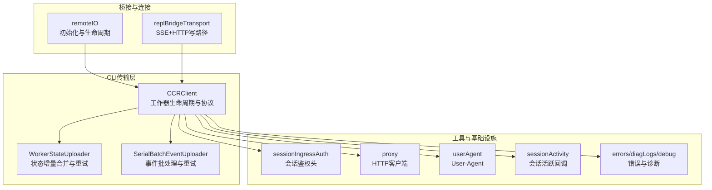
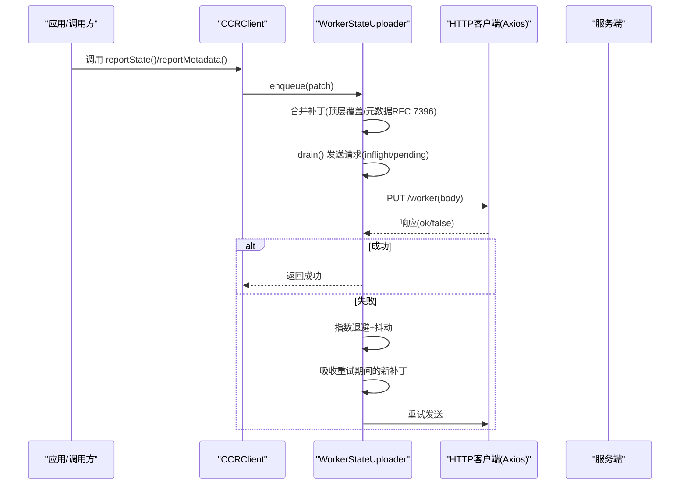
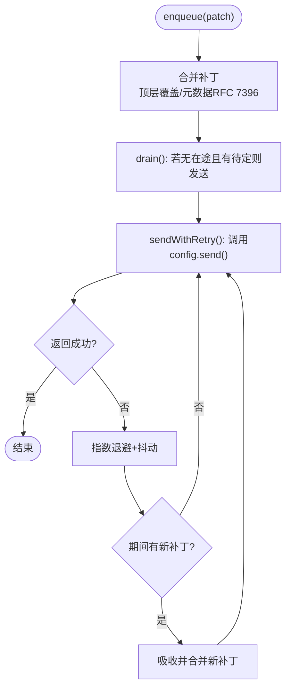
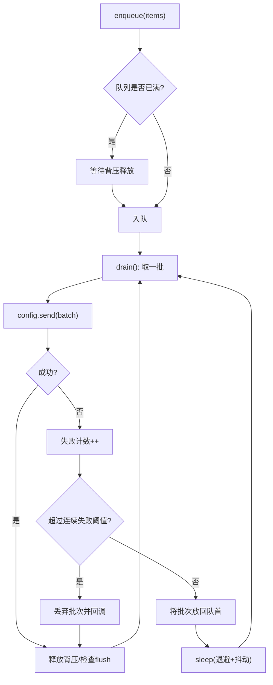
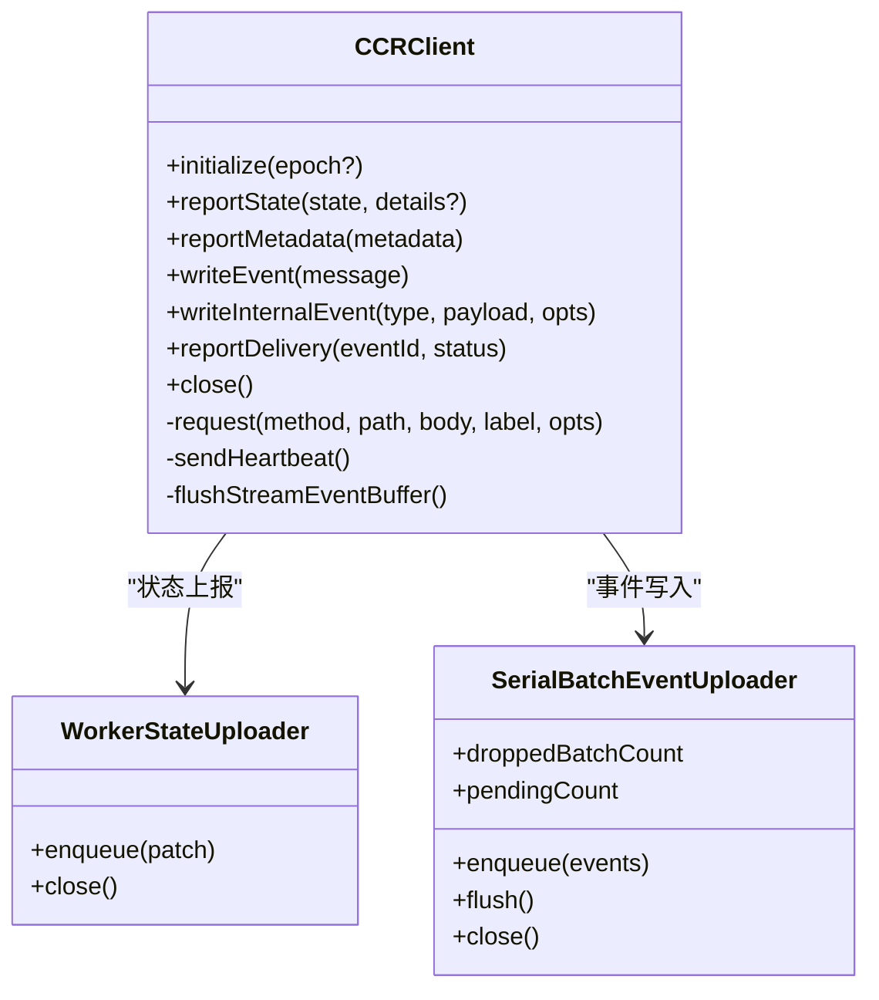
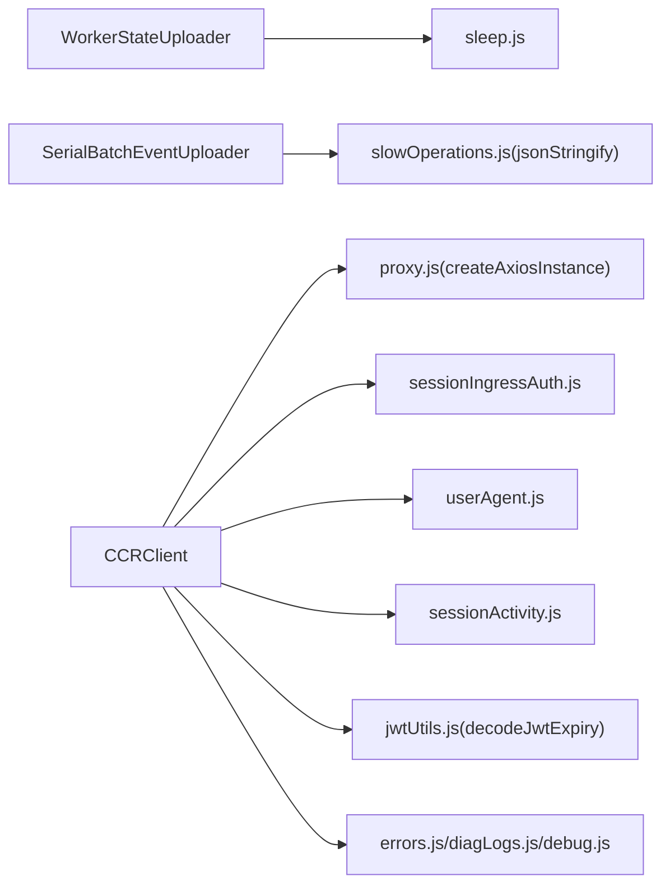

# 工作器状态上传器

<cite>
**本文引用的文件**
- [WorkerStateUploader.ts](file://src/cli/transports/WorkerStateUploader.ts)
- [SerialBatchEventUploader.ts](file://src/cli/transports/SerialBatchEventUploader.ts)
- [ccrClient.ts](file://src/cli/transports/ccrClient.ts)
- [remoteIO.ts](file://src/cli/remoteIO.ts)
- [replBridgeTransport.ts](file://src/bridge/replBridgeTransport.ts)
- [jwtUtils.ts](file://src/bridge/jwtUtils.ts)
- [sleep.js](file://src/utils/sleep.js)
- [proxy.js](file://src/utils/proxy.js)
- [userAgent.js](file://src/utils/userAgent.js)
- [sessionActivity.js](file://src/utils/sessionActivity.js)
- [sessionIngressAuth.js](file://src/utils/sessionIngressAuth.js)
- [errors.js](file://src/utils/errors.js)
- [diagLogs.js](file://src/utils/diagLogs.js)
- [debug.js](file://src/utils/debug.js)
</cite>

## 目录
1. [简介](#简介)
2. [项目结构](#项目结构)
3. [核心组件](#核心组件)
4. [架构总览](#架构总览)
5. [详细组件分析](#详细组件分析)
6. [依赖关系分析](#依赖关系分析)
7. [性能考量](#性能考量)
8. [故障排查指南](#故障排查指南)
9. [结论](#结论)
10. [附录](#附录)

## 简介
本文件面向Claude Code工作器（Worker）状态上传器，系统性阐述WorkerStateUploader的架构设计与实现原理，覆盖状态快照、增量更新与一致性保障；工作器状态采集机制（资源使用、任务进度、健康状态）；状态上传的调度策略（定时上传、事件触发、条件判断）；状态数据的压缩、加密与传输优化；配置项、监控指标与告警；故障恢复、数据校验与性能优化；以及在分布式系统中的应用场景与实现模式。

## 项目结构
工作器状态上传器位于CLI传输层，围绕CC v2协议实现“状态上报”“心跳”“事件写入”等能力。关键模块如下：
- WorkerStateUploader：工作器状态增量合并与重试上传器
- SerialBatchEventUploader：有序批处理事件上传器（内部事件、客户端事件、交付状态）
- CCRClient：工作器生命周期与协议编排（初始化、心跳、状态上报、事件写入）
- 远程桥接与连接：remoteIO、replBridgeTransport负责建立SSE/HTTP通道并注入写路径
- 工具与基础设施：认证、代理、用户代理、会话活动、错误与诊断日志

图表来源
- [ccrClient.ts:262-446](file://src/cli/transports/ccrClient.ts#L262-L446)
- [WorkerStateUploader.ts:29-96](file://src/cli/transports/WorkerStateUploader.ts#L29-L96)
- [SerialBatchEventUploader.ts:64-276](file://src/cli/transports/SerialBatchEventUploader.ts#L64-L276)
- [remoteIO.ts:111-138](file://src/cli/remoteIO.ts#L111-L138)
- [replBridgeTransport.ts:324-345](file://src/bridge/replBridgeTransport.ts#L324-L345)

章节来源
- [ccrClient.ts:262-446](file://src/cli/transports/ccrClient.ts#L262-L446)
- [WorkerStateUploader.ts:1-132](file://src/cli/transports/WorkerStateUploader.ts#L1-L132)
- [SerialBatchEventUploader.ts:1-276](file://src/cli/transports/SerialBatchEventUploader.ts#L1-L276)
- [remoteIO.ts:111-138](file://src/cli/remoteIO.ts#L111-L138)
- [replBridgeTransport.ts:324-345](file://src/bridge/replBridgeTransport.ts#L324-L345)

## 核心组件
- WorkerStateUploader：对PUT /worker进行增量合并与重试上传，支持顶层键覆盖与元数据RFC 7396合并，指数退避+抖动，失败时吸收重试期间的新补丁。
- SerialBatchEventUploader：串行批处理上传器，支持最大批大小、字节上限、队列背压、连续失败丢弃策略、服务器Retry-After提示。
- CCRClient：工作器生命周期编排，包含初始化（注册/恢复状态）、心跳、状态上报、事件写入（客户端事件/内部事件/交付状态），并处理409、401/403、429等场景。
- 远程桥接：remoteIO负责初始化CCRClient并确保SSE回调先于传输连接；replBridgeTransport提供SSE+HTTP写路径，暴露reportState/reportMetadata/reportDelivery接口。

章节来源
- [WorkerStateUploader.ts:19-96](file://src/cli/transports/WorkerStateUploader.ts#L19-L96)
- [SerialBatchEventUploader.ts:35-276](file://src/cli/transports/SerialBatchEventUploader.ts#L35-L276)
- [ccrClient.ts:262-526](file://src/cli/transports/ccrClient.ts#L262-L526)
- [remoteIO.ts:111-138](file://src/cli/remoteIO.ts#L111-L138)
- [replBridgeTransport.ts:324-345](file://src/bridge/replBridgeTransport.ts#L324-L345)

## 架构总览
工作器状态上传器在CC v2协议下，通过WorkerStateUploader与SerialBatchEventUploader协同完成两类数据的可靠传输：
- 状态类：PUT /worker（状态快照+外部元数据），采用增量合并与重试
- 事件类：POST /worker/events、/worker/internal-events、/worker/events/delivery（客户端事件、内部事件、交付状态），采用批处理与背压

图表来源
- [WorkerStateUploader.ts:43-96](file://src/cli/transports/WorkerStateUploader.ts#L43-L96)
- [ccrClient.ts:644-663](file://src/cli/transports/ccrClient.ts#L644-L663)
- [proxy.js](file://src/utils/proxy.js)

章节来源
- [WorkerStateUploader.ts:43-96](file://src/cli/transports/WorkerStateUploader.ts#L43-L96)
- [ccrClient.ts:644-663](file://src/cli/transports/ccrClient.ts#L644-L663)

## 详细组件分析

### WorkerStateUploader：状态快照、增量更新与一致性
- 增量合并规则
  - 顶层键（如worker_status、external_metadata）：后到值覆盖先到值
  - 元数据键（external_metadata、internal_metadata）：按RFC 7396进行一层深度合并，覆盖新增键，保留null用于服务端删除语义
- 并发与背压
  - 最多1个在途PUT + 1个待定补丁，天然限流在2条槽位，无需额外背压
- 重试与退避
  - 指数退避（带最大上限），加入随机抖动，避免“惊群效应”
  - 失败时吸收重试周期内到达的新补丁，保证最终一致性
- 关闭与清理
  - close()清空待定补丁，停止后续发送

图表来源
- [WorkerStateUploader.ts:106-131](file://src/cli/transports/WorkerStateUploader.ts#L106-L131)
- [WorkerStateUploader.ts:54-96](file://src/cli/transports/WorkerStateUploader.ts#L54-L96)

章节来源
- [WorkerStateUploader.ts:3-17](file://src/cli/transports/WorkerStateUploader.ts#L3-L17)
- [WorkerStateUploader.ts:106-131](file://src/cli/transports/WorkerStateUploader.ts#L106-L131)
- [WorkerStateUploader.ts:54-96](file://src/cli/transports/WorkerStateUploader.ts#L54-L96)

### SerialBatchEventUploader：事件批处理与可靠性
- 批处理策略
  - 最大批数量、最大字节数（首项必进，后续按累计字节限制）
  - 序列化失败的条目会被丢弃，避免阻塞队列
- 串行与背压
  - 同时仅1个POST在途；队列满时enqueue()阻塞等待
  - 成功后释放背压，通知等待者
- 重试与降级
  - 连续失败达到阈值可丢弃批次并继续前进，避免雪崩
  - 支持服务器Retry-After提示，优先尊重服务端建议
- 指标与可观测性
  - 提供droppedBatchCount与pendingCount，便于关闭前快照与诊断

图表来源
- [SerialBatchEventUploader.ts:101-202](file://src/cli/transports/SerialBatchEventUploader.ts#L101-L202)
- [SerialBatchEventUploader.ts:235-276](file://src/cli/transports/SerialBatchEventUploader.ts#L235-L276)

章节来源
- [SerialBatchEventUploader.ts:3-15](file://src/cli/transports/SerialBatchEventUploader.ts#L3-L15)
- [SerialBatchEventUploader.ts:101-202](file://src/cli/transports/SerialBatchEventUploader.ts#L101-L202)
- [SerialBatchEventUploader.ts:235-276](file://src/cli/transports/SerialBatchEventUploader.ts#L235-L276)

### CCRClient：生命周期、状态上报与事件写入
- 初始化与状态恢复
  - 从环境或参数获取worker_epoch，发起PUT /worker初始化为idle，并并发GET /worker恢复外部元数据
  - 记录初始化耗时与是否恢复到状态
- 心跳
  - 定期发送POST /worker/heartbeat，支持抖动以分散负载
- 状态上报
  - reportState()：更新worker_status与requires_action_details
  - reportMetadata()：增量更新external_metadata
- 事件写入
  - writeEvent()：客户端事件（含流事件缓冲与文本增量合并）
  - writeInternalEvent()：内部事件（不对外可见，用于会话恢复）
  - reportDelivery()：交付状态上报（received/processing/processed）
- 错误处理
  - 409：epoch冲突，立即退出
  - 401/403：若令牌已过期直接退出；否则累计连续失败次数
  - 429：读取Retry-After，尊重服务端退避
  - 其他异常：记录诊断日志并退避重试

图表来源
- [ccrClient.ts:262-526](file://src/cli/transports/ccrClient.ts#L262-L526)
- [WorkerStateUploader.ts:29-96](file://src/cli/transports/WorkerStateUploader.ts#L29-L96)
- [SerialBatchEventUploader.ts:64-150](file://src/cli/transports/SerialBatchEventUploader.ts#L64-L150)

章节来源
- [ccrClient.ts:459-526](file://src/cli/transports/ccrClient.ts#L459-L526)
- [ccrClient.ts:644-786](file://src/cli/transports/ccrClient.ts#L644-L786)
- [ccrClient.ts:705-723](file://src/cli/transports/ccrClient.ts#L705-L723)

### 远程桥接与写路径
- remoteIO：在启用CC v2时，先构造并初始化CCRClient，再连接传输；确保SSE回调在传输连接前就绪，避免早期帧丢失
- replBridgeTransport：提供SSE+HTTP写路径，暴露reportState/reportMetadata/reportDelivery接口；在outbound-only模式下仅启用写路径

章节来源
- [remoteIO.ts:111-138](file://src/cli/remoteIO.ts#L111-L138)
- [replBridgeTransport.ts:324-345](file://src/bridge/replBridgeTransport.ts#L324-L345)

## 依赖关系分析
- WorkerStateUploader依赖
  - sleep：指数退避延时
  - 自身实现补丁合并逻辑
- SerialBatchEventUploader依赖
  - jsonStringify：计算JSON字节大小
  - RetryableError：服务端Retry-After提示
- CCRClient依赖
  - axios实例：HTTP请求封装
  - 会话鉴权头：getSessionIngressAuthHeaders
  - 用户代理：getClaudeCodeUserAgent
  - 会话活动回调：register/unregisterSessionActivityCallback
  - JWT解析：decodeJwtExpiry
  - 错误与诊断：errorMessage/getErrnoCode、logForDiagnosticsNoPII、logForDebugging

图表来源
- [WorkerStateUploader.ts](file://src/cli/transports/WorkerStateUploader.ts#L1)
- [SerialBatchEventUploader.ts](file://src/cli/transports/SerialBatchEventUploader.ts#L1)
- [ccrClient.ts:1-30](file://src/cli/transports/ccrClient.ts#L1-L30)
- [jwtUtils.ts](file://src/bridge/jwtUtils.ts)
- [sleep.js](file://src/utils/sleep.js)
- [proxy.js](file://src/utils/proxy.js)
- [userAgent.js](file://src/utils/userAgent.js)
- [sessionActivity.js](file://src/utils/sessionActivity.js)
- [sessionIngressAuth.js](file://src/utils/sessionIngressAuth.js)
- [errors.js](file://src/utils/errors.js)
- [diagLogs.js](file://src/utils/diagLogs.js)
- [debug.js](file://src/utils/debug.js)

章节来源
- [WorkerStateUploader.ts](file://src/cli/transports/WorkerStateUploader.ts#L1)
- [SerialBatchEventUploader.ts](file://src/cli/transports/SerialBatchEventUploader.ts#L1)
- [ccrClient.ts:1-30](file://src/cli/transports/ccrClient.ts#L1-L30)

## 性能考量
- 传输优化
  - 状态上传：单次PUT，增量合并减少冗余；指数退避+抖动降低拥塞
  - 事件上传：批大小与字节上限控制，避免单次过大；序列化失败条目丢弃，防止死锁
- 资源使用
  - 队列容量与批大小按场景调优；背压保障内存占用可控
  - 心跳间隔与抖动分散峰值请求
- 一致性与可用性
  - 状态层：顶层覆盖+元数据合并，保证最终一致；失败吸收新补丁，避免丢失
  - 事件层：串行+批处理+Retry-After，兼顾吞吐与顺序
- 压缩与加密
  - 代码库未见显式压缩/加密实现；可通过HTTP传输层（如TLS）获得加密保护；如需压缩可在上游消息层实现

[本节为通用性能讨论，不直接分析具体文件]

## 故障排查指南
- 409 冲突（epoch不匹配）
  - 表现：初始化或请求返回409
  - 处理：立即关闭并退出；由上层重新拉起
  - 触发点：[ccrClient.ts:586-675](file://src/cli/transports/ccrClient.ts#L586-L675)
- 401/403（鉴权失败）
  - 表现：连续失败达到阈值
  - 处理：若JWT已过期直接退出；否则累计失败并终止
  - 触发点：[ccrClient.ts:589-614](file://src/cli/transports/ccrClient.ts#L589-L614)
- 429 速率限制
  - 表现：服务端返回Retry-After
  - 处理：尊重服务端退避，避免热启动
  - 触发点：[ccrClient.ts:623-629](file://src/cli/transports/ccrClient.ts#L623-L629)
- 事件队列积压
  - 指标：SerialBatchEventUploader.pendingCount
  - 处理：检查maxQueueSize与maxBatchSize设置；必要时增大容量或减小批大小
  - 触发点：[SerialBatchEventUploader.ts:92-94](file://src/cli/transports/SerialBatchEventUploader.ts#L92-L94)
- 状态上传失败
  - 指标：WorkerStateUploader内部失败计数与退避时间
  - 处理：检查网络连通性、服务端状态、重试参数；必要时调整baseDelayMs/maxDelayMs/jitterMs
  - 触发点：[WorkerStateUploader.ts:70-96](file://src/cli/transports/WorkerStateUploader.ts#L70-L96)

章节来源
- [ccrClient.ts:586-675](file://src/cli/transports/ccrClient.ts#L586-L675)
- [ccrClient.ts:623-629](file://src/cli/transports/ccrClient.ts#L623-L629)
- [SerialBatchEventUploader.ts:92-94](file://src/cli/transports/SerialBatchEventUploader.ts#L92-L94)
- [WorkerStateUploader.ts:70-96](file://src/cli/transports/WorkerStateUploader.ts#L70-L96)

## 结论
WorkerStateUploader通过“增量合并+指数退避+抖动”的组合，在低开销下实现了工作器状态的高可靠上传；与SerialBatchEventUploader共同构成事件层的批处理与背压体系；CCRClient在生命周期、状态与事件方面提供统一编排。整体设计在一致性、可用性与性能之间取得平衡，适合在分布式环境中稳定运行。

[本节为总结，不直接分析具体文件]

## 附录

### 配置选项与参数
- WorkerStateUploader
  - baseDelayMs：基础退避延迟（毫秒）
  - maxDelayMs：最大退避上限（毫秒）
  - jitterMs：抖动范围（毫秒）
  - 参考：[WorkerStateUploader.ts:19-27](file://src/cli/transports/WorkerStateUploader.ts#L19-L27)
- SerialBatchEventUploader
  - maxBatchSize：每批最大条目数
  - maxBatchBytes：每批最大字节数（首项必进）
  - maxQueueSize：队列最大容量（背压阈值）
  - baseDelayMs/maxDelayMs/jitterMs：退避参数
  - maxConsecutiveFailures：连续失败阈值（超过则丢弃批次）
  - onBatchDropped：批次丢弃回调
  - 参考：[SerialBatchEventUploader.ts:35-62](file://src/cli/transports/SerialBatchEventUploader.ts#L35-L62)
- CCRClient
  - heartbeatIntervalMs：心跳间隔（毫秒）
  - heartbeatJitterFraction：心跳抖动比例
  - 参考：[ccrClient.ts:331-333](file://src/cli/transports/ccrClient.ts#L331-L333)

章节来源
- [WorkerStateUploader.ts:19-27](file://src/cli/transports/WorkerStateUploader.ts#L19-L27)
- [SerialBatchEventUploader.ts:35-62](file://src/cli/transports/SerialBatchEventUploader.ts#L35-L62)
- [ccrClient.ts:331-333](file://src/cli/transports/ccrClient.ts#L331-L333)

### 监控指标与告警
- 状态层
  - WorkerStateUploader：失败次数、退避时间、pendingCount（间接反映积压）
  - 参考：[WorkerStateUploader.ts:70-96](file://src/cli/transports/WorkerStateUploader.ts#L70-L96)
- 事件层
  - SerialBatchEventUploader：droppedBatchCount、pendingCount
  - 参考：[SerialBatchEventUploader.ts:84-94](file://src/cli/transports/SerialBatchEventUploader.ts#L84-L94)
- 生命周期与错误
  - CCRClient：初始化耗时、状态恢复标记、409/401/403/429等诊断日志
  - 参考：[ccrClient.ts:508-525](file://src/cli/transports/ccrClient.ts#L508-L525)、[ccrClient.ts:615-642](file://src/cli/transports/ccrClient.ts#L615-L642)

章节来源
- [WorkerStateUploader.ts:70-96](file://src/cli/transports/WorkerStateUploader.ts#L70-L96)
- [SerialBatchEventUploader.ts:84-94](file://src/cli/transports/SerialBatchEventUploader.ts#L84-L94)
- [ccrClient.ts:508-525](file://src/cli/transports/ccrClient.ts#L508-L525)
- [ccrClient.ts:615-642](file://src/cli/transports/ccrClient.ts#L615-L642)

### 数据采集与上传调度
- 状态采集
  - 资源使用：由上层业务填充external_metadata
  - 任务进度：requires_action_details与external_metadata配合
  - 健康状态：worker_status（idle/busy等）
  - 参考：[ccrClient.ts:644-663](file://src/cli/transports/ccrClient.ts#L644-L663)
- 上传调度
  - 事件触发：writeEvent/writeInternalEvent/reportDelivery即时触发
  - 定时上传：心跳定时器
  - 条件判断：429的Retry-After、409的epoch冲突、401/403的连续失败阈值
  - 参考：[ccrClient.ts:677-723](file://src/cli/transports/ccrClient.ts#L677-L723)、[ccrClient.ts:586-614](file://src/cli/transports/ccrClient.ts#L586-L614)

章节来源
- [ccrClient.ts:644-663](file://src/cli/transports/ccrClient.ts#L644-L663)
- [ccrClient.ts:677-723](file://src/cli/transports/ccrClient.ts#L677-L723)
- [ccrClient.ts:586-614](file://src/cli/transports/ccrClient.ts#L586-L614)

### 分布式应用场景与实现模式
- 多实例部署：每个工作器独立维护epoch，409冲突触发快速失败与重启
- 流量削峰：事件批处理与背压，避免瞬时洪峰
- 顺序与幂等：事件注入UUID，服务端幂等；状态层增量合并保证最终一致
- 降级策略：连续失败丢弃批次（事件层），指数退避（状态层）

[本节为概念性说明，不直接分析具体文件]