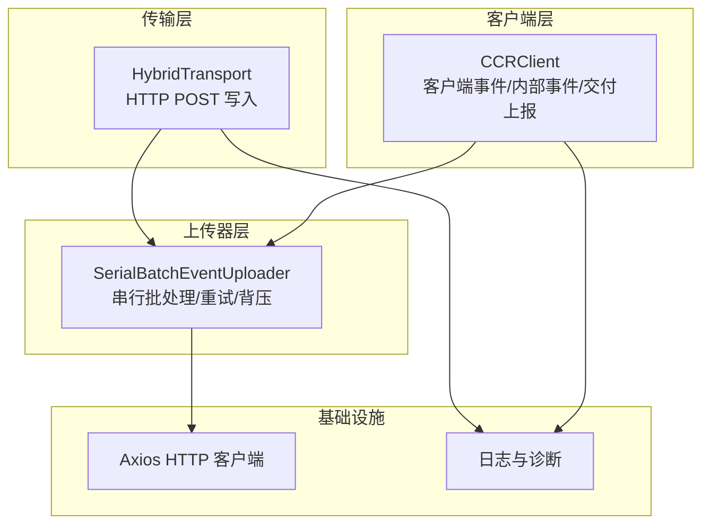
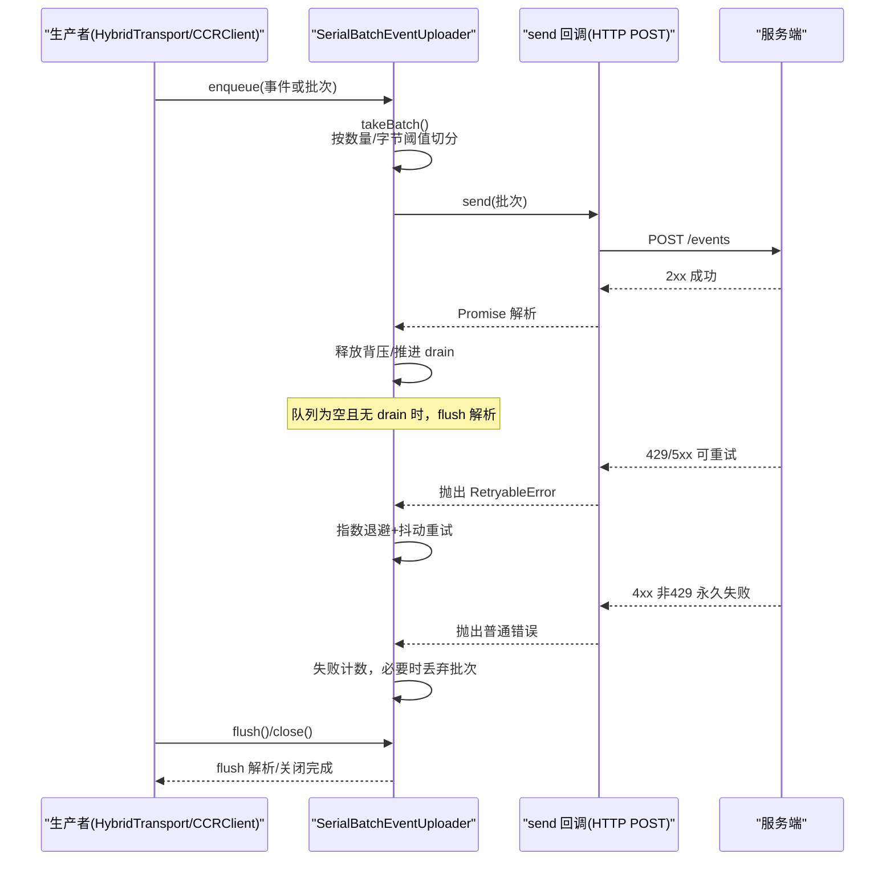
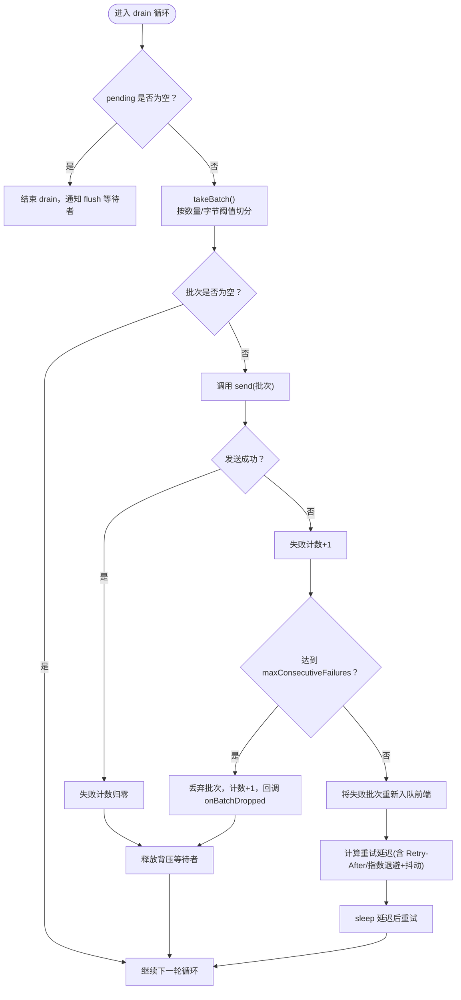
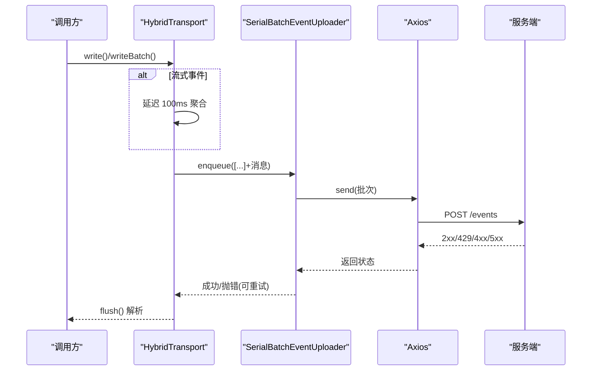
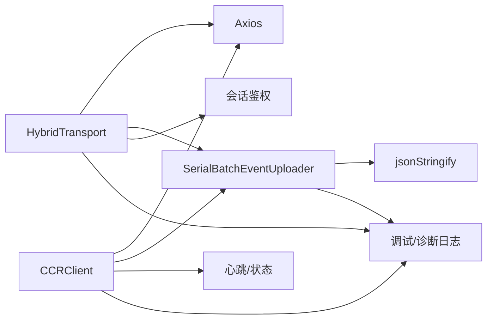

# 批量事件上传器

<cite>
**本文引用的文件**
- [SerialBatchEventUploader.ts](file://src/cli/transports/SerialBatchEventUploader.ts)
- [HybridTransport.ts](file://src/cli/transports/HybridTransport.ts)
- [ccrClient.ts](file://src/cli/transports/ccrClient.ts)
- [debug.ts](file://src/utils/debug.ts)
- [diagLogs.ts](file://src/utils/diagLogs.ts)
- [slowOperations.ts](file://src/utils/slowOperations.ts)
</cite>

## 目录
1. [简介](#简介)
2. [项目结构](#项目结构)
3. [核心组件](#核心组件)
4. [架构总览](#架构总览)
5. [详细组件分析](#详细组件分析)
6. [依赖关系分析](#依赖关系分析)
7. [性能考量](#性能考量)
8. [故障排查指南](#故障排查指南)
9. [结论](#结论)
10. [附录](#附录)

## 简介
本技术文档围绕 Claude Code 的批量事件上传器进行系统化阐述，重点聚焦于 SerialBatchEventUploader 的设计原理与实现机制，涵盖事件收集、批处理与序列化策略；同时给出批量上传的性能优化技术（队列管理、背压控制、内存优化）、事件去重与顺序保证、完整性检查机制，以及上传策略选择算法（大小阈值、时间窗口、优先级排序）。文档还提供了配置参数、监控指标、错误处理策略、调试方法、性能分析与故障排除指南，并总结了不同场景下的使用模式与最佳实践。

## 项目结构
批量事件上传能力由三个层次协同实现：
- 底层通用上传器：SerialBatchEventUploader 提供统一的串行批处理、重试与背压控制能力。
- 传输适配层：HybridTransport 将写入路径桥接为 HTTP POST，结合流式事件缓冲与定时聚合，委托 SerialBatchEventUploader 完成最终发送。
- 业务客户端：ccrClient 将各类事件（客户端事件、内部事件、交付状态）通过各自的 SerialBatchEventUploader 进行分发与持久化，统一管理心跳、鉴权与幂等性。



图表来源
- [HybridTransport.ts:54-108](file://src/cli/transports/HybridTransport.ts#L54-L108)
- [SerialBatchEventUploader.ts:64-77](file://src/cli/transports/SerialBatchEventUploader.ts#L64-L77)
- [ccrClient.ts:286-436](file://src/cli/transports/ccrClient.ts#L286-L436)

章节来源
- [SerialBatchEventUploader.ts:1-15](file://src/cli/transports/SerialBatchEventUploader.ts#L1-L15)
- [HybridTransport.ts:24-53](file://src/cli/transports/HybridTransport.ts#L24-L53)
- [ccrClient.ts:262-324](file://src/cli/transports/ccrClient.ts#L262-L324)

## 核心组件
- SerialBatchEventUploader：提供串行批处理、指数退避重试、背压阻塞、批次丢弃保护与 flush/close 生命周期管理。
- HybridTransport：面向 CLI 的混合传输，负责将消息写入 HTTP POST，支持流事件延迟聚合与超时控制。
- CCRClient：面向会话的客户端，封装三类上传器（客户端事件、内部事件、交付状态），并集成心跳与鉴权。

章节来源
- [SerialBatchEventUploader.ts:64-104](file://src/cli/transports/SerialBatchEventUploader.ts#L64-L104)
- [HybridTransport.ts:54-108](file://src/cli/transports/HybridTransport.ts#L54-L108)
- [ccrClient.ts:286-436](file://src/cli/transports/ccrClient.ts#L286-L436)

## 架构总览
批量上传的端到端流程如下：
- 事件产生：HybridTransport 或 CCRClient 收集事件。
- 流式聚合：对流式事件（如内容增量）进行短周期延迟聚合，减少请求次数。
- 批次生成：根据 maxBatchSize 与 maxBatchBytes 计算批次大小。
- 序列化与发送：调用 send 回调（HTTP POST）执行单次发送。
- 错误处理：网络/429/5xx 触发重试；4xx 非 429 视为永久失败；可设置最大连续失败阈值以丢弃批次。
- 背压与关闭：enqueue 在队列满时阻塞；close 清空队列并释放等待者；flush 等待队列清空。



图表来源
- [SerialBatchEventUploader.ts:156-202](file://src/cli/transports/SerialBatchEventUploader.ts#L156-L202)
- [SerialBatchEventUploader.ts:204-233](file://src/cli/transports/SerialBatchEventUploader.ts#L204-L233)
- [SerialBatchEventUploader.ts:235-253](file://src/cli/transports/SerialBatchEventUploader.ts#L235-L253)
- [HybridTransport.ts:202-261](file://src/cli/transports/HybridTransport.ts#L202-L261)
- [ccrClient.ts:359-436](file://src/cli/transports/ccrClient.ts#L359-L436)

## 详细组件分析

### SerialBatchEventUploader 设计与实现
- 串行批处理与序列化
  - takeBatch 依据 maxBatchSize 与 maxBatchBytes 生成批次；首项必入，后续项在累计字节不超过阈值时加入。
  - 使用统一的 JSON 序列化策略，遇到不可序列化项会丢弃该条目，避免毒化队列导致 flush 死等。
- 重试与退避
  - send 抛出 RetryableError 时，优先采用服务端建议的 Retry-After（经抖动与上下限钳制），否则采用指数退避 + 抖动。
  - 最大延迟上限与抖动范围可配置，防止“惊群效应”。
- 背压与队列管理
  - enqueue 在 pendingCount + 新增条目超过 maxQueueSize 时阻塞，直至 drain 释放背压。
  - drain 仅允许单实例运行，确保串行发送与顺序一致性。
- 关闭与刷新
  - flush 在队列空闲时立即解析；若仍在发送，则等待 drain 结束后解析。
  - close 清空队列并释放所有阻塞的 enqueue 与 flush 调用，用于优雅退出。
- 批次丢弃保护
  - maxConsecutiveFailures 达到阈值时，丢弃当前批次并前进，避免持久失败拖垮整体。
  - 提供 droppedBatchCount 用于诊断统计。



图表来源
- [SerialBatchEventUploader.ts:156-202](file://src/cli/transports/SerialBatchEventUploader.ts#L156-L202)
- [SerialBatchEventUploader.ts:204-233](file://src/cli/transports/SerialBatchEventUploader.ts#L204-L233)
- [SerialBatchEventUploader.ts:235-253](file://src/cli/transports/SerialBatchEventUploader.ts#L235-L253)

章节来源
- [SerialBatchEventUploader.ts:64-104](file://src/cli/transports/SerialBatchEventUploader.ts#L64-L104)
- [SerialBatchEventUploader.ts:156-202](file://src/cli/transports/SerialBatchEventUploader.ts#L156-L202)
- [SerialBatchEventUploader.ts:204-233](file://src/cli/transports/SerialBatchEventUploader.ts#L204-L233)
- [SerialBatchEventUploader.ts:235-253](file://src/cli/transports/SerialBatchEventUploader.ts#L235-L253)

### HybridTransport 传输适配
- 写入路径
  - write/writeBatch 将消息交由 SerialBatchEventUploader.enqueue；流式事件（stream_event）延迟至 100ms 后批量入队，提升吞吐并降低请求次数。
  - flush() 保证在返回前完成队列清空。
- 发送策略
  - postOnce 单次尝试 POST，429/5xx 视为可重试，抛出错误交由上传器重试；4xx 非 429 视为永久失败直接丢弃；网络异常记录诊断日志并抛错。
  - 设置 POST 超时上限，避免单个卡顿请求阻塞整个序列化队列。
- 关闭策略
  - close() 先尽力 flush，再给定宽限期（3s）让剩余队列有机会发送，最后调用 uploader.close()。
- 配置要点
  - maxBatchSize：500
  - maxQueueSize：100000（高水位，主要受内存约束）
  - baseDelayMs/maxDelayMs/jitterMs：500/8000/1000
  - maxConsecutiveFailures：可选，用于持久失败场景下的安全降级



图表来源
- [HybridTransport.ts:117-138](file://src/cli/transports/HybridTransport.ts#L117-L138)
- [HybridTransport.ts:149-152](file://src/cli/transports/HybridTransport.ts#L149-L152)
- [HybridTransport.ts:202-261](file://src/cli/transports/HybridTransport.ts#L202-L261)

章节来源
- [HybridTransport.ts:54-108](file://src/cli/transports/HybridTransport.ts#L54-L108)
- [HybridTransport.ts:117-138](file://src/cli/transports/HybridTransport.ts#L117-L138)
- [HybridTransport.ts:149-152](file://src/cli/transports/HybridTransport.ts#L149-L152)
- [HybridTransport.ts:171-195](file://src/cli/transports/HybridTransport.ts#L171-L195)
- [HybridTransport.ts:202-261](file://src/cli/transports/HybridTransport.ts#L202-L261)

### CCRClient 客户端
- 事件类型
  - 客户端事件：对外可见，通过 /worker/events 上报。
  - 内部事件：对前端不可见，用于会话恢复与转录，通过 /worker/internal-events 上报。
  - 交付状态：上报事件接收/处理/完成状态，通过 /worker/events/delivery 上报。
- 文本增量聚合
  - 对同一内容块的 text_delta 进行累积，每 100ms flush 一次，输出完整快照，保证中途连接也能看到自包含的内容。
- 心跳与鉴权
  - 定期发送心跳，带抖动；401/403 且令牌有效时进行阈值内重试；409 触发 epoch 不匹配处理。
- 上传器配置
  - 客户端事件：maxBatchSize=100，maxBatchBytes≈10MB，maxQueueSize=100000
  - 内部事件：maxBatchSize=100，maxBatchBytes≈10MB，maxQueueSize=200
  - 交付状态：maxBatchSize=64，maxQueueSize=64
  - 统一 baseDelayMs/maxDelayMs/jitterMs=500/30000/500

```mermaid
classDiagram
class CCRClient {
+initialize(epoch?)
+writeEvent(message)
+writeInternalEvent(type,payload,{isCompaction,agentId})
+flush()
+flushInternalEvents()
+reportDelivery(eventId,status)
+close()
}
class SerialBatchEventUploader_Client {
+enqueue(items)
+flush()
+close()
}
class SerialBatchEventUploader_Internal {
+enqueue(items)
+flush()
+close()
}
class SerialBatchEventUploader_Delivery {
+enqueue(items)
+flush()
+close()
}
CCRClient --> SerialBatchEventUploader_Client : "客户端事件"
CCRClient --> SerialBatchEventUploader_Internal : "内部事件"
CCRClient --> SerialBatchEventUploader_Delivery : "交付状态"
```

图表来源
- [ccrClient.ts:286-436](file://src/cli/transports/ccrClient.ts#L286-L436)
- [ccrClient.ts:735-751](file://src/cli/transports/ccrClient.ts#L735-L751)
- [ccrClient.ts:793-814](file://src/cli/transports/ccrClient.ts#L793-L814)
- [ccrClient.ts:964-969](file://src/cli/transports/ccrClient.ts#L964-L969)

章节来源
- [ccrClient.ts:286-436](file://src/cli/transports/ccrClient.ts#L286-L436)
- [ccrClient.ts:735-751](file://src/cli/transports/ccrClient.ts#L735-L751)
- [ccrClient.ts:793-814](file://src/cli/transports/ccrClient.ts#L793-L814)
- [ccrClient.ts:964-969](file://src/cli/transports/ccrClient.ts#L964-L969)

## 依赖关系分析
- SerialBatchEventUploader 依赖
  - 序列化工具：统一 JSON 序列化，避免循环引用与不可序列化对象导致的阻塞。
  - 日志工具：用于调试与诊断，不包含 PII。
- HybridTransport 依赖
  - 会话鉴权：从会话入口获取访问令牌，注入 Authorization。
  - Axios：HTTP 客户端，设置超时与状态校验。
- CCRClient 依赖
  - 会话状态与心跳：维持 worker 状态与存活。
  - 请求封装：统一处理 429 Retry-After、401/403 令牌有效性判断与重试阈值。



图表来源
- [SerialBatchEventUploader.ts:1](file://src/cli/transports/SerialBatchEventUploader.ts#L1)
- [HybridTransport.ts:1-11](file://src/cli/transports/HybridTransport.ts#L1-L11)
- [ccrClient.ts:1-31](file://src/cli/transports/ccrClient.ts#L1-L31)

章节来源
- [SerialBatchEventUploader.ts:1](file://src/cli/transports/SerialBatchEventUploader.ts#L1)
- [HybridTransport.ts:1-11](file://src/cli/transports/HybridTransport.ts#L1-L11)
- [ccrClient.ts:1-31](file://src/cli/transports/ccrClient.ts#L1-L31)

## 性能考量
- 队列与背压
  - maxQueueSize 作为内存上限的软约束，避免无限增长；enqueue 在队列满时阻塞，保障下游稳定。
- 批次策略
  - 数量阈值与字节阈值双轨控制，兼顾吞吐与负载上限；首项必入避免空批次。
- 重试与抖动
  - Retry-After 优先，指数退避 + 抖动，限制最大延迟，避免“惊群效应”。
- 流式聚合
  - 100ms 窗口聚合流式事件，显著降低请求次数，提升整体吞吐。
- 超时与隔离
  - 单次 POST 超时上限，避免个别请求阻塞全局序列化队列。
- 内存优化
  - takeBatch 使用 splice 截取，避免频繁数组移动；对不可序列化项直接丢弃，防止毒化队列。

章节来源
- [SerialBatchEventUploader.ts:204-233](file://src/cli/transports/SerialBatchEventUploader.ts#L204-L233)
- [SerialBatchEventUploader.ts:235-253](file://src/cli/transports/SerialBatchEventUploader.ts#L235-L253)
- [HybridTransport.ts:12-22](file://src/cli/transports/HybridTransport.ts#L12-L22)
- [HybridTransport.ts:202-261](file://src/cli/transports/HybridTransport.ts#L202-L261)
- [ccrClient.ts:359-436](file://src/cli/transports/ccrClient.ts#L359-L436)

## 故障排查指南
- 常见错误与处理
  - 429/5xx：触发重试，遵循 Retry-After 或指数退避；可通过 maxConsecutiveFailures 保护避免长期阻塞。
  - 4xx 非 429：视为永久失败，直接丢弃该批次。
  - 网络异常：记录诊断日志并抛错，交由上传器重试。
  - 令牌问题：401/403 且令牌有效时进行阈值内重试；过期令牌直接退出。
- 诊断与日志
  - 调试日志：启用 --debug 或 /debug，输出详细运行轨迹。
  - 诊断日志：不包含 PII 的结构化日志，记录关键事件与耗时。
- 关键指标
  - droppedBatchCount：统计因连续失败而丢弃的批次总数。
  - pendingCount：队列深度，可用于监控背压与积压。
  - 服务器响应码分布与 Retry-After 分布：辅助评估服务端限流策略与退避效果。
- 排查步骤
  - 检查 maxQueueSize 是否接近上限，确认是否存在持续高并发写入。
  - 观察 droppedBatchCount 是否上升，确认是否需要调整 maxConsecutiveFailures。
  - 查看诊断日志中的 POST 状态与错误分类，定位是网络、鉴权还是服务端限流问题。
  - 在低负载时段复现，结合调试日志定位异常路径。

章节来源
- [SerialBatchEventUploader.ts:169-190](file://src/cli/transports/SerialBatchEventUploader.ts#L169-L190)
- [HybridTransport.ts:202-261](file://src/cli/transports/HybridTransport.ts#L202-L261)
- [ccrClient.ts:556-642](file://src/cli/transports/ccrClient.ts#L556-L642)
- [debug.ts:203-228](file://src/utils/debug.ts#L203-L228)
- [diagLogs.ts:27-57](file://src/utils/diagLogs.ts#L27-L57)

## 结论
SerialBatchEventUploader 通过串行化、批处理、背压与重试机制，为上层传输与客户端提供了稳健的事件上传能力。HybridTransport 与 CCRClient 在此基础上实现了流式聚合、多类型事件分发与会话生命周期管理。通过合理的阈值配置、抖动退避与诊断日志，系统在高并发与不稳定网络环境下仍能保持稳定性与可观测性。

## 附录

### 配置参数与默认值
- SerialBatchEventUploader 通用配置
  - maxBatchSize：批次最大条目数
  - maxBatchBytes：批次最大字节数（可选，未设置则仅按数量限制）
  - maxQueueSize：队列最大容量（enqueue 在此阈值阻塞）
  - baseDelayMs/maxDelayMs/jitterMs：指数退避基础/上限/抖动
  - maxConsecutiveFailures：连续失败阈值（可选）
  - onBatchDropped：批次丢弃回调
- HybridTransport 默认配置
  - maxBatchSize：500
  - maxQueueSize：100000
  - baseDelayMs/maxDelayMs/jitterMs：500/8000/1000
  - POST 超时：15000ms
  - 流式事件延迟：100ms
- CCRClient 默认配置
  - 客户端事件：maxBatchSize=100，maxBatchBytes≈10MB，maxQueueSize=100000
  - 内部事件：maxBatchSize=100，maxBatchBytes≈10MB，maxQueueSize=200
  - 交付状态：maxBatchSize=64，maxQueueSize=64
  - baseDelayMs/maxDelayMs/jitterMs：500/30000/500

章节来源
- [SerialBatchEventUploader.ts:35-62](file://src/cli/transports/SerialBatchEventUploader.ts#L35-L62)
- [HybridTransport.ts:76-105](file://src/cli/transports/HybridTransport.ts#L76-L105)
- [ccrClient.ts:359-436](file://src/cli/transports/ccrClient.ts#L359-L436)

### 监控指标
- droppedBatchCount：批次丢弃计数（flush 前后差值）
- pendingCount：队列深度
- 诊断日志事件：cli_hybrid_*、cli_worker_* 系列，包含错误分类与耗时

章节来源
- [SerialBatchEventUploader.ts:84-94](file://src/cli/transports/SerialBatchEventUploader.ts#L84-L94)
- [HybridTransport.ts:93-103](file://src/cli/transports/HybridTransport.ts#L93-L103)
- [ccrClient.ts:556-642](file://src/cli/transports/ccrClient.ts#L556-L642)

### 错误处理策略
- 可重试错误：429/5xx，遵循 Retry-After 或指数退避
- 永久错误：4xx 非 429，直接丢弃
- 网络错误：记录诊断日志并抛错，交由上传器重试
- 鉴权错误：401/403 且令牌有效时阈值内重试；过期令牌直接退出

章节来源
- [SerialBatchEventUploader.ts:169-190](file://src/cli/transports/SerialBatchEventUploader.ts#L169-L190)
- [HybridTransport.ts:238-261](file://src/cli/transports/HybridTransport.ts#L238-L261)
- [ccrClient.ts:586-642](file://src/cli/transports/ccrClient.ts#L586-L642)

### 调试方法与性能分析
- 启用调试日志：--debug 或 /debug，输出详细运行轨迹
- 诊断日志：结构化日志，记录关键事件与耗时
- 性能分析：结合诊断日志中的耗时事件与 droppedBatchCount，定位瓶颈
- 堆栈与资源：配合堆转储与资源监控工具进行深入分析

章节来源
- [debug.ts:203-228](file://src/utils/debug.ts#L203-L228)
- [diagLogs.ts:72-94](file://src/utils/diagLogs.ts#L72-L94)

### 使用模式与最佳实践
- 高频流式事件
  - 使用 HybridTransport 的 100ms 聚合窗口，显著降低请求次数
  - 合理设置 maxBatchSize 与 maxBatchBytes，避免单次过大
- 稳定环境
  - 适当提高 maxQueueSize，减少背压阻塞
  - 降低 baseDelayMs，缩短重试等待
- 不稳定网络
  - 降低 baseDelayMs，增大 jitterMs，避免“惊群效应”
  - 设置 maxConsecutiveFailures，保护系统免受持久失败影响
- 会话恢复
  - 使用 CCRClient 的内部事件上传器，确保转录与状态可恢复

章节来源
- [HybridTransport.ts:12-22](file://src/cli/transports/HybridTransport.ts#L12-L22)
- [ccrClient.ts:359-436](file://src/cli/transports/ccrClient.ts#L359-L436)