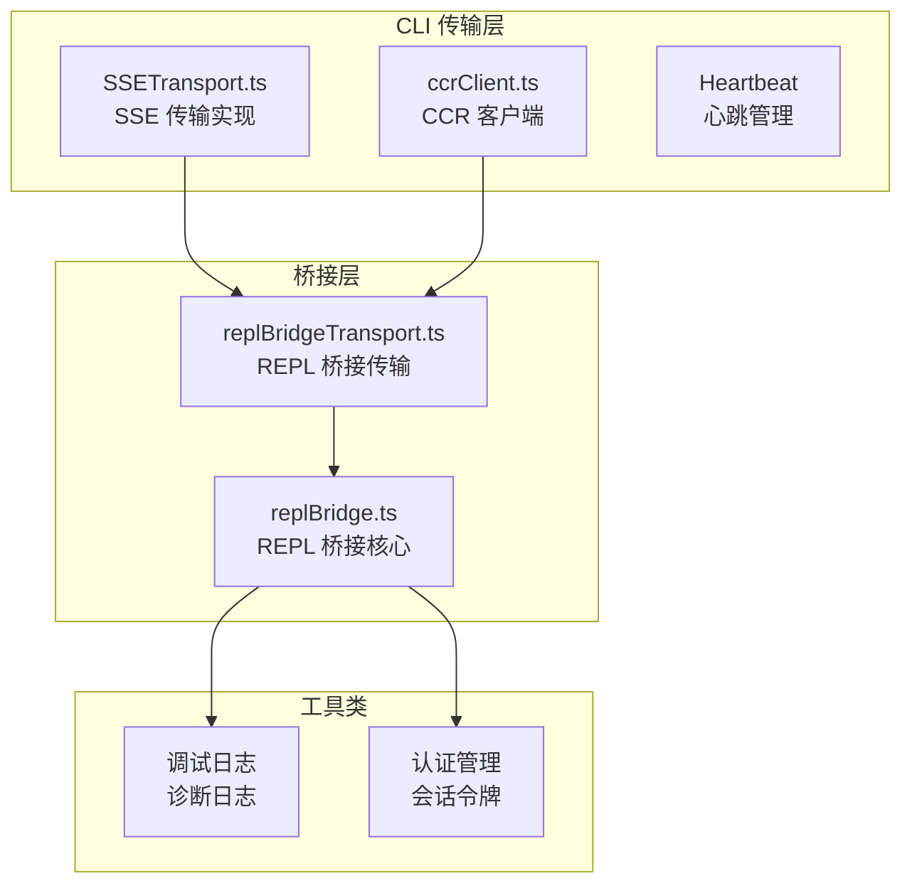
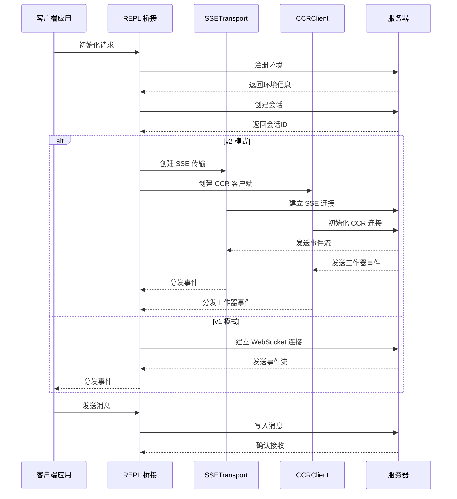
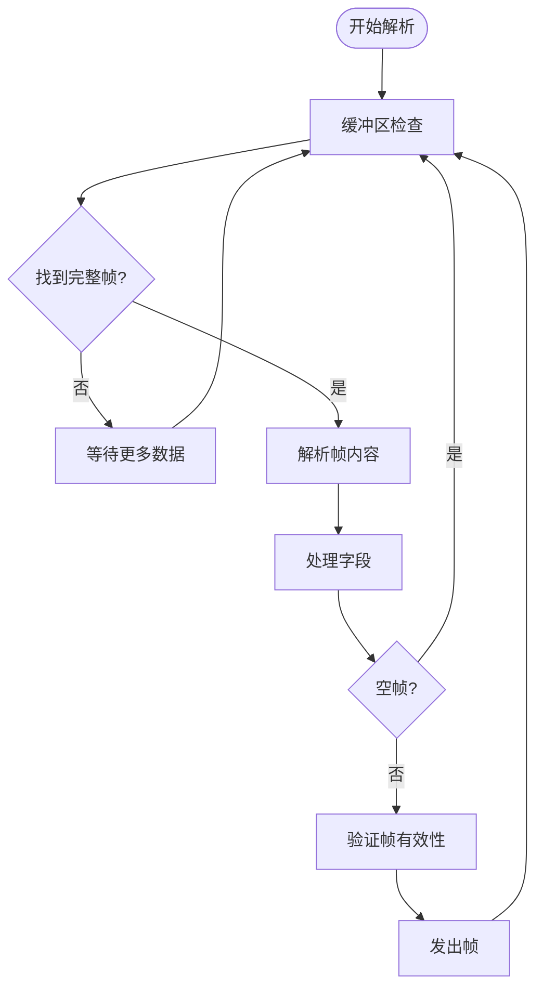
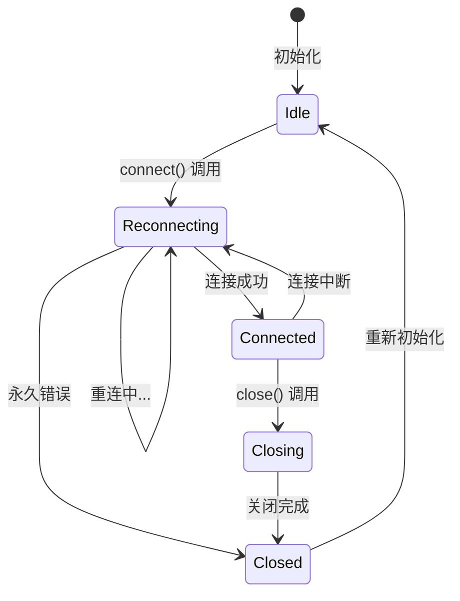
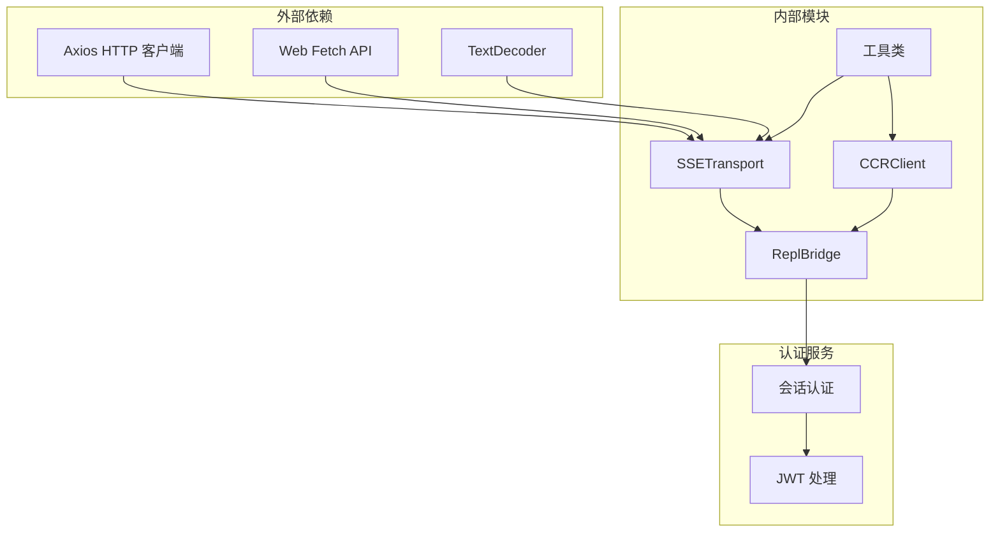

# 服务器推送事件传输

<cite>
**本文档引用的文件**
- [SSETransport.ts](file://src/cli/transports/SSETransport.ts)
- [replBridgeTransport.ts](file://src/bridge/replBridgeTransport.ts)
- [replBridge.ts](file://src/bridge/replBridge.ts)
- [ccrClient.ts](file://src/cli/transports/ccrClient.ts)
</cite>

## 目录
1. [简介](#简介)
2. [项目结构](#项目结构)
3. [核心组件](#核心组件)
4. [架构概览](#架构概览)
5. [详细组件分析](#详细组件分析)
6. [依赖关系分析](#依赖关系分析)
7. [性能考虑](#性能考虑)
8. [故障排除指南](#故障排除指南)
9. [结论](#结论)
10. [附录](#附录)

## 简介

Claude Code 服务器推送事件（SSE）传输协议是实现客户端与服务器之间实时双向通信的核心机制。该系统基于 Server-Sent Events 协议，为 Claude Code 的远程控制和会话管理提供了可靠的数据传输通道。

SSETransport 是整个传输系统的核心组件，它实现了以下关键功能：
- 基于 HTTP 的单向事件流传输
- 自动重连机制和指数退避算法
- 心跳检测和超时处理
- 事件序列号管理和去重机制
- 客户端事件分发和处理

## 项目结构

该项目采用模块化架构设计，SSE 传输相关的核心文件分布如下：



**图表来源**
- [SSETransport.ts:149-161](file://src/cli/transports/SSETransport.ts#L149-L161)
- [replBridgeTransport.ts:119-156](file://src/bridge/replBridgeTransport.ts#L119-L156)
- [replBridge.ts:549-562](file://src/bridge/replBridge.ts#L549-L562)

**章节来源**
- [SSETransport.ts:1-712](file://src/cli/transports/SSETransport.ts#L1-L712)
- [replBridgeTransport.ts:1-371](file://src/bridge/replBridgeTransport.ts#L1-L371)
- [replBridge.ts:1-800](file://src/bridge/replBridge.ts#L1-L800)

## 核心组件

### SSETransport 类

SSETransport 是基于 Server-Sent Events 协议的传输实现，支持以下核心特性：

#### 连接状态管理
- **空闲状态 (idle)**: 初始状态，等待连接
- **重新连接中 (reconnecting)**: 正在尝试建立连接
- **已连接 (connected)**: 数据传输正常
- **关闭中 (closing)**: 正在关闭连接
- **已关闭 (closed)**: 连接完全断开

#### 事件解析机制
SSETransport 实现了完整的 SSE 帧解析器，能够处理：
- 多行数据字段合并
- 事件类型识别
- 序列号管理
- 注释行过滤

#### 重连策略
采用指数退避算法，最大重连延迟为 30 秒，总重连预算为 10 分钟。

**章节来源**
- [SSETransport.ts:122-128](file://src/cli/transports/SSETransport.ts#L122-L128)
- [SSETransport.ts:46-116](file://src/cli/transports/SSETransport.ts#L46-L116)
- [SSETransport.ts:162-162](file://src/cli/transports/SSETransport.ts#L162-L162)

### REPL 桥接传输

replBridgeTransport 提供了 v1 和 v2 版本的统一接口抽象：

#### v1 版本 (HybridTransport)
- 使用 WebSocket 进行读取
- 使用 HTTP POST 进行写入
- 支持会话入口 (Session-Ingress)

#### v2 版本 (SSETransport + CCRClient)
- 使用 SSE 进行读取
- 使用 CCRClient 进行写入
- 支持 CCR v2 工作器协议

**章节来源**
- [replBridgeTransport.ts:23-70](file://src/bridge/replBridgeTransport.ts#L23-L70)
- [replBridgeTransport.ts:105-156](file://src/bridge/replBridgeTransport.ts#L105-L156)

## 架构概览



**图表来源**
- [replBridge.ts:1077-1166](file://src/bridge/replBridge.ts#L1077-L1166)
- [replBridgeTransport.ts:156-371](file://src/bridge/replBridgeTransport.ts#L156-L371)

## 详细组件分析

### SSE 帧解析器

SSETransport 实现了高效的帧解析机制：



**图表来源**
- [SSETransport.ts:58-116](file://src/cli/transports/SSETransport.ts#L58-L116)

#### 字段处理规则
- **event**: 事件类型标识
- **id**: 序列号，用于恢复和去重
- **data**: 实际数据内容，支持多行合并
- **注释**: 以冒号开头的行，用于心跳保持

**章节来源**
- [SSETransport.ts:74-113](file://src/cli/transports/SSETransport.ts#L74-L113)

### 连接管理机制



**图表来源**
- [SSETransport.ts:122-128](file://src/cli/transports/SSETransport.ts#L122-L128)
- [SSETransport.ts:470-535](file://src/cli/transports/SSETransport.ts#L470-L535)

#### 重连策略实现
- **基础延迟**: 1 秒
- **最大延迟**: 30 秒  
- **时间预算**: 10 分钟
- **抖动**: ±25%
- **指数退避**: 2^n

**章节来源**
- [SSETransport.ts:16-27](file://src/cli/transports/SSETransport.ts#L16-L27)
- [SSETransport.ts:502-523](file://src/cli/transports/SSETransport.ts#L502-L523)

### 心跳检测和超时处理

SSETransport 实现了双重的心跳保护机制：

#### 服务器心跳
- **发送间隔**: 15 秒
- **检测超时**: 45 秒静默期

#### 客户端心跳
- **Liveness 检测**: 45 秒无响应则触发重连
- **自动重置**: 每收到一个帧都会重置计时器

**章节来源**
- [SSETransport.ts:20-21](file://src/cli/transports/SSETransport.ts#L20-L21)
- [SSETransport.ts:542-566](file://src/cli/transports/SSETransport.ts#L542-L566)

### 事件格式和数据编码

#### SSE 事件格式
每个事件由多个字段组成，使用冒号分隔：

```
event: client_event
id: 12345
data: {"event_id":"evt_123","sequence_num":12345,"event_type":"message","payload":{}}
```

#### 数据编码规范
- **JSON 编码**: 所有数据以 JSON 格式传输
- **换行符**: 多行数据使用 `\n` 连接
- **序列号**: 使用十进制整数标识事件顺序

**章节来源**
- [SSETransport.ts:46-50](file://src/cli/transports/SSETransport.ts#L46-L50)
- [SSETransport.ts:101-104](file://src/cli/transports/SSETransport.ts#L101-L104)

## 依赖关系分析



**图表来源**
- [SSETransport.ts:1-10](file://src/cli/transports/SSETransport.ts#L1-L10)
- [ccrClient.ts:1-31](file://src/cli/transports/ccrClient.ts#L1-L31)

### 组件耦合度分析

SSETransport 与其他组件的耦合关系：
- **低耦合**: 通过接口抽象与上层组件交互
- **高内聚**: 专注于传输层逻辑，职责单一
- **可测试性**: 导出内部函数用于单元测试

**章节来源**
- [SSETransport.ts:38-40](file://src/cli/transports/SSETransport.ts#L38-L40)
- [replBridgeTransport.ts:1-10](file://src/bridge/replBridgeTransport.ts#L1-L10)

## 性能考虑

### 内存优化策略

#### 流式解码
- 使用 `TextDecoder` 的流模式避免重复分配
- 单个 decoder 实例在整个连接生命周期中复用

#### 序列号管理
- 维护最近 200 个序列号的集合
- 当超过阈值时清理过期的序列号

#### 事件去重
- 基于 Set 的 O(1) 查找复杂度
- 防止内存无限增长的自适应清理机制

**章节来源**
- [SSETransport.ts:34-35](file://src/cli/transports/SSETransport.ts#L34-L35)
- [SSETransport.ts:368-378](file://src/cli/transports/SSETransport.ts#L368-L378)

### 网络性能优化

#### 连接池管理
- 单连接复用多个事件类型
- 减少 TCP 握手开销

#### 批量处理
- SSE 传输按帧处理，无批量需求
- 写操作通过 CCRClient 的批量上传器处理

## 故障排除指南

### 常见错误类型

#### 连接失败
- **401/403**: 认证失败，检查令牌有效性
- **404**: 会话不存在，需要重新创建
- **网络超时**: 检查网络连接和代理设置

#### 传输异常
- **帧解析错误**: 检查服务器事件格式
- **序列号冲突**: 服务器端事件编号不连续
- **心跳超时**: 网络延迟过高或服务器负载

**章节来源**
- [SSETransport.ts:27-27](file://src/cli/transports/SSETransport.ts#L27-L27)
- [SSETransport.ts:470-535](file://src/cli/transports/SSETransport.ts#L470-L535)

### 调试和监控

#### 日志级别
- **调试日志**: 详细的操作跟踪
- **诊断日志**: 错误分类和统计
- **错误日志**: 异常情况记录

#### 监控指标
- 连接成功率
- 平均重连时间
- 事件丢失率
- 帧解析错误率

**章节来源**
- [SSETransport.ts:326-332](file://src/cli/transports/SSETransport.ts#L326-L332)
- [replBridgeTransport.ts:311-314](file://src/bridge/replBridgeTransport.ts#L311-L314)

## 结论

SSETransport 为 Claude Code 提供了可靠的服务器推送事件传输机制。其设计特点包括：

1. **可靠性**: 完善的重连机制和错误恢复策略
2. **效率**: 流式处理和内存优化
3. **可扩展性**: 模块化设计支持多种传输模式
4. **可观测性**: 丰富的日志和监控能力

该实现成功地平衡了实时性要求和系统稳定性，在复杂的网络环境中提供了可靠的事件传输服务。

## 附录

### 配置参数参考

| 参数名称 | 默认值 | 说明 |
|---------|--------|------|
| 基础重连延迟 | 1000ms | 初始重连等待时间 |
| 最大重连延迟 | 30000ms | 重连延迟上限 |
| 重连时间预算 | 600000ms | 总重连时间限制 |
| Liveness 超时 | 45000ms | 心跳检测超时 |
| POST 最大重试 | 10次 | 写操作重试次数 |

### 使用示例

#### 基本连接示例
```typescript
const sseTransport = new SSETransport(
  new URL('https://api.example.com/events/stream'),
  { Authorization: 'Bearer token' },
  'session-123'
);

sseTransport.setOnData((data) => {
  console.log('收到事件:', data);
});

sseTransport.connect();
```

#### 高级配置示例
```typescript
const transport = new SSETransport(
  url,
  headers,
  sessionId,
  refreshHeaders,
  initialSequenceNum,
  getAuthHeaders
);

transport.setOptions({
  heartbeatInterval: 20000,
  maxRetries: 5
});
```