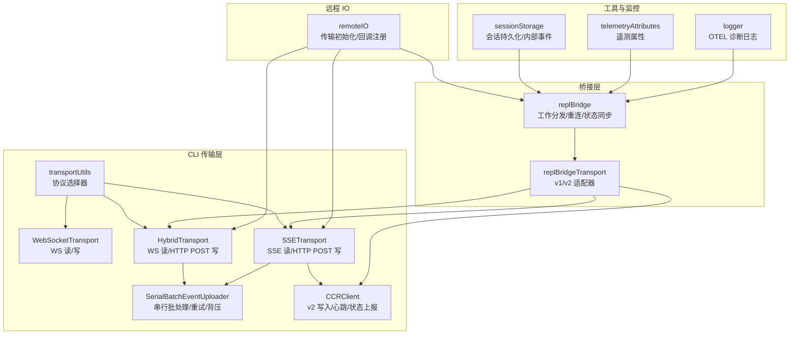
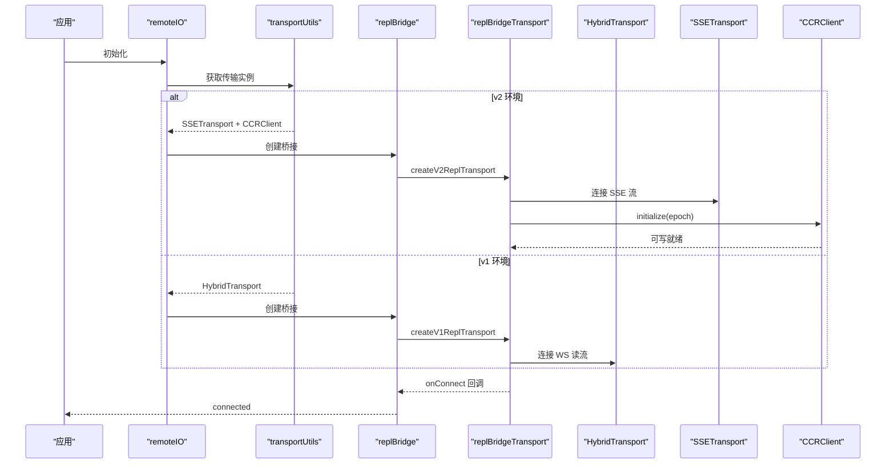
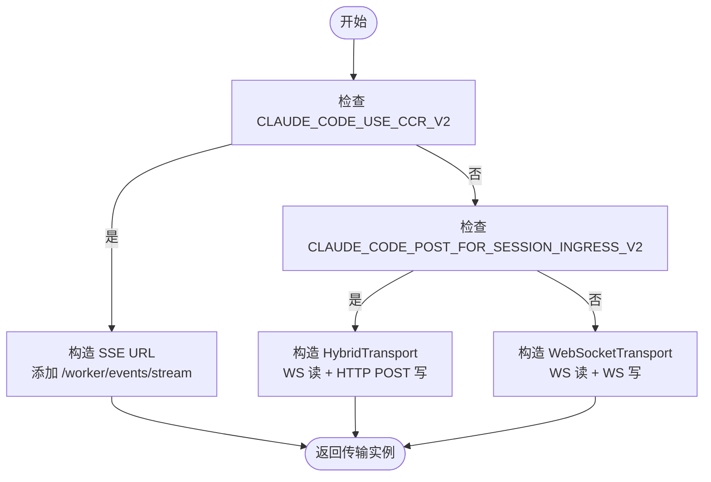
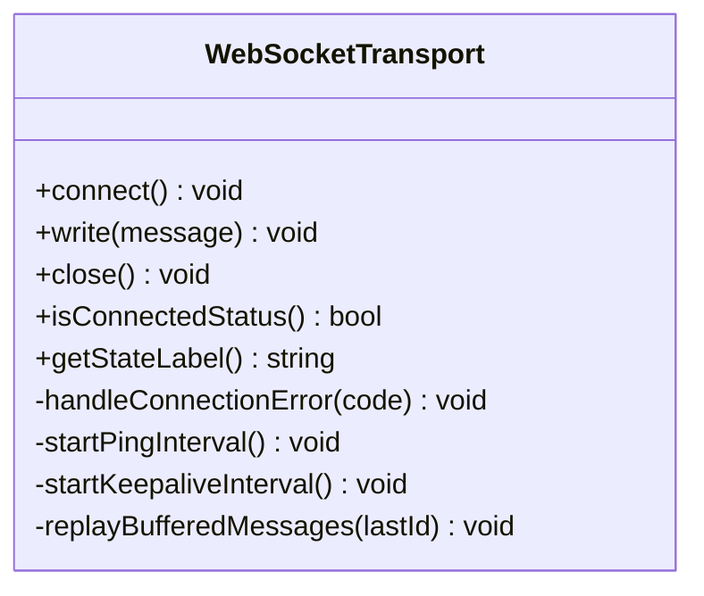
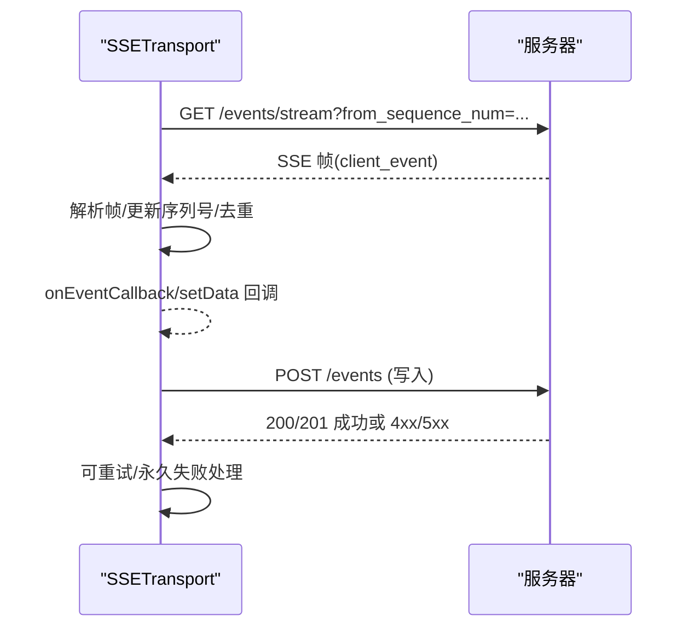
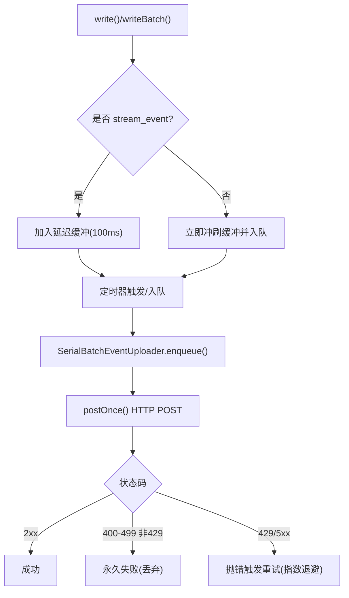
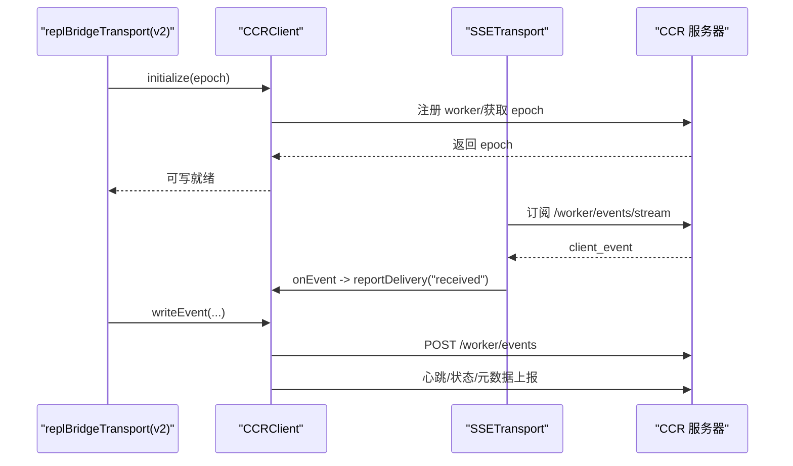
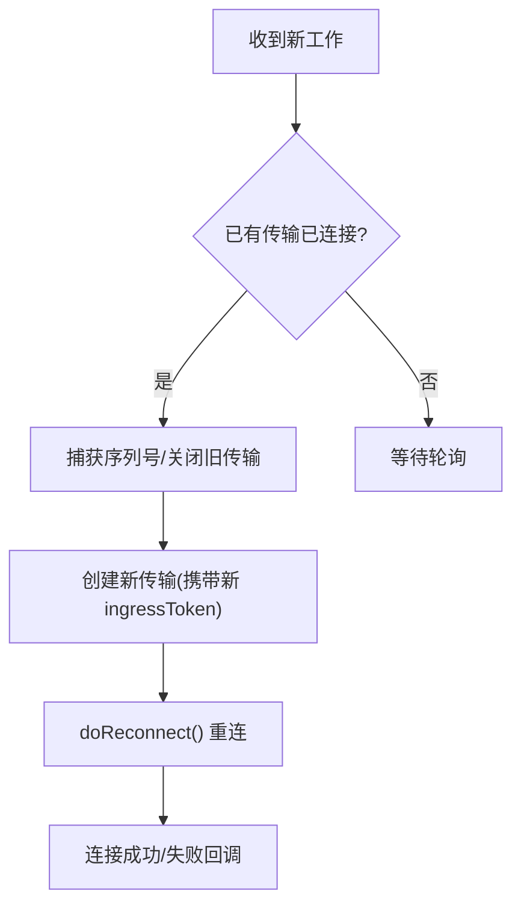
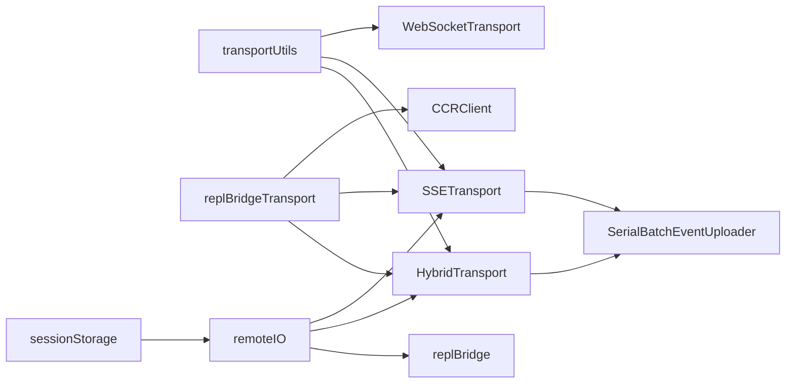

# 混合传输协议

<cite>
**本文档引用的文件**
- [HybridTransport.ts](file://src/cli/transports/HybridTransport.ts)
- [WebSocketTransport.ts](file://src/cli/transports/WebSocketTransport.ts)
- [SSETransport.ts](file://src/cli/transports/SSETransport.ts)
- [transportUtils.ts](file://src/cli/transports/transportUtils.ts)
- [SerialBatchEventUploader.ts](file://src/cli/transports/SerialBatchEventUploader.ts)
- [replBridge.ts](file://src/bridge/replBridge.ts)
- [replBridgeTransport.ts](file://src/bridge/replBridgeTransport.ts)
- [ccrClient.ts](file://src/cli/transports/ccrClient.ts)
- [remoteIO.ts](file://src/cli/remoteIO.ts)
- [bridgeMain.ts](file://src/bridge/bridgeMain.ts)
- [bridgeDebug.ts](file://src/bridge/bridgeDebug.ts)
- [bridgeApi.ts](file://src/bridge/bridgeApi.ts)
- [sessionStorage.ts](file://src/utils/sessionStorage.ts)
- [telemetryAttributes.ts](file://src/utils/telemetryAttributes.ts)
- [logger.ts](file://src/utils/telemetry/logger.ts)
</cite>

## 目录
1. [简介](#简介)
2. [项目结构](#项目结构)
3. [核心组件](#核心组件)
4. [架构总览](#架构总览)
5. [详细组件分析](#详细组件分析)
6. [依赖关系分析](#依赖关系分析)
7. [性能考虑](#性能考虑)
8. [故障排查指南](#故障排查指南)
9. [结论](#结论)
10. [附录](#附录)

## 简介
本文件系统性阐述 Claude Code 的混合传输协议（HybridTransport）设计与实现，重点覆盖以下方面：
- 在不同传输协议间进行智能选择与切换：WebSocket、Server-Sent Events（SSE）、以及混合读写路径（WS 读 + HTTP POST 写）。
- 协议协商机制、连接建立流程与故障转移策略。
- 性能优化技术：带宽自适应、延迟优化、序列化与批处理、背压与重试。
- 错误处理机制、重连策略与状态同步。
- 配置选项、监控指标与调试方法。
- 实际使用模式与最佳实践。

## 项目结构
混合传输相关代码主要分布在 CLI 传输层与桥接层：
- CLI 传输层：WebSocketTransport、SSETransport、HybridTransport、SerialBatchEventUploader、transportUtils、ccrClient。
- 桥接层：replBridge、replBridgeTransport，负责工作分发、重连与状态同步。
- 远程 IO：remoteIO，负责将传输层与会话存储、事件上报等集成。
- 工具与监控：sessionStorage、telemetryAttributes、logger 等。

**图表来源**
- [transportUtils.ts:8-46](file://src/cli/transports/transportUtils.ts#L8-L46)
- [WebSocketTransport.ts:74-800](file://src/cli/transports/WebSocketTransport.ts#L74-L800)
- [SSETransport.ts:162-712](file://src/cli/transports/SSETransport.ts#L162-L712)
- [HybridTransport.ts:54-283](file://src/cli/transports/HybridTransport.ts#L54-L283)
- [SerialBatchEventUploader.ts:64-276](file://src/cli/transports/SerialBatchEventUploader.ts#L64-L276)
- [replBridge.ts:1-200](file://src/bridge/replBridge.ts#L1-L200)
- [replBridgeTransport.ts:1-371](file://src/bridge/replBridgeTransport.ts#L1-L371)
- [remoteIO.ts:1-172](file://src/cli/remoteIO.ts#L1-L172)
- [sessionStorage.ts:1276-1389](file://src/utils/sessionStorage.ts#L1276-L1389)
- [telemetryAttributes.ts:29-42](file://src/utils/telemetryAttributes.ts#L29-L42)
- [logger.ts:1-26](file://src/utils/telemetry/logger.ts#L1-L26)

**章节来源**
- [transportUtils.ts:8-46](file://src/cli/transports/transportUtils.ts#L8-L46)
- [remoteIO.ts:1-172](file://src/cli/remoteIO.ts#L1-L172)

## 核心组件
- 协议选择器（transportUtils）：根据环境变量与 URL 协议动态选择 SSETransport、HybridTransport 或 WebSocketTransport。
- WebSocketTransport：通用 WebSocket 读写、心跳检测、自动重连、消息重放与去重。
- SSETransport：SSE 读取 + HTTP POST 写入，支持 Last-Event-ID 恢复、序列号去重与存活检测。
- HybridTransport：WebSocket 读 + HTTP POST 写，结合 SerialBatchEventUploader 实现有序批处理与无限重试。
- SerialBatchEventUploader：串行批处理、指数退避重试、背压控制、可选丢弃阈值。
- CCRClient：v2 写入路径（HTTP POST）、心跳、状态上报、交付跟踪。
- replBridge/replBridgeTransport：工作分发、重连策略、v1/v2 传输适配、状态同步。
- remoteIO：统一初始化传输、注册内部事件读写、命令生命周期上报。
- sessionStorage：会话持久化（v2 使用内部事件），快速刷新策略。
- 遥测与日志：telemetryAttributes、logger 提供可观测性。

**章节来源**
- [transportUtils.ts:8-46](file://src/cli/transports/transportUtils.ts#L8-L46)
- [WebSocketTransport.ts:74-800](file://src/cli/transports/WebSocketTransport.ts#L74-L800)
- [SSETransport.ts:162-712](file://src/cli/transports/SSETransport.ts#L162-L712)
- [HybridTransport.ts:54-283](file://src/cli/transports/HybridTransport.ts#L54-L283)
- [SerialBatchEventUploader.ts:64-276](file://src/cli/transports/SerialBatchEventUploader.ts#L64-L276)
- [ccrClient.ts:1-200](file://src/cli/transports/ccrClient.ts#L1-L200)
- [replBridge.ts:1-200](file://src/bridge/replBridge.ts#L1-L200)
- [replBridgeTransport.ts:1-371](file://src/bridge/replBridgeTransport.ts#L1-L371)
- [remoteIO.ts:1-172](file://src/cli/remoteIO.ts#L1-L172)
- [sessionStorage.ts:1276-1389](file://src/utils/sessionStorage.ts#L1276-L1389)
- [telemetryAttributes.ts:29-42](file://src/utils/telemetryAttributes.ts#L29-L42)
- [logger.ts:1-26](file://src/utils/telemetry/logger.ts#L1-L26)

## 架构总览
混合传输通过“读写分离”的方式在不同协议间灵活切换：
- v1（Session Ingress）：WebSocketTransport 负责读写，HybridTransport 复用其读能力并以 HTTP POST 写入。
- v2（CCR）：SSETransport 负责读取，CCRClient 负责写入与心跳；也可通过 transportUtils 选择纯 SSE 写入路径。

**图表来源**
- [remoteIO.ts:1-172](file://src/cli/remoteIO.ts#L1-L172)
- [transportUtils.ts:8-46](file://src/cli/transports/transportUtils.ts#L8-L46)
- [replBridgeTransport.ts:119-371](file://src/bridge/replBridgeTransport.ts#L119-L371)
- [replBridge.ts:1-200](file://src/bridge/replBridge.ts#L1-L200)

## 详细组件分析

### 协议选择与协商
- 优先级：
  1) 当设置 CLAUDE_CODE_USE_CCR_V2 时，使用 SSETransport（SSE 读 + HTTP POST 写）。
  2) 当 URL 为 ws/wss 且设置 CLAUDE_CODE_POST_FOR_SESSION_INGRESS_V2 时，使用 HybridTransport（WS 读 + HTTP POST 写）。
  3) 默认使用 WebSocketTransport（WS 读 + WS 写）。
- URL 转换：
  - HybridTransport：将 ws/wss URL 转换为对应 HTTP POST 端点。
  - SSETransport：将 SSE 流 URL 转换为事件 POST 端点。

**图表来源**
- [transportUtils.ts:8-46](file://src/cli/transports/transportUtils.ts#L8-L46)
- [HybridTransport.ts:269-283](file://src/cli/transports/HybridTransport.ts#L269-L283)
- [SSETransport.ts:704-712](file://src/cli/transports/SSETransport.ts#L704-L712)

**章节来源**
- [transportUtils.ts:8-46](file://src/cli/transports/transportUtils.ts#L8-L46)
- [HybridTransport.ts:269-283](file://src/cli/transports/HybridTransport.ts#L269-L283)
- [SSETransport.ts:704-712](file://src/cli/transports/SSETransport.ts#L704-L712)

### WebSocketTransport：读写与重连
- 读：统一事件处理，区分 Bun 与 Node 的 WebSocket 实现，支持 ping/pong 健康检测与 keep-alive 数据帧。
- 写：消息缓冲（基于 UUID 去重），断线后按 Last-Request-Id 或服务端响应头进行重放。
- 重连：指数退避 + 抖动，时间预算限制；检测系统休眠（睡眠间隙超阈值）并重置重连预算；永久关闭码（如 1002/4001/4003）不重试。
- 关闭：清理定时器、移除监听、注销会话活动回调。

**图表来源**
- [WebSocketTransport.ts:74-800](file://src/cli/transports/WebSocketTransport.ts#L74-L800)

**章节来源**
- [WebSocketTransport.ts:74-800](file://src/cli/transports/WebSocketTransport.ts#L74-L800)

### SSETransport：SSE 读 + HTTP POST 写
- 读：SSE 流解析（增量帧解析），Last-Event-ID 支持恢复；序列号去重与高水位标记；存活检测（45s 无帧则重连）。
- 写：HTTP POST，最大重试次数与指数退避；4xx（非 429）视为永久失败；429/5xx 视为可重试。
- 认证：支持 Cookie 与 Bearer Token，避免同时发送导致冲突。

**图表来源**
- [SSETransport.ts:162-712](file://src/cli/transports/SSETransport.ts#L162-L712)

**章节来源**
- [SSETransport.ts:162-712](file://src/cli/transports/SSETransport.ts#L162-L712)

### HybridTransport：WS 读 + HTTP POST 写
- 读：继承 WebSocketTransport 的读能力。
- 写：将消息批量进入 SerialBatchEventUploader，单次 POST 最多 500 条，队列容量 100,000；超时 15s；失败抛出以便重试。
- 批处理：高频内容增量在 100ms 窗口内合并，保证顺序与减少请求次数；非流式消息先冲刷缓冲再写入。
- 关闭：优雅期 3s，先 flush 再 close，避免丢失最后一批。

**图表来源**
- [HybridTransport.ts:117-261](file://src/cli/transports/HybridTransport.ts#L117-L261)
- [SerialBatchEventUploader.ts:64-276](file://src/cli/transports/SerialBatchEventUploader.ts#L64-L276)

**章节来源**
- [HybridTransport.ts:54-283](file://src/cli/transports/HybridTransport.ts#L54-L283)
- [SerialBatchEventUploader.ts:64-276](file://src/cli/transports/SerialBatchEventUploader.ts#L64-L276)

### CCRClient：v2 写入、心跳与状态上报
- 写入：通过 HTTP POST 将事件写入 CCR v2；与 SSETransport 的写入目标不同（后者针对 Session Ingress）。
- 心跳：默认 20s，可配置抖动；与 SSETransport 并行运行。
- 状态上报：PUT /worker/state、PUT /worker/external_metadata。
- 交付跟踪：收到 SSE 事件后上报 received/processing/processed。
- 初始化：注册 worker、获取 epoch；epoch 不匹配时触发重连策略。

**图表来源**
- [replBridgeTransport.ts:119-371](file://src/bridge/replBridgeTransport.ts#L119-L371)
- [ccrClient.ts:1-200](file://src/cli/transports/ccrClient.ts#L1-L200)

**章节来源**
- [replBridgeTransport.ts:119-371](file://src/bridge/replBridgeTransport.ts#L119-L371)
- [ccrClient.ts:1-200](file://src/cli/transports/ccrClient.ts#L1-L200)

### 桥接层：工作分发、重连与状态同步
- 工作分发：replBridge 通过轮询获取新工作，若已有传输连接则替换并携带最新 ingressToken。
- 重连策略：环境重建计数、最大尝试次数、捕获序列号高水位、唤醒轮询循环。
- 关闭处理：记录序列号、清空刷新门、区分干净关闭与永久拒绝。
- v1/v2 适配：createV1ReplTransport 包装 HybridTransport；createV2ReplTransport 组合 SSETransport + CCRClient。

**图表来源**
- [replBridge.ts:617-1188](file://src/bridge/replBridge.ts#L617-L1188)
- [replBridge.ts:878-927](file://src/bridge/replBridge.ts#L878-L927)
- [replBridgeTransport.ts:78-103](file://src/bridge/replBridgeTransport.ts#L78-L103)

**章节来源**
- [replBridge.ts:617-1188](file://src/bridge/replBridge.ts#L617-L1188)
- [replBridge.ts:878-927](file://src/bridge/replBridge.ts#L878-L927)
- [replBridgeTransport.ts:78-103](file://src/bridge/replBridgeTransport.ts#L78-L103)

## 依赖关系分析
- 协议选择依赖环境变量与 URL 协议，决定使用 SSETransport、HybridTransport 或 WebSocketTransport。
- HybridTransport 依赖 SerialBatchEventUploader 实现写入的串行化、批处理与重试。
- v2 路径中，replBridgeTransport 同时依赖 SSETransport（读）与 CCRClient（写），并通过回调桥接状态与事件。
- remoteIO 负责统一初始化与回调注册，确保传输与会话存储、事件上报协同工作。
- sessionStorage 在启用 CCR 时切换到内部事件写入，并调整刷新间隔。

**图表来源**
- [transportUtils.ts:8-46](file://src/cli/transports/transportUtils.ts#L8-L46)
- [HybridTransport.ts:54-108](file://src/cli/transports/HybridTransport.ts#L54-L108)
- [SSETransport.ts:162-219](file://src/cli/transports/SSETransport.ts#L162-L219)
- [WebSocketTransport.ts:74-133](file://src/cli/transports/WebSocketTransport.ts#L74-L133)
- [replBridgeTransport.ts:1-71](file://src/bridge/replBridgeTransport.ts#L1-L71)
- [remoteIO.ts:1-172](file://src/cli/remoteIO.ts#L1-L172)
- [sessionStorage.ts:1276-1389](file://src/utils/sessionStorage.ts#L1276-L1389)

**章节来源**
- [transportUtils.ts:8-46](file://src/cli/transports/transportUtils.ts#L8-L46)
- [HybridTransport.ts:54-108](file://src/cli/transports/HybridTransport.ts#L54-L108)
- [SSETransport.ts:162-219](file://src/cli/transports/SSETransport.ts#L162-L219)
- [WebSocketTransport.ts:74-133](file://src/cli/transports/WebSocketTransport.ts#L74-L133)
- [replBridgeTransport.ts:1-71](file://src/bridge/replBridgeTransport.ts#L1-L71)
- [remoteIO.ts:1-172](file://src/cli/remoteIO.ts#L1-L172)
- [sessionStorage.ts:1276-1389](file://src/utils/sessionStorage.ts#L1276-L1389)

## 性能考虑
- 带宽自适应与批处理：HybridTransport 与 SerialBatchEventUploader 将高频小事件合并为批，降低请求数量；SSETransport 也采用批处理策略。
- 延迟优化：100ms 窗口聚合 stream_event，减少网络往返；SSETransport 的存活检测（45s）与 WebSocketTransport 的 ping/pong 防止僵尸连接。
- 背压与重试：SerialBatchEventUploader 在队列满时阻塞入队，防止内存膨胀；指数退避 + 抖动避免风暴；可配置最大连续失败阈值丢弃批次。
- 刷新策略：启用 CCR 时将会话持久化刷新间隔降至最低，提升实时性。

**章节来源**
- [HybridTransport.ts:117-138](file://src/cli/transports/HybridTransport.ts#L117-L138)
- [SerialBatchEventUploader.ts:64-276](file://src/cli/transports/SerialBatchEventUploader.ts#L64-L276)
- [SSETransport.ts:16-41](file://src/cli/transports/SSETransport.ts#L16-L41)
- [WebSocketTransport.ts:697-758](file://src/cli/transports/WebSocketTransport.ts#L697-L758)
- [sessionStorage.ts:1344-1361](file://src/utils/sessionStorage.ts#L1344-L1361)

## 故障排查指南
- 重连预算耗尽：WebSocketTransport 与 SSETransport 均有时间预算（约 10 分钟），超过后转为 closed；可通过 sleep 检测与重置逻辑识别系统休眠。
- 永久关闭码：1002/4001/4003 等视为永久拒绝，不再重试；4003 可通过 refreshHeaders 刷新认证后重试。
- 写入失败：HybridTransport 对 4xx 非 429 视为永久失败；SSETransport 对 4xx 非 429 丢弃；两者均对 429/5xx 重试。
- v2 初始化失败：replBridgeTransport 捕获 CCRClient 初始化异常并关闭资源，触发轮询重试。
- 诊断与日志：大量诊断事件（如 cli_websocket_connect_connected、cli_sse_reconnect_attempt、cli_hybrid_post_retryable_error）可用于定位问题；OTEL 诊断日志通过 ClaudeCodeDiagLogger 输出。

**章节来源**
- [WebSocketTransport.ts:465-554](file://src/cli/transports/WebSocketTransport.ts#L465-L554)
- [SSETransport.ts:467-535](file://src/cli/transports/SSETransport.ts#L467-L535)
- [HybridTransport.ts:197-261](file://src/cli/transports/HybridTransport.ts#L197-L261)
- [replBridgeTransport.ts:346-367](file://src/bridge/replBridgeTransport.ts#L346-L367)
- [logger.ts:1-26](file://src/utils/telemetry/logger.ts#L1-L26)

## 结论
混合传输通过“读写分离”与“协议选择器”实现了在不同场景下的最优路径：
- v1：HybridTransport 以 WS 读 + HTTP POST 写，兼顾可靠性与低延迟。
- v2：SSETransport + CCRClient 提供更强的写入能力与状态/交付追踪。
- 通过统一的桥接层与传输层抽象，系统实现了平滑的故障转移、状态同步与可观测性。

## 附录

### 配置选项
- 环境变量
  - CLAUDE_CODE_USE_CCR_V2：启用 v2（SSE 读 + HTTP POST 写）。
  - CLAUDE_CODE_POST_FOR_SESSION_INGRESS_V2：启用 HybridTransport（WS 读 + HTTP POST 写）。
  - CLAUDE_CODE_SESSION_ACCESS_TOKEN：v2 写入使用的会话令牌（多会话场景需通过 getAuthToken 提供）。
  - OTEL_METRICS_*：遥测属性控制（如是否包含 session.id、version 等）。
- 传输参数
  - HybridTransport：maxBatchSize、maxQueueSize、baseDelayMs、maxDelayMs、jitterMs、maxConsecutiveFailures。
  - SSETransport：POST 最大重试次数、指数退避参数、存活超时。
  - WebSocketTransport：自动重连开关、桥接模式标记、ping/keepalive 间隔。

**章节来源**
- [transportUtils.ts:8-46](file://src/cli/transports/transportUtils.ts#L8-L46)
- [HybridTransport.ts:74-108](file://src/cli/transports/HybridTransport.ts#L74-L108)
- [SSETransport.ts:16-41](file://src/cli/transports/SSETransport.ts#L16-L41)
- [WebSocketTransport.ts:48-58](file://src/cli/transports/WebSocketTransport.ts#L48-L58)
- [telemetryAttributes.ts:9-27](file://src/utils/telemetryAttributes.ts#L9-L27)

### 监控指标与调试
- 诊断事件：cli_websocket_*、cli_sse_*、cli_hybrid_* 系列事件，涵盖连接、重连、消息收发、错误类型等。
- 遥测属性：用户 ID、会话 ID、版本等，受 OTEL_METRICS_* 控制。
- OTEL 诊断日志：通过 ClaudeCodeDiagLogger 输出 OTEL 相关错误与警告。
- 调试命令：bridge-kick 支持注入故障（如 registerBridgeEnvironment 403/503、reconnectSession 404），便于测试重连与降级路径。

**章节来源**
- [telemetryAttributes.ts:29-42](file://src/utils/telemetryAttributes.ts#L29-L42)
- [logger.ts:1-26](file://src/utils/telemetry/logger.ts#L1-L26)
- [bridgeDebug.ts:116-157](file://src/bridge/bridgeDebug.ts#L116-L157)

### 使用模式与最佳实践
- v1 场景：优先使用 HybridTransport，确保写入可靠；注意批处理窗口与队列大小配置。
- v2 场景：使用 transportUtils 自动选择 SSETransport + CCRClient；通过 getAuthToken 提供多会话安全认证；启用 CCR 后使用内部事件写入提升实时性。
- 重连策略：遵循 replBridge 的重连上限与环境重建计数；在系统休眠场景下依赖睡眠检测逻辑重置重连预算。
- 故障注入：利用 bridge-kick 注入临时性/永久性错误，验证重连与降级路径。

**章节来源**
- [transportUtils.ts:8-46](file://src/cli/transports/transportUtils.ts#L8-L46)
- [replBridgeTransport.ts:119-371](file://src/bridge/replBridgeTransport.ts#L119-L371)
- [bridge-kick.ts:116-157](file://src/commands/bridge-kick.ts#L116-L157)