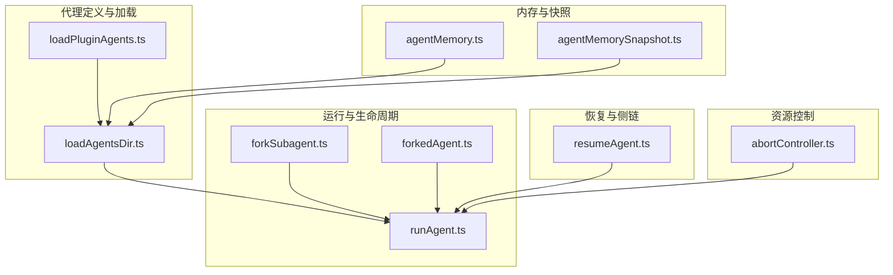
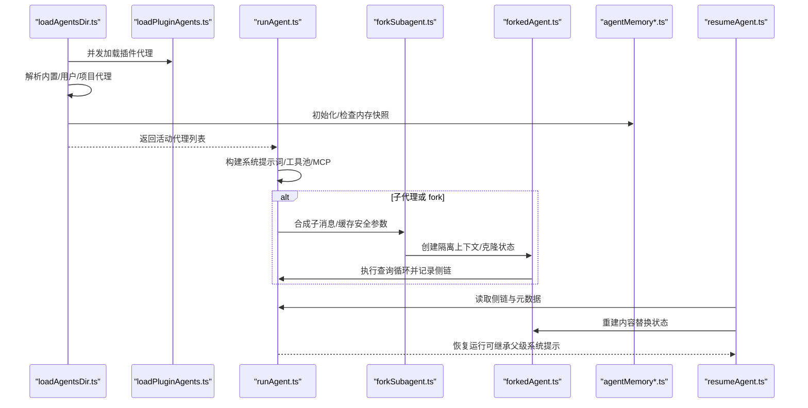
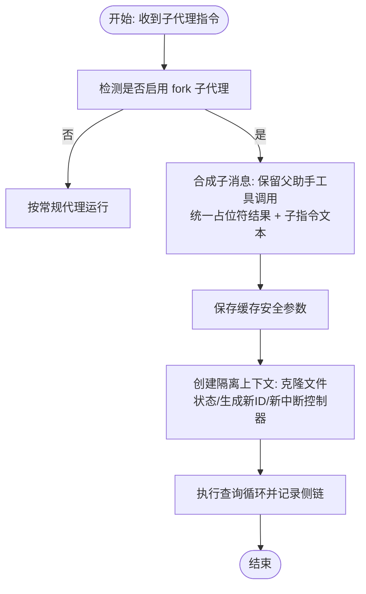
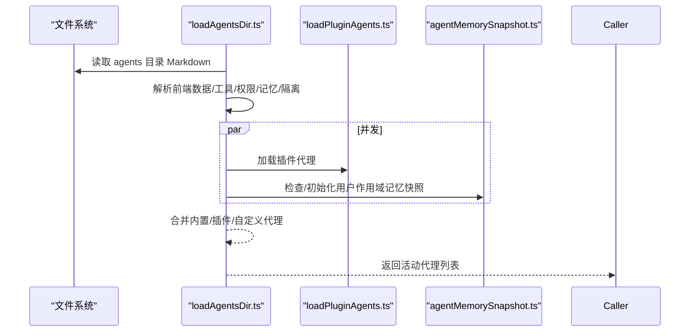
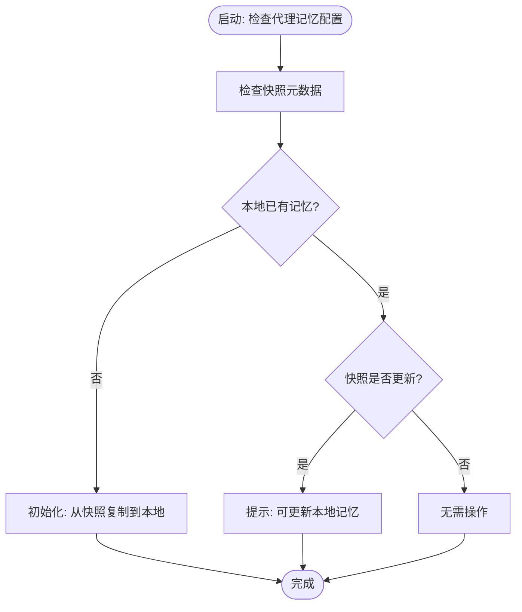
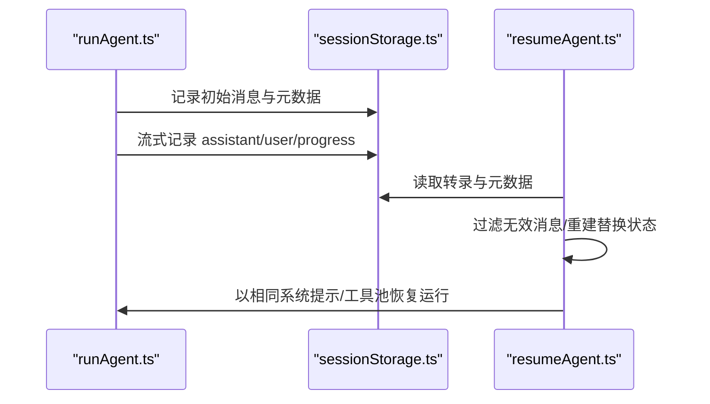
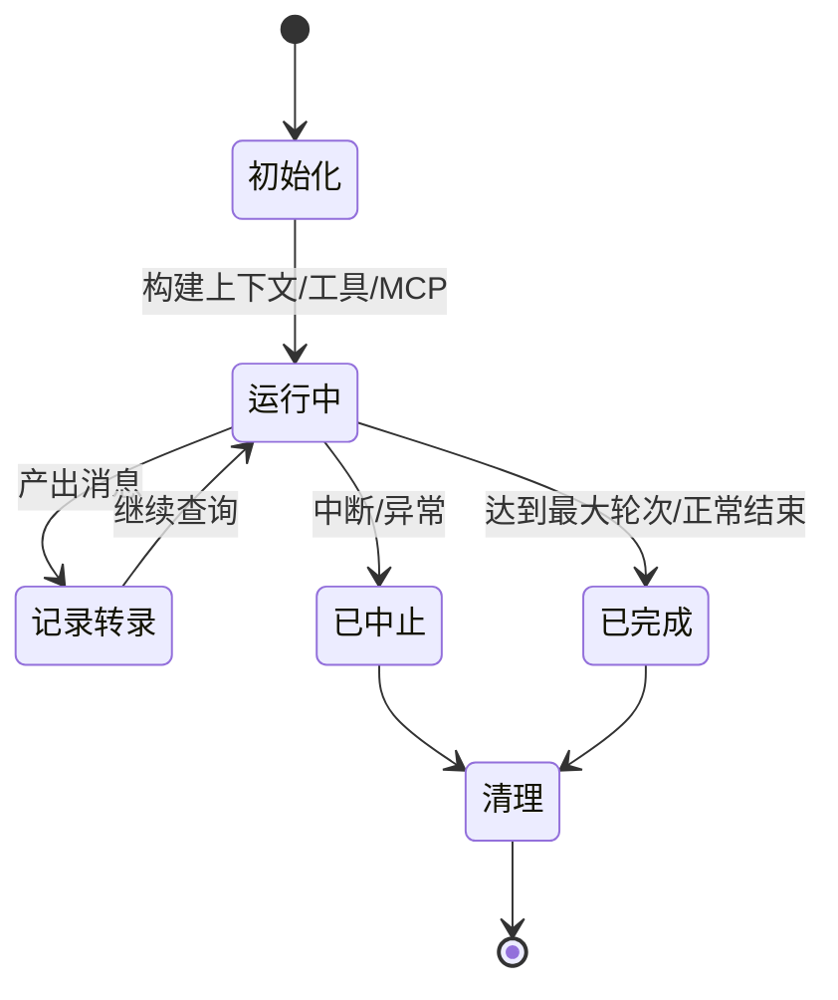
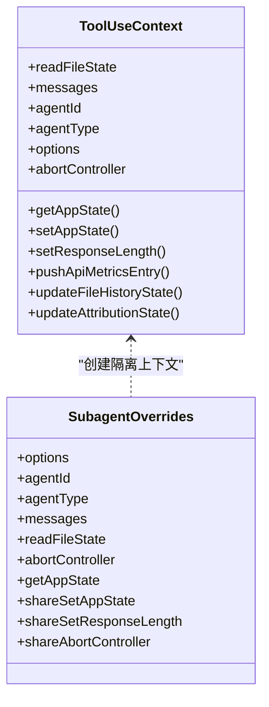
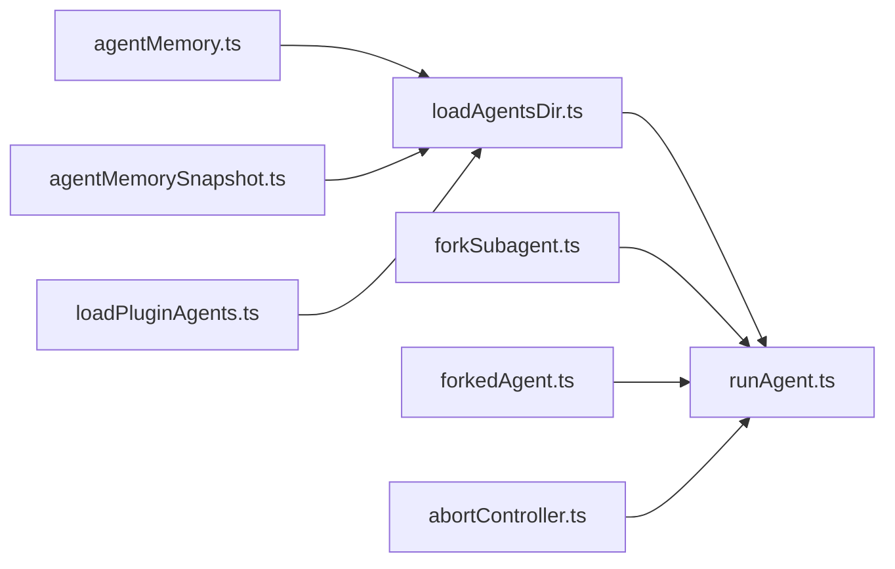

# 代理创建与管理

<cite>
**本文档引用的文件**
- [src/tools/AgentTool/forkSubagent.ts](file://src/tools/AgentTool/forkSubagent.ts)
- [src/utils/forkedAgent.ts](file://src/utils/forkedAgent.ts)
- [src/tools/AgentTool/agentMemory.ts](file://src/tools/AgentTool/agentMemory.ts)
- [src/tools/AgentTool/agentMemorySnapshot.ts](file://src/tools/AgentTool/agentMemorySnapshot.ts)
- [src/tools/AgentTool/loadAgentsDir.ts](file://src/tools/AgentTool/loadAgentsDir.ts)
- [src/tools/AgentTool/runAgent.ts](file://src/tools/AgentTool/runAgent.ts)
- [src/tools/AgentTool/resumeAgent.ts](file://src/tools/AgentTool/resumeAgent.ts)
- [src/utils/abortController.ts](file://src/utils/abortController.ts)
- [src/utils/plugins/loadPluginAgents.ts](file://src/utils/plugins/loadPluginAgents.ts)
- [src/cli/print.ts](file://src/cli/print.ts)
</cite>

## 目录
1. [简介](#简介)
2. [项目结构](#项目结构)
3. [核心组件](#核心组件)
4. [架构总览](#架构总览)
5. [详细组件分析](#详细组件分析)
6. [依赖关系分析](#依赖关系分析)
7. [性能考量](#性能考量)
8. [故障排查指南](#故障排查指南)
9. [结论](#结论)
10. [附录](#附录)

## 简介
本文件系统性阐述代理（Agent）的创建、运行、管理与生命周期机制，重点覆盖以下主题：
- 子代理创建与 forkSubagent 工作原理
- 代理目录加载与动态发现流程
- 代理内存管理（agentMemory 与 agentMemorySnapshot）
- 代理状态保存与恢复（含快照与侧链转录）
- 生命周期管理（从创建到销毁）
- 资源控制与限制（权限、令牌、并发、超时）
- API 接口与使用方法
- 代理间资源共享与隔离策略

## 项目结构
围绕代理管理的关键模块分布如下：
- Agent 定义与加载：loadAgentsDir.ts
- 运行与生命周期：runAgent.ts
- 子代理与 fork：forkSubagent.ts、forkedAgent.ts
- 内存与快照：agentMemory.ts、agentMemorySnapshot.ts
- 恢复与侧链：resumeAgent.ts、sessionStorage.ts（工具函数）
- 资源控制：abortController.ts、policyLimits（策略限制）、capacityWake（容量唤醒）

**图表来源**
- [src/tools/AgentTool/loadAgentsDir.ts:296-393](file://src/tools/AgentTool/loadAgentsDir.ts#L296-L393)
- [src/utils/plugins/loadPluginAgents.ts:242-295](file://src/utils/plugins/loadPluginAgents.ts#L242-L295)
- [src/tools/AgentTool/runAgent.ts:248-860](file://src/tools/AgentTool/runAgent.ts#L248-L860)
- [src/tools/AgentTool/forkSubagent.ts:1-211](file://src/tools/AgentTool/forkSubagent.ts#L1-L211)
- [src/utils/forkedAgent.ts:489-626](file://src/utils/forkedAgent.ts#L489-L626)
- [src/tools/AgentTool/agentMemory.ts:52-178](file://src/tools/AgentTool/agentMemory.ts#L52-L178)
- [src/tools/AgentTool/agentMemorySnapshot.ts:31-198](file://src/tools/AgentTool/agentMemorySnapshot.ts#L31-L198)
- [src/tools/AgentTool/resumeAgent.ts:42-266](file://src/tools/AgentTool/resumeAgent.ts#L42-L266)
- [src/utils/abortController.ts:68-78](file://src/utils/abortController.ts#L68-L78)

**章节来源**
- [src/tools/AgentTool/loadAgentsDir.ts:296-393](file://src/tools/AgentTool/loadAgentsDir.ts#L296-L393)
- [src/utils/plugins/loadPluginAgents.ts:242-295](file://src/utils/plugins/loadPluginAgents.ts#L242-L295)
- [src/tools/AgentTool/runAgent.ts:248-860](file://src/tools/AgentTool/runAgent.ts#L248-L860)
- [src/tools/AgentTool/forkSubagent.ts:1-211](file://src/tools/AgentTool/forkSubagent.ts#L1-L211)
- [src/utils/forkedAgent.ts:489-626](file://src/utils/forkedAgent.ts#L489-L626)
- [src/tools/AgentTool/agentMemory.ts:52-178](file://src/tools/AgentTool/agentMemory.ts#L52-L178)
- [src/tools/AgentTool/agentMemorySnapshot.ts:31-198](file://src/tools/AgentTool/agentMemorySnapshot.ts#L31-L198)
- [src/tools/AgentTool/resumeAgent.ts:42-266](file://src/tools/AgentTool/resumeAgent.ts#L42-L266)
- [src/utils/abortController.ts:68-78](file://src/utils/abortController.ts#L68-L78)

## 核心组件
- 代理定义与加载
  - 动态加载内置、插件与用户/项目自定义代理定义，支持快照初始化与内存注入。
- 子代理与 fork
  - 提供 fork 开关、合成子消息、缓存安全参数传递与隔离上下文。
- 内存与快照
  - 统一的本地/项目/用户作用域内存目录，支持快照检查、初始化与替换。
- 运行与生命周期
  - 构建系统提示词、工具池、MCP 客户端，执行查询循环，记录侧链转录，清理资源。
- 恢复
  - 基于侧链转录与内容替换状态重建上下文，恢复 fork 或普通子代理。
- 资源控制
  - 中断控制器传播、权限模式、最大轮次、令牌预算等。

**章节来源**
- [src/tools/AgentTool/loadAgentsDir.ts:105-191](file://src/tools/AgentTool/loadAgentsDir.ts#L105-L191)
- [src/tools/AgentTool/forkSubagent.ts:32-71](file://src/tools/AgentTool/forkSubagent.ts#L32-L71)
- [src/utils/forkedAgent.ts:57-141](file://src/utils/forkedAgent.ts#L57-L141)
- [src/tools/AgentTool/agentMemory.ts:12-178](file://src/tools/AgentTool/agentMemory.ts#L12-L178)
- [src/tools/AgentTool/agentMemorySnapshot.ts:98-198](file://src/tools/AgentTool/agentMemorySnapshot.ts#L98-L198)
- [src/tools/AgentTool/runAgent.ts:248-860](file://src/tools/AgentTool/runAgent.ts#L248-L860)
- [src/tools/AgentTool/resumeAgent.ts:42-266](file://src/tools/AgentTool/resumeAgent.ts#L42-L266)
- [src/utils/abortController.ts:68-78](file://src/utils/abortController.ts#L68-L78)

## 架构总览
下图展示从“加载代理定义”到“运行与恢复”的整体流程，以及 fork 子代理在缓存安全与隔离方面的关键点。

**图表来源**
- [src/tools/AgentTool/loadAgentsDir.ts:296-393](file://src/tools/AgentTool/loadAgentsDir.ts#L296-L393)
- [src/utils/plugins/loadPluginAgents.ts:242-295](file://src/utils/plugins/loadPluginAgents.ts#L242-L295)
- [src/tools/AgentTool/agentMemorySnapshot.ts:98-198](file://src/tools/AgentTool/agentMemorySnapshot.ts#L98-L198)
- [src/tools/AgentTool/runAgent.ts:248-860](file://src/tools/AgentTool/runAgent.ts#L248-L860)
- [src/tools/AgentTool/forkSubagent.ts:107-169](file://src/tools/AgentTool/forkSubagent.ts#L107-L169)
- [src/utils/forkedAgent.ts:489-626](file://src/utils/forkedAgent.ts#L489-L626)
- [src/tools/AgentTool/resumeAgent.ts:42-266](file://src/tools/AgentTool/resumeAgent.ts#L42-L266)

## 详细组件分析

### 子代理创建与 forkSubagent 工作原理
- 功能开关
  - 通过特性开关与协调器模式检测决定是否启用 fork 子代理能力。
- 缓存安全
  - 通过“缓存安全参数”（系统提示、用户/系统上下文、工具上下文、fork 上下文消息）确保父子请求前缀一致，最大化提示缓存命中。
- 子消息合成
  - 将父助手消息中的所有工具调用块保留，并以统一占位符结果替换，最后附加子指令文本，形成“仅末尾差异”的消息序列，便于共享缓存。
- 防递归 fork
  - 通过在对话历史中检测特定标记，避免在子代理内部再次触发 fork。
- 子代理上下文隔离
  - 使用通用辅助函数创建隔离的工具使用上下文，克隆文件状态缓存、新生成的代理 ID、独立的中断控制器等；可按需选择共享回调。

**图表来源**
- [src/tools/AgentTool/forkSubagent.ts:32-169](file://src/tools/AgentTool/forkSubagent.ts#L32-L169)
- [src/utils/forkedAgent.ts:57-141](file://src/utils/forkedAgent.ts#L57-L141)
- [src/utils/forkedAgent.ts:345-462](file://src/utils/forkedAgent.ts#L345-L462)
- [src/tools/AgentTool/runAgent.ts:748-806](file://src/tools/AgentTool/runAgent.ts#L748-L806)

**章节来源**
- [src/tools/AgentTool/forkSubagent.ts:32-169](file://src/tools/AgentTool/forkSubagent.ts#L32-L169)
- [src/utils/forkedAgent.ts:57-141](file://src/utils/forkedAgent.ts#L57-L141)
- [src/utils/forkedAgent.ts:345-462](file://src/utils/forkedAgent.ts#L345-L462)
- [src/tools/AgentTool/runAgent.ts:748-806](file://src/tools/AgentTool/runAgent.ts#L748-L806)

### 代理目录加载与动态代理发现
- 加载路径
  - 从 agents 目录加载 Markdown 代理定义，解析前端数据（名称、描述、工具、权限模式、记忆范围等），构建代理定义对象。
- 插件代理
  - 并发加载插件默认目录与额外路径，去重处理，支持多插件并行。
- 快照初始化
  - 对启用自动记忆的用户作用域代理，检查项目快照并在本地无记忆时进行初始化。
- 活动代理去重
  - 按来源与类型合并，确保最终活动代理集合唯一且覆盖全面。

**图表来源**
- [src/tools/AgentTool/loadAgentsDir.ts:296-393](file://src/tools/AgentTool/loadAgentsDir.ts#L296-L393)
- [src/utils/plugins/loadPluginAgents.ts:242-295](file://src/utils/plugins/loadPluginAgents.ts#L242-L295)
- [src/tools/AgentTool/agentMemorySnapshot.ts:98-198](file://src/tools/AgentTool/agentMemorySnapshot.ts#L98-L198)

**章节来源**
- [src/tools/AgentTool/loadAgentsDir.ts:296-393](file://src/tools/AgentTool/loadAgentsDir.ts#L296-L393)
- [src/utils/plugins/loadPluginAgents.ts:242-295](file://src/utils/plugins/loadPluginAgents.ts#L242-L295)
- [src/tools/AgentTool/agentMemorySnapshot.ts:98-198](file://src/tools/AgentTool/agentMemorySnapshot.ts#L98-L198)
- [src/cli/print.ts:1772-1785](file://src/cli/print.ts#L1772-L1785)

### 代理内存管理（agentMemory 与 agentMemorySnapshot）
- 内存作用域
  - 支持 user（用户级）、project（项目级）、local（本地非 VCS）三种作用域，目录命名规范化，路径安全校验。
- 记忆注入
  - 在系统提示词中注入对应作用域的记忆内容，首次启动时确保目录存在。
- 快照检查与应用
  - 检查项目快照更新时间，若本地无记忆则初始化；若本地较旧则提示更新；支持替换为最新快照并记录同步元数据。

**图表来源**
- [src/tools/AgentTool/agentMemory.ts:52-178](file://src/tools/AgentTool/agentMemory.ts#L52-L178)
- [src/tools/AgentTool/agentMemorySnapshot.ts:98-198](file://src/tools/AgentTool/agentMemorySnapshot.ts#L98-L198)

**章节来源**
- [src/tools/AgentTool/agentMemory.ts:52-178](file://src/tools/AgentTool/agentMemory.ts#L52-L178)
- [src/tools/AgentTool/agentMemorySnapshot.ts:98-198](file://src/tools/AgentTool/agentMemorySnapshot.ts#L98-L198)

### 代理状态保存与恢复机制
- 侧链转录
  - 在初始消息与后续消息到达时写入侧链转录，记录消息 UUID 以保证父链连续性。
- 元数据持久化
  - 写入代理类型、工作树路径、描述等元数据，用于恢复时路由与上下文重建。
- 恢复流程
  - 读取转录与元数据，过滤无效消息，重建内容替换状态，必要时回退到父级工作目录，按原系统提示或父级提示恢复执行。

**图表来源**
- [src/tools/AgentTool/runAgent.ts:732-745](file://src/tools/AgentTool/runAgent.ts#L732-L745)
- [src/tools/AgentTool/runAgent.ts:748-806](file://src/tools/AgentTool/runAgent.ts#L748-L806)
- [src/tools/AgentTool/resumeAgent.ts:63-97](file://src/tools/AgentTool/resumeAgent.ts#L63-L97)
- [src/tools/AgentTool/resumeAgent.ts:166-195](file://src/tools/AgentTool/resumeAgent.ts#L166-L195)

**章节来源**
- [src/tools/AgentTool/runAgent.ts:732-745](file://src/tools/AgentTool/runAgent.ts#L732-L745)
- [src/tools/AgentTool/runAgent.ts:748-806](file://src/tools/AgentTool/runAgent.ts#L748-L806)
- [src/tools/AgentTool/resumeAgent.ts:63-97](file://src/tools/AgentTool/resumeAgent.ts#L63-L97)
- [src/tools/AgentTool/resumeAgent.ts:166-195](file://src/tools/AgentTool/resumeAgent.ts#L166-L195)

### 代理生命周期管理（创建到销毁）
- 创建阶段
  - 解析代理定义、构建系统提示词、工具池、MCP 客户端，设置权限模式与额外工作目录，预加载技能，注册钩子。
- 运行阶段
  - 执行查询循环，流式产出消息，记录侧链转录，转发 API 指标，处理最大轮次信号。
- 销毁阶段
  - 清理 MCP 客户端、会话钩子、提示缓存跟踪、文件状态缓存、转录子目录映射、待办项、后台 Shell 任务等，释放 Perfetto 注册。

**图表来源**
- [src/tools/AgentTool/runAgent.ts:248-860](file://src/tools/AgentTool/runAgent.ts#L248-L860)

**章节来源**
- [src/tools/AgentTool/runAgent.ts:248-860](file://src/tools/AgentTool/runAgent.ts#L248-L860)

### 代理间资源共享与隔离机制
- 隔离策略
  - 子代理默认隔离：克隆文件状态缓存、生成新代理 ID、独立中断控制器；可按需共享 setAppState、响应长度统计等。
- 权限与 UI
  - 异步子代理禁用权限提示弹窗，同步子代理可与父级共享 UI 行为。
- 资源归属
  - 任务注册/终止始终通过根状态存储，避免异步子代理导致僵尸进程。

**图表来源**
- [src/utils/forkedAgent.ts:260-304](file://src/utils/forkedAgent.ts#L260-L304)
- [src/utils/forkedAgent.ts:345-462](file://src/utils/forkedAgent.ts#L345-L462)

**章节来源**
- [src/utils/forkedAgent.ts:260-304](file://src/utils/forkedAgent.ts#L260-L304)
- [src/utils/forkedAgent.ts:345-462](file://src/utils/forkedAgent.ts#L345-L462)

### 资源控制与限制机制
- 中断控制
  - 父子中断控制器弱引用传播，避免强引用导致 GC 回收问题；异步子代理使用独立未链接控制器。
- 权限模式
  - 支持 bubble、acceptEdits、bypassPermissions 等模式，异步子代理自动禁用权限提示弹窗。
- 最大轮次与输出限制
  - 代理定义可设置最大轮次；fork 子代理可设置输出令牌上限（影响预算令牌以保持缓存一致性）。
- 资源清理
  - 退出时清理 MCP 客户端、钩子、提示缓存跟踪、文件状态缓存、转录子目录、待办项、后台任务等。

**章节来源**
- [src/utils/abortController.ts:68-78](file://src/utils/abortController.ts#L68-L78)
- [src/tools/AgentTool/runAgent.ts:412-498](file://src/tools/AgentTool/runAgent.ts#L412-L498)
- [src/utils/forkedAgent.ts:83-113](file://src/utils/forkedAgent.ts#L83-L113)
- [src/tools/AgentTool/runAgent.ts:816-860](file://src/tools/AgentTool/runAgent.ts#L816-L860)

### API 接口与使用方法
- 创建与运行
  - 通过 runAgent 参数传入代理定义、消息、工具上下文、权限检查函数、查询来源、最大轮次、可用工具、允许工具等，返回异步生成器逐条产出消息。
- 子代理与 fork
  - 使用 forkSubagent 的消息合成与缓存安全参数，结合 forkedAgent 的隔离上下文创建与运行。
- 恢复
  - 通过 resumeAgentBackground 读取转录与元数据，重建内容替换状态，按原系统提示或父级提示恢复执行。
- 内存与快照
  - 使用 agentMemory 获取作用域目录与注入提示；使用 agentMemorySnapshot 检查/初始化/替换快照。

**章节来源**
- [src/tools/AgentTool/runAgent.ts:248-860](file://src/tools/AgentTool/runAgent.ts#L248-L860)
- [src/tools/AgentTool/forkSubagent.ts:107-169](file://src/tools/AgentTool/forkSubagent.ts#L107-L169)
- [src/utils/forkedAgent.ts:489-626](file://src/utils/forkedAgent.ts#L489-L626)
- [src/tools/AgentTool/resumeAgent.ts:42-266](file://src/tools/AgentTool/resumeAgent.ts#L42-L266)
- [src/tools/AgentTool/agentMemory.ts:138-178](file://src/tools/AgentTool/agentMemory.ts#L138-L178)
- [src/tools/AgentTool/agentMemorySnapshot.ts:98-198](file://src/tools/AgentTool/agentMemorySnapshot.ts#L98-L198)

## 依赖关系分析
- 模块耦合
  - runAgent 依赖 loadAgentsDir 的代理定义、forkedAgent 的上下文隔离、sessionStorage 的转录与元数据、abortController 的中断传播。
  - forkSubagent 与 forkedAgent 协同，前者负责消息合成与缓存安全参数，后者负责隔离上下文与运行循环。
  - agentMemory 与 agentMemorySnapshot 与 loadAgentsDir 协作，前者注入提示，后者管理快照。
- 外部集成
  - MCP 客户端连接与工具拉取在 runAgent 中完成，插件代理通过 loadPluginAgents 并发加载。

**图表来源**
- [src/tools/AgentTool/loadAgentsDir.ts:296-393](file://src/tools/AgentTool/loadAgentsDir.ts#L296-L393)
- [src/tools/AgentTool/runAgent.ts:248-860](file://src/tools/AgentTool/runAgent.ts#L248-L860)
- [src/tools/AgentTool/forkSubagent.ts:1-211](file://src/tools/AgentTool/forkSubagent.ts#L1-L211)
- [src/utils/forkedAgent.ts:489-626](file://src/utils/forkedAgent.ts#L489-L626)
- [src/tools/AgentTool/agentMemory.ts:138-178](file://src/tools/AgentTool/agentMemory.ts#L138-L178)
- [src/tools/AgentTool/agentMemorySnapshot.ts:98-198](file://src/tools/AgentTool/agentMemorySnapshot.ts#L98-L198)
- [src/utils/abortController.ts:68-78](file://src/utils/abortController.ts#L68-L78)
- [src/utils/plugins/loadPluginAgents.ts:242-295](file://src/utils/plugins/loadPluginAgents.ts#L242-L295)

**章节来源**
- [src/tools/AgentTool/loadAgentsDir.ts:296-393](file://src/tools/AgentTool/loadAgentsDir.ts#L296-L393)
- [src/tools/AgentTool/runAgent.ts:248-860](file://src/tools/AgentTool/runAgent.ts#L248-L860)
- [src/tools/AgentTool/forkSubagent.ts:1-211](file://src/tools/AgentTool/forkSubagent.ts#L1-L211)
- [src/utils/forkedAgent.ts:489-626](file://src/utils/forkedAgent.ts#L489-L626)
- [src/tools/AgentTool/agentMemory.ts:138-178](file://src/tools/AgentTool/agentMemory.ts#L138-L178)
- [src/tools/AgentTool/agentMemorySnapshot.ts:98-198](file://src/tools/AgentTool/agentMemorySnapshot.ts#L98-L198)
- [src/utils/abortController.ts:68-78](file://src/utils/abortController.ts#L68-L78)
- [src/utils/plugins/loadPluginAgents.ts:242-295](file://src/utils/plugins/loadPluginAgents.ts#L242-L295)

## 性能考量
- 提示缓存优化
  - 通过缓存安全参数与“仅末尾差异”的子消息合成，最大化缓存命中，降低输入令牌消耗。
- 并发与去重
  - 插件代理加载与快照初始化并行，代理定义按来源去重，减少重复计算。
- 内存与 IO
  - 文件状态缓存大小限制与及时清理，避免内存膨胀；侧链转录采用增量记录，减少磁盘压力。
- 轮次与令牌控制
  - 代理定义可设置最大轮次；fork 子代理可设置输出令牌上限以控制预算。

[本节为通用指导，不直接分析具体文件]

## 故障排查指南
- fork 子代理无法启动
  - 检查特性开关与协调器模式冲突；确认父历史中未包含 fork 标记导致递归保护生效。
- 缓存未命中
  - 核对缓存安全参数是否与父级一致（系统提示、工具、思考配置等）；避免在 fork 子代理上随意修改输出令牌上限。
- 记忆未生效
  - 确认代理定义启用了记忆作用域；检查快照元数据与本地同步状态。
- 恢复失败
  - 检查转录完整性与元数据是否存在；确认工作树路径仍有效或回退到父级目录。
- 资源泄漏
  - 确认退出路径已清理 MCP 客户端、钩子、文件状态缓存、转录子目录与后台任务。

**章节来源**
- [src/tools/AgentTool/forkSubagent.ts:32-89](file://src/tools/AgentTool/forkSubagent.ts#L32-L89)
- [src/utils/forkedAgent.ts:57-141](file://src/utils/forkedAgent.ts#L57-L141)
- [src/tools/AgentTool/agentMemorySnapshot.ts:98-198](file://src/tools/AgentTool/agentMemorySnapshot.ts#L98-L198)
- [src/tools/AgentTool/resumeAgent.ts:63-97](file://src/tools/AgentTool/resumeAgent.ts#L63-L97)
- [src/tools/AgentTool/runAgent.ts:816-860](file://src/tools/AgentTool/runAgent.ts#L816-L860)

## 结论
该体系通过“缓存安全参数 + 隔离上下文 + 侧链转录 + 快照管理”的组合，实现了高效、可恢复、可扩展的代理创建与管理机制。fork 子代理在保证缓存命中率的同时，严格隔离状态，确保主代理不受干扰；动态代理发现与插件加载提供了强大的扩展能力；完善的生命周期清理与资源控制保障了系统的稳定性与性能。

[本节为总结性内容，不直接分析具体文件]

## 附录
- 关键流程参考路径
  - 子代理消息合成与缓存安全参数：[src/tools/AgentTool/forkSubagent.ts:107-169](file://src/tools/AgentTool/forkSubagent.ts#L107-L169)
  - 隔离上下文创建与运行循环：[src/utils/forkedAgent.ts:345-462](file://src/utils/forkedAgent.ts#L345-L462), [src/utils/forkedAgent.ts:489-626](file://src/utils/forkedAgent.ts#L489-L626)
  - 代理定义加载与快照初始化：[src/tools/AgentTool/loadAgentsDir.ts:296-393](file://src/tools/AgentTool/loadAgentsDir.ts#L296-L393), [src/tools/AgentTool/agentMemorySnapshot.ts:98-198](file://src/tools/AgentTool/agentMemorySnapshot.ts#L98-L198)
  - 运行与清理：[src/tools/AgentTool/runAgent.ts:248-860](file://src/tools/AgentTool/runAgent.ts#L248-L860)
  - 恢复流程：[src/tools/AgentTool/resumeAgent.ts:42-266](file://src/tools/AgentTool/resumeAgent.ts#L42-L266)

[本节为补充说明，不直接分析具体文件]