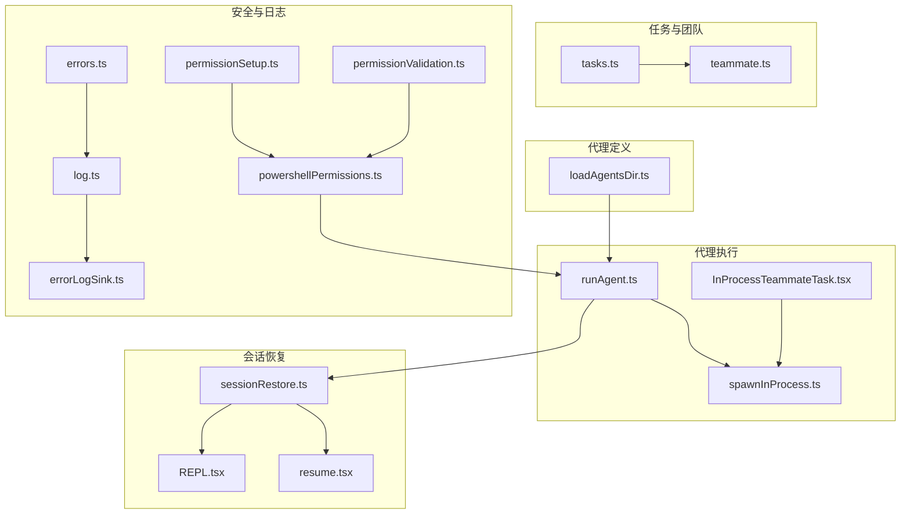
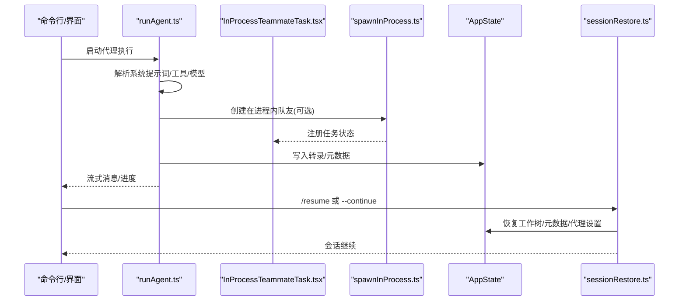
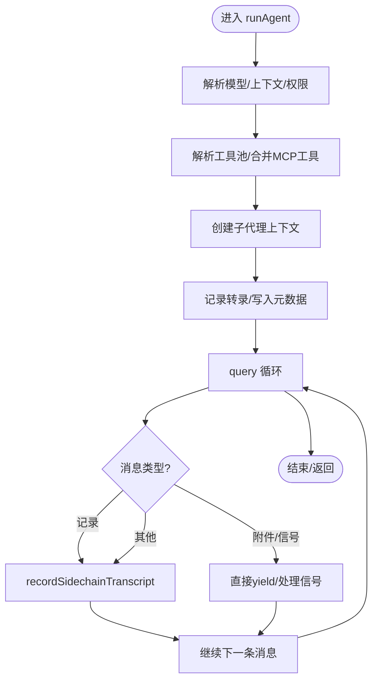
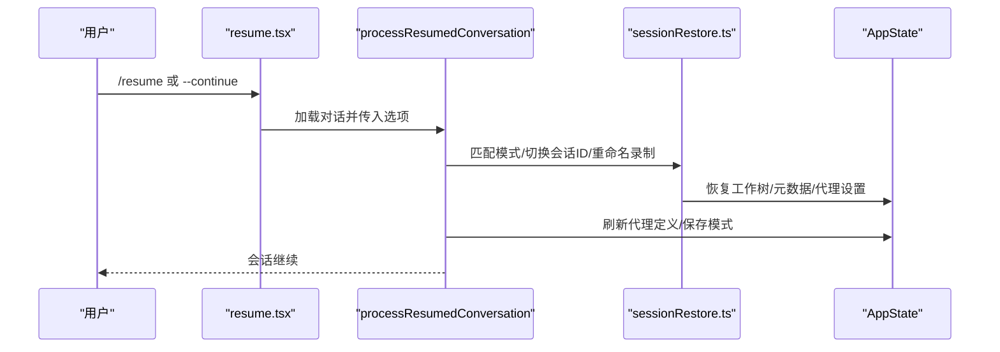
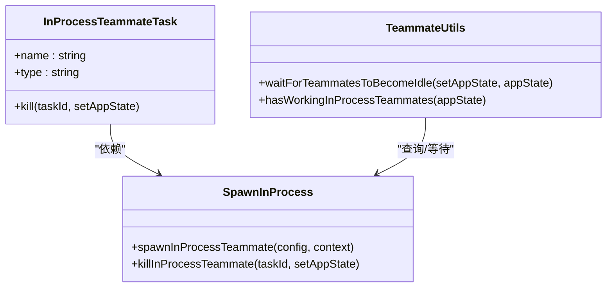
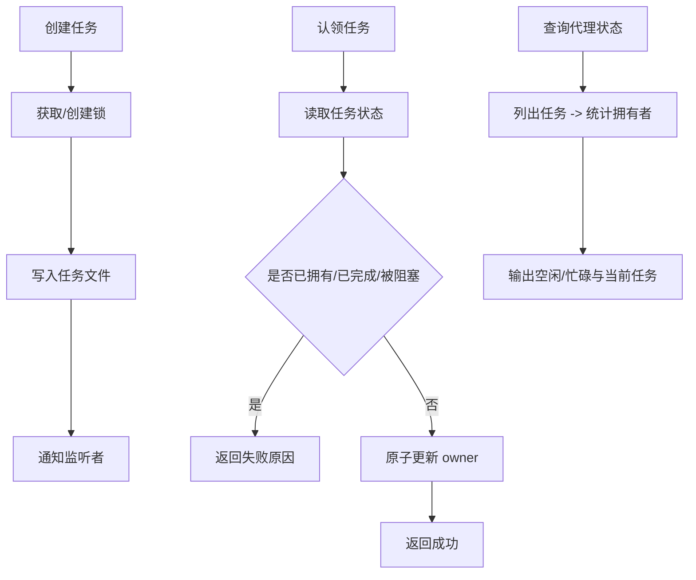
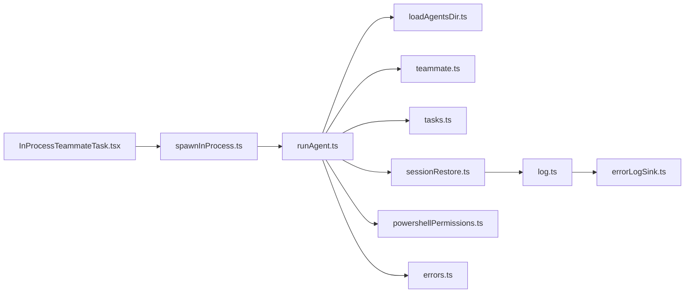

# 代理执行与协调

<cite>
**本文引用的文件**
- [runAgent.ts](file://src/tools/AgentTool/runAgent.ts)
- [sessionRestore.ts](file://src/utils/sessionRestore.ts)
- [InProcessTeammateTask.tsx](file://src/tasks/InProcessTeammateTask/InProcessTeammateTask.tsx)
- [spawnInProcess.ts](file://src/utils/swarm/spawnInProcess.ts)
- [teammate.ts](file://src/utils/teammate.ts)
- [tasks.ts](file://src/utils/tasks.ts)
- [loadAgentsDir.ts](file://src/tools/AgentTool/loadAgentsDir.ts)
- [REPL.tsx](file://src/screens/REPL.tsx)
- [resume.tsx](file://src/commands/resume/resume.tsx)
- [powershellPermissions.ts](file://src/tools/PowerShellTool/powershellPermissions.ts)
- [permissionSetup.ts](file://src/utils/permissions/permissionSetup.ts)
- [permissionValidation.ts](file://src/utils/settings/permissionValidation.ts)
- [errors.ts](file://src/utils/errors.ts)
- [log.ts](file://src/utils/log.ts)
- [errorLogSink.ts](file://src/utils/errorLogSink.ts)
</cite>

## 目录
1. [引言](#引言)
2. [项目结构](#项目结构)
3. [核心组件](#核心组件)
4. [架构总览](#架构总览)
5. [详细组件分析](#详细组件分析)
6. [依赖关系分析](#依赖关系分析)
7. [性能考虑](#性能考虑)
8. [故障排查指南](#故障排查指南)
9. [结论](#结论)
10. [附录](#附录)

## 引言
本技术文档系统性阐述代理执行与协调机制，覆盖以下关键主题：
- runAgent 的执行流程、参数配置与上下文隔离
- 恢复机制（resume）与状态同步
- 代理任务的创建与管理（含 InProcessTeammateTask）
- 代理间任务分配与协调
- 执行监控与控制
- 错误处理与异常恢复策略
- 性能优化建议
- 与主程序的交互方式
- 安全控制与权限管理

## 项目结构
围绕代理执行与协调的关键目录与文件：
- 代理执行入口与生命周期：runAgent.ts、InProcessTeammateTask.tsx、spawnInProcess.ts
- 会话恢复与状态同步：sessionRestore.ts、REPL.tsx、resume.tsx
- 任务系统与团队协作：tasks.ts、teammate.ts
- 代理定义与加载：loadAgentsDir.ts
- 权限与安全：powershellPermissions.ts、permissionSetup.ts、permissionValidation.ts
- 错误处理与日志：errors.ts、log.ts、errorLogSink.ts

图表来源
- [runAgent.ts:248-800](file://src/tools/AgentTool/runAgent.ts#L248-L800)
- [sessionRestore.ts:409-552](file://src/utils/sessionRestore.ts#L409-L552)
- [InProcessTeammateTask.tsx:24-30](file://src/tasks/InProcessTeammateTask/InProcessTeammateTask.tsx#L24-L30)
- [spawnInProcess.ts:104-216](file://src/utils/swarm/spawnInProcess.ts#L104-L216)
- [tasks.ts:199-210](file://src/utils/tasks.ts#L199-L210)
- [teammate.ts:205-231](file://src/utils/teammate.ts#L205-L231)
- [loadAgentsDir.ts:220-255](file://src/tools/AgentTool/loadAgentsDir.ts#L220-L255)
- [powershellPermissions.ts:639-668](file://src/tools/PowerShellTool/powershellPermissions.ts#L639-L668)
- [permissionSetup.ts:417-450](file://src/utils/permissions/permissionSetup.ts#L417-L450)
- [permissionValidation.ts:244-262](file://src/utils/settings/permissionValidation.ts#L244-L262)
- [errors.ts:111-171](file://src/utils/errors.ts#L111-L171)
- [log.ts:158-203](file://src/utils/log.ts#L158-L203)
- [errorLogSink.ts:225-235](file://src/utils/errorLogSink.ts#L225-L235)

章节来源
- [runAgent.ts:248-800](file://src/tools/AgentTool/runAgent.ts#L248-L800)
- [sessionRestore.ts:409-552](file://src/utils/sessionRestore.ts#L409-L552)
- [InProcessTeammateTask.tsx:24-30](file://src/tasks/InProcessTeammateTask/InProcessTeammateTask.tsx#L24-L30)
- [spawnInProcess.ts:104-216](file://src/utils/swarm/spawnInProcess.ts#L104-L216)
- [tasks.ts:199-210](file://src/utils/tasks.ts#L199-L210)
- [teammate.ts:205-231](file://src/utils/teammate.ts#L205-L231)
- [loadAgentsDir.ts:220-255](file://src/tools/AgentTool/loadAgentsDir.ts#L220-L255)
- [powershellPermissions.ts:639-668](file://src/tools/PowerShellTool/powershellPermissions.ts#L639-L668)
- [permissionSetup.ts:417-450](file://src/utils/permissions/permissionSetup.ts#L417-L450)
- [permissionValidation.ts:244-262](file://src/utils/settings/permissionValidation.ts#L244-L262)
- [errors.ts:111-171](file://src/utils/errors.ts#L111-L171)
- [log.ts:158-203](file://src/utils/log.ts#L158-L203)
- [errorLogSink.ts:225-235](file://src/utils/errorLogSink.ts#L225-L235)

## 核心组件
- runAgent：代理执行主流程，负责系统提示词构建、工具池解析、MCP 服务器连接、消息记录与转录、权限模式与提示策略、异步/同步上下文隔离、子代理派生与缓存安全参数传递等。
- InProcessTeammateTask：在进程内运行的队友代理生命周期管理，支持计划模式审批、空闲/活跃状态、注入用户消息、查找任务等。
- spawnInProcess：在同进程内创建并注册队友任务，使用 AsyncLocalStorage 隔离上下文，生成任务状态并注册清理回调。
- sessionRestore：会话恢复与状态重建，包括工作树恢复、会话元数据写入、代理类型与模型回填、协调员/普通模式切换后的代理定义刷新。
- tasks：任务列表持久化、任务声明与认领、阻塞关系维护、任务状态查询与并发锁。
- teammate：团队上下文识别与等待机制，用于判断是否需要等待在进程内队友完成工作。

章节来源
- [runAgent.ts:248-800](file://src/tools/AgentTool/runAgent.ts#L248-L800)
- [InProcessTeammateTask.tsx:24-30](file://src/tasks/InProcessTeammateTask/InProcessTeammateTask.tsx#L24-L30)
- [spawnInProcess.ts:104-216](file://src/utils/swarm/spawnInProcess.ts#L104-L216)
- [sessionRestore.ts:409-552](file://src/utils/sessionRestore.ts#L409-L552)
- [tasks.ts:284-308](file://src/utils/tasks.ts#L284-L308)
- [teammate.ts:238-292](file://src/utils/teammate.ts#L238-L292)

## 架构总览
代理执行与协调的整体架构由“代理执行引擎”“任务与团队系统”“会话恢复与状态同步”“权限与安全”“错误与日志”构成，通过 AppState 统一状态驱动。

图表来源
- [runAgent.ts:248-800](file://src/tools/AgentTool/runAgent.ts#L248-L800)
- [InProcessTeammateTask.tsx:24-30](file://src/tasks/InProcessTeammateTask/InProcessTeammateTask.tsx#L24-L30)
- [spawnInProcess.ts:104-216](file://src/utils/swarm/spawnInProcess.ts#L104-L216)
- [sessionRestore.ts:409-552](file://src/utils/sessionRestore.ts#L409-L552)

## 详细组件分析

### runAgent 执行流程与参数配置
- 参数与上下文
  - agentDefinition：代理定义（含系统提示词、最大轮次、权限模式、技能、MCP 服务器等）
  - promptMessages：初始消息
  - toolUseContext：工具使用上下文（包含父级 AppState、AbortController、MCP 客户端、思考配置等）
  - 可选参数：isAsync、canShowPermissionPrompts、forkContextMessages、querySource、override、model、maxTurns、availableTools、allowedTools、onCacheSafeParams、contentReplacementState、useExactTools、worktreePath、description、transcriptSubdir、onQueryProgress
- 关键步骤
  - 模型选择与覆写、系统提示词增强、用户/系统上下文裁剪与优化
  - 权限模式与提示策略：根据代理定义覆写权限模式；为异步代理设置避免弹窗；必要时等待自动化检查
  - 工具解析与合并：resolveAgentTools 与 MCP 工具去重合并
  - 子代理上下文创建：createSubagentContext，区分同步/异步隔离
  - 转录与元数据：recordSidechainTranscript、writeAgentMetadata
  - 查询循环：query 返回消息流，按需记录侧链转录，转发 API 指标
  - MCP 服务器初始化：initializeAgentMcpServers，支持动态创建与清理
- 缓存安全与一致性
  - onCacheSafeParams 回调用于后台摘要派生，确保 prompt cache 命中前缀一致
  - useExactTools 控制是否继承父级思考配置与非交互会话标志

图表来源
- [runAgent.ts:248-800](file://src/tools/AgentTool/runAgent.ts#L248-L800)

章节来源
- [runAgent.ts:248-800](file://src/tools/AgentTool/runAgent.ts#L248-L800)

### 恢复机制与状态同步（resume）
- 会话恢复路径
  - CLI 与交互式两种路径均调用 processResumedConversation，匹配协调员/普通模式，切换会话 ID，重命名录制文件，重置会话指针，恢复成本状态
  - 恢复工作树：restoreWorktreeForResume，若工作树目录不存在则清除缓存并覆盖状态
  - 恢复会话状态：restoreSessionStateFromLog，恢复文件历史、归属、上下文折叠快照、Todo 列表（非交互模式）
  - 代理设置回填：restoreAgentFromSession，回填代理类型与模型（若未被 CLI 覆盖）
  - 模式切换刷新：refreshAgentDefinitionsForModeSwitch，重新派生代理定义以适配新模式
- 交互式恢复
  - REPL 中匹配模式并警告，刷新代理定义，触发会话开始钩子，复制计划内容，恢复文件历史与归属状态

图表来源
- [resume.tsx:22-80](file://src/commands/resume/resume.tsx#L22-L80)
- [sessionRestore.ts:409-552](file://src/utils/sessionRestore.ts#L409-L552)
- [REPL.tsx:1742-1803](file://src/screens/REPL.tsx#L1742-L1803)

章节来源
- [resume.tsx:22-80](file://src/commands/resume/resume.tsx#L22-L80)
- [sessionRestore.ts:409-552](file://src/utils/sessionRestore.ts#L409-L552)
- [REPL.tsx:1742-1803](file://src/screens/REPL.tsx#L1742-L1803)

### 代理任务的创建与管理（InProcessTeammateTask）
- InProcessTeammateTask 实现 Task 接口，提供 kill 能力
- spawnInProcess 创建队友任务：
  - 生成 agentId 与 taskId
  - 创建 AbortController 与 AsyncLocalStorage 上下文
  - 初始化任务状态（运行中、空闲、计划模式要求、消息队列等）
  - 注册清理回调与 AppState 任务
- 状态查询与等待：
  - waitForTeammatesToBecomeIdle：当有在进程内队友处于“运行但非空闲”时，注册回调等待其变为空闲
  - hasWorkingInProcessTeammates：检测是否存在仍在工作的在进程内队友

图表来源
- [InProcessTeammateTask.tsx:24-30](file://src/tasks/InProcessTeammateTask/InProcessTeammateTask.tsx#L24-L30)
- [spawnInProcess.ts:104-216](file://src/utils/swarm/spawnInProcess.ts#L104-L216)
- [teammate.ts:238-292](file://src/utils/teammate.ts#L238-L292)

章节来源
- [InProcessTeammateTask.tsx:24-30](file://src/tasks/InProcessTeammateTask/InProcessTeammateTask.tsx#L24-L30)
- [spawnInProcess.ts:104-216](file://src/utils/swarm/spawnInProcess.ts#L104-L216)
- [teammate.ts:238-292](file://src/utils/teammate.ts#L238-L292)

### 代理间任务分配与协调
- 任务存储与列表
  - getTaskListId：优先使用在进程内队友的团队名，否则回退到团队名或会话 ID
  - 任务文件锁：ensureTaskListLockFile，防止并发冲突
  - createTask/updateTask/deleteTask/listTasks/blockTask：原子化 CRUD 与阻塞关系维护
- 任务认领
  - claimTask：支持原子检查代理忙碌状态与阻塞关系，避免竞争条件
  - getAgentStatuses：基于任务拥有者统计代理空闲/忙碌状态
- 团队上下文
  - teammate.ts 提供 isTeammate、isTeamLead、getParentSessionId 等，支撑跨进程/同进程的团队识别与等待

图表来源
- [tasks.ts:284-308](file://src/utils/tasks.ts#L284-L308)
- [tasks.ts:541-612](file://src/utils/tasks.ts#L541-L612)
- [tasks.ts:763-798](file://src/utils/tasks.ts#L763-L798)
- [teammate.ts:171-198](file://src/utils/teammate.ts#L171-L198)

章节来源
- [tasks.ts:199-210](file://src/utils/tasks.ts#L199-L210)
- [tasks.ts:284-308](file://src/utils/tasks.ts#L284-L308)
- [tasks.ts:541-612](file://src/utils/tasks.ts#L541-L612)
- [tasks.ts:763-798](file://src/utils/tasks.ts#L763-L798)
- [teammate.ts:171-198](file://src/utils/teammate.ts#L171-L198)

### 执行监控与控制
- 进度与指标
  - runAgent 在流事件到达时推送 API 指标（TTFT/OTPS），便于前端显示
  - onQueryProgress 回调用于长单块流（如思考）检测活性
- 等待与停止
  - waitForTeammatesToBecomeIdle：等待在进程内队友全部空闲
  - requestTeammateShutdown：请求队友优雅关闭
  - killInProcessTeammate：终止队友 AbortController 并清理状态
- 转录与元数据
  - recordSidechainTranscript：按消息增量记录，保持父链连续
  - writeAgentMetadata：记录代理类型、工作树路径、描述等

章节来源
- [runAgent.ts:748-800](file://src/tools/AgentTool/runAgent.ts#L748-L800)
- [teammate.ts:238-292](file://src/utils/teammate.ts#L238-L292)
- [InProcessTeammateTask.tsx:35-44](file://src/tasks/InProcessTeammateTask/InProcessTeammateTask.tsx#L35-L44)
- [spawnInProcess.ts:227-328](file://src/utils/swarm/spawnInProcess.ts#L227-L328)

### 错误处理与异常恢复策略
- 错误捕获与标准化
  - toError/shortErrorStack：统一错误对象与短栈输出，避免泄露内部堆栈
  - errorMessage/getErrnoCode：提取消息与系统错误码
- 日志与错误上报
  - logError：在硬失败模式下直接退出；支持内存队列与文件 sink
  - errorLogSink：初始化后将错误写入磁盘 JSONL 文件，支持 MCP 日志
- 恢复与降级
  - sessionRestore：工作树目录不存在时自动清理缓存并覆盖状态
  - 代理 MCP 清理：initializeAgentMcpServers 对动态创建的客户端进行清理
  - SDK 事件：emitTaskTerminatedSdk 用于 SDK 任务生命周期结束

章节来源
- [errors.ts:111-171](file://src/utils/errors.ts#L111-L171)
- [log.ts:158-203](file://src/utils/log.ts#L158-L203)
- [errorLogSink.ts:225-235](file://src/utils/errorLogSink.ts#L225-L235)
- [sessionRestore.ts:332-366](file://src/utils/sessionRestore.ts#L332-L366)
- [runAgent.ts:194-217](file://src/tools/AgentTool/runAgent.ts#L194-L217)

### 代理执行与主程序的交互方式
- runAgent 通过 ToolUseContext 与主程序共享 AppState、AbortController、MCP 客户端等
- 子代理上下文 createSubagentContext 支持同步/异步隔离，异步代理独立 AbortController
- 会话恢复通过 processResumedConversation 与 REPL/CLI 共同完成，匹配模式并刷新代理定义

章节来源
- [runAgent.ts:700-714](file://src/tools/AgentTool/runAgent.ts#L700-L714)
- [sessionRestore.ts:409-552](file://src/utils/sessionRestore.ts#L409-L552)
- [REPL.tsx:1742-1769](file://src/screens/REPL.tsx#L1742-L1769)

### 安全控制与权限管理
- 权限检查流程（PowerShell 示例）
  - exactMatch/deny/ask/allow 规则优先于解析有效性
  - 安全检查 powershellCommandIsSafe，再返回允许/询问/拒绝
- 权限规则验证与危险规则检测
  - permissionValidation：自定义 Zod Schema 校验规则字符串
  - permissionSetup：检测过宽的允许规则（如 PowerShell(*)），并标注来源
- 代理权限模式
  - runAgent：根据代理定义覆写权限模式；异步代理避免弹窗；必要时等待自动化检查

章节来源
- [powershellPermissions.ts:639-668](file://src/tools/PowerShellTool/powershellPermissions.ts#L639-L668)
- [permissionSetup.ts:417-450](file://src/utils/permissions/permissionSetup.ts#L417-L450)
- [permissionValidation.ts:244-262](file://src/utils/settings/permissionValidation.ts#L244-L262)
- [runAgent.ts:412-498](file://src/tools/AgentTool/runAgent.ts#L412-L498)

## 依赖关系分析
- runAgent 依赖工具解析、MCP 客户端、系统提示词、转录与元数据、权限上下文
- InProcessTeammateTask 依赖 spawnInProcess 的任务注册与清理
- tasks 依赖文件锁与任务文件结构，提供原子操作
- sessionRestore 依赖工作树、会话元数据、代理定义刷新
- 权限模块相互配合，形成从规则校验到安全检查的闭环

图表来源
- [runAgent.ts:248-800](file://src/tools/AgentTool/runAgent.ts#L248-L800)
- [loadAgentsDir.ts:220-255](file://src/tools/AgentTool/loadAgentsDir.ts#L220-L255)
- [teammate.ts:205-231](file://src/utils/teammate.ts#L205-L231)
- [tasks.ts:284-308](file://src/utils/tasks.ts#L284-L308)
- [sessionRestore.ts:409-552](file://src/utils/sessionRestore.ts#L409-L552)
- [powershellPermissions.ts:639-668](file://src/tools/PowerShellTool/powershellPermissions.ts#L639-L668)
- [errors.ts:111-171](file://src/utils/errors.ts#L111-L171)
- [log.ts:158-203](file://src/utils/log.ts#L158-L203)
- [errorLogSink.ts:225-235](file://src/utils/errorLogSink.ts#L225-L235)
- [spawnInProcess.ts:104-216](file://src/utils/swarm/spawnInProcess.ts#L104-L216)
- [InProcessTeammateTask.tsx:24-30](file://src/tasks/InProcessTeammateTask/InProcessTeammateTask.tsx#L24-L30)

章节来源
- [runAgent.ts:248-800](file://src/tools/AgentTool/runAgent.ts#L248-L800)
- [loadAgentsDir.ts:220-255](file://src/tools/AgentTool/loadAgentsDir.ts#L220-L255)
- [teammate.ts:205-231](file://src/utils/teammate.ts#L205-L231)
- [tasks.ts:284-308](file://src/utils/tasks.ts#L284-L308)
- [sessionRestore.ts:409-552](file://src/utils/sessionRestore.ts#L409-L552)
- [powershellPermissions.ts:639-668](file://src/tools/PowerShellTool/powershellPermissions.ts#L639-L668)
- [errors.ts:111-171](file://src/utils/errors.ts#L111-L171)
- [log.ts:158-203](file://src/utils/log.ts#L158-L203)
- [errorLogSink.ts:225-235](file://src/utils/errorLogSink.ts#L225-L235)
- [spawnInProcess.ts:104-216](file://src/utils/swarm/spawnInProcess.ts#L104-L216)
- [InProcessTeammateTask.tsx:24-30](file://src/tasks/InProcessTeammateTask/InProcessTeammateTask.tsx#L24-L30)

## 性能考虑
- 工具与上下文裁剪
  - Explore/Plan 代理剔除 CLAUDE.md 与 gitStatus 上下文，减少令牌消耗
  - 使用 read-only 文件状态缓存，限制大小
- 子代理缓存安全
  - useExactTools 与 onCacheSafeParams 保证 prompt cache 命中前缀一致，提升缓存命中率
- IO 与锁
  - 任务系统采用文件锁与高水位标记，避免竞态与 ID 复用
- 异步隔离
  - 异步代理独立 AbortController，避免与主流程耦合导致的阻塞

章节来源
- [runAgent.ts:390-411](file://src/tools/AgentTool/runAgent.ts#L390-L411)
- [runAgent.ts:682-695](file://src/tools/AgentTool/runAgent.ts#L682-L695)
- [tasks.ts:147-188](file://src/utils/tasks.ts#L147-L188)

## 故障排查指南
- 常见问题定位
  - 错误标准化：使用 toError/shortErrorStack 获取最小化错误信息
  - 文件系统错误：通过 getErrnoCode 判断 ENOENT 等错误码
  - 日志定位：启用 errorLogSink，查看当日错误 JSONL 与 MCP 日志
- 恢复问题
  - 工作树目录不存在：restoreWorktreeForResume 会覆盖缓存并清理状态
  - 代理定义不匹配：refreshAgentDefinitionsForModeSwitch 刷新内置代理定义
- 权限问题
  - 规则校验失败：permissionValidation 提示具体错误与示例
  - 过宽规则：permissionSetup 标注来源并给出建议

章节来源
- [errors.ts:111-171](file://src/utils/errors.ts#L111-L171)
- [log.ts:158-203](file://src/utils/log.ts#L158-L203)
- [errorLogSink.ts:225-235](file://src/utils/errorLogSink.ts#L225-L235)
- [sessionRestore.ts:332-366](file://src/utils/sessionRestore.ts#L332-L366)
- [permissionValidation.ts:244-262](file://src/utils/settings/permissionValidation.ts#L244-L262)
- [permissionSetup.ts:417-450](file://src/utils/permissions/permissionSetup.ts#L417-L450)

## 结论
该体系通过 runAgent 的统一执行框架、InProcessTeammateTask 的进程内隔离、tasks 的原子化任务管理、sessionRestore 的会话恢复能力以及完善的权限与日志体系，实现了稳定、可观测、可扩展的代理执行与协调机制。结合性能优化策略与故障排查手段，可在复杂场景下保持高可靠与高效率。

## 附录
- 关键 API 与路径
  - runAgent：[runAgent.ts:248-800](file://src/tools/AgentTool/runAgent.ts#L248-L800)
  - 会话恢复：[sessionRestore.ts:409-552](file://src/utils/sessionRestore.ts#L409-L552)
  - 在进程内队友：[InProcessTeammateTask.tsx:24-30](file://src/tasks/InProcessTeammateTask/InProcessTeammateTask.tsx#L24-L30)、[spawnInProcess.ts:104-216](file://src/utils/swarm/spawnInProcess.ts#L104-L216)
  - 任务系统：[tasks.ts:284-308](file://src/utils/tasks.ts#L284-L308)
  - 团队等待：[teammate.ts:238-292](file://src/utils/teammate.ts#L238-L292)
  - 权限检查：[powershellPermissions.ts:639-668](file://src/tools/PowerShellTool/powershellPermissions.ts#L639-L668)
  - 错误与日志：[errors.ts:111-171](file://src/utils/errors.ts#L111-L171)、[log.ts:158-203](file://src/utils/log.ts#L158-L203)、[errorLogSink.ts:225-235](file://src/utils/errorLogSink.ts#L225-L235)